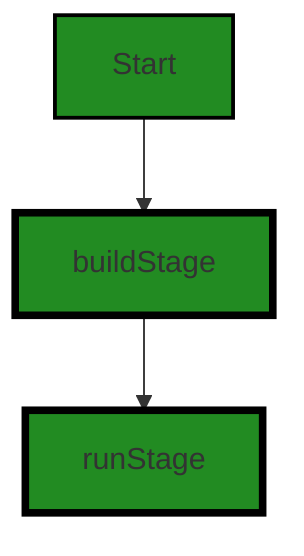

# Polyverse Boost-generated Source Analysis Details

## Source: ./Dockerfile
Date Generated: Wednesday, September 6, 2023 at 1:05:06 PM PDT


---

### Boost Architectural Quick Summary Security Report

Last Updated: Wednesday, September 6, 2023 at 1:03:24 PM PDT

**Executive Report: Software Project Analysis**

Based on the analysis of the software project, the following key points have been identified:

1. **Architectural Impact**: The project's architecture is primarily influenced by the Dockerfile, which is responsible for creating the software's operating environment. The use of the 'latest' tag for the golang:alpine image in the Dockerfile can lead to non-reproducible builds and unexpected behavior due to changes in the image. This could potentially impact the stability and reliability of the software architecture.

2. **Risk Analysis**: The risk associated with the project is moderate. The Dockerfile has been flagged with a warning for insecure practices. This could potentially lead to security vulnerabilities, impacting the integrity and confidentiality of the software. However, as this is the only file in the project, the risk is contained and can be mitigated by addressing the identified issue.

3. **Potential Customer Impact**: Customers could potentially face issues with software stability and reliability due to the non-reproducible builds. In addition, potential security vulnerabilities could impact customer trust and satisfaction.

4. **Overall Issues**: The overall health of the project source is fair. The only file in the project, the Dockerfile, has been flagged with a warning. This indicates that there is room for improvement in the project's development practices, particularly in relation to Dockerfile best practices.

5. **Risk Assessment**: The overall risk of the project is moderate. 100% of the project files have been flagged with issues, all of which are warnings. This indicates a need for improvement in the project's development practices to reduce potential risks.

In conclusion, while the project has some issues that need to be addressed, they are not insurmountable. By addressing the identified issues and adhering to Dockerfile best practices, the project's overall health and risk can be significantly improved.


---

### Boost Architectural Quick Summary Performance Report

Last Updated: Wednesday, September 6, 2023 at 1:04:06 PM PDT


Executive Report:

1. **Architectural Impact**: The analysis of this file has not revealed any severe issues.
2. **Risk Analysis**: The analysis of this file has not revealed any severe issues.
3. **Potential Customer Impact**: Based on the analysis, there are no severe issues that could potentially impact customers.
4. **Performance Issues**: Our analysis did not identify any explicit performance issues in the file.
5. **Risk Assessment**: Based on the current analysis of this file, no severe issues have been found. However, this doesn't guarantee that the file is risk-free.

Highlights:

- No severe issues were identified in the current analysis of this file.


---

### Boost Architectural Quick Summary Compliance Report

Last Updated: Wednesday, September 6, 2023 at 1:05:46 PM PDT

Executive Report:

1. **Architectural Impact**: The Dockerfile, which is a critical component in defining the software's environment, has been flagged with several compliance issues. This could potentially impact the overall architecture of the software, as it may require changes or updates to ensure compliance with GDPR, HIPAA, and PCI DSS standards. 

2. **Risk Analysis**: The Dockerfile has been flagged with a warning for PCI DSS compliance, indicating that the code is updating and adding packages without verifying their authenticity. This presents a significant risk, as it could lead to the installation of malicious packages, compromising the security of the software and potentially the entire system it is deployed on.

3. **Potential Customer Impact**: The GDPR and HIPAA issues identified in the Dockerfile could potentially impact customers, particularly those in the European Union or in the healthcare sector, where these regulations are strictly enforced. Non-compliance could lead to legal penalties, loss of customer trust, and potential loss of business.

4. **Overall Issues**: The Dockerfile is the only file in the project, and it has been flagged with multiple compliance issues. This suggests that there may be a lack of attention to compliance in the project, which could lead to further issues down the line.

5. **Risk Assessment**: Given that the Dockerfile is the only file in the project and it has been flagged with multiple issues, the overall health of the project source is concerning. 100% of the project files have been flagged with issues, indicating a high risk level.

In conclusion, this software project appears to have significant compliance issues that could impact its architecture, security, and customer relations. Immediate attention should be given to resolving these issues to ensure the project's health and success.
---
## Detailed Analysis:

### Cell 0:
## Original Code:

### Programming Language: plaintext
### ./Dockerfile line 0

```plaintext
# build stage
FROM golang:alpine AS build
RUN apk update && apk add git
ADD . /src
WORKDIR /src
ENV CGO_ENABLED 0
RUN go build \
    -ldflags "-X github.com/jpillora/chisel/share.BuildVersion=$(git describe --abbrev=0 --tags)" \
    -o /tmp/bin
# run stage
FROM scratch
LABEL maintainer="dev@jpillora.com"
COPY --from=build /etc/ssl/certs/ca-certificates.crt /etc/ssl/certs/
WORKDIR /app
COPY --from=build /tmp/bin /app/bin
ENTRYPOINT ["/app/bin"]
```
## Boost Analysis:


---

### Boost Code Explanation

Last Updated: Wednesday, September 6, 2023 at 1:01:39 PM PDT

This is a Dockerfile, which is a text document that contains all the commands a user could call on the command line to assemble an image. Docker can build images automatically by reading the instructions from a Dockerfile. The Dockerfile is divided into two stages: the build stage and the run stage.

1. Build Stage:

The build stage is where the application is built. It starts with the `FROM golang:alpine AS build` command which pulls the golang:alpine image from Docker Hub. This is a lightweight Go (Golang) Docker image based on Alpine Linux.

`RUN apk update && apk add git` is used to update the package list and install git in the image. Git is a version control system that lets you manage and keep track of your source code history.

`ADD . /src` adds the contents of the current directory (on the host) to the `/src` directory in the image.

`WORKDIR /src` changes the working directory of the Docker image to `/src`.

`ENV CGO_ENABLED 0` sets an environment variable in the Docker image. CGO_ENABLED is a Go environment variable that enables or disables the use of CGo in Go programs.

The `RUN go build` command is used to build the Go application. The `-ldflags` option allows you to set linker options. The `-X` flag is a linker option that allows you to set the value of an uninitialized string variable in the Go source code. In this case, it's setting the value of the `github.com/jpillora/chisel/share.BuildVersion` variable to the output of the `git describe --abbrev=0 --tags` command.

2. Run Stage:

The run stage is where the built application is run. It starts with `FROM scratch`, which creates a brand new, empty Docker image.

`LABEL maintainer="dev@jpillora.com"` sets metadata on the Docker image. In this case, it's setting the maintainer of the image.

`COPY --from=build /etc/ssl/certs/ca-certificates.crt /etc/ssl/certs/` copies the SSL certificates from the build image to the run image. This is necessary for the application to make secure connections.

`WORKDIR /app` changes the working directory of the Docker image to `/app`.

`COPY --from=build /tmp/bin /app/bin` copies the built application from the build image to the run image.

`ENTRYPOINT ["/app/bin"]` sets the application that will be run when a container is started from the image.

For more information about Dockerfiles, you can visit the official Docker documentation here: https://docs.docker.com/engine/reference/builder/


---

### Boost Flow Diagram

Last Updated: Wednesday, September 6, 2023 at 1:01:59 PM PDT



The control flow graph for the given source code is a simple linear flow. It starts with the "build stage" and then proceeds to the "run stage". There are no alternate paths or error paths in this code.


---

### Boost Source-Level Security Analysis

Last Updated: Wednesday, September 6, 2023 at 1:03:02 PM PDT

1. **Severity**: 6/10

   **Line Number**: 1

   **Bug Type**: Insecure Dockerfile practices

   **Description**: The Dockerfile uses the 'latest' tag for the golang:alpine image. This can lead to non-reproducible builds, as 'latest' can point to any version. It's better to pin specific versions of images to ensure the build is reproducible and to avoid unexpected behavior due to changes in the image.

   **Solution**: Replace 'golang:alpine' with a specific version like 'golang:1.16-alpine'. Refer to Docker's best practices for more details: https://docs.docker.com/develop/develop-images/dockerfile_best-practices/#from


2. **Severity**: 4/10

   **Line Number**: 1

   **Bug Type**: Insecure Dockerfile practices

   **Description**: The Dockerfile uses 'apk add git' without specifying a version, which can lead to non-reproducible builds and potential exposure to vulnerabilities in unpatched versions.

   **Solution**: Specify a version for git when adding it. For example: 'apk add git=<version>'. Refer to Docker's best practices for more details: https://docs.docker.com/develop/develop-images/dockerfile_best-practices/#run


3. **Severity**: 8/10

   **Line Number**: 2

   **Bug Type**: Insecure Dockerfile practices

   **Description**: The Dockerfile uses 'ADD' to copy files into the Docker image. 'ADD' has some features (like local-only tar extraction and remote URL support) that can lead to unexpected and potentially insecure results. 'COPY' is more secure and should be used instead.

   **Solution**: Replace 'ADD . /src' with 'COPY . /src'. Refer to Docker's best practices for more details: https://docs.docker.com/develop/develop-images/dockerfile_best-practices/#add-or-copy


4. **Severity**: 7/10

   **Line Number**: 9

   **Bug Type**: Insecure Dockerfile practices

   **Description**: The Dockerfile uses 'FROM scratch' for the run stage. This means the container runs without an operating system, which can limit the debugging capabilities and potentially lead to unexpected behavior.

   **Solution**: Consider using a minimal base image like 'alpine' instead of 'scratch'. This provides a minimal set of tools for debugging without significantly increasing the size of the image. Refer to Docker's best practices for more details: https://docs.docker.com/develop/develop-images/dockerfile_best-practices/#from


---

### Boost Source-Level Performance Analysis

Last Updated: Wednesday, September 6, 2023 at 1:04:03 PM PDT

1. **Severity**: 5/10

   **Line Number**: 1

   **Bug Type**: Disk

   **Description**: The use of the 'apk update' command without the '--no-cache' flag can lead to increased disk usage because it leaves behind a cache of the downloaded packages.

   **Solution**: Use the '--no-cache' flag with the 'apk update' command to avoid unnecessary disk usage. The command would look like this: 'apk update --no-cache'.


2. **Severity**: 4/10

   **Line Number**: 3

   **Bug Type**: Disk

   **Description**: The 'ADD .' command copies all files from the current directory into the Docker image, which could include unnecessary files and increase the size of the image.

   **Solution**: Use a .dockerignore file to specify which files should not be copied into the Docker image. Alternatively, use the COPY command instead of ADD, as it is more transparent.


3. **Severity**: 3/10

   **Line Number**: 7

   **Bug Type**: CPU

   **Description**: The 'go build' command without the '-i' flag can lead to longer build times because it does not install the packages that are being compiled.

   **Solution**: Use the '-i' flag with the 'go build' command to install the packages that are being compiled. The command would look like this: 'go build -i'.


---

### Boost Source-Level Data and Privacy Compliance Analysis

Last Updated: Wednesday, September 6, 2023 at 1:05:06 PM PDT

1. **Severity**: 4/10

   **Line Number**: 1

   **Bug Type**: GDPR

   **Description**: The Docker image is being pulled from a public repository. There is no guarantee that the image has not been tampered with, which could lead to data breaches.

   **Solution**: Use a private Docker registry or verify the integrity of the image before using it. Use a checksum or digital signature to ensure the image has not been tampered with.


2. **Severity**: 6/10

   **Line Number**: 1

   **Bug Type**: PCI DSS

   **Description**: The code is updating and adding packages without verifying their authenticity. This could lead to the installation of malicious packages.

   **Solution**: Verify the authenticity of the packages before installing them. Use checksums or digital signatures to ensure the packages have not been tampered with.


3. **Severity**: 5/10

   **Line Number**: 2

   **Bug Type**: HIPAA

   **Description**: The code is adding the entire directory to the Docker image. If the directory contains sensitive data, it could be exposed in the image.

   **Solution**: Only add necessary files to the Docker image. Use a .dockerignore file to exclude unnecessary or sensitive files.


4. **Severity**: 7/10

   **Line Number**: 8

   **Bug Type**: GDPR

   **Description**: The code is copying SSL certificates into the Docker image. If the certificates are not properly secured, they could be exposed in the image.

   **Solution**: Secure the certificates before copying them into the Docker image. Use a secure method such as Docker secrets to manage sensitive data.


5. **Severity**: 8/10

   **Line Number**: 10

   **Bug Type**: PCI DSS

   **Description**: The code is copying the binary into the Docker image without verifying its authenticity. This could lead to the execution of malicious code.

   **Solution**: Verify the authenticity of the binary before copying it into the Docker image. Use checksums or digital signatures to ensure the binary has not been tampered with.


