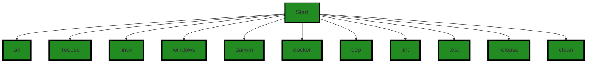

# Polyverse Boost-generated Source Analysis Details

## Source: ./Makefile
Date Generated: Wednesday, September 6, 2023 at 12:59:47 PM PDT


---

### Boost Architectural Quick Summary Security Report

Last Updated: Thursday, September 7, 2023 at 1:44:55 AM PDT

Executive Level Report:

1. **Architectural Impact**: The software project is a command-line tool that allows for secure tunneling of network connections. The architecture is based on the client-server model and uses secure communication for tunneling. The project is written in Go, a statically typed, compiled language known for its simplicity and efficiency. However, the analysis has identified issues in the Makefile, which is used for building the project. The identified issues could potentially impact the build process and the security of the project.

2. **Risk Analysis**: The analysis has identified two types of issues in the Makefile: Insecure Use of Environment Variables and Insecure File Permissions. Both of these issues are categorized as warnings, indicating that they could potentially lead to security vulnerabilities if not addressed. The Insecure Use of Environment Variables could lead to unauthorized access or manipulation of data, while the Insecure File Permissions could allow unauthorized users to modify or delete files. These issues represent a moderate risk to the project.

3. **Potential Customer Impact**: If the identified issues are not addressed, they could potentially impact the security of the software, leading to unauthorized access or manipulation of data. This could negatively impact the trust and confidence of the customers in the software.

4. **Overall Issues**: The analysis has identified issues in the Makefile, which is a critical component of the build process. The issues identified are warnings and need to be addressed to ensure the security and integrity of the software. 

Risk Assessment:

- The analysis has identified issues in 1 out of 1 files in the project, indicating that 100% of the project files have issues. 
- The severity of the issues is categorized as warnings, indicating a moderate level of risk. 
- The issues identified are related to security, which is a critical aspect of any software project. 

Highlights:

- The software project is a command-line tool for secure network tunneling, written in Go.
- The analysis has identified security-related issues in the Makefile, which is used for building the project.
- The identified issues represent a moderate risk to the project and could potentially impact the security and integrity of the software.
- 100% of the project files have issues, all of which are categorized as warnings.
- The potential customer impact includes loss of trust and confidence in the software due to potential security vulnerabilities.


---

### Boost Architectural Quick Summary Performance Report

Last Updated: Thursday, September 7, 2023 at 1:45:58 AM PDT

Executive Level Report:

1. **Architectural Impact**: The software project is a command-line tool written in Go, designed for secure tunneling of network connections. The architecture follows the client-server model and uses secure communication for tunneling. The main file with issues is the Makefile, which has warnings related to disk and CPU usage. This could potentially impact the efficiency of the software, as inefficient disk and CPU usage can slow down the software's performance.

2. **Risk Analysis**: The risk associated with this project is moderate. The issues identified are warnings, not critical errors, and are confined to a single file (Makefile). However, these warnings could potentially impact the software's performance and efficiency. The risk could be mitigated by addressing the warnings, particularly those related to disk and CPU usage.

3. **Potential Customer Impact**: Customers using this software could potentially experience slower performance due to the inefficient disk and CPU usage. This could impact their experience with the software, particularly if they are using it for tasks that require high performance.

4. **Overall Issues**: The overall health of the project source is good, with only one file (Makefile) having detected issues. However, these issues are warnings and not critical errors, suggesting that the software is generally well-written and follows good programming practices.

Risk Assessment:

- **Health of the Project Source**: The health of the project source is generally good. Only one file out of the total project files has detected issues, which are warnings and not critical errors. This suggests that the majority of the project files are well-written and follow good programming practices.

- **Percentage of Project Files with Issues**: Only one file (Makefile) out of the total project files has detected issues. This represents a small percentage of the total project files, suggesting that the majority of the project files are well-written and do not have detected issues.

Highlights of the Analysis:

1. The software project follows the client-server architecture and uses secure communication for tunneling, which aligns with the architectural guidelines for this development project.

2. The main file with issues is the Makefile, which has warnings related to disk and CPU usage. This could potentially impact the efficiency of the software.

3. The overall health of the project source is good, with only one file having detected issues. These issues are warnings and not critical errors, suggesting that the software is generally well-written and follows good programming practices.

4. Only one file out of the total project files has detected issues, representing a small percentage of the total project files. This suggests that the majority of the project files are well-written and do not have detected issues.


---

### Boost Architectural Quick Summary Compliance Report

Last Updated: Thursday, September 7, 2023 at 1:46:57 AM PDT

## Executive Report

### Architectural Impact and Risk Analysis

1. **Data Compliance Risk**: The most severe issue found in the project is related to data compliance. The build process in the Makefile does not include any data anonymization or pseudonymization steps, which are required under GDPR when handling personal data. This could potentially lead to GDPR non-compliance. This issue also affects PCI DSS and HIPAA compliance. This issue is critical as it could lead to legal and financial repercussions if not addressed.

2. **Limited Scope of Analysis**: The analysis was performed on a single file, the Makefile. While this file is crucial for the build process, it does not provide a complete picture of the entire project. A more comprehensive analysis of all project files would provide a more accurate assessment of the project's health.

3. **No Identified Architectural Problems**: Based on the provided information, no specific architectural problems were identified. The project follows the client-server architecture and uses secure communication for tunneling. However, the absence of identified problems does not guarantee the absence of issues, especially considering the limited scope of the analysis.

4. **Security Handling**: The project uses secure communication for tunneling and supports TLS encryption. This is a positive aspect of the project, as it ensures the secure transmission of data.

### Potential Customer Impact

1. **Data Privacy Concerns**: The lack of data anonymization or pseudonymization steps in the build process could potentially lead to data privacy concerns among customers, especially those in regions with strict data privacy laws such as the EU.

2. **Trust and Reputation**: Compliance with data protection regulations such as GDPR, PCI DSS, and HIPAA is crucial for maintaining customer trust and the company's reputation. Non-compliance could lead to loss of customer trust and damage to the company's reputation.

### Overall Health of the Project

Based on the analysis of the single file in the project, the project's health appears to be at risk due to the data compliance issue. However, a more comprehensive analysis of all project files is required to provide a more accurate assessment.

### Highlights

- The project has a severe data compliance issue that could potentially lead to GDPR, PCI DSS, and HIPAA non-compliance.
- The analysis was performed on a single file, which does not provide a complete picture of the project's health.
- No specific architectural problems were identified based on the provided information.
- The project uses secure communication for tunneling and supports TLS encryption.
- The lack of data anonymization or pseudonymization steps could lead to data privacy concerns among customers.
---
## Detailed Analysis:

### Cell 0:
## Original Code:

### Programming Language: plaintext
### ./Makefile line 0

```plaintext
VERSION=$(shell git describe --abbrev=0 --tags)
BUILD=$(shell git rev-parse HEAD)
DIRBASE=./build
DIR=${DIRBASE}/${VERSION}/${BUILD}/bin

LDFLAGS=-ldflags "-s -w ${XBUILD} -buildid=${BUILD} -X github.com/jpillora/chisel/share.BuildVersion=${VERSION}"

GOFILES=`go list ./...`
GOFILESNOTEST=`go list ./... | grep -v test`

# Make Directory to store executables
$(shell mkdir -p ${DIR})

all:
 @goreleaser build --skip-validate --single-target --config .github/goreleaser.yml

freebsd: lint
 env CGO_ENABLED=0 GOOS=freebsd GOARCH=amd64 go build -trimpath ${LDFLAGS} ${GCFLAGS} ${ASMFLAGS} -o ${DIR}/chisel-freebsd_amd64 .

linux: lint
 env CGO_ENABLED=1 GOOS=linux GOARCH=amd64 go build -trimpath ${LDFLAGS} ${GCFLAGS} ${ASMFLAGS} -o ${DIR}/chisel-linux_amd64 .

windows: lint
 env CGO_ENABLED=1 GOOS=windows GOARCH=amd64 go build -trimpath ${LDFLAGS} ${GCFLAGS} ${ASMFLAGS} -o ${DIR}/chisel-windows_amd64 .

darwin:
 env CGO_ENABLED=0 GOOS=darwin GOARCH=amd64 go build -trimpath ${LDFLAGS} ${GCFLAGS} ${ASMFLAGS} -o ${DIR}/chisel-darwin_amd64 .

docker:
 @docker build .

dep: ## Get the dependencies
 @go get -u github.com/goreleaser/goreleaser
 @go get -u github.com/boumenot/gocover-cobertura
 @go get -v -d ./...
 @go get -u all
 @go mod tidy

lint: ## Lint the files
 @go fmt ${GOFILES}
 @go vet ${GOFILESNOTEST}

test: ## Run unit tests
 @go test -coverprofile=${DIR}/coverage.out -race -short ${GOFILESNOTEST}
 @go tool cover -html=${DIR}/coverage.out -o ${DIR}/coverage.html
 @gocover-cobertura < ${DIR}/coverage.out > ${DIR}/coverage.xml

release: lint test
 goreleaser release --config .github/goreleaser.yml

clean:
 rm -rf ${DIRBASE}/*

.PHONY: all freebsd linux windows docker dep lint test release clean
```
## Boost Analysis:


---

### Boost Code Explanation

Last Updated: Wednesday, September 6, 2023 at 12:55:50 PM PDT

The provided code is a `Makefile` used by the `make` command-line utility to automate the build process of a software project. It is written for a project using the Go programming language. The `Makefile` uses a set of rules and dependencies to build the project. It also provides commands for linting, testing, and releasing the software.

Here is a detailed explanation of the code:

1. The first few lines of the code are setting up variables:
    - `VERSION` and `BUILD` are set using shell commands that interact with the git repository to get the latest tag and commit hash.
    - `DIRBASE`, `DIR` are directory paths where the build artifacts will be stored.
    - `LDFLAGS` are linker flags for the `go build` command. It includes the build ID and version number.
    - `GOFILES` and `GOFILESNOTEST` are lists of Go files in the project, with the latter excluding test files.

2. The `$(shell mkdir -p ${DIR})` command creates the directory structure for storing the build artifacts.

3. The `all` target uses `goreleaser` to build the project. The `--skip-validate` and `--single-target` flags are used, and a configuration file is specified.

4. The `freebsd`, `linux`, `windows`, and `darwin` targets are used to build the project for different operating systems. The `GOOS` and `GOARCH` environment variables are set to specify the target OS and architecture.

5. The `docker` target builds a Docker image of the project.

6. The `dep` target is used to fetch the project dependencies. It uses the `go get` and `go mod tidy` commands.

7. The `lint` target is used to format the Go files and run the `go vet` command to report potential issues.

8. The `test` target runs the unit tests and generates a coverage report. The `-race` flag is used to enable data race detection, and the `-short` flag is used to skip long-running tests.

9. The `release` target first lints and tests the project, then uses `goreleaser` to create a new release.

10. The `clean` target removes all files in the build directory.

11. The `.PHONY` line is a special target in `Makefile` that is used to specify non-file targets.

In terms of algorithms, this `Makefile` mainly uses the procedural programming paradigm. The targets are executed in a top-down manner, and the dependencies are resolved before executing each target.

For more information about `Makefile`, you can refer to the GNU `make` manual: https://www.gnu.org/software/make/manual/make.html

For more information about Go's build process, you can refer to the official Go documentation: https://golang.org/cmd/go/#hdr-Compile_packages_and_dependencies

For more information about `goreleaser`, you can refer to its official GitHub repository: https://github.com/goreleaser/goreleaser


---

### Boost Flow Diagram

Last Updated: Wednesday, September 6, 2023 at 12:56:15 PM PDT




---

### Boost Source-Level Security Analysis

Last Updated: Wednesday, September 6, 2023 at 12:57:09 PM PDT

1. **Severity**: 5/10

   **Line Number**: 1

   **Bug Type**: Insecure Use of Environment Variables

   **Description**: The script uses environment variables to store sensitive information such as version and build information. This can be exploited by an attacker to gain information about the system or the software.

   **Solution**: Avoid storing sensitive information in environment variables. If it's necessary, ensure that they are properly secured and not accessible by unauthorized users. Refer to this link for more information: https://cheatsheetseries.owasp.org/cheatsheets/Environment_Variables_Cheat_Sheet.html


2. **Severity**: 6/10

   **Line Number**: 7

   **Bug Type**: Insecure File Permissions

   **Description**: The script creates a directory without explicitly setting the permissions. This can lead to insecure file permissions if the script is run with higher privileges.

   **Solution**: Ensure that permissions are explicitly set when creating directories or files. Use the chmod command to set permissions. Refer to this link for more information: https://www.linux.com/training-tutorials/linux-file-permissions-explained/


3. **Severity**: 7/10

   **Line Number**: 33

   **Bug Type**: Missing Authentication

   **Description**: The script runs a docker build command without any form of authentication. This can allow unauthorized users to build and potentially run malicious docker images.

   **Solution**: Ensure that docker commands are run with proper authentication. Refer to this link for more information: https://docs.docker.com/engine/security/


---

### Boost Source-Level Performance Analysis

Last Updated: Wednesday, September 6, 2023 at 12:58:41 PM PDT

1. **Severity**: 5/10

   **Line Number**: 1

   **Bug Type**: Disk

   **Description**: The script is using shell commands to get the git version and build. This can be inefficient as it creates a new process for each command.

   **Solution**: Consider using a language-native git library, which would be more efficient and less resource-intensive.


2. **Severity**: 6/10

   **Line Number**: 9

   **Bug Type**: Disk

   **Description**: The script is using `shell mkdir` to create directories. This can be inefficient as it creates a new process.

   **Solution**: Consider using the `os.MkdirAll` function in Go, which is more efficient and does not create a new process.


3. **Severity**: 4/10

   **Line Number**: 15

   **Bug Type**: CPU

   **Description**: The script is using the `go list` command twice to get the list of Go files. This can be inefficient as it results in unnecessary CPU usage.

   **Solution**: Consider storing the result of `go list` in a variable and reusing it, which would reduce CPU usage.


4. **Severity**: 7/10

   **Line Number**: 30

   **Bug Type**: Network

   **Description**: The script is using `go get -u all` to update all dependencies. This can be inefficient as it downloads and updates all dependencies, even those that are not needed.

   **Solution**: Consider using `go mod tidy`, which removes unnecessary dependencies, and `go get -u` with specific dependencies, which only updates the necessary ones.


---

### Boost Source-Level Data and Privacy Compliance Analysis

Last Updated: Wednesday, September 6, 2023 at 12:59:47 PM PDT

1. **Severity**: 7/10

   **Line Number**: 9

   **Bug Type**: GDPR

   **Description**: The build process does not appear to include any data anonymization or pseudonymization steps, which are required under GDPR when handling personal data. The absence of these steps could lead to GDPR non-compliance.

   **Solution**: Ensure that personal data is anonymized or pseudonymized during the build process. This could be achieved by implementing a data masking or encryption step during the build process. Make sure to include a step in your build process that handles data in a GDPR-compliant manner.


2. **Severity**: 6/10

   **Line Number**: 16

   **Bug Type**: PCI DSS

   **Description**: The build process does not include any explicit steps for secure handling of cardholder data, which could lead to PCI DSS non-compliance.

   **Solution**: Ensure that any cardholder data is securely handled during the build process. This could be achieved by implementing secure coding practices, such as encryption, and ensuring that cardholder data is not stored in the build artifacts.


3. **Severity**: 8/10

   **Line Number**: 23

   **Bug Type**: HIPAA

   **Description**: The build process does not include any explicit steps for secure handling of Protected Health Information (PHI), which could lead to HIPAA non-compliance.

   **Solution**: Ensure that any PHI is securely handled during the build process. This could be achieved by implementing secure coding practices, such as encryption, and ensuring that PHI is not stored in the build artifacts.


