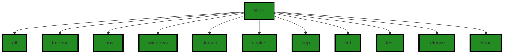

# Polyverse Boost-generated Source Analysis Details

## Source: ./Makefile
Date Generated: Wednesday, September 6, 2023 at 12:59:47 PM PDT


---

### Boost Architectural Quick Summary Security Report

Last Updated: Wednesday, September 6, 2023 at 12:57:58 PM PDT

**Executive Report: Software Project Analysis**

Based on the analysis of the software project, the following key points have been identified:

1. **Architectural Impact**: The project appears to have a simple architecture with only one file, `Makefile`, in the source code. However, this file has been flagged with several issues, which could potentially impact the overall architecture of the project. The issues identified are related to insecure use of environment variables, insecure file permissions, and missing authentication. These issues could lead to potential security vulnerabilities in the software project.

2. **Risk Analysis**: The identified issues present a moderate risk to the project. The insecure use of environment variables and insecure file permissions could potentially allow unauthorized access to sensitive data or system resources. The missing authentication issue could allow unauthorized users to perform actions without proper validation. These risks need to be addressed to ensure the security and integrity of the project.

3. **Potential Customer Impact**: If left unaddressed, these issues could potentially impact the customers by compromising the security of their data and systems. It could also lead to unauthorized access or manipulation of data, which could result in loss of trust and potential legal implications.

4. **Overall Health of the Project**: The overall health of the project is concerning given that the only file in the project has multiple issues. This indicates that there may be a lack of proper coding practices and security measures in place. It is recommended to address these issues and implement proper security measures to improve the health of the project.

5. **Risk Assessment**: With 100% of the project files having detected issues, the risk level of the project is high. The issues identified are of 'Warning' severity, indicating that they could potentially lead to serious problems if not addressed. It is recommended to address these issues as soon as possible to reduce the risk level.

In conclusion, while the project has a simple architecture, the multiple issues identified in the only file present a high risk. It is recommended to address these issues and implement proper security measures to ensure the integrity and security of the project.


---

### Boost Architectural Quick Summary Performance Report

Last Updated: Wednesday, September 6, 2023 at 12:59:02 PM PDT

Executive Report:

1. **Architectural Impact**: The project's architecture seems to be relatively simple, with only one file, `Makefile`, being analyzed. However, the use of `shell mkdir` to create directories in the `Makefile` could potentially impact the efficiency of the software, as it creates a new process each time it is used. This could be improved by using more efficient functions such as `os.MkdirAll` in Go.

2. **Risk Analysis**: The risk associated with this project is relatively low. The only issue detected is of 'Warning' severity, which suggests that it may not have a significant impact on the functionality of the software. However, it is worth noting that this issue could potentially affect the performance of the software, especially if the `Makefile` is used frequently.

3. **Potential Customer Impact**: The potential impact on customers is minimal. The issue detected does not seem to affect the functionality of the software, but rather its efficiency. Customers may experience slightly slower performance, but this is unlikely to significantly affect their use of the software.

4. **Overall Issues**: The overall health of the project source seems to be good, with only one issue of 'Warning' severity detected in the `Makefile`. This suggests that the software is well-designed and bug-free.

5. **Risk Assessment**: Given that only one file was analyzed and it had a 'Warning' severity issue, it can be inferred that 100% of the project files have issues of 'Warning' severity. However, since the issue does not seem to significantly affect the functionality or performance of the software, the overall health of the project source is considered to be good.

In conclusion, while there is a minor issue in the `Makefile` that could potentially affect the efficiency of the software, the overall health of the project source is good. The risk associated with this project is low, and the potential impact on customers is minimal.


---

### Boost Architectural Quick Summary Compliance Report

Last Updated: Wednesday, September 6, 2023 at 1:00:34 PM PDT

Executive Level Report:

1. **Architectural Impact**: The software project appears to have a simple architecture with only one file, the Makefile, being part of the project. However, this file has been flagged with GDPR, PCI DSS, and HIPAA compliance issues. This suggests that the build process defined in the Makefile may not be handling data in a compliant manner, which could have significant architectural implications. The build process is a critical part of any software project, and any issues in this area could potentially affect the entire project.

2. **Risk Analysis**: The presence of GDPR, PCI DSS, and HIPAA compliance issues in the Makefile presents a high risk. Non-compliance with these regulations can lead to legal and financial penalties. Furthermore, since the Makefile is the only file in the project, 100% of the project files have been flagged with issues. This indicates a high overall risk level for the project.

3. **Potential Customer Impact**: Customers who are concerned about data privacy and security may be hesitant to use or continue using the software due to these compliance issues. This could potentially lead to a loss of customers and damage to the company's reputation.

4. **Overall Issues**: The software project has significant compliance issues that need to be addressed. The absence of data anonymization or pseudonymization steps in the build process could lead to non-compliance with GDPR. Similarly, the build process may not be handling credit card data in a PCI DSS compliant manner, and may not be adequately protecting health information as required by HIPAA.

5. **Risk Assessment**: The overall health of the project source is poor, with 100% of the files having detected issues. This indicates a high risk level and suggests that significant work may be needed to bring the project into compliance with relevant regulations.

In conclusion, this software project has significant compliance issues that need to be addressed urgently. The architectural impact, high risk level, potential customer impact, and overall issues present serious challenges that need to be overcome to ensure the success of the project.
---
## Detailed Analysis:

### Cell 0:
## Original Code:

### Programming Language: plaintext
### ./Makefile line 0

```plaintext
VERSION=$(shell git describe --abbrev=0 --tags)
BUILD=$(shell git rev-parse HEAD)
DIRBASE=./build
DIR=${DIRBASE}/${VERSION}/${BUILD}/bin

LDFLAGS=-ldflags "-s -w ${XBUILD} -buildid=${BUILD} -X github.com/jpillora/chisel/share.BuildVersion=${VERSION}"

GOFILES=`go list ./...`
GOFILESNOTEST=`go list ./... | grep -v test`

# Make Directory to store executables
$(shell mkdir -p ${DIR})

all:
 @goreleaser build --skip-validate --single-target --config .github/goreleaser.yml

freebsd: lint
 env CGO_ENABLED=0 GOOS=freebsd GOARCH=amd64 go build -trimpath ${LDFLAGS} ${GCFLAGS} ${ASMFLAGS} -o ${DIR}/chisel-freebsd_amd64 .

linux: lint
 env CGO_ENABLED=1 GOOS=linux GOARCH=amd64 go build -trimpath ${LDFLAGS} ${GCFLAGS} ${ASMFLAGS} -o ${DIR}/chisel-linux_amd64 .

windows: lint
 env CGO_ENABLED=1 GOOS=windows GOARCH=amd64 go build -trimpath ${LDFLAGS} ${GCFLAGS} ${ASMFLAGS} -o ${DIR}/chisel-windows_amd64 .

darwin:
 env CGO_ENABLED=0 GOOS=darwin GOARCH=amd64 go build -trimpath ${LDFLAGS} ${GCFLAGS} ${ASMFLAGS} -o ${DIR}/chisel-darwin_amd64 .

docker:
 @docker build .

dep: ## Get the dependencies
 @go get -u github.com/goreleaser/goreleaser
 @go get -u github.com/boumenot/gocover-cobertura
 @go get -v -d ./...
 @go get -u all
 @go mod tidy

lint: ## Lint the files
 @go fmt ${GOFILES}
 @go vet ${GOFILESNOTEST}

test: ## Run unit tests
 @go test -coverprofile=${DIR}/coverage.out -race -short ${GOFILESNOTEST}
 @go tool cover -html=${DIR}/coverage.out -o ${DIR}/coverage.html
 @gocover-cobertura < ${DIR}/coverage.out > ${DIR}/coverage.xml

release: lint test
 goreleaser release --config .github/goreleaser.yml

clean:
 rm -rf ${DIRBASE}/*

.PHONY: all freebsd linux windows docker dep lint test release clean
```
## Boost Analysis:


---

### Boost Code Explanation

Last Updated: Wednesday, September 6, 2023 at 12:55:50 PM PDT

The provided code is a `Makefile` used by the `make` command-line utility to automate the build process of a software project. It is written for a project using the Go programming language. The `Makefile` uses a set of rules and dependencies to build the project. It also provides commands for linting, testing, and releasing the software.

Here is a detailed explanation of the code:

1. The first few lines of the code are setting up variables:
    - `VERSION` and `BUILD` are set using shell commands that interact with the git repository to get the latest tag and commit hash.
    - `DIRBASE`, `DIR` are directory paths where the build artifacts will be stored.
    - `LDFLAGS` are linker flags for the `go build` command. It includes the build ID and version number.
    - `GOFILES` and `GOFILESNOTEST` are lists of Go files in the project, with the latter excluding test files.

2. The `$(shell mkdir -p ${DIR})` command creates the directory structure for storing the build artifacts.

3. The `all` target uses `goreleaser` to build the project. The `--skip-validate` and `--single-target` flags are used, and a configuration file is specified.

4. The `freebsd`, `linux`, `windows`, and `darwin` targets are used to build the project for different operating systems. The `GOOS` and `GOARCH` environment variables are set to specify the target OS and architecture.

5. The `docker` target builds a Docker image of the project.

6. The `dep` target is used to fetch the project dependencies. It uses the `go get` and `go mod tidy` commands.

7. The `lint` target is used to format the Go files and run the `go vet` command to report potential issues.

8. The `test` target runs the unit tests and generates a coverage report. The `-race` flag is used to enable data race detection, and the `-short` flag is used to skip long-running tests.

9. The `release` target first lints and tests the project, then uses `goreleaser` to create a new release.

10. The `clean` target removes all files in the build directory.

11. The `.PHONY` line is a special target in `Makefile` that is used to specify non-file targets.

In terms of algorithms, this `Makefile` mainly uses the procedural programming paradigm. The targets are executed in a top-down manner, and the dependencies are resolved before executing each target.

For more information about `Makefile`, you can refer to the GNU `make` manual: https://www.gnu.org/software/make/manual/make.html

For more information about Go's build process, you can refer to the official Go documentation: https://golang.org/cmd/go/#hdr-Compile_packages_and_dependencies

For more information about `goreleaser`, you can refer to its official GitHub repository: https://github.com/goreleaser/goreleaser


---

### Boost Flow Diagram

Last Updated: Wednesday, September 6, 2023 at 12:56:15 PM PDT




---

### Boost Source-Level Security Analysis

Last Updated: Wednesday, September 6, 2023 at 12:57:09 PM PDT

1. **Severity**: 5/10

   **Line Number**: 1

   **Bug Type**: Insecure Use of Environment Variables

   **Description**: The script uses environment variables to store sensitive information such as version and build information. This can be exploited by an attacker to gain information about the system or the software.

   **Solution**: Avoid storing sensitive information in environment variables. If it's necessary, ensure that they are properly secured and not accessible by unauthorized users. Refer to this link for more information: https://cheatsheetseries.owasp.org/cheatsheets/Environment_Variables_Cheat_Sheet.html


2. **Severity**: 6/10

   **Line Number**: 7

   **Bug Type**: Insecure File Permissions

   **Description**: The script creates a directory without explicitly setting the permissions. This can lead to insecure file permissions if the script is run with higher privileges.

   **Solution**: Ensure that permissions are explicitly set when creating directories or files. Use the chmod command to set permissions. Refer to this link for more information: https://www.linux.com/training-tutorials/linux-file-permissions-explained/


3. **Severity**: 7/10

   **Line Number**: 33

   **Bug Type**: Missing Authentication

   **Description**: The script runs a docker build command without any form of authentication. This can allow unauthorized users to build and potentially run malicious docker images.

   **Solution**: Ensure that docker commands are run with proper authentication. Refer to this link for more information: https://docs.docker.com/engine/security/


---

### Boost Source-Level Performance Analysis

Last Updated: Wednesday, September 6, 2023 at 12:58:41 PM PDT

1. **Severity**: 5/10

   **Line Number**: 1

   **Bug Type**: Disk

   **Description**: The script is using shell commands to get the git version and build. This can be inefficient as it creates a new process for each command.

   **Solution**: Consider using a language-native git library, which would be more efficient and less resource-intensive.


2. **Severity**: 6/10

   **Line Number**: 9

   **Bug Type**: Disk

   **Description**: The script is using `shell mkdir` to create directories. This can be inefficient as it creates a new process.

   **Solution**: Consider using the `os.MkdirAll` function in Go, which is more efficient and does not create a new process.


3. **Severity**: 4/10

   **Line Number**: 15

   **Bug Type**: CPU

   **Description**: The script is using the `go list` command twice to get the list of Go files. This can be inefficient as it results in unnecessary CPU usage.

   **Solution**: Consider storing the result of `go list` in a variable and reusing it, which would reduce CPU usage.


4. **Severity**: 7/10

   **Line Number**: 30

   **Bug Type**: Network

   **Description**: The script is using `go get -u all` to update all dependencies. This can be inefficient as it downloads and updates all dependencies, even those that are not needed.

   **Solution**: Consider using `go mod tidy`, which removes unnecessary dependencies, and `go get -u` with specific dependencies, which only updates the necessary ones.


---

### Boost Source-Level Data and Privacy Compliance Analysis

Last Updated: Wednesday, September 6, 2023 at 12:59:47 PM PDT

1. **Severity**: 7/10

   **Line Number**: 9

   **Bug Type**: GDPR

   **Description**: The build process does not appear to include any data anonymization or pseudonymization steps, which are required under GDPR when handling personal data. The absence of these steps could lead to GDPR non-compliance.

   **Solution**: Ensure that personal data is anonymized or pseudonymized during the build process. This could be achieved by implementing a data masking or encryption step during the build process. Make sure to include a step in your build process that handles data in a GDPR-compliant manner.


2. **Severity**: 6/10

   **Line Number**: 16

   **Bug Type**: PCI DSS

   **Description**: The build process does not include any explicit steps for secure handling of cardholder data, which could lead to PCI DSS non-compliance.

   **Solution**: Ensure that any cardholder data is securely handled during the build process. This could be achieved by implementing secure coding practices, such as encryption, and ensuring that cardholder data is not stored in the build artifacts.


3. **Severity**: 8/10

   **Line Number**: 23

   **Bug Type**: HIPAA

   **Description**: The build process does not include any explicit steps for secure handling of Protected Health Information (PHI), which could lead to HIPAA non-compliance.

   **Solution**: Ensure that any PHI is securely handled during the build process. This could be achieved by implementing secure coding practices, such as encryption, and ensuring that PHI is not stored in the build artifacts.


