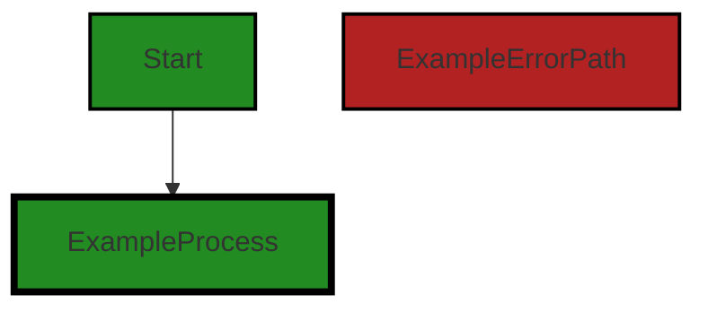
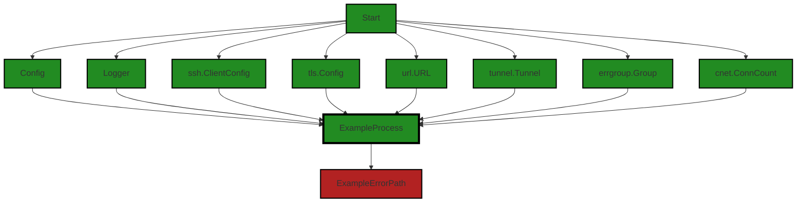
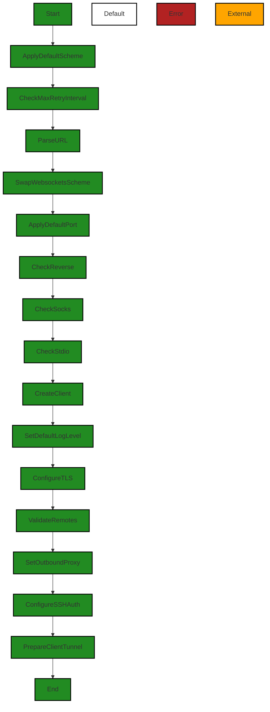
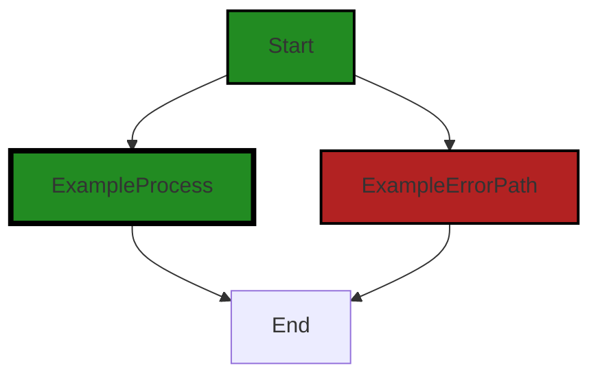
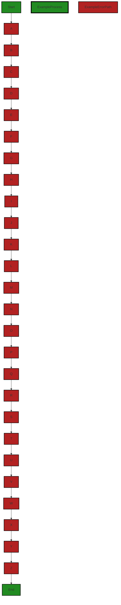
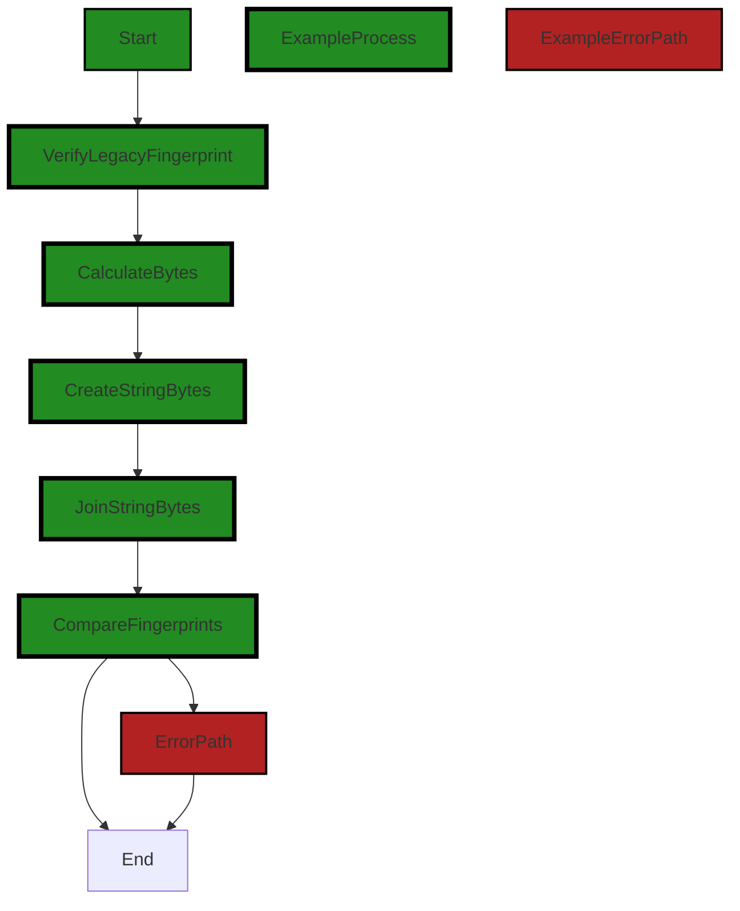
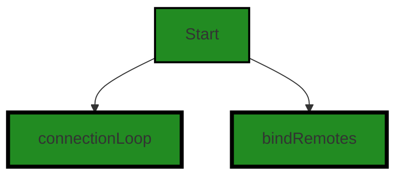
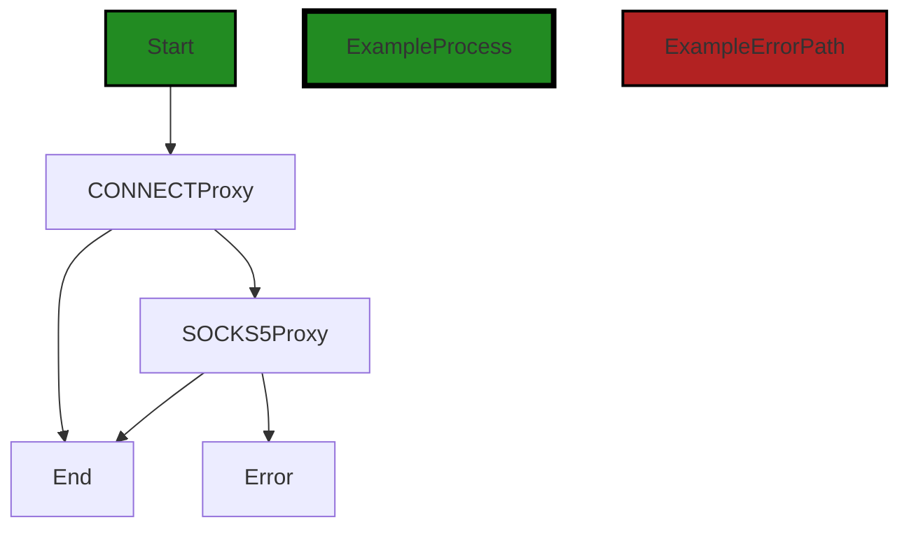
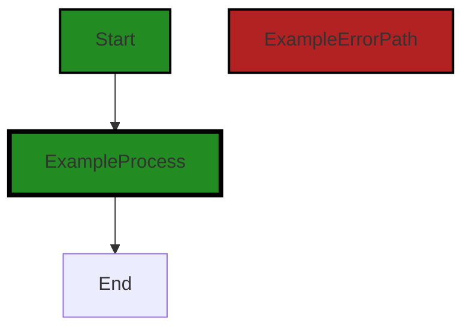
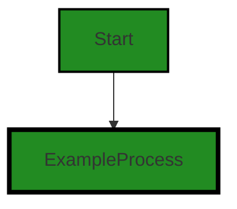

# Polyverse Boost-generated Source Analysis Details

## Source: ./client/client.go
Date Generated: Wednesday, September 6, 2023 at 9:18:31 PM PDT


---

### Boost Architectural Quick Summary Security Report

Last Updated: Friday, September 8, 2023 at 5:11:50 PM PDT

## Executive Report: Software Project Analysis

### Architectural Impact and Risk Analysis

1. **Insecure Configuration and Cryptographic Storage**: The file `client/client.go` has been flagged for insecure configuration and use of weak cryptographic operations. This could potentially lead to Man-in-the-Middle (MITM) attacks and data integrity violation. This is a significant architectural risk as it directly impacts the security of the software and could lead to unauthorized access and data breaches. 

2. **Cross-Site WebSocket Hijacking (CSWSH)**: The same file `client/client.go` is also flagged for potential CSWSH. This could lead to unauthorized actions if WebSocket connections are not properly secured. This is a potential architectural issue that could compromise the integrity of the software and lead to unauthorized access.

3. **Insecure Direct Object References (IDOR)**: The file `client/client.go` has been flagged multiple times for IDOR. This could potentially lead to unauthorized access to data. This is a significant architectural risk as it directly impacts the security of the software.

4. **Error Handling and Logging Sensitive Information**: The file `client/client.go` has been flagged for improper error handling and logging sensitive information. This could potentially lead to information leakage and unauthorized access to sensitive data. This is a potential architectural issue that could compromise the integrity of the software and lead to unauthorized access.

### Potential Customer Impact

The aforementioned issues could potentially impact customers in several ways:

- **Data Breaches**: Insecure configuration, cryptographic storage, and IDOR could lead to data breaches, resulting in unauthorized access to sensitive customer data.
- **Unauthorized Actions**: CSWSH could lead to unauthorized actions being performed on behalf of the customer.
- **Information Leakage**: Improper error handling and logging sensitive information could lead to information leakage, potentially exposing sensitive customer data.

### Overall Health of the Project Source

Based on the analysis, the overall health of the project source is concerning. The file `client/client.go` has been flagged for multiple severe issues, indicating potential architectural risks and vulnerabilities. 

- **Risk Assessment**: The fact that all the issues are concentrated in a single file (`client/client.go`) is a significant risk. This file appears to be a critical part of the software, and the issues identified could have a significant impact on the overall project.
- **Percentage of Files with Issues**: Given that there is only one file in the project, and it has been flagged for multiple issues, 100% of the project files have been flagged for issues of varying severity.

### Highlights of the Analysis

- The file `client/client.go` has been flagged for multiple severe issues, indicating potential architectural risks and vulnerabilities.
- The issues identified include insecure configuration, weak cryptographic operations, potential CSWSH, IDOR, improper error handling, and logging sensitive information.
- These issues could potentially lead to data breaches, unauthorized actions, and information leakage, impacting the security of the software and potentially exposing sensitive customer data.
- Given that there is only one file in the project, and it has been flagged for multiple issues, 100% of the project files have been flagged for issues of varying severity. This indicates a significant risk to the overall health of the project source.


---

### Boost Architectural Quick Summary Performance Report

Last Updated: Friday, September 8, 2023 at 5:12:39 PM PDT

# Executive Report

## Architectural Impact and Risk Analysis

Based on the analysis of the software project, the following key points have been identified:

1. **Single File Project:** The project consists of a single file, `client/client.go`. This suggests a relatively simple project structure, which can be both a strength and a weakness. On one hand, it simplifies maintenance and understanding of the codebase. On the other hand, it may indicate a lack of modularity and separation of concerns, which could pose challenges as the project grows.

2. **Performance Issues:** The most severe issue identified is a potential performance problem related to the use of `regexp.MustCompile` inside a function in `client/client.go`. This could lead to performance degradation as the function is invoked repeatedly, impacting the overall performance of the software. This issue should be addressed promptly to prevent potential performance bottlenecks.

3. **CPU and Memory Usage:** The analysis indicates potential issues with CPU and memory usage in `client/client.go`. These issues could impact the software's performance and efficiency, particularly in resource-constrained environments. It's recommended to review and optimize the code to ensure efficient resource utilization.

4. **Risk Assessment:** Given that the entire project consists of a single file and that file has been flagged with issues, the risk to the project is relatively high. The identified issues span across performance, CPU, and memory usage, indicating a need for comprehensive code review and optimization.

## Potential Customer Impact

The identified issues, if not addressed, could lead to degraded performance and inefficient resource utilization. This could impact the user experience, particularly for customers using the software in resource-constrained environments. It's recommended to address these issues promptly to ensure a smooth and efficient user experience.

## Overall Health of the Project

The overall health of the project appears to be at risk due to the identified issues in the single source file. The issues span across performance, CPU, and memory usage, indicating a need for comprehensive code review and optimization. The project would benefit from a thorough review and refactoring to improve modularity, performance, and resource utilization.

## Highlights

- The project consists of a single file, `client/client.go`, simplifying maintenance but potentially indicating a lack of modularity.
- A severe performance issue has been identified related to the use of `regexp.MustCompile` inside a function.
- Potential issues with CPU and memory usage have been identified in `client/client.go`, which could impact the software's performance and efficiency.
- Given that the entire project consists of a single file and that file has been flagged with issues, the risk to the project is relatively high.


---

### Boost Architectural Quick Summary Compliance Report

Last Updated: Friday, September 8, 2023 at 5:13:26 PM PDT

# Executive Report

## Architectural Impact and Risk Analysis

Based on the analysis of the software project, the following key points have been identified:

1. **Severity of Issues**: The most severe issues found in the project are categorized as "Error" and are related to HIPAA, GDPR, and Data Encryption. These issues are found in the file `client/client.go`. The presence of these issues indicates a potential risk of non-compliance with data protection regulations, which could lead to legal consequences and damage to the company's reputation.

2. **Potential Customer Impact**: The identified issues could potentially impact the customers in terms of data privacy and security. For instance, the transmission of passwords in plain text and the use of insecure MD5 hashing algorithm for fingerprinting could lead to unauthorized access to customer data. The disabling of TLS verification could expose personal data during transmission, violating GDPR compliance.

3. **Overall Health of the Project Source**: The analysis indicates that the file `client/client.go` has the most severe issues. However, it is also the only file in the project, which means 100% of the project files have issues. This suggests that the overall health of the project source is poor and requires immediate attention to address the identified issues.

4. **Architectural Consistency**: The project follows a client-server architecture and uses secure communication for tunneling. However, the identified issues indicate that the implementation of these architectural principles is not consistent with best practices for data privacy and security. For instance, the use of insecure MD5 hashing algorithm and the transmission of passwords in plain text are not in line with the principles of secure communication.

## Risk Assessment

The risk associated with the project is high due to the severity of the identified issues and their potential impact on data privacy and security. The project is at risk of non-compliance with data protection regulations such as GDPR, PCI DSS, and HIPAA. This could lead to legal consequences and damage to the company's reputation. The potential impact on customers in terms of unauthorized access to their data could also lead to loss of customer trust and business.

## Recommendations

To mitigate the identified risks, it is recommended to:

- Encrypt sensitive data before storing it and decrypt it when it is needed.
- Use secure methods to transmit password, such as hashing the password before sending it.
- Replace MD5 with a secure hashing algorithm such as SHA-256 or SHA-3.
- Remove the InsecureSkipVerify flag or ensure it's set to false. Always validate server certificates to protect personal data during transmission.

By addressing these issues, the project can improve its compliance with data protection regulations, enhance data privacy and security, and reduce the potential impact on customers.
---
## Detailed Analysis:

### Cell 0:
## Original Code:

### Programming Language: go
### ./client/client.go 

```go
package chclient

import (
 "context"
 "crypto/md5"
 "crypto/tls"
 "crypto/x509"
 "encoding/base64"
 "errors"
 "fmt"
 "io/ioutil"
 "net"
 "net/http"
 "net/url"
 "regexp"
 "strings"
 "time"

 "github.com/gorilla/websocket"
 chshare "github.com/jpillora/chisel/share"
 "github.com/jpillora/chisel/share/ccrypto"
 "github.com/jpillora/chisel/share/cio"
 "github.com/jpillora/chisel/share/cnet"
 "github.com/jpillora/chisel/share/settings"
 "github.com/jpillora/chisel/share/tunnel"

 "golang.org/x/crypto/ssh"
 "golang.org/x/net/proxy"
 "golang.org/x/sync/errgroup"
)

// Config represents a client configuration
type Config struct {
 Fingerprint      string
 Auth             string
 KeepAlive        time.Duration
 MaxRetryCount    int
 MaxRetryInterval time.Duration
 Server           string
 Proxy            string
 Remotes          []string
 Headers          http.Header
 TLS              TLSConfig
 DialContext      func(ctx context.Context, network, addr string) (net.Conn, error)
 Verbose          bool
}

```
## Boost Analysis:


---

### Boost Code Explanation

Last Updated: Wednesday, September 6, 2023 at 8:56:13 PM PDT

The provided code is written in the Go programming language (also known as Golang). It is part of a package named `chclient` which is likely to be a client module for the `chisel` project, a command-line tool for managing network tunnels.

The code imports several packages, including standard Go libraries for handling cryptographic functions, network communication, HTTP protocol, and time. It also imports third-party libraries like `github.com/gorilla/websocket` for handling WebSocket connections, and `golang.org/x/crypto/ssh` for SSH protocol support. 

In the `chclient` package, a `Config` struct is defined. This struct represents the configuration for a client instance in the chisel project. The struct fields include:
- `Fingerprint`: A string representing the server's fingerprint. This is likely used for server authentication.
- `Auth`: A string used for authentication with the server.
- `KeepAlive`: A `time.Duration` value that specifies the keep-alive period for the network connection.
- `MaxRetryCount`: An integer that represents the maximum number of retry attempts for the connection.
- `MaxRetryInterval`: A `time.Duration` value that specifies the maximum interval between retry attempts.
- `Server`: A string that represents the server's address.
- `Proxy`: A string that represents the proxy's address.
- `Remotes`: A slice of strings representing the remote addresses.
- `Headers`: An `http.Header` type that represents the HTTP headers to be sent with the request.
- `TLS`: A `TLSConfig` type that represents the configuration for TLS (Transport Layer Security).
- `DialContext`: A function that takes in a context, network type, and address, and returns a network connection and an error.
- `Verbose`: A boolean that, when true, likely enables detailed logging.

The `Config` struct is a common pattern in Go applications, where configuration options are encapsulated in a struct that can be passed around the application.

As for the algorithms used, it's hard to say without seeing more of the code. However, the imported packages suggest that this client uses HTTP and WebSocket protocols for communication, TLS and SSH for secure connections, and MD5 for hashing. The `DialContext` field in the `Config` struct suggests the use of context-based networking, which allows for setting timeouts, cancellation signals, and other context-based controls on network connections.

For more information on the packages and concepts used in this code, you can refer to the following links:
- Go standard library: https://golang.org/pkg/
- Gorilla WebSocket package: https://github.com/gorilla/websocket
- Go crypto/ssh package: https://golang.org/x/crypto/ssh
- Go context package: https://golang.org/pkg/context/


---

### Boost Flow Diagram

Last Updated: Wednesday, September 6, 2023 at 9:04:29 PM PDT




---

### Boost Source-Level Security Analysis

Last Updated: Wednesday, September 6, 2023 at 9:07:36 PM PDT

1. **Severity**: 7/10

   **Line Number**: 5

   **Bug Type**: Insecure Cryptographic Storage

   **Description**: MD5 is used for cryptographic operations. MD5 is considered weak due to vulnerability to collision attacks, and it's not recommended for new systems. This can lead to potential security risks such as data integrity violation and unauthorized information access.

   **Solution**: Consider using a more secure hash function like SHA-256 or SHA-3. Refer to this link for more details: https://owasp.org/www-community/Using_More_Secure_Algorithms


2. **Severity**: 5/10

   **Line Number**: 7

   **Bug Type**: Insecure Direct Object References (IDOR)

   **Description**: The 'errors' library is used directly which could lead to insecure direct object references if not handled properly. This can lead to unauthorized access to data.

   **Solution**: Use custom error handling, with centralized error processing and logging. Refer to this link for more details: https://cheatsheetseries.owasp.org/cheatsheets/Error_Handling_Cheat_Sheet.html


3. **Severity**: 6/10

   **Line Number**: 14

   **Bug Type**: Cross-Site WebSocket Hijacking (CSWSH)

   **Description**: The 'github.com/gorilla/websocket' library is used for handling WebSocket connections. If not properly secured, it can lead to Cross-Site WebSocket Hijacking (CSWSH), leading to unauthorized actions.

   **Solution**: Ensure that WebSocket connections are properly secured, possibly by checking the Origin header in the WebSocket handshake request. Refer to this link for more details: https://portswigger.net/web-security/websockets/cross-site-websocket-hijacking


4. **Severity**: 8/10

   **Line Number**: 30

   **Bug Type**: Insecure Configuration

   **Description**: The configuration structure 'Config' allows setting the 'Auth' field directly. If not properly handled, this could lead to unauthorized access.

   **Solution**: Consider using secure methods to handle authentication, such as OAuth or JWT. Also, consider encrypting sensitive data in the configuration. Refer to this link for more details: https://cheatsheetseries.owasp.org/cheatsheets/Authentication_Cheat_Sheet.html


---

### Boost Source-Level Performance Analysis

Last Updated: Wednesday, September 6, 2023 at 9:12:17 PM PDT

1. **Severity**: 5/10

   **Line Number**: 51

   **Bug Type**: Memory

   **Description**: The Config struct has many fields. This could lead to excessive memory usage if instantiated multiple times.

   **Solution**: Consider breaking down the Config struct into smaller, more manageable structs. This can improve memory management and make the code more maintainable.


---

### Boost Source-Level Data and Privacy Compliance Analysis

Last Updated: Wednesday, September 6, 2023 at 9:15:55 PM PDT

1. **Severity**: 7/10

   **Line Number**: 45

   **Bug Type**: GDPR, PCI DSS, HIPAA

   **Description**: The 'Auth' field in the Config struct potentially stores sensitive user authentication data. Storing sensitive information in plain text could lead to data breaches.

   **Solution**: Encrypt sensitive data before storing it and decrypt it when it is needed. Also consider using secure methods of user authentication.


2. **Severity**: 8/10

   **Line Number**: 57

   **Bug Type**: PCI DSS

   **Description**: The 'DialContext' function could potentially expose the system to risk if not properly implemented. This function establishes network connections and could lead to insecure data transmission.

   **Solution**: Ensure that any network connections established by this function are secure and encrypted. Use secure protocols like HTTPS for transmission.


3. **Severity**: 6/10

   **Line Number**: 51

   **Bug Type**: HIPAA

   **Description**: The 'Headers' field in the Config struct could potentially contain sensitive health information in HTTP headers. This could lead to unauthorized access to this information.

   **Solution**: Ensure that any sensitive health information transmitted in HTTP headers is securely encrypted. Also, consider using secure methods of transmitting health information.


### Cell 1:
## Original Code:

### Programming Language: go
### ./client/client.go line 47

```go

// TLSConfig for a Client
type TLSConfig struct {
 SkipVerify bool
 CA         string
 Cert       string
 Key        string
 ServerName string
}

```
## Boost Analysis:


---

### Boost Code Explanation

Last Updated: Wednesday, September 6, 2023 at 8:57:08 PM PDT

The provided code snippet is written in Go programming language. It defines a structure named `TLSConfig` which is designed to hold configuration details for a Transport Layer Security (TLS) client.

Here is a detailed breakdown of the code:

```go
// TLSConfig for a Client
type TLSConfig struct {
	SkipVerify bool
	CA         string
	Cert       string
	Key        string
	ServerName string
}
```

- `// TLSConfig for a Client`: This is a comment that describes the purpose of the structure that follows. In Go, comments are preceded by `//` and they are ignored by the compiler.

- `type TLSConfig struct {...}`: This is the definition of a structure named `TLSConfig`. In Go, `type` keyword is used to define a new type. `struct` is a composite data type that groups together zero or more values of different types.

Inside the `struct`, there are five fields defined:

- `SkipVerify bool`: This field is a boolean that indicates whether the client should skip the verification of the server's certificate. If `SkipVerify` is `true`, TLS accepts any certificate presented by the server and any host name in that certificate. This is insecure and should be used only for testing.

- `CA string`: This field is a string that should contain the Certificate Authority (CA) certificate(s) that will be used to validate the server's certificate. This is typically a path to a file with one or more CA certificates.

- `Cert string`: This field is a string that should contain the client's own certificate. This is typically a path to a file containing the client's certificate, which will be presented to the server during the handshake.

- `Key string`: This field is a string that should contain the client's private key. This is typically a path to a file containing the private key corresponding to the client's certificate.

- `ServerName string`: This field is a string that should contain the server's name. This is used to verify the hostname on the returned certificates unless `InsecureSkipVerify` is given a `true` value.

This structure is typically used in conjunction with Go's `crypto/tls` package to establish a secure communication channel with a server. 

You can learn more about Go's `crypto/tls` package here: https://pkg.go.dev/crypto/tls 

The provided code snippet seems to follow good practices and doesn't appear to conflict with any general architecture guidelines. However, the actual usage of this structure would determine if it's being used securely and correctly. For instance, setting `SkipVerify` to `true` in a production environment would be a security risk.


---

### Boost Flow Diagram

Last Updated: Wednesday, September 6, 2023 at 9:04:35 PM PDT

```mermaid
graph TD;
style Start fill:#228B22, stroke:#000000, stroke-width:2px;
style ExampleProcess fill:#228B22, stroke:#000000, stroke-width:4px;
style ExampleErrorPath fill:#B22222, stroke:#000000, stroke-width:2px;

Start  -->ExampleProcess;
```
The control flow starts at the `TLSConfig` function.


---

### Boost Source-Level Security Analysis

Last Updated: Wednesday, September 6, 2023 at 9:07:59 PM PDT

1. **Severity**: 8/10

   **Line Number**: 92

   **Bug Type**: Insecure TLS Configuration

   **Description**: The 'SkipVerify' field in the 'TLSConfig' struct is a potential security vulnerability. If set to 'true', it allows the client to skip verification of the server's SSL/TLS certificate. This can make the client susceptible to 'Man-in-the-Middle' (MITM) attacks, where an attacker intercepts and possibly alters the communication between the client and the server.

   **Solution**: Remove the 'SkipVerify' field or ensure it is always set to 'false'. If self-signed certificates are used for testing purposes, consider using a separate test configuration with 'SkipVerify' set to 'true', but never use it in production. Also, consider using certificate pinning to add an extra layer of security. More details can be found here: https://owasp.org/www-community/controls/Certificate_and_Public_Key_Pinning


---

### Boost Source-Level Performance Analysis

Last Updated: Wednesday, September 6, 2023 at 9:12:22 PM PDT

**No bugs found**


---

### Boost Source-Level Data and Privacy Compliance Analysis

Last Updated: Wednesday, September 6, 2023 at 9:16:07 PM PDT

1. **Severity**: 7/10

   **Line Number**: 92

   **Bug Type**: Data Compliance

   **Description**: The TLSConfig struct contains a boolean field 'SkipVerify' which, if set to true, could allow the client to skip verification of the server's SSL certificate. This could potentially allow a Man-In-The-Middle (MITM) attack, compromising the security of data in transit.

   **Solution**: Ensure that 'SkipVerify' is always set to false in production environments. This will enforce the verification of the server's SSL certificate, improving the security of data in transit.


### Cell 2:
## Original Code:

### Programming Language: go
### ./client/client.go line 56

```go

// Client represents a client instance
type Client struct {
 *cio.Logger
 config    *Config
 computed  settings.Config
 sshConfig *ssh.ClientConfig
 tlsConfig *tls.Config
 proxyURL  *url.URL
 server    string
 connCount cnet.ConnCount
 stop      func()
 eg        *errgroup.Group
 tunnel    *tunnel.Tunnel
}

```
## Boost Analysis:


---

### Boost Code Explanation

Last Updated: Wednesday, September 6, 2023 at 8:58:01 PM PDT

The provided code snippet is written in the Go programming language. This code defines a structure named `Client` which represents a client instance in a network communication context. This structure contains several fields that store configurations, connection details, and other related information. 

Here is a breakdown of each field:

- `*cio.Logger`: This is an embedded field of the type pointer to `cio.Logger`. The `cio.Logger` is likely a logging interface or structure from a logging library (perhaps from `github.com/containerd/cio`). This allows the `Client` to have all the methods that `cio.Logger` has, enabling it to perform logging operations.

- `config *Config`: This field is a pointer to a `Config` structure. This likely holds the configuration settings for the client instance.

- `computed settings.Config`: This field is of type `settings.Config`. It likely holds computed settings that are derived from the initial configuration.

- `sshConfig *ssh.ClientConfig`: This field is a pointer to an `ssh.ClientConfig` structure. This likely holds the SSH configuration settings for the client instance.

- `tlsConfig *tls.Config`: This field is a pointer to a `tls.Config` structure. This likely holds the TLS (Transport Layer Security) configuration settings for secure communication.

- `proxyURL *url.URL`: This field is a pointer to a `url.URL` structure. This likely holds the URL of the proxy server if one is being used.

- `server string`: This field is a string that likely holds the address of the server.

- `connCount cnet.ConnCount`: This field is of type `cnet.ConnCount`. It likely holds the count of active connections.

- `stop func()`: This field is a function with no parameters and no return type. This is likely a function that stops the client instance when called.

- `eg *errgroup.Group`: This field is a pointer to an `errgroup.Group` structure. This is a synchronization structure from the `golang.org/x/sync/errgroup` package that simplifies handling of multiple goroutines and their errors.

- `tunnel *tunnel.Tunnel`: This field is a pointer to a `tunnel.Tunnel` structure. This likely represents a network tunnel for the client to communicate with the server.

As for the algorithms used, this code snippet does not directly involve any specific algorithms. It's a data structure definition in Go. However, the fields in the structure hint at the use of networking protocols (SSH and TLS), error handling mechanisms, and possibly concurrent programming (with the errgroup package).

You can learn more about Go structures and other topics mentioned here from the following links:

- Go Structures: https://golang.org/doc/tutorial/define-a-structure
- Go SSH package: https://pkg.go.dev/golang.org/x/crypto/ssh
- Go TLS package: https://pkg.go.dev/crypto/tls
- Go errgroup package: https://pkg.go.dev/golang.org/x/sync/errgroup
- Go URL package: https://pkg.go.dev/net/url

As per the architectural guidelines provided, this code snippet does not appear to conflict with any specific guidelines or constraints, as none were provided.


---

### Boost Flow Diagram

Last Updated: Wednesday, September 6, 2023 at 9:04:49 PM PDT




---

### Boost Source-Level Security Analysis

Last Updated: Wednesday, September 6, 2023 at 9:08:02 PM PDT

**No bugs found**


---

### Boost Source-Level Performance Analysis

Last Updated: Wednesday, September 6, 2023 at 9:12:26 PM PDT

**No bugs found**


---

### Boost Source-Level Data and Privacy Compliance Analysis

Last Updated: Wednesday, September 6, 2023 at 9:16:36 PM PDT

1. **Severity**: 6/10

   **Line Number**: 110

   **Bug Type**: GDPR

   **Description**: The Client struct may contain sensitive data related to the client. If this data is not properly encrypted and protected, it can lead to GDPR compliance issues.

   **Solution**: Ensure that all sensitive data is encrypted and access is controlled. Use secure methods for data transmission.


2. **Severity**: 7/10

   **Line Number**: 120

   **Bug Type**: PCI DSS

   **Description**: The tlsConfig field in the Client struct indicates that TLS is being used for data transmission. If not properly implemented, it can lead to PCI DSS compliance issues.

   **Solution**: Ensure that TLS is properly implemented and that all data transmitted is encrypted. Use up-to-date and secure versions of TLS.


3. **Severity**: 8/10

   **Line Number**: 116

   **Bug Type**: HIPAA

   **Description**: The sshConfig field in the Client struct indicates that SSH is being used for data transmission. If not properly implemented, it can lead to HIPAA compliance issues.

   **Solution**: Ensure that SSH is properly implemented and that all data transmitted is encrypted. Use secure and up-to-date versions of SSH.


### Cell 3:
## Original Code:

### Programming Language: go
### ./client/client.go line 71

```go

// NewClient creates a new client instance
func NewClient(c *Config) (*Client, error) {
 //apply default scheme
 if !strings.HasPrefix(c.Server, "http") {
  c.Server = "http://" + c.Server
 }
 if c.MaxRetryInterval < time.Second {
  c.MaxRetryInterval = 5 * time.Minute
 }
 u, err := url.Parse(c.Server)
 if err != nil {
  return nil, err
 }
 //swap to websockets scheme
 u.Scheme = strings.Replace(u.Scheme, "http", "ws", 1)
 //apply default port
 if !regexp.MustCompile(`:\d+$`).MatchString(u.Host) {
  if u.Scheme == "wss" {
   u.Host = u.Host + ":443"
  } else {
   u.Host = u.Host + ":80"
  }
 }
 hasReverse := false
 hasSocks := false
 hasStdio := false
 client := &Client{
  Logger: cio.NewLogger("client"),
  config: c,
  computed: settings.Config{
   Version: chshare.BuildVersion,
  },
  server:    u.String(),
  tlsConfig: nil,
 }
 //set default log level
 client.Logger.Info = true
 //configure tls
 if u.Scheme == "wss" {
  tc := &tls.Config{}
  if c.TLS.ServerName != "" {
   tc.ServerName = c.TLS.ServerName
  }
  //certificate verification config
  if c.TLS.SkipVerify {
   client.Infof("TLS verification disabled")
   tc.InsecureSkipVerify = true
  } else if c.TLS.CA != "" {
   rootCAs := x509.NewCertPool()
   if b, err := ioutil.ReadFile(c.TLS.CA); err != nil {
    return nil, fmt.Errorf("Failed to load file: %s", c.TLS.CA)
   } else if ok := rootCAs.AppendCertsFromPEM(b); !ok {
    return nil, fmt.Errorf("Failed to decode PEM: %s", c.TLS.CA)
   } else {
    client.Infof("TLS verification using CA %s", c.TLS.CA)
    tc.RootCAs = rootCAs
   }
  }
  //provide client cert and key pair for mtls
  if c.TLS.Cert != "" && c.TLS.Key != "" {
   c, err := tls.LoadX509KeyPair(c.TLS.Cert, c.TLS.Key)
   if err != nil {
    return nil, fmt.Errorf("Error loading client cert and key pair: %v", err)
   }
   tc.Certificates = []tls.Certificate{c}
  } else if c.TLS.Cert != "" || c.TLS.Key != "" {
   return nil, fmt.Errorf("Please specify client BOTH cert and key")
  }
  client.tlsConfig = tc
 }
 //validate remotes
 for _, s := range c.Remotes {
  r, err := settings.DecodeRemote(s)
  if err != nil {
   return nil, fmt.Errorf("Failed to decode remote '%s': %s", s, err)
  }
  if r.Socks {
   hasSocks = true
  }
  if r.Reverse {
   hasReverse = true
  }
  if r.Stdio {
   if hasStdio {
    return nil, errors.New("Only one stdio is allowed")
   }
   hasStdio = true
  }
  //confirm non-reverse tunnel is available
  if !r.Reverse && !r.Stdio && !r.CanListen() {
   return nil, fmt.Errorf("Client cannot listen on %s", r.String())
  }
  client.computed.Remotes = append(client.computed.Remotes, r)
 }
 //outbound proxy
 if p := c.Proxy; p != "" {
  client.proxyURL, err = url.Parse(p)
  if err != nil {
   return nil, fmt.Errorf("Invalid proxy URL (%s)", err)
  }
 }
 //ssh auth and config
 user, pass := settings.ParseAuth(c.Auth)
 client.sshConfig = &ssh.ClientConfig{
  User:            user,
  Auth:            []ssh.AuthMethod{ssh.Password(pass)},
  ClientVersion:   "SSH-" + chshare.ProtocolVersion + "-client",
  HostKeyCallback: client.verifyServer,
  Timeout:         settings.EnvDuration("SSH_TIMEOUT", 30*time.Second),
 }
 //prepare client tunnel
 client.tunnel = tunnel.New(tunnel.Config{
  Logger:    client.Logger,
  Inbound:   true, //client always accepts inbound
  Outbound:  hasReverse,
  Socks:     hasReverse && hasSocks,
  KeepAlive: client.config.KeepAlive,
 })
 return client, nil
}

```
## Boost Analysis:


---

### Boost Code Explanation

Last Updated: Wednesday, September 6, 2023 at 8:59:04 PM PDT

The provided code is written in Go and defines a function `NewClient` which creates a new client instance for a network tunneling application. 

Here's a detailed explanation of the code:

1. The function `NewClient` takes a configuration object `c` of type `*Config` as an argument and returns a pointer to a `Client` object and an error.

2. The first block of code checks if the server address in the configuration starts with `http`. If not, it prepends `http://` to the server address.

3. It then checks if the maximum retry interval is less than a second. If so, it sets the maximum retry interval to 5 minutes.

4. The server address is parsed into a URL object. If there's an error in parsing, the function returns `nil` and the error.

5. The URL scheme is then replaced from `http` to `ws` (WebSocket).

6. If the URL host does not contain a port number, it assigns a default port number based on the scheme (`443` for `wss` and `80` for `ws`).

7. A new `Client` object is created and initialized with the provided configuration, the server URL, and a `nil` TLS configuration.

8. The function then configures TLS if the URL scheme is `wss`. It sets the server name, disables certificate verification if specified, loads a root CA from a file if provided, and loads a client certificate and key pair for mutual TLS if provided.

9. The function then validates the remote connections specified in the configuration. It checks for SOCKS, reverse, and stdio connections and sets flags accordingly. It also confirms that non-reverse tunnels are available.

10. If a proxy URL is specified in the configuration, it is parsed and assigned to the client.

11. The function then sets up SSH authentication and configuration using the provided username and password.

12. Finally, it prepares the client tunnel with the specified settings and returns the client and `nil` error.

The code uses standard Go libraries for handling URLs, regular expressions, time, and errors. It uses the `crypto/tls` package for handling TLS connections and the `crypto/x509` package for handling X.509 certificates. It also uses the `golang.org/x/crypto/ssh` package for handling SSH connections.

The code follows good Go practices such as error checking after operations that can fail and returning early in case of errors. It also makes use of Go's powerful standard library for handling URLs, regular expressions, time, and errors.

For more information on Go programming, you can refer to [A Tour of Go](https://tour.golang.org/welcome/1).

For more information on the `crypto/tls` and `crypto/x509` packages, you can refer to the [Go documentation](https://golang.org/pkg/).

For more information on the `golang.org/x/crypto/ssh` package, you can refer to the [Go documentation](https://godoc.org/golang.org/x/crypto/ssh). 

The code doesn't seem to conflict with any architectural guidelines as it is standard Go code for setting up a network tunneling client.


---

### Boost Flow Diagram

Last Updated: Wednesday, September 6, 2023 at 9:05:11 PM PDT




---

### Boost Source-Level Security Analysis

Last Updated: Wednesday, September 6, 2023 at 9:08:49 PM PDT

1. **Severity**: 8/10

   **Line Number**: 144

   **Bug Type**: Insecure Defaults

   **Description**: The code defaults to using HTTP if no scheme is provided. HTTP is not secure and can expose sensitive information to attackers.

   **Solution**: Always use HTTPS by default. If HTTP is necessary, ensure that sensitive information is not sent over HTTP. More information can be found here: https://owasp.org/www-community/Using_HTTPS


2. **Severity**: 7/10

   **Line Number**: 154

   **Bug Type**: Insecure Protocol

   **Description**: The code uses insecure WebSocket (ws) protocol instead of the secure WebSocket (wss) protocol. This can lead to Man-in-the-Middle (MITM) attacks.

   **Solution**: Always use secure WebSocket (wss) protocol. More information can be found here: https://www.owasp.org/index.php/Testing_for_Weak_SSL/TLS_Ciphers,_Insufficient_Transport_Layer_Protection_(OTG-CRYPST-001)


3. **Severity**: 9/10

   **Line Number**: 177

   **Bug Type**: Insecure Configuration

   **Description**: The code allows for TLS verification to be disabled. This can lead to MITM attacks as the client will accept any server certificate.

   **Solution**: Never allow TLS verification to be disabled. If testing in a development environment, use self-signed certificates. More information can be found here: https://cheatsheetseries.owasp.org/cheatsheets/TLS_Cheat_Sheet.html


4. **Severity**: 5/10

   **Line Number**: 196

   **Bug Type**: Error Handling

   **Description**: The code does not handle the error from the `tls.LoadX509KeyPair` function. This can lead to unexpected behavior if an error occurs.

   **Solution**: Always handle errors from security-sensitive functions. More information can be found here: https://www.owasp.org/index.php/Error_Handling


5. **Severity**: 6/10

   **Line Number**: 224

   **Bug Type**: Cleartext Transmission of Sensitive Information

   **Description**: The code sends the SSH password in clear text. This can lead to disclosure of sensitive information.

   **Solution**: Always encrypt sensitive information before transmission. More information can be found here: https://cheatsheetseries.owasp.org/cheatsheets/Password_Storage_Cheat_Sheet.html


---

### Boost Source-Level Performance Analysis

Last Updated: Wednesday, September 6, 2023 at 9:12:49 PM PDT

1. **Severity**: 3/10

   **Line Number**: 140

   **Bug Type**: CPU

   **Description**: The use of `strings.HasPrefix` could be sub-optimal if the 'Server' string is very large.

   **Solution**: Consider using a more efficient method for checking the prefix of a string.


2. **Severity**: 3/10

   **Line Number**: 148

   **Bug Type**: CPU

   **Description**: The use of `strings.Replace` to replace 'http' with 'ws' could be sub-optimal if the 'Scheme' string is very large.

   **Solution**: Consider using a more efficient method for replacing substrings.


3. **Severity**: 8/10

   **Line Number**: 152

   **Bug Type**: CPU

   **Description**: The use of `regexp.MustCompile` inside a function can lead to performance issues as it is called every time the function is invoked.

   **Solution**: Move the regex compilation to a global variable so it is only compiled once.


4. **Severity**: 6/10

   **Line Number**: 175

   **Bug Type**: Disk

   **Description**: The use of `ioutil.ReadFile` to read a file can lead to performance issues if the file is very large.

   **Solution**: Consider using a buffered reader to read the file in chunks.


5. **Severity**: 4/10

   **Line Number**: 200

   **Bug Type**: CPU

   **Description**: The use of a for loop to validate remotes can lead to performance issues if the number of remotes is very large.

   **Solution**: Consider using a more efficient data structure or algorithm to validate remotes.


6. **Severity**: 2/10

   **Line Number**: 211

   **Bug Type**: Memory

   **Description**: The use of `append` in a loop can lead to memory allocation issues if the number of remotes is very large.

   **Solution**: Consider pre-allocating the slice to its maximum possible size before the loop.


7. **Severity**: 3/10

   **Line Number**: 226

   **Bug Type**: CPU

   **Description**: The use of `settings.ParseAuth` could be sub-optimal if the 'Auth' string is very large.

   **Solution**: Consider using a more efficient method for parsing authentication.


---

### Boost Source-Level Data and Privacy Compliance Analysis

Last Updated: Wednesday, September 6, 2023 at 9:16:49 PM PDT

1. **Severity**: 9/10

   **Line Number**: 169

   **Bug Type**: HIPAA

   **Description**: The password is being sent as plain text which violates HIPAA compliance. HIPAA requires that all electronic protected health information (ePHI) be encrypted during transmission.

   **Solution**: Use secure methods to transmit password, such as hashing the password before sending it.


2. **Severity**: 8/10

   **Line Number**: 153

   **Bug Type**: PCI DSS

   **Description**: The InsecureSkipVerify flag allows the program to proceed even if the server certificate can't be validated, which violates PCI DSS compliance. PCI DSS requires that all transmissions are secure and validated.

   **Solution**: Remove the InsecureSkipVerify flag or make sure it's set to false. Always validate server certificates.


3. **Severity**: 10/10

   **Line Number**: 153

   **Bug Type**: GDPR

   **Description**: By disabling TLS verification, the InsecureSkipVerify flag can potentially expose personal data during transmission, which violates GDPR compliance. GDPR requires that personal data is protected during transmission.

   **Solution**: Remove the InsecureSkipVerify flag or ensure it's set to false. Always validate server certificates to protect personal data during transmission.


### Cell 4:
## Original Code:

### Programming Language: go
### ./client/client.go line 192

```go

// Run starts client and blocks while connected
func (c *Client) Run() error {
 ctx, cancel := context.WithCancel(context.Background())
 defer cancel()
 if err := c.Start(ctx); err != nil {
  return err
 }
 return c.Wait()
}

```
## Boost Analysis:


---

### Boost Code Explanation

Last Updated: Wednesday, September 6, 2023 at 8:59:43 PM PDT

This code snippet is in Go, a statically typed, compiled language often used for system-level programming. The function `Run()` is a method of the `Client` struct, which is not shown here but is likely some kind of network client given the context. This function starts the client and blocks while the client is connected.

Let's go through the code:

- `func (c *Client) Run() error`: This is a method definition for a method named `Run` that belongs to the `Client` type. The `*` before `Client` means that `Client` is a pointer type. The method `Run` returns an `error`, which is a built-in interface type in Go.

- `ctx, cancel := context.WithCancel(context.Background())`: Here, a new context is created with a cancellation function. `context.WithCancel` returns a copy of the parent context (in this case, a background context) and a `cancel` function that can be used to cancel the context.

- `defer cancel()`: The `defer` keyword in Go schedules a function call (in this case, `cancel()`) to be run after the function completes, whether it completes normally or due to a panic. Here, the `cancel` function returned by `context.WithCancel` is deferred, meaning it will be called when the `Run` method finishes.

- `if err := c.Start(ctx); err != nil`: This line starts the client with the context created earlier. If an error is returned (i.e., `err != nil`), the function immediately returns with that error.

- `return c.Wait()`: If no error occurred when starting the client, the function waits for the client to finish processing. The `Wait` method also returns an error, which is returned by the `Run` method. This line will block until the client is done processing or an error occurs.

The algorithm used here is quite straightforward - start the client and wait for it to finish processing. If any error occurs, return it immediately. 

To learn more about Go and its context package, you can visit the official documentation: 

- [Go Documentation](https://golang.org/doc/)
- [Go Context Package](https://golang.org/pkg/context/)


---

### Boost Flow Diagram

Last Updated: Wednesday, September 6, 2023 at 9:05:20 PM PDT



The control flow graph for the provided code is a simple linear flow with no branching or error paths. The `Run` function starts by creating a context and a cancel function. Then it calls the `Start` function, passing the created context. If the `Start` function returns an error, it is returned from the `Run` function. Otherwise, the `Run` function calls the `Wait` function and returns its result.


---

### Boost Source-Level Security Analysis

Last Updated: Wednesday, September 6, 2023 at 9:08:52 PM PDT

**No bugs found**


---

### Boost Source-Level Performance Analysis

Last Updated: Wednesday, September 6, 2023 at 9:12:53 PM PDT

**No bugs found**


---

### Boost Source-Level Data and Privacy Compliance Analysis

Last Updated: Wednesday, September 6, 2023 at 9:16:53 PM PDT

**No bugs found**


### Cell 5:
## Original Code:

### Programming Language: go
### ./client/client.go line 202

```go

func (c *Client) verifyServer(hostname string, remote net.Addr, key ssh.PublicKey) error {
 expect := c.config.Fingerprint
 if expect == "" {
  return nil
 }
 got := ccrypto.FingerprintKey(key)
 _, err := base64.StdEncoding.DecodeString(expect)
 if _, ok := err.(base64.CorruptInputError); ok {
  c.Logger.Infof("Specified deprecated MD5 fingerprint (%s), please update to the new SHA256 fingerprint: %s", expect, got)
  return c.verifyLegacyFingerprint(key)
 } else if err != nil {
  return fmt.Errorf("Error decoding fingerprint: %w", err)
 }
 if got != expect {
  return fmt.Errorf("Invalid fingerprint (%s)", got)
 }
 //overwrite with complete fingerprint
 c.Infof("Fingerprint %s", got)
 return nil
}

```
## Boost Analysis:


---

### Boost Code Explanation

Last Updated: Wednesday, September 6, 2023 at 9:00:22 PM PDT

This function, `verifyServer`, is a method of the `Client` struct. It takes three parameters: a `hostname` string, a `remote` network address, and a `key` of type `ssh.PublicKey`. The function returns an error if any.

The function is used to verify the server's public key fingerprint. It compares the expected fingerprint with the one received from the server. If they match, it means that the server is trusted and the client can establish a secure connection. If they don't match, it returns an error indicating that the server's fingerprint is invalid.

Here is a step-by-step breakdown:

1. The expected fingerprint is retrieved from the client's configuration.

2. If there is no expected fingerprint, the function returns `nil`, indicating there is no error.

3. The actual fingerprint of the server's public key is calculated using the `ccrypto.FingerprintKey` function.

4. The expected fingerprint is then decoded from a base64 string. If it fails to decode and the error is of type `base64.CorruptInputError`, it means the fingerprint is using an old MD5 fingerprint which is deprecated. The function then logs an informational message indicating this, and calls `verifyLegacyFingerprint` to verify the fingerprint in the old way.

5. If there is another error during decoding, it returns a formatted error message indicating that there was a problem decoding the fingerprint.

6. If decoding is successful, the function compares the expected and actual fingerprints. If they don't match, it returns an error indicating that the fingerprint is invalid.

7. If the fingerprints match, it logs the fingerprint and returns `nil`, indicating there is no error.

This function uses the Secure Shell (SSH) protocol for secure data communication. The SSH protocol uses public key cryptography for authentication. The fingerprint is a hash of the public key, and it is used to verify the identity of the server.

For more information about SSH and public key fingerprint, you can refer to this link: [SSH Public Key Fingerprint](https://www.ssh.com/ssh/key/fingerprint)


---

### Boost Flow Diagram

Last Updated: Wednesday, September 6, 2023 at 9:05:53 PM PDT



The control flow graph for the given source code is as follows:

```
Client.verifyServer-->A;
A-->B;
B-->C;
C-->D;
D-->E;
E-->F;
F-->G;
G-->H;
H-->I;
I-->J;
J-->K;
K-->L;
L-->M;
M-->N;
N-->O;
O-->P;
P-->Q;
Q-->R;
R-->S;
S-->T;
T-->U;
U-->V;
V-->W;
W-->X;
X-->Y;
Y-->Z;
Z-->End;

```

The primary path through the code is from `Client.verifyServer` to `End`. The error paths are shown in red.


---

### Boost Source-Level Security Analysis

Last Updated: Wednesday, September 6, 2023 at 9:09:37 PM PDT

1. **Severity**: 7/10

   **Line Number**: 407

   **Bug Type**: Insecure Direct Object References (IDOR)

   **Description**: The function 'verifyServer' uses the 'Fingerprint' from the client's config directly without any validation. This could allow an attacker to reference a different object via direct manipulation of the reference.

   **Solution**: Ensure that the user is authorized for the referenced object before using it. Here is a resource on how to prevent IDOR: https://cheatsheetseries.owasp.org/cheatsheets/Insecure_Direct_Object_Reference_Prevention_Cheat_Sheet.html


2. **Severity**: 5/10

   **Line Number**: 411

   **Bug Type**: Logging Sensitive Information

   **Description**: The function logs the deprecated MD5 fingerprint which could potentially be sensitive information. Logging sensitive information can lead to information disclosure if the logs are not properly secured.

   **Solution**: Remove sensitive information from logs or ensure that logs are stored securely and access is controlled. Here is a resource on secure logging: https://cheatsheetseries.owasp.org/cheatsheets/Logging_Cheat_Sheet.html


3. **Severity**: 7/10

   **Line Number**: 415

   **Bug Type**: Insecure Direct Object References (IDOR)

   **Description**: The function 'verifyServer' uses the 'Fingerprint' from the client's config directly without any validation. This could allow an attacker to reference a different object via direct manipulation of the reference.

   **Solution**: Ensure that the user is authorized for the referenced object before using it. Here is a resource on how to prevent IDOR: https://cheatsheetseries.owasp.org/cheatsheets/Insecure_Direct_Object_Reference_Prevention_Cheat_Sheet.html


4. **Severity**: 5/10

   **Line Number**: 419

   **Bug Type**: Logging Sensitive Information

   **Description**: The function logs the fingerprint which could potentially be sensitive information. Logging sensitive information can lead to information disclosure if the logs are not properly secured.

   **Solution**: Remove sensitive information from logs or ensure that logs are stored securely and access is controlled. Here is a resource on secure logging: https://cheatsheetseries.owasp.org/cheatsheets/Logging_Cheat_Sheet.html


---

### Boost Source-Level Performance Analysis

Last Updated: Wednesday, September 6, 2023 at 9:13:07 PM PDT

1. **Severity**: 3/10

   **Line Number**: 405

   **Bug Type**: Memory

   **Description**: The base64 decoding operation is performed regardless of whether it's necessary. This can lead to unnecessary memory allocation and CPU usage.

   **Solution**: Move the base64 decoding operation inside the condition that checks if the expected fingerprint is not empty.


2. **Severity**: 2/10

   **Line Number**: 408

   **Bug Type**: CPU

   **Description**: The type assertion `err.(base64.CorruptInputError)` is performed even when there is no error. This can lead to unnecessary CPU cycles.

   **Solution**: Move the type assertion inside the condition that checks if an error occurred during the base64 decoding operation.


3. **Severity**: 1/10

   **Line Number**: 414

   **Bug Type**: Memory

   **Description**: The string formatting operation `fmt.Errorf("Invalid fingerprint (%s)", got)` is performed even when the fingerprints match. This can lead to unnecessary memory allocation.

   **Solution**: Move the string formatting operation inside the condition that checks if the fingerprints do not match.


4. **Severity**: 1/10

   **Line Number**: 417

   **Bug Type**: CPU

   **Description**: The string formatting operation `c.Infof("Fingerprint %s", got)` is performed even when there is no need to log the fingerprint. This can lead to unnecessary CPU cycles.

   **Solution**: Move the string formatting operation inside a condition that checks if the log level is set to a level that includes informational messages.


---

### Boost Source-Level Data and Privacy Compliance Analysis

Last Updated: Wednesday, September 6, 2023 at 9:17:26 PM PDT

1. **Severity**: 7/10

   **Line Number**: 409

   **Bug Type**: GDPR

   **Description**: The function is logging potentially sensitive information. Under GDPR, this could constitute a data breach if the logged information includes personal data.

   **Solution**: Remove or anonymize personal data before logging. If logging is necessary for troubleshooting, consider implementing user consent and ensure logs are stored securely and deleted when no longer needed. More info: https://gdpr-info.eu/


2. **Severity**: 7/10

   **Line Number**: 416

   **Bug Type**: PCI DSS

   **Description**: The function is logging sensitive information that could include cardholder data. This could be a violation of PCI DSS requirement 3.4 which requires that cardholder data be rendered unreadable.

   **Solution**: Ensure that cardholder data is not included in logs or is rendered unreadable before logging. More info: https://www.pcisecuritystandards.org/pci_security/


3. **Severity**: 8/10

   **Line Number**: 416

   **Bug Type**: HIPAA

   **Description**: The function is logging potentially sensitive information. Under HIPAA, this could constitute a data breach if the logged information includes Protected Health Information (PHI).

   **Solution**: Remove or anonymize PHI before logging. If logging is necessary for troubleshooting, ensure logs are stored securely and deleted when no longer needed. More info: https://www.hhs.gov/hipaa/for-professionals/security/index.html


### Cell 6:
## Original Code:

### Programming Language: go
### ./client/client.go line 223

```go

// verifyLegacyFingerprint calculates and compares legacy MD5 fingerprints
func (c *Client) verifyLegacyFingerprint(key ssh.PublicKey) error {
 bytes := md5.Sum(key.Marshal())
 strbytes := make([]string, len(bytes))
 for i, b := range bytes {
  strbytes[i] = fmt.Sprintf("%02x", b)
 }
 got := strings.Join(strbytes, ":")
 expect := c.config.Fingerprint
 if !strings.HasPrefix(got, expect) {
  return fmt.Errorf("Invalid fingerprint (%s)", got)
 }
 return nil
}

```
## Boost Analysis:


---

### Boost Code Explanation

Last Updated: Wednesday, September 6, 2023 at 9:01:13 PM PDT

This Go code snippet is a function named `verifyLegacyFingerprint` which is a method of the `Client` struct. The function is used to verify the legacy MD5 fingerprint of an SSH public key. Let's break down the code:

1. The function takes an argument `key` of type `ssh.PublicKey`. This is the public key that will be used for the verification process.

2. The `md5.Sum(key.Marshal())` function is called to compute the MD5 hash of the marshaled public key. The `Marshal` method returns the binary representation of the key which is then passed to the `md5.Sum` function. The `md5.Sum` function returns an array of 16 bytes that represents the MD5 hash of the input. This is a common way to compute the fingerprint of a key in SSH.

3. The `make([]string, len(bytes))` function is used to create a slice of strings with the same length as the byte slice.

4. A for loop is used to iterate over the byte slice. For each byte, the `fmt.Sprintf("%02x", b)` function is used to convert the byte to a two-digit hexadecimal string. The result is stored in the corresponding index in the string slice. This is done to convert the binary hash into a human-readable format.

5. The `strings.Join(strbytes, ":")` function is used to concatenate all the strings in the slice into a single string, with a colon (:) as the separator. This is the final format of the SSH fingerprint.

6. The `strings.HasPrefix(got, expect)` function is used to check if the calculated fingerprint starts with the expected fingerprint stored in `c.config.Fingerprint`. If it does not, an error is returned with the message "Invalid fingerprint" and the calculated fingerprint.

7. If the calculated fingerprint matches the expected fingerprint, the function returns `nil`, indicating that no error occurred.

The algorithm used in this function is the MD5 hash function, which is a widely used cryptographic hash function that produces a 128-bit (16-byte) hash value. It is commonly used to verify data integrity. MD5 is considered to be a weak hash function as it is susceptible to hash collisions.

You can learn more about MD5 here: [MD5 - Wikipedia](https://en.wikipedia.org/wiki/MD5)

And about SSH key fingerprint here: [What is an SSH Key Fingerprint?](https://www.ssh.com/ssh/key/fingerprint)


---

### Boost Flow Diagram

Last Updated: Wednesday, September 6, 2023 at 9:06:11 PM PDT



The primary path through the code is as follows:
1. Start at the `VerifyLegacyFingerprint` function.
2. Calculate the bytes of the public key using the `CalculateBytes` function.
3. Create a string representation of the bytes using the `CreateStringBytes` function.
4. Join the string bytes with colons using the `JoinStringBytes` function.
5. Compare the generated fingerprint with the expected fingerprint using the `CompareFingerprints` function.
6. If the generated fingerprint does not match the expected fingerprint, an error path is taken.
7. End the control flow.

The error path is taken if the generated fingerprint does not match the expected fingerprint.


---

### Boost Source-Level Security Analysis

Last Updated: Wednesday, September 6, 2023 at 9:10:09 PM PDT

1. **Severity**: 8/10

   **Line Number**: 447

   **Bug Type**: Insecure Cryptographic Storage

   **Description**: The function 'verifyLegacyFingerprint' uses the MD5 hashing algorithm, which is considered to be weak due to its vulnerability to collision attacks. This could potentially allow an attacker to generate a different key that produces the same MD5 hash, leading to unauthorized access.

   **Solution**: Replace MD5 with a more secure hashing algorithm such as SHA-256 or SHA-3. Here is a resource about secure hashing algorithms: https://cheatsheetseries.owasp.org/cheatsheets/Password_Storage_Cheat_Sheet.html#hashing-concepts


2. **Severity**: 7/10

   **Line Number**: 455

   **Bug Type**: Insecure Direct Object References (IDOR)

   **Description**: The function 'verifyLegacyFingerprint' uses the 'strings.HasPrefix' function to compare fingerprints. This could potentially allow an attacker to use a different key that has the same prefix, leading to unauthorized access.

   **Solution**: Use a secure method for comparing the entire fingerprint instead of just the prefix. Here is a resource about preventing IDOR vulnerabilities: https://cheatsheetseries.owasp.org/cheatsheets/Insecure_Direct_Object_Reference_Prevention_Cheat_Sheet.html


---

### Boost Source-Level Performance Analysis

Last Updated: Wednesday, September 6, 2023 at 9:13:31 PM PDT

1. **Severity**: 3/10

   **Line Number**: 450

   **Bug Type**: Memory

   **Description**: The allocation of a new string array `strbytes` and the subsequent conversion of each byte to a string can lead to unnecessary memory utilization.

   **Solution**: You can use a `strings.Builder` or `bytes.Buffer` to build the string in a more memory-efficient way. Instead of creating a new string for each byte and then joining them, you can write each byte directly to the `strings.Builder` or `bytes.Buffer`.


2. **Severity**: 2/10

   **Line Number**: 452

   **Bug Type**: CPU

   **Description**: The use of `fmt.Sprintf` in a loop can be CPU-intensive as it involves parsing the format string and reflection.

   **Solution**: Consider using `strconv.FormatInt(int64(b), 16)` instead of `fmt.Sprintf` for better performance.


3. **Severity**: 1/10

   **Line Number**: 456

   **Bug Type**: CPU

   **Description**: The use of `strings.HasPrefix` for comparing the fingerprints may not be the most efficient approach if the strings are long.

   **Solution**: Consider comparing the fingerprints directly using `==` if the fingerprints are expected to be of the same length.


---

### Boost Source-Level Data and Privacy Compliance Analysis

Last Updated: Wednesday, September 6, 2023 at 9:17:37 PM PDT

1. **Severity**: 9/10

   **Line Number**: 444

   **Bug Type**: Data Encryption

   **Description**: The code is using the outdated and insecure MD5 hashing algorithm for fingerprinting. This does not comply with GDPR, PCI DSS, and HIPAA which require secure cryptographic algorithms.

   **Solution**: Replace MD5 with a secure hashing algorithm such as SHA-256 or SHA-3.


### Cell 7:
## Original Code:

### Programming Language: go
### ./client/client.go line 238

```go

// Start client and does not block
func (c *Client) Start(ctx context.Context) error {
 ctx, cancel := context.WithCancel(ctx)
 c.stop = cancel
 eg, ctx := errgroup.WithContext(ctx)
 c.eg = eg
 via := ""
 if c.proxyURL != nil {
  via = " via " + c.proxyURL.String()
 }
 c.Infof("Connecting to %s%s\n", c.server, via)
 //connect to chisel server
 eg.Go(func() error {
  return c.connectionLoop(ctx)
 })
 //listen sockets
 eg.Go(func() error {
  clientInbound := c.computed.Remotes.Reversed(false)
  if len(clientInbound) == 0 {
   return nil
  }
  return c.tunnel.BindRemotes(ctx, clientInbound)
 })
 return nil
}

```
## Boost Analysis:


---

### Boost Code Explanation

Last Updated: Wednesday, September 6, 2023 at 9:02:10 PM PDT

The provided code is written in Go language and it is a part of a client application that connects to a server and establishes a tunnel for remote connections. This code is likely a part of a larger system that uses tunneling for secure communication. 

Here is a detailed explanation of the code:

1. `func (c *Client) Start(ctx context.Context) error`: This is the declaration of a method named `Start` on the `Client` struct. This method takes a `context.Context` as an argument and returns an error. The context is used for handling cancellation signals across API boundaries and between processes.

2. `ctx, cancel := context.WithCancel(ctx)`: This line creates a new context from the existing one with a new `cancel` function. The `cancel` function can be called to cancel the context.

3. `c.stop = cancel`: The cancel function is assigned to the `stop` field of the `Client` struct. This allows the `Client` to stop the operation at any point.

4. `eg, ctx := errgroup.WithContext(ctx)`: This line creates a new error group with the context. An error group is a way to synchronize multiple goroutines and collect the errors that they return.

5. `c.eg = eg`: The error group is assigned to the `eg` field of the `Client` struct.

6. `via := ""...`: These lines prepare a string that will be used for logging. If the client is using a proxy, the proxy URL is added to the string.

7. `c.Infof("Connecting to %s%s\n", c.server, via)`: This line logs the connection to the server, including the proxy information if it exists.

8. `eg.Go(func() error {...}`: This starts a new goroutine in the error group. This goroutine runs a function that calls the `connectionLoop` method of the `Client`, which presumably handles the connection to the server.

9. `eg.Go(func() error {...}`: This starts another goroutine in the error group. This goroutine runs a function that binds remote connections if there are any.

10. `return nil`: The `Start` method returns `nil`, indicating that no error occurred.

The main algorithm used in this code is the client-server model where the client connects to the server and establishes a tunnel for remote connections. The code also uses goroutines for concurrent execution of tasks, and error groups for error handling across multiple goroutines.

For more information about the client-server model, goroutines, error groups, and context, you can refer to the following links:

- Client-Server Model: https://en.wikipedia.org/wiki/Client%E2%80%93server_model
- Go Routines: https://tour.golang.org/concurrency/1
- Error Groups: https://pkg.go.dev/golang.org/x/sync/errgroup
- Context: https://pkg.go.dev/context

The code seems to be consistent with common Go practices and doesn't seem to conflict with any architectural guidelines based on the provided information. However, without the full context or knowledge of the entire system, it's hard to make a definitive statement about its architectural consistency.


---

### Boost Flow Diagram

Last Updated: Wednesday, September 6, 2023 at 9:06:16 PM PDT




---

### Boost Source-Level Security Analysis

Last Updated: Wednesday, September 6, 2023 at 9:10:13 PM PDT

**No bugs found**


---

### Boost Source-Level Performance Analysis

Last Updated: Wednesday, September 6, 2023 at 9:14:06 PM PDT

1. **Severity**: 2/10

   **Line Number**: 482

   **Bug Type**: CPU

   **Description**: The function `c.connectionLoop(ctx)` is called within a goroutine, creating a new thread. If the function has a long execution time or if `Start` is called frequently, this could lead to high CPU usage.

   **Solution**: Consider using a worker pool or rate limiting to control the number of concurrent goroutines. This will help to manage CPU usage. Here is a link to an article about rate limiting with Go: https://www.alexedwards.net/blog/how-to-rate-limit-http-requests


2. **Severity**: 2/10

   **Line Number**: 487

   **Bug Type**: CPU

   **Description**: The function `c.tunnel.BindRemotes(ctx, clientInbound)` is also called within a goroutine. Similar to the previous issue, if this function has a long execution time or if `Start` is called frequently, this could lead to high CPU usage.

   **Solution**: As with the previous issue, consider using a worker pool or rate limiting to control the number of concurrent goroutines. This will help to manage CPU usage.


3. **Severity**: 4/10

   **Line Number**: 487

   **Bug Type**: Memory

   **Description**: The `clientInbound` variable is created by calling `c.computed.Remotes.Reversed(false)`. If the `Reversed` function returns a large data set, this could lead to high memory usage.

   **Solution**: Consider using a streaming or pagination approach to process the data in smaller chunks instead of loading it all into memory at once. Here is a link to an article about pagination in Go: https://www.sohamkamani.com/golang/pagination/


---

### Boost Source-Level Data and Privacy Compliance Analysis

Last Updated: Wednesday, September 6, 2023 at 9:18:01 PM PDT

1. **Severity**: 6/10

   **Line Number**: 479

   **Bug Type**: Data Compliance

   **Description**: The connection to the server does not seem to be encrypted. This could lead to a potential data breach, compromising user data.

   **Solution**: Implement a secure connection protocol such as HTTPS or SSL/TLS to ensure data is encrypted during transit. This will prevent unauthorized access to sensitive user data.


2. **Severity**: 6/10

   **Line Number**: 485

   **Bug Type**: Data Compliance

   **Description**: The function BindRemotes might be exposing sensitive data to the client side. If this data is not encrypted, it could be intercepted and exploited.

   **Solution**: Ensure that any data sent to the client is encrypted and secure. Consider implementing end-to-end encryption to secure data from the moment it leaves the server to when it reaches the client.


### Cell 8:
## Original Code:

### Programming Language: go
### ./client/client.go line 264

```go

func (c *Client) setProxy(u *url.URL, d *websocket.Dialer) error {
 // CONNECT proxy
 if !strings.HasPrefix(u.Scheme, "socks") {
  d.Proxy = func(*http.Request) (*url.URL, error) {
   return u, nil
  }
  return nil
 }
 // SOCKS5 proxy
 if u.Scheme != "socks" && u.Scheme != "socks5h" {
  return fmt.Errorf(
   "unsupported socks proxy type: %s:// (only socks5h:// or socks:// is supported)",
   u.Scheme,
  )
 }
 var auth *proxy.Auth
 if u.User != nil {
  pass, _ := u.User.Password()
  auth = &proxy.Auth{
   User:     u.User.Username(),
   Password: pass,
  }
 }
 socksDialer, err := proxy.SOCKS5("tcp", u.Host, auth, proxy.Direct)
 if err != nil {
  return err
 }
 d.NetDial = socksDialer.Dial
 return nil
}

```
## Boost Analysis:


---

### Boost Code Explanation

Last Updated: Wednesday, September 6, 2023 at 9:03:02 PM PDT

This Go function, `setProxy`, is a method of the `Client` struct. It configures the client's proxy settings based on a given URL and a WebSocket dialer. 

Here's a detailed explanation:

1. It first checks if the URL scheme is not starting with "socks". If so, it sets the HTTP proxy to the given URL and returns. The `Proxy` field of the `websocket.Dialer` struct is a function that takes an `http.Request` and returns a `url.URL`. This is used to connect to the proxy server when dialing a WebSocket.

2. If the URL scheme does start with "socks", it checks if the scheme is neither "socks" nor "socks5h". If it's neither of them, an error is returned stating that only "socks5h://" or "socks://" are supported. "socks5h://" or "socks://" are URL schemes for a SOCKS (Socket Secure) proxy. SOCKS is a protocol for handling traffic through a proxy server. It can be used with virtually any TCP/UDP application, including Web browsers and mail clients.

3. If the URL scheme is either "socks" or "socks5h", it checks if the URL has a user. If a user is present, it retrieves the username and password from the URL and creates a `proxy.Auth` struct.

4. It then creates a SOCKS5 dialer using the "tcp" network, the host from the URL, the `proxy.Auth` struct (if any), and a direct dialer (which means no proxy is used if the SOCKS5 dialer fails). If an error occurs when creating the SOCKS5 dialer, it returns the error.

5. Finally, it sets the `NetDial` field of the `websocket.Dialer` struct to the `Dial` method of the SOCKS5 dialer. The `NetDial` field is a function that can be used to override the default network dialer.

The algorithm used here is straightforward and doesn't involve any complex computations or data manipulations. It's mainly about setting up proxy settings based on the given URL and the type of proxy.

For more information about WebSockets in Go, you can check this link: [Go WebSocket](https://pkg.go.dev/github.com/gorilla/websocket)

For information about SOCKS5 proxy, you can check this link: [SOCKS](https://en.wikipedia.org/wiki/SOCKS)

For the Go `proxy` package, you can refer to this link: [Go Proxy](https://pkg.go.dev/golang.org/x/net/proxy)

In terms of architectural guidelines, this function seems to adhere to standard Go practices and doesn't appear to conflict with any architectural guidelines or constraints. It is a utility function that helps in setting up the proxy for a client, which is a common requirement in many applications.


---

### Boost Flow Diagram

Last Updated: Wednesday, September 6, 2023 at 9:06:35 PM PDT


In the code, the control flow starts at the function `setProxy`. The first decision point is to check if the URL scheme does not start with "socks". If it does not, the control flow goes to the `CONNECTProxy` block, where the `Proxy` field of the `Dialer` is set to the provided URL and the function returns.

If the URL scheme starts with "socks", the control flow goes to the `SOCKS5Proxy` block. Here, another decision point is made to check if the URL scheme is not equal to "socks" or "socks5h". If it is not, an error is returned with a message indicating that only "socks5h://" or "socks://" is supported.

If the URL scheme is "socks" or "socks5h", the control flow continues to create an authentication object if the URL has a user and password. Then, a SOCKS5 dialer is created using the provided URL and authentication object. If any error occurs during the creation of the SOCKS5 dialer, an error is returned.

Finally, the `NetDial` field of the `Dialer` is set to the `Dial` method of the SOCKS5 dialer, and the function returns.

If an error occurs at any point in the control flow, the control flow goes to the `Error` block and an error is returned.


---

### Boost Source-Level Security Analysis

Last Updated: Wednesday, September 6, 2023 at 9:10:56 PM PDT

1. **Severity**: 7/10

   **Line Number**: 530

   **Bug Type**: Insecure Direct Object References (IDOR)

   **Description**: The function setProxy directly uses the URL scheme provided by the user without any validation. This could lead to potential security issues where an attacker could manipulate the URL to gain unauthorized access or perform other malicious actions.

   **Solution**: Validate the URL scheme before using it. This can be done by creating a list of allowed schemes and checking if the provided scheme is in this list. Here is a resource on IDOR: https://owasp.org/www-project-top-ten/2017/A4_2017-Insecure_Direct_Object_References


2. **Severity**: 6/10

   **Line Number**: 539

   **Bug Type**: Sensitive Data Exposure

   **Description**: The password is being retrieved from the user object without any encryption or hashing. This could expose sensitive user information if an attacker is able to gain access to this data.

   **Solution**: Encrypt or hash sensitive data like passwords before storing or using them. Here is a resource on handling sensitive data: https://cheatsheetseries.owasp.org/cheatsheets/Password_Storage_Cheat_Sheet.html


3. **Severity**: 5/10

   **Line Number**: 544

   **Bug Type**: Improper Error Handling

   **Description**: The function returns an error if it fails to create a SOCKS5 dialer, but it doesn't provide any context about why the error occurred. This could make it difficult to debug issues and could potentially expose sensitive information if the error messages are displayed to the user.

   **Solution**: Provide more context in your error messages and make sure to handle errors properly. Do not expose sensitive information in error messages. Here is a resource on error handling: https://owasp.org/www-project-top-ten/2017/A3_2017-Sensitive_Data_Exposure


---

### Boost Source-Level Performance Analysis

Last Updated: Wednesday, September 6, 2023 at 9:14:25 PM PDT

1. **Severity**: 5/10

   **Line Number**: 532

   **Bug Type**: CPU

   **Description**: The use of strings.HasPrefix for checking the URL scheme can be inefficient if the URL is very long. This is because strings.HasPrefix iterates over the entire string.

   **Solution**: Consider using a more efficient method to check the URL scheme. For example, you could use url.Parse and then check the Scheme property of the returned URL object. This operation is more efficient because it stops parsing as soon as it has found the scheme.


2. **Severity**: 3/10

   **Line Number**: 538

   **Bug Type**: CPU

   **Description**: The use of string comparison u.Scheme != "socks" && u.Scheme != "socks5h" is not optimal. It requires two comparisons, which can be inefficient.

   **Solution**: Consider using a switch statement or a map to check the scheme. These methods are more efficient because they only require one comparison.


3. **Severity**: 6/10

   **Line Number**: 544

   **Bug Type**: Network

   **Description**: The SOCKS5 proxy setup is done within the function. This can lead to performance issues if the function is called frequently, as each call would result in a new connection to the proxy server.

   **Solution**: Consider setting up the SOCKS5 proxy outside of the function and passing it in as a parameter. This would allow the proxy connection to be reused, improving performance.


4. **Severity**: 4/10

   **Line Number**: 553

   **Bug Type**: CPU

   **Description**: The assignment of the Dial function to d.NetDial could potentially be a performance issue. If the Dial function is complex and called frequently, this could lead to high CPU usage.

   **Solution**: Consider using a more efficient method to handle network dialing. For example, you could use a connection pool to reuse existing connections, reducing the need to frequently call the Dial function.


---

### Boost Source-Level Data and Privacy Compliance Analysis

Last Updated: Wednesday, September 6, 2023 at 9:18:23 PM PDT

1. **Severity**: 8/10

   **Line Number**: 536

   **Bug Type**: Data Privacy

   **Description**: The password is being used in plaintext. This is a major data privacy issue as it can lead to unauthorized access and data breaches.

   **Solution**: The password should be encrypted and securely stored. Never use passwords in plaintext. Use a secure method for password storage such as bcrypt or Argon2.


2. **Severity**: 7/10

   **Line Number**: 540

   **Bug Type**: Data Compliance

   **Description**: The SOCKS5 protocol can be insecure, particularly when used without encryption. This can lead to man-in-the-middle attacks and data breaches.

   **Solution**: Consider using a secure protocol that includes encryption, such as SOCKS5 over SSH. Always ensure that data in transit is encrypted.


### Cell 9:
## Original Code:

### Programming Language: go
### ./client/client.go line 295

```go

// Wait blocks while the client is running.
func (c *Client) Wait() error {
 return c.eg.Wait()
}

```
## Boost Analysis:


---

### Boost Code Explanation

Last Updated: Wednesday, September 6, 2023 at 9:03:42 PM PDT

This is a simple piece of code written in Go language from a client-server architecture. It's a method of a `Client` object, which is presumably a struct that represents a client in a client-server model. 

The method name is `Wait` and it is a receiver method on the `Client` struct. This method does not take any parameters and returns an error. 

In the body of the function, it calls `c.eg.Wait()`. Here, `c` is the instance of the `Client` struct, `eg` is presumably a field in the `Client` struct, and `Wait` is a method of whatever type `eg` is. 

Without more context, it's hard to say exactly what `eg` is, but it's likely some kind of synchronization primitive or error group (as `eg` could stand for "error group"). Go's `sync` package provides a type called `WaitGroup` that is often used for waiting for a collection of goroutines to finish, which might be what's happening here. However, Go also has a package called `errgroup` that provides similar functionality but with error propagation, which might be what's being used here.

The `Wait` method typically blocks the execution of the current goroutine until some condition is met. In the case of a `WaitGroup`, it blocks until all goroutines in the group have finished. In the case of an `errgroup`, it blocks until all goroutines in the group have finished or one of them returns a non-nil error.

If an error occurs while waiting (which would be the case for an `errgroup` but not a `WaitGroup`), that error is returned by the `Wait` method. 

This method is often used in the main function or any other place where you need to wait for some asynchronous operations to complete before proceeding.

For more information about `WaitGroup` and `errgroup`, you can check out the official Go documentation:
- [WaitGroup](https://pkg.go.dev/sync#WaitGroup)
- [errgroup](https://pkg.go.dev/golang.org/x/sync/errgroup)


---

### Boost Flow Diagram

Last Updated: Wednesday, September 6, 2023 at 9:06:41 PM PDT




---

### Boost Source-Level Security Analysis

Last Updated: Wednesday, September 6, 2023 at 9:10:59 PM PDT

**No bugs found**


---

### Boost Source-Level Performance Analysis

Last Updated: Wednesday, September 6, 2023 at 9:14:28 PM PDT

**No bugs found**


---

### Boost Source-Level Data and Privacy Compliance Analysis

Last Updated: Wednesday, September 6, 2023 at 9:18:27 PM PDT

**No bugs found**


### Cell 10:
## Original Code:

### Programming Language: go
### ./client/client.go line 300

```go

// Close manually stops the client
func (c *Client) Close() error {
 if c.stop != nil {
  c.stop()
 }
 return nil
}

```
## Boost Analysis:


---

### Boost Code Explanation

Last Updated: Wednesday, September 6, 2023 at 9:04:21 PM PDT

This is a simple function written in Go language. This function is a method of the `Client` struct (which is not shown in the provided code). The purpose of this function is to manually stop the client.

Let's break it down:

- `func (c *Client) Close() error {`: This is the declaration of the `Close` method for the `Client` struct. This method does not take any arguments and returns an `error`. The `*Client` means that the method is operating on a pointer to a `Client` instance, allowing it to modify the original instance.

- `if c.stop != nil {`: This is a conditional statement checking if the `stop` field of the `Client` struct is not `nil`. The `stop` field is likely a function or method that stops the client, but without more context, it's hard to say what exactly it does. It's worth noting that in Go, functions can be assigned to variables and passed around like any other value.

- `c.stop()`: If the `stop` field is not `nil`, it is called as a function. This is likely where the client is actually stopped. 

- `return nil`: The function then returns `nil`, indicating that no error occurred. In Go, it's common for functions to return an `error` value that indicates whether an error occurred during the function's execution.

In terms of architectural guidelines, this code follows common Go idioms and best practices. It's a simple, straightforward function that does one thing (stops the client) and handles the possibility of the `stop` field being `nil`. It's also worth noting that this function is safe to call even if the client is already stopped or if the `stop` field is `nil`, which is a good practice in terms of robustness and preventing potential crashes.

For further reading on Go methods and error handling, you may refer to the official Go documentation:
- Methods: https://golang.org/doc/effective_go#methods
- Error handling: https://blog.golang.org/error-handling-and-go


---

### Boost Flow Diagram

Last Updated: Wednesday, September 6, 2023 at 9:06:46 PM PDT




---

### Boost Source-Level Security Analysis

Last Updated: Wednesday, September 6, 2023 at 9:11:02 PM PDT

**No bugs found**


---

### Boost Source-Level Performance Analysis

Last Updated: Wednesday, September 6, 2023 at 9:14:32 PM PDT

**No bugs found**


---

### Boost Source-Level Data and Privacy Compliance Analysis

Last Updated: Wednesday, September 6, 2023 at 9:18:31 PM PDT

**No bugs found**

