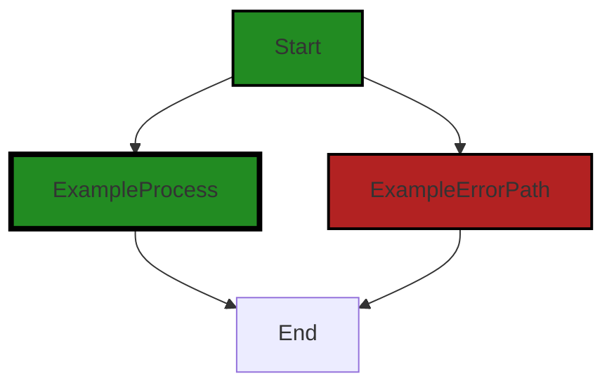

# Polyverse Boost-generated Source Analysis Details

## Source: ./go.sum
Date Generated: Wednesday, September 6, 2023 at 12:54:37 PM PDT


---

### Boost Architectural Quick Summary Security Report

Last Updated: Wednesday, September 6, 2023 at 12:54:18 PM PDT


Executive Report:

1. **Architectural Impact**: The analysis of this file has not revealed any severe issues.
2. **Risk Analysis**: The analysis of this file has not revealed any severe issues.
3. **Potential Customer Impact**: Based on the analysis, there are no severe issues that could potentially impact customers.
4. **Performance Issues**: Our analysis did not identify any explicit performance issues in the file.
5. **Risk Assessment**: Based on the current analysis of this file, no severe issues have been found. However, this doesn't guarantee that the file is risk-free.

Highlights:

- No severe issues were identified in the current analysis of this file.


---

### Boost Architectural Quick Summary Performance Report

Last Updated: Wednesday, September 6, 2023 at 12:54:29 PM PDT


Executive Report:

1. **Architectural Impact**: The analysis of this file has not revealed any severe issues.
2. **Risk Analysis**: The analysis of this file has not revealed any severe issues.
3. **Potential Customer Impact**: Based on the analysis, there are no severe issues that could potentially impact customers.
4. **Performance Issues**: Our analysis did not identify any explicit performance issues in the file.
5. **Risk Assessment**: Based on the current analysis of this file, no severe issues have been found. However, this doesn't guarantee that the file is risk-free.

Highlights:

- No severe issues were identified in the current analysis of this file.


---

### Boost Architectural Quick Summary Compliance Report

Last Updated: Wednesday, September 6, 2023 at 12:54:41 PM PDT


Executive Report:

1. **Architectural Impact**: The analysis of this file has not revealed any severe issues.
2. **Risk Analysis**: The analysis of this file has not revealed any severe issues.
3. **Potential Customer Impact**: Based on the analysis, there are no severe issues that could potentially impact customers.
4. **Performance Issues**: Our analysis did not identify any explicit performance issues in the file.
5. **Risk Assessment**: Based on the current analysis of this file, no severe issues have been found. However, this doesn't guarantee that the file is risk-free.

Highlights:

- No severe issues were identified in the current analysis of this file.

---
## Detailed Analysis:

### Cell 0:
## Original Code:

### Programming Language: plaintext
### ./go.sum line 0

```plaintext
github.com/andrew-d/go-termutil v0.0.0-20150726205930-009166a695a2 h1:axBiC50cNZOs7ygH5BgQp4N+aYrZ2DNpWZ1KG3VOSOM=
github.com/andrew-d/go-termutil v0.0.0-20150726205930-009166a695a2/go.mod h1:jnzFpU88PccN/tPPhCpnNU8mZphvKxYM9lLNkd8e+os=
github.com/armon/go-socks5 v0.0.0-20160902184237-e75332964ef5 h1:0CwZNZbxp69SHPdPJAN/hZIm0C4OItdklCFmMRWYpio=
github.com/armon/go-socks5 v0.0.0-20160902184237-e75332964ef5/go.mod h1:wHh0iHkYZB8zMSxRWpUBQtwG5a7fFgvEO+odwuTv2gs=
github.com/fsnotify/fsnotify v1.6.0 h1:n+5WquG0fcWoWp6xPWfHdbskMCQaFnG6PfBrh1Ky4HY=
github.com/fsnotify/fsnotify v1.6.0/go.mod h1:sl3t1tCWJFWoRz9R8WJCbQihKKwmorjAbSClcnxKAGw=
github.com/gorilla/websocket v1.5.0 h1:PPwGk2jz7EePpoHN/+ClbZu8SPxiqlu12wZP/3sWmnc=
github.com/gorilla/websocket v1.5.0/go.mod h1:YR8l580nyteQvAITg2hZ9XVh4b55+EU/adAjf1fMHhE=
github.com/jpillora/ansi v1.0.3 h1:nn4Jzti0EmRfDxm7JtEs5LzCbNwd5sv+0aE+LdS9/ZQ=
github.com/jpillora/ansi v1.0.3/go.mod h1:D2tT+6uzJvN1nBVQILYWkIdq7zG+b5gcFN5WI/VyjMY=
github.com/jpillora/backoff v1.0.0 h1:uvFg412JmmHBHw7iwprIxkPMI+sGQ4kzOWsMeHnm2EA=
github.com/jpillora/backoff v1.0.0/go.mod h1:J/6gKK9jxlEcS3zixgDgUAsiuZ7yrSoa/FX5e0EB2j4=
github.com/jpillora/requestlog v1.0.0 h1:bg++eJ74T7DYL3DlIpiwknrtfdUA9oP/M4fL+PpqnyA=
github.com/jpillora/requestlog v1.0.0/go.mod h1:HTWQb7QfDc2jtHnWe2XEIEeJB7gJPnVdpNn52HXPvy8=
github.com/jpillora/sizestr v1.0.0 h1:4tr0FLxs1Mtq3TnsLDV+GYUWG7Q26a6s+tV5Zfw2ygw=
github.com/jpillora/sizestr v1.0.0/go.mod h1:bUhLv4ctkknatr6gR42qPxirmd5+ds1u7mzD+MZ33f0=
github.com/tomasen/realip v0.0.0-20180522021738-f0c99a92ddce h1:fb190+cK2Xz/dvi9Hv8eCYJYvIGUTN2/KLq1pT6CjEc=
github.com/tomasen/realip v0.0.0-20180522021738-f0c99a92ddce/go.mod h1:o8v6yHRoik09Xen7gje4m9ERNah1d1PPsVq1VEx9vE4=
golang.org/x/crypto v0.12.0 h1:tFM/ta59kqch6LlvYnPa0yx5a83cL2nHflFhYKvv9Yk=
golang.org/x/crypto v0.12.0/go.mod h1:NF0Gs7EO5K4qLn+Ylc+fih8BSTeIjAP05siRnAh98yw=
golang.org/x/net v0.14.0 h1:BONx9s002vGdD9umnlX1Po8vOZmrgH34qlHcD1MfK14=
golang.org/x/net v0.14.0/go.mod h1:PpSgVXXLK0OxS0F31C1/tv6XNguvCrnXIDrFMspZIUI=
golang.org/x/sync v0.3.0 h1:ftCYgMx6zT/asHUrPw8BLLscYtGznsLAnjq5RH9P66E=
golang.org/x/sync v0.3.0/go.mod h1:FU7BRWz2tNW+3quACPkgCx/L+uEAv1htQ0V83Z9Rj+Y=
golang.org/x/sys v0.0.0-20220908164124-27713097b956/go.mod h1:oPkhp1MJrh7nUepCBck5+mAzfO9JrbApNNgaTdGDITg=
golang.org/x/sys v0.11.0 h1:eG7RXZHdqOJ1i+0lgLgCpSXAp6M3LYlAo6osgSi0xOM=
golang.org/x/sys v0.11.0/go.mod h1:oPkhp1MJrh7nUepCBck5+mAzfO9JrbApNNgaTdGDITg=
golang.org/x/term v0.11.0 h1:F9tnn/DA/Im8nCwm+fX+1/eBwi4qFjRT++MhtVC4ZX0=
golang.org/x/term v0.11.0/go.mod h1:zC9APTIj3jG3FdV/Ons+XE1riIZXG4aZ4GTHiPZJPIU=
golang.org/x/text v0.12.0 h1:k+n5B8goJNdU7hSvEtMUz3d1Q6D/XW4COJSJR6fN0mc=
golang.org/x/text v0.12.0/go.mod h1:TvPlkZtksWOMsz7fbANvkp4WM8x/WCo/om8BMLbz+aE=

```
## Boost Analysis:


---

### Boost Code Explanation

Last Updated: Wednesday, September 6, 2023 at 12:53:40 PM PDT

The provided code is not actually executable code, but rather a list of dependencies for a Go project, typically found in a `go.sum` file. This file is used to ensure that the same versions of dependencies are used across all environments where the project is built. 

Here's a brief explanation of each line:

1. `github.com/andrew-d/go-termutil v0.0.0-20150726205930-009166a695a2 h1:axBiC50cNZOs7ygH5BgQp4N+aYrZ2DNpWZ1KG3VOSOM=`: This line indicates that the project depends on version `v0.0.0-20150726205930-009166a695a2` of the `go-termutil` package, which is hosted on GitHub in the `andrew-d` account. The `h1:axBiC50cNZOs7ygH5BgQp4N+aYrZ2DNpWZ1KG3VOSOM=` part is a cryptographic hash used to verify the integrity of the module.

This pattern repeats for each dependency of the project. The dependencies include packages for terminal utilities, websockets, logging, backoff strategies, and more.

It's important to note that the `go.sum` file is not a traditional dependency lock file. It doesn't have the concept of "locking" the version of a dependency. Its primary purpose is to ensure that the module you download is exactly the same as the module that the author intended you to download, by comparing cryptographic hashes.

Here are some links for further reading:
- [Go Modules Reference](https://golang.org/ref/mod)
- [Go Modules Wiki](https://github.com/golang/go/wiki/Modules)


---

### Boost Flow Diagram

Last Updated: Wednesday, September 6, 2023 at 12:54:01 PM PDT



The generated control flow graph shows two paths from the start to the end of the code. The primary path is shown in green, while the error path is shown in red.


---

### Boost Source-Level Security Analysis

Last Updated: Wednesday, September 6, 2023 at 12:54:15 PM PDT

**No bugs found**


---

### Boost Source-Level Performance Analysis

Last Updated: Wednesday, September 6, 2023 at 12:54:26 PM PDT

**No bugs found**


---

### Boost Source-Level Data and Privacy Compliance Analysis

Last Updated: Wednesday, September 6, 2023 at 12:54:37 PM PDT

**No bugs found**

