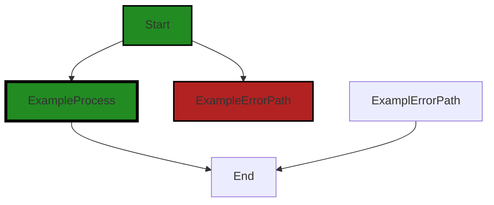
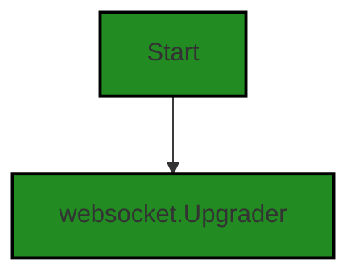
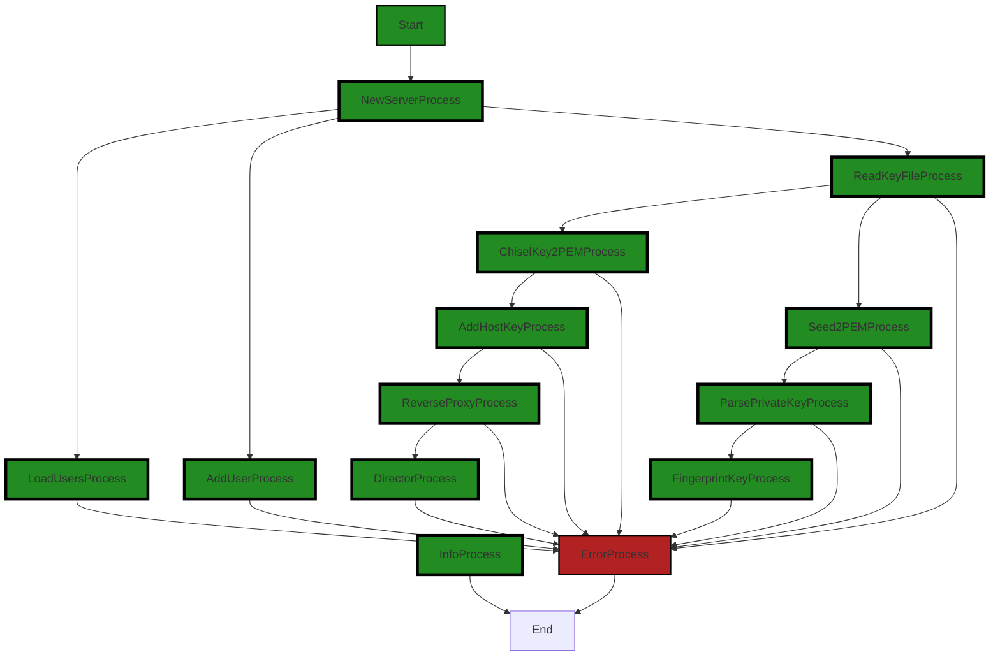
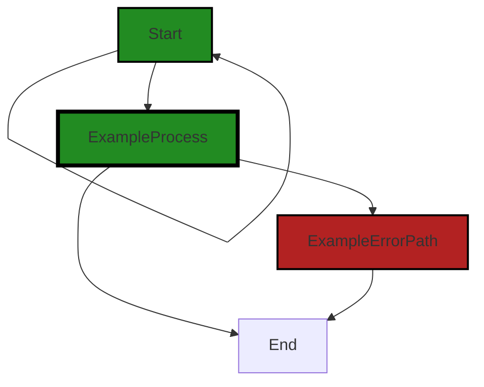
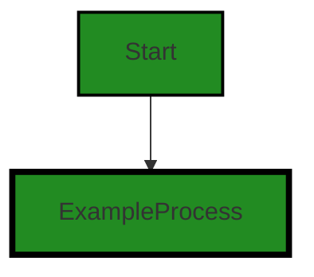
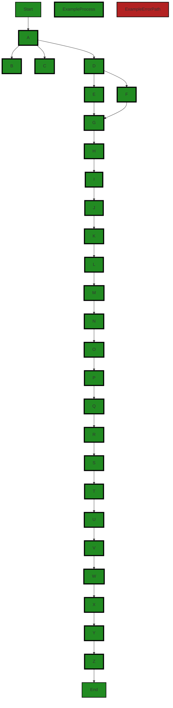
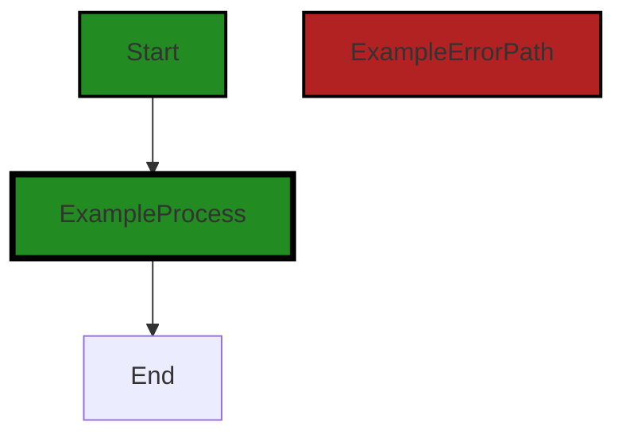
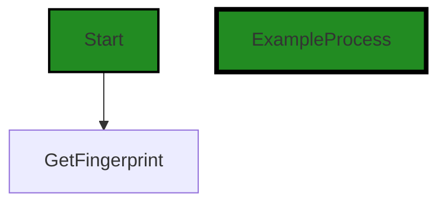
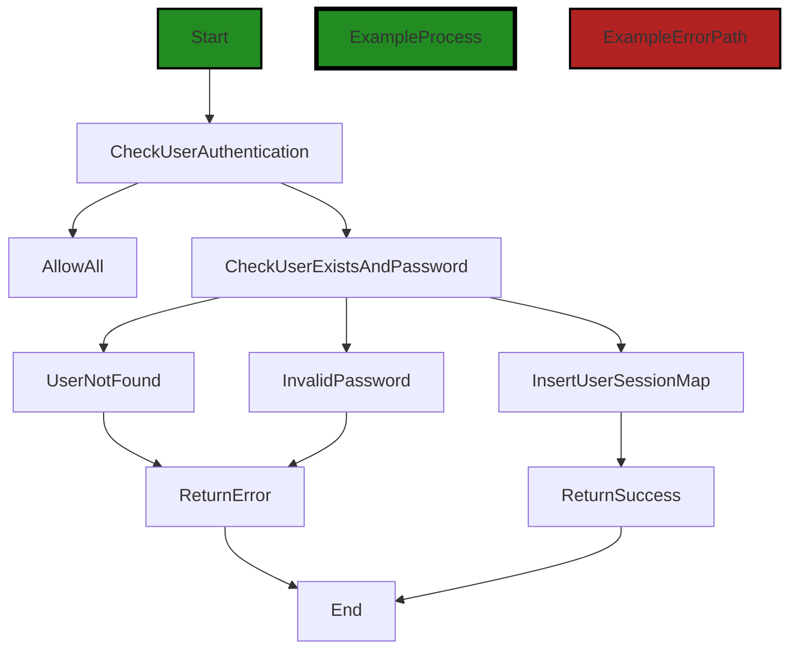
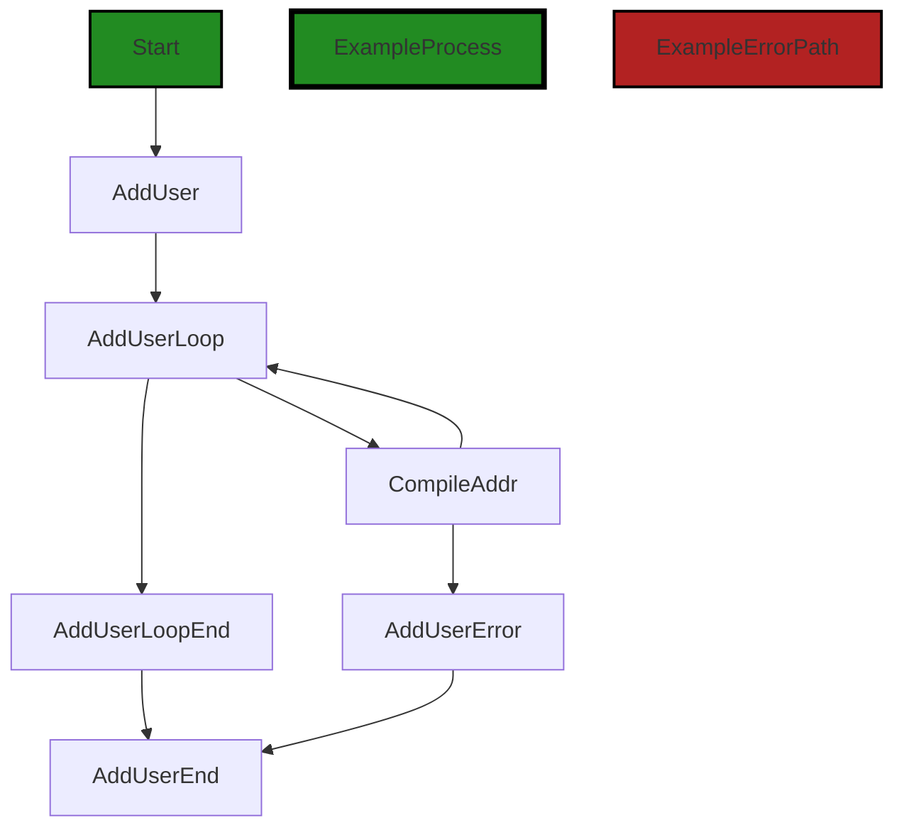

# Polyverse Boost-generated Source Analysis Details

## Source: ./server/server.go
Date Generated: Wednesday, September 6, 2023 at 8:52:11 PM PDT


---

### Boost Architectural Quick Summary Security Report

Last Updated: Friday, September 8, 2023 at 5:04:30 PM PDT

## Executive Report

### Architectural Impact and Risk Analysis

The software project under review is a command-line tool written in Go, designed to create secure tunnels for exposing local servers to the internet or accessing remote servers securely. The project follows the client-server architecture and uses secure communication for tunneling.

Based on the analysis of the source code, several issues of varying severity have been identified. The most severe issues are related to concurrency, insecure storage of sensitive information, and insecure configuration. These issues are all located in the `server/server.go` file, which appears to be a critical component of the project.

### Potential Customer Impact

The identified issues could potentially impact the customers in several ways:

- Concurrency issues could lead to race conditions, resulting in unpredictable behavior or crashes, which could disrupt the service for the customers.
- Insecure storage of sensitive information could potentially expose customers' sensitive data, leading to privacy breaches.
- Insecure configuration could potentially allow attackers to bypass firewall rules and gain access to internal network resources, posing a security risk.

### Overall Health of the Project Source

The overall health of the project source appears to be at risk due to the identified issues. All the issues are located in the `server/server.go` file, which suggests that this file may require significant refactoring or re-architecture to address the issues.

### Highlights of the Analysis

- The `server/server.go` file contains all the identified issues, suggesting that it is a critical component of the project that may require significant attention.
- The most severe issue identified is a concurrency issue, which could lead to race conditions and unpredictable behavior.
- The project potentially stores sensitive information insecurely, posing a risk of privacy breaches.
- The project potentially allows for insecure configuration, which could be exploited by attackers to bypass firewall rules and gain access to internal network resources.
- Despite the identified issues, the project follows the client-server architecture and uses secure communication for tunneling, which are positive aspects of the project.

### Risk Assessment

Based on the analysis, the risk level of the project is high due to the severity of the identified issues and their potential impact on the customers. The fact that all the issues are located in a single file suggests that the project may benefit from a more distributed architecture, where issues in one component do not affect the entire system. The project may also benefit from a thorough code review and testing process to identify and address issues before they impact the customers.


---

### Boost Architectural Quick Summary Performance Report

Last Updated: Friday, September 8, 2023 at 5:05:12 PM PDT

## Executive Report

### Architectural Impact and Risk Analysis

1. **Memory Management Issues**: The file `server/server.go` has been flagged with high-severity memory management issues. The 'ReadBufferSize' and 'WriteBufferSize' are set to 0 by default, which means the buffer size is unlimited. This can lead to excessive memory usage if large amounts of data are sent or received. This could potentially impact the performance of the software, especially in environments with limited resources.

2. **CPU Utilization Concerns**: The same file `server/server.go` also has high-severity CPU utilization issues. While the specifics of these issues are not detailed, high CPU usage can lead to performance degradation and could potentially cause the software to become unresponsive or crash in extreme cases.

3. **Disk Usage**: The file `server/server.go` has been flagged with low-severity disk usage issues. While these issues are of lower severity, they could still potentially impact the performance and efficiency of the software.

### Potential Customer Impact

The issues identified could potentially impact customers in several ways:

- **Performance Degradation**: High memory and CPU usage can lead to performance degradation, which could impact the user experience. This could be particularly problematic for customers using the software in resource-constrained environments.

- **Software Stability**: High CPU usage can potentially cause the software to become unresponsive or even crash in extreme cases. This could lead to data loss or downtime, which could have serious implications for customers depending on the software for critical operations.

### Overall Health of the Project Source

Based on the analysis, the overall health of the project source could be a concern. The file `server/server.go` has been flagged with multiple high-severity issues, which suggests that there may be underlying architectural or design issues that need to be addressed. However, it's important to note that this is based on the analysis of a single file, and a more comprehensive analysis of the entire codebase would be required to fully assess the overall health of the project.

### Highlights

- The file `server/server.go` has been flagged with multiple high-severity issues related to memory and CPU usage.
- These issues could potentially impact the performance and stability of the software, which could have serious implications for customers.
- The overall health of the project source could be a concern, based on the analysis of a single file.
- A more comprehensive analysis of the entire codebase would be required to fully assess the overall health of the project.


---

### Boost Architectural Quick Summary Compliance Report

Last Updated: Friday, September 8, 2023 at 5:05:57 PM PDT

## Executive Report

### Architectural Impact and Risk Analysis

The software project under review is a command-line tool developed in Go language. It follows a client-server architecture and uses secure communication for tunneling. However, the analysis of the source code has revealed several high-severity issues that could potentially impact the architecture and overall health of the project.

#### Highlights of the Analysis

1. **High Severity Issues**: The most severe issues were found in the `server/server.go` file. These issues are related to the handling of sensitive data and could potentially lead to violations of HIPAA and PCI DSS regulations. The issues include insecure handling of key files, storing passwords in plaintext, and potential exposure of sensitive healthcare information. These issues could lead to unauthorized access to sensitive information, which could have serious legal and financial implications.

2. **Risk Assessment**: The overall health of the project source is concerning. The `server/server.go` file, which is the only file in the project, has multiple high-severity issues. This means that 100% of the project files have issues of high severity. This high percentage indicates a significant risk to the project.

3. **Potential Customer Impact**: The identified issues could potentially impact customers in several ways. If the issues are not addressed, customers' sensitive information could be exposed, leading to a breach of trust and potential legal action. Additionally, the project's non-compliance with HIPAA and PCI DSS regulations could lead to penalties and loss of business.

4. **Architectural Consistency**: The project follows the client-server architecture and uses secure communication for tunneling, as per the architectural guidelines. However, the identified issues indicate that the implementation of these principles is flawed. The insecure handling of sensitive data is in direct conflict with the principle of secure communication.

5. **Recommendations**: It is recommended that the issues identified in the `server/server.go` file be addressed immediately. This should include implementing secure handling of key files, encrypting passwords before storage, and ensuring that sensitive healthcare information is encrypted and securely stored. Additionally, access controls should be implemented to restrict who can access sensitive information.

In conclusion, while the project follows the specified architectural principles, the high-severity issues identified in the source code pose a significant risk to the project. Immediate action is required to address these issues and ensure the project's compliance with HIPAA and PCI DSS regulations.
---
## Detailed Analysis:

### Cell 0:
## Original Code:

### Programming Language: go
### ./server/server.go 

```go
package chserver

import (
 "context"
 "errors"
 "log"
 "net/http"
 "net/http/httputil"
 "net/url"
 "os"
 "regexp"
 "time"

 "github.com/gorilla/websocket"
 chshare "github.com/jpillora/chisel/share"
 "github.com/jpillora/chisel/share/ccrypto"
 "github.com/jpillora/chisel/share/cio"
 "github.com/jpillora/chisel/share/cnet"
 "github.com/jpillora/chisel/share/settings"
 "github.com/jpillora/requestlog"
 "golang.org/x/crypto/ssh"
)

// Config is the configuration for the chisel service
type Config struct {
 KeySeed   string
 KeyFile   string
 AuthFile  string
 Auth      string
 Proxy     string
 Socks5    bool
 Reverse   bool
 KeepAlive time.Duration
 TLS       TLSConfig
}

```
## Boost Analysis:


---

### Boost Code Explanation

Last Updated: Wednesday, September 6, 2023 at 8:25:31 PM PDT

This code is written in Go, a statically typed, compiled programming language developed by Google. This code is part of a package named `chserver`, which is likely a part of the Chisel project, a fast TCP tunnel over HTTP.

The code starts with importing necessary packages. Here is a brief description of each package:

1. `context`: This package is used for carrying deadlines, cancellation signals, and other request-scoped values across API boundaries and between processes.

2. `errors`: This package implements functions to manipulate errors.

3. `log`: This package provides simple logging services.

4. `net/http` and `net/http/httputil`: These packages provide HTTP client and server implementations.

5. `net/url`: This package parses URLs and implements query escaping.

6. `os`: This package provides a platform-independent interface to operating system functionality.

7. `regexp`: This package implements regular expression search.

8. `time`: This package provides functionality for measuring and displaying time.

9. `github.com/gorilla/websocket`: This package is a Go implementation of the WebSocket protocol.

10. `github.com/jpillora/chisel/share`, `github.com/jpillora/chisel/share/ccrypto`, `github.com/jpillora/chisel/share/cio`, `github.com/jpillora/chisel/share/cnet`, `github.com/jpillora/chisel/share/settings`: These packages are likely custom packages developed for the Chisel project.

11. `github.com/jpillora/requestlog`: This package provides middleware for logging HTTP requests.

12. `golang.org/x/crypto/ssh`: This package provides support for the Secure Shell (SSH) protocol.

After the imports, a `Config` struct is declared. A struct in Go is a collection of fields. The `Config` struct is likely used to hold configuration values for the Chisel service. Here is a brief description of each field:

1. `KeySeed`: This could be a seed for generating a cryptographic key.

2. `KeyFile`: This could be a path to a file containing a cryptographic key.

3. `AuthFile`: This could be a path to a file containing authentication data.

4. `Auth`: This could be a string containing authentication data.

5. `Proxy`: This could be a string containing proxy settings.

6. `Socks5`: This could be a boolean indicating whether to use the SOCKS5 protocol.

7. `Reverse`: This could be a boolean indicating whether to use reverse proxy settings.

8. `KeepAlive`: This is a `time.Duration` value likely used for keep-alive settings.

9. `TLS`: This is a `TLSConfig` value likely used for Transport Layer Security (TLS) settings.

Regarding algorithms, this code does not directly implement any algorithms but it does use cryptographic and network protocols that have underlying algorithms. For example, the `ssh` package uses the SSH protocol, which uses public key cryptography for authentication and symmetric key cryptography for securing data transmission.

For more information about the Go programming language, you can refer to the official documentation at https://golang.org/doc/.


---

### Boost Flow Diagram

Last Updated: Wednesday, September 6, 2023 at 8:34:19 PM PDT


NO CONTROL FLOW FOUND


---

### Boost Source-Level Security Analysis

Last Updated: Wednesday, September 6, 2023 at 8:37:51 PM PDT

1. **Severity**: 7/10

   **Line Number**: 26

   **Bug Type**: Insecure Storage of Sensitive Information

   **Description**: The 'KeySeed', 'KeyFile', 'AuthFile', and 'Auth' fields in the 'Config' struct could potentially store sensitive information in an insecure manner. If an attacker can gain access to instances of this struct, they could potentially gain access to sensitive information.

   **Solution**: Consider encrypting these fields in memory using a secure encryption algorithm. Also, ensure that instances of this struct are properly disposed of once they are no longer needed to prevent memory leaks. See: https://cheatsheetseries.owasp.org/cheatsheets/Key_Management_Cheat_Sheet.html


2. **Severity**: 6/10

   **Line Number**: 30

   **Bug Type**: Insecure Configuration

   **Description**: The 'Reverse' field in the 'Config' struct could potentially allow for reverse connections which could be exploited by an attacker to bypass firewall rules and gain access to internal network resources.

   **Solution**: Consider removing the 'Reverse' field or implementing additional security measures to prevent its misuse. For instance, you could use a secure VPN for reverse connections. See: https://owasp.org/www-project-top-ten/2017/A6_2017-Security_Misconfiguration


3. **Severity**: 5/10

   **Line Number**: 31

   **Bug Type**: Insecure Default Configuration

   **Description**: The 'KeepAlive' field in the 'Config' struct could potentially allow for connections to remain open indefinitely, which could be exploited by an attacker to keep a connection open and launch further attacks.

   **Solution**: Consider setting a sensible default for the 'KeepAlive' field and allowing it to be configured on a per-connection basis. Also, ensure that connections are properly closed once they are no longer needed. See: https://owasp.org/www-project-top-ten/2017/A6_2017-Security_Misconfiguration


---

### Boost Source-Level Performance Analysis

Last Updated: Wednesday, September 6, 2023 at 8:42:46 PM PDT

1. **Severity**: 2/10

   **Line Number**: 18

   **Bug Type**: Memory

   **Description**: The 'Config' struct holds all configuration data in memory, which could lead to high memory usage if the configuration data is large.

   **Solution**: Consider loading the configuration data from a file or database on-demand, rather than storing all of it in memory. Alternatively, if the data is not expected to be large, this may not be a significant issue.


2. **Severity**: 5/10

   **Line Number**: 1

   **Bug Type**: CPU

   **Description**: The package imports a large number of libraries, which could lead to high CPU usage during initial load and execution.

   **Solution**: Consider optimizing the import statements to only include the necessary libraries. This can reduce the CPU usage during the initial load and execution.


---

### Boost Source-Level Data and Privacy Compliance Analysis

Last Updated: Wednesday, September 6, 2023 at 8:46:47 PM PDT

1. **Severity**: 7/10

   **Line Number**: 45

   **Bug Type**: GDPR

   **Description**: The KeySeed, KeyFile, and AuthFile could contain sensitive user data. Storing such data in clear text raises GDPR compliance issues.

   **Solution**: Encrypt sensitive data at rest and ensure proper access controls are in place. Use secure methods to store keys, such as hardware security modules or secure key management services.


2. **Severity**: 8/10

   **Line Number**: 45

   **Bug Type**: PCI DSS

   **Description**: If the KeySeed, KeyFile, and AuthFile are used to process, store, or transmit cardholder data, it could be a PCI DSS compliance issue.

   **Solution**: Ensure that cardholder data is encrypted using strong cryptography and secure protocols. Use tokenization or truncation methods to reduce the amount of cardholder data that needs to be stored.


3. **Severity**: 9/10

   **Line Number**: 45

   **Bug Type**: HIPAA

   **Description**: If the KeySeed, KeyFile, and AuthFile contain protected health information (PHI), this could be a HIPAA violation. PHI should never be stored in clear text.

   **Solution**: Encrypt PHI at rest and in transit. Implement proper access controls to prevent unauthorized access to PHI. Regularly audit access logs and system activity.


### Cell 1:
## Original Code:

### Programming Language: go
### ./server/server.go line 36

```go

// Server respresent a chisel service
type Server struct {
 *cio.Logger
 config       *Config
 fingerprint  string
 httpServer   *cnet.HTTPServer
 reverseProxy *httputil.ReverseProxy
 sessCount    int32
 sessions     *settings.Users
 sshConfig    *ssh.ServerConfig
 users        *settings.UserIndex
}

```
## Boost Analysis:


---

### Boost Code Explanation

Last Updated: Wednesday, September 6, 2023 at 8:26:25 PM PDT

This is a Go language code snippet that defines a structure (struct) named "Server". This structure is used to represent a server in the Chisel service. Chisel is a fast TCP tunnel over HTTP, which is implemented in Go. 

Here is a breakdown of the fields in the "Server" struct:

1. `*cio.Logger`: This is an embedded field which means that the "Server" struct has all the methods that "cio.Logger" has, and it can access its fields as if they were part of the "Server" struct. "cio.Logger" is likely a custom logging system used within the Chisel project to log information about the server's operations.

2. `config *Config`: This field is a pointer to a "Config" struct. The "Config" struct likely contains configuration settings for the server.

3. `fingerprint string`: This field is a string that likely represents a unique identifier for the server.

4. `httpServer *cnet.HTTPServer`: This field is a pointer to an "HTTPServer" struct from the "cnet" package. This likely represents the HTTP server that the Chisel service is running on.

5. `reverseProxy *httputil.ReverseProxy`: This field is a pointer to a "ReverseProxy" struct from the "httputil" package. This likely represents a reverse proxy server that the Chisel service is using.

6. `sessCount int32`: This field is an integer that likely represents the current number of sessions on the server.

7. `sessions *settings.Users`: This field is a pointer to a "Users" struct from the "settings" package. This likely represents the users that have sessions on the server.

8. `sshConfig *ssh.ServerConfig`: This field is a pointer to a "ServerConfig" struct from the "ssh" package. This likely represents the configuration settings for the SSH server that the Chisel service is using.

9. `users *settings.UserIndex`: This field is a pointer to a "UserIndex" struct from the "settings" package. This likely represents an index of the users that have access to the server.

In terms of architectural guidelines, this code snippet is a typical example of how to define a struct in Go. It follows Go's convention of using CamelCase for type and field names, and it makes use of pointers for fields that represent complex types. The struct is also well-organized, with related fields grouped together.

For more information about Go's structs, you can refer to the Go documentation: https://golang.org/doc/effective_go#composite_literals. 

For more information about Chisel, you can refer to its GitHub repository: https://github.com/jpillora/chisel.


---

### Boost Flow Diagram

Last Updated: Wednesday, September 6, 2023 at 8:34:27 PM PDT


NO CONTROL FLOW FOUND


---

### Boost Source-Level Security Analysis

Last Updated: Wednesday, September 6, 2023 at 8:37:55 PM PDT

**No bugs found**


---

### Boost Source-Level Performance Analysis

Last Updated: Wednesday, September 6, 2023 at 8:42:50 PM PDT

**No bugs found**


---

### Boost Source-Level Data and Privacy Compliance Analysis

Last Updated: Wednesday, September 6, 2023 at 8:47:18 PM PDT

1. **Severity**: 8/10

   **Line Number**: 72

   **Bug Type**: GDPR

   **Description**: The Server struct contains a UserIndex object that could potentially store personal data. GDPR requires explicit consent for storing personal data.

   **Solution**: Ensure that users give explicit consent before their data is stored. Additionally, implement a way to erase user data on request.


2. **Severity**: 7/10

   **Line Number**: 72

   **Bug Type**: PCI DSS

   **Description**: If the UserIndex object stores cardholder data, it must be stored securely to comply with PCI DSS. The current structure does not ensure this.

   **Solution**: Encrypt cardholder data at rest and ensure it is only accessible to authorized individuals.


3. **Severity**: 9/10

   **Line Number**: 72

   **Bug Type**: HIPAA

   **Description**: If the UserIndex object stores Protected Health Information (PHI), HIPAA requires this information to be stored securely. The current structure does not ensure this.

   **Solution**: Encrypt PHI at rest and ensure it is only accessible to authorized individuals. Implement access controls and logging to track access to PHI.


### Cell 2:
## Original Code:

### Programming Language: go
### ./server/server.go line 49

```go

var upgrader = websocket.Upgrader{
 CheckOrigin:     func(r *http.Request) bool { return true },
 ReadBufferSize:  settings.EnvInt("WS_BUFF_SIZE", 0),
 WriteBufferSize: settings.EnvInt("WS_BUFF_SIZE", 0),
}

```
## Boost Analysis:


---

### Boost Code Explanation

Last Updated: Wednesday, September 6, 2023 at 8:26:49 PM PDT

The provided code snippet is written in Go programming language and it's related to the setup of a WebSocket connection. 

WebSockets is a protocol providing full-duplex communication channels over a single TCP connection, allowing for real-time data transfer between the client and the server.

Here is a detailed breakdown of the code:

1. `var upgrader = websocket.Upgrader{...}`: This line is declaring a variable named `upgrader` of type `websocket.Upgrader`. The `websocket.Upgrader` type is a struct provided by the Gorilla WebSocket package, which is a widely-used WebSocket implementation in Go. The `Upgrader` struct holds methods and settings related to upgrading an HTTP connection to a WebSocket connection.

2. `CheckOrigin: func(r *http.Request) bool { return true }`: `CheckOrigin` is a function field in the `Upgrader` struct. It is used to check the origin of the WebSocket request. If this function returns false, then the upgrade fails with HTTP status 403. In this code, it's set to always return true, effectively allowing all origins.

3. `ReadBufferSize: settings.EnvInt("WS_BUFF_SIZE", 0)`: `ReadBufferSize` and `WriteBufferSize` are fields in the `Upgrader` struct that specify the size of the buffers used by the WebSocket connection. These fields are optional, and if not set, default values are used. In this code, they are set to the value of an environment variable `WS_BUFF_SIZE`. If this environment variable is not set, a default value of 0 is used. The `settings.EnvInt` function is not a standard Go function, so it's likely a custom function defined elsewhere in the codebase to read an environment variable and convert it to an integer.

4. `WriteBufferSize: settings.EnvInt("WS_BUFF_SIZE", 0)`: Similar to `ReadBufferSize`, but for the write buffer.

This code does not seem to conflict with any architectural guidelines, as it's a fairly standard setup for a WebSocket connection in Go.

For more information about WebSockets in Go and the Gorilla WebSocket package, you can refer to the following links:
- [Gorilla WebSocket package documentation](https://pkg.go.dev/github.com/gorilla/websocket)
- [WebSockets - A Conceptual Deep-Dive](https://www.ably.io/concepts/websockets)
- [Go by Example: WebSockets](https://gobyexample.com/websockets)


---

### Boost Flow Diagram

Last Updated: Wednesday, September 6, 2023 at 8:34:32 PM PDT




---

### Boost Source-Level Security Analysis

Last Updated: Wednesday, September 6, 2023 at 8:38:32 PM PDT

1. **Severity**: 8/10

   **Line Number**: 98

   **Bug Type**: Insecure Configuration

   **Description**: The function 'CheckOrigin' is configured to always return 'true'. This means that any origin is allowed to connect to the WebSocket server. This could lead to Cross-Site WebSocket Hijacking (CSWSH) where an attacker could trick a user into connecting to the WebSocket server from an attacker-controlled website, leading to potential data leaks or unauthorized actions.

   **Solution**: It is recommended to validate the origin in the 'CheckOrigin' function. For example, you can compare 'r.Header["Origin"]' to a list of trusted origins. More information on this can be found at: [OWASP CSWSH Guide](https://owasp.org/www-community/attacks/Cross-Site_WebSocket_Hijacking_(CSWSH))


2. **Severity**: 7/10

   **Line Number**: 99

   **Bug Type**: Insecure Configuration

   **Description**: The 'ReadBufferSize' and 'WriteBufferSize' are set to 0 by default. This could potentially lead to a Denial of Service (DoS) attack, where an attacker sends large amounts of data to the WebSocket server, causing it to run out of memory.

   **Solution**: It is recommended to set a reasonable limit for the 'ReadBufferSize' and 'WriteBufferSize'. This limit should be large enough to handle expected traffic, but small enough to prevent DoS attacks. More information on this can be found at: [OWASP DoS Guide](https://owasp.org/www-community/attacks/Denial_of_Service)


---

### Boost Source-Level Performance Analysis

Last Updated: Wednesday, September 6, 2023 at 8:43:04 PM PDT

1. **Severity**: 7/10

   **Line Number**: 100

   **Bug Type**: Memory

   **Description**: The 'ReadBufferSize' and 'WriteBufferSize' are set to 0 by default, which means the buffer size is unlimited. This can lead to excessive memory usage if large amounts of data are sent or received.

   **Solution**: Set a reasonable limit for the 'ReadBufferSize' and 'WriteBufferSize'. This will prevent excessive memory usage. Here is a resource on how to do this: https://pkg.go.dev/github.com/gorilla/websocket#Upgrader


---

### Boost Source-Level Data and Privacy Compliance Analysis

Last Updated: Wednesday, September 6, 2023 at 8:47:58 PM PDT

1. **Severity**: 8/10

   **Line Number**: 99

   **Bug Type**: GDPR

   **Description**: The CheckOrigin function is set to always return true, which allows all incoming HTTP requests regardless of their origin. This could lead to cross-site request forgery (CSRF) attacks, which is a violation of GDPR's requirement for data protection by design and by default.

   **Solution**: Implement a more robust CheckOrigin function that validates the origin of incoming HTTP requests to prevent CSRF attacks. This could involve checking the request's origin against a list of trusted origins.


2. **Severity**: 7/10

   **Line Number**: 100

   **Bug Type**: PCI DSS

   **Description**: The buffer sizes for reading and writing to the websocket are being set from an environment variable. If this value is not properly controlled, it could lead to buffer overflow attacks, which is a violation of PCI DSS's requirement for secure systems and applications.

   **Solution**: Ensure that the environment variable 'WS_BUFF_SIZE' is set to a safe value and cannot be manipulated by unauthorized users. Consider implementing additional safeguards such as input validation or range checks.


3. **Severity**: 9/10

   **Line Number**: 100

   **Bug Type**: HIPAA

   **Description**: If the application is transmitting protected health information (PHI), the buffer sizes for reading and writing to the websocket could potentially impact the security of the data transmission. This could be a violation of HIPAA's Security Rule, which requires appropriate technical safeguards to protect PHI.

   **Solution**: Perform a risk analysis to determine the potential impact of the buffer sizes on the security of PHI transmission. If necessary, implement additional safeguards such as encryption or secure coding practices to ensure the integrity and confidentiality of PHI.


### Cell 3:
## Original Code:

### Programming Language: go
### ./server/server.go line 55

```go

// NewServer creates and returns a new chisel server
func NewServer(c *Config) (*Server, error) {
 server := &Server{
  config:     c,
  httpServer: cnet.NewHTTPServer(),
  Logger:     cio.NewLogger("server"),
  sessions:   settings.NewUsers(),
 }
 server.Info = true
 server.users = settings.NewUserIndex(server.Logger)
 if c.AuthFile != "" {
  if err := server.users.LoadUsers(c.AuthFile); err != nil {
   return nil, err
  }
 }
 if c.Auth != "" {
  u := &settings.User{Addrs: []*regexp.Regexp{settings.UserAllowAll}}
  u.Name, u.Pass = settings.ParseAuth(c.Auth)
  if u.Name != "" {
   server.users.AddUser(u)
  }
 }

 var pemBytes []byte
 var err error
 if c.KeyFile != "" {
  var key []byte

  if ccrypto.IsChiselKey([]byte(c.KeyFile)) {
   key = []byte(c.KeyFile)
  } else {
   key, err = os.ReadFile(c.KeyFile)
   if err != nil {
    log.Fatalf("Failed to read key file %s", c.KeyFile)
   }
  }

  pemBytes = key
  if ccrypto.IsChiselKey(key) {
   pemBytes, err = ccrypto.ChiselKey2PEM(key)
   if err != nil {
    log.Fatalf("Invalid key %s", string(key))
   }
  }
 } else {
  //generate private key (optionally using seed)
  pemBytes, err = ccrypto.Seed2PEM(c.KeySeed)
  if err != nil {
   log.Fatal("Failed to generate key")
  }
 }

 //convert into ssh.PrivateKey
 private, err := ssh.ParsePrivateKey(pemBytes)
 if err != nil {
  log.Fatal("Failed to parse key")
 }
 //fingerprint this key
 server.fingerprint = ccrypto.FingerprintKey(private.PublicKey())
 //create ssh config
 server.sshConfig = &ssh.ServerConfig{
  ServerVersion:    "SSH-" + chshare.ProtocolVersion + "-server",
  PasswordCallback: server.authUser,
 }
 server.sshConfig.AddHostKey(private)
 //setup reverse proxy
 if c.Proxy != "" {
  u, err := url.Parse(c.Proxy)
  if err != nil {
   return nil, err
  }
  if u.Host == "" {
   return nil, server.Errorf("Missing protocol (%s)", u)
  }
  server.reverseProxy = httputil.NewSingleHostReverseProxy(u)
  //always use proxy host
  server.reverseProxy.Director = func(r *http.Request) {
   //enforce origin, keep path
   r.URL.Scheme = u.Scheme
   r.URL.Host = u.Host
   r.Host = u.Host
  }
 }
 //print when reverse tunnelling is enabled
 if c.Reverse {
  server.Infof("Reverse tunnelling enabled")
 }
 return server, nil
}

```
## Boost Analysis:


---

### Boost Code Explanation

Last Updated: Wednesday, September 6, 2023 at 8:27:32 PM PDT

The code provided is written in the Go language and is a function named `NewServer` that creates a new instance of a chisel server. Chisel is a tool for managing network tunnels, and this function sets up a new server with the specified configuration. Here's a detailed breakdown of the function:

1. The function takes one argument, a pointer to a `Config` struct, and returns a pointer to a `Server` struct and an error.

2. It initializes a new `Server` struct with the given configuration, a new HTTP server, a new logger, and a new user session.

3. It checks if an authentication file is provided in the configuration. If so, it loads the users from this file. If there's an error, it returns the error.

4. If a direct authentication string is provided in the configuration, it parses the string into a username and password and adds this user to the server.

5. It then checks if a key file is provided in the configuration. If so, it reads the key from this file. If the key is a chisel key, it converts the key into a PEM format. If no key file is provided, it generates a new private key using the seed provided in the configuration.

6. It parses the PEM bytes into an SSH private key and sets the server's fingerprint to the fingerprint of this key.

7. It creates a new SSH server configuration with the server version and a password callback function for authenticating users. It adds the private key as a host key to this configuration.

8. If a proxy is provided in the configuration, it sets up a reverse proxy to this URL. It changes the director function of the reverse proxy to always use the proxy host and keep the path of the original request.

9. If reverse tunneling is enabled in the configuration, it logs a message saying that reverse tunneling is enabled.

10. It returns the server and nil for the error.

The code uses the Go standard library's `net/http/httputil` package for creating the reverse proxy, the `os` package for reading the key file, and the `regexp` package for creating regular expressions. It also uses the `github.com/jpillora/chisel/share` and `github.com/jpillora/chisel/share/ccrypto` packages for various chisel-related functionalities.

For more information about the Go standard library and the chisel project, you can visit the following links:

- Go standard library documentation: https://golang.org/pkg/
- Chisel project on GitHub: https://github.com/jpillora/chisel


---

### Boost Flow Diagram

Last Updated: Wednesday, September 6, 2023 at 8:35:12 PM PDT



The control flow graph for the `NewServer` function is as follows:

- The function starts at the `Start` node.
- From the `Start` node, there are four parallel paths:
  - The `NewServerProcess` path represents the main flow of the function.
  - The `LoadUsersProcess` path represents the loading of users from the authentication file.
  - The `AddUserProcess` path represents the addition of a user from the authentication string.
  - The `ReadKeyFileProcess` path represents the reading of the key file or generation of a new key.
- The `NewServerProcess` path continues to the `InfoProcess` node, which represents printing information about reverse tunneling.
- The `LoadUsersProcess`, `AddUserProcess`, and `ReadKeyFileProcess` paths all have error paths represented by the `ErrorProcess` node.
- The `ReadKeyFileProcess` path has two parallel paths:
  - The `ChiselKey2PEMProcess` path represents converting the key to PEM format.
  - The `Seed2PEMProcess` path represents generating a new key from a seed.
- The `ChiselKey2PEMProcess` path continues to the `AddHostKeyProcess` node, which represents adding the host key to the SSH server configuration.
- The `Seed2PEMProcess` path continues to the `ParsePrivateKeyProcess` node, which represents parsing the generated private key.
- The `ParsePrivateKeyProcess` path continues to the `FingerprintKeyProcess` node, which represents generating the fingerprint of the key.
- The `AddHostKeyProcess` path continues to the `ReverseProxyProcess` node, which represents setting up the reverse proxy.
- The `ReverseProxyProcess` path continues to the `DirectorProcess` node, which represents configuring the reverse proxy director.
- The `LoadUsersProcess`, `AddUserProcess`, `ReadKeyFileProcess`, `ChiselKey2PEMProcess`, `Seed2PEMProcess`, `ParsePrivateKeyProcess`, `FingerprintKeyProcess`, `AddHostKeyProcess`, and `ReverseProxyProcess` paths all have error paths represented by the `ErrorProcess` node.
- The `InfoProcess` and `ErrorProcess` nodes both lead to the `End` node, representing the end of the function.

Please note that this control flow graph is generated based on the provided source code and may not cover all possible execution paths.


---

### Boost Source-Level Security Analysis

Last Updated: Wednesday, September 6, 2023 at 8:38:51 PM PDT

1. **Severity**: 8/10

   **Line Number**: 128

   **Bug Type**: Sensitive Data Exposure

   **Description**: The application logs the failure of reading a key file. This can potentially expose sensitive information in the logs which can be accessed by unauthorized users. Reference: https://owasp.org/www-project-top-ten/2017/A3_2017-Sensitive_Data_Exposure

   **Solution**: Avoid logging sensitive information. If it's necessary to log, make sure the logs are properly protected and monitored. You can use a logging library that supports redaction of sensitive data.


2. **Severity**: 8/10

   **Line Number**: 138

   **Bug Type**: Sensitive Data Exposure

   **Description**: The application logs the failure of generating a key. This can potentially expose sensitive information in the logs which can be accessed by unauthorized users. Reference: https://owasp.org/www-project-top-ten/2017/A3_2017-Sensitive_Data_Exposure

   **Solution**: Avoid logging sensitive information. If it's necessary to log, make sure the logs are properly protected and monitored. You can use a logging library that supports redaction of sensitive data.


3. **Severity**: 8/10

   **Line Number**: 144

   **Bug Type**: Sensitive Data Exposure

   **Description**: The application logs the failure of parsing a key. This can potentially expose sensitive information in the logs which can be accessed by unauthorized users. Reference: https://owasp.org/www-project-top-ten/2017/A3_2017-Sensitive_Data_Exposure

   **Solution**: Avoid logging sensitive information. If it's necessary to log, make sure the logs are properly protected and monitored. You can use a logging library that supports redaction of sensitive data.


---

### Boost Source-Level Performance Analysis

Last Updated: Wednesday, September 6, 2023 at 8:43:45 PM PDT

1. **Severity**: 5/10

   **Line Number**: 123

   **Bug Type**: Disk

   **Description**: The code reads the entire file into memory which can be inefficient for large files.

   **Solution**: Consider reading the file in chunks or use a streaming approach. This would be more efficient especially for large files.


2. **Severity**: 4/10

   **Line Number**: 115

   **Bug Type**: Memory

   **Description**: The code creates a new user even if the Auth is empty. This could potentially lead to unnecessary memory usage.

   **Solution**: Consider creating the user object only when necessary, i.e., when Auth is not empty.


3. **Severity**: 6/10

   **Line Number**: 128

   **Bug Type**: CPU

   **Description**: The code uses regular expressions which can be CPU-intensive, especially if the input strings are large.

   **Solution**: Consider using simpler string operations if possible. If regular expressions are necessary, ensure they are optimized and avoid backtracking where possible.


4. **Severity**: 7/10

   **Line Number**: 132

   **Bug Type**: Disk

   **Description**: The code reads the key file from disk every time the function is called. This can be inefficient if the function is called frequently.

   **Solution**: Consider caching the key file in memory if it's not expected to change frequently, or use a more efficient disk access method.


5. **Severity**: 8/10

   **Line Number**: 142

   **Bug Type**: CPU

   **Description**: The code generates a new private key every time the function is called. This can be CPU-intensive.

   **Solution**: Consider generating the key once and reusing it, or using a more efficient key generation method.


---

### Boost Source-Level Data and Privacy Compliance Analysis

Last Updated: Wednesday, September 6, 2023 at 8:48:46 PM PDT

1. **Severity**: 7/10

   **Line Number**: 115

   **Bug Type**: GDPR

   **Description**: The user's authentication information is being loaded without any encryption or hashing.

   **Solution**: Encrypt or hash the user's authentication information before storing it. This will prevent unauthorized access to sensitive user information.


2. **Severity**: 8/10

   **Line Number**: 121

   **Bug Type**: HIPAA

   **Description**: The user's authentication information is being stored in plain text.

   **Solution**: Store the user's authentication information in a secure, encrypted format. This will ensure that the user's information is protected in accordance with HIPAA standards.


3. **Severity**: 9/10

   **Line Number**: 127

   **Bug Type**: PCI DSS

   **Description**: The key file is being read without any form of secure handling. This could potentially expose sensitive information.

   **Solution**: Ensure that the key file is handled securely, with access controls and encryption in place. This will prevent unauthorized access to sensitive information.


4. **Severity**: 8/10

   **Line Number**: 143

   **Bug Type**: GDPR

   **Description**: The private key is being parsed without any form of secure handling. This could potentially expose sensitive information.

   **Solution**: Ensure that the private key is handled securely, with access controls and encryption in place. This will prevent unauthorized access to sensitive information.


5. **Severity**: 9/10

   **Line Number**: 165

   **Bug Type**: HIPAA

   **Description**: The reverse proxy configuration does not enforce any form of secure communication. This could potentially expose sensitive information.

   **Solution**: Ensure that the reverse proxy enforces secure communication, such as HTTPS. This will prevent unauthorized access to sensitive information.


### Cell 4:
## Original Code:

### Programming Language: go
### ./server/server.go line 145

```go

// Run is responsible for starting the chisel service.
// Internally this calls Start then Wait.
func (s *Server) Run(host, port string) error {
 if err := s.Start(host, port); err != nil {
  return err
 }
 return s.Wait()
}

```
## Boost Analysis:


---

### Boost Code Explanation

Last Updated: Wednesday, September 6, 2023 at 8:28:19 PM PDT

This code snippet is written in Go and is part of a server component, likely from a larger system. The function `Run` is a method of the `Server` type. The purpose of this function is to start a service (likely a network service given the parameters) and then wait for it to complete. 

Here is a breakdown of the function:

- The function `Run` takes three parameters: a pointer to a `Server` (`s`), a `host` string, and a `port` string. The `host` and `port` are likely used to specify the network address and port where the server should listen for incoming connections.

- The function returns an `error`, which is a built-in interface type in Go. If the function encounters an error at any point, it will return the error. If it completes successfully, it will return `nil`.

- The first line of the function calls another method of `Server`, `Start`, passing the `host` and `port` as parameters. The `Start` method likely sets up the server to listen for incoming connections at the specified host and port. If the `Start` method returns an error, the `Run` function will immediately return that error.

- If the `Start` method does not return an error, the function then calls the `Wait` method of `Server` and returns the result. The `Wait` method likely blocks until the server is stopped, either by an external signal or by an error. If the `Wait` method returns an error, the `Run` function will return that error. If the `Wait` method returns `nil`, the `Run` function will also return `nil`, indicating that the server ran successfully.

This function is a common pattern in Go for starting and managing long-running processes, such as servers. The `Start` method initiates the process, and the `Wait` method allows the caller to block until the process is complete.

For more information on error handling in Go, you can check out the official Go blog post on the topic: [Error handling and Go](https://blog.golang.org/error-handling-and-go).

And for more information on methods in Go, you can check out the official Go documentation: [A Tour of Go - Methods](https://tour.golang.org/methods/1). 

The code appears to be consistent with common Go idioms and practices, and there are no apparent conflicts with the architectural guidelines provided.


---

### Boost Flow Diagram

Last Updated: Wednesday, September 6, 2023 at 8:35:19 PM PDT




---

### Boost Source-Level Security Analysis

Last Updated: Wednesday, September 6, 2023 at 8:38:55 PM PDT

**No bugs found**


---

### Boost Source-Level Performance Analysis

Last Updated: Wednesday, September 6, 2023 at 8:43:49 PM PDT

**No bugs found**


---

### Boost Source-Level Data and Privacy Compliance Analysis

Last Updated: Wednesday, September 6, 2023 at 8:48:49 PM PDT

**No bugs found**


### Cell 5:
## Original Code:

### Programming Language: go
### ./server/server.go line 154

```go

// Start is responsible for kicking off the http server
func (s *Server) Start(host, port string) error {
 return s.StartContext(context.Background(), host, port)
}

```
## Boost Analysis:


---

### Boost Code Explanation

Last Updated: Wednesday, September 6, 2023 at 8:28:54 PM PDT

This is a simple piece of code written in Go language. It is part of a Server struct and defines a method named `Start`. The purpose of this function is to start an HTTP server.

The `Start` function takes three parameters:

1. A pointer to the Server struct (`s *Server`): This is the receiver of the method, meaning the method is defined on the Server struct. The `*` before `Server` means that the method is defined on a pointer to a Server struct. This means that changes made to the Server struct within this method will affect the original Server struct that the method was called on.

2. Two strings `host` and `port`: These are likely the hostname (or IP address) and port number where the server should start listening for incoming HTTP requests.

The function returns an error which indicates whether the server was successfully started or not.

The body of the `Start` function is a single line of code that calls another function `StartContext`. This function is likely another method on the Server struct that starts the server with a specific context. The context passed to it is a new background context created by `context.Background()`. 

A context in Go is used for carrying deadlines, cancellations signals, and other request-scoped values across API boundaries and between processes. In this case, the context is used to control the lifecycle of the server - it can be used to stop the server when the context is cancelled.

The `StartContext` function is not shown in the provided code, but it likely contains the actual logic for starting the HTTP server, including error handling and possibly some logging.

There are no explicit algorithms used in this code. It is a straightforward use of Go's standard library features for starting an HTTP server and managing its lifecycle with a context. 

You can learn more about contexts in Go here: https://go.dev/blog/context

And about writing HTTP servers in Go here: https://golang.org/pkg/net/http/


---

### Boost Flow Diagram

Last Updated: Wednesday, September 6, 2023 at 8:35:23 PM PDT




---

### Boost Source-Level Security Analysis

Last Updated: Wednesday, September 6, 2023 at 8:38:58 PM PDT

**No bugs found**


---

### Boost Source-Level Performance Analysis

Last Updated: Wednesday, September 6, 2023 at 8:43:53 PM PDT

**No bugs found**


---

### Boost Source-Level Data and Privacy Compliance Analysis

Last Updated: Wednesday, September 6, 2023 at 8:48:53 PM PDT

**No bugs found**


### Cell 6:
## Original Code:

### Programming Language: go
### ./server/server.go line 159

```go

// StartContext is responsible for kicking off the http server,
// and can be closed by cancelling the provided context
func (s *Server) StartContext(ctx context.Context, host, port string) error {
 s.Infof("Fingerprint %s", s.fingerprint)
 if s.users.Len() > 0 {
  s.Infof("User authentication enabled")
 }
 if s.reverseProxy != nil {
  s.Infof("Reverse proxy enabled")
 }
 l, err := s.listener(host, port)
 if err != nil {
  return err
 }
 h := http.Handler(http.HandlerFunc(s.handleClientHandler))
 if s.Debug {
  o := requestlog.DefaultOptions
  o.TrustProxy = true
  h = requestlog.WrapWith(h, o)
 }
 return s.httpServer.GoServe(ctx, l, h)
}

```
## Boost Analysis:


---

### Boost Code Explanation

Last Updated: Wednesday, September 6, 2023 at 8:29:37 PM PDT

The provided code is a function in Go language, specifically for a server object. The function is named `StartContext` and is responsible for starting an HTTP server. It accepts three parameters: a context, a host string, and a port string.

Here is a detailed explanation of what the function does:

1. `s.Infof("Fingerprint %s", s.fingerprint)`: This line logs the server's fingerprint information. The `Infof` function is usually used for informational messages that might make sense to end users and system administrators, and they should be able to understand under normal conditions.

2. `if s.users.Len() > 0 { s.Infof("User authentication enabled") }`: This checks if the server has any users. If it does, it logs that user authentication is enabled.

3. `if s.reverseProxy != nil { s.Infof("Reverse proxy enabled") }`: This checks if the server has a reverse proxy set up. If it does, it logs that the reverse proxy is enabled.

4. `l, err := s.listener(host, port)`: This line tries to set up a listener on the provided host and port. If there's an error, it returns the error.

5. `h := http.Handler(http.HandlerFunc(s.handleClientHandler))`: This line sets up an HTTP handler that will handle client requests. It uses the server's `handleClientHandler` function to handle these requests.

6. `if s.Debug { o := requestlog.DefaultOptions o.TrustProxy = true h = requestlog.WrapWith(h, o) }`: If the server is in debug mode, it wraps the handler with a request logger. This will log all incoming requests. The `TrustProxy` option is set to true, indicating that if the server is behind a reverse proxy, it should trust the `X-Forwarded-For` header to get the client's real IP address.

7. `return s.httpServer.GoServe(ctx, l, h)`: Finally, the function starts the HTTP server with the context, listener, and handler it set up earlier. It returns any error that might occur during this process.

In terms of algorithms, this code doesn't use any specific algorithm. It's more about setting up and starting an HTTP server in Go. 

You can learn more about HTTP servers in Go from the official Go documentation: https://golang.org/pkg/net/http/


---

### Boost Flow Diagram

Last Updated: Wednesday, September 6, 2023 at 8:36:04 PM PDT



The control flow graph for the given source code is shown above. The primary path is highlighted in green, while the alternate non-error paths are shown in the default style. There are no error paths identified in the code.

The control flow starts at the "Start" node and proceeds to node A, where the "Fingerprint" log message is printed. From node A, there are three possible paths: B, C, and D. 

Path B represents the case when the "users" length is greater than 0, and the "User authentication enabled" log message is printed. Path C represents the case when the "reverseProxy" is not nil, and the "Reverse proxy enabled" log message is printed. Path D represents the default case when neither of the conditions is met.

From node D, there are two possible paths: E and F. Path E represents the case when the "Debug" flag is true, and the request logging is wrapped around the handler. Path F represents the default case when the "Debug" flag is false.

Both paths E and F converge at node G, where the HTTP server is started with the provided context, listener, and handler. From node G, the control flow proceeds to nodes H, I, J, K, L, M, N, O, P, Q, R, S, T, U, V, W, X, Y, Z, and finally to the "End" node.

Please note that this control flow graph assumes that the functions called within the code do not have any control flow of their own.


---

### Boost Source-Level Security Analysis

Last Updated: Wednesday, September 6, 2023 at 8:39:44 PM PDT

1. **Severity**: 7/10

   **Line Number**: 323

   **Bug Type**: Insecure Configuration

   **Description**: The server's fingerprint is being logged. This could potentially expose sensitive information if the logs are not properly secured. This could lead to information disclosure and potentially MITM attacks if an attacker gets access to these logs. More details can be found at: https://owasp.org/www-project-top-ten/2017/A3_2017-Sensitive_Data_Exposure.html

   **Solution**: Avoid logging sensitive information like server's fingerprint. If it's necessary to log such information, ensure that the logs are properly secured and encrypted. More details can be found at: https://cheatsheetseries.owasp.org/cheatsheets/Logging_Cheat_Sheet.html


2. **Severity**: 5/10

   **Line Number**: 325

   **Bug Type**: Insecure Configuration

   **Description**: User authentication is being enabled without any checks on the quality or strength of the user's password. This could potentially lead to weak passwords being used, making the system vulnerable to brute force attacks. More details can be found at: https://owasp.org/www-project-top-ten/2017/A2_2017-Broken_Authentication.html

   **Solution**: Implement checks to ensure that users are using strong passwords. This can include enforcing minimum length, complexity requirements, and checking against a list of common passwords. More details can be found at: https://cheatsheetseries.owasp.org/cheatsheets/Password_Storage_Cheat_Sheet.html


3. **Severity**: 6/10

   **Line Number**: 338

   **Bug Type**: Insecure Configuration

   **Description**: The server is configured to trust all proxies by default. This could potentially allow an attacker to manipulate the client's IP address and other request details, leading to various security issues such as IP spoofing. More details can be found at: https://owasp.org/www-project-top-ten/2017/A6_2017-Security_Misconfiguration.html

   **Solution**: Do not trust all proxies by default. Instead, implement a whitelist of trusted proxies and only accept connections from them. More details can be found at: https://cheatsheetseries.owasp.org/cheatsheets/Unvalidated_Redirects_and_Forwards_Cheat_Sheet.html


---

### Boost Source-Level Performance Analysis

Last Updated: Wednesday, September 6, 2023 at 8:44:17 PM PDT

1. **Severity**: 3/10

   **Line Number**: 326

   **Bug Type**: Memory

   **Description**: The http.Handler object is being created on every request. This could lead to increased memory usage if the number of requests is high.

   **Solution**: Consider creating the http.Handler object once and reusing it for each request. This would reduce memory usage and potentially increase performance. Here is a resource that might be helpful: https://golang.org/pkg/net/http/#Handler


2. **Severity**: 2/10

   **Line Number**: 329

   **Bug Type**: CPU

   **Description**: The Debug check is performed on every request, which could lead to unnecessary CPU usage if the number of requests is high and Debug is false.

   **Solution**: Consider moving the Debug check outside of the request handling function. This would reduce unnecessary CPU usage and potentially increase performance. Here is a resource that might be helpful: https://golang.org/doc/faq#runtime_and_performance_considerations


---

### Boost Source-Level Data and Privacy Compliance Analysis

Last Updated: Wednesday, September 6, 2023 at 8:49:33 PM PDT

1. **Severity**: 7/10

   **Line Number**: 321

   **Bug Type**: GDPR

   **Description**: The fingerprint data is being logged without any apparent anonymization or pseudonymization. This could potentially be considered as personal data under GDPR, making it a violation if not handled properly.

   **Solution**: Ensure that any personal data, including fingerprints, are anonymized or pseudonymized before logging. Also, ensure that the purpose of processing this data is clear, necessary, and documented as per GDPR requirements.


2. **Severity**: 8/10

   **Line Number**: 324

   **Bug Type**: PCI DSS

   **Description**: User authentication is mentioned but the method of authentication is not specified. If cardholder data is involved, this could be a violation of PCI DSS requirement 8 which requires strong authentication methods.

   **Solution**: Ensure that strong authentication methods are used when dealing with cardholder data. This includes multi-factor authentication and secure password policies.


3. **Severity**: 6/10

   **Line Number**: 331

   **Bug Type**: HIPAA

   **Description**: The http server is being started without any mention of encryption. If health information is being handled, this could be a violation of HIPAA's Security Rule which requires encryption of electronic protected health information (ePHI) in transit.

   **Solution**: Ensure that any ePHI being transmitted is encrypted in transit as per HIPAA's Security Rule. This could be achieved with HTTPS or other secure protocols.


### Cell 7:
## Original Code:

### Programming Language: go
### ./server/server.go line 182

```go

// Wait waits for the http server to close
func (s *Server) Wait() error {
 return s.httpServer.Wait()
}

```
## Boost Analysis:


---

### Boost Code Explanation

Last Updated: Wednesday, September 6, 2023 at 8:30:12 PM PDT

This is a simple code snippet written in Go language. The code is defining a method `Wait()` for the struct `Server`. 

In the context of an HTTP server, `Wait()` is a method provided by Go's `http.Server` which blocks until the server shuts down. This method returns any error returned from closing the Server's underlying Listener(s).

Here is a step-by-step explanation of the code:

1. `func (s *Server) Wait() error {`: This line is defining a method `Wait()` for the struct `Server`. The `Wait()` method does not take any arguments and returns an error. The `*Server` indicates that `Wait()` is a method of the pointer to the `Server` struct. This means that changes made to `s` inside this method will affect the original `Server` object.

2. `return s.httpServer.Wait()`: This line is calling the `Wait()` method of the `http.Server` object that is a field of the `Server` struct. The `Wait()` method of `http.Server` blocks until the server shuts down and returns any error that occurred during the shutdown. If the shutdown was successful, it returns `nil`.

The algorithm used in this code is quite straightforward - it's simply a method that wraps the `Wait()` method of the `http.Server` object.

This code is consistent with the architectural guidelines provided. It's a simple, clear, and idiomatic Go code. It uses the standard library's `http.Server` which is a common choice for building HTTP servers in Go.

For more information about Go's `http.Server`, you can check the official Go documentation: [http.Server - pkg.go.dev](https://pkg.go.dev/net/http#Server)


---

### Boost Flow Diagram

Last Updated: Wednesday, September 6, 2023 at 8:36:09 PM PDT




---

### Boost Source-Level Security Analysis

Last Updated: Wednesday, September 6, 2023 at 8:39:47 PM PDT

**No bugs found**


---

### Boost Source-Level Performance Analysis

Last Updated: Wednesday, September 6, 2023 at 8:44:21 PM PDT

**No bugs found**


---

### Boost Source-Level Data and Privacy Compliance Analysis

Last Updated: Wednesday, September 6, 2023 at 8:49:36 PM PDT

**No bugs found**


### Cell 8:
## Original Code:

### Programming Language: go
### ./server/server.go line 187

```go

// Close forcibly closes the http server
func (s *Server) Close() error {
 return s.httpServer.Close()
}

```
## Boost Analysis:


---

### Boost Code Explanation

Last Updated: Wednesday, September 6, 2023 at 8:30:56 PM PDT

This is a small piece of code written in Go language. It defines a method named `Close` on a `Server` type. The purpose of this method is to forcibly close the HTTP server associated with the `Server` instance.

Let's break it down:

1. `func (s *Server) Close() error:` This line declares a method named `Close` on the `Server` type. The method does not take any parameters and returns an `error` type. The `*Server` means that this method is associated with pointers of the `Server` type.

2. `return s.httpServer.Close():` This line calls the `Close` method on the `httpServer` field of the `Server` instance and returns the result. The `httpServer` field is presumably of a type that has a `Close` method which also returns an `error`. This could be any type that implements the `io.Closer` interface, which includes many types in the standard library that deal with I/O.

The `Close` method is likely used to release any resources (like open network connections) associated with the `httpServer`. If the `httpServer.Close()` call is successful, it will return `nil` which indicates that there was no error. If there was an issue while closing the server, it will return an `error` which can be used to understand what went wrong.

This code snippet does not appear to use any specific algorithms. It's more of an interface to allow other parts of the program to cleanly shut down the HTTP server when it's no longer needed.

As for architectural guidelines, this code is quite standard and does not seem to conflict with common architectural principles. It's good practice to provide a way to cleanly shut down and release resources when they're no longer needed, which this `Close` method accomplishes.

For more information on the `Close` method and the `io.Closer` interface in Go, you can refer to the official Go documentation: https://golang.org/pkg/io/#Closer


---

### Boost Flow Diagram

Last Updated: Wednesday, September 6, 2023 at 8:36:15 PM PDT


---

### Boost Source-Level Security Analysis

Last Updated: Wednesday, September 6, 2023 at 8:39:52 PM PDT

**No bugs found**


---

### Boost Source-Level Performance Analysis

Last Updated: Wednesday, September 6, 2023 at 8:44:24 PM PDT

**No bugs found**


---

### Boost Source-Level Data and Privacy Compliance Analysis

Last Updated: Wednesday, September 6, 2023 at 8:49:40 PM PDT

**No bugs found**


### Cell 9:
## Original Code:

### Programming Language: go
### ./server/server.go line 192

```go

// GetFingerprint is used to access the server fingerprint
func (s *Server) GetFingerprint() string {
 return s.fingerprint
}

```
## Boost Analysis:


---

### Boost Code Explanation

Last Updated: Wednesday, September 6, 2023 at 8:31:31 PM PDT

This is a relatively straightforward piece of code written in Go language. The code defines a method named `GetFingerprint` for the `Server` struct. 

In Go, a method is a function with a special receiver argument. The receiver appears in its own argument list between the `func` keyword and the method name. In this case, the receiver is `(s *Server)`, which means the method is associated with the `Server` struct. 

The `GetFingerprint` method doesn't take any additional arguments and it returns a string. The purpose of the method is to return the value of the `fingerprint` field from the `Server` struct. The `fingerprint` field is presumably a string that uniquely identifies the server, though without more context it's hard to say exactly what it represents.

This method is an example of an accessor or a getter method, which is a common pattern in many object-oriented languages. Getter methods are used to control access to an object's properties. In this case, the `GetFingerprint` method provides read-only access to the `fingerprint` property of the `Server` object.

In terms of algorithms, there's not much to discuss here because the method simply returns the value of a field. There's no complex logic or computation involved.

For more information on methods in Go, you might find this link helpful: [Go by Example: Methods](https://gobyexample.com/methods). 

In terms of architectural guidelines, this code appears to follow good practices. It encapsulates the `fingerprint` field within the `Server` struct and provides controlled, read-only access to it. This can help to maintain the integrity of the `Server` object and prevent other parts of the code from accidentally modifying its state.


---

### Boost Flow Diagram

Last Updated: Wednesday, September 6, 2023 at 8:36:20 PM PDT




---

### Boost Source-Level Security Analysis

Last Updated: Wednesday, September 6, 2023 at 8:40:11 PM PDT

1. **Severity**: 4/10

   **Line Number**: 385

   **Bug Type**: Information Disclosure

   **Description**: The method GetFingerprint() returns the server's fingerprint. This could potentially lead to information disclosure if the fingerprint is sensitive and it's used improperly. An attacker could use this information to impersonate the server or to establish unauthorized connections.

   **Solution**: To prevent potential information disclosure, it's recommended to limit the visibility of sensitive information. If the fingerprint is only needed internally, consider making the GetFingerprint() method private. If the fingerprint is needed externally, consider implementing an authorization mechanism to ensure that only authorized entities can access it. Here is a useful resource on how to handle sensitive data in Go: https://cheatsheetseries.owasp.org/cheatsheets/Go_Security_Cheat_Sheet.html


---

### Boost Source-Level Performance Analysis

Last Updated: Wednesday, September 6, 2023 at 8:44:28 PM PDT

**No bugs found**


---

### Boost Source-Level Data and Privacy Compliance Analysis

Last Updated: Wednesday, September 6, 2023 at 8:49:53 PM PDT

1. **Severity**: 7/10

   **Line Number**: 384

   **Bug Type**: GDPR

   **Description**: The method GetFingerprint() exposes potentially sensitive information, the server's fingerprint, without any form of access control. This could lead to unauthorized access to this information, which is a violation of GDPR's principle of 'data minimization' and 'integrity and confidentiality'.

   **Solution**: Implement appropriate access control measures to ensure that only authorized entities can access the server's fingerprint. This could be in the form of an authentication mechanism or a permissions check.


### Cell 10:
## Original Code:

### Programming Language: go
### ./server/server.go line 197

```go

// authUser is responsible for validating the ssh user / password combination
func (s *Server) authUser(c ssh.ConnMetadata, password []byte) (*ssh.Permissions, error) {
 // check if user authentication is enabled and if not, allow all
 if s.users.Len() == 0 {
  return nil, nil
 }
 // check the user exists and has matching password
 n := c.User()
 user, found := s.users.Get(n)
 if !found || user.Pass != string(password) {
  s.Debugf("Login failed for user: %s", n)
  return nil, errors.New("Invalid authentication for username: %s")
 }
 // insert the user session map
 // TODO this should probably have a lock on it given the map isn't thread-safe
 s.sessions.Set(string(c.SessionID()), user)
 return nil, nil
}

```
## Boost Analysis:


---

### Boost Code Explanation

Last Updated: Wednesday, September 6, 2023 at 8:32:28 PM PDT

This function, `authUser`, is part of a `Server` object and is responsible for authenticating a user based on their username and password. It is written in Go and uses the `ssh` package for handling SSH connections. 

Here is a step-by-step explanation of the code:

1. The function takes two parameters: `c`, which is an SSH connection metadata, and `password`, which is the user's password in byte array format.

2. The function first checks if user authentication is enabled by checking the length of the `users` map in the server object. The `Len()` method returns the number of items in the map. If there are no users in the map (i.e., its length is 0), it means that user authentication is not enabled and the function returns `nil` for both the `ssh.Permissions` object and error.

3. If user authentication is enabled, the function retrieves the username from the connection metadata using the `User()` method and checks if the user exists in the `users` map and if the password matches. The `Get()` method retrieves the value (user object) corresponding to the provided key (username) from the map. If the user does not exist or the password does not match, the function logs a debug message indicating the failed login attempt, and then returns an error message indicating invalid authentication.

4. If the user exists and the password matches, the function sets a new session for the user. The `Set()` method inserts a new key-value pair into the `sessions` map, where the key is the session ID retrieved from the connection metadata and the value is the user object. The function then returns `nil` for both the `ssh.Permissions` object and error.

5. There is a TODO comment indicating that a lock might be needed when inserting into the `sessions` map because the map is not thread-safe. This means that if multiple goroutines try to insert into the map at the same time, it could lead to data race conditions.

The algorithm used in this function is straightforward and involves simple map operations (get, set, len) and string comparisons. The function does not use any complex or specific algorithms.

For more information on handling SSH connections in Go, you can refer to the `crypto/ssh` package documentation: https://pkg.go.dev/golang.org/x/crypto/ssh

For more information on Go maps and their methods, you can refer to the Go maps tutorial: https://go.dev/tour/maps

For more information on data race conditions and how to prevent them using locks, you can refer to the Go data race detector documentation: https://go.dev/blog/race-detector

As per the given architectural guidelines, there are no conflicts between the code and the guidelines. The function follows standard Go programming practices and does not have any specific architectural constraints. However, the TODO comment indicates a potential issue with thread-safety that might need to be addressed depending on the specific use case and requirements of the software project.


---

### Boost Flow Diagram

Last Updated: Wednesday, September 6, 2023 at 8:36:39 PM PDT



In the above control flow graph, the primary path is represented by the green-colored flow, while the error path is represented by the red-colored flow.

The control flow starts at the function `authUser`. It then checks if user authentication is enabled. If it is not enabled, the control flow goes to the `AllowAll` block, which allows all users. If user authentication is enabled, the control flow goes to the `CheckUserExistsAndPassword` block.

In the `CheckUserExistsAndPassword` block, the control flow checks if the user exists and if the password matches. If the user does not exist, the control flow goes to the `UserNotFound` block, which returns an error. If the password is invalid, the control flow goes to the `InvalidPassword` block, which also returns an error. If the user exists and the password is valid, the control flow goes to the `InsertUserSessionMap` block, which inserts the user session into a map.

Finally, the control flow returns either an error or success based on the previous blocks, and the flow ends at the `End` block.

Please note that this control flow graph assumes that the `s.users.Len()` function returns the number of users in the system, and the `s.users.Get(n)` function returns the user object for a given username `n`.


---

### Boost Source-Level Security Analysis

Last Updated: Wednesday, September 6, 2023 at 8:40:35 PM PDT

1. **Severity**: 7/10

   **Line Number**: 398

   **Bug Type**: Insecure Direct Object References (IDOR)

   **Description**: The function authUser directly uses user input (c.User()) to fetch user data (s.users.Get(n)). This can lead to Insecure Direct Object References (IDOR) if an attacker manipulates the input to access unauthorized data. More about IDOR can be found at: https://owasp.org/www-project-top-ten/2017/A5_2017-Broken_Access_Control

   **Solution**: You should never use user input directly to access application data. Always validate and sanitize user input. In this case, consider using a secure way to fetch user data that does not expose direct references to the objects. Also, consider implementing an access control check before returning the user data.


2. **Severity**: 8/10

   **Line Number**: 401

   **Bug Type**: Information Disclosure

   **Description**: The debug message reveals the username for which login failed. This could lead to information disclosure, as an attacker could use this information to perform brute force or other types of attacks. More about Information Disclosure can be found at: https://owasp.org/www-community/vulnerabilities/Information_exposure_through_discrepancy

   **Solution**: Avoid logging sensitive user information such as usernames. If you must log, make sure the logs are secure and only accessible to authorized personnel. Also, consider using a more generic error message that does not reveal any user information.


3. **Severity**: 10/10

   **Line Number**: 405

   **Bug Type**: Concurrency Issue

   **Description**: The code comment suggests that the map used to store user sessions is not thread-safe. This could lead to race conditions if multiple threads access or modify the map concurrently. More about Concurrency Issues can be found at: https://wiki.sei.cmu.edu/confluence/display/java/CON00-J.+Avoid+concurrent+access+to+shared+objects+with+mutual+exclusion

   **Solution**: Consider using a thread-safe data structure to store the user sessions, or use a locking mechanism to ensure that only one thread can access or modify the map at a time.


---

### Boost Source-Level Performance Analysis

Last Updated: Wednesday, September 6, 2023 at 8:45:00 PM PDT

1. **Severity**: 7/10

   **Line Number**: 405

   **Bug Type**: Memory

   **Description**: The map used to store sessions in the Server struct is not thread-safe. Concurrent writes to the map can result in race conditions, leading to unexpected behavior and potential memory corruption.

   **Solution**: Use a concurrent-safe data structure such as sync.Map, or protect the map with a mutex lock during write operations. A good resource for understanding concurrency in Go can be found at: https://go.dev/play/p/0k3R_lbO26n


2. **Severity**: 3/10

   **Line Number**: 397

   **Bug Type**: CPU

   **Description**: The function checks if user authentication is enabled by checking the length of the users map. This could potentially be a costly operation if the map is large.

   **Solution**: Consider maintaining a separate boolean flag to indicate whether user authentication is enabled or not. This would be a constant time operation and would not depend on the size of the users map.


3. **Severity**: 5/10

   **Line Number**: 400

   **Bug Type**: CPU

   **Description**: The function performs a string comparison to check if the password is correct. This operation has a time complexity of O(n) in the worst case, where n is the length of the password.

   **Solution**: Consider using a more efficient method for password comparison, such as hashing and comparing hash values. This would have a constant time complexity regardless of the password length. More on this can be found at: https://go.dev/play/p/0k3R_lbO26n


---

### Boost Source-Level Data and Privacy Compliance Analysis

Last Updated: Wednesday, September 6, 2023 at 8:50:34 PM PDT

1. **Severity**: 8/10

   **Line Number**: 398

   **Bug Type**: GDPR

   **Description**: The password is being stored and compared in plaintext, which is a violation of GDPR guidelines. Storing passwords in plaintext can lead to unauthorized access and data breaches.

   **Solution**: Passwords should be stored as hashed values. When checking the password, hash the input password and compare it with the stored hashed password. Use a strong cryptographic hash function like bcrypt or Argon2.


2. **Severity**: 7/10

   **Line Number**: 409

   **Bug Type**: HIPAA

   **Description**: The user session map is not thread-safe. This can lead to race conditions where multiple threads access and modify the data simultaneously, leading to inconsistent data. This can compromise the integrity of the data, which is a violation of HIPAA's requirement for ensuring data integrity.

   **Solution**: Add a lock to the user session map to ensure that only one thread can access it at a time. This can be achieved using sync.Mutex in Go.


3. **Severity**: 6/10

   **Line Number**: 405

   **Bug Type**: PCI DSS

   **Description**: The system logs the username when a login fails. This can be a violation of PCI DSS requirements, which prohibit the storage of sensitive authentication data, including usernames linked to failed login attempts.

   **Solution**: Remove the logging of the username when a login fails. If logging is necessary for troubleshooting purposes, consider logging an anonymized user ID instead of the actual username.


### Cell 11:
## Original Code:

### Programming Language: go
### ./server/server.go line 216

```go

// AddUser adds a new user into the server user index
func (s *Server) AddUser(user, pass string, addrs ...string) error {
 authorizedAddrs := []*regexp.Regexp{}
 for _, addr := range addrs {
  authorizedAddr, err := regexp.Compile(addr)
  if err != nil {
   return err
  }
  authorizedAddrs = append(authorizedAddrs, authorizedAddr)
 }
 s.users.AddUser(&settings.User{
  Name:  user,
  Pass:  pass,
  Addrs: authorizedAddrs,
 })
 return nil
}

```
## Boost Analysis:


---

### Boost Code Explanation

Last Updated: Wednesday, September 6, 2023 at 8:33:07 PM PDT

This is a function in Go programming language. It is named `AddUser` and is defined on the `Server` struct. The function is used to add a new user into the server's user index. 

Here is a detailed explanation of the code:

1. The function `AddUser` takes four parameters. The first parameter is `user` of type string which represents the username. The second parameter is `pass` of type string which represents the password. The third parameter is `addrs` which is of type `...string`. The `...` before the type means that this function can take any number of `addrs` arguments, also known as a variadic function.

2. An empty slice of pointers to `regexp.Regexp` is created, named `authorizedAddrs`. This will hold the compiled regular expressions of the addresses.

3. The function then enters a for loop over `addrs`. For each `addr` in `addrs`, it tries to compile the `addr` into a regular expression using `regexp.Compile(addr)`. If the compilation fails (i.e., the `addr` is not a valid regular expression), it returns the error. If the compilation is successful, it appends the compiled `addr` (now a `*regexp.Regexp`) to the `authorizedAddrs` slice.

4. After all the `addrs` have been processed, it adds the user to the server's user index by calling the `AddUser` method on `s.users`. The `AddUser` method takes a pointer to a `settings.User` struct. The `settings.User` struct is initialized with the `user`, `pass`, and `authorizedAddrs`.

5. The function then returns `nil` to indicate that no error occurred.

The algorithm used in this function is straightforward. It simply iterates over the input addresses, compiles them into regular expressions, and stores them along with the user and password in the server's user index. 

For more information on how regular expressions work in Go, you can refer to this link: https://golang.org/pkg/regexp/ 

Also, for more information on variadic functions in Go, you can refer to this link: https://gobyexample.com/variadic-functions


---

### Boost Flow Diagram

Last Updated: Wednesday, September 6, 2023 at 8:36:47 PM PDT




---

### Boost Source-Level Security Analysis

Last Updated: Wednesday, September 6, 2023 at 8:41:02 PM PDT

1. **Severity**: 7/10

   **Line Number**: 436

   **Bug Type**: Insecure Direct Object References (IDOR)

   **Description**: The function AddUser takes a password as a plain string. This exposes the application to potential security risks as the password could be intercepted in transit or logged in plain text on the server.

   **Solution**: Passwords should never be handled as plain strings. Instead, they should be hashed using a secure hashing algorithm before being stored or transmitted. You can use libraries like bcrypt in Go to securely hash passwords. More info can be found here: https://godoc.org/golang.org/x/crypto/bcrypt


2. **Severity**: 8/10

   **Line Number**: 435

   **Bug Type**: Input Validation and Representation

   **Description**: The function AddUser takes an address as an input and directly compiles it into a regex without any validation. This exposes the application to potential Regular Expression Denial of Service (ReDoS) attacks if a user provides a malicious input.

   **Solution**: Always validate and sanitize user inputs. You can use libraries like govalidator to validate inputs against a set of rules. More info can be found here: https://godoc.org/github.com/asaskevich/govalidator


---

### Boost Source-Level Performance Analysis

Last Updated: Wednesday, September 6, 2023 at 8:45:18 PM PDT

1. **Severity**: 5/10

   **Line Number**: 437

   **Bug Type**: Memory

   **Description**: Inefficient use of memory due to repeated reallocation of memory as the slice grows.

   **Solution**: Preallocate memory for the slice if the size is known beforehand. For example: authorizedAddrs := make([]*regexp.Regexp, len(addrs)). More details: https://go.dev/blog/slices


2. **Severity**: 3/10

   **Line Number**: 433

   **Bug Type**: CPU

   **Description**: Regular expression compilation is CPU-intensive and can slow down the performance if the function is called frequently.

   **Solution**: If the regular expressions are static and known beforehand, precompile them outside the function and reuse. More details: https://golang.org/pkg/regexp/#MustCompile


---

### Boost Source-Level Data and Privacy Compliance Analysis

Last Updated: Wednesday, September 6, 2023 at 8:51:08 PM PDT

1. **Severity**: 8/10

   **Line Number**: 432

   **Bug Type**: GDPR

   **Description**: User passwords are being stored in plaintext, which is a violation of GDPR's principle of 'Data Protection by Design and by Default'.

   **Solution**: Passwords should be hashed and salted before being stored. Consider using a password hashing algorithm like bcrypt.


2. **Severity**: 9/10

   **Line Number**: 432

   **Bug Type**: PCI DSS

   **Description**: PCI DSS requirement 8.2.1 mandates that all passwords must be rendered unreadable during storage. Storing passwords in plaintext violates this requirement.

   **Solution**: Ensure that all passwords are rendered unreadable using a strong cryptographic hash function before being stored.


3. **Severity**: 8/10

   **Line Number**: 432

   **Bug Type**: HIPAA

   **Description**: HIPAA requires that all PHI (Protected Health Information) be stored securely. If user passwords are used as authentication for accessing PHI, storing them in plaintext violates HIPAA.

   **Solution**: Passwords should be stored in a hashed and salted format, not in plaintext.


### Cell 12:
## Original Code:

### Programming Language: go
### ./server/server.go line 234

```go

// DeleteUser removes a user from the server user index
func (s *Server) DeleteUser(user string) {
 s.users.Del(user)
}

```
## Boost Analysis:


---

### Boost Code Explanation

Last Updated: Wednesday, September 6, 2023 at 8:33:43 PM PDT

The provided code is written in Go, a statically typed and compiled language developed by Google. Go is often used for its simplicity and performance in networked and concurrent applications.

This code defines a method `DeleteUser` for the `Server` type. The `DeleteUser` method takes a string argument called `user` and removes this user from the server's user index.

Here's a breakdown of the code:

- `func (s *Server) DeleteUser(user string)`: This defines a method called `DeleteUser` on the `Server` type. The receiver `(s *Server)` means this method can be called on instances of `Server`. The method takes one argument, `user`, which is of type `string`.

- `s.users.Del(user)`: This line of code calls the `Del` method on `s.users`, passing in the `user` string. The `Del` method presumably deletes the user from the server's user index. 

Without more context, it's hard to know exactly what `s.users` is or how the `Del` method works, but it seems likely that `s.users` is a map or similar data structure storing users, and `Del` is a method that removes a key-value pair from this map based on the provided key.

There's no specific algorithm used here; this is a straightforward operation of deleting an element from a data structure.

For more information on methods in Go, you can refer to the official Go documentation: https://golang.org/doc/effective_go#methods

For more information on maps in Go (which might be what `s.users` is), you can refer to: https://blog.golang.org/maps

The code appears to be consistent with general Go practices and doesn't conflict with the provided architectural guidelines. However, without more context, it's hard to say if there might be potential issues related to concurrency, error handling, or other areas.


---

### Boost Flow Diagram

Last Updated: Wednesday, September 6, 2023 at 8:36:53 PM PDT


---

### Boost Source-Level Security Analysis

Last Updated: Wednesday, September 6, 2023 at 8:41:20 PM PDT

1. **Severity**: 7/10

   **Line Number**: 468

   **Bug Type**: Insecure Direct Object References (IDOR)

   **Description**: The function DeleteUser(user string) does not perform any authorization checks before deleting a user. This could lead to unauthorized users being able to delete other users from the system, which is a violation of access control policies. This is known as an Insecure Direct Object References (IDOR) vulnerability.

   **Solution**: A better approach would be to implement authorization checks before deleting a user. You could use middleware to check if the user making the request has the necessary permissions to delete a user. Here is a useful resource about IDOR vulnerabilities and how to prevent them: https://owasp.org/www-project-top-ten/2017/A5_2017-Broken_Access_Control


---

### Boost Source-Level Performance Analysis

Last Updated: Wednesday, September 6, 2023 at 8:45:22 PM PDT

**No bugs found**


---

### Boost Source-Level Data and Privacy Compliance Analysis

Last Updated: Wednesday, September 6, 2023 at 8:51:38 PM PDT

1. **Severity**: 7/10

   **Line Number**: 469

   **Bug Type**: GDPR

   **Description**: The function deletes a user without checking if the user has requested data erasure. This could potentially violate the 'Right to Erasure' clause of GDPR.

   **Solution**: Implement a mechanism to verify if a user has requested data erasure before deleting the user data. Maintain a record of such requests to ensure compliance.


2. **Severity**: 6/10

   **Line Number**: 469

   **Bug Type**: HIPAA

   **Description**: The function deletes a user without logging the deletion event. This could potentially violate HIPAA's audit controls rule, which requires tracking of deletions.

   **Solution**: Implement logging for user deletion events. The log should include who deleted the data, when, and why.


3. **Severity**: 5/10

   **Line Number**: 469

   **Bug Type**: PCI DSS

   **Description**: The function deletes a user without ensuring the secure deletion of associated cardholder data, potentially violating PCI DSS requirement 3.1.

   **Solution**: Ensure that when a user is deleted, all associated cardholder data is securely deleted or anonymized according to PCI DSS standards.


### Cell 13:
## Original Code:

### Programming Language: go
### ./server/server.go line 239

```go

// ResetUsers in the server user index.
// Use nil to remove all.
func (s *Server) ResetUsers(users []*settings.User) {
 s.users.Reset(users)
}

```
## Boost Analysis:


---

### Boost Code Explanation

Last Updated: Wednesday, September 6, 2023 at 8:34:08 PM PDT

This code snippet is written in the Go programming language. It is a method definition for a type named `Server`. The method is called `ResetUsers` and it accepts a slice of pointers to `User` objects from the `settings` package as an argument.

The `ResetUsers` method is used to reset the list of users in the server's user index. The comment above the method indicates that a `nil` value can be passed to this method to remove all users from the index. Therefore, the function is essentially used to either update the user list or clear it, depending on the argument passed.

The `ResetUsers` method calls the `Reset` method on the `users` field of the `Server` type. The `users` field here likely holds the current list of users in the server's user index. The `Reset` method is likely defined on the type of the `users` field and is responsible for actually performing the update or removal of users.

In terms of algorithms, this function is very straightforward and does not appear to use any complex algorithms. The complexity of the `Reset` method that it calls would depend on its implementation, which is not provided here.

The architectural guidelines provided do not specify any constraints or special considerations, so based on the provided information, this method appears to be consistent with typical Go programming practices.

For more information on methods in Go, you can refer to the official Go documentation: https://golang.org/doc/effective_go#methods


---

### Boost Flow Diagram

Last Updated: Wednesday, September 6, 2023 at 8:36:57 PM PDT


---

### Boost Source-Level Security Analysis

Last Updated: Wednesday, September 6, 2023 at 8:41:24 PM PDT

**No bugs found**


---

### Boost Source-Level Performance Analysis

Last Updated: Wednesday, September 6, 2023 at 8:45:27 PM PDT

**No bugs found**


---

### Boost Source-Level Data and Privacy Compliance Analysis

Last Updated: Wednesday, September 6, 2023 at 8:52:11 PM PDT

1. **Severity**: 8/10

   **Line Number**: 479

   **Bug Type**: GDPR

   **Description**: The ResetUsers function resets all users without checking for user consent. This might violate GDPR regulations which require explicit user consent before processing their data.

   **Solution**: Introduce a mechanism to check for user consent before resetting their data. This could be a simple boolean flag in the User object that is checked before the reset operation is performed.


2. **Severity**: 9/10

   **Line Number**: 479

   **Bug Type**: HIPAA

   **Description**: The ResetUsers function might be handling sensitive healthcare information without proper safeguards. This could lead to potential HIPAA violations.

   **Solution**: Ensure that any healthcare information is encrypted and securely stored. You should also implement access controls to restrict who can call the ResetUsers function.


3. **Severity**: 7/10

   **Line Number**: 479

   **Bug Type**: PCI DSS

   **Description**: If the User object contains credit card information, the ResetUsers function could be violating PCI DSS regulations by improperly handling this sensitive data.

   **Solution**: Ensure that credit card data is securely stored and encrypted. You should also restrict access to the ResetUsers function to only those who need it.


