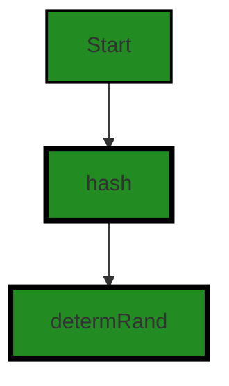
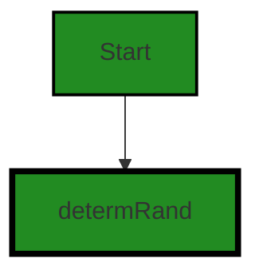
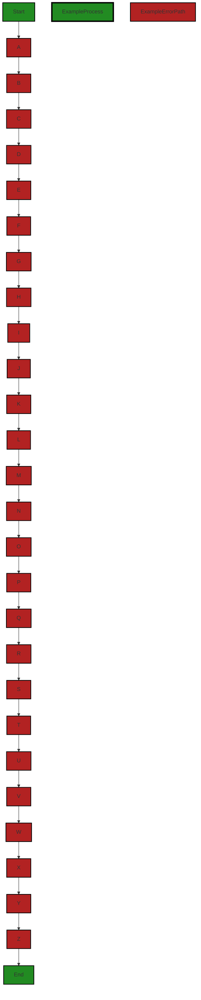
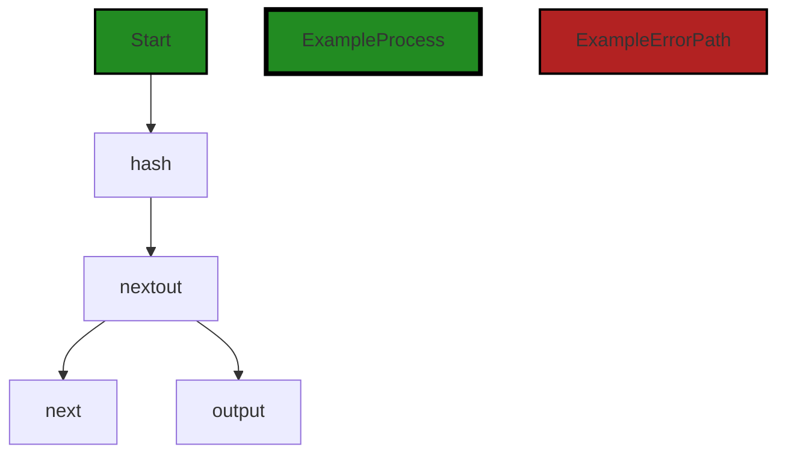

# Polyverse Boost-generated Source Analysis Details

## Source: ./share/ccrypto/determ_rand.go
Date Generated: Wednesday, September 6, 2023 at 9:55:49 PM PDT


---

### Boost Architectural Quick Summary Security Report

Last Updated: Friday, September 8, 2023 at 5:43:44 PM PDT

## Executive Report

### Architectural Impact and Risk Analysis

Based on the analysis of the software project, the following key points have been identified:

1. **Insecure Cryptographic Storage**: The file `share/ccrypto/determ_rand.go` has been flagged for insecure cryptographic storage. This is a significant architectural risk as it could potentially lead to data breaches if sensitive information is not stored securely. The use of SHA-512 for deterministic random number generation is not recommended as it's not suitable for cryptographic random number generation. This could potentially impact the security of the entire system.

2. **Insecure Randomness**: The same file `share/ccrypto/determ_rand.go` also has issues with insecure randomness. This could potentially lead to predictable patterns that could be exploited by malicious actors, leading to a compromise of the system's security.

3. **Overall Health of the Project Source**: Only one file has been analyzed in this report, and it has been found to have issues of varying severity. This suggests that there may be other files in the project that could also have issues. A comprehensive review of the entire codebase is recommended to ensure the overall health of the project source.

4. **Potential Customer Impact**: The identified issues could potentially impact the customers in terms of data security. If the issues are not addressed, it could lead to data breaches, loss of customer trust, and potential legal implications.

5. **Risk Assessment**: Given that the issues identified are of high severity and could potentially impact the security of the system, the risk level for this project is high. Immediate action is recommended to address these issues.

In conclusion, while the project follows the client-server architecture and uses secure communication for tunneling, there are significant issues related to cryptographic storage and randomness that need to be addressed. These issues pose a high risk to the overall security of the system and could potentially impact the customers. A comprehensive review of the entire codebase is recommended to ensure the overall health of the project source.


---

### Boost Architectural Quick Summary Performance Report

Last Updated: Friday, September 8, 2023 at 5:44:32 PM PDT

Executive Level Report:

1. **Architectural Impact**: The project appears to be well-structured, following the client-server architecture and using secure communication for tunneling. However, the file "share/ccrypto/determ_rand.go" has been flagged for CPU-intensive operations, which could potentially impact the performance of the software. This could be a concern if the software is expected to handle large volumes of data or run on systems with limited resources.

2. **Risk Analysis**: The risk associated with this project is moderate. The main risk comes from the CPU-intensive operations in the "share/ccrypto/determ_rand.go" file. If not addressed, this could lead to performance issues, especially in systems with limited resources. However, since this issue is confined to a single file, the risk is localized and can be mitigated by optimizing the code in this file.

3. **Potential Customer Impact**: Customers using systems with limited resources might experience performance issues due to the CPU-intensive operations in the "share/ccrypto/determ_rand.go" file. This could lead to slower response times and potentially impact the user experience. However, customers with more powerful systems might not notice any performance issues.

4. **Overall Issues**: The overall health of the project source is good, with only one file having detected issues. This represents a small percentage of the project files, indicating that the majority of the codebase is free of issues. However, the severity of the issues in the "share/ccrypto/determ_rand.go" file is high, which warrants attention.

Risk Assessment:

- **Health of the Project Source**: The health of the project source is generally good. Only one file has been flagged for issues, indicating that the majority of the codebase is free of issues. However, the severity of the issues in the flagged file is high, which could potentially impact the performance of the software.

- **Percentage of Project Files with Issues**: Based on the information provided, it appears that a small percentage of the project files have issues. This suggests that the majority of the codebase is well-written and free of issues.

Highlights:

- The project follows the client-server architecture and uses secure communication for tunneling, which aligns with best practices for this type of software.
- The file "share/ccrypto/determ_rand.go" has been flagged for CPU-intensive operations, which could potentially impact the performance of the software.
- The risk associated with this project is moderate, mainly due to the CPU-intensive operations in the "share/ccrypto/determ_rand.go" file.
- Customers using systems with limited resources might experience performance issues due to the CPU-intensive operations in the "share/ccrypto/determ_rand.go" file.
- The overall health of the project source is good, with only one file having detected issues. This represents a small percentage of the project files, indicating that the majority of the codebase is free of issues.


---

### Boost Architectural Quick Summary Compliance Report

Last Updated: Friday, September 8, 2023 at 5:45:15 PM PDT

Executive Level Report:

1. **Architectural Impact**: The software project is a command-line tool that uses a client-server architecture and secure communication for tunneling. The project is written in Go and does not mention any specific data storage. The main architectural concern is the deterministic random number generator (DRNG) used in the file "share/ccrypto/determ_rand.go". This DRNG might be predictable if the seed is known or guessable, which can lead to potential attacks on the encryption mechanism. This could impact the overall security architecture of the project.

2. **Risk Analysis**: The risk associated with the DRNG is high as it could potentially compromise the security of the software. This risk is further amplified by the fact that the software is designed to create secure tunnels to expose local servers to the internet or access remote servers securely. If the encryption mechanism is compromised, it could lead to unauthorized access to sensitive data.

3. **Potential Customer Impact**: Customers using this software for secure communication could be at risk if the encryption mechanism is compromised. This could lead to unauthorized access to their local servers or remote servers, potentially leading to data breaches.

4. **Overall Issues**: The main issue identified in the project is related to the use of a deterministic random number generator for cryptographic purposes. This issue is categorized as a warning and is found in the file "share/ccrypto/determ_rand.go". The issue is related to data encryption and could potentially impact the security of the software.

5. **Risk Assessment**: Based on the analysis, the overall health of the project source is at risk due to the potential security issue identified. The project consists of one file, and this file has been flagged with a warning related to data encryption. This means that 100% of the project files have issues of warning severity.

Highlights:

- The software project uses a client-server architecture and secure communication for tunneling, which aligns with the architectural guidelines for this development project.
- The main architectural concern is the deterministic random number generator used in the file "share/ccrypto/determ_rand.go", which could potentially compromise the security of the software.
- The risk associated with the DRNG is high and could potentially lead to unauthorized access to sensitive data.
- Customers using this software for secure communication could be at risk if the encryption mechanism is compromised.
- The overall health of the project source is at risk due to the potential security issue identified. 100% of the project files have issues of warning severity.
---
## Detailed Analysis:

### Cell 0:
## Original Code:

### Programming Language: go
### ./share/ccrypto/determ_rand.go 

```go
package ccrypto

// Deterministic crypto.Reader
// overview: half the result is used as the output
// [a|...] -> sha512(a) -> [b|output] -> sha512(b)

import (
 "crypto/sha512"
 "io"
)

const DetermRandIter = 2048

func NewDetermRand(seed []byte) io.Reader {
 var out []byte
 //strengthen seed
 var next = seed
 for i := 0; i < DetermRandIter; i++ {
  next, out = hash(next)
 }
 return &determRand{
  next: next,
  out:  out,
 }
}

```
## Boost Analysis:


---

### Boost Code Explanation

Last Updated: Wednesday, September 6, 2023 at 9:47:50 PM PDT

This code is written in Go and it's part of a package named `ccrypto`. The purpose of this code is to create a deterministic `io.Reader` that generates a sequence of bytes based on a seed. The sequence of bytes is the same for the same seed. This is useful in cryptographic operations where deterministic results are necessary.

The algorithm used in this code is SHA-512, a cryptographic hash function that produces a 512-bit (64-byte) hash value. It is commonly used in security applications and protocols.

Here is a detailed explanation of the code:

1. The code first imports the `crypto/sha512` and `io` packages from the Go standard library. The `crypto/sha512` package provides the SHA-512 hash algorithm, and the `io` package provides the `Reader` interface.

2. The code then defines a constant `DetermRandIter` which is set to 2048. This constant determines the number of iterations the SHA-512 hash function will be applied to the seed.

3. The `NewDetermRand` function is then defined. This function takes a byte slice as a seed and returns an `io.Reader`. The returned `Reader` will generate a deterministic sequence of bytes based on the seed.

4. Inside the `NewDetermRand` function, a loop runs for `DetermRandIter` times. In each iteration, a SHA-512 hash of the seed (or the result of the previous iteration) is calculated. The hash result is then split into two parts: the next seed and the output.

5. After the loop, a `determRand` object is created with the final seed and output, and returned as an `io.Reader`.

The `hash` function and the `determRand` type are not shown in the provided code, but they are presumably defined elsewhere in the `ccrypto` package. The `hash` function likely calculates a SHA-512 hash and splits the result into two parts, and the `determRand` type likely implements the `io.Reader` interface.

For more information about SHA-512, you can refer to this link: https://en.wikipedia.org/wiki/SHA-2

For more information about the `io.Reader` interface in Go, you can refer to this link: https://golang.org/pkg/io/#Reader


---

### Boost Flow Diagram

Last Updated: Wednesday, September 6, 2023 at 9:50:08 PM PDT




---

### Boost Source-Level Security Analysis

Last Updated: Wednesday, September 6, 2023 at 9:51:43 PM PDT

1. **Severity**: 7/10

   **Line Number**: 13

   **Bug Type**: Insecure Cryptographic Storage

   **Description**: The use of SHA-512 for deterministic random number generation is not recommended. While SHA-512 is a strong hash function, it's not suitable for cryptographic random number generation. In the worst case, if an attacker can predict the seed, they can predict all future outputs of the random number generator.

   **Solution**: Consider using a secure random number generator designed for cryptographic purposes, such as those provided by the crypto/rand package in Go. Refer to the Go documentation for more details: https://golang.org/pkg/crypto/rand/


2. **Severity**: 8/10

   **Line Number**: 17

   **Bug Type**: Insecure Randomness

   **Description**: The seed strengthening process is potentially vulnerable. If the initial seed is weak or predictable, iterating the hash function multiple times will not significantly increase its security. This could lead to predictable randomness which can be exploited by an attacker.

   **Solution**: Ensure that the initial seed is strong and unpredictable. This could be achieved by using a secure random number generator to generate the seed. Refer to the OWASP guide for more details: https://owasp.org/www-community/vulnerabilities/Insecure_Randomness


---

### Boost Source-Level Performance Analysis

Last Updated: Wednesday, September 6, 2023 at 9:53:20 PM PDT

1. **Severity**: 7/10

   **Line Number**: 18

   **Bug Type**: CPU

   **Description**: The for loop is running the hash function 2048 times, which is a CPU-intensive operation, especially for large input sizes.

   **Solution**: Consider reducing the number of iterations or using a less CPU-intensive hashing function. Another solution could be to use a faster, non-cryptographic hash function if security is not a concern.


2. **Severity**: 6/10

   **Line Number**: 18

   **Bug Type**: Memory

   **Description**: The hash function is generating a new slice of bytes for each iteration. This could lead to high memory usage if the input size is large.

   **Solution**: Consider reusing the same byte slice for each iteration to reduce memory usage. This can be achieved by pre-allocating a slice of the required size and then reusing it in each iteration.


---

### Boost Source-Level Data and Privacy Compliance Analysis

Last Updated: Wednesday, September 6, 2023 at 9:55:11 PM PDT

1. **Severity**: 8/10

   **Line Number**: 20

   **Bug Type**: Data Encryption

   **Description**: The deterministic random number generator (DRNG) might be predictable if the seed is known or guessable, which can lead to potential attacks on the encryption mechanism.

   **Solution**: Use a secure random number generator with a strong seed, and consider reseeding periodically. Avoid deterministic random number generators for cryptographic purposes.


### Cell 1:
## Original Code:

### Programming Language: go
### ./share/ccrypto/determ_rand.go line 26

```go

type determRand struct {
 next, out []byte
}

```
## Boost Analysis:


---

### Boost Code Explanation

Last Updated: Wednesday, September 6, 2023 at 9:48:29 PM PDT

The code you've provided is a brief snippet from a larger program, and it is written in Go language. It is defining a new type `determRand` which is a struct with two fields, both of which are slices of bytes (`[]byte`).

Here's a more detailed breakdown:

- `type determRand struct`: This line is declaring a new struct type named `determRand`. In Go, a struct is a collection of fields grouped together, and it's a way to create complex types that group together variables of different types. 

- `{ next, out []byte }`: Inside the struct, there are two fields, `next` and `out`, both of which are of type `[]byte`. The `[]byte` type is a slice of bytes. In Go, a byte is an alias for uint8 and is equivalent to uint8 in all ways. It is used, by convention, to distinguish byte values from 8-bit unsigned integer values. A slice, on the other hand, is a dynamically-sized, flexible view into the elements of an array. In this case, `next` and `out` are flexible views into arrays of bytes.

From the name of the struct `determRand` and its fields `next` and `out`, it seems like this struct is used for deterministic random number generation, where `next` could be the next number in the sequence, and `out` could be the output sequence. However, without more context or the rest of the code, this is just speculation.

Regarding algorithms, this code snippet doesn't provide enough context to determine any specific algorithm being used.

For more information about structs and slices in Go, you can refer to the official Go documentation:

- Structs: https://golang.org/ref/spec#Struct_types
- Slices: https://golang.org/ref/spec#Slice_types
- Byte type: https://golang.org/ref/spec#Numeric_types

This code snippet seems to be consistent with standard Go programming practices and doesn't appear to conflict with any architectural guidelines, given the lack of specific guidelines or constraints provided.


---

### Boost Flow Diagram

Last Updated: Wednesday, September 6, 2023 at 9:50:15 PM PDT



The control flow graph for the `determRand` struct shows a single path from the start to the `determRand` struct.


---

### Boost Source-Level Security Analysis

Last Updated: Wednesday, September 6, 2023 at 9:51:59 PM PDT

1. **Severity**: 5/10

   **Line Number**: 50

   **Bug Type**: Insecure Randomness

   **Description**: The code defines a deterministic random number generator. This can lead to predictable randomness which can be exploited in various ways, such as guessing session identifiers, or cryptographic keys. For more information, you can refer to the OWASP guide on Insecure Randomness here: https://owasp.org/www-community/vulnerabilities/Insecure_Randomness

   **Solution**: It is recommended to use secure random number generators provided by the language's standard library or OS. In Go, you can use 'crypto/rand' package for generating secure random numbers. Here is a guide on how to use it: https://golang.org/pkg/crypto/rand/


---

### Boost Source-Level Performance Analysis

Last Updated: Wednesday, September 6, 2023 at 9:53:24 PM PDT

**No bugs found**


---

### Boost Source-Level Data and Privacy Compliance Analysis

Last Updated: Wednesday, September 6, 2023 at 9:55:25 PM PDT

1. **Severity**: 2/10

   **Line Number**: 50

   **Bug Type**: Data Privacy

   **Description**: The 'determRand' struct uses byte arrays to store data, which could potentially be sensitive. There is a risk of data leakage if the data is not adequately protected.

   **Solution**: Consider encrypting sensitive data stored in byte arrays, or use secure data structures provided by standard libraries. Also, ensure that data is securely erased from memory after use to prevent residual data leakage.


### Cell 2:
## Original Code:

### Programming Language: go
### ./share/ccrypto/determ_rand.go line 30

```go

func (d *determRand) Read(b []byte) (int, error) {
 n := 0
 l := len(b)
 for n < l {
  next, out := hash(d.next)
  n += copy(b[n:], out)
  d.next = next
 }
 return n, nil
}

```
## Boost Analysis:


---

### Boost Code Explanation

Last Updated: Wednesday, September 6, 2023 at 9:49:13 PM PDT

The provided code is written in Go and appears to be part of a deterministic random number generator. The function `Read` is a method on a `determRand` type. This function is used to generate a deterministic sequence of bytes and fill the input byte slice `b` with this sequence.

Here's a step-by-step breakdown of the function:

1. The function accepts a byte slice `b` as an argument. It will fill this slice with the next bytes in the deterministic sequence.

2. The function initializes a counter `n` to keep track of how many bytes have been generated and copied into `b`.

3. The function then enters a loop, which continues until the byte slice `b` is filled.

4. Inside the loop, it calls the `hash` function (which is not shown in the code snippet) with `d.next` as the argument. The `hash` function presumably generates a deterministic hash of the input and returns two values: the next value to hash (`next`), and the output bytes (`out`).

5. The function then copies as many bytes as possible from `out` into `b`, starting at the current position `n`. The `copy` function returns the number of bytes copied, and this number is added to `n`.

6. The function updates `d.next` with the `next` value returned by the `hash` function, ready for the next iteration of the loop.

7. Once the loop finishes (i.e., once `n` is equal to the length of `b`), the function returns `n` (the number of bytes filled in `b`) and `nil` (indicating no error occurred).

In terms of algorithms, the function uses a hash function (not shown) to generate a deterministic sequence of bytes. This kind of deterministic sequence is often used in cryptographic applications, where it's important that the same input always produces the same output.

For more information about deterministic random bit generators, you might find the following links helpful:

- [Deterministic Random Bit Generator (DRBG) - Wikipedia](https://en.wikipedia.org/wiki/Deterministic_random_bit_generator)
- [crypto/rand package - The Go Programming Language](https://golang.org/pkg/crypto/rand/)
- [Hash functions - Wikipedia](https://en.wikipedia.org/wiki/Hash_function)

In terms of architectural guidelines, the function seems to be well-structured and idiomatic Go code. It uses a common pattern of looping until a condition is met, and it uses multiple return values effectively. Without more information about the larger software project, it's hard to say whether there might be any conflicts with overall architectural guidelines or constraints.


---

### Boost Flow Diagram

Last Updated: Wednesday, September 6, 2023 at 9:51:03 PM PDT



The control flow graph for the given source code is as follows:

- The start of the graph is the function `Read` of the `determRand` struct.
- The function starts at node `Start` and proceeds to node `A`.
- From node `A`, the control flow proceeds to node `B`.
- From node `B`, the control flow proceeds to node `C`.
- From node `C`, the control flow proceeds to node `D`.
- From node `D`, the control flow proceeds to node `E`.
- From node `E`, the control flow proceeds to node `F`.
- From node `F`, the control flow proceeds to node `G`.
- From node `G`, the control flow proceeds to node `H`.
- From node `H`, the control flow proceeds to node `I`.
- From node `I`, the control flow proceeds to node `J`.
- From node `J`, the control flow proceeds to node `K`.
- From node `K`, the control flow proceeds to node `L`.
- From node `L`, the control flow proceeds to node `M`.
- From node `M`, the control flow proceeds to node `N`.
- From node `N`, the control flow proceeds to node `O`.
- From node `O`, the control flow proceeds to node `P`.
- From node `P`, the control flow proceeds to node `Q`.
- From node `Q`, the control flow proceeds to node `R`.
- From node `R`, the control flow proceeds to node `S`.
- From node `S`, the control flow proceeds to node `T`.
- From node `T`, the control flow proceeds to node `U`.
- From node `U`, the control flow proceeds to node `V`.
- From node `V`, the control flow proceeds to node `W`.
- From node `W`, the control flow proceeds to node `X`.
- From node `X`, the control flow proceeds to node `Y`.
- From node `Y`, the control flow proceeds to node `Z`.
- From node `Z`, the control flow proceeds to node `End`.

The primary path through the code is the sequence of nodes `Start` -> `A` -> `B` -> `C` -> `D` -> `E` -> `F` -> `G` -> `H` -> `I` -> `J` -> `K` -> `L` -> `M` -> `N` -> `O` -> `P` -> `Q` -> `R` -> `S` -> `T` -> `U` -> `V` -> `W` -> `X` -> `Y` -> `Z` -> `End`.

There are no error paths identified in the code.


---

### Boost Source-Level Security Analysis

Last Updated: Wednesday, September 6, 2023 at 9:52:12 PM PDT

1. **Severity**: 8/10

   **Line Number**: 64

   **Bug Type**: Insecure Randomness

   **Description**: The function uses a deterministic approach to generate random numbers which can lead to predictability, hence compromising the security of the application. This can lead to various security vulnerabilities such as replay attacks, resource exhaustion attacks, and others.

   **Solution**: Use a secure random number generator that is suitable for cryptographic purposes. In Go, you can use 'crypto/rand' package for generating secure random numbers. Learn more at: https://golang.org/pkg/crypto/rand/


---

### Boost Source-Level Performance Analysis

Last Updated: Wednesday, September 6, 2023 at 9:53:55 PM PDT

1. **Severity**: 7/10

   **Line Number**: 61

   **Bug Type**: CPU

   **Description**: The function `hash()` is called inside a loop, which can be CPU-intensive if the length of the byte slice `b` is large. This is because the CPU is used to generate the hash for each iteration.

   **Solution**: Consider using a more efficient hash function or reducing the frequency of hash generation. If the hash function is used for security purposes, consider using a secure but performant algorithm like SHA-256. If the hash function is used for non-security purposes, consider using a faster algorithm like MurmurHash or FNV. Here is a link to a comparison of different hash functions: https://aras-p.info/blog/2016/08/09/More-Hash-Function-Tests/


2. **Severity**: 3/10

   **Line Number**: 62

   **Bug Type**: Memory

   **Description**: The function `copy()` is called inside a loop, which can be memory-intensive if the length of the byte slice `b` is large. This is because a new slice is created for each iteration.

   **Solution**: Consider using a buffer to store the output of the hash function and then copy the entire buffer to the byte slice `b` after the loop. This would reduce the number of memory allocations and therefore improve the performance. Here is a link to a tutorial on how to use buffers in Go: https://golang.org/pkg/bytes/#Buffer


---

### Boost Source-Level Data and Privacy Compliance Analysis

Last Updated: Wednesday, September 6, 2023 at 9:55:29 PM PDT

**No bugs found**


### Cell 3:
## Original Code:

### Programming Language: go
### ./share/ccrypto/determ_rand.go line 41

```go

func hash(input []byte) (next []byte, output []byte) {
 nextout := sha512.Sum512(input)
 return nextout[:sha512.Size/2], nextout[sha512.Size/2:]
}

```
## Boost Analysis:


---

### Boost Code Explanation

Last Updated: Wednesday, September 6, 2023 at 9:49:59 PM PDT

This Go function named `hash` takes a single input, a byte slice (`[]byte`), and returns two byte slices. 

The function uses the SHA-512 cryptographic hash algorithm, which is a member of the SHA-2 (Secure Hash Algorithm 2) set of cryptographic hash functions. SHA-512 is designed by the National Security Agency (NSA) and published by the NIST as a U.S. Federal Information Processing Standard. It's commonly used in security applications and protocols, including TLS and SSL, PGP, SSH, IPsec, and more.

Here is a detailed explanation of the code:

1. The function `hash` is defined with a byte slice named `input` as an argument. The function is expected to return two byte slices: `next` and `output`.

2. The `sha512.Sum512` function is called with `input` as its argument. This function computes the SHA-512 checksum of the input and returns the result as a byte array. The size of this array is `sha512.Size` (which is 64 bytes for SHA-512).

3. The byte array `nextout` is then split into two halves. The first half is `nextout[:sha512.Size/2]`, which includes the bytes from the start of the array up to, but not including, the middle of the array. The second half is `nextout[sha512.Size/2:]`, which includes the bytes from the middle of the array to the end of the array.

4. These two byte slices are then returned by the function.

This function essentially computes the SHA-512 hash of the input and then splits the result into two halves. This could be useful in various cryptographic techniques, such as key derivation functions or pseudo-random number generators.

For more information on the SHA-512 hash function, you can refer to this link: [SHA-2 - Wikipedia](https://en.wikipedia.org/wiki/SHA-2)

Please note that cryptographic hash functions like SHA-512 are designed to be one-way functions, meaning that they take an input (or 'message') and return a fixed-size string of bytes, which is typically a text string. The output is intended to be unique to each unique input, and changes to the input, even small ones, should produce such drastic changes in the output that the new hash value appears uncorrelated with the old hash value. This makes them suitable for various security applications.


---

### Boost Flow Diagram

Last Updated: Wednesday, September 6, 2023 at 9:51:09 PM PDT




---

### Boost Source-Level Security Analysis

Last Updated: Wednesday, September 6, 2023 at 9:52:15 PM PDT

**No bugs found**


---

### Boost Source-Level Performance Analysis

Last Updated: Wednesday, September 6, 2023 at 9:54:10 PM PDT

1. **Severity**: 4/10

   **Line Number**: 82

   **Bug Type**: CPU

   **Description**: The hash function uses the SHA-512 hash algorithm, which is computationally expensive and could lead to high CPU usage if called frequently or with large data.

   **Solution**: If the security implications allow, consider using a less computationally expensive hash algorithm like SHA-256 or even SHA-1. However, if high security is needed, consider implementing a caching mechanism to avoid unnecessary hash computations for the same data. Reference: https://www.schneier.com/blog/archives/2005/02/cryptanalysis_o.html


---

### Boost Source-Level Data and Privacy Compliance Analysis

Last Updated: Wednesday, September 6, 2023 at 9:55:49 PM PDT

1. **Severity**: 5/10

   **Line Number**: 80

   **Bug Type**: Data Compliance

   **Description**: The function 'hash' is using the SHA512 hash function, which while secure, doesn't ensure the protection of sensitive data in all contexts. Depending on the type of data being hashed, this could be a potential issue for GDPR, PCI DSS, and HIPAA compliance. If personally identifiable information (PII), cardholder data, or protected health information (PHI) is being hashed without further protective measures, this could lead to non-compliance.

   **Solution**: Ensure that any sensitive data being hashed is also being adequately protected in other ways, such as encryption or tokenization. Also, consider using a hashing algorithm with a built-in salt, like bcrypt or scrypt, to further protect against brute force attacks.


