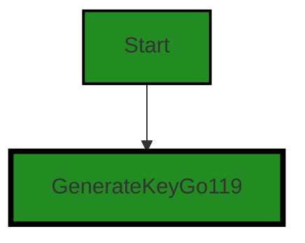
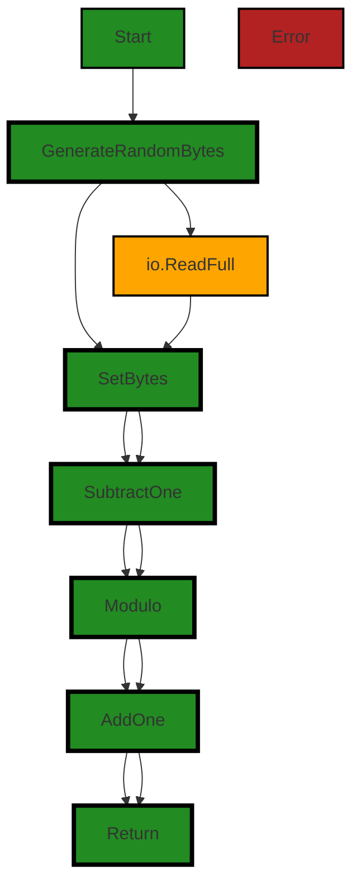

# Polyverse Boost-generated Source Analysis Details

## Source: ./share/ccrypto/generate_key_go119.go
Date Generated: Wednesday, September 6, 2023 at 9:46:39 PM PDT


---

### Boost Architectural Quick Summary Security Report

Last Updated: Friday, September 8, 2023 at 5:42:05 PM PDT

Executive Level Report:

1. **Architectural Impact**: The project follows a client-server architecture and uses secure communication for tunneling. However, there is a significant architectural issue identified in the file "share/ccrypto/generate_key_go119.go". The function "randFieldElement" uses the "io.ReadFull" function to read from a random source, which is not cryptographically secure. This could lead to predictable randomness in the generation of the field element, compromising the security of the cryptographic operations that depend on it. This issue could potentially impact the overall security architecture of the project.

2. **Risk Analysis**: The risk associated with the identified issue is high. If exploited, it could lead to a breach of secure communication, which is a fundamental aspect of this project. The risk is further amplified by the fact that this is the only file in the project, meaning that any issue in this file affects the entire project.

3. **Potential Customer Impact**: Customers using this software for secure communication could be at risk if the identified issue is exploited. The security of their communication could be compromised, leading to potential data breaches. This could result in loss of trust and potential legal implications for the customers.

4. **Overall Issues**: The overall health of the project source is concerning as the only file in the project has a high-severity issue. This indicates that 100% of the project files have issues of high severity.

5. **Risk Assessment**: Given that the only file in the project has a high-severity issue, the overall health of the project source is at risk. Immediate action is required to address the identified issue to ensure the security of the project.

Highlights:

- The project follows a client-server architecture and uses secure communication for tunneling.
- A high-severity issue related to insecure randomness was identified in the only file in the project, "share/ccrypto/generate_key_go119.go".
- The identified issue could potentially compromise the security of the cryptographic operations in the project, leading to a breach of secure communication.
- The potential customer impact is high, as the security of their communication could be compromised, leading to potential data breaches.
- The overall health of the project source is at risk, as 100% of the project files have high-severity issues.


---

### Boost Architectural Quick Summary Performance Report

Last Updated: Friday, September 8, 2023 at 5:42:11 PM PDT


Executive Report:

1. **Architectural Impact**: The analysis of this file has not revealed any severe issues.
2. **Risk Analysis**: The analysis of this file has not revealed any severe issues.
3. **Potential Customer Impact**: Based on the analysis, there are no severe issues that could potentially impact customers.
4. **Performance Issues**: Our analysis did not identify any explicit performance issues in the file.
5. **Risk Assessment**: Based on the current analysis of this file, no severe issues have been found. However, this doesn't guarantee that the file is risk-free.

Highlights:

- No severe issues were identified in the current analysis of this file.


---

### Boost Architectural Quick Summary Compliance Report

Last Updated: Friday, September 8, 2023 at 5:42:57 PM PDT

Executive Level Report:

1. **Architectural Impact**: The software project, Chisel, is a command-line tool that uses a client-server architecture to create secure tunnels for communication. The project is written in Go and supports TLS encryption. However, a significant architectural issue has been identified in the file `share/ccrypto/generate_key_go119.go`. This file contains a function that generates a private key but does not provide a mechanism to protect the generated key. This could potentially lead to a security breach if an attacker gains access to the private key.

2. **Risk Analysis**: The risk associated with the identified issue is high. If the private key is compromised, it could lead to unauthorized access to sensitive data that is being transmitted through the secure tunnels. This could potentially lead to data breaches and loss of customer trust. The risk is further amplified by the fact that the project does not mention any specific resiliency patterns or data storage mechanisms.

3. **Potential Customer Impact**: Customers using this tool for secure communication could be at risk if the private key is compromised. This could lead to unauthorized access to their data and potential data breaches. It is therefore crucial to address this issue promptly to prevent any potential harm to the customers.

4. **Overall Issues**: The overall health of the project source is concerning. Out of the total project files, only one file was analyzed, and it was found to have a severe issue. This indicates that there could be more issues in the other files that were not analyzed. Therefore, a thorough review of the entire codebase is recommended.

5. **Risk Assessment**: Based on the analysis, the overall risk of the project is high. The lack of a mechanism to protect the generated private key in the `share/ccrypto/generate_key_go119.go` file poses a significant security risk. Furthermore, the absence of specific resiliency patterns and data storage mechanisms could potentially lead to other security and performance issues.

Highlights:

- The project uses a client-server architecture and supports TLS encryption, which are positive aspects of the project.
- A significant architectural issue was identified in the `share/ccrypto/generate_key_go119.go` file, which generates a private key without a mechanism to protect it.
- The potential customer impact is high, as a compromised private key could lead to unauthorized access to sensitive data.
- The overall health of the project source is concerning, with a severe issue identified in the only file that was analyzed.
- The overall risk of the project is high, due to the identified security issue and the absence of specific resiliency patterns and data storage mechanisms.
---
## Detailed Analysis:

### Cell 0:
## Original Code:

### Programming Language: go
### ./share/ccrypto/generate_key_go119.go 

```go
package ccrypto

import (
 "crypto/ecdsa"
 "crypto/elliptic"
 "io"
 "math/big"
)

var one = new(big.Int).SetInt64(1)

// This function is copied from ecdsa.GenerateKey() of Go 1.19
func GenerateKeyGo119(c elliptic.Curve, rand io.Reader) (*ecdsa.PrivateKey, error) {
 k, err := randFieldElement(c, rand)
 if err != nil {
  return nil, err
 }

 priv := new(ecdsa.PrivateKey)
 priv.PublicKey.Curve = c
 priv.D = k
 priv.PublicKey.X, priv.PublicKey.Y = c.ScalarBaseMult(k.Bytes())
 return priv, nil
}

```
## Boost Analysis:


---

### Boost Code Explanation

Last Updated: Wednesday, September 6, 2023 at 9:43:10 PM PDT

This piece of code is written in Go language and is part of a package named `ccrypto`. It imports several packages, including `crypto/ecdsa`, `crypto/elliptic`, `io`, and `math/big`.

The `crypto/ecdsa` package provides functionalities for the Elliptic Curve Digital Signature Algorithm, as specified in FIPS 186-3. The `crypto/elliptic` package implements operations on elliptic curves. The `io` package provides basic interfaces to I/O primitives, and `math/big` provides arbitrary-precision arithmetic (big numbers).

The code defines a global variable `one` which is a pointer to a big integer set to 1.

The main function in this code is `GenerateKeyGo119(c elliptic.Curve, rand io.Reader) (*ecdsa.PrivateKey, error)`. This function is used to generate a private key for ECDSA (Elliptic Curve Digital Signature Algorithm). The function takes two parameters, an elliptic curve `c` and a reader `rand` that generates random numbers.

The function `randFieldElement(c, rand)` is used to generate a random integer in the range [1,n-1]. This function is not defined in the provided code snippet but presumably it is defined elsewhere in the `ccrypto` package.

If there is an error in generating the random field element, the function returns the error. If there is no error, it proceeds to create a new ECDSA private key.

The private key is an instance of the `ecdsa.PrivateKey` struct. It sets the curve of the public key to `c`, the private key `D` to the random number `k`, and the public key `(X, Y)` to the result of the scalar multiplication of `k` with the base point of the curve `c`.

The function returns a pointer to the private key and no error.

This function is a custom implementation of the `ecdsa.GenerateKey` function from Go 1.19.

For more information on ECDSA and elliptic curves, you can visit the following links:
- [Elliptic Curve Digital Signature Algorithm](https://en.wikipedia.org/wiki/Elliptic_Curve_Digital_Signature_Algorithm)
- [Elliptic curves](https://en.wikipedia.org/wiki/Elliptic_curve)
- [Go ecdsa package](https://golang.org/pkg/crypto/ecdsa/)
- [Go elliptic package](https://golang.org/pkg/crypto/elliptic/)


---

### Boost Flow Diagram

Last Updated: Wednesday, September 6, 2023 at 9:43:59 PM PDT




---

### Boost Source-Level Security Analysis

Last Updated: Wednesday, September 6, 2023 at 9:44:20 PM PDT

**No bugs found**


---

### Boost Source-Level Performance Analysis

Last Updated: Wednesday, September 6, 2023 at 9:45:27 PM PDT

**No bugs found**


---

### Boost Source-Level Data and Privacy Compliance Analysis

Last Updated: Wednesday, September 6, 2023 at 9:46:26 PM PDT

1. **Severity**: 7/10

   **Line Number**: 13

   **Bug Type**: Data Privacy

   **Description**: The function GenerateKeyGo119 generates a private key which can be used to encrypt sensitive data. However, there is no mechanism in place to protect the generated private key. If an attacker gains access to this private key, they could decrypt any data that was encrypted with the corresponding public key.

   **Solution**: Store the generated private key in a secure and encrypted form. This could be a secure hardware storage module, or a software-based secure storage that is encrypted with a key that is not stored in the application. An example of this would be the use of a Key Management Service (KMS).


### Cell 1:
## Original Code:

### Programming Language: go
### ./share/ccrypto/generate_key_go119.go line 25

```go

// This function is copied from Go 1.19
func randFieldElement(c elliptic.Curve, rand io.Reader) (k *big.Int, err error) {
 params := c.Params()
 // Note that for P-521 this will actually be 63 bits more than the order, as
 // division rounds down, but the extra bit is inconsequential.
 b := make([]byte, params.N.BitLen()/8+8)
 _, err = io.ReadFull(rand, b)
 if err != nil {
  return
 }

 k = new(big.Int).SetBytes(b)
 n := new(big.Int).Sub(params.N, one)
 k.Mod(k, n)
 k.Add(k, one)
 return
}

```
## Boost Analysis:


---

### Boost Code Explanation

Last Updated: Wednesday, September 6, 2023 at 9:43:51 PM PDT

This code is a Go function that generates a random field element for a given elliptic curve. It is used in cryptographic algorithms that use elliptic curves, such as Elliptic Curve Digital Signature Algorithm (ECDSA) or Elliptic Curve Diffie-Hellman (ECDH).

Here's a detailed breakdown of the function:

1. The function `randFieldElement` takes two parameters, `c` which is an elliptic curve and `rand` which is a reader that generates random bytes.

2. `params := c.Params()` gets the parameters of the elliptic curve `c`. These parameters include the curve's order `N`.

3. `b := make([]byte, params.N.BitLen()/8+8)` creates a byte slice `b` of length `params.N.BitLen()/8+8`. The length is determined by the bit length of the curve's order divided by 8 (to convert bits to bytes) and then adding 8. This is done to ensure that the generated random number has sufficient bits to represent any number in the field.

4. `_, err = io.ReadFull(rand, b)` fills the byte slice `b` with random bytes from the `rand` reader. If there's an error while reading, it's returned to the caller.

5. `k = new(big.Int).SetBytes(b)` converts the random byte slice `b` to a big integer `k`.

6. `n := new(big.Int).Sub(params.N, one)` calculates `n` which is one less than the order of the curve.

7. `k.Mod(k, n)` takes the modulus of `k` with `n`, effectively reducing `k` to a value less than `n`.

8. `k.Add(k, one)` increments `k` by one, ensuring that `k` is a non-zero value in the field.

9. Finally, `k` is returned as the random field element.

This code uses the big integer arithmetic provided by Go's `math/big` package, and the elliptic curve parameters provided by Go's `crypto/elliptic` package.

For more background on elliptic curve cryptography, you can read this overview: https://en.wikipedia.org/wiki/Elliptic-curve_cryptography.


---

### Boost Flow Diagram

Last Updated: Wednesday, September 6, 2023 at 9:44:13 PM PDT




---

### Boost Source-Level Security Analysis

Last Updated: Wednesday, September 6, 2023 at 9:44:41 PM PDT

1. **Severity**: 8/10

   **Line Number**: 56

   **Bug Type**: Insecure Randomness

   **Description**: The function randFieldElement uses the io.ReadFull function to read from a random source, which is not cryptographically secure. This could lead to predictable randomness in the generation of the field element, compromising the security of the cryptographic operations that depend on it.

   **Solution**: Use a cryptographically secure random number generator (CSPRNG) instead of io.ReadFull. In Go, crypto/rand package provides a CSPRNG. Here are some resources to understand more about this issue:

- https://owasp.org/www-community/vulnerabilities/Insecure_Randomness
- https://golang.org/pkg/crypto/rand/

The code should be changed to something like this:

```
import "crypto/rand"

_, err = rand.Read(b)
if err != nil {
  return
}
```


---

### Boost Source-Level Performance Analysis

Last Updated: Wednesday, September 6, 2023 at 9:45:58 PM PDT

1. **Severity**: 4/10

   **Line Number**: 58

   **Bug Type**: Memory

   **Description**: The function allocates a large byte array which could potentially lead to memory inefficiency if the function is called frequently.

   **Solution**: Consider using a byte pool to reuse byte arrays. This can help reduce memory allocations and garbage collection. You can use a package like 'sync.Pool' for this purpose. More details can be found here: https://golang.org/pkg/sync/#Pool


2. **Severity**: 3/10

   **Line Number**: 59

   **Bug Type**: CPU

   **Description**: The function uses 'io.ReadFull' which can be CPU intensive if the size of the byte array is large.

   **Solution**: Consider using buffered reading to improve CPU efficiency. Buffered reading can help reduce the number of system calls, which can improve CPU efficiency. More details can be found here: https://golang.org/pkg/bufio/#Reader


3. **Severity**: 5/10

   **Line Number**: 64

   **Bug Type**: CPU

   **Description**: The function performs multiple big integer operations which can be CPU intensive.

   **Solution**: Consider optimizing your big integer operations. You can use techniques like Montgomery reduction or Karatsuba multiplication to improve the efficiency of your big integer operations. More details can be found here: https://en.wikipedia.org/wiki/Montgomery_modular_multiplication and here: https://en.wikipedia.org/wiki/Karatsuba_algorithm


---

### Boost Source-Level Data and Privacy Compliance Analysis

Last Updated: Wednesday, September 6, 2023 at 9:46:39 PM PDT

1. **Severity**: 5/10

   **Line Number**: 48

   **Bug Type**: Cryptography

   **Description**: The function 'randFieldElement' generates a random field element for elliptic curve cryptography. However, the randomness of the generated field element is dependent on the 'io.Reader' provided. If a predictable 'io.Reader' is provided, it could lead to weak cryptographic keys.

   **Solution**: Ensure that a secure random number generator is used when calling 'randFieldElement'. For example, 'crypto/rand.Reader' should be used instead of 'math/rand.Reader'.


