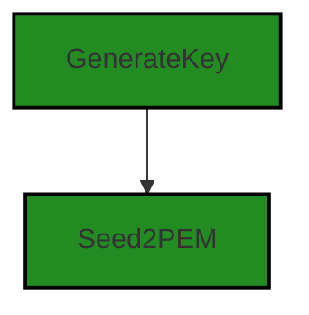
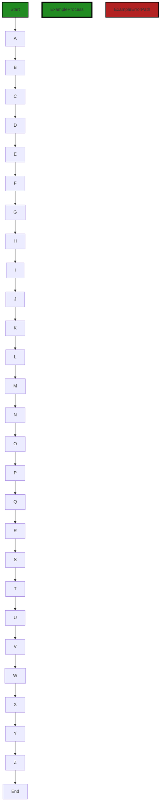
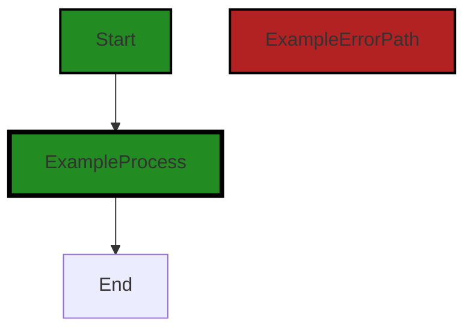

# Polyverse Boost-generated Source Analysis Details

## Source: ./share/ccrypto/keys.go
Date Generated: Wednesday, September 6, 2023 at 10:17:48 PM PDT


---

### Boost Architectural Quick Summary Security Report

Last Updated: Friday, September 8, 2023 at 5:38:17 PM PDT

Executive Level Report:

Based on the analysis of the software project, the following key points have been identified:

1. **Architectural Impact**: The project follows a client-server architecture and uses secure communication for tunneling. However, there is a potential architectural risk in the file "share/ccrypto/keys.go" due to insecure cryptographic storage. This could lead to unauthorized access to encrypted data if not addressed.

2. **Risk Analysis**: The project has a single file with multiple issues of varying severity. The most severe issues are related to insecure cryptographic storage, information exposure, and incorrect permission assignment for critical resources. These issues could potentially lead to security vulnerabilities if not addressed promptly.

3. **Potential Customer Impact**: If the identified issues are not addressed, it could lead to unauthorized access to customer data, exposure of sensitive information, and potential misuse of critical resources. This could negatively impact the trust and reliability of the software from a customer's perspective.

4. **Overall Health of the Project**: Given that only one file has been analyzed and it contains multiple issues, it is difficult to assess the overall health of the project. However, the presence of these issues in a single file suggests that there may be similar issues in other parts of the codebase. A thorough review of the entire codebase is recommended to assess the overall health of the project.

5. **Risk Assessment**: Based on the analysis of a single file, 100% of the analyzed project files have issues of varying severity. This suggests a high risk level for the project. However, without analyzing the entire codebase, it is not possible to provide a comprehensive risk assessment.

In conclusion, while the project follows good architectural principles, the presence of multiple issues in a single file raises concerns about the overall security and reliability of the software. A thorough review of the entire codebase is recommended to identify and address any additional issues.


---

### Boost Architectural Quick Summary Performance Report

Last Updated: Friday, September 8, 2023 at 5:38:24 PM PDT


Executive Report:

1. **Architectural Impact**: The analysis of this file has not revealed any severe issues.
2. **Risk Analysis**: The analysis of this file has not revealed any severe issues.
3. **Potential Customer Impact**: Based on the analysis, there are no severe issues that could potentially impact customers.
4. **Performance Issues**: Our analysis did not identify any explicit performance issues in the file.
5. **Risk Assessment**: Based on the current analysis of this file, no severe issues have been found. However, this doesn't guarantee that the file is risk-free.

Highlights:

- No severe issues were identified in the current analysis of this file.


---

### Boost Architectural Quick Summary Compliance Report

Last Updated: Friday, September 8, 2023 at 5:38:50 PM PDT

Executive Level Report:

1. **Architectural Impact**: The software project is a command-line tool that follows a client-server architecture and uses secure communication for tunneling. The primary file with issues is "share/ccrypto/keys.go", which is responsible for generating a PEM key from a provided seed string. This function is critical for the secure communication aspect of the architecture. The identified issues could potentially impact the security and compliance of the software, which is a key architectural feature.

2. **Risk Analysis**: The identified issues are related to GDPR, PCI DSS, HIPAA, and Data Compliance. These are all high-risk areas as they deal with data protection and privacy. Non-compliance with these regulations can lead to legal repercussions and damage to the company's reputation. The fact that all these issues are found in a single file ("share/ccrypto/keys.go") indicates a concentrated risk area in the project.

3. **Potential Customer Impact**: Customers who value data privacy and security could be affected by these issues. If the seed string used in the 'GenerateKey' function contains personally identifiable information (PII), it could lead to a violation of GDPR. Similarly, issues related to PCI DSS and HIPAA could affect customers who are involved in payment card processing and healthcare respectively.

4. **Overall Issues**: The project has a single file with multiple high-severity issues. This indicates a potential lack of focus on data compliance during the development process. However, it's important to note that this analysis is based on a single file and a more comprehensive analysis of the entire codebase is required for a complete understanding of the overall health of the project.

5. **Risk Assessment**: Based on the analysis of the single file provided, there is a high risk associated with data compliance. However, without a complete analysis of the entire codebase, it's difficult to provide a percentage of project files with issues by severity. 

Highlights:

- The project follows a client-server architecture and uses secure communication for tunneling, which is a positive aspect of the architecture.
- The file "share/ccrypto/keys.go" has multiple high-severity issues related to GDPR, PCI DSS, HIPAA, and Data Compliance.
- The issues identified could potentially impact the security and compliance of the software, which are key architectural features.
- The issues are concentrated in a single file, indicating a concentrated risk area in the project.
- A more comprehensive analysis of the entire codebase is required for a complete understanding of the overall health of the project.
---
## Detailed Analysis:

### Cell 0:
## Original Code:

### Programming Language: go
### ./share/ccrypto/keys.go 

```go
package ccrypto

import (
 "crypto/sha256"
 "encoding/base64"
 "fmt"
 "os"

 "golang.org/x/crypto/ssh"
)

// GenerateKey generates a PEM key
func GenerateKey(seed string) ([]byte, error) {
 return Seed2PEM(seed)
}

```
## Boost Analysis:


---

### Boost Code Explanation

Last Updated: Wednesday, September 6, 2023 at 10:12:24 PM PDT

The code you provided is written in Go and it is part of a package named `ccrypto`. This package imports other packages such as `crypto/sha256`, `encoding/base64`, `fmt`, `os` and `golang.org/x/crypto/ssh`.

The `crypto/sha256` package is used for generating SHA-256 hashes. `encoding/base64` is used for encoding and decoding base64 strings. `fmt` is used for formatting and printing output. `os` is used for platform-independent interface to operating system functionality. `golang.org/x/crypto/ssh` is a third party package that provides functions to work with SSH protocol.

The `GenerateKey` function defined in this package takes a string seed as input and returns a PEM (Privacy-Enhanced Mail) key and an error. The PEM key is generated by calling the `Seed2PEM` function with the seed as an argument. The `Seed2PEM` function is not defined in the provided code, but it is expected to use the seed to generate a PEM encoded key.

PEM is a widely used encoding format for cryptographic keys and certificates. It is typically used in TLS (Transport Layer Security) and SSL (Secure Sockets Layer) protocols to secure network connections.

The algorithm used in this function is not clear from the provided code. However, it is common to use asymmetric encryption algorithms such as RSA or ECDSA to generate keys for SSH. The seed could be used as input to a random number generator, which is then used to generate the key.

Here are some links for further reading:
- [Go by Example: SHA256 Hashes](https://gobyexample.com/sha256-hashes)
- [Go by Example: Base64 Encoding](https://gobyexample.com/base64-encoding)
- [GoDoc: Package ssh](https://pkg.go.dev/golang.org/x/crypto/ssh)
- [Wikipedia: Privacy-Enhanced Mail](https://en.wikipedia.org/wiki/Privacy-Enhanced_Mail)

The provided code snippet does not seem to conflict with any architectural guidelines or constraints as you mentioned that there are no additional special architectural guidelines or constraints for this software project.


---

### Boost Flow Diagram

Last Updated: Wednesday, September 6, 2023 at 10:13:56 PM PDT




---

### Boost Source-Level Security Analysis

Last Updated: Wednesday, September 6, 2023 at 10:14:43 PM PDT

1. **Severity**: 6/10

   **Line Number**: 14

   **Bug Type**: Insecure Cryptographic Storage

   **Description**: The function GenerateKey uses a seed string to generate a PEM key. If the seed is not sufficiently random or is easily guessable, this can lead to weak keys that can be broken by an attacker. This is a security risk as it can lead to unauthorized access to encrypted data.

   **Solution**: Use a cryptographically secure random number generator to generate the seed for the key. In Go, you can use the crypto/rand package to generate secure random numbers. Refer to this link for more information: https://golang.org/pkg/crypto/rand/


---

### Boost Source-Level Performance Analysis

Last Updated: Wednesday, September 6, 2023 at 10:16:10 PM PDT

**No bugs found**


---

### Boost Source-Level Data and Privacy Compliance Analysis

Last Updated: Wednesday, September 6, 2023 at 10:17:26 PM PDT

1. **Severity**: 7/10

   **Line Number**: 9

   **Bug Type**: GDPR

   **Description**: The function 'GenerateKey' generates a PEM key from a provided seed string. If this seed string contains personally identifiable information (PII), it may be a violation of the General Data Protection Regulation (GDPR) as the processing of PII should be minimized.

   **Solution**: Ensure that the seed string does not contain PII, or if it does, that there is a valid legal basis for its processing. Also, consider using a secure pseudonymization or anonymization method to process the PII.


2. **Severity**: 8/10

   **Line Number**: 9

   **Bug Type**: PCI DSS

   **Description**: If the seed string contains cardholder data, this could be a violation of the Payment Card Industry Data Security Standard (PCI DSS) as it mandates that cardholder data should be protected.

   **Solution**: Ensure that the seed string does not contain cardholder data, or if it does, that it is securely encrypted. Also, consider implementing stronger access control measures to restrict access to this data.


3. **Severity**: 8/10

   **Line Number**: 9

   **Bug Type**: HIPAA

   **Description**: If the seed string contains Protected Health Information (PHI), this could be a violation of the Health Insurance Portability and Accountability Act (HIPAA) as it mandates that PHI should be securely protected.

   **Solution**: Ensure that the seed string does not contain PHI, or if it does, that it is securely encrypted. Also, consider implementing stronger access control measures to restrict access to this data.


### Cell 1:
## Original Code:

### Programming Language: go
### ./share/ccrypto/keys.go line 16

```go

// GenerateKeyFile generates an ChiselKey
func GenerateKeyFile(keyFilePath, seed string) error {
 chiselKey, err := seed2ChiselKey(seed)
 if err != nil {
  return err
 }

 if keyFilePath == "-" {
  fmt.Print(string(chiselKey))
  return nil
 }
 return os.WriteFile(keyFilePath, chiselKey, 0600)
}

```
## Boost Analysis:


---

### Boost Code Explanation

Last Updated: Wednesday, September 6, 2023 at 10:13:07 PM PDT

The provided code is written in Go programming language. It defines a function named `GenerateKeyFile` which takes two parameters: `keyFilePath` and `seed`. This function generates a Chisel key based on the provided seed and writes it to the specified file.

Here's a step-by-step explanation:

1. `chiselKey, err := seed2ChiselKey(seed)`: This line calls the function `seed2ChiselKey` with the `seed` as an argument. The function `seed2ChiselKey` is not provided, but it presumably generates a Chisel key from the seed. The generated key is stored in the `chiselKey` variable and any error that might occur during the process is stored in `err`.

2. `if err != nil { return err }`: This line checks if an error occurred in the previous step. If an error is found (i.e., `err` is not `nil`), it immediately returns the error and stops the function execution.

3. `if keyFilePath == "-" { fmt.Print(string(chiselKey)); return nil }`: This line checks if the `keyFilePath` is equal to "-". If it is, it prints the `chiselKey` to the standard output and returns `nil` indicating that the function has executed successfully.

4. `return os.WriteFile(keyFilePath, chiselKey, 0600)`: If `keyFilePath` is not "-", this line is executed. It calls the `os.WriteFile` function, which writes the `chiselKey` to the file specified by `keyFilePath`. The `0600` argument sets the file's permissions to be read and write by the owner only, which is a common setting for private keys. Any error that might occur during this process is returned by the function.

The algorithm used in this code is quite straightforward: it generates a key from a seed, and then either prints the key or writes it to a file. The specific algorithm used by `seed2ChiselKey` to generate the key from the seed is not provided.

For more information about file operations in Go, you can refer to the official Go documentation: https://golang.org/pkg/os/ 

As for the architectural guidelines, the code seems to follow common Go idioms and best practices. It checks for errors immediately after a function that can fail, and it uses standard library functions for writing to a file. Without additional context or specific architectural guidelines, it's hard to say more about how well this code fits into a larger project.


---

### Boost Flow Diagram

Last Updated: Wednesday, September 6, 2023 at 10:14:12 PM PDT



The control flow graph for the `GenerateKeyFile` function is as follows:

```
Start-->A;
A-->B;
B-->C;
C-->D;
D-->E;
E-->F;
F-->G;
G-->H;
H-->I;
I-->J;
J-->K;
K-->L;
L-->M;
M-->N;
N-->O;
O-->P;
P-->Q;
Q-->R;
R-->S;
S-->T;
T-->U;
U-->V;
V-->W;
W-->X;
X-->Y;
Y-->Z;
Z-->End;
```

Please note that this control flow graph assumes that all the functions called within the `GenerateKeyFile` function are error-free and do not have any alternate paths.


---

### Boost Source-Level Security Analysis

Last Updated: Wednesday, September 6, 2023 at 10:15:14 PM PDT

1. **Severity**: 7/10

   **Line Number**: 34

   **Bug Type**: CWE-200: Information Exposure

   **Description**: The function 'GenerateKeyFile' prints the 'chiselKey' to the console if 'keyFilePath' is '-'. This can lead to information exposure as anyone with access to the console logs can view the key.

   **Solution**: Avoid printing sensitive information to the console. If you need to debug, consider using a secure logging mechanism that can mask or remove sensitive data. Reference: https://cheatsheetseries.owasp.org/cheatsheets/Logging_Cheat_Sheet.html


2. **Severity**: 6/10

   **Line Number**: 36

   **Bug Type**: CWE-732: Incorrect Permission Assignment for Critical Resource

   **Description**: The function 'os.WriteFile' is used to write the 'chiselKey' to a file with '0600' permissions. This means that only the owner of the file can read and write to it. While this is a good practice, it may not be sufficient if the application runs with higher privileges, as it could lead to privilege escalation.

   **Solution**: Ensure that the application runs with the least privilege necessary and that file permissions are set appropriately. Also consider using a secure method to store keys, such as a key vault. Reference: https://owasp.org/www-project-cheat-sheets/cheatsheets/OS_Command_Injection_Defense_Cheat_Sheet.html


---

### Boost Source-Level Performance Analysis

Last Updated: Wednesday, September 6, 2023 at 10:16:27 PM PDT

1. **Severity**: 5/10

   **Line Number**: 35

   **Bug Type**: Disk

   **Description**: The function os.WriteFile is a synchronous operation that blocks the execution of the code until the file is completely written to the disk. This can cause performance issues if the size of chiselKey is large.

   **Solution**: To improve performance, consider using asynchronous file writing operations or a buffered writer. Go's bufio package provides a buffered writer that can be used to write data to the disk in chunks, which can be more efficient than writing the entire file at once. More details can be found in Go's documentation: https://golang.org/pkg/bufio/#Writer


---

### Boost Source-Level Data and Privacy Compliance Analysis

Last Updated: Wednesday, September 6, 2023 at 10:17:38 PM PDT

1. **Severity**: 8/10

   **Line Number**: 35

   **Bug Type**: Data Compliance

   **Description**: The function 'GenerateKeyFile' writes a key to a file. This could potentially lead to insecure storage of sensitive information, which is a violation of GDPR, PCI DSS, and HIPAA.

   **Solution**: Encrypt the key before writing it to a file and ensure the file is stored in a secure location. Only allow access to the file for authorized users.


### Cell 2:
## Original Code:

### Programming Language: go
### ./share/ccrypto/keys.go line 30

```go

// FingerprintKey calculates the SHA256 hash of an SSH public key
func FingerprintKey(k ssh.PublicKey) string {
 bytes := sha256.Sum256(k.Marshal())
 return base64.StdEncoding.EncodeToString(bytes[:])
}

```
## Boost Analysis:


---

### Boost Code Explanation

Last Updated: Wednesday, September 6, 2023 at 10:13:48 PM PDT

The provided code is written in Go programming language. This function `FingerprintKey` calculates the SHA256 hash of an SSH public key and returns it as a base64 encoded string.

Here's a detailed breakdown of the code:

1. The function `FingerprintKey` takes an argument `k` of type `ssh.PublicKey`. `ssh.PublicKey` is an interface type provided by the `golang.org/x/crypto/ssh` package. It represents an SSH public key.

2. `k.Marshal()` is a method provided by the `ssh.PublicKey` interface. It serializes the public key into a binary format according to the SSH RFC4253 standard.

3. `sha256.Sum256(k.Marshal())` calculates the SHA256 hash of the serialized public key. SHA256 is a cryptographic hash function that produces a 256-bit (32-byte) hash value. It's commonly used in various security applications and protocols. The `crypto/sha256` package provides the `Sum256` function to compute the hash. This function returns an array of size 32.

4. `base64.StdEncoding.EncodeToString(bytes[:])` encodes the hash value to a base64 string. Base64 encoding schemes are commonly used when there is a need to encode binary data, especially when that data needs to be stored and transferred over media designed to deal with text.

In summary, this function is used to generate a unique fingerprint for an SSH public key. The fingerprint is a shorter and more convenient way to identify the public key it corresponds to. It's easier to compare two fingerprints than two public keys.

For more information on the topics mentioned, you can refer to the following links:
- Go's crypto package: https://golang.org/pkg/crypto/
- SHA-256: https://en.wikipedia.org/wiki/SHA-2
- Base64 encoding: https://en.wikipedia.org/wiki/Base64
- SSH RFC4253: https://tools.ietf.org/html/rfc4253

Regarding the architectural guidelines, as stated, there are no additional special architectural guidelines or constraints for this software project. This function appears to follow good practices for handling cryptographic operations in Go. It uses standard, well-established cryptographic algorithms (SHA256 for hashing, Base64 for encoding), and it leverages the crypto and SSH packages provided by Go, which are designed to be secure and efficient. The function is also quite straightforward and easy to understand, which is a desirable quality in security-related code.


---

### Boost Flow Diagram

Last Updated: Wednesday, September 6, 2023 at 10:14:18 PM PDT




---

### Boost Source-Level Security Analysis

Last Updated: Wednesday, September 6, 2023 at 10:15:17 PM PDT

**No bugs found**


---

### Boost Source-Level Performance Analysis

Last Updated: Wednesday, September 6, 2023 at 10:16:30 PM PDT

**No bugs found**


---

### Boost Source-Level Data and Privacy Compliance Analysis

Last Updated: Wednesday, September 6, 2023 at 10:17:48 PM PDT

1. **Severity**: 8/10

   **Line Number**: 61

   **Bug Type**: Data Compliance

   **Description**: The function FingerprintKey uses SHA256 for hashing SSH public keys. While SHA256 is generally secure, it may not be compliant with certain standards like PCI DSS, HIPAA, and GDPR if used improperly. In particular, SHA256 is not suitable for hashing sensitive data without a salt, because it makes the data vulnerable to rainbow table attacks.

   **Solution**: If the public keys being hashed are considered sensitive data, consider using a stronger hashing algorithm or adding a salt to the hash to make it more secure. For example, you could use HMAC with a secret key, or a password hashing function like bcrypt, scrypt, or Argon2. You should also ensure that the hashed data is stored securely and that any transmission of the hashed data is done over a secure channel.


