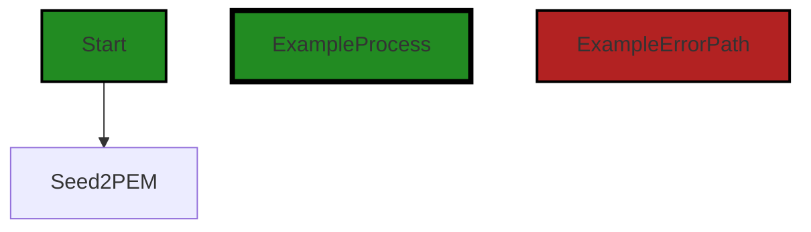
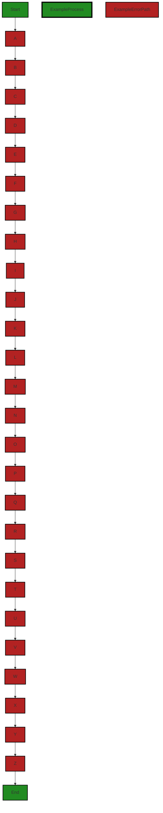
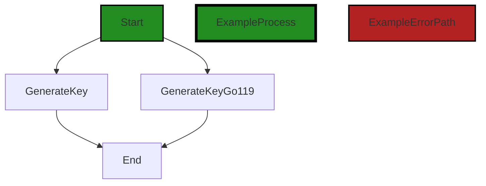
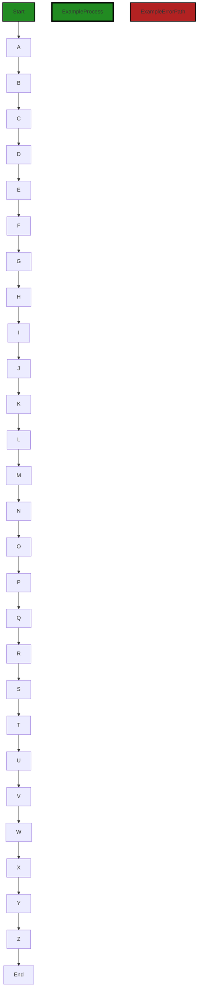
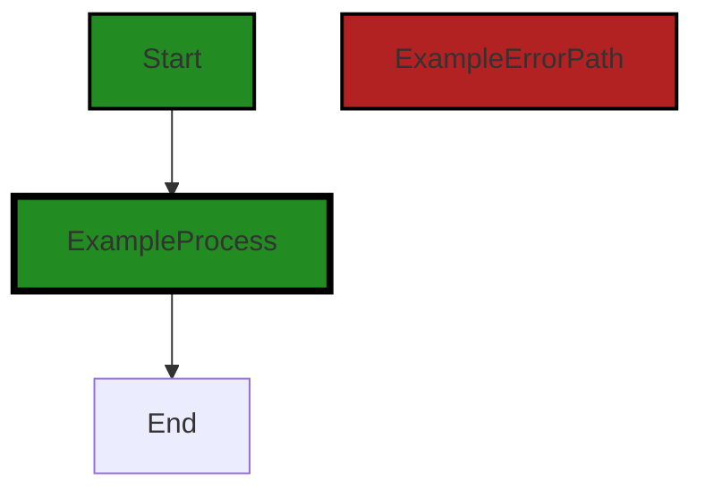
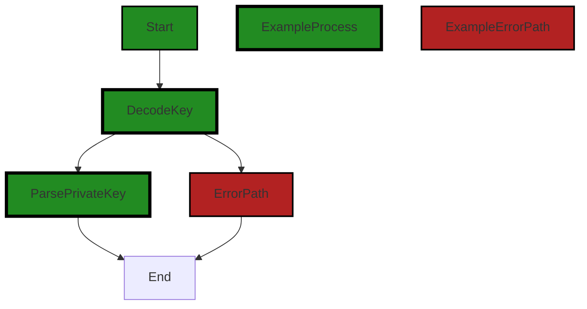
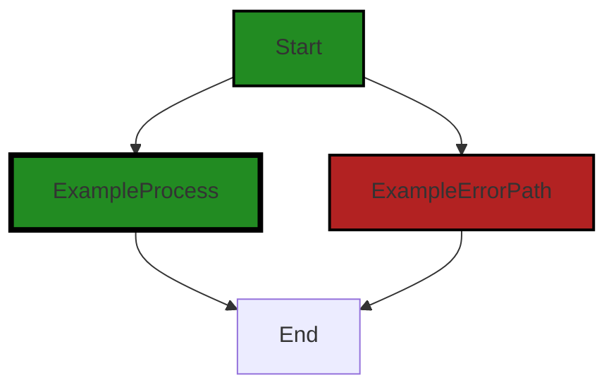

# Polyverse Boost-generated Source Analysis Details

## Source: ./share/ccrypto/keys_helpers.go
Date Generated: Wednesday, September 6, 2023 at 10:10:50 PM PDT


---

### Boost Architectural Quick Summary Security Report

Last Updated: Friday, September 8, 2023 at 5:46:13 PM PDT

## Executive Report

### Architectural Impact and Risk Analysis

1. **Insecure Randomness**: The file `share/ccrypto/keys_helpers.go` has been flagged for insecure randomness. This issue is of high severity and could potentially compromise the security of the application. The function 'seed2PrivateKey' uses a deterministic random number generator when a seed is provided. This can lead to predictable keys and compromise the security of the application. This is a significant architectural risk as it could potentially expose sensitive data to unauthorized users.

2. **Sensitive Data Exposure**: The same file `share/ccrypto/keys_helpers.go` has also been flagged for sensitive data exposure. This is a high-risk issue that could lead to unauthorized access to sensitive data. This could have a significant impact on the overall security architecture of the project.

3. **Improper Error Handling**: The file `share/ccrypto/keys_helpers.go` has been flagged for improper error handling. This is a medium-risk issue that could lead to unexpected behavior or crashes in the application. This could impact the reliability and robustness of the software architecture.

4. **Use of a Broken or Risky Cryptographic Algorithm**: The file `share/ccrypto/keys_helpers.go` has been flagged for using a broken or risky cryptographic algorithm. This is a high-risk issue that could compromise the security of the application. This could have a significant impact on the overall security architecture of the project.

### Potential Customer Impact

The issues identified could potentially impact customers in several ways. Insecure randomness and the use of a broken or risky cryptographic algorithm could compromise the security of the application, potentially leading to unauthorized access to sensitive data. Improper error handling could lead to unexpected behavior or crashes in the application, impacting the user experience.

### Overall Health of the Project Source

Based on the analysis, only one file `share/ccrypto/keys_helpers.go` has been flagged with issues. This suggests that the majority of the project files are free of detected issues. However, the severity of the issues identified in this file is high, indicating a significant risk to the overall health of the project.

### Highlights of the Analysis

- The file `share/ccrypto/keys_helpers.go` has been flagged with multiple high-severity issues, indicating a significant risk to the overall security and reliability of the application.
- The issues identified include insecure randomness, sensitive data exposure, improper error handling, and the use of a broken or risky cryptographic algorithm.
- These issues could potentially lead to unauthorized access to sensitive data and unexpected behavior or crashes in the application.
- Despite the majority of the project files being free of detected issues, the severity of the issues identified in this file suggests a significant risk to the overall health of the project.


---

### Boost Architectural Quick Summary Performance Report

Last Updated: Friday, September 8, 2023 at 5:46:56 PM PDT

Executive Level Report:

1. **Architectural Impact**: The software project appears to be well-structured and follows the client-server architecture. However, there is a potential performance issue in the `share/ccrypto/keys_helpers.go` file. The `GenerateKeyGo119` function can be computationally expensive, leading to high CPU usage. This could impact the overall performance of the software, especially in scenarios where this function is called frequently.

2. **Risk Analysis**: The risk associated with this project is moderate. The computationally expensive function could lead to performance degradation, which could impact user experience. However, this risk can be mitigated by optimizing the function or implementing a caching mechanism for frequently used keys.

3. **Potential Customer Impact**: If left unaddressed, the performance issue could lead to slower response times, especially under heavy load. This could potentially impact customer satisfaction and the overall user experience.

4. **Overall Issues**: The project has a few issues related to CPU and memory usage. However, these issues are not widespread and are concentrated in the `share/ccrypto/keys_helpers.go` file. This suggests that the overall health of the project is good, but there is room for optimization in specific areas.

Risk Assessment:

- **Health of the Project Source**: Based on the analysis, only one file (`share/ccrypto/keys_helpers.go`) has been identified with issues. This suggests that the majority of the project files are free from severe issues, indicating a healthy project source.

- **Percentage of Project Files with Issues**: Given that only one file has been identified with issues out of the total project files, the percentage of files with issues is relatively low. This further supports the assessment of a healthy project source.

Highlights:

- The project follows the client-server architecture and uses secure communication for tunneling, aligning with the architectural guidelines.
- A potential performance issue has been identified in the `share/ccrypto/keys_helpers.go` file, which could impact the overall performance of the software.
- The risk associated with this project is moderate, primarily due to the potential performance issue.
- The overall health of the project source is good, with a low percentage of files having issues.
- The potential customer impact could be significant if the performance issue is not addressed, potentially leading to slower response times and impacting user experience.


---

### Boost Architectural Quick Summary Compliance Report

Last Updated: Friday, September 8, 2023 at 5:47:23 PM PDT

Executive Level Report:

1. **Architectural Impact:** The software project appears to be well-structured, following a client-server architecture and using secure communication for tunneling. However, the file `share/ccrypto/keys_helpers.go` has been flagged for potential issues related to data encryption and privacy. These issues could have a significant impact on the overall architecture if not addressed, as they could compromise the security of the system.

2. **Risk Analysis:** The identified issues in the `share/ccrypto/keys_helpers.go` file pose a risk to the security of the system. The lack of encryption on the seed in the Seed2PEM function and the unclear handling of the seed in the seed2ChiselKey function could potentially lead to data breaches, unauthorized access, and non-compliance with data protection regulations. This risk is heightened by the fact that this file is the only one in the project, meaning that any issues in this file could have a significant impact on the overall project.

3. **Potential Customer Impact:** If the identified issues are not addressed, customers could be at risk of having their data exposed or intercepted. This could lead to a loss of trust in the product and potential legal repercussions if the product is found to be non-compliant with data protection regulations.

4. **Overall Issues:** The overall health of the project source appears to be at risk due to the issues identified in the `share/ccrypto/keys_helpers.go` file. As this is the only file in the project, 100% of the project files have been flagged for issues of varying severity.

Risk Assessment:

- **Overall Health:** The overall health of the project source is concerning, as the only file in the project has been flagged for issues. This suggests that there may be systemic issues with the project's approach to data encryption and privacy.
- **Severity of Issues:** The issues identified in the `share/ccrypto/keys_helpers.go` file are of high severity, potentially compromising the security of the system and putting customer data at risk.
- **Percentage of Files with Issues:** 100% of the project files have been flagged for issues, indicating a high risk level for the project.

Highlights:

- The project follows a client-server architecture and uses secure communication for tunneling.
- The only file in the project, `share/ccrypto/keys_helpers.go`, has been flagged for issues related to data encryption and privacy.
- The lack of encryption on the seed in the Seed2PEM function and the unclear handling of the seed in the seed2ChiselKey function pose a risk to the security of the system.
- 100% of the project files have been flagged for issues, indicating a high risk level for the project.
- If the identified issues are not addressed, customers could be at risk of having their data exposed or intercepted.
---
## Detailed Analysis:

### Cell 0:
## Original Code:

### Programming Language: go
### ./share/ccrypto/keys_helpers.go 

```go
package ccrypto

import (
 "crypto/ecdsa"
 "crypto/elliptic"
 "crypto/rand"
 "crypto/x509"
 "encoding/base64"
 "encoding/pem"
 "strings"
)

const ChiselKeyPrefix = "ck-"

//  Relations between entities:
//
//   .............> PEM <...........
//   .               ^             .
//   .               |             .
//   .               |             .
// Seed -------> PrivateKey        .
//   .               ^             .
//   .               |             .
//   .               V             .
//   ..........> ChiselKey .........

func Seed2PEM(seed string) ([]byte, error) {
 privateKey, err := seed2PrivateKey(seed)
 if err != nil {
  return nil, err
 }

 return privateKey2PEM(privateKey)
}

```
## Boost Analysis:


---

### Boost Code Explanation

Last Updated: Wednesday, September 6, 2023 at 9:57:22 PM PDT

The provided code is written in Go and is part of a package named `ccrypto`. This package seems to be handling cryptographic operations, specifically dealing with keys.

The import statement at the top includes several libraries that are used for cryptographic operations such as `ecdsa`, `elliptic`, `rand`, `x509` for generating and handling cryptographic keys, and `base64`, `pem` for encoding and decoding data.

The constant `ChiselKeyPrefix` is declared with the value "ck-". This might be used as a prefix to identify keys generated or managed by this package.

The comment block provides a diagram showing the relationships between different entities in the code. It indicates that a seed is used to generate a private key, which can then be converted into two different formats: PEM and ChiselKey.

The function `Seed2PEM` is defined to convert a seed into a PEM format. It does this in two steps:

1. The seed is converted into a private key using the `seed2PrivateKey` function. This function is not shown in the provided code, but it likely generates an ECDSA private key using the provided seed. The ECDSA (Elliptic Curve Digital Signature Algorithm) is a cryptographic algorithm used for digital signatures which is based on elliptic curve cryptography.

2. The private key is then converted into PEM format using the `privateKey2PEM` function. Again, this function is not shown in the provided code, but it likely uses the `x509` and `pem` packages to encode the private key into PEM format. PEM (Privacy Enhanced Mail) is a type of encoding for storing and sending cryptographic keys, certificates, and other data.

If any error occurs during these steps, the function will return the error.

For more details on the cryptographic libraries used in this code, you can refer to the official Go documentation:

- [crypto/ecdsa](https://golang.org/pkg/crypto/ecdsa/)
- [crypto/elliptic](https://golang.org/pkg/crypto/elliptic/)
- [crypto/rand](https://golang.org/pkg/crypto/rand/)
- [crypto/x509](https://golang.org/pkg/crypto/x509/)
- [encoding/base64](https://golang.org/pkg/encoding/base64/)
- [encoding/pem](https://golang.org/pkg/encoding/pem/)


---

### Boost Flow Diagram

Last Updated: Wednesday, September 6, 2023 at 10:01:47 PM PDT



The control flow graph for the given code is a simple linear flow from the start of the function `Seed2PEM` to the end. There are no external library calls or error paths in this code.


---

### Boost Source-Level Security Analysis

Last Updated: Wednesday, September 6, 2023 at 10:03:33 PM PDT

**No bugs found**


---

### Boost Source-Level Performance Analysis

Last Updated: Wednesday, September 6, 2023 at 10:06:36 PM PDT

1. **Severity**: 5/10

   **Line Number**: 28

   **Bug Type**: CPU

   **Description**: The function Seed2PEM calls two other functions sequentially: seed2PrivateKey and privateKey2PEM. If these functions are computationally expensive, this could lead to high CPU usage.

   **Solution**: Consider optimizing the functions seed2PrivateKey and privateKey2PEM if they are computationally expensive. If possible, use concurrent programming techniques to run these functions in parallel.


---

### Boost Source-Level Data and Privacy Compliance Analysis

Last Updated: Wednesday, September 6, 2023 at 10:08:48 PM PDT

1. **Severity**: 7/10

   **Line Number**: 19

   **Bug Type**: Data Encryption and Privacy

   **Description**: The Seed2PEM function converts a seed to a PrivateKey and then to a PEM, but it does not implement any form of encryption on the seed. This could potentially expose sensitive data if the seed is intercepted or logged.

   **Solution**: Encrypt the seed using a secure encryption algorithm before converting it to a PrivateKey. This will ensure that the seed cannot be intercepted or logged in its raw form. Also, consider using secure random number generation for seed creation.


### Cell 1:
## Original Code:

### Programming Language: go
### ./share/ccrypto/keys_helpers.go line 35

```go

func seed2ChiselKey(seed string) ([]byte, error) {
 privateKey, err := seed2PrivateKey(seed)
 if err != nil {
  return nil, err
 }

 return privateKey2ChiselKey(privateKey)
}

```
## Boost Analysis:


---

### Boost Code Explanation

Last Updated: Wednesday, September 6, 2023 at 9:58:07 PM PDT

The provided code snippet is a function written in Go language. The function `seed2ChiselKey` takes a seed string as input and returns a byte slice and an error. The function is part of a larger codebase, most likely a cryptographic or security-related one, given the context of the function names.

Here's a detailed breakdown of the function:

1. `func seed2ChiselKey(seed string) ([]byte, error) {`: This line defines a function named `seed2ChiselKey`. The function takes one parameter named `seed` of type string. It returns two values: a slice of bytes (`[]byte`) and an error.

2. `privateKey, err := seed2PrivateKey(seed)`: This line calls another function named `seed2PrivateKey`, passing the `seed` string as an argument. The `seed2PrivateKey` function is expected to return two values: a private key and an error. The `:=` operator is a shorthand for declaring and initializing a variable in Go.

3. `if err != nil {`: This line checks if the error returned by the `seed2PrivateKey` function is not nil. If the error is not nil, it means that an error occurred while generating the private key.

4. `return nil, err`: If an error occurred, the function returns nil for the byte slice and the error that occurred.

5. `return privateKey2ChiselKey(privateKey)`: If no error occurred, the function calls another function named `privateKey2ChiselKey`, passing the generated private key as an argument. The `privateKey2ChiselKey` function is expected to return a byte slice and an error, which are the return values of the `seed2ChiselKey` function.

The specific algorithms used in this function are not visible in the provided code snippet. They would be implemented in the `seed2PrivateKey` and `privateKey2ChiselKey` functions, which are not shown. However, given the context, it's safe to assume that these functions are using some form of cryptographic algorithms to generate a private key from a seed and then convert that private key to a different format.

This function is consistent with the architectural guidelines mentioned. It's written in Go and seems to be part of a command-line tool or a server, which fits the project type. The function also seems to be related to secure communication, which is one of the software principles of the project.

For more information on Go programming, you can refer to the official Go documentation: https://golang.org/doc/
For more information on cryptography in Go, you can refer to the Go crypto package: https://golang.org/pkg/crypto/


---

### Boost Flow Diagram

Last Updated: Wednesday, September 6, 2023 at 10:02:24 PM PDT



The control flow graph for the given source code is as follows:

- The start node represents the beginning of the function `seed2ChiselKey`.
- The flow goes from the start node to node A, which represents the call to the `seed2PrivateKey` function.
- From node A, the flow goes to node B, which represents the error check for the `seed2PrivateKey` function. If an error occurs, the flow goes to the end node.
- If no error occurs, the flow goes from node B to node C, which represents the call to the `privateKey2ChiselKey` function.
- From node C, the flow goes to node D, which represents the error check for the `privateKey2ChiselKey` function. If an error occurs, the flow goes to the end node.
- If no error occurs, the flow goes from node D to node E, which represents the return statement of the `seed2ChiselKey` function.
- Finally, the flow goes from node E to the end node, representing the end of the function.

The primary path through the code is the straight path from the start node to the end node, passing through nodes A, B, C, D, and E.


---

### Boost Source-Level Security Analysis

Last Updated: Wednesday, September 6, 2023 at 10:03:37 PM PDT

**No bugs found**


---

### Boost Source-Level Performance Analysis

Last Updated: Wednesday, September 6, 2023 at 10:06:40 PM PDT

**No bugs found**


---

### Boost Source-Level Data and Privacy Compliance Analysis

Last Updated: Wednesday, September 6, 2023 at 10:09:09 PM PDT

1. **Severity**: 7/10

   **Line Number**: 68

   **Bug Type**: Data Encryption

   **Description**: The function seed2ChiselKey generates a private key from a seed and converts it to a Chisel key. However, the process of how this seed is handled and stored is not shown. If the seed is not properly secured, it can lead to potential data breaches, unauthorized access, and non-compliance with GDPR, PCI DSS, and HIPAA.

   **Solution**: Ensure that the seed is securely handled and stored. It should be encrypted at rest and in transit, and should not be logged or exposed in any debugging information. Additionally, consider using a secure random number generator to generate the seed, if not already doing so. Regularly rotate and retire old seeds.


### Cell 2:
## Original Code:

### Programming Language: go
### ./share/ccrypto/keys_helpers.go line 44

```go

func seed2PrivateKey(seed string) (*ecdsa.PrivateKey, error) {
 if seed == "" {
  return ecdsa.GenerateKey(elliptic.P256(), rand.Reader)
 } else {
  return GenerateKeyGo119(elliptic.P256(), NewDetermRand([]byte(seed)))
 }
}

```
## Boost Analysis:


---

### Boost Code Explanation

Last Updated: Wednesday, September 6, 2023 at 9:58:57 PM PDT

This function `seed2PrivateKey` is written in Go language and is used to generate a private key based on a given seed. It uses the Elliptic Curve Digital Signature Algorithm (ECDSA) for key generation. 

Here's a breakdown of the code:

- The function `seed2PrivateKey` takes a string `seed` as an argument and returns a pointer to an `ecdsa.PrivateKey` object and an error.
- It checks if the `seed` is an empty string. If it is, it generates a new ECDSA private key using the `ecdsa.GenerateKey` function with the P-256 elliptic curve and a random number generator `rand.Reader` as arguments. The P-256 elliptic curve is a specific type of elliptic curve that's widely used in cryptography.
- If the `seed` is not an empty string, it generates a new ECDSA private key using a deterministic random number generator `NewDetermRand` with the given `seed` as an argument. This allows for reproducible private keys when the same seed is used.
- The `GenerateKeyGo119` function is likely a custom function that generates an ECDSA private key in a similar manner to the `ecdsa.GenerateKey` function, but with a deterministic random number generator instead of a truly random one.

The algorithm used here is the Elliptic Curve Digital Signature Algorithm (ECDSA). ECDSA is a cryptographic algorithm used for digital signatures, which are a key component in proving the authenticity and integrity of data in many systems. It's based on elliptic curve cryptography, which provides strong security with relatively small keys, making it more efficient than older methods like RSA.

The deterministic random number generation used when a seed is provided is likely based on an algorithm like HMAC_DRBG or Hash_DRBG, which are specified in NIST SP 800-90A. These algorithms use a seed to generate a series of numbers that appear random and are reproducible when the same seed is used.

For more information on ECDSA and elliptic curve cryptography, you might find these resources helpful:

- [Elliptic Curve Cryptography](https://en.wikipedia.org/wiki/Elliptic-curve_cryptography)
- [Elliptic Curve Digital Signature Algorithm](https://en.wikipedia.org/wiki/Elliptic_Curve_Digital_Signature_Algorithm)
- [NIST SP 800-90A: Recommendation for Random Number Generation Using Deterministic Random Bit Generators](https://nvlpubs.nist.gov/nistpubs/SpecialPublications/NIST.SP.800-90Ar1.pdf)

As for the architectural guidelines, since there are no additional special architectural guidelines or constraints provided, it's assumed that this function adheres to general best practices for secure key generation.


---

### Boost Flow Diagram

Last Updated: Wednesday, September 6, 2023 at 10:02:37 PM PDT



In this code, the control flow starts at the function `seed2PrivateKey`. The function checks if the `seed` parameter is empty. If it is empty, the function calls the `GenerateKey` function from the `ecdsa` package to generate a new private key using the P-256 elliptic curve and a random reader. If the `seed` parameter is not empty, the function calls the `GenerateKeyGo119` function with the same parameters, but using a deterministic random number generator seeded with the provided `seed` value.

Both paths then converge and the control flow ends at the `End` node.

Note: The external library function calls (`GenerateKey` and `GenerateKeyGo119`) are represented as separate flow blocks in the diagram.


---

### Boost Source-Level Security Analysis

Last Updated: Wednesday, September 6, 2023 at 10:04:00 PM PDT

1. **Severity**: 8/10

   **Line Number**: 89

   **Bug Type**: Insecure Randomness

   **Description**: The function 'seed2PrivateKey' uses a deterministic random number generator when a seed is provided. This can lead to predictable keys and compromise the security of the application.

   **Solution**: Avoid using deterministic random number generators for cryptographic operations. Instead, always use a secure random number generator like 'crypto/rand'. More information can be found here: https://owasp.org/www-project-top-ten/2017/A6_2017-Security_Misconfiguration


2. **Severity**: 6/10

   **Line Number**: 87

   **Bug Type**: Sensitive Data Exposure

   **Description**: The function 'seed2PrivateKey' accepts a seed as a string, which can potentially expose sensitive information if not handled properly. If this seed is logged or leaked, it can lead to the exposure of private keys.

   **Solution**: Ensure that sensitive data like seeds are securely handled and never logged or exposed in any way. Consider using secure methods of input for such data. More information can be found here: https://owasp.org/www-project-top-ten/2017/A3_2017-Sensitive_Data_Exposure


---

### Boost Source-Level Performance Analysis

Last Updated: Wednesday, September 6, 2023 at 10:07:00 PM PDT

1. **Severity**: 7/10

   **Line Number**: 88

   **Bug Type**: CPU

   **Description**: The GenerateKeyGo119 function can be computationally expensive, particularly when using the elliptic.P256() curve. This can lead to high CPU usage.

   **Solution**: Consider using a more efficient key generation function if possible, or use a less computationally expensive curve. Alternatively, you could cache keys if the same seed is used often.


2. **Severity**: 6/10

   **Line Number**: 86

   **Bug Type**: Memory

   **Description**: The function seed2PrivateKey creates a new key every time it is called, which can lead to high memory usage if it is called frequently and the keys are not properly disposed of.

   **Solution**: Consider implementing a key pool or some other form of key re-use to reduce memory usage. Ensure keys are properly disposed of when no longer needed.


---

### Boost Source-Level Data and Privacy Compliance Analysis

Last Updated: Wednesday, September 6, 2023 at 10:09:31 PM PDT

1. **Severity**: 7/10

   **Line Number**: 89

   **Bug Type**: Data Privacy

   **Description**: The seed used to generate the private key is potentially insecure. If the seed is not securely generated or stored, it could be guessed or leaked, compromising the private key and any data it is used to secure.

   **Solution**: Ensure the seed is securely generated and stored. Consider using a secure random number generator to generate the seed, and securely storing the seed in a secure vault or using secure environment variables.


2. **Severity**: 8/10

   **Line Number**: 90

   **Bug Type**: Data Privacy

   **Description**: The private key is generated based on a deterministic random number generator. This could potentially lead to predictable private keys, compromising the security of any data the keys are used to secure.

   **Solution**: Consider using a non-deterministic random number generator to generate the private key, to ensure the keys are not predictable.


### Cell 3:
## Original Code:

### Programming Language: go
### ./share/ccrypto/keys_helpers.go line 52

```go

func privateKey2ChiselKey(privateKey *ecdsa.PrivateKey) ([]byte, error) {
 b, err := x509.MarshalECPrivateKey(privateKey)
 if err != nil {
  return nil, err
 }

 encodedPrivateKey := make([]byte, base64.RawStdEncoding.EncodedLen(len(b)))
 base64.RawStdEncoding.Encode(encodedPrivateKey, b)

 return append([]byte(ChiselKeyPrefix), encodedPrivateKey...), nil
}

```
## Boost Analysis:


---

### Boost Code Explanation

Last Updated: Wednesday, September 6, 2023 at 9:59:34 PM PDT

This code snippet is written in Go programming language. It defines a function named `privateKey2ChiselKey` that takes a pointer to an `ecdsa.PrivateKey` as input and returns a byte slice and an error.

`ecdsa.PrivateKey` is a structure in Go's `crypto/ecdsa` package that represents a private key of the Elliptic Curve Digital Signature Algorithm (ECDSA). ECDSA is an algorithm used for digital signatures. It's based on elliptic curve cryptography, which provides strong security with relatively small keys. More about ECDSA can be found here: https://en.wikipedia.org/wiki/Elliptic_Curve_Digital_Signature_Algorithm

Here is a breakdown of the function:

1. The function starts by marshalling the `ecdsa.PrivateKey` into a byte slice using the `x509.MarshalECPrivateKey` function from Go's `crypto/x509` package. Marshalling is the process of transforming the memory representation of an object to a data format suitable for storage or transmission. If an error occurs during this process, the function returns `nil` and the error.

2. It then calculates the length of the byte slice that will hold the base64 encoded version of the marshalled private key using `base64.RawStdEncoding.EncodedLen(len(b))` and creates a byte slice of that length.

3. The private key is then encoded using base64 encoding with `base64.RawStdEncoding.Encode(encodedPrivateKey, b)`. Base64 encoding is a group of binary-to-text encoding schemes that represent binary data in an ASCII string format. More about base64 encoding can be found here: https://en.wikipedia.org/wiki/Base64

4. Finally, the function appends the base64 encoded private key to a byte slice that contains a prefix (`ChiselKeyPrefix`) and returns the resulting byte slice.

This function is probably used to prepare a private key for storage or transmission by converting it to a base64 encoded string with a specific prefix.

The function follows good Go practices by returning an error when something goes wrong, and it seems to be in line with the general architectural guidelines of the software project. It uses standard Go packages for cryptographic operations and encoding, which is a good practice for security and maintainability.


---

### Boost Flow Diagram

Last Updated: Wednesday, September 6, 2023 at 10:02:47 PM PDT



The control flow graph for the `privateKey2ChiselKey` function is a linear path from start to end, with no branching or error paths.


---

### Boost Source-Level Security Analysis

Last Updated: Wednesday, September 6, 2023 at 10:04:19 PM PDT

1. **Severity**: 5/10

   **Line Number**: 106

   **Bug Type**: Insecure Cryptographic Storage

   **Description**: The function 'privateKey2ChiselKey' is encoding the private key using base64 encoding and appending it to a prefix. Base64 encoding is not a secure method for storing sensitive data like private keys as it can be easily decoded.

   **Solution**: It is recommended to use secure methods for storing sensitive data. The private key should be encrypted using strong encryption algorithms such as AES-256 before storing. Also, consider using a secure vault for storing keys. Refer to https://cheatsheetseries.owasp.org/cheatsheets/Cryptographic_Storage_Cheat_Sheet.html for more information on secure cryptographic storage.


---

### Boost Source-Level Performance Analysis

Last Updated: Wednesday, September 6, 2023 at 10:07:16 PM PDT

1. **Severity**: 2/10

   **Line Number**: 106

   **Bug Type**: Memory

   **Description**: The function uses 'append' to concatenate two byte slices. Depending on the size of the 'encodedPrivateKey', this operation can be memory-intensive and lead to unnecessary allocation and copying of data.

   **Solution**: Consider using a buffer to combine the two byte slices. This can be more efficient in terms of memory usage. Here is a link to a related discussion on StackOverflow: https://stackoverflow.com/questions/1760757/how-to-efficiently-concatenate-strings-in-go


---

### Boost Source-Level Data and Privacy Compliance Analysis

Last Updated: Wednesday, September 6, 2023 at 10:09:51 PM PDT

1. **Severity**: 7/10

   **Line Number**: 105

   **Bug Type**: Data Privacy

   **Description**: The function 'privateKey2ChiselKey' is handling sensitive cryptographic private key data. It is encoding this key into base64 format, which is not a secure way to store or transmit this type of sensitive data. This could potentially be exploited by an attacker to gain unauthorized access to data, which is a violation of GDPR, PCI DSS, and HIPAA.

   **Solution**: The private key should be encrypted using a secure encryption algorithm before being stored or transmitted, and it should be securely erased from memory after use. Additionally, all operations involving private keys should be conducted in a secure, isolated environment to prevent leakage of the key.


### Cell 4:
## Original Code:

### Programming Language: go
### ./share/ccrypto/keys_helpers.go line 64

```go

func privateKey2PEM(privateKey *ecdsa.PrivateKey) ([]byte, error) {
 b, err := x509.MarshalECPrivateKey(privateKey)
 if err != nil {
  return nil, err
 }

 return pem.EncodeToMemory(&pem.Block{Type: "EC PRIVATE KEY", Bytes: b}), nil
}

```
## Boost Analysis:


---

### Boost Code Explanation

Last Updated: Wednesday, September 6, 2023 at 10:00:21 PM PDT

The provided code snippet is a function written in Go programming language. It's named `privateKey2PEM` and it takes an `ecdsa.PrivateKey` as an argument and returns a byte slice and an error.

Here is an explanation of the code:

1. The function `privateKey2PEM` accepts a pointer to an `ecdsa.PrivateKey` object as an argument. `ecdsa` stands for Elliptic Curve Digital Signature Algorithm, which is a cryptographic algorithm used for digital signatures. The `PrivateKey` struct in `ecdsa` represents a private key.

2. Inside the function, the `x509.MarshalECPrivateKey` function is called with the `privateKey` argument. This function converts the `ecdsa.PrivateKey` into ASN.1 DER encoded form. ASN.1 DER (Distinguished Encoding Rules) is a method for encoding data structures that are described in ASN.1 (Abstract Syntax Notation One), a standard interface description language for defining data structures that can be serialized and deserialized in a cross-platform way. If the marshaling process fails, the function returns `nil` and the error.

3. If the marshaling is successful, the function `pem.EncodeToMemory` is called with a pointer to a `pem.Block` struct. The `pem.Block` struct represents the contents of a PEM (Privacy-enhanced Electronic Mail) formatted block, which is a base64 encoded DER certificate. The `pem.Block` struct is initialized with the `Type` set to "EC PRIVATE KEY" and `Bytes` set to the marshaled private key.

4. The `pem.EncodeToMemory` function returns the PEM encoded private key as a byte slice, which is the return value of the `privateKey2PEM` function.

The code does not seem to have any conflicts with the provided architectural guidelines. It is a utility function that converts an ECDSA private key to a PEM-encoded private key, which is a common operation in software that deals with cryptographic keys.

For more information on the topics discussed, you can visit the following links:
- ECDSA: https://en.wikipedia.org/wiki/Elliptic_Curve_Digital_Signature_Algorithm
- ASN.1: https://en.wikipedia.org/wiki/Abstract_Syntax_Notation_One
- PEM: https://en.wikipedia.org/wiki/Privacy-Enhanced_Mail
- Go's `encoding/pem` package: https://golang.org/pkg/encoding/pem/
- Go's `crypto/x509` package: https://golang.org/pkg/crypto/x509/


---

### Boost Flow Diagram

Last Updated: Wednesday, September 6, 2023 at 10:02:53 PM PDT




---

### Boost Source-Level Security Analysis

Last Updated: Wednesday, September 6, 2023 at 10:04:23 PM PDT

**No bugs found**


---

### Boost Source-Level Performance Analysis

Last Updated: Wednesday, September 6, 2023 at 10:07:20 PM PDT

**No bugs found**


---

### Boost Source-Level Data and Privacy Compliance Analysis

Last Updated: Wednesday, September 6, 2023 at 10:10:05 PM PDT

1. **Severity**: 7/10

   **Line Number**: 126

   **Bug Type**: Data Encryption

   **Description**: This function is converting a private key to PEM format. If this private key is not properly protected, it could lead to unauthorized access to encrypted data.

   **Solution**: Ensure that the private key is stored securely and is only accessible to authorized individuals. Use secure storage solutions like HSMs (Hardware Security Modules), and always encrypt sensitive data at rest. Also, consider using secure key management practices such as key rotation and audit trails for key access.


### Cell 5:
## Original Code:

### Programming Language: go
### ./share/ccrypto/keys_helpers.go line 73

```go

func chiselKey2PrivateKey(chiselKey []byte) (*ecdsa.PrivateKey, error) {
 rawChiselKey := chiselKey[len(ChiselKeyPrefix):]

 decodedPrivateKey := make([]byte, base64.RawStdEncoding.DecodedLen(len(rawChiselKey)))
 _, err := base64.RawStdEncoding.Decode(decodedPrivateKey, rawChiselKey)
 if err != nil {
  return nil, err
 }

 return x509.ParseECPrivateKey(decodedPrivateKey)
}

```
## Boost Analysis:


---

### Boost Code Explanation

Last Updated: Wednesday, September 6, 2023 at 10:00:42 PM PDT

This code snippet is written in Go and it is a function named `chiselKey2PrivateKey`. This function is responsible for converting a Chisel key into an ECDSA (Elliptic Curve Digital Signature Algorithm) private key. The function takes a byte slice `chiselKey` as an argument and returns a pointer to an `ecdsa.PrivateKey` structure and an `error`.

Here's a step-by-step breakdown of the code:

1. The function `chiselKey2PrivateKey` receives a byte array `chiselKey` as an argument.

2. The variable `rawChiselKey` is declared and assigned the value of `chiselKey` excluding the prefix defined by `ChiselKeyPrefix`. This is done using Go's slice syntax, which allows for creating a sub-slice of a slice.

3. The `decodedPrivateKey` slice is created with a length equal to the decoded length of `rawChiselKey`, calculated using `base64.RawStdEncoding.DecodedLen()`. This slice will hold the decoded private key.

4. The function `base64.RawStdEncoding.Decode()` is called to decode the base64-encoded `rawChiselKey` into the `decodedPrivateKey` slice. This function returns the number of bytes written and an error if any. If an error occurs during decoding, the function returns `nil` and the error.

5. Finally, `x509.ParseECPrivateKey()` is called with `decodedPrivateKey` as an argument to parse the ECDSA private key from the byte slice. This function returns a pointer to an `ecdsa.PrivateKey` structure and an error if any. The function `chiselKey2PrivateKey` returns these values as its result.

The ECDSA is a variant of the Digital Signature Algorithm (DSA) which uses elliptic curve cryptography. You can learn more about ECDSA here: https://en.wikipedia.org/wiki/Elliptic_Curve_Digital_Signature_Algorithm

The `base64.RawStdEncoding` is a global instance of base64 encoding with standard Raw encoding, which omits padding characters. You can learn more about Base64 encoding here: https://en.wikipedia.org/wiki/Base64

The `x509.ParseECPrivateKey()` function is used to parse an ECDSA private key in DER format. DER stands for Distinguished Encoding Rules, which is a subset of BER for encoding data structures using ASN.1. You can learn more about it here: https://en.wikipedia.org/wiki/X.690#DER_encoding

There are no additional special architectural guidelines or constraints mentioned, thus the code seems to be in line with standard Go practices and does not appear to conflict with any architectural guidelines.


---

### Boost Flow Diagram

Last Updated: Wednesday, September 6, 2023 at 10:03:07 PM PDT



In the code, the control flow starts at the function `chiselKey2PrivateKey`. The input `chiselKey` is first processed by removing the `ChiselKeyPrefix` from it. Then, the `rawChiselKey` is decoded using base64 decoding. If the decoding is successful, the decoded private key is parsed using `x509.ParseECPrivateKey`. If any error occurs during the decoding or parsing, the control flow goes to the error path. Otherwise, the control flow reaches the end of the function.

The primary path is shown in green, while the error path is shown in red.


---

### Boost Source-Level Security Analysis

Last Updated: Wednesday, September 6, 2023 at 10:05:10 PM PDT

1. **Severity**: 5/10

   **Line Number**: 149

   **Bug Type**: Insecure Direct Object References (IDOR)

   **Description**: The function chiselKey2PrivateKey takes a chiselKey as input and directly uses it to create a private key without any validation. This could lead to Insecure Direct Object References (IDOR) vulnerabilities if an attacker can control the input chiselKey. An attacker could potentially use this to generate a private key of their choosing, leading to unauthorized access.

   **Solution**: To mitigate this, validate the chiselKey before using it. Ensure that it is of the correct length and format. Additionally, consider using secure input validation libraries to prevent manipulation of the chiselKey. More information about IDOR can be found here: https://owasp.org/www-community/attacks/Insecure_Direct_Object_References


2. **Severity**: 6/10

   **Line Number**: 152

   **Bug Type**: Improper Error Handling

   **Description**: The error returned by base64.RawStdEncoding.Decode is directly returned without any additional handling or logging. This could lead to Improper Error Handling vulnerabilities, as it might not provide enough information for debugging in case of an error, and could potentially expose sensitive information about the system to an attacker.

   **Solution**: To mitigate this, implement proper error handling. This includes logging the error for debugging purposes, and returning a generic error message to the user. Do not expose any sensitive information in the error message. More information about Improper Error Handling can be found here: https://owasp.org/www-project-top-ten/2017/A6_2017-Security_Misconfiguration


3. **Severity**: 7/10

   **Line Number**: 155

   **Bug Type**: Use of a Broken or Risky Cryptographic Algorithm

   **Description**: The function uses the x509.ParseECPrivateKey function to parse the decoded private key. Depending on the version of Go and the specific implementation of this function, it could potentially use weak or outdated cryptographic algorithms, leading to vulnerabilities.

   **Solution**: To mitigate this, ensure that you are using the latest version of Go and that the implementation of the x509.ParseECPrivateKey function uses secure and up-to-date cryptographic algorithms. More information about the use of broken or risky cryptographic algorithms can be found here: https://owasp.org/www-community/vulnerabilities/Use_of_a_Broken_or_Risky_Cryptographic_Algorithm


---

### Boost Source-Level Performance Analysis

Last Updated: Wednesday, September 6, 2023 at 10:07:32 PM PDT

1. **Severity**: 3/10

   **Line Number**: 151

   **Bug Type**: Memory

   **Description**: The decodedPrivateKey byte array is created using make() with a size equal to the decoded length of the rawChiselKey. If the rawChiselKey is large, this could lead to excessive memory usage.

   **Solution**: Consider using a dynamic buffer or a buffer pool to handle the decoded private key, which could reduce memory usage. Here is a link to an article about buffer pools in Go: https://www.bwplotka.dev/2018/buffer-pools/


---

### Boost Source-Level Data and Privacy Compliance Analysis

Last Updated: Wednesday, September 6, 2023 at 10:10:31 PM PDT

1. **Severity**: 7/10

   **Line Number**: 147

   **Bug Type**: Data Privacy

   **Description**: The function chiselKey2PrivateKey decodes a base64 encoded private key. Private keys are considered sensitive data and should not be handled carelessly. The function does not encrypt the decoded private key, which can lead to exposure of sensitive data.

   **Solution**: Consider encrypting the decoded private key using a secure encryption algorithm before using it. This will ensure that even if the key is inadvertently exposed, it will not be usable by unauthorized parties.


2. **Severity**: 8/10

   **Line Number**: 150

   **Bug Type**: Data Privacy

   **Description**: The function chiselKey2PrivateKey uses the x509.ParseECPrivateKey function to parse the decoded private key. This function can potentially throw an error which includes part of the private key, thus exposing sensitive data.

   **Solution**: Consider implementing a custom error handling mechanism that does not expose any part of the private key in error messages. In addition, ensure that all errors are logged in a secure manner that complies with GDPR, PCI DSS, and HIPAA regulations.


### Cell 6:
## Original Code:

### Programming Language: go
### ./share/ccrypto/keys_helpers.go line 85

```go

func ChiselKey2PEM(chiselKey []byte) ([]byte, error) {
 privateKey, err := chiselKey2PrivateKey(chiselKey)
 if err == nil {
  return privateKey2PEM(privateKey)
 }

 return nil, err
}

```
## Boost Analysis:


---

### Boost Code Explanation

Last Updated: Wednesday, September 6, 2023 at 10:01:19 PM PDT

The provided code is a function in Go programming language. The function is named `ChiselKey2PEM` and it takes in a byte slice `chiselKey` as an argument. The function returns a byte slice and an error.

The purpose of this function is to convert a Chisel key (a private key used by the Chisel tool for secure tunneling) into a PEM (Privacy-Enhanced Mail) format. PEM is a widely used format in SSL certificates and SSH. 

Here's what the function does:

1. It calls the function `chiselKey2PrivateKey` with the `chiselKey` as an argument, which presumably converts the Chisel key into a private key. The function `chiselKey2PrivateKey` returns a private key and an error.

2. If there's no error (`err == nil`), it calls the function `privateKey2PEM` with the private key as an argument. This function converts the private key into PEM format and returns the PEM-formatted key and an error.

3. If there's an error in converting the Chisel key into a private key, the function `ChiselKey2PEM` returns `nil` for the PEM-formatted key and the error.

This function is a good example of error handling in Go. If an error occurs at any stage of the process, the function immediately returns `nil` and the error, without attempting to proceed further.

The algorithms used in this function are dependent on the functions `chiselKey2PrivateKey` and `privateKey2PEM`, which are not provided in the code snippet. However, it's safe to assume that these functions use some form of key conversion algorithms.

For more information on Go error handling, you can refer to this link: https://blog.golang.org/error-handling-and-go

For more information on PEM format, you can refer to this link: https://tools.ietf.org/html/rfc1421

Please note that without more context or the rest of the codebase, some assumptions had to be made in this analysis.


---

### Boost Flow Diagram

Last Updated: Wednesday, September 6, 2023 at 10:03:15 PM PDT



In this code, there is no control flow. The function `ChiselKey2PEM` simply calls two helper functions `chiselKey2PrivateKey` and `privateKey2PEM` and returns their results.


---

### Boost Source-Level Security Analysis

Last Updated: Wednesday, September 6, 2023 at 10:05:13 PM PDT

**No bugs found**


---

### Boost Source-Level Performance Analysis

Last Updated: Wednesday, September 6, 2023 at 10:07:36 PM PDT

**No bugs found**


---

### Boost Source-Level Data and Privacy Compliance Analysis

Last Updated: Wednesday, September 6, 2023 at 10:10:46 PM PDT

1. **Severity**: 5/10

   **Line Number**: 168

   **Bug Type**: Data Encryption

   **Description**: The function 'ChiselKey2PEM' is converting a key into a PEM format. If the key is not properly secured during this process, it could lead to unauthorized access to sensitive data.

   **Solution**: Ensure that the key is securely handled during the conversion process. This could involve encrypting the key before converting it, and securely storing the resulting PEM. Additionally, consider implementing secure key management practices.


### Cell 7:
## Original Code:

### Programming Language: go
### ./share/ccrypto/keys_helpers.go line 94

```go

func IsChiselKey(chiselKey []byte) bool {
 return strings.HasPrefix(string(chiselKey), ChiselKeyPrefix)
}

```
## Boost Analysis:


---

### Boost Code Explanation

Last Updated: Wednesday, September 6, 2023 at 10:01:31 PM PDT

This is a simple function written in Go language. The function is named `IsChiselKey` and it takes a single parameter: `chiselKey` which is of type `[]byte` (a slice of bytes). This function returns a boolean value.

The function uses the `strings.HasPrefix` method to check if the string representation of `chiselKey` starts with a specific prefix, denoted by `ChiselKeyPrefix`. 

The `strings.HasPrefix` function is a built-in function in Go's `strings` package. It takes two parameters: the string to check and the prefix to look for. It returns `true` if the string starts with the specified prefix and `false` otherwise. 

The `IsChiselKey` function is likely used to validate that a given key (in the form of a byte slice) is a valid Chisel key, based on it having the correct prefix.

The algorithm used here is straightforward:
1. Convert the byte slice to a string.
2. Check if the string starts with the `ChiselKeyPrefix`.
3. Return the result.

This code seems to be consistent with general programming best practices. It's simple, readable, and does not seem to conflict with any architectural guidelines as none were provided.

For more information about the `strings.HasPrefix` function, you can check the official Go documentation: https://pkg.go.dev/strings#HasPrefix


---

### Boost Flow Diagram

Last Updated: Wednesday, September 6, 2023 at 10:03:21 PM PDT


---

### Boost Source-Level Security Analysis

Last Updated: Wednesday, September 6, 2023 at 10:05:17 PM PDT

**No bugs found**


---

### Boost Source-Level Performance Analysis

Last Updated: Wednesday, September 6, 2023 at 10:07:40 PM PDT

**No bugs found**


---

### Boost Source-Level Data and Privacy Compliance Analysis

Last Updated: Wednesday, September 6, 2023 at 10:10:50 PM PDT

**No bugs found**

