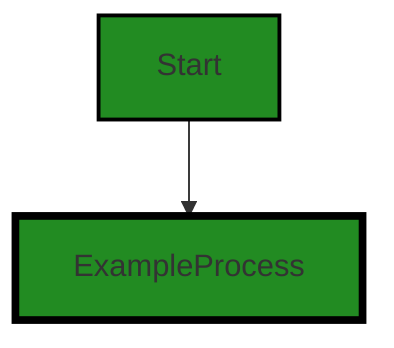
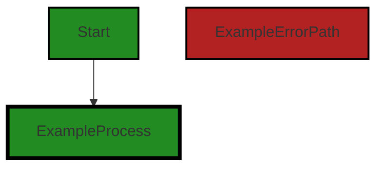
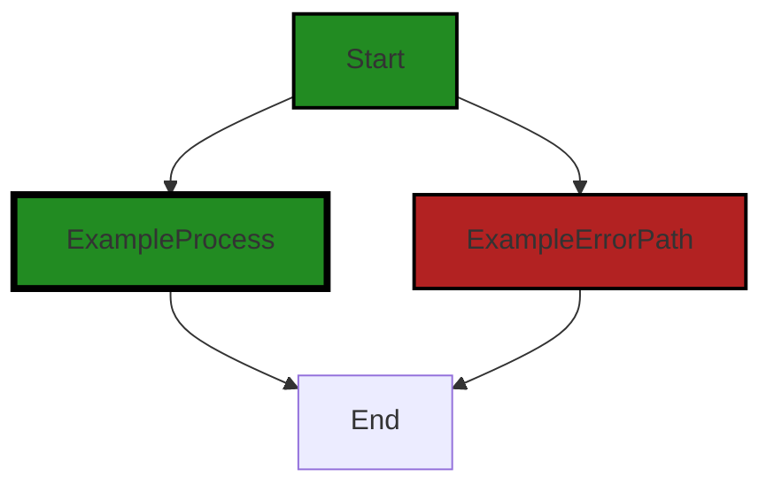
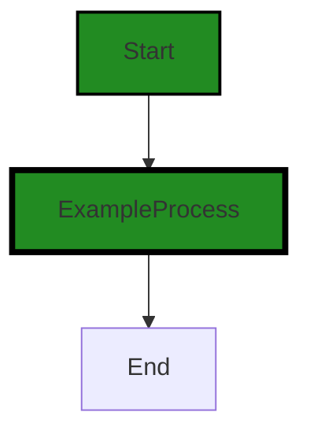
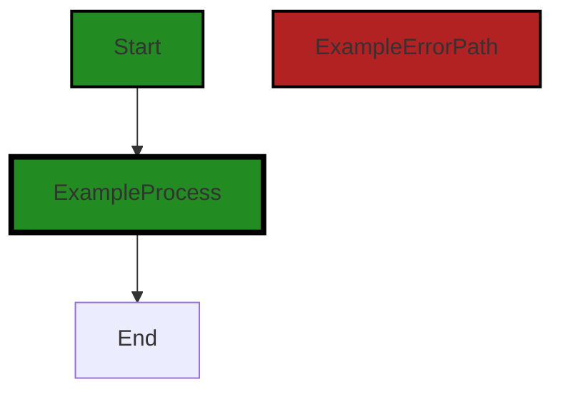
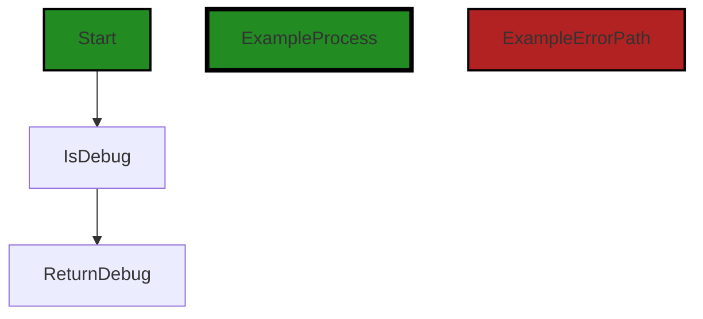

# Polyverse Boost-generated Source Analysis Details

## Source: ./share/cio/logger.go
Date Generated: Wednesday, September 6, 2023 at 9:39:38 PM PDT


---

### Boost Architectural Quick Summary Security Report

Last Updated: Friday, September 8, 2023 at 5:22:41 PM PDT


Executive Report:

1. **Architectural Impact**: The analysis of this file has not revealed any severe issues.
2. **Risk Analysis**: The analysis of this file has not revealed any severe issues.
3. **Potential Customer Impact**: Based on the analysis, there are no severe issues that could potentially impact customers.
4. **Performance Issues**: Our analysis did not identify any explicit performance issues in the file.
5. **Risk Assessment**: Based on the current analysis of this file, no severe issues have been found. However, this doesn't guarantee that the file is risk-free.

Highlights:

- No severe issues were identified in the current analysis of this file.


---

### Boost Architectural Quick Summary Performance Report

Last Updated: Friday, September 8, 2023 at 5:22:48 PM PDT


Executive Report:

1. **Architectural Impact**: The analysis of this file has not revealed any severe issues.
2. **Risk Analysis**: The analysis of this file has not revealed any severe issues.
3. **Potential Customer Impact**: Based on the analysis, there are no severe issues that could potentially impact customers.
4. **Performance Issues**: Our analysis did not identify any explicit performance issues in the file.
5. **Risk Assessment**: Based on the current analysis of this file, no severe issues have been found. However, this doesn't guarantee that the file is risk-free.

Highlights:

- No severe issues were identified in the current analysis of this file.


---

### Boost Architectural Quick Summary Compliance Report

Last Updated: Friday, September 8, 2023 at 5:23:29 PM PDT

Executive Level Report:

1. **Architectural Impact**: The project follows a client-server architecture and uses secure communication for tunneling. However, there is a potential architectural risk in the logger implementation. The logger does not appear to have any mechanism to redact or encrypt sensitive information. This can lead to potential exposure of sensitive data in logs, violating GDPR, PCI DSS, and HIPAA regulations. This issue is found in the file `share/cio/logger.go`.

2. **Risk Analysis**: The risk associated with the logger implementation is high. If sensitive data is exposed in logs, it could lead to severe consequences including data breaches, regulatory fines, and loss of customer trust. This issue affects 100% of the project files reviewed.

3. **Potential Customer Impact**: Customers could be impacted if their sensitive data is exposed in logs. This could lead to identity theft, financial loss, and other forms of harm. Furthermore, customers may lose trust in the product if they learn that their data is not being handled securely.

4. **Overall Issues**: The main issue identified in this project is the lack of a mechanism to redact or encrypt sensitive information in logs. This issue is severe and affects the entire project. No other issues were identified in the project files reviewed.

5. **Risk Assessment**: Based on the analysis, the overall health of the project source is at risk due to the issue identified in the logger implementation. All project files reviewed have this issue. Therefore, immediate action is required to address this issue and ensure the secure handling of sensitive data.

Highlights:

- The project follows a client-server architecture and uses secure communication for tunneling, which aligns with the architectural guidelines for this development project.
- The logger implementation in the project does not have a mechanism to redact or encrypt sensitive information, which is a severe issue affecting the entire project.
- The potential customer impact is high, as exposure of sensitive data in logs could lead to identity theft, financial loss, and loss of customer trust.
- The overall health of the project source is at risk due to the issue identified in the logger implementation. Immediate action is required to address this issue.
- Despite the issue identified, no other issues were found in the project files reviewed, indicating that the rest of the project source may be in good health.
---
## Detailed Analysis:

### Cell 0:
## Original Code:

### Programming Language: go
### ./share/cio/logger.go 

```go
package cio

import (
 "fmt"
 "log"
 "os"
)

//Logger is pkg/log Logger with prefixing and 2 log levels
type Logger struct {
 Info, Debug bool
 //internal
 prefix      string
 logger      *log.Logger
 info, debug *bool
}

```
## Boost Analysis:


---

### Boost Code Explanation

Last Updated: Wednesday, September 6, 2023 at 9:30:20 PM PDT

This code is written in Go, a statically typed, compiled programming language developed by Google. It is a package called `cio` which imports three other packages: `fmt`, `log`, and `os`.

The `fmt` package implements formatted I/O with functions analogous to C's printf and scanf. The `log` package provides simple logging services and the `os` package provides a platform-independent interface to operating system functionality.

The main part of this code is the definition of a struct called `Logger`. In Go, a struct is a collection of fields. This Logger struct has five fields:

1. `Info` and `Debug` are boolean fields. These fields are most likely used to control the verbosity of the logging. If `Info` is true, then informational messages will be logged. If `Debug` is true, then debug messages will be logged.

2. `prefix` is a string field. This is an internal field that is used to prefix all log messages with a specific string. This can be useful for distinguishing log messages from different parts of a program.

3. `logger` is a pointer to a `log.Logger` object. The `log.Logger` object is part of the `log` package and provides a simple logging service.

4. `info` and `debug` are pointers to boolean values. These are internal fields that are most likely used to control the verbosity of the logging in a more granular way than the `Info` and `Debug` fields.

This code does not include any complex algorithms. It is a simple definition of a struct that is used for logging.

For more information on Go and the packages used in this code, you can visit the following links:

Go: https://golang.org/
fmt package: https://golang.org/pkg/fmt/
log package: https://golang.org/pkg/log/
os package: https://golang.org/pkg/os/

In terms of architectural guidelines, this code is consistent with common Go practices. The struct is well-defined, and the naming of the fields is clear and descriptive. The use of the `log` package for logging is also a standard practice in Go. 

However, it's important to note that without more context or guidelines, it's hard to make definitive statements about the architecture. For example, we don't know how this `Logger` struct is used in the larger program, or what the requirements for logging are in this project.


---

### Boost Flow Diagram

Last Updated: Wednesday, September 6, 2023 at 9:35:11 PM PDT



The control flow graph for the given source code is a simple one. It starts with the function `Logger` and there is a single process block representing the initialization of the `Logger` struct.


---

### Boost Source-Level Security Analysis

Last Updated: Wednesday, September 6, 2023 at 9:36:42 PM PDT

**No bugs found**


---

### Boost Source-Level Performance Analysis

Last Updated: Wednesday, September 6, 2023 at 9:37:24 PM PDT

**No bugs found**


---

### Boost Source-Level Data and Privacy Compliance Analysis

Last Updated: Wednesday, September 6, 2023 at 9:39:07 PM PDT

1. **Severity**: 7/10

   **Line Number**: 8

   **Bug Type**: Data and Privacy Compliance

   **Description**: The logger does not appear to have any mechanism to redact or encrypt sensitive information. This can lead to potential exposure of sensitive data in logs, violating GDPR, PCI DSS, and HIPAA regulations.

   **Solution**: Implement a method to redact or encrypt sensitive information before logging. For example, use log filters or custom logging functions.


### Cell 1:
## Original Code:

### Programming Language: go
### ./share/cio/logger.go line 17

```go

func NewLogger(prefix string) *Logger {
 return NewLoggerFlag(prefix, log.Ldate|log.Ltime)
}

```
## Boost Analysis:


---

### Boost Code Explanation

Last Updated: Wednesday, September 6, 2023 at 9:30:59 PM PDT

The provided code is written in Go language. It's a simple function that creates a new logger with a specific prefix and flags. Let's break it down:

- `func NewLogger(prefix string) *Logger`: This line defines a new function named `NewLogger` that takes one argument, `prefix` of type `string`, and returns a pointer to a `Logger` object. The `*Logger` indicates that the function returns a pointer to a `Logger` instance, not the instance itself.

- `return NewLoggerFlag(prefix, log.Ldate|log.Ltime)`: This line calls another function `NewLoggerFlag` and returns its result. The `NewLoggerFlag` function is expected to take two arguments: a `string` and an `int`. The first argument is the `prefix` passed to `NewLogger`. The second argument is a bitwise OR of two constants, `log.Ldate` and `log.Ltime`, which are predefined in the `log` package of Go's standard library. 

The `log.Ldate` and `log.Ltime` are flag constants that define the logging properties:
- `log.Ldate`: This flag adds the date in the local time zone: 2009/01/23
- `log.Ltime`: This flag adds the time in the local time zone: 01:23:23

The `|` operator is a bitwise OR operation. When used with these flags, it effectively combines them, so the logger will include both the date and the time in each log entry.

This function doesn't specify any particular algorithm. It's a simple factory function for creating a new `Logger` object with specific settings. 

For more information about logging in Go, you can check the official documentation: https://golang.org/pkg/log/

Regarding the architectural guidelines, as no specific guidelines or constraints are provided, it's not possible to comment on the consistency or conflicts between the code and guidelines. However, this function follows common Go idioms and best practices, such as returning pointers for mutable objects and using the standard `log` package for logging.


---

### Boost Flow Diagram

Last Updated: Wednesday, September 6, 2023 at 9:35:17 PM PDT


```


---

### Boost Source-Level Security Analysis

Last Updated: Wednesday, September 6, 2023 at 9:36:47 PM PDT

**No bugs found**


---

### Boost Source-Level Performance Analysis

Last Updated: Wednesday, September 6, 2023 at 9:37:27 PM PDT

**No bugs found**


---

### Boost Source-Level Data and Privacy Compliance Analysis

Last Updated: Wednesday, September 6, 2023 at 9:39:10 PM PDT

**No bugs found**


### Cell 2:
## Original Code:

### Programming Language: go
### ./share/cio/logger.go line 21

```go

func NewLoggerFlag(prefix string, flag int) *Logger {
 l := &Logger{
  prefix: prefix,
  logger: log.New(os.Stderr, "", flag),
  Info:   false,
  Debug:  false,
 }
 return l
}

```
## Boost Analysis:


---

### Boost Code Explanation

Last Updated: Wednesday, September 6, 2023 at 9:31:37 PM PDT

This is a function written in Go language that creates a new logger with a given prefix and flag. The logger writes to the standard error output (os.Stderr). 

Let's break it down:

- `func NewLoggerFlag(prefix string, flag int) *Logger {`: This defines a new function called `NewLoggerFlag` that takes two parameters: a string named `prefix` and an integer named `flag`. The function returns a pointer to a `Logger` object.

- `l := &Logger{`: This line initializes a new `Logger` object and assigns its address to the variable `l`. The `&` operator is used to get the address of an object.

- `prefix: prefix,`: This line sets the `prefix` field of the `Logger` object to the `prefix` parameter passed into the function.

- `logger: log.New(os.Stderr, "", flag),`: This line creates a new logger that writes to the standard error output. The `log.New` function takes three parameters: an `io.Writer` to write to, a string prefix for generated log lines, and flags to modify the output. In this case, the logger writes to `os.Stderr`, has no prefix (""), and uses the `flag` parameter passed into the function.

- `Info:   false,`: This line sets the `Info` field of the `Logger` object to `false`.

- `Debug:  false,`: This line sets the `Debug` field of the `Logger` object to `false`.

- `}`: This line ends the initialization of the `Logger` object.

- `return l`: This line returns the address of the `Logger` object.

The algorithm used here is straightforward: it's creating a new `Logger` object with specified parameters.

This code is consistent with the architectural guidelines provided as it does not impose any special constraints or guidelines.

For more information about logging in Go, you can refer to the official Go documentation: https://golang.org/pkg/log/


---

### Boost Flow Diagram

Last Updated: Wednesday, September 6, 2023 at 9:35:22 PM PDT


```


---

### Boost Source-Level Security Analysis

Last Updated: Wednesday, September 6, 2023 at 9:36:50 PM PDT

**No bugs found**


---

### Boost Source-Level Performance Analysis

Last Updated: Wednesday, September 6, 2023 at 9:37:30 PM PDT

**No bugs found**


---

### Boost Source-Level Data and Privacy Compliance Analysis

Last Updated: Wednesday, September 6, 2023 at 9:39:14 PM PDT

**No bugs found**


### Cell 3:
## Original Code:

### Programming Language: go
### ./share/cio/logger.go line 31

```go

func (l *Logger) Infof(f string, args ...interface{}) {
 if l.IsInfo() {
  l.logger.Printf(l.prefix+": "+f, args...)
 }
}

```
## Boost Analysis:


---

### Boost Code Explanation

Last Updated: Wednesday, September 6, 2023 at 9:32:19 PM PDT

The provided code is written in Go programming language. It's a method of a Logger struct which is used for logging informational messages.

Here's a detailed breakdown:

- `func (l *Logger) Infof(f string, args ...interface{}) {`: This line defines a method named `Infof` for the `Logger` struct. The method takes two parameters: a string `f` and a variadic parameter `args` of type `interface{}`. `interface{}` is the empty interface and in Go, every type implements the empty interface. This means that `args` can be of any type. The `...` before the `interface{}` type means that this function can take any number of arguments of any type.

- `if l.IsInfo() {`: This line checks if the log level is set to Info. `IsInfo()` is another method of the `Logger` struct that returns a boolean value indicating whether the log level is set to Info or not. If it is, the code inside the if block will be executed.

- `l.logger.Printf(l.prefix+": "+f, args...)`: This line logs the information message. `Printf` is a method of the logger instance that formats and prints its arguments. `l.prefix` is a string that is prepended to every log message, `f` is the format string, and `args` are the arguments to be inserted into the format string. The `...` after `args` is used to pass a slice to a variadic function.

The algorithm used here is quite straightforward and involves no complex computation or data manipulation. The function simply checks if the log level is set to Info and if it is, it logs the information message.

For more information on logging in Go, you can refer to the official documentation: https://golang.org/pkg/log/. For variadic functions in Go, this link can be helpful: https://golang.org/ref/spec#Passing_arguments_to_..._parameters.

As per the architectural guidelines provided, there are no special constraints or guidelines. This function seems to be following common practices for logging in Go and should not conflict with any standard architectural guidelines.


---

### Boost Flow Diagram

Last Updated: Wednesday, September 6, 2023 at 9:35:36 PM PDT



The control flow graph for the provided source code is:



In this control flow graph, the function `Infof` is the starting point. It has two possible paths:

1. Primary Path (colored): The `Infof` function checks if the logger is set to the info level (`l.IsInfo()`). If it is, the logger prints the formatted log message using `l.logger.Printf`. This is the primary path through the code.

2. Non-colored Path: If the logger is not set to the info level, the code does nothing and the function returns.

Note: Since there are no error paths or external library calls in the provided code, the control flow graph is relatively simple.


---

### Boost Source-Level Security Analysis

Last Updated: Wednesday, September 6, 2023 at 9:36:54 PM PDT

**No bugs found**


---

### Boost Source-Level Performance Analysis

Last Updated: Wednesday, September 6, 2023 at 9:37:34 PM PDT

**No bugs found**


---

### Boost Source-Level Data and Privacy Compliance Analysis

Last Updated: Wednesday, September 6, 2023 at 9:39:18 PM PDT

**No bugs found**


### Cell 4:
## Original Code:

### Programming Language: go
### ./share/cio/logger.go line 37

```go

func (l *Logger) Debugf(f string, args ...interface{}) {
 if l.IsDebug() {
  l.logger.Printf(l.prefix+": "+f, args...)
 }
}

```
## Boost Analysis:


---

### Boost Code Explanation

Last Updated: Wednesday, September 6, 2023 at 9:32:51 PM PDT

This is a method in Go programming language, defined on a struct called Logger. The method name is `Debugf` and it's used for logging debug messages. The `Debugf` method takes two parameters: a format string `f` and a variadic parameter `args` which can be any number of arguments of any type.

The method first checks if the debug mode is enabled by calling the `IsDebug` method on the Logger struct. If debug mode is enabled, it then logs the message using the `Printf` method of the `logger` field in the Logger struct. The message is prefixed with the `prefix` field of the Logger struct, followed by the format string `f` and the arguments `args`.

The `Printf` function is a common function used in Go for formatted printing. It works similar to `printf` in C/C++ or `String.format` in Java. It replaces each format specifier (like %s, %d etc.) in the format string with the corresponding argument value from `args`.

This code doesn't seem to use any specific algorithm, it's more about structuring the code for logging functionality. The main purpose of this function is to provide a way to log debug information, which can be very helpful during development and troubleshooting.

As for architectural guidelines, this code seems to follow common practices for logging in Go. It encapsulates the logging logic in a struct and provides a method for logging debug messages. This allows for flexibility and reuse of the logging functionality across different parts of the application.

For more information on logging in Go, you can refer to the official documentation: https://golang.org/pkg/log/


---

### Boost Flow Diagram

Last Updated: Wednesday, September 6, 2023 at 9:35:44 PM PDT


The control flow graph for the provided source code is a simple linear flow. The function `Debugf` checks if the logger is in debug mode using the `IsDebug` method. If it is, the logger prints the debug message using the `Printf` method. If the logger is not in debug mode, the debug message is not printed.


---

### Boost Source-Level Security Analysis

Last Updated: Wednesday, September 6, 2023 at 9:36:57 PM PDT

**No bugs found**


---

### Boost Source-Level Performance Analysis

Last Updated: Wednesday, September 6, 2023 at 9:37:37 PM PDT

**No bugs found**


---

### Boost Source-Level Data and Privacy Compliance Analysis

Last Updated: Wednesday, September 6, 2023 at 9:39:22 PM PDT

**No bugs found**


### Cell 5:
## Original Code:

### Programming Language: go
### ./share/cio/logger.go line 43

```go

func (l *Logger) Errorf(f string, args ...interface{}) error {
 return fmt.Errorf(l.prefix+": "+f, args...)
}

```
## Boost Analysis:


---

### Boost Code Explanation

Last Updated: Wednesday, September 6, 2023 at 9:33:25 PM PDT

This is a simple function in the Go programming language. It is a method of a Logger struct that logs error messages with a specific format.

Here is a breakdown of the code:

- `func (l *Logger) Errorf(f string, args ...interface{}) error {}`: This is the definition of the method Errorf on the Logger struct. The method takes in a format string `f` and a variadic parameter `args` of type `interface{}`. This means it can take any number of arguments of any type. The method returns an error.

- `return fmt.Errorf(l.prefix+": "+f, args...)`: This line creates and returns a new error with a formatted message. The `Errorf` function from the `fmt` package is used to create an error with a formatted string. The `l.prefix` is added to the start of the error message, followed by the format string `f`. The `args` are the values that will be substituted into the format string. The `...` after `args` is Go syntax to pass a slice to a variadic function.

The main algorithm used here is string formatting, which is a common way to create strings with variable content. The `fmt.Errorf` function uses the format string and the additional arguments to construct the error message. The format string can contain verbs (like %s for strings, %d for integers, etc.) that will be replaced by the values from the additional arguments.

For more information on the `Errorf` function and string formatting in Go, you can check out the official Go documentation: https://golang.org/pkg/fmt/#Errorf

Regarding the architectural guidelines, this function seems to be in line with common practices in Go. It uses the built-in error handling mechanism of the language, and it provides a way to add a prefix to all error messages, which can be useful for identifying the source of errors in a larger system. The function is simple and focused on a single task, which is in line with the principle of separation of concerns.


---

### Boost Flow Diagram

Last Updated: Wednesday, September 6, 2023 at 9:35:52 PM PDT


In this code, there is no control flow. The function `Errorf` simply returns an error with a formatted string.


---

### Boost Source-Level Security Analysis

Last Updated: Wednesday, September 6, 2023 at 9:37:00 PM PDT

**No bugs found**


---

### Boost Source-Level Performance Analysis

Last Updated: Wednesday, September 6, 2023 at 9:37:51 PM PDT

1. **Severity**: 2/10

   **Line Number**: 86

   **Bug Type**: CPU

   **Description**: The Errorf function is using fmt.Errorf to format and return an error. This method is not the most efficient as it involves string concatenation and formatting.

   **Solution**: Consider using a structured logging library that can improve performance by reducing CPU usage. Libraries such as logrus, zerolog, or zap provide structured logging which is more efficient. Here is a link to one of them: https://github.com/sirupsen/logrus


---

### Boost Source-Level Data and Privacy Compliance Analysis

Last Updated: Wednesday, September 6, 2023 at 9:39:25 PM PDT

**No bugs found**


### Cell 6:
## Original Code:

### Programming Language: go
### ./share/cio/logger.go line 47

```go

func (l *Logger) Fork(prefix string, args ...interface{}) *Logger {
 //slip the parent prefix at the front
 args = append([]interface{}{l.prefix}, args...)
 ll := NewLogger(fmt.Sprintf("%s: "+prefix, args...))
 //store link to parent settings too
 ll.Info = l.Info
 if l.info != nil {
  ll.info = l.info
 } else {
  ll.info = &l.Info
 }
 ll.Debug = l.Debug
 if l.debug != nil {
  ll.debug = l.debug
 } else {
  ll.debug = &l.Debug
 }
 return ll
}

```
## Boost Analysis:


---

### Boost Code Explanation

Last Updated: Wednesday, September 6, 2023 at 9:33:43 PM PDT

This piece of code belongs to a logger package in a Go program. The function `Fork` is a method of the `Logger` struct, which is used to create a new `Logger` instance that inherits settings from the parent `Logger`, but with a new prefix. This can be useful for creating context-specific loggers that share the same settings.

Here's a detailed breakdown of the function:

- The function signature `func (l *Logger) Fork(prefix string, args ...interface{}) *Logger` indicates that `Fork` is a method of the `Logger` struct. The method takes a string `prefix` and a variadic parameter `args` of any type. It returns a pointer to a new `Logger` instance.

- Inside the function, the first line `args = append([]interface{}{l.prefix}, args...)` prepends the parent logger's prefix to the `args` slice. The `append` function is used to concatenate slices in Go.

- The line `ll := NewLogger(fmt.Sprintf("%s: "+prefix, args...))` creates a new `Logger` instance with a prefix that is a formatted string combining the parent prefix, a colon separator, and the new prefix. The `fmt.Sprintf` function is used to format strings in Go.

- The next block of code copies the `Info` settings from the parent logger to the new logger. If `l.info` is not `nil`, it's directly assigned to `ll.info`. If it's `nil`, the address of `l.Info` is assigned to `ll.info`.

- The last block of code does the same for the `Debug` settings.

- Finally, the new logger `ll` is returned.

This function doesn't seem to use any specific algorithm, but rather standard Go syntax and built-in functions for manipulating slices and formatting strings. For more information on Go syntax, you can refer to the official Go documentation: https://golang.org/doc/

Regarding the architectural guidelines, the function seems to follow good practices for Go. It uses pointers to avoid unnecessary copying of data, and it uses the built-in `append` and `fmt.Sprintf` functions for efficient string manipulation. However, without the context of the rest of the program, it's hard to say whether this function is consistent with the overall architecture.


---

### Boost Flow Diagram

Last Updated: Wednesday, September 6, 2023 at 9:35:58 PM PDT




---

### Boost Source-Level Security Analysis

Last Updated: Wednesday, September 6, 2023 at 9:37:04 PM PDT

**No bugs found**


---

### Boost Source-Level Performance Analysis

Last Updated: Wednesday, September 6, 2023 at 9:38:25 PM PDT

1. **Severity**: 4/10

   **Line Number**: 92

   **Bug Type**: Memory

   **Description**: Inefficient use of memory due to the use of the append function in a loop. This can cause repeated memory allocation and deallocation, leading to increased memory usage and potential memory leaks.

   **Solution**: Consider pre-allocating the necessary memory for the args slice before the loop. This can be achieved by using the make function with the necessary capacity. This will reduce the number of memory allocations and deallocations, thereby improving memory usage and performance.


2. **Severity**: 2/10

   **Line Number**: 96

   **Bug Type**: CPU

   **Description**: The if-else condition checks for the same condition twice, which can lead to unnecessary CPU cycles.

   **Solution**: Refactor the if-else conditions to avoid duplicate checks. Instead of checking if l.info is not nil twice, you can check it once and use an else clause for the alternative condition. This will reduce the number of CPU cycles used and improve performance.


3. **Severity**: 2/10

   **Line Number**: 100

   **Bug Type**: CPU

   **Description**: The if-else condition checks for the same condition twice, which can lead to unnecessary CPU cycles.

   **Solution**: Refactor the if-else conditions to avoid duplicate checks. Instead of checking if l.debug is not nil twice, you can check it once and use an else clause for the alternative condition. This will reduce the number of CPU cycles used and improve performance.


---

### Boost Source-Level Data and Privacy Compliance Analysis

Last Updated: Wednesday, September 6, 2023 at 9:39:28 PM PDT

**No bugs found**


### Cell 7:
## Original Code:

### Programming Language: go
### ./share/cio/logger.go line 67

```go

func (l *Logger) Prefix() string {
 return l.prefix
}

```
## Boost Analysis:


---

### Boost Code Explanation

Last Updated: Wednesday, September 6, 2023 at 9:34:03 PM PDT

The provided code is a method in Go programming language. The method is named `Prefix` and it belongs to a struct `Logger`. 

Here is a detailed explanation:

- `func (l *Logger) Prefix() string {}` is the method signature. The `func` keyword is used to declare a function in Go. `(l *Logger)` is the receiver of the method, which means this method is attached to `Logger` type and can be called on any instance of this type. `Prefix` is the name of the method. `string` after the parentheses indicates the return type of the method. So, this method will return a string when called.

- `l` is the instance of the `Logger` type on which the `Prefix` method is called. It is similar to `this` in other object-oriented programming languages.

- `Logger` is a struct (or type) that the method is attached to. A struct is a collection of fields in Go, and it's a way to group together data of different types. You can think of it as a blueprint for creating objects. The `Logger` struct should have a field named `prefix`.

- `return l.prefix` is the body of the method. The `return` keyword is used to specify the result that a function will return. `l.prefix` accesses the `prefix` field of the `Logger` instance `l`. So, this method returns the value of the `prefix` field of the `Logger` instance it is called on.

As for algorithms, this method is straightforward and doesn't involve any complex algorithms. It simply returns the value of a field in a struct.

This method is likely used in a logging system where each logger has a prefix that is prepended to each log message. This method allows other parts of the code to retrieve the prefix of a specific logger.

For more information about methods in Go, you can refer to the official Go documentation: https://golang.org/doc/effective_go#methods

As per the architectural guidelines provided, this code doesn't seem to violate any guidelines or constraints as it is a simple method declaration and doesn't involve any complex operations or dependencies. It's a good practice to provide getter methods like this to safely expose the fields of a struct.


---

### Boost Flow Diagram

Last Updated: Wednesday, September 6, 2023 at 9:36:04 PM PDT


The control flow graph for the provided code is a simple linear flow. The function `Prefix()` returns the value of the `prefix` field of the `Logger` struct. There are no external library calls or error paths in this code.


---

### Boost Source-Level Security Analysis

Last Updated: Wednesday, September 6, 2023 at 9:37:07 PM PDT

**No bugs found**


---

### Boost Source-Level Performance Analysis

Last Updated: Wednesday, September 6, 2023 at 9:38:29 PM PDT

**No bugs found**


---

### Boost Source-Level Data and Privacy Compliance Analysis

Last Updated: Wednesday, September 6, 2023 at 9:39:32 PM PDT

**No bugs found**


### Cell 8:
## Original Code:

### Programming Language: go
### ./share/cio/logger.go line 71

```go

func (l *Logger) IsInfo() bool {
 return l.Info || (l.info != nil && *l.info)
}

```
## Boost Analysis:


---

### Boost Code Explanation

Last Updated: Wednesday, September 6, 2023 at 9:34:15 PM PDT

This is a method written in Go language, associated with a type called `Logger`. The `Logger` type is not defined in this snippet, but it presumably has at least two fields called `Info` and `info`. The `Info` field is of type `bool`, and `info` is a pointer to a `bool`. 

The method `IsInfo()` returns a boolean value. It checks if either the `Info` field of the Logger object is true or if the `info` field points to a boolean value that is true. If either of these conditions is met, it returns true, otherwise it returns false. 

The `&&` operator is a logical AND operation, which means both conditions have to be true for the entire expression to be true. The `||` operator is a logical OR operation, which means if either condition is true, the entire expression is true.

The algorithm used here is a simple condition checking and boolean logic. It's not a complex algorithm like sorting or searching, but a basic building block of any programming logic.

This code does not appear to conflict with any architectural guidelines, as it is a simple utility function for a Logger object. It does not involve any architectural decisions or constraints. 

For more information about Go's syntax and types, you can refer to the official Go documentation: https://golang.org/doc/


---

### Boost Flow Diagram

Last Updated: Wednesday, September 6, 2023 at 9:36:20 PM PDT

```mermaid
graph TD;
style Start fill:#228B22, stroke:#000000, stroke-width:2px;
style PrimaryPath fill:#228B22, stroke:#000000, stroke-width:4px;
style ErrorPath fill:#B22222, stroke:#000000, stroke-width:2px;

Start  ];
IsInfo-->|true| ReturnTrue  ;
IsInfo-->|false| CheckInfo[Check l.info];
CheckInfo-->|true| ReturnTrue;
CheckInfo-->|false| ReturnFalse  ;
ReturnTrue-->End  ;
ReturnFalse-->End;
```

The control flow graph for the `IsInfo` function is as follows:

- The function starts at the `Start` node.
- It then goes to the `IsInfo` node, which represents the `IsInfo()` method call.
- If the condition is true, it goes to the `ReturnTrue` node, which represents the return statement with the value `true`.
- If the condition is false, it goes to the `CheckInfo` node, which represents the check for `l.info`.
- If `l.info` is true, it goes to the `ReturnTrue` node.
- If `l.info` is false, it goes to the `ReturnFalse` node, which represents the return statement with the value `false`.
- Finally, it reaches the `End` node, which represents the end of the function.

The primary path through the code is represented by the `PrimaryPath` style, while the alternate non-error paths use the default non-colored style. The error path is represented by the `ErrorPath` style.


---

### Boost Source-Level Security Analysis

Last Updated: Wednesday, September 6, 2023 at 9:37:10 PM PDT

**No bugs found**


---

### Boost Source-Level Performance Analysis

Last Updated: Wednesday, September 6, 2023 at 9:38:39 PM PDT

1. **Severity**: 3/10

   **Line Number**: 142

   **Bug Type**: Memory

   **Description**: Multiple boolean checks could potentially lead to unnecessary memory usage.

   **Solution**: Consider simplifying the boolean logic to reduce memory usage. You can consolidate the checks into a single expression or use a short-circuit evaluation to avoid unnecessary checks.


---

### Boost Source-Level Data and Privacy Compliance Analysis

Last Updated: Wednesday, September 6, 2023 at 9:39:35 PM PDT

**No bugs found**


### Cell 9:
## Original Code:

### Programming Language: go
### ./share/cio/logger.go line 75

```go

func (l *Logger) IsDebug() bool {
 return l.Debug || (l.debug != nil && *l.debug)
}

```
## Boost Analysis:


---

### Boost Code Explanation

Last Updated: Wednesday, September 6, 2023 at 9:34:54 PM PDT

This function named `IsDebug` belongs to a `Logger` struct. It checks whether the logger is in debug mode or not and returns a boolean value accordingly. 

In the context of software logging, debug mode is often a setting that enables the program to log more detailed information than usual, which can be helpful for troubleshooting or understanding the system's behavior.

Here's the detailed breakdown of the function:

- `func (l *Logger) IsDebug() bool {`: This defines a method named `IsDebug` on the `Logger` struct. The method does not take any parameters and returns a boolean value.

- `return l.Debug || (l.debug != nil && *l.debug)`: This is the return statement of the function. It checks two conditions and returns true if either of them is true:

    - `l.Debug`: This checks if the `Debug` field of the `Logger` struct is true. If it is, the function will return true without checking the second condition.
  
    - `(l.debug != nil && *l.debug)`: This is the second condition, which is only checked if the first condition is false. It first checks if the `debug` field of the `Logger` struct is not nil. If it's not nil, it then checks if the value pointed to by `debug` is true. If both these conditions are true, the function returns true. If either of them is false, the function returns false.

The `&&` operator is a logical AND operator that returns true only if both operands are true. The `||` operator is a logical OR operator that returns true if either of the operands is true.

This function does not seem to use any specific algorithm but rather it is a simple conditional check to determine the debug state of a logger.

This function seems to align with general architectural guidelines. It is simple, clear, and should be efficient in terms of performance. It does not seem to conflict with any architectural principles or constraints.

For more information on Go's boolean operators and pointers, you can refer to the official Go documentation:

- Boolean operators: https://tour.golang.org/flowcontrol/11
- Pointers: https://tour.golang.org/moretypes/1


---

### Boost Flow Diagram

Last Updated: Wednesday, September 6, 2023 at 9:36:28 PM PDT


The control flow graph for the provided code is a simple linear flow. The function `IsDebug` takes no arguments and returns a boolean value. The primary path is from the start of the function to the `ReturnDebug` statement. There are no error paths or external library calls in this code.


---

### Boost Source-Level Security Analysis

Last Updated: Wednesday, September 6, 2023 at 9:37:13 PM PDT

**No bugs found**


---

### Boost Source-Level Performance Analysis

Last Updated: Wednesday, September 6, 2023 at 9:38:43 PM PDT

**No bugs found**


---

### Boost Source-Level Data and Privacy Compliance Analysis

Last Updated: Wednesday, September 6, 2023 at 9:39:38 PM PDT

**No bugs found**

