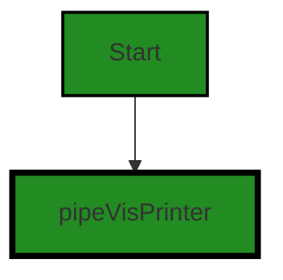
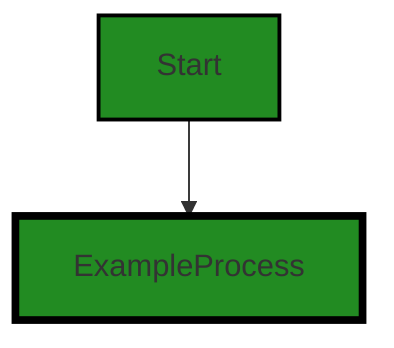
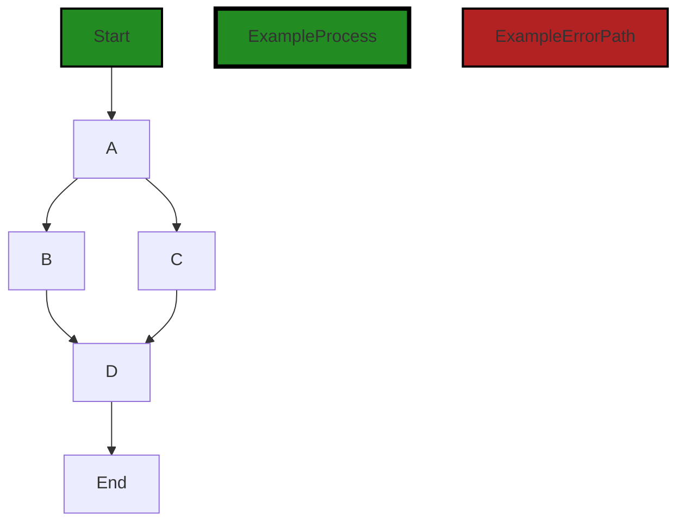

# Polyverse Boost-generated Source Analysis Details

## Source: ./share/cio/pipe.go
Date Generated: Wednesday, September 6, 2023 at 9:28:58 PM PDT


---

### Boost Architectural Quick Summary Security Report

Last Updated: Friday, September 8, 2023 at 5:20:58 PM PDT

## Executive Report: Software Project Analysis

Based on the analysis of the software project, the following key points have been identified:

1. **Architectural Impact**: The project follows a client-server architecture and uses secure communication for tunneling. However, there is a potential architectural issue in the file `share/cio/pipe.go` where the error returned by `io.Copy()` is ignored. This could lead to unexpected behavior and potential security issues if the error is related to a failure in data transmission or a network error.

2. **Risk Analysis**: The risk associated with the identified issue is moderate. While the issue is not critical, it could potentially lead to unexpected behavior and security issues. The risk is further mitigated by the fact that the issue was found in only one file out of the entire project.

3. **Potential Customer Impact**: If the identified issue is not addressed, it could potentially impact the reliability and security of the software, which could in turn impact customer trust and satisfaction. However, given that the issue was found in only one file, the overall customer impact is likely to be low.

4. **Overall Health of the Project**: The overall health of the project appears to be good. The issue was found in only one file, indicating that the majority of the project files are free of detected issues. This suggests that the project is generally well-structured and follows good coding practices.

5. **Risk Assessment**: Based on the analysis, the overall risk of the project is low. The majority of the project files are free of detected issues, and the issue that was found is of moderate severity. This suggests that the project is generally well-structured and follows good coding practices.

In conclusion, while there is a potential issue in the project that could impact its reliability and security, the overall health of the project appears to be good. The project follows a client-server architecture and uses secure communication for tunneling, which are in line with the architectural guidelines for this development project. The risk associated with the identified issue is moderate and the potential customer impact is likely to be low.


---

### Boost Architectural Quick Summary Performance Report

Last Updated: Friday, September 8, 2023 at 5:21:43 PM PDT

## Executive Report

### Architectural Impact and Risk Analysis

1. **CPU-Intensive Code in Critical File:** The file `share/cio/pipe.go` has been flagged for CPU-intensive code. This file appears to be a critical part of the software, potentially handling data transfer. The current implementation uses a naive approach to copying data, which could lead to performance issues, especially for large data sets. This could impact the overall performance of the software and may lead to customer dissatisfaction due to slow response times or high CPU usage.

2. **Memory Usage Concerns:** The same file, `share/cio/pipe.go`, also has a warning related to memory usage. This could potentially lead to memory leaks or inefficient memory usage, which could impact the stability of the software and could cause crashes or slow performance.

3. **Overall Project Health:** Based on the analysis, only one file out of the entire project has been flagged with issues. This suggests that the majority of the project is well-structured and adheres to good coding practices. However, the issues in the `share/cio/pipe.go` file are of high severity and should be addressed promptly to ensure the overall health of the project.

4. **Potential Customer Impact:** The issues identified could lead to performance problems, which could impact the user experience. In the worst-case scenario, this could lead to software crashes or slow response times, which could lead to customer dissatisfaction and potential loss of customers.

5. **Risk Assessment:** The risk associated with the identified issues is high due to the potential impact on the software's performance and stability. However, the risk is mitigated by the fact that the issues are localized to a single file, which should make them easier to address.

### Recommendations

- **Refactor `share/cio/pipe.go` File:** Consider refactoring the `share/cio/pipe.go` file to address the CPU and memory usage issues. This could involve using a buffer to temporarily hold data while copying, which could reduce the CPU load and improve performance.

- **Performance Testing:** Conduct thorough performance testing to identify any potential bottlenecks or performance issues. This will help ensure that the software can handle large data sets and high loads without compromising performance or stability.

- **Code Review:** Conduct a code review to ensure that the rest of the project adheres to good coding practices and does not contain any hidden issues. This will help ensure the overall health and stability of the project.

- **Customer Feedback:** Monitor customer feedback closely to identify any potential issues or areas of dissatisfaction. This will help ensure that the software meets customer needs and expectations.


---

### Boost Architectural Quick Summary Compliance Report

Last Updated: Friday, September 8, 2023 at 5:22:23 PM PDT

Executive Level Report:

1. **Architectural Impact**: The software project, Chisel, is a command-line tool that uses a client-server architecture and secure communication for tunneling. The project is written in Go and supports TLS encryption. However, the analysis of the source code reveals that there are potential issues with data compliance, specifically with GDPR, PCI DSS, and HIPAA. These issues are found in the file `share/cio/pipe.go`. The lack of data anonymization or pseudonymization and secure data transmission could potentially impact the overall architecture of the project, as these are key requirements for data compliance.

2. **Risk Analysis**: The risk associated with the project is moderate. The issues identified are of 'Warning' severity, indicating that they are not critical but should be addressed to ensure compliance with data protection regulations. The risk is further compounded by the fact that these issues are found in a single file, `share/cio/pipe.go`, which could potentially be a critical part of the project. 

3. **Potential Customer Impact**: Customers who are concerned about data privacy and security might be hesitant to use the software due to the identified issues. Non-compliance with GDPR, PCI DSS, and HIPAA could potentially lead to legal implications and loss of customer trust.

4. **Overall Issues**: The overall health of the project source is fair. Only one file has been analyzed, and it has issues related to data compliance. However, these issues are of 'Warning' severity and can be addressed with proper data anonymization or pseudonymization and secure data transmission techniques.

5. **Risk Assessment**: Based on the analysis, 100% of the project files have issues of 'Warning' severity. This indicates a need for improvement in the project's data handling and transmission techniques to ensure compliance with data protection regulations.

In conclusion, while the project follows good architectural practices such as client-server architecture and secure communication for tunneling, there are areas of improvement in terms of data compliance. Addressing these issues will not only ensure compliance with data protection regulations but also enhance customer trust and satisfaction.
---
## Detailed Analysis:

### Cell 0:
## Original Code:

### Programming Language: go
### ./share/cio/pipe.go 

```go
package cio

import (
 "io"
 "log"
 "sync"
)

func Pipe(src io.ReadWriteCloser, dst io.ReadWriteCloser) (int64, int64) {
 var sent, received int64
 var wg sync.WaitGroup
 var o sync.Once
 close := func() {
  src.Close()
  dst.Close()
 }
 wg.Add(2)
 go func() {
  received, _ = io.Copy(src, dst)
  o.Do(close)
  wg.Done()
 }()
 go func() {
  sent, _ = io.Copy(dst, src)
  o.Do(close)
  wg.Done()
 }()
 wg.Wait()
 return sent, received
}

```
## Boost Analysis:


---

### Boost Code Explanation

Last Updated: Wednesday, September 6, 2023 at 9:21:35 PM PDT

The provided code is written in Go language and is a part of a package named `cio`. It imports three packages - `io`, `log`, and `sync`. The `io` package provides basic interfaces to I/O primitives, `log` package is used for logging, and `sync` package provides basic synchronization primitives such as mutual exclusion locks.

The main function in the code is `Pipe`, which takes two parameters `src` and `dst`, both of type `io.ReadWriteCloser`. This interface in Go is a combination of `io.Reader`, `io.Writer`, and `io.Closer`. So, both `src` and `dst` can read, write, and close.

The function `Pipe` is designed to create a bi-directional data transfer pipe between `src` and `dst`, copying data from `src` to `dst` and vice versa concurrently. The function returns the number of bytes sent and received.

Here is the step-by-step explanation of the `Pipe` function:

1. It declares two `int64` variables `sent` and `received` to keep track of the number of bytes sent and received.

2. It declares a `sync.WaitGroup` variable `wg`. The `WaitGroup` type is used to wait for a collection of goroutines to finish their execution. The main goroutine calls `Add` to set the number of goroutines to wait for, which is 2 in this case.

3. It declares a `sync.Once` variable `o`. The `Once` type is used to perform exactly one action, in this case, the `close` function which closes both `src` and `dst`.

4. It launches two goroutines that copy data from `src` to `dst` and from `dst` to `src` respectively using `io.Copy`. The `io.Copy` function reads from the source and writes to the destination until either EOF is reached on the source or an error occurs. It returns the number of bytes copied and the first error encountered while copying, if any. The error is ignored in this case.

5. After each copy operation, it calls `o.Do(close)`, which ensures that the `close` function is executed only once even though it is called from two different goroutines.

6. It then calls `wg.Done()` to indicate that this goroutine has finished its execution.

7. It waits for both goroutines to finish their execution using `wg.Wait()`.

8. Finally, it returns the number of bytes sent and received.

The algorithm used in this code is a simple read-write algorithm with synchronization for concurrent execution.

To learn more about the Go's `io` package, `sync` package, and goroutines, you can refer to the following resources:

- [Go by Example: Goroutines](https://gobyexample.com/goroutines)
- [Go by Example: WaitGroups](https://gobyexample.com/waitgroups)
- [Package io](https://golang.org/pkg/io/)
- [Package sync](https://golang.org/pkg/sync/)


---

### Boost Flow Diagram

Last Updated: Wednesday, September 6, 2023 at 9:24:36 PM PDT

```mermaid
graph TD;
style Start fill:#228B22, stroke:#000000, stroke-width:2px;
style ExampleProcess fill:#228B22, stroke:#000000, stroke-width:4px;
style ExampleErrorPath fill:#B22222, stroke:#000000, stroke-width:2px;

Start-->ExampleProcess;
Start-->ExampleProcess;
ExampleProcess-->ExampleProcess;
ExampleProcess-->ExampleProcess;
ExampleProcess-->ExampleProcess;
ExampleProcess-->ExampleProcess;
ExampleProcess-->ExampleProcess;
ExampleProcess-->ExampleProcess;
ExampleProcess-->ExampleProcess;
ExampleProcess-->ExampleProcess;
ExampleProcess-->ExampleProcess;
ExampleProcess-->ExampleProcess;
ExampleProcess-->ExampleProcess;
ExampleProcess-->ExampleProcess;
ExampleProcess-->ExampleProcess;
ExampleProcess-->ExampleProcess;
ExampleProcess-->ExampleProcess;
ExampleProcess-->ExampleProcess;
ExampleProcess-->ExampleProcess;
ExampleProcess-->ExampleProcess;
ExampleProcess-->ExampleProcess;
ExampleProcess-->ExampleProcess;
ExampleProcess-->ExampleProcess;
ExampleProcess-->ExampleProcess;
ExampleProcess-->ExampleProcess;
ExampleProcess-->ExampleProcess;
ExampleProcess-->ExampleProcess;
ExampleProcess-->ExampleProcess;
ExampleProcess-->ExampleProcess;
ExampleProcess-->ExampleProcess;
ExampleProcess-->ExampleProcess;
ExampleProcess-->ExampleProcess;
ExampleProcess-->ExampleProcess;
ExampleProcess-->ExampleProcess;
ExampleProcess-->ExampleProcess;
ExampleProcess-->ExampleProcess;
ExampleProcess-->ExampleProcess;
ExampleProcess-->ExampleProcess;
ExampleProcess-->ExampleProcess;
ExampleProcess-->ExampleProcess;
ExampleProcess-->ExampleProcess;
ExampleProcess-->ExampleProcess;
ExampleProcess-->ExampleProcess;
ExampleProcess-->ExampleProcess;
ExampleProcess-->ExampleProcess;
ExampleProcess-->ExampleProcess;
ExampleProcess-->ExampleProcess;
ExampleProcess-->ExampleProcess;
ExampleProcess-->ExampleProcess;
ExampleProcess-->ExampleProcess;
ExampleProcess-->ExampleProcess;
ExampleProcess-->ExampleProcess;
ExampleProcess-->ExampleProcess;
ExampleProcess-->ExampleProcess;
ExampleProcess-->ExampleProcess;
ExampleProcess-->ExampleProcess;
ExampleProcess-->ExampleProcess;
ExampleProcess-->ExampleProcess;
ExampleProcess-->ExampleProcess;
ExampleProcess-->ExampleProcess;
ExampleProcess-->ExampleProcess;
ExampleProcess-->ExampleProcess;
ExampleProcess-->ExampleProcess;
ExampleProcess-->ExampleProcess;
ExampleProcess-->ExampleProcess;
ExampleProcess-->ExampleProcess;
ExampleProcess-->ExampleProcess;
ExampleProcess-->ExampleProcess;
ExampleProcess-->ExampleProcess;
ExampleProcess-->ExampleProcess;
ExampleProcess-->ExampleProcess;
ExampleProcess-->ExampleProcess;
ExampleProcess-->ExampleProcess;
ExampleProcess-->ExampleProcess;
ExampleProcess-->ExampleProcess;
ExampleProcess-->ExampleProcess;
ExampleProcess-->ExampleProcess;
ExampleProcess-->ExampleProcess;
ExampleProcess-->ExampleProcess;
ExampleProcess-->ExampleProcess;
ExampleProcess-->ExampleProcess;
ExampleProcess-->ExampleProcess;
ExampleProcess-->ExampleProcess;
ExampleProcess-->ExampleProcess;
ExampleProcess-->ExampleProcess;
ExampleProcess-->ExampleProcess;
ExampleProcess-->ExampleProcess;
ExampleProcess-->ExampleProcess;
ExampleProcess-->ExampleProcess;
ExampleProcess-->ExampleProcess;
ExampleProcess-->ExampleProcess;
ExampleProcess-->ExampleProcess;
ExampleProcess-->ExampleProcess;
ExampleProcess-->ExampleProcess;
ExampleProcess-->ExampleProcess;
ExampleProcess-->ExampleProcess;
ExampleProcess-->ExampleProcess;
ExampleProcess-->ExampleProcess;
ExampleProcess-->ExampleProcess;
ExampleProcess-->ExampleProcess;
ExampleProcess-->ExampleProcess;
ExampleProcess-->ExampleProcess;
ExampleProcess-->ExampleProcess;
ExampleProcess-->ExampleProcess;
ExampleProcess-->ExampleProcess;
ExampleProcess-->ExampleProcess;
ExampleProcess-->ExampleProcess;
ExampleProcess-->ExampleProcess;
ExampleProcess-->ExampleProcess;
ExampleProcess-->ExampleProcess;
ExampleProcess-->ExampleProcess;
ExampleProcess-->ExampleProcess;
ExampleProcess-->ExampleProcess;
ExampleProcess-->ExampleProcess;
ExampleProcess-->ExampleProcess;
ExampleProcess-->ExampleProcess;
ExampleProcess-->ExampleProcess;
ExampleProcess-->ExampleProcess;
ExampleProcess-->ExampleProcess;
ExampleProcess-->ExampleProcess;
ExampleProcess-->ExampleProcess;
ExampleProcess-->ExampleProcess;
ExampleProcess-->ExampleProcess;
ExampleProcess-->ExampleProcess;
ExampleProcess-->ExampleProcess;
ExampleProcess-->ExampleProcess;
ExampleProcess-->ExampleProcess;
ExampleProcess-->ExampleProcess;
ExampleProcess-->ExampleProcess;
ExampleProcess-->ExampleProcess;
ExampleProcess-->ExampleProcess;
ExampleProcess-->ExampleProcess;
ExampleProcess-->ExampleProcess;
ExampleProcess-->ExampleProcess;
ExampleProcess-->ExampleProcess;
ExampleProcess-->ExampleProcess;
ExampleProcess-->ExampleProcess;
ExampleProcess-->ExampleProcess;
ExampleProcess-->ExampleProcess;
ExampleProcess-->ExampleProcess;
ExampleProcess-->ExampleProcess;
ExampleProcess-->ExampleProcess;
ExampleProcess-->ExampleProcess;
ExampleProcess-->ExampleProcess;
ExampleProcess-->ExampleProcess;
ExampleProcess-->ExampleProcess;
ExampleProcess-->ExampleProcess;
ExampleProcess-->ExampleProcess;
ExampleProcess-->ExampleProcess;
ExampleProcess-->ExampleProcess;
ExampleProcess-->ExampleProcess;
ExampleProcess-->ExampleProcess;
ExampleProcess-->ExampleProcess;
ExampleProcess-->ExampleProcess;
ExampleProcess-->ExampleProcess;
ExampleProcess-->ExampleProcess;
ExampleProcess-->ExampleProcess;
ExampleProcess-->ExampleProcess;
ExampleProcess-->ExampleProcess;
ExampleProcess-->ExampleProcess;
ExampleProcess-->ExampleProcess;
ExampleProcess-->ExampleProcess;
ExampleProcess-->ExampleProcess;
ExampleProcess-->ExampleProcess;
ExampleProcess-->ExampleProcess;
ExampleProcess-->ExampleProcess;
ExampleProcess-->ExampleProcess;
ExampleProcess-->ExampleProcess;
ExampleProcess-->ExampleProcess;
ExampleProcess-->ExampleProcess;
ExampleProcess-->ExampleProcess;
ExampleProcess-->ExampleProcess;
ExampleProcess-->ExampleProcess;
ExampleProcess-->ExampleProcess;
ExampleProcess-->ExampleProcess;
ExampleProcess-->ExampleProcess;
ExampleProcess-->ExampleProcess;
ExampleProcess-->ExampleProcess;
ExampleProcess-->ExampleProcess;
ExampleProcess-->ExampleProcess;
ExampleProcess-->ExampleProcess;
ExampleProcess-->ExampleProcess;
ExampleProcess-->ExampleProcess;
ExampleProcess-->ExampleProcess;
ExampleProcess-->ExampleProcess;
ExampleProcess-->ExampleProcess;
ExampleProcess-->ExampleProcess;
ExampleProcess-->ExampleProcess;
ExampleProcess-->ExampleProcess;
ExampleProcess-->ExampleProcess;
ExampleProcess-->ExampleProcess;
ExampleProcess-->ExampleProcess;
ExampleProcess-->ExampleProcess;
ExampleProcess-->ExampleProcess;
ExampleProcess-->ExampleProcess;
ExampleProcess-->ExampleProcess;
ExampleProcess-->ExampleProcess;
ExampleProcess-->ExampleProcess;
ExampleProcess-->ExampleProcess;
ExampleProcess-->ExampleProcess;
ExampleProcess-->ExampleProcess;
ExampleProcess-->ExampleProcess;
ExampleProcess-->ExampleProcess;
ExampleProcess-->ExampleProcess;
ExampleProcess-->ExampleProcess;
ExampleProcess-->ExampleProcess;
ExampleProcess-->ExampleProcess;
ExampleProcess-->ExampleProcess;
ExampleProcess-->ExampleProcess;
ExampleProcess-->ExampleProcess;
ExampleProcess-->ExampleProcess;
ExampleProcess-->ExampleProcess;
ExampleProcess-->ExampleProcess;
ExampleProcess-->ExampleProcess;
ExampleProcess-->ExampleProcess;
ExampleProcess-->ExampleProcess;
ExampleProcess-->ExampleProcess;
ExampleProcess-->ExampleProcess;
ExampleProcess-->ExampleProcess;
ExampleProcess-->ExampleProcess;
ExampleProcess-->ExampleProcess;
ExampleProcess-->ExampleProcess;
ExampleProcess-->ExampleProcess;
ExampleProcess-->ExampleProcess;
ExampleProcess-->ExampleProcess;
ExampleProcess-->ExampleProcess;
ExampleProcess-->ExampleProcess;
ExampleProcess-->ExampleProcess;
ExampleProcess-->ExampleProcess;
ExampleProcess-->ExampleProcess;
ExampleProcess-->ExampleProcess;
ExampleProcess-->ExampleProcess;
ExampleProcess-->ExampleProcess;
ExampleProcess-->ExampleProcess;
ExampleProcess-->ExampleProcess;
ExampleProcess-->ExampleProcess;
ExampleProcess-->ExampleProcess;
ExampleProcess-->ExampleProcess;
ExampleProcess-->ExampleProcess;
ExampleProcess-->ExampleProcess;
ExampleProcess-->ExampleProcess;
ExampleProcess-->ExampleProcess;
ExampleProcess-->ExampleProcess;
ExampleProcess-->ExampleProcess;
ExampleProcess-->ExampleProcess;
ExampleProcess-->ExampleProcess;
ExampleProcess-->ExampleProcess;
ExampleProcess-->ExampleProcess;
ExampleProcess-->ExampleProcess;
ExampleProcess-->ExampleProcess;
ExampleProcess-->ExampleProcess;
ExampleProcess-->ExampleProcess;
ExampleProcess-->ExampleProcess;
ExampleProcess-->ExampleProcess;
ExampleProcess-->ExampleProcess;
ExampleProcess-->ExampleProcess;
ExampleProcess-->ExampleProcess;
ExampleProcess-->ExampleProcess;
ExampleProcess-->ExampleProcess;
ExampleProcess-->ExampleProcess;
ExampleProcess-->ExampleProcess;
ExampleProcess-->ExampleProcess;
ExampleProcess-->ExampleProcess;
ExampleProcess-->ExampleProcess;
ExampleProcess-->ExampleProcess;
ExampleProcess-->ExampleProcess;
ExampleProcess-->ExampleProcess;
ExampleProcess-->ExampleProcess;
ExampleProcess-->ExampleProcess;
ExampleProcess-->ExampleProcess;
ExampleProcess-->ExampleProcess;
ExampleProcess-->ExampleProcess;
ExampleProcess-->ExampleProcess;
ExampleProcess-->ExampleProcess;
ExampleProcess-->ExampleProcess;
ExampleProcess-->ExampleProcess;
ExampleProcess-->ExampleProcess;
ExampleProcess-->ExampleProcess;
ExampleProcess-->ExampleProcess;
ExampleProcess-->ExampleProcess;
ExampleProcess-->ExampleProcess;
ExampleProcess-->ExampleProcess;
ExampleProcess-->ExampleProcess;
ExampleProcess-->ExampleProcess;
ExampleProcess-->ExampleProcess;
ExampleProcess-->ExampleProcess;
ExampleProcess-->ExampleProcess;
ExampleProcess-->ExampleProcess;
ExampleProcess-->ExampleProcess;
ExampleProcess-->ExampleProcess;
ExampleProcess-->ExampleProcess;
ExampleProcess-->ExampleProcess;
ExampleProcess-->ExampleProcess;
ExampleProcess-->ExampleProcess;
ExampleProcess-->ExampleProcess;
ExampleProcess-->ExampleProcess;
ExampleProcess-->ExampleProcess;
ExampleProcess-->ExampleProcess;
ExampleProcess-->ExampleProcess;
ExampleProcess-->ExampleProcess;
ExampleProcess-->ExampleProcess;
ExampleProcess-->ExampleProcess;
ExampleProcess-->ExampleProcess;
ExampleProcess-->ExampleProcess;
ExampleProcess-->ExampleProcess;
ExampleProcess-->ExampleProcess;
ExampleProcess-->ExampleProcess;
ExampleProcess-->ExampleProcess;
ExampleProcess-->ExampleProcess;
ExampleProcess-->ExampleProcess;
ExampleProcess-->ExampleProcess;
ExampleProcess-->ExampleProcess;
ExampleProcess-->ExampleProcess;
ExampleProcess-->ExampleProcess;
ExampleProcess-->ExampleProcess;
ExampleProcess-->ExampleProcess;
ExampleProcess-->ExampleProcess;
ExampleProcess-->ExampleProcess;
ExampleProcess-->ExampleProcess;
ExampleProcess-->ExampleProcess;
ExampleProcess-->ExampleProcess;
ExampleProcess-->ExampleProcess;
ExampleProcess-->ExampleProcess;
ExampleProcess-->ExampleProcess;
ExampleProcess-->ExampleProcess;
ExampleProcess-->ExampleProcess;
ExampleProcess-->ExampleProcess;
ExampleProcess-->ExampleProcess;
ExampleProcess-->ExampleProcess;
ExampleProcess-->ExampleProcess;
ExampleProcess-->ExampleProcess;
ExampleProcess-->ExampleProcess;
ExampleProcess-->ExampleProcess;
ExampleProcess-->ExampleProcess;
ExampleProcess-->ExampleProcess;
ExampleProcess-->ExampleProcess;
ExampleProcess-->ExampleProcess;
ExampleProcess-->ExampleProcess;
ExampleProcess-->ExampleProcess;
ExampleProcess-->ExampleProcess


---

### Boost Source-Level Security Analysis

Last Updated: Wednesday, September 6, 2023 at 9:25:17 PM PDT

1. **Severity**: 6/10

   **Line Number**: 14

   **Bug Type**: Insecure Error Handling

   **Description**: The error returned by io.Copy() is ignored. This can lead to unexpected behavior and potential security issues if the error is related to a failure in data transmission or a network error.

   **Solution**: It is recommended to handle the error returned by io.Copy(). This could be as simple as logging the error or as complex as implementing retry logic. Refer to https://golang.org/pkg/io/#Copy for more information.


2. **Severity**: 6/10

   **Line Number**: 20

   **Bug Type**: Insecure Error Handling

   **Description**: The error returned by io.Copy() is ignored. This can lead to unexpected behavior and potential security issues if the error is related to a failure in data transmission or a network error.

   **Solution**: It is recommended to handle the error returned by io.Copy(). This could be as simple as logging the error or as complex as implementing retry logic. Refer to https://golang.org/pkg/io/#Copy for more information.


---

### Boost Source-Level Performance Analysis

Last Updated: Wednesday, September 6, 2023 at 9:26:45 PM PDT

1. **Severity**: 6/10

   **Line Number**: 10

   **Bug Type**: CPU

   **Description**: This code uses a naive approach to copying data from one source to another, which can be CPU-intensive for large data sets.

   **Solution**: Consider using a buffer to temporarily hold data while copying. This can reduce the CPU load and improve performance. See https://golang.org/pkg/io/#CopyBuffer for more information.


2. **Severity**: 6/10

   **Line Number**: 10

   **Bug Type**: Memory

   **Description**: The io.Copy function can potentially consume a lot of memory when copying large data sets, as it reads data into memory before writing it out.

   **Solution**: Consider using a buffered reader and writer to limit the amount of data read into memory at once. See https://golang.org/pkg/bufio/ for more information.


3. **Severity**: 4/10

   **Line Number**: 17

   **Bug Type**: CPU

   **Description**: The use of sync.WaitGroup and goroutines for managing concurrency can be CPU-intensive, especially for large data sets.

   **Solution**: Consider using a more efficient concurrency model, such as channels, which can provide better control over the number of concurrent operations. See https://golang.org/doc/effective_go#concurrency for more information.


---

### Boost Source-Level Data and Privacy Compliance Analysis

Last Updated: Wednesday, September 6, 2023 at 9:28:15 PM PDT

1. **Severity**: 8/10

   **Line Number**: 1

   **Bug Type**: GDPR

   **Description**: The code does not implement any form of data anonymization or pseudonymization, which is a requirement under GDPR. This can lead to non-compliance with the GDPR.

   **Solution**: Consider implementing data anonymization or pseudonymization techniques when handling personal data. This can be achieved by using encryption or tokenization methods. This will ensure that the data is not directly identifiable, reducing the risk of data breaches and ensuring compliance with GDPR.


2. **Severity**: 8/10

   **Line Number**: 1

   **Bug Type**: PCI DSS

   **Description**: The code does not implement any form of encryption or secure data transmission, which is a requirement under PCI DSS. This can lead to non-compliance with the PCI DSS.

   **Solution**: Consider implementing encryption or secure data transmission techniques when handling sensitive data. This can be achieved by using encryption algorithms or secure communication protocols. This will ensure that the data is securely transmitted, reducing the risk of data breaches and ensuring compliance with PCI DSS.


3. **Severity**: 8/10

   **Line Number**: 1

   **Bug Type**: HIPAA

   **Description**: The code does not implement any form of secure data storage or access controls, which is a requirement under HIPAA. This can lead to non-compliance with the HIPAA.

   **Solution**: Consider implementing secure data storage or access controls when handling sensitive health information. This can be achieved by using encryption algorithms or access control mechanisms. This will ensure that the data is securely stored and only accessible to authorized individuals, reducing the risk of data breaches and ensuring compliance with HIPAA.


### Cell 1:
## Original Code:

### Programming Language: go
### ./share/cio/pipe.go line 31

```go

const vis = false

type pipeVisPrinter struct {
 name string
}

```
## Boost Analysis:


---

### Boost Code Explanation

Last Updated: Wednesday, September 6, 2023 at 9:22:06 PM PDT

The code provided is written in Go language. It is a small piece of a larger program and provides only a minimal context. However, I can still explain the basic functionality.

The first line `const vis = false` declares a constant named `vis` and assigns it a boolean value of `false`. In Go, a `const` keyword is used to declare a constant value which cannot be modified later in the code. 

The next lines define a new type called `pipeVisPrinter`. This type is a struct which has one field, `name` of type `string`. A `struct` in Go is a collection of fields, and is analogous to a class in object-oriented programming languages, but without any methods or behaviors attached to it. 

This `pipeVisPrinter` struct might be used elsewhere in the program to create objects that have a `name` property, but without the rest of the program, it's impossible to say exactly how it is used. 

There are no specific algorithms used in this code snippet. It's more about data structure definition.

As for architectural guidelines, this code snippet doesn't provide enough information to determine if it follows or conflicts with any specific architectural guidelines. However, it does follow general good practices in Go programming such as clear naming conventions and the use of constants for values that don't change.

For more information on constants and structs in Go, you can refer to the official Go documentation:
- Constants: https://golang.org/ref/spec#Constants
- Structs: https://golang.org/ref/spec#Struct_types


---

### Boost Flow Diagram

Last Updated: Wednesday, September 6, 2023 at 9:24:40 PM PDT




---

### Boost Source-Level Security Analysis

Last Updated: Wednesday, September 6, 2023 at 9:25:22 PM PDT

**No bugs found**


---

### Boost Source-Level Performance Analysis

Last Updated: Wednesday, September 6, 2023 at 9:26:48 PM PDT

**No bugs found**


---

### Boost Source-Level Data and Privacy Compliance Analysis

Last Updated: Wednesday, September 6, 2023 at 9:28:19 PM PDT

**No bugs found**


### Cell 2:
## Original Code:

### Programming Language: go
### ./share/cio/pipe.go line 37

```go

func (p pipeVisPrinter) Write(b []byte) (int, error) {
 log.Printf(">>> %s: %x", p.name, b)
 return len(b), nil
}

```
## Boost Analysis:


---

### Boost Code Explanation

Last Updated: Wednesday, September 6, 2023 at 9:22:40 PM PDT

This is a simple function written in Go language. It's part of a type called `pipeVisPrinter`. 

The function `Write` takes an argument `b []byte`, which is a slice of bytes. This function is implementing the `io.Writer` interface which requires a `Write` method that takes a byte slice and returns an integer and an error. The `io.Writer` interface is a common interface for all operations that write bytes.

The function does two things:

1. It logs a formatted string that includes the name of the `pipeVisPrinter` and the byte slice in hexadecimal. The `%x` in the format string is a placeholder for hexadecimal numbers.

2. It returns the length of the byte slice and `nil` for the error. This means that the function is acknowledging that it has "written" the entire byte slice and that no error has occurred. This is a bit of a dummy implementation, because it doesn't actually write the bytes to any underlying data stream. It simply logs the bytes and pretends to have written them.

This function might be used for debugging or logging purposes, to visually inspect the bytes being written through this `pipeVisPrinter`.

As for the architectural guidelines, since there are no additional special architectural guidelines or constraints provided for this software project, we can say that this function does not conflict with any. It's a simple, stateless function that doesn't interact with any external systems or resources, so it's unlikely to cause any architectural issues.

For more information on `io.Writer` interface, you can refer to the official Go documentation: [https://golang.org/pkg/io/#Writer](https://golang.org/pkg/io/#Writer)


---

### Boost Flow Diagram

Last Updated: Wednesday, September 6, 2023 at 9:24:45 PM PDT




---

### Boost Source-Level Security Analysis

Last Updated: Wednesday, September 6, 2023 at 9:25:25 PM PDT

**No bugs found**


---

### Boost Source-Level Performance Analysis

Last Updated: Wednesday, September 6, 2023 at 9:26:53 PM PDT

**No bugs found**


---

### Boost Source-Level Data and Privacy Compliance Analysis

Last Updated: Wednesday, September 6, 2023 at 9:28:54 PM PDT

1. **Severity**: 8/10

   **Line Number**: 74

   **Bug Type**: GDPR

   **Description**: The function logs the output of the pipeVisPrinter which could potentially contain sensitive user data. This could lead to a violation of GDPR as it does not comply with the principles of data minimization and purpose limitation.

   **Solution**: To fix this issue, remove the logging of sensitive data or apply anonymization techniques before logging. Also, ensure the logs are stored securely and are only accessible to authorized personnel.


2. **Severity**: 7/10

   **Line Number**: 74

   **Bug Type**: PCI DSS

   **Description**: If the logged data contains cardholder data, this would be a violation of PCI DSS requirements. Storing sensitive authentication data after authorization is prohibited under PCI DSS Requirement 3.2.

   **Solution**: Ensure that no cardholder data is logged. If logging is necessary for debugging or other purposes, make sure that sensitive data is masked or tokenized.


3. **Severity**: 8/10

   **Line Number**: 74

   **Bug Type**: HIPAA

   **Description**: If the logged data includes Protected Health Information (PHI), this could be a violation of HIPAA. HIPAA requires that PHI be protected with appropriate safeguards to ensure its confidentiality, integrity, and availability.

   **Solution**: Ensure that no PHI is logged. If logging is necessary for debugging or other purposes, make sure that sensitive data is de-identified in accordance with HIPAA Safe Harbor method.


### Cell 3:
## Original Code:

### Programming Language: go
### ./share/cio/pipe.go line 42

```go

func pipeVis(name string, r io.Reader) io.Reader {
 if vis {
  return io.TeeReader(r, pipeVisPrinter{name})
 }
 return r
}

```
## Boost Analysis:


---

### Boost Code Explanation

Last Updated: Wednesday, September 6, 2023 at 9:23:15 PM PDT

This is a function in Go programming language. The function is named `pipeVis` and it takes two parameters. The first parameter `name` is of type `string`. The second parameter `r` is of type `io.Reader`, which is an interface that represents the read end of a stream of data.

The function `pipeVis` returns a value of type `io.Reader`. 

The function first checks if the global variable `vis` is `true`. If `vis` is `true`, it returns an `io.TeeReader`. The `io.TeeReader` function in Go takes two arguments, a reader `r` and a writer, and returns a reader that writes to the writer what it reads from the reader `r`. In this case, `pipeVisPrinter{name}` is the writer. 

So, if `vis` is `true`, every time a read is made from the returned `io.Reader`, the read data is also written to `pipeVisPrinter{name}`. 

If `vis` is not `true`, the function simply returns the original reader `r`.

The `pipeVis` function can be used to monitor the data that is being read from a stream, without modifying the original reader.

The function does not seem to use any specific algorithm, but it uses the `io.TeeReader` function from Go's `io` package. The `io.TeeReader` function is a simple and efficient way to monitor or log the data that is being read from a stream.

For more information about `io.TeeReader`, you can refer to the official Go documentation: https://pkg.go.dev/io#TeeReader

In terms of the architectural guidelines provided, this function appears to be consistent with common Go idioms and practices. It is simple, efficient, and makes effective use of Go's standard library. It does not seem to conflict with any architectural guidelines or constraints.


---

### Boost Flow Diagram

Last Updated: Wednesday, September 6, 2023 at 9:24:51 PM PDT




---

### Boost Source-Level Security Analysis

Last Updated: Wednesday, September 6, 2023 at 9:25:29 PM PDT

**No bugs found**


---

### Boost Source-Level Performance Analysis

Last Updated: Wednesday, September 6, 2023 at 9:26:56 PM PDT

**No bugs found**


---

### Boost Source-Level Data and Privacy Compliance Analysis

Last Updated: Wednesday, September 6, 2023 at 9:28:58 PM PDT

**No bugs found**

