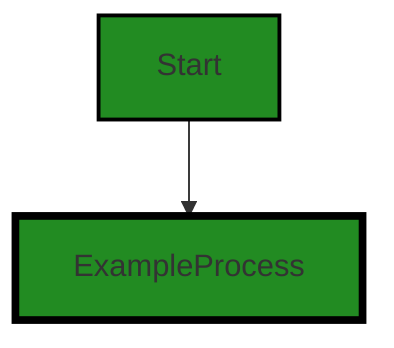

# Polyverse Boost-generated Source Analysis Details

## Source: ./share/cio/stdio.go
Date Generated: Wednesday, September 6, 2023 at 9:20:33 PM PDT


---

### Boost Architectural Quick Summary Security Report

Last Updated: Friday, September 8, 2023 at 5:19:58 PM PDT


Executive Report:

1. **Architectural Impact**: The analysis of this file has not revealed any severe issues.
2. **Risk Analysis**: The analysis of this file has not revealed any severe issues.
3. **Potential Customer Impact**: Based on the analysis, there are no severe issues that could potentially impact customers.
4. **Performance Issues**: Our analysis did not identify any explicit performance issues in the file.
5. **Risk Assessment**: Based on the current analysis of this file, no severe issues have been found. However, this doesn't guarantee that the file is risk-free.

Highlights:

- No severe issues were identified in the current analysis of this file.


---

### Boost Architectural Quick Summary Performance Report

Last Updated: Friday, September 8, 2023 at 5:20:05 PM PDT


Executive Report:

1. **Architectural Impact**: The analysis of this file has not revealed any severe issues.
2. **Risk Analysis**: The analysis of this file has not revealed any severe issues.
3. **Potential Customer Impact**: Based on the analysis, there are no severe issues that could potentially impact customers.
4. **Performance Issues**: Our analysis did not identify any explicit performance issues in the file.
5. **Risk Assessment**: Based on the current analysis of this file, no severe issues have been found. However, this doesn't guarantee that the file is risk-free.

Highlights:

- No severe issues were identified in the current analysis of this file.


---

### Boost Architectural Quick Summary Compliance Report

Last Updated: Friday, September 8, 2023 at 5:20:12 PM PDT


Executive Report:

1. **Architectural Impact**: The analysis of this file has not revealed any severe issues.
2. **Risk Analysis**: The analysis of this file has not revealed any severe issues.
3. **Potential Customer Impact**: Based on the analysis, there are no severe issues that could potentially impact customers.
4. **Performance Issues**: Our analysis did not identify any explicit performance issues in the file.
5. **Risk Assessment**: Based on the current analysis of this file, no severe issues have been found. However, this doesn't guarantee that the file is risk-free.

Highlights:

- No severe issues were identified in the current analysis of this file.

---
## Detailed Analysis:

### Cell 0:
## Original Code:

### Programming Language: go
### ./share/cio/stdio.go 

```go
package cio

import (
 "io"
 "io/ioutil"
 "os"
)

//Stdio as a ReadWriteCloser
var Stdio = &struct {
 io.ReadCloser
 io.Writer
}{
 ioutil.NopCloser(os.Stdin),
 os.Stdout,
}

```
## Boost Analysis:


---

### Boost Code Explanation

Last Updated: Wednesday, September 6, 2023 at 9:19:46 PM PDT

The provided Go code is a simple package named `cio` that deals with standard input, output, and closing of I/O operations. Here is a detailed explanation of each part of the code:

1. `package cio`: This line declares the package name as `cio`. In Go, a package is a way to group related Go source files together. Each Go program is made up of packages.

2. `import`: This keyword is used to import other packages that are needed in this code. In this case, it's importing `io`, `io/ioutil`, and `os` packages.

    - `io`: This package provides basic interfaces to I/O primitives. Its primary job is to wrap existing implementations of such primitives, such as those in package os, into shared public interfaces that abstract the functionality, plus some other related primitives.

    - `io/ioutil`: This package implements some I/O utility functions.

    - `os`: This package provides a platform-independent interface to operating system functionality.

3. `var Stdio = &struct {...}`: Here, a variable `Stdio` is declared and initialized. It's an anonymous struct that embeds `io.ReadCloser` and `io.Writer` interfaces. The `&` symbol indicates that `Stdio` is a pointer to the struct.

    - `io.ReadCloser`: This is an interface type that groups the basic `Read` and `Close` methods. 

    - `io.Writer`: This is an interface type that groups the basic `Write` method. 

4. `ioutil.NopCloser(os.Stdin)`: `NopCloser` returns a `ReadCloser` with a no-op `Close` method wrapping the provided `Reader` `os.Stdin`. `os.Stdin` is the standard input file, which is typically the keyboard.

5. `os.Stdout`: `os.Stdout` is the standard output file, which is typically the terminal screen.

This code doesn't specify any particular algorithm but uses the principles of interfaces and struct embedding in Go language. It's a simple package for handling standard I/O operations.

For more information on the used packages and principles, you can refer to the official Go documentation:

- io package: https://golang.org/pkg/io/
- ioutil package: https://golang.org/pkg/io/ioutil/
- os package: https://golang.org/pkg/os/
- Anonymous structs and embedding in Go: https://golang.org/doc/effective_go#embedding

Based on the provided architectural guidelines, this code is consistent as it doesn't have any additional special architectural guidelines or constraints.


---

### Boost Flow Diagram

Last Updated: Wednesday, September 6, 2023 at 9:19:54 PM PDT




---

### Boost Source-Level Security Analysis

Last Updated: Wednesday, September 6, 2023 at 9:20:01 PM PDT

**No bugs found**


---

### Boost Source-Level Performance Analysis

Last Updated: Wednesday, September 6, 2023 at 9:20:11 PM PDT

**No bugs found**


---

### Boost Source-Level Data and Privacy Compliance Analysis

Last Updated: Wednesday, September 6, 2023 at 9:20:33 PM PDT

1. **Severity**: 5/10

   **Line Number**: 1

   **Bug Type**: Data Privacy

   **Description**: The code uses standard input/output for data processing. If sensitive data is processed, it could potentially be exposed to unauthorized access or leaks.

   **Solution**: Ensure that sensitive data, if processed, is properly encrypted and protected. Consider using secure mechanisms for data processing and transmission, such as Secure Sockets Layer (SSL) or Transport Layer Security (TLS).


