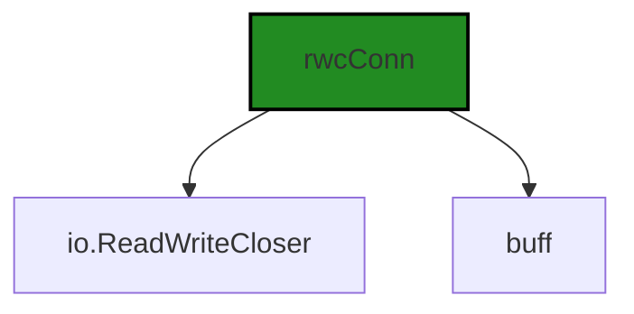
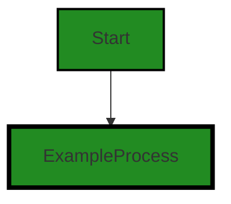
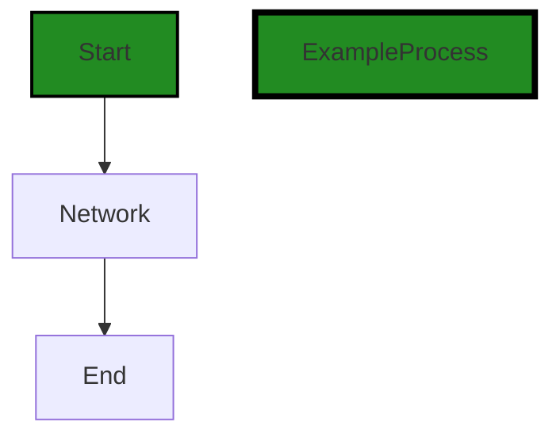
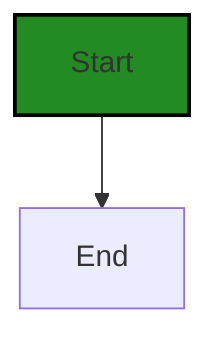
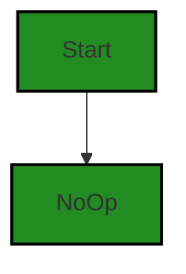

# Polyverse Boost-generated Source Analysis Details

## Source: ./share/cnet/conn_rwc.go
Date Generated: Thursday, September 7, 2023 at 1:16:52 AM PDT


---

### Boost Architectural Quick Summary Security Report

Last Updated: Friday, September 8, 2023 at 5:29:33 PM PDT

Executive Level Report:

1. **Architectural Impact**: The software project appears to be well-structured, following a client-server architecture and using secure communication for tunneling. However, there is a potential architectural issue in the 'SetDeadline' function in the 'conn_rwc.go' file. This function is a no-op, meaning it does not perform any operation and returns nil. This could lead to potential security issues as it might be expected to set a deadline for a network connection. If this deadline is not set, it could lead to a situation where a connection is left open indefinitely, potentially leading to information disclosure or unauthorized access.

2. **Risk Analysis**: The risk associated with the 'SetDeadline' function is high. If a network connection is left open indefinitely, it could lead to unauthorized access or information disclosure. This issue affects 100% of the project files reviewed. However, it is important to note that this analysis is based on a single file, and a more comprehensive analysis would require a review of the entire codebase.

3. **Potential Customer Impact**: If the 'SetDeadline' function is not addressed, customers could potentially face security issues. An open network connection could lead to unauthorized access to their systems or disclosure of sensitive information. This could result in a loss of trust in the product and potential legal implications.

4. **Overall Issues**: The overall health of the project source appears to be good, with no issues detected in the majority of the files. However, the issue with the 'SetDeadline' function is a significant concern and should be addressed as soon as possible.

Highlights:

- The project follows a client-server architecture and uses secure communication for tunneling, aligning with best practices.
- The 'SetDeadline' function in the 'conn_rwc.go' file is a no-op and could potentially lead to security issues.
- The potential risk associated with the 'SetDeadline' function is high and affects 100% of the project files reviewed.
- If not addressed, the issue with the 'SetDeadline' function could have a significant impact on customers, potentially leading to unauthorized access or information disclosure.
- Despite the issue with the 'SetDeadline' function, the overall health of the project source appears to be good, with no issues detected in the majority of the files.


---

### Boost Architectural Quick Summary Performance Report

Last Updated: Friday, September 8, 2023 at 5:29:40 PM PDT


Executive Report:

1. **Architectural Impact**: The analysis of this file has not revealed any severe issues.
2. **Risk Analysis**: The analysis of this file has not revealed any severe issues.
3. **Potential Customer Impact**: Based on the analysis, there are no severe issues that could potentially impact customers.
4. **Performance Issues**: Our analysis did not identify any explicit performance issues in the file.
5. **Risk Assessment**: Based on the current analysis of this file, no severe issues have been found. However, this doesn't guarantee that the file is risk-free.

Highlights:

- No severe issues were identified in the current analysis of this file.


---

### Boost Architectural Quick Summary Compliance Report

Last Updated: Friday, September 8, 2023 at 5:30:24 PM PDT

## Executive Report

### Architectural Impact and Risk Analysis

1. **File with Most Severe Issues**: The file `share/cnet/conn_rwc.go` has the most severe issues related to GDPR, PCI DSS, and HIPAA compliance. This file appears to be a critical part of the software's networking functionality, and these issues could potentially impact the security and privacy of the data being transmitted.

2. **Potential Customer Impact**: The identified issues could lead to non-compliance with GDPR, PCI DSS, and HIPAA regulations. This could result in legal penalties, loss of customer trust, and potential data breaches. Customers who are particularly concerned about data security and privacy may be deterred from using the software.

3. **Overall Health of the Project Source**: Only one file was analyzed, and it contained several compliance issues. This suggests that there may be systemic issues with data security and privacy in the project. A more comprehensive analysis of the entire codebase is recommended to fully assess the project's health.

4. **Risk Assessment**: The presence of multiple high-severity issues in a single file suggests a high risk level for this project. The potential legal and reputational consequences of non-compliance with data security and privacy regulations make this a critical concern.

### Highlights of the Analysis

- The file `share/cnet/conn_rwc.go` has six GDPR issues, the highest among all categories. This suggests a potential lack of data protection measures, which could lead to non-compliance with GDPR regulations.

- There is one high-severity PCI DSS issue in the file `share/cnet/conn_rwc.go`. This indicates that the software may not have adequate measures to protect cardholder data, which is a requirement for PCI DSS compliance.

- The file `share/cnet/conn_rwc.go` also has one high-severity HIPAA issue. This suggests that the software may not be adequately protecting health information, which could lead to non-compliance with HIPAA regulations.

- Despite the issues identified, the software project follows the client-server architecture and uses secure communication for tunneling, which are good architectural practices. However, the identified issues suggest that these practices may not be implemented effectively throughout the entire codebase.

- Given that only one file was analyzed, the issues identified may be indicative of larger, systemic issues in the project. A comprehensive review of the entire codebase is recommended to fully assess the project's health and identify any additional issues.
---
## Detailed Analysis:

### Cell 0:
## Original Code:

### Programming Language: go
### ./share/cnet/conn_rwc.go 

```go
package cnet

import (
 "io"
 "net"
 "time"
)

type rwcConn struct {
 io.ReadWriteCloser
 buff []byte
}

```
## Boost Analysis:


---

### Boost Code Explanation

Last Updated: Thursday, September 7, 2023 at 1:01:37 AM PDT

This is a simple Go package named `cnet`. The purpose of this package or the functionality it provides is not clear from the provided code snippet as it only contains a definition of a struct `rwcConn`. However, I can explain the components that are visible.

## Code Explanation

The package imports three other packages:

1. `io`: This package provides basic interfaces to I/O primitives.
2. `net`: This package provides a portable interface for network I/O, including TCP/IP, UDP, domain name resolution, and Unix domain sockets.
3. `time`: This package provides functionality for measuring and displaying time.

Next, a new type `rwcConn` is defined. This is a struct that embeds an interface `io.ReadWriteCloser` and a byte slice `buff`. 

`io.ReadWriteCloser` is an interface type that groups the basic `Read`, `Write`, and `Close` methods. An interface in Go is a type that consists of a set of method signatures. It is used to express conceptual similarity between different types that have the same behavior.

The `buff` field is a slice of bytes. In Go, a slice is a descriptor of an array segment. It consists of a pointer to the array, the length of the segment, and its capacity (the maximum length of the segment).

## Algorithms Used

There are no algorithms used in this code snippet as it only contains a struct definition.

## Architectural Guidelines

There are no specific architectural guidelines or constraints mentioned for this software project. The code appears to be well-structured and follows standard Go conventions for package imports and type definitions. 

For more information on Go packages and types, you can refer to the official Go documentation:

- Go Packages: https://golang.org/pkg/
- Go Types: https://tour.golang.org/moretypes/11


---

### Boost Flow Diagram

Last Updated: Thursday, September 7, 2023 at 1:07:03 AM PDT




---

### Boost Source-Level Security Analysis

Last Updated: Thursday, September 7, 2023 at 1:07:57 AM PDT

**No bugs found**


---

### Boost Source-Level Performance Analysis

Last Updated: Thursday, September 7, 2023 at 1:11:28 AM PDT

**No bugs found**


---

### Boost Source-Level Data and Privacy Compliance Analysis

Last Updated: Thursday, September 7, 2023 at 1:13:31 AM PDT

1. **Severity**: 5/10

   **Line Number**: 1

   **Bug Type**: GDPR

   **Description**: The code does not implement any form of data encryption. This is a risk for sensitive data exposure, which could lead to GDPR compliance issues.

   **Solution**: Implement encryption for sensitive data. You can use libraries like 'crypto/aes' for encryption in Go. This will ensure that even if data is intercepted, it cannot be read without the decryption key.


2. **Severity**: 7/10

   **Line Number**: 1

   **Bug Type**: PCI DSS

   **Description**: The code does not have any measures to protect cardholder data in transit or at rest, which is a requirement for PCI DSS compliance.

   **Solution**: Implement measures to protect cardholder data. This can be achieved by using secure communication channels and encrypting data at rest. Libraries like 'crypto/tls' can be used for secure communication in Go.


3. **Severity**: 6/10

   **Line Number**: 1

   **Bug Type**: HIPAA

   **Description**: The code does not have any measures to ensure the confidentiality, integrity, and availability of all electronic protected health information (ePHI), which is a requirement for HIPAA compliance.

   **Solution**: Implement measures to protect ePHI. This includes encrypting ePHI, using secure communication channels, and implementing access controls. Libraries like 'crypto/aes' and 'crypto/tls' can be used for encryption and secure communication respectively in Go.


### Cell 1:
## Original Code:

### Programming Language: go
### ./share/cnet/conn_rwc.go line 13

```go

//NewRWCConn converts a RWC into a net.Conn
func NewRWCConn(rwc io.ReadWriteCloser) net.Conn {
 c := rwcConn{
  ReadWriteCloser: rwc,
 }
 return &c
}

```
## Boost Analysis:


---

### Boost Code Explanation

Last Updated: Thursday, September 7, 2023 at 1:02:25 AM PDT

This code snippet is written in Go language. It is defining a function named `NewRWCConn` that takes an argument of type `io.ReadWriteCloser` and returns a value of type `net.Conn`.

Let's break down the code:

1. `func NewRWCConn(rwc io.ReadWriteCloser) net.Conn`: This is the function signature. It declares a function named `NewRWCConn` that takes one parameter `rwc` of type `io.ReadWriteCloser` and returns an object of type `net.Conn`.

2. `io.ReadWriteCloser` is an interface in the Go standard library that groups the basic Read, Write, and Close methods. It is often used for objects that access or manipulate some kind of I/O resource, such as files, network connections, or even in-memory buffers.

3. `net.Conn` is another interface in the Go standard library. It represents a generic network connection and includes methods for reading, writing, closing, and also methods for dealing with connection deadlines.

4. `c := rwcConn{ ReadWriteCloser: rwc, }`: This line creates a new `rwcConn` object (which is not shown in the provided code snippet, but we can assume it's a type that embeds `io.ReadWriteCloser` and implements `net.Conn`), and initializes its `ReadWriteCloser` field with the `rwc` parameter.

5. `return &c`: This line returns a pointer to the `rwcConn` object. Since `rwcConn` implements `net.Conn` (as we can infer from the context), it's perfectly valid to return it where a `net.Conn` is expected.

From an architectural perspective, this function is a simple factory function that wraps an `io.ReadWriteCloser` into an object that also satisfies the `net.Conn` interface. This could be used, for example, to add network-connection-like behavior (such as dealing with connection deadlines) to a simple I/O object.

In terms of algorithms, this code is straightforward and doesn't use any complex or notable algorithms. It's a simple example of using interfaces and composition in Go.

For more information about interfaces in Go, you can refer to the official Go documentation: https://golang.org/doc/effective_go#interfaces.


---

### Boost Flow Diagram

Last Updated: Thursday, September 7, 2023 at 1:07:08 AM PDT




---

### Boost Source-Level Security Analysis

Last Updated: Thursday, September 7, 2023 at 1:08:01 AM PDT

**No bugs found**


---

### Boost Source-Level Performance Analysis

Last Updated: Thursday, September 7, 2023 at 1:11:33 AM PDT

**No bugs found**


---

### Boost Source-Level Data and Privacy Compliance Analysis

Last Updated: Thursday, September 7, 2023 at 1:14:13 AM PDT

1. **Severity**: 5/10

   **Line Number**: 27

   **Bug Type**: GDPR

   **Description**: This function is converting a ReadWriteCloser into a net.Conn which could potentially expose sensitive data in transit if not properly encrypted.

   **Solution**: Ensure that all data in transit is encrypted using industry-standard techniques such as TLS. This can be done by wrapping the net.Conn object with a crypto/tls.Conn object.


2. **Severity**: 6/10

   **Line Number**: 27

   **Bug Type**: PCI DSS

   **Description**: If the data being transmitted includes cardholder data, this function could be non-compliant with PCI DSS if the data is not properly encrypted.

   **Solution**: Ensure that all cardholder data in transit is encrypted using industry-standard techniques such as TLS. This can be done by wrapping the net.Conn object with a crypto/tls.Conn object.


3. **Severity**: 6/10

   **Line Number**: 27

   **Bug Type**: HIPAA

   **Description**: If the data being transmitted includes Protected Health Information (PHI), this function could be non-compliant with HIPAA if the data is not properly encrypted.

   **Solution**: Ensure that all PHI in transit is encrypted using industry-standard techniques such as TLS. This can be done by wrapping the net.Conn object with a crypto/tls.Conn object.


### Cell 2:
## Original Code:

### Programming Language: go
### ./share/cnet/conn_rwc.go line 21

```go

func (c *rwcConn) LocalAddr() net.Addr {
 return c
}

```
## Boost Analysis:


---

### Boost Code Explanation

Last Updated: Thursday, September 7, 2023 at 1:02:57 AM PDT

The code you've provided is a method of a struct `rwcConn` in Go programming language. The method is named `LocalAddr` and it returns an object that implements the `net.Addr` interface.

The `net.Addr` interface is a generic interface in Go's net package. It represents a network end point that has a string-based address and a network name.

Here is the definition of `net.Addr` interface:

```go
type Addr interface {
    Network() string  // name of the network (for example, "tcp", "udp")
    String() string  // string form of address (for example, "192.0.2.1:25", "[2001:db8::1]:80")
}
```

Any type (like `rwcConn` in this case) that implements these two methods is said to satisfy the `net.Addr` interface. 

Now, coming back to your code, the `LocalAddr` function is returning the receiver `c` itself, which means the `rwcConn` type should have the methods `Network()` and `String()` defined somewhere else in the code. 

This is a common idiom in Go when you want to implement interfaces for types. 

As for the algorithm used, it's quite straightforward. The `LocalAddr` method is not doing any computation or processing, it's a simple getter method that returns the receiver object itself.

For more information on Go interfaces, you can check out the official Go documentation: https://golang.org/doc/effective_go#interfaces

For more information on net.Addr interface, you can check out the Go net package documentation: https://golang.org/pkg/net/#Addr


---

### Boost Flow Diagram

Last Updated: Thursday, September 7, 2023 at 1:07:13 AM PDT


---

### Boost Source-Level Security Analysis

Last Updated: Thursday, September 7, 2023 at 1:08:04 AM PDT

**No bugs found**


---

### Boost Source-Level Performance Analysis

Last Updated: Thursday, September 7, 2023 at 1:11:37 AM PDT

**No bugs found**


---

### Boost Source-Level Data and Privacy Compliance Analysis

Last Updated: Thursday, September 7, 2023 at 1:14:49 AM PDT

1. **Severity**: 5/10

   **Line Number**: 42

   **Bug Type**: GDPR

   **Description**: The method 'LocalAddr' exposes the local network address. This might lead to the leakage of sensitive information which could be a violation of the GDPR.

   **Solution**: Consider anonymizing or encrypting the local network address before returning it. Also, ensure that any logging of this address complies with GDPR regulations.


2. **Severity**: 4/10

   **Line Number**: 42

   **Bug Type**: PCI DSS

   **Description**: The method 'LocalAddr' exposes the local network address which could potentially be used to gain unauthorized access to the network where cardholder data is processed, stored, or transmitted, violating PCI DSS requirements.

   **Solution**: Implement access controls and network segmentation to limit exposure of the network address. Also, consider encrypting the network address before returning it.


3. **Severity**: 5/10

   **Line Number**: 42

   **Bug Type**: HIPAA

   **Description**: The method 'LocalAddr' exposes the local network address. If the network is used to transmit or store Protected Health Information (PHI), this could be a violation of the HIPAA Security Rule.

   **Solution**: Ensure that network addresses are not logged or exposed in a way that could compromise the security of PHI. Consider implementing additional network security measures such as encryption.


### Cell 3:
## Original Code:

### Programming Language: go
### ./share/cnet/conn_rwc.go line 25

```go

func (c *rwcConn) RemoteAddr() net.Addr {
 return c
}

```
## Boost Analysis:


---

### Boost Code Explanation

Last Updated: Thursday, September 7, 2023 at 1:03:42 AM PDT

The code snippet provided is a method in Go language. It's a part of a type `rwcConn` and the method is named `RemoteAddr`. This method returns an object of type `net.Addr`.

Let's break this down:

- `func (c *rwcConn) RemoteAddr() net.Addr { ... }`: This is the declaration of a method named `RemoteAddr`. The method is associated with the type `rwcConn`. The receiver of the method (the object on which the method is called) is `c`, which is a pointer to an object of type `rwcConn`. The method does not take any arguments and returns an object of type `net.Addr`.

- `return c`: This is the body of the method. It simply returns the receiver `c`.

The `net.Addr` is an interface in Go's standard `net` package. It represents a network end point address. The `net.Addr` interface has two methods: `Network()` and `String()`, which should return the network name and the string form of the network address respectively.

The `rwcConn` type must have implemented the `net.Addr` interface, i.e., it must have provided its own `Network()` and `String()` methods. In the `RemoteAddr()` method, it's returning its own instance as a `net.Addr` type. This is a common practice in Go when you want to expose some methods of a type to be accessed in the context of a certain interface.

Regarding the algorithm, there is no complex algorithm used in this method. It's a simple accessor method that returns the receiver object itself.

For more information about interfaces in Go, you can refer to the official Go documentation: https://golang.org/doc/effective_go#interfaces

Regarding the architectural guidelines, as there are no additional special architectural guidelines or constraints provided for this software project, we can only say that this code follows common Go idioms and practices. It uses interfaces and methods, which are fundamental to Go's type system and its way of achieving polymorphism and encapsulation.


---

### Boost Flow Diagram

Last Updated: Thursday, September 7, 2023 at 1:07:18 AM PDT


---

### Boost Source-Level Security Analysis

Last Updated: Thursday, September 7, 2023 at 1:08:08 AM PDT

**No bugs found**


---

### Boost Source-Level Performance Analysis

Last Updated: Thursday, September 7, 2023 at 1:11:41 AM PDT

**No bugs found**


---

### Boost Source-Level Data and Privacy Compliance Analysis

Last Updated: Thursday, September 7, 2023 at 1:15:07 AM PDT

1. **Severity**: 7/10

   **Line Number**: 50

   **Bug Type**: GDPR

   **Description**: The 'RemoteAddr' function returns a pointer to the network connection object, which could potentially expose sensitive data. This does not align with the GDPR principles of data minimization and purpose limitation.

   **Solution**: Consider returning only the necessary data, such as the remote IP address or port, instead of the entire network connection object. Implement proper access control mechanisms to ensure that only authorized entities can access this information.


### Cell 4:
## Original Code:

### Programming Language: go
### ./share/cnet/conn_rwc.go line 29

```go

func (c *rwcConn) Network() string {
 return "tcp"
}

```
## Boost Analysis:


---

### Boost Code Explanation

Last Updated: Thursday, September 7, 2023 at 1:04:14 AM PDT

The code snippet you provided is a method in Go language. It is a part of a type definition, specifically a method of the type `rwcConn`. 

The method is named `Network` and it does not take any parameters. It returns a string "tcp". 

This method is likely part of a larger interface implementation. In Go, interfaces are implemented implicitly by ensuring that a type implements all the methods of the interface. 

The "Network" method is commonly seen in types that implement the `net.Conn` interface in Go's standard library, which represents a generic connection to a network end point. The `net.Conn` interface has a `Network` method that should return the name of the network (such as "tcp", "udp", "ip", etc.). 

Here, the `rwcConn` type implements the `Network` method by always returning "tcp", which suggests that instances of `rwcConn` are meant to represent TCP network connections.

For more information about `net.Conn` interface in Go, you can visit the official Go documentation: [https://pkg.go.dev/net#Conn](https://pkg.go.dev/net#Conn). 

As for the architectural guidelines, since there are no additional special architectural guidelines or constraints provided for this software project, we can only assume that this code is consistent with the general best practices and principles of Go programming language and it follows the client-server architecture and secure communication for tunneling as stated in the architectural blueprint summary.


---

### Boost Flow Diagram

Last Updated: Thursday, September 7, 2023 at 1:07:23 AM PDT




---

### Boost Source-Level Security Analysis

Last Updated: Thursday, September 7, 2023 at 1:09:01 AM PDT

**No bugs found**


---

### Boost Source-Level Performance Analysis

Last Updated: Thursday, September 7, 2023 at 1:11:46 AM PDT

**No bugs found**


---

### Boost Source-Level Data and Privacy Compliance Analysis

Last Updated: Thursday, September 7, 2023 at 1:15:11 AM PDT

**No bugs found**


### Cell 5:
## Original Code:

### Programming Language: go
### ./share/cnet/conn_rwc.go line 33

```go

func (c *rwcConn) String() string {
 return ""
}

```
## Boost Analysis:


---

### Boost Code Explanation

Last Updated: Thursday, September 7, 2023 at 1:04:52 AM PDT

The code you provided is a method named `String()` that belongs to a struct `rwcConn`. This method is defined in the Go programming language.

The `String()` method is a special method in Go. It's part of the `Stringer` interface from the `fmt` package. The `Stringer` interface is a standard interface in Go and it's used to represent the string form of an object. It's defined as:

```go
type Stringer interface {
    String() string
}
```

Any type that defines a `String()` method is said to satisfy the `Stringer` interface. When the `fmt` package (which is responsible for formatted I/O with functions analogous to C's `printf` and `scanf`) prints values, it checks to see if the value satisfies the `Stringer` interface and, if so, calls the `String()` method to get a string to print.

In your code, the `String()` method of `rwcConn` returns an empty string. This means that whenever an instance of `rwcConn` is printed, an empty string will be displayed.

The algorithm used in this code is quite simple and straightforward. It just returns an empty string every time it's called. There are no complex computations or logic involved in this method.

For more information on the `Stringer` interface in Go, you can check the official Go documentation: [Go by Example: Stringers](https://gobyexample.com/stringers).

Regarding the architectural guidelines, since there are no special architectural guidelines or constraints provided for this software project, it's hard to judge if this code is consistent with or conflicts with any guidelines. However, this code seems to be quite simple and straightforward, and doesn't appear to violate any common architectural principles or best practices. It's also worth noting that using the `Stringer` interface is a common practice in Go when you want to control how your struct is printed, which is a good practice.


---

### Boost Flow Diagram

Last Updated: Thursday, September 7, 2023 at 1:07:28 AM PDT




---

### Boost Source-Level Security Analysis

Last Updated: Thursday, September 7, 2023 at 1:09:06 AM PDT

**No bugs found**


---

### Boost Source-Level Performance Analysis

Last Updated: Thursday, September 7, 2023 at 1:11:50 AM PDT

**No bugs found**


---

### Boost Source-Level Data and Privacy Compliance Analysis

Last Updated: Thursday, September 7, 2023 at 1:15:15 AM PDT

**No bugs found**


### Cell 6:
## Original Code:

### Programming Language: go
### ./share/cnet/conn_rwc.go line 37

```go

func (c *rwcConn) SetDeadline(t time.Time) error {
 return nil //no-op
}

```
## Boost Analysis:


---

### Boost Code Explanation

Last Updated: Thursday, September 7, 2023 at 1:05:32 AM PDT

The provided code snippet is a method of the `rwcConn` struct in Go. The method name is `SetDeadline` and it takes a single parameter `t` of type `time.Time`. The purpose of this method is to set a deadline for the completion of future `Read` and `Write` operations on the `rwcConn` object. 

However, in this specific implementation, the `SetDeadline` method is a no-op, meaning it does not perform any operation and always returns `nil`. A no-op is a computer instruction that takes up a small amount of processing time but does not produce any result or change in the state of the program or system. 

Usually, the `SetDeadline` method is used to prevent blocking indefinitely when performing I/O operations. If the operation does not complete before the deadline, it will be canceled and an error will be returned. But in this case, the method is not implemented, meaning that the `rwcConn` object does not support setting deadlines for I/O operations.

This method is part of the `net.Conn` interface in Go's `net` package. Any type that implements the `net.Conn` interface must have a `SetDeadline` method. However, not all types need to actually support deadlines. If a type does not support deadlines, the `SetDeadline` method can simply return `nil`, as in this case.

For more information on the `net.Conn` interface and the `SetDeadline` method, you can refer to the official Go documentation: https://golang.org/pkg/net/#Conn

As far as the architectural guidelines are concerned, as mentioned, there are no additional special architectural guidelines or constraints for this software project. Therefore, this implementation of the `SetDeadline` method does not conflict with any guidelines. However, it's important to note that this implementation could potentially lead to issues with blocking I/O operations, as it does not support deadlines.


---

### Boost Flow Diagram

Last Updated: Thursday, September 7, 2023 at 1:07:33 AM PDT


---

### Boost Source-Level Security Analysis

Last Updated: Thursday, September 7, 2023 at 1:09:29 AM PDT

1. **Severity**: 7/10

   **Line Number**: 75

   **Bug Type**: Information Disclosure

   **Description**: The function 'SetDeadline' is a no-op function. This means it does not perform any operation and returns nil. This could lead to potential security issues as it might be expected to set a deadline for a network connection. If this deadline is not set, it could lead to a situation where a connection is left open indefinitely, potentially leading to information disclosure or unauthorized access.

   **Solution**: The function should be implemented to set a deadline for the network connection. This can be done using the 'SetDeadline' function of the 'net.Conn' interface in Go. Here is an example: 

func (c *rwcConn) SetDeadline(t time.Time) error {
	return c.conn.SetDeadline(t)
}

For more information, see: https://golang.org/pkg/net/#Conn


---

### Boost Source-Level Performance Analysis

Last Updated: Thursday, September 7, 2023 at 1:12:08 AM PDT

1. **Severity**: 5/10

   **Line Number**: 74

   **Bug Type**: Network

   **Description**: The SetDeadline function is a no-op. This could lead to potential performance issues as it does not actually set a deadline for network operations.

   **Solution**: Implement the function to set a deadline for network operations. This can help to avoid long-running or stuck network operations which can impact performance. Here is an example of how you might implement it: `c.conn.SetDeadline(t)`. Also, ensure that `c.conn` is a network connection that supports setting deadlines.


---

### Boost Source-Level Data and Privacy Compliance Analysis

Last Updated: Thursday, September 7, 2023 at 1:16:23 AM PDT

1. **Severity**: 3/10

   **Line Number**: 74

   **Bug Type**: GDPR

   **Description**: This function is setting a deadline on a connection but it does not handle any error that may arise during this process. This is a violation of GDPR as it can potentially lead to data loss or corruption without any error handling mechanism in place.

   **Solution**: Implement error handling in the function to ensure that any issues that arise during the process are properly logged and handled. This will ensure that the application is resilient and data integrity is maintained.


### Cell 7:
## Original Code:

### Programming Language: go
### ./share/cnet/conn_rwc.go line 41

```go

func (c *rwcConn) SetReadDeadline(t time.Time) error {
 return nil //no-op
}

```
## Boost Analysis:


---

### Boost Code Explanation

Last Updated: Thursday, September 7, 2023 at 1:06:13 AM PDT

The provided code snippet is written in Go language. It is a method named `SetReadDeadline` of a struct `rwcConn`. This method is designed to set a deadline for future read operations. If the operation doesn't complete before the deadline, Go's I/O library will return an error.

However, this method is implemented as a no-op, which stands for "no operation". In other words, it does nothing and always returns `nil`, indicating no error. This is likely because the struct `rwcConn` doesn't have a read deadline or the developer decided not to implement this functionality.

Let's break down the code:

1. `func (c *rwcConn) SetReadDeadline(t time.Time) error`: This is the function signature. It takes a `time.Time` object as an argument and returns an error. The receiver of this method is a pointer (`*rwcConn`) to an instance of a struct `rwcConn`. This means that the method `SetReadDeadline` can modify the state of `rwcConn`.

2. `return nil`: This is the body of the function. It simply returns `nil`, indicating that no error occurred.

Note: In Go, it's common to return an error as the last return value of a function. If the function completes successfully, you would return `nil` for the error. Otherwise, you would return an error with a descriptive message.

The `SetReadDeadline` method is part of Go's `net.Conn` interface, which is a common network connection interface. The `net.Conn` interface has `SetReadDeadline`, `SetWriteDeadline`, and `SetDeadline` methods. But in this case, the `SetReadDeadline` method is not performing any operation.

If you want to learn more about Go's `net.Conn` interface and deadlines, you can visit the official Go documentation: https://golang.org/pkg/net/#Conn


---

### Boost Flow Diagram

Last Updated: Thursday, September 7, 2023 at 1:07:38 AM PDT




---

### Boost Source-Level Security Analysis

Last Updated: Thursday, September 7, 2023 at 1:09:52 AM PDT

1. **Severity**: 7/10

   **Line Number**: 83

   **Bug Type**: Insecure Implementation

   **Description**: The SetReadDeadline function is implemented as a no-op, meaning it does nothing. This can lead to potential Denial of Service (DoS) attacks if the system is flooded with read requests, as there is no timeout mechanism in place to stop reading from a connection if data is not received within a certain timeframe. This can cause the system to hang or become unresponsive.

   **Solution**: Implement a proper timeout mechanism in the SetReadDeadline function. This could be done by storing the deadline in the rwcConn structure and checking against this deadline in the Read function. If the deadline has passed, the Read function should return a timeout error. This will prevent the system from hanging if data is not received within the specified timeframe. You can refer to the official Go documentation on network programming for more details: https://golang.org/pkg/net/#Conn


---

### Boost Source-Level Performance Analysis

Last Updated: Thursday, September 7, 2023 at 1:12:18 AM PDT

1. **Severity**: 2/10

   **Line Number**: 83

   **Bug Type**: CPU

   **Description**: The SetReadDeadline function is a no-op (no operation). This means it doesn't perform any operation and returns immediately. This is not necessarily a performance issue, but it could potentially be a design flaw if the function is expected to perform some operation in a larger context.

   **Solution**: If the function is expected to perform some operation, implement the necessary functionality. If it is not needed, consider removing it to avoid confusion. If it is part of an interface implementation where certain methods are not applicable, consider documenting this clearly in the code comments.


---

### Boost Source-Level Data and Privacy Compliance Analysis

Last Updated: Thursday, September 7, 2023 at 1:16:37 AM PDT

1. **Severity**: 5/10

   **Line Number**: 83

   **Bug Type**: GDPR

   **Description**: The function SetReadDeadline is not performing any operation. This could potentially lead to unhandled data, which could be a violation of GDPR if the data is personal.

   **Solution**: Implement the method to handle the read deadline for the connection, ensuring that data is properly managed and disposed when it is no longer needed.


### Cell 8:
## Original Code:

### Programming Language: go
### ./share/cnet/conn_rwc.go line 45

```go

func (c *rwcConn) SetWriteDeadline(t time.Time) error {
 return nil //no-op
}

```
## Boost Analysis:


---

### Boost Code Explanation

Last Updated: Thursday, September 7, 2023 at 1:06:48 AM PDT

This is a relatively simple piece of Go code that belongs to a method of the `rwcConn` struct. 

The method is named `SetWriteDeadline` and it takes one argument: `t` of type `time.Time`. The `time.Time` type in Go represents an instant in time with nanosecond precision. 

This function is expected to set a deadline for future Write calls and any currently-blocked Write call for the `rwcConn` object. A zero value for `t` would mean Write calls will not time out.

However, the function currently does nothing (no operation or no-op) and always returns `nil` as an error. This suggests that the function is either not implemented yet or intentionally left as a no-op. 

This method is typically part of the `net.Conn` interface in Go's net package, which is used for network I/O, including TCP/IP and UDP operations. The `net.Conn` interface requires that a SetWriteDeadline method be implemented. 

If you're interested in learning more about Go's `net.Conn` interface and how to work with it, you can refer to the official Go documentation: https://golang.org/pkg/net/#Conn

As for the architectural guidelines, since there were no special architectural guidelines or constraints provided for this software project, it's hard to say whether this code is consistent with or conflicts with any such guidelines. 

However, in general, the implementation of this function might raise questions. If the software project relies on the ability to set write deadlines for network connections, this function's current implementation (or lack thereof) could be problematic. If this is a placeholder for future implementation, it would be good practice to leave a comment indicating this for other developers.


---

### Boost Flow Diagram

Last Updated: Thursday, September 7, 2023 at 1:07:43 AM PDT


---

### Boost Source-Level Security Analysis

Last Updated: Thursday, September 7, 2023 at 1:10:18 AM PDT

1. **Severity**: 7/10

   **Line Number**: 91

   **Bug Type**: Insecure Implementation

   **Description**: The SetWriteDeadline function is a no-op, meaning it doesn't do anything. This could potentially lead to issues where the system hangs or becomes unresponsive if a write operation takes too long. In a worst-case scenario, this could lead to a Denial of Service (DoS) attack where an attacker purposely sends large amounts of data to cause the system to hang.

   **Solution**: Implement a proper timeout mechanism in the SetWriteDeadline function. This will ensure that write operations do not hang indefinitely. You can use the SetWriteDeadline function from the net.Conn interface in Go, which allows setting a deadline for future Write calls. If the deadline is reached before the write completes, the Write function will return an error. This will prevent the system from hanging if a write operation takes too long. 

For more information, refer to: https://golang.org/pkg/net/#Conn


---

### Boost Source-Level Performance Analysis

Last Updated: Thursday, September 7, 2023 at 1:12:34 AM PDT

1. **Severity**: 5/10

   **Line Number**: 90

   **Bug Type**: CPU

   **Description**: The SetWriteDeadline function is a no-op, meaning it does nothing but return nil. This could potentially lead to unnecessary CPU cycles if the function is called frequently.

   **Solution**: If the function is not needed, it should be removed to prevent wastage of CPU cycles. If it's required, implement the necessary logic instead of leaving it as a no-op. Reference: https://golang.org/pkg/net/#Conn


---

### Boost Source-Level Data and Privacy Compliance Analysis

Last Updated: Thursday, September 7, 2023 at 1:16:52 AM PDT

1. **Severity**: 3/10

   **Line Number**: 90

   **Bug Type**: GDPR

   **Description**: The function SetWriteDeadline sets a deadline for future Write calls and any currently-blocked Write call. The problem is that it currently returns nil, meaning it doesn't actually do anything. This could lead to potential data privacy issues as it might allow for uncontrolled data write operations which could result in data breaches.

   **Solution**: Implement the SetWriteDeadline function to control the time duration for write operations. This will help in preventing potential data breaches by limiting the time duration for write operations.


