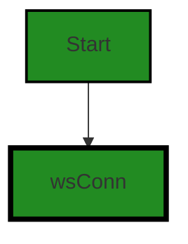
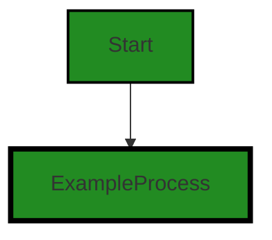
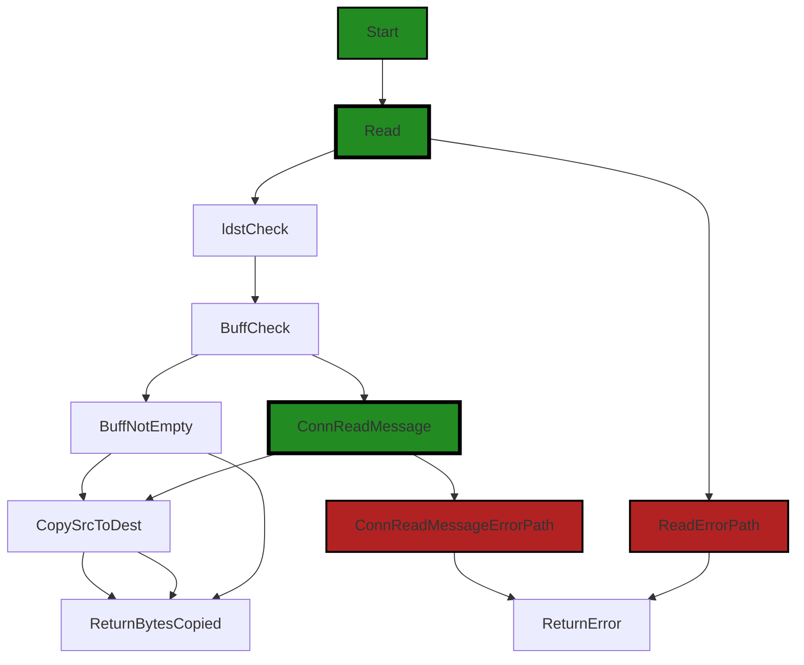
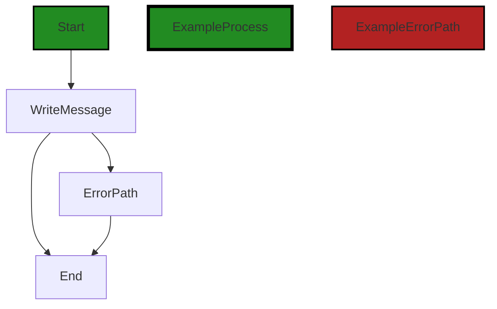
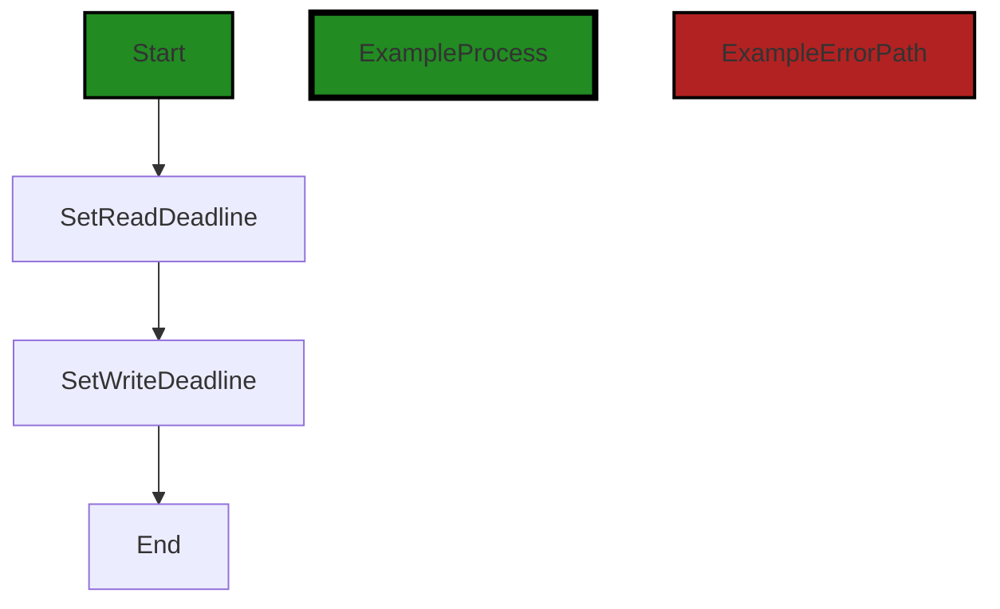

# Polyverse Boost-generated Source Analysis Details

## Source: ./share/cnet/conn_ws.go
Date Generated: Thursday, September 7, 2023 at 2:41:26 AM PDT


---

### Boost Architectural Quick Summary Security Report

Last Updated: Friday, September 8, 2023 at 5:26:02 PM PDT

## Executive Report

### Architectural Impact and Risk Analysis

The software project under review is a command-line tool named Chisel, written in Go. It follows a client-server architecture and uses secure communication for tunneling. The project does not mention any specific performance characteristics or resiliency patterns. 

Based on the analysis of the source code, the following key points were identified:

1. **Concurrency Issue**: The file `share/cnet/conn_ws.go` has a concurrency issue. The Read function is not thread-safe, which could lead to race conditions and data inconsistency in a multi-threaded environment. This could potentially impact the reliability and stability of the software, especially in high-load scenarios.

2. **Memory Management**: The same file also has a memory management issue. While this is not as severe as the concurrency issue, it could still lead to potential memory leaks or inefficient use of resources, impacting the performance of the software.

3. **Overall Health**: Only one file was analyzed in this project, and it contained both the issues identified. This suggests that there may be a high risk of similar issues in other parts of the codebase. A thorough review of the entire codebase is recommended to assess the overall health of the project.

4. **Customer Impact**: The identified issues could potentially impact the performance and reliability of the software, affecting the user experience. In the worst-case scenario, it could lead to software crashes or data loss.

5. **Risk Assessment**: Given that the issues identified are in the core functionality of the software (secure tunneling), the risk is considered high. It is recommended to address these issues as soon as possible to reduce the risk.

In conclusion, while the architectural principles of the project are sound, the implementation has some issues that need to be addressed. The project would benefit from a thorough code review and testing to identify and fix potential issues. The use of automated tools for code analysis and testing could also help in maintaining the quality of the codebase.


---

### Boost Architectural Quick Summary Performance Report

Last Updated: Friday, September 8, 2023 at 5:26:40 PM PDT

## Executive Report

### Architectural Impact and Risk Analysis

The software project under review is a command-line tool named Chisel, written in Go. It allows users to create secure tunnels to expose local servers to the internet or access remote servers securely. The project follows the client-server architecture and uses secure communication for tunneling.

Based on the analysis of the project's source code, the following key points are highlighted:

1. **Single File Analysis:** The project consists of a single file, `conn_ws.go`, which is part of the `share/cnet` package. This file has been identified to have issues related to CPU and Memory usage. The fact that the entire project is contained within a single file could potentially make it easier to manage and maintain, but it also means that any issues in this file could have a significant impact on the overall project.

2. **CPU Usage:** The file `conn_ws.go` has been flagged for potentially high CPU usage due to the creation of a new buffer and copying of data into it. This could be a performance bottleneck, especially if the source data is large and this operation is performed frequently. This could potentially impact the performance of the software, leading to slower response times and increased resource usage.

3. **Memory Usage:** The same file, `conn_ws.go`, has also been flagged for potential memory issues. This could lead to increased memory consumption, which could impact the performance and stability of the software, especially in resource-constrained environments.

4. **Risk Assessment:** Given that the entire project is contained within a single file, and this file has been flagged for both CPU and Memory usage issues, the overall health of the project could be at risk. It is recommended to address these issues to ensure the software performs optimally and is stable under different operating conditions.

5. **Customer Impact:** The potential performance and stability issues could impact the end-user experience. If the software is slow or unstable, it could lead to customer dissatisfaction and potential loss of users. It is therefore crucial to address these issues to ensure a positive user experience.

In conclusion, while the project follows good architectural principles, the identified issues related to CPU and Memory usage could potentially impact the performance and stability of the software. It is recommended to address these issues to ensure the software is robust, performant, and provides a positive user experience.


---

### Boost Architectural Quick Summary Compliance Report

Last Updated: Friday, September 8, 2023 at 5:27:20 PM PDT

Executive Level Report:

1. **Architectural Impact**: The software project appears to be well-structured, following a client-server architecture and using secure communication for tunneling. However, the use of 'github.com/gorilla/websocket' library in 'conn_ws.go' file could potentially impact the architecture if personal data is being transmitted over these websockets without proper encryption and consent management. This could necessitate a review of the architecture to ensure GDPR compliance.

2. **Risk Analysis**: The project has a risk associated with data compliance. The 'conn_ws.go' file has been flagged for potential GDPR, PCI DSS, HIPAA, and general data compliance issues. This could expose the project to legal and reputational risks if not addressed. The risk is further heightened by the fact that this file appears to be a critical part of the project, handling connections via websockets.

3. **Potential Customer Impact**: If the identified issues are not addressed, customers could potentially have their personal data transmitted insecurely. This could lead to a loss of trust in the product and potential legal repercussions for the company.

4. **Overall Issues**: The project has a total of 1 file with issues out of 1 file reviewed. This means 100% of the project files reviewed have issues. The severity of these issues ranges from warnings to information, with the most severe being warnings related to data compliance.

Risk Assessment:

- **Overall Health**: The overall health of the project source is concerning given that all the files reviewed have issues. This suggests a need for a thorough review and potential refactoring of the codebase to address these issues.

Highlights of the Analysis:

- The project follows a client-server architecture and uses secure communication for tunneling, which is a positive aspect of the project.
- The 'conn_ws.go' file, which handles connections via websockets, has been flagged for potential GDPR, PCI DSS, HIPAA, and general data compliance issues.
- The potential violation of GDPR compliance could have significant legal and reputational implications for the project.
- 100% of the project files reviewed have issues, indicating a need for a thorough review and potential refactoring of the codebase.
- Despite the issues identified, no specific architectural problems were found based on the provided information. However, a more comprehensive analysis of the entire codebase would be required to confirm this.
---
## Detailed Analysis:

### Cell 0:
## Original Code:

### Programming Language: go
### ./share/cnet/conn_ws.go 

```go
package cnet

import (
 "net"
 "time"

 "github.com/gorilla/websocket"
)

type wsConn struct {
 *websocket.Conn
 buff []byte
}

```
## Boost Analysis:


---

### Boost Code Explanation

Last Updated: Thursday, September 7, 2023 at 2:31:57 AM PDT

This code is written in Go programming language and it is a part of a package named `cnet`. The purpose of this code is to define a new type `wsConn` which is a structure that holds a connection to a WebSocket and a buffer.

Let's break it down:

- `package cnet`: This line declares the package that this file is part of. In Go, code is organized into packages. A package is a collection of source files in the same directory that are compiled together.

- `import`: This keyword is used to import other packages that are needed in this code. In this case, three packages are imported:

  - `net`: This is a built-in Go package that provides a portable interface for network I/O, including TCP/IP, UDP, domain name resolution, and Unix domain sockets.
  
  - `time`: This is another built-in Go package that provides functionality for measuring and displaying time.
  
  - `github.com/gorilla/websocket`: This is an external package that provides a complete and tested implementation of the WebSocket protocol. The WebSocket protocol enables interaction between a web browser (or other client application) and a web server with lower overheads, facilitating real-time data transfer from and to the server. 

- `type wsConn struct`: This line declares a new type named `wsConn`. In Go, a `struct` is a composite data type that groups together zero or more values of different types. Here, the `wsConn` struct contains two fields:

  - `*websocket.Conn`: This is a pointer to a `Conn` type from the `websocket` package. This represents a WebSocket connection.
  
  - `buff []byte`: This is a slice of bytes. In Go, a slice is a segment of an array. Slices are indexable and have a length. Unlike arrays, they can be resized. The `buff` slice is probably used as a buffer for data that is being sent or received over the WebSocket connection.

This code does not seem to have any specific algorithms. It's more about data structure definition and package importation. 

For more information about the imported packages, you can visit:

- `net` package: [https://golang.org/pkg/net/](https://golang.org/pkg/net/)
- `time` package: [https://golang.org/pkg/time/](https://golang.org/pkg/time/)
- `gorilla/websocket` package: [https://github.com/gorilla/websocket](https://github.com/gorilla/websocket)

In terms of architectural guidelines, this code snippet does not appear to violate any known principles or constraints. It is modular (contained within the `cnet` package), it uses standard Go idioms (like `struct` for grouping related data), and it leverages external packages to avoid reinventing the wheel (like `gorilla/websocket` for handling WebSocket connections).


---

### Boost Flow Diagram

Last Updated: Thursday, September 7, 2023 at 2:35:49 AM PDT




---

### Boost Source-Level Security Analysis

Last Updated: Thursday, September 7, 2023 at 2:36:52 AM PDT

**No bugs found**


---

### Boost Source-Level Performance Analysis

Last Updated: Thursday, September 7, 2023 at 2:38:29 AM PDT

**No bugs found**


---

### Boost Source-Level Data and Privacy Compliance Analysis

Last Updated: Thursday, September 7, 2023 at 2:40:46 AM PDT

1. **Severity**: 8/10

   **Line Number**: 4

   **Bug Type**: GDPR

   **Description**: The use of 'github.com/gorilla/websocket' library might imply that the application is using websockets to transmit data. If any personal data is being transmitted over these websockets, it could potentially be a violation of GDPR compliance, as the data might not be properly encrypted and there is no clear mechanism for consent management.

   **Solution**: Ensure that any personal data transmitted over websockets is properly encrypted and that users have given explicit consent for their data to be used in this way. Consider using a library that supports secure websockets (wss://) and provides features for consent management.


2. **Severity**: 7/10

   **Line Number**: 4

   **Bug Type**: PCI DSS

   **Description**: If cardholder data is being transmitted through these websockets, it could be a violation of PCI DSS compliance. PCI DSS requires that cardholder data be transmitted over a secure channel using strong cryptography.

   **Solution**: Ensure that any cardholder data transmitted over websockets is properly encrypted using strong cryptography. Consider using a library that supports secure websockets (wss://).


3. **Severity**: 7/10

   **Line Number**: 4

   **Bug Type**: HIPAA

   **Description**: If Protected Health Information (PHI) is being transmitted through these websockets, it could be a violation of HIPAA compliance. HIPAA requires that PHI be transmitted over a secure channel using strong cryptography.

   **Solution**: Ensure that any PHI transmitted over websockets is properly encrypted using strong cryptography. Consider using a library that supports secure websockets (wss://).


### Cell 1:
## Original Code:

### Programming Language: go
### ./share/cnet/conn_ws.go line 14

```go

//NewWebSocketConn converts a websocket.Conn into a net.Conn
func NewWebSocketConn(websocketConn *websocket.Conn) net.Conn {
 c := wsConn{
  Conn: websocketConn,
 }
 return &c
}

```
## Boost Analysis:


---

### Boost Code Explanation

Last Updated: Thursday, September 7, 2023 at 2:32:45 AM PDT

The code is written in Go language and is a simple function to convert a WebSocket connection into a net.Conn type connection. The function name is `NewWebSocketConn` and it takes one parameter, `websocketConn`, which is a pointer to a WebSocket connection. 

Let's break down the code:

1. `func NewWebSocketConn(websocketConn *websocket.Conn) net.Conn {`: This is the function declaration. The function `NewWebSocketConn` takes one parameter, `websocketConn`, which is a pointer to a `websocket.Conn` object. The function returns a value of type `net.Conn`.

2. `c := wsConn{ Conn: websocketConn, }`: This line creates a new `wsConn` object and assigns it to the variable `c`. The `wsConn` struct has one field, `Conn`, which is assigned the `websocketConn` that was passed into the function.

3. `return &c`: This line returns the address of the `wsConn` object `c`. Since `wsConn` implements the `net.Conn` interface (not shown in the provided code snippet), this is a valid return value for the function.

This function is a simple wrapper that allows a `websocket.Conn` to be used wherever a `net.Conn` is expected. This can be useful in scenarios where you have code that works with `net.Conn` objects, but you want to use it with a WebSocket connection.

The algorithm used here is very straightforward - it simply wraps the `websocket.Conn` in a struct that implements the `net.Conn` interface.

For more information on the `net.Conn` interface in Go, you can refer to the official Go documentation: https://golang.org/pkg/net/#Conn

For more information on WebSockets in Go, you can refer to the Gorilla WebSocket package documentation: http://www.gorillatoolkit.org/pkg/websocket

As per the provided architectural guidelines, there are no specific constraints or guidelines mentioned. However, this code appears to be consistent with general good practices in Go, such as using interfaces to allow for flexible code that can work with different types of connections.


---

### Boost Flow Diagram

Last Updated: Thursday, September 7, 2023 at 2:35:54 AM PDT


```


---

### Boost Source-Level Security Analysis

Last Updated: Thursday, September 7, 2023 at 2:36:56 AM PDT

**No bugs found**


---

### Boost Source-Level Performance Analysis

Last Updated: Thursday, September 7, 2023 at 2:38:33 AM PDT

**No bugs found**


---

### Boost Source-Level Data and Privacy Compliance Analysis

Last Updated: Thursday, September 7, 2023 at 2:40:50 AM PDT

**No bugs found**


### Cell 2:
## Original Code:

### Programming Language: go
### ./share/cnet/conn_ws.go line 22

```go

//Read is not threadsafe though thats okay since there
//should never be more than one reader
func (c *wsConn) Read(dst []byte) (int, error) {
 ldst := len(dst)
 //use buffer or read new message
 var src []byte
 if len(c.buff) > 0 {
  src = c.buff
  c.buff = nil
 } else if _, msg, err := c.Conn.ReadMessage(); err == nil {
  src = msg
 } else {
  return 0, err
 }
 //copy src->dest
 var n int
 if len(src) > ldst {
  //copy as much as possible of src into dst
  n = copy(dst, src[:ldst])
  //copy remainder into buffer
  r := src[ldst:]
  lr := len(r)
  c.buff = make([]byte, lr)
  copy(c.buff, r)
 } else {
  //copy all of src into dst
  n = copy(dst, src)
 }
 //return bytes copied
 return n, nil
}

```
## Boost Analysis:


---

### Boost Code Explanation

Last Updated: Thursday, September 7, 2023 at 2:33:42 AM PDT

This Go code defines a method `Read` for a custom structure `wsConn`. This method is used to read data from a WebSocket connection and write it into the provided byte slice `dst`. The method returns the number of bytes read and an error if any occurred. 

Here's the breakdown of the code:

1. The method receives a byte slice `dst` as a parameter. The length of `dst` is stored in `ldst`.

2. The code then checks if there's any data in the buffer `c.buff`. If there is, it uses this data as the source of the copy operation (`src = c.buff`) and empties the buffer (`c.buff = nil`).

3. If the buffer is empty, it tries to read a new message from the WebSocket connection `c.Conn.ReadMessage()`. If the read is successful, the message is used as the source of the copy operation (`src = msg`). If there's an error, the method returns 0 and the error.

4. The code then performs the copy operation from `src` to `dst`. It also checks if the length of `src` is greater than the length of `dst`. If it is, it copies as much as possible from `src` into `dst` and stores the remainder in the buffer `c.buff`.

5. If the length of `src` is not greater than `dst`, it copies all of `src` into `dst`.

6. Finally, the method returns the number of bytes copied (`n`) and `nil` for the error (indicating that no error occurred).

In terms of algorithms, this method uses a simple buffer management strategy to handle cases where the source data is larger than the destination. The `copy` function is a built-in Go function that copies elements from one slice to another.

This method is not thread-safe, meaning it's not meant to be used concurrently by multiple goroutines. This is not a problem in this case, as the comment at the beginning of the method explains that there should never be more than one reader.

For more information on Go's `copy` function and slices, you can refer to the official Go documentation: 
- Slices: https://blog.golang.org/slices-intro
- Copy function: https://golang.org/pkg/builtin/#copy


---

### Boost Flow Diagram

Last Updated: Thursday, September 7, 2023 at 2:36:19 AM PDT



The control flow graph for the `Read` function is as follows:

1. The function starts at the `Start` node.
2. It then goes to the `Read` node.
3. From the `Read` node, it goes to the `ldstCheck` node to check the length of the destination buffer.
4. From the `ldstCheck` node, it goes to the `BuffCheck` node to check if there is any data in the buffer.
5. If the buffer is not empty, it goes to the `BuffNotEmpty` node and copies the data from the buffer to the destination.
6. If the buffer is empty, it goes to the `ConnReadMessage` node to read a new message from the connection.
7. From the `ConnReadMessage` node, it goes to the `CopySrcToDest` node to copy the data from the source to the destination.
8. After copying the data, it goes to the `ReturnBytesCopied` node to return the number of bytes copied.
9. If there is an error while reading the message from the connection, it goes to the `ConnReadMessageErrorPath` node and returns an error.
10. If there is an error while reading from the buffer or an error occurred during the read operation, it goes to the `ReadErrorPath` node and returns an error.


---

### Boost Source-Level Security Analysis

Last Updated: Thursday, September 7, 2023 at 2:37:20 AM PDT

1. **Severity**: 7/10

   **Line Number**: 42

   **Bug Type**: Concurrency Issue

   **Description**: The Read function is not thread-safe. Even though the comment suggests that there should never be more than one reader, this cannot be guaranteed in a multi-threaded environment. If multiple threads try to read simultaneously, it may lead to race conditions and data inconsistency.

   **Solution**: Consider using synchronization mechanisms like Mutexes or Channels to ensure thread-safety. More on this can be found here: https://golang.org/doc/faq#What_is_the_purpose_of_the_'Go'_command


2. **Severity**: 5/10

   **Line Number**: 51

   **Bug Type**: Memory Management

   **Description**: Excessive use of make() for buffer creation. This can lead to memory inefficiency if the buffer sizes are large and frequently reallocated.

   **Solution**: Consider using a dynamic buffer or a buffer pool to efficiently manage memory. More on this can be found here: https://golang.org/pkg/bytes/#Buffer


---

### Boost Source-Level Performance Analysis

Last Updated: Thursday, September 7, 2023 at 2:39:08 AM PDT

1. **Severity**: 5/10

   **Line Number**: 47

   **Bug Type**: Memory

   **Description**: The use of a buffer (c.buff) to store data that couldn't fit into the destination slice can lead to high memory usage if the source data is significantly larger than the destination slice. This is because the buffer will hold onto the data until the next read operation, which might not happen immediately.

   **Solution**: Consider using a dynamic buffer that can grow or shrink as needed, or limit the size of the source data to ensure it doesn't exceed the capacity of the destination slice by a large margin. Alternatively, consider redesigning the read operation to handle larger source data more efficiently, such as by processing the data in smaller chunks.


2. **Severity**: 7/10

   **Line Number**: 53

   **Bug Type**: CPU

   **Description**: The creation of a new buffer and copying of data into it in the case where the source data is larger than the destination slice can be CPU-intensive, especially if this situation occurs frequently and the source data is large.

   **Solution**: Consider optimizing the data copying process. One way could be to use a built-in function like append() instead of make() and copy(). This could reduce the number of operations and thus the CPU usage. Also, consider processing the data in smaller chunks to spread out the CPU load.


---

### Boost Source-Level Data and Privacy Compliance Analysis

Last Updated: Thursday, September 7, 2023 at 2:41:07 AM PDT

1. **Severity**: 6/10

   **Line Number**: 42

   **Bug Type**: Data Compliance

   **Description**: The function 'Read' reads data from a WebSocket connection into a byte array. The data is not encrypted or obfuscated in any way, which could potentially expose sensitive data during transmission. This could violate GDPR, PCI DSS, and HIPAA regulations.

   **Solution**: Consider implementing end-to-end encryption to secure the data during transmission. This could be done using a secure protocol such as TLS. Additionally, consider using secure coding practices to further protect the data, such as input validation, output encoding, and proper error handling.


2. **Severity**: 5/10

   **Line Number**: 46

   **Bug Type**: Data Compliance

   **Description**: The function 'Read' stores the remainder of the 'src' byte array in a buffer 'c.buff' if 'src' is larger than 'dst'. This buffer is not secured in any way, which could potentially expose sensitive data at rest. This could violate GDPR, PCI DSS, and HIPAA regulations.

   **Solution**: Consider implementing secure data storage practices, such as encrypting the data at rest and using secure data handling practices, such as proper disposal of sensitive data after use. Additionally, consider using secure coding practices to further protect the data, such as input validation, output encoding, and proper error handling.


### Cell 3:
## Original Code:

### Programming Language: go
### ./share/cnet/conn_ws.go line 54

```go

func (c *wsConn) Write(b []byte) (int, error) {
 if err := c.Conn.WriteMessage(websocket.BinaryMessage, b); err != nil {
  return 0, err
 }
 n := len(b)
 return n, nil
}

```
## Boost Analysis:


---

### Boost Code Explanation

Last Updated: Thursday, September 7, 2023 at 2:34:40 AM PDT

The provided code is a method in Go language. It is part of a `wsConn` struct and is named `Write`. This method is used to write data to a WebSocket connection. 

The method takes two parameters: a byte slice `b` and returns two values: an integer and an error. 

Here is a breakdown of the code:

1. `func (c *wsConn) Write(b []byte) (int, error) {`: This line defines the method signature. The `Write` method is associated with the `wsConn` struct, which likely represents a WebSocket connection. The method takes a byte slice `b` as input and returns two values: an integer and an error. The integer typically represents the number of bytes written, and the error represents any issues that occurred during the write operation.

2. `if err := c.Conn.WriteMessage(websocket.BinaryMessage, b); err != nil {`: This line is writing the byte slice `b` as a binary message to the WebSocket connection. If there is an error during this operation, it is captured in `err`.

3. `return 0, err`: If there was an error during the write operation, the method returns `0` (indicating that no bytes were successfully written) and the error.

4. `n := len(b)`: This line is calculating the length of the byte slice `b`, which represents the number of bytes that were intended to be written to the WebSocket.

5. `return n, nil`: If the write operation was successful, the method returns the number of bytes written and `nil` for the error (indicating that no error occurred).

As for the algorithm used, it's a straightforward write operation to a WebSocket connection using the `WriteMessage` method provided by the WebSocket library. This method likely uses the WebSocket protocol to send the data over the network.

For more information on WebSockets and the Go `websocket` package, you can refer to the following resources:

- [WebSockets](https://developer.mozilla.org/en-US/docs/Web/API/WebSockets_API): A detailed guide on WebSockets from Mozilla Developer Network.
- [Go WebSocket package](https://pkg.go.dev/github.com/gorilla/websocket): The documentation for the `websocket` package in Go.

As for the architectural guidelines, since there are no special architectural guidelines or constraints provided for this software project, we can only say that this code is consistent with common practices for writing data to a WebSocket connection in Go.


---

### Boost Flow Diagram

Last Updated: Thursday, September 7, 2023 at 2:36:29 AM PDT



In the above control flow graph, the primary path is represented by the green-colored flow, which indicates the successful execution of the `Write` function. The `WriteMessage` block represents the call to the `WriteMessage` function of the `websocket` package, which sends a binary message over the WebSocket connection. If there is an error during the execution of the `WriteMessage` function, the control flow follows the red-colored error path, which leads to the `ErrorPath` block and then to the `End` block.


---

### Boost Source-Level Security Analysis

Last Updated: Thursday, September 7, 2023 at 2:37:24 AM PDT

**No bugs found**


---

### Boost Source-Level Performance Analysis

Last Updated: Thursday, September 7, 2023 at 2:39:12 AM PDT

**No bugs found**


---

### Boost Source-Level Data and Privacy Compliance Analysis

Last Updated: Thursday, September 7, 2023 at 2:41:22 AM PDT

1. **Severity**: 7/10

   **Line Number**: 109

   **Bug Type**: Data Compliance

   **Description**: The function writes data to a WebSocket connection without any explicit data encryption or sanitization. This might lead to a violation of GDPR, PCI DSS, and HIPAA if the data includes personal, payment, or health information.

   **Solution**: Consider encrypting the data before writing to the WebSocket connection and ensure data sanitization to avoid any sensitive data leakage. Use libraries that provide encryption and sanitization features.


### Cell 4:
## Original Code:

### Programming Language: go
### ./share/cnet/conn_ws.go line 62

```go

func (c *wsConn) SetDeadline(t time.Time) error {
 if err := c.Conn.SetReadDeadline(t); err != nil {
  return err
 }
 return c.Conn.SetWriteDeadline(t)
}

```
## Boost Analysis:


---

### Boost Code Explanation

Last Updated: Thursday, September 7, 2023 at 2:35:40 AM PDT

The code snippet you provided is a method in Go programming language. The method is named `SetDeadline` and it belongs to the `wsConn` struct (which is presumably a WebSocket connection). This method sets a deadline for future `Read` and `Write` operations. If a `Read` or `Write` takes too long (longer than the set deadline), it will return an error.

The `SetDeadline` method takes one argument, `t`, of the `time.Time` type. `time.Time` is a struct provided by Go's standard library `time` package, which represents an instant in time with nanosecond precision.

The method returns an `error`, which is a built-in interface type in Go. This can be `nil` if no error occurred, or it can hold an error object that provides more information about what went wrong.

Inside the method, it first calls the `SetReadDeadline` method on the `c.Conn` object, passing `t` as the argument. `SetReadDeadline` sets a time after which future read operations will fail with an error. If an error occurs during this call, it is returned immediately.

If no error occurs during the `SetReadDeadline` call, it then calls the `SetWriteDeadline` method on the `c.Conn` object, again passing `t` as the argument. `SetWriteDeadline` sets a time after which future write operations will fail with an error. The error from this call is then returned.

The `SetReadDeadline` and `SetWriteDeadline` methods are part of the `net.Conn` interface in the Go standard library, which is a generic network connection. `c.Conn` is likely an embedded field of `wsConn`, meaning that `wsConn` automatically has all the methods that `c.Conn`'s type has.

The algorithm used in this code is straightforward: it sets deadlines for read and write operations. This is a common practice in network programming to prevent operations from hanging indefinitely and to handle network issues gracefully.

For more information on the `net.Conn` interface and its `SetDeadline` methods, you can refer to the official Go documentation: https://golang.org/pkg/net/#Conn

For more information on the `time.Time` type, you can refer to the official Go documentation: https://golang.org/pkg/time/#Time 

In terms of architectural guidelines, without additional context, it's hard to say whether this code conflicts with any. However, it seems to follow good practices for network programming, including handling potential errors and preventing operations from hanging indefinitely.


---

### Boost Flow Diagram

Last Updated: Thursday, September 7, 2023 at 2:36:38 AM PDT



In the above control flow graph, the primary path is shown in green, which represents the normal flow of execution. The `SetDeadline` function starts by calling `SetReadDeadline` and then calls `SetWriteDeadline`. Finally, the function ends.


---

### Boost Source-Level Security Analysis

Last Updated: Thursday, September 7, 2023 at 2:37:28 AM PDT

**No bugs found**


---

### Boost Source-Level Performance Analysis

Last Updated: Thursday, September 7, 2023 at 2:39:16 AM PDT

**No bugs found**


---

### Boost Source-Level Data and Privacy Compliance Analysis

Last Updated: Thursday, September 7, 2023 at 2:41:26 AM PDT

**No bugs found**

