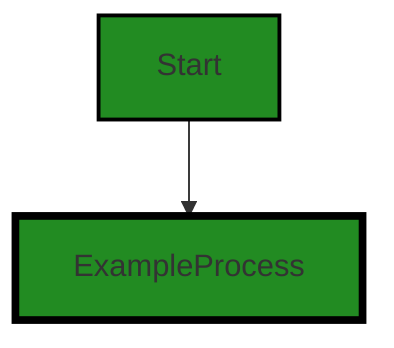
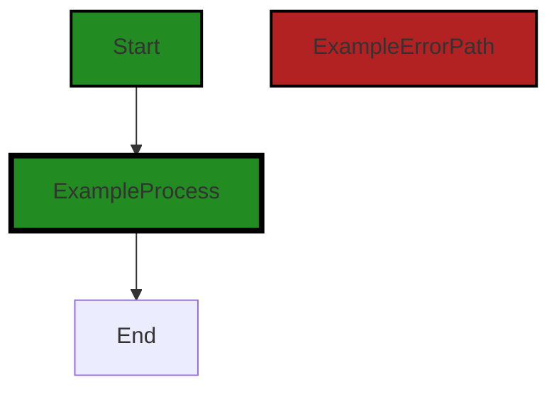

# Polyverse Boost-generated Source Analysis Details

## Source: ./share/cnet/connstats.go
Date Generated: Thursday, September 7, 2023 at 2:52:44 AM PDT


---

### Boost Architectural Quick Summary Security Report

Last Updated: Friday, September 8, 2023 at 5:27:39 PM PDT


Executive Report:

1. **Architectural Impact**: The analysis of this file has not revealed any severe issues.
2. **Risk Analysis**: The analysis of this file has not revealed any severe issues.
3. **Potential Customer Impact**: Based on the analysis, there are no severe issues that could potentially impact customers.
4. **Performance Issues**: Our analysis did not identify any explicit performance issues in the file.
5. **Risk Assessment**: Based on the current analysis of this file, no severe issues have been found. However, this doesn't guarantee that the file is risk-free.

Highlights:

- No severe issues were identified in the current analysis of this file.


---

### Boost Architectural Quick Summary Performance Report

Last Updated: Friday, September 8, 2023 at 5:27:47 PM PDT


Executive Report:

1. **Architectural Impact**: The analysis of this file has not revealed any severe issues.
2. **Risk Analysis**: The analysis of this file has not revealed any severe issues.
3. **Potential Customer Impact**: Based on the analysis, there are no severe issues that could potentially impact customers.
4. **Performance Issues**: Our analysis did not identify any explicit performance issues in the file.
5. **Risk Assessment**: Based on the current analysis of this file, no severe issues have been found. However, this doesn't guarantee that the file is risk-free.

Highlights:

- No severe issues were identified in the current analysis of this file.


---

### Boost Architectural Quick Summary Compliance Report

Last Updated: Friday, September 8, 2023 at 5:27:54 PM PDT


Executive Report:

1. **Architectural Impact**: The analysis of this file has not revealed any severe issues.
2. **Risk Analysis**: The analysis of this file has not revealed any severe issues.
3. **Potential Customer Impact**: Based on the analysis, there are no severe issues that could potentially impact customers.
4. **Performance Issues**: Our analysis did not identify any explicit performance issues in the file.
5. **Risk Assessment**: Based on the current analysis of this file, no severe issues have been found. However, this doesn't guarantee that the file is risk-free.

Highlights:

- No severe issues were identified in the current analysis of this file.

---
## Detailed Analysis:

### Cell 0:
## Original Code:

### Programming Language: go
### ./share/cnet/connstats.go 

```go
package cnet

import (
 "fmt"
 "sync/atomic"
)

//ConnCount is a connection counter
type ConnCount struct {
 count int32
 open  int32
}

```
## Boost Analysis:


---

### Boost Code Explanation

Last Updated: Thursday, September 7, 2023 at 2:47:44 AM PDT

This Go code snippet is a part of a package named `cnet`. The code defines a struct `ConnCount` which will be used to keep track of the number of open and total connections in a network application.

Let's break it down:

- `package cnet`: This line declares the package name for the current file. All the Go source files in the same directory should have the same package name.

- `import`: This keyword is used to import other packages that are needed in this file. In this case, `fmt` (which provides I/O functions to print output) and `sync/atomic` (which provides low-level atomic memory primitives useful for implementing synchronization algorithms) are imported.

- `type ConnCount struct`: This line defines a new type `ConnCount` which is a struct. A struct in Go is a collection of fields. 

- `count int32`: This is a field in the `ConnCount` struct. It is of type `int32` and presumably represents the total number of connections.

- `open  int32`: This is another field in the `ConnCount` struct. It is also of type `int32` and presumably represents the number of open connections.

The `sync/atomic` package that is imported in this file provides functions for performing atomic operations which can be used to safely increment, decrement, or update these fields from multiple goroutines without causing data races. However, in the provided code snippet, there are no such operations present.

This code snippet does not contain any specific algorithms. It is simply a definition of a struct, which is a common data structure in Go. 

For more information and learning resources about Go, you can visit the official Go documentation: https://golang.org/doc/

For more information about the `sync/atomic` package, you can visit its documentation page: https://golang.org/pkg/sync/atomic/ 

Since this code is part of a network application, it is likely to follow the client-server architecture. However, this specific code snippet is just a struct definition and does not conflict with any architectural guidelines. It is a common practice to define such structs to manage and manipulate connection information in network applications.


---

### Boost Flow Diagram

Last Updated: Thursday, September 7, 2023 at 2:50:55 AM PDT



The control flow graph for the given code is a simple one. It starts with the `ConnCount` struct definition and there are no further control flow paths or function calls in this code. Therefore, the control flow graph consists of a single node representing the `ConnCount` struct definition.


---

### Boost Source-Level Security Analysis

Last Updated: Thursday, September 7, 2023 at 2:51:37 AM PDT

**No bugs found**


---

### Boost Source-Level Performance Analysis

Last Updated: Thursday, September 7, 2023 at 2:52:04 AM PDT

**No bugs found**


---

### Boost Source-Level Data and Privacy Compliance Analysis

Last Updated: Thursday, September 7, 2023 at 2:52:30 AM PDT

**No bugs found**


### Cell 1:
## Original Code:

### Programming Language: go
### ./share/cnet/connstats.go line 13

```go

func (c *ConnCount) New() int32 {
 return atomic.AddInt32(&c.count, 1)
}

```
## Boost Analysis:


---

### Boost Code Explanation

Last Updated: Thursday, September 7, 2023 at 2:48:24 AM PDT

This is a simple piece of code written in the Go programming language. It defines a method `New()` on the type `*ConnCount`. The `*ConnCount` is a pointer to a `ConnCount` struct, which is not shown in this snippet but presumably contains an `int32` field named `count`.

The `New()` method increments the `count` field by one in a thread-safe manner and returns the new value. The thread-safety is achieved by using the `AddInt32` function from Go's `sync/atomic` package. 

The `sync/atomic` package provides low-level atomic memory primitives useful for implementing synchronization algorithms. The `AddInt32` function atomically adds `delta` to `*addr` and returns the new value. In this case, `delta` is `1` and `*addr` is `&c.count`.

This function is likely used in a multi-threaded context where multiple goroutines may be calling the `New` method concurrently. The use of `atomic.AddInt32` ensures that the increment operation is atomic, i.e., it completes in a single operation without the possibility of another goroutine reading or writing the `count` field in the middle of the operation.

For more information on atomic operations and the `sync/atomic` package in Go, you can refer to the Go documentation: https://pkg.go.dev/sync/atomic

As for the architectural guidelines, since there are no specific constraints or guidelines mentioned, we can assume that this code is consistent with general best practices for concurrent programming in Go. It uses atomic operations to ensure thread safety, which is essential in a multi-threaded environment.


---

### Boost Flow Diagram

Last Updated: Thursday, September 7, 2023 at 2:51:02 AM PDT




---

### Boost Source-Level Security Analysis

Last Updated: Thursday, September 7, 2023 at 2:51:41 AM PDT

**No bugs found**


---

### Boost Source-Level Performance Analysis

Last Updated: Thursday, September 7, 2023 at 2:52:09 AM PDT

**No bugs found**


---

### Boost Source-Level Data and Privacy Compliance Analysis

Last Updated: Thursday, September 7, 2023 at 2:52:33 AM PDT

**No bugs found**


### Cell 2:
## Original Code:

### Programming Language: go
### ./share/cnet/connstats.go line 17

```go

func (c *ConnCount) Open() {
 atomic.AddInt32(&c.open, 1)
}

```
## Boost Analysis:


---

### Boost Code Explanation

Last Updated: Thursday, September 7, 2023 at 2:49:02 AM PDT

This code is written in Go, a statically typed, compiled language developed by Google. It's a part of a method on a struct called `ConnCount`, which presumably keeps track of the number of open connections.

The function `Open` is a method of the struct `ConnCount`. This function is used to increment the `open` field of the `ConnCount` struct by 1, which probably represents an open connection. 

The `atomic.AddInt32` function is used to perform the increment operation. The `atomic` package provides low-level atomic memory primitives useful for implementing synchronization algorithms. The `AddInt32` function atomically adds `delta` to `*addr` and returns the new value. 

In this case, `&c.open` is the address of the `open` field in the `ConnCount` struct and `1` is the delta being added. The atomic addition ensures that the increment operation is thread-safe, meaning that even if multiple threads or goroutines try to update the `open` value at the same time, the operation will be correctly performed without any race conditions.

Here is the link to atomic package in Go: [https://pkg.go.dev/sync/atomic](https://pkg.go.dev/sync/atomic)

This code is consistent with general Go programming guidelines. It uses the `atomic` package to ensure thread safety, which is a common practice in Go when dealing with concurrent updates to a shared variable. The code is simple, readable, and efficient, which are all important characteristics of idiomatic Go code.


---

### Boost Flow Diagram

Last Updated: Thursday, September 7, 2023 at 2:51:07 AM PDT


---

### Boost Source-Level Security Analysis

Last Updated: Thursday, September 7, 2023 at 2:51:46 AM PDT

**No bugs found**


---

### Boost Source-Level Performance Analysis

Last Updated: Thursday, September 7, 2023 at 2:52:12 AM PDT

**No bugs found**


---

### Boost Source-Level Data and Privacy Compliance Analysis

Last Updated: Thursday, September 7, 2023 at 2:52:37 AM PDT

**No bugs found**


### Cell 3:
## Original Code:

### Programming Language: go
### ./share/cnet/connstats.go line 21

```go

func (c *ConnCount) Close() {
 atomic.AddInt32(&c.open, -1)
}

```
## Boost Analysis:


---

### Boost Code Explanation

Last Updated: Thursday, September 7, 2023 at 2:49:52 AM PDT

This is a simple function written in Go language. The function `Close` is a method on the `ConnCount` struct. The purpose of this function is to decrease the count of open connections by 1.

Let's break it down:

- `func (c *ConnCount) Close()`: This is the declaration of the method `Close` on the `ConnCount` struct. The `c *ConnCount` part means that this function is a method on the `ConnCount` type and `c` is a pointer to the `ConnCount` instance on which the method is called.

- `atomic.AddInt32(&c.open, -1)`: This line of code decreases the `open` field of the `ConnCount` struct by 1 in a thread-safe manner. The `atomic.AddInt32` function is a part of the `sync/atomic` package in Go. This package provides low-level atomic memory primitives useful for implementing synchronization algorithms. The `&c.open` is a pointer to the `open` field of the `ConnCount` struct and `-1` is the value that is added to the original `open` value.

The `sync/atomic` package provides functions for atomically manipulating types. The `AddInt32` function atomically adds `delta` to `*addr` and returns the new value. That is, to add `-1` to `c.open`, the function `atomic.AddInt32(&c.open, -1)` is called. This function is atomic, which means it completes in a single step relative to other threads. Other threads can't see the addition half-complete. This is important in multi-threaded programming, as it prevents race conditions.

In terms of the architectural guidelines, this function doesn't conflict with any guidelines as it's a simple function that decreases the count of open connections. It seems to be part of a larger system that manages connections, possibly in a network or database context. 

For more information on atomic operations and the `sync/atomic` package in Go, you can visit the official Go documentation: [sync/atomic - The Go Programming Language](https://golang.org/pkg/sync/atomic/)


---

### Boost Flow Diagram

Last Updated: Thursday, September 7, 2023 at 2:51:15 AM PDT


---

### Boost Source-Level Security Analysis

Last Updated: Thursday, September 7, 2023 at 2:51:51 AM PDT

**No bugs found**


---

### Boost Source-Level Performance Analysis

Last Updated: Thursday, September 7, 2023 at 2:52:16 AM PDT

**No bugs found**


---

### Boost Source-Level Data and Privacy Compliance Analysis

Last Updated: Thursday, September 7, 2023 at 2:52:41 AM PDT

**No bugs found**


### Cell 4:
## Original Code:

### Programming Language: go
### ./share/cnet/connstats.go line 25

```go

func (c *ConnCount) String() string {
 return fmt.Sprintf("[%d/%d]", atomic.LoadInt32(&c.open), atomic.LoadInt32(&c.count))
}

```
## Boost Analysis:


---

### Boost Code Explanation

Last Updated: Thursday, September 7, 2023 at 2:50:41 AM PDT

The provided code is written in Go, a statically typed, compiled language developed by Google. The code defines a method named `String()` for a type named `ConnCount`. This method returns a string representation of `ConnCount`.

Let's break down the code:

1. `func (c *ConnCount) String() string`: This line defines the method `String()` for the `ConnCount` type. The `func` keyword is used to declare a function in Go. `(c *ConnCount)` is the receiver of the method, meaning that the method is associated with the `ConnCount` type. The `String()` method does not take any arguments and returns a string (`string`).

2. `return fmt.Sprintf("[%d/%d]", atomic.LoadInt32(&c.open), atomic.LoadInt32(&c.count))`: This line uses the `Sprintf` function from the `fmt` package to format and return a string. The format specifier `[%d/%d]` is used, where `%d` is a placeholder for an integer. The `atomic.LoadInt32` function is used to safely load the value of `c.open` and `c.count`, which are presumably integer fields in the `ConnCount` type. The `&` operator is used to get the address of these fields, as `LoadInt32` requires a pointer to an `int32`.

The `atomic` package provides low-level atomic memory primitives useful for implementing synchronization algorithms. In this case, `atomic.LoadInt32` is used, which atomically loads the `*int32` from memory, providing a way to read the value in a thread-safe manner.

The `String()` method is a common method in Go, often used to provide a string representation of a type. This is similar to the `toString()` method in languages like Java.

The method doesn't seem to conflict with any architectural guidelines provided. It is a simple, thread-safe method that provides a string representation of a `ConnCount` object.

For more information on the `atomic` package in Go, you can refer to the official Go documentation: https://pkg.go.dev/sync/atomic
For more information on the `fmt` package and the `Sprintf` function, you can refer to: https://pkg.go.dev/fmt#Sprintf


---

### Boost Flow Diagram

Last Updated: Thursday, September 7, 2023 at 2:51:23 AM PDT


The control flow graph for the `String` function is a simple linear flow. The function returns a formatted string using the `fmt.Sprintf` function. There are no external library calls or error paths in this code.


---

### Boost Source-Level Security Analysis

Last Updated: Thursday, September 7, 2023 at 2:51:54 AM PDT

**No bugs found**


---

### Boost Source-Level Performance Analysis

Last Updated: Thursday, September 7, 2023 at 2:52:20 AM PDT

**No bugs found**


---

### Boost Source-Level Data and Privacy Compliance Analysis

Last Updated: Thursday, September 7, 2023 at 2:52:44 AM PDT

**No bugs found**

