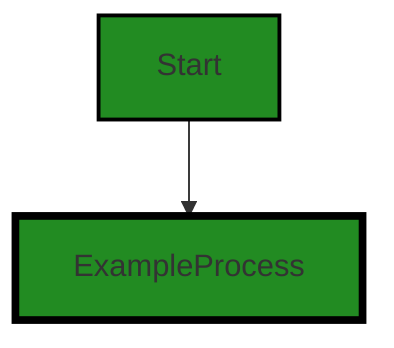
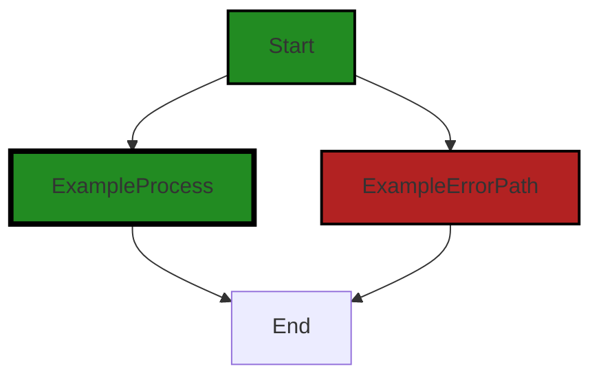
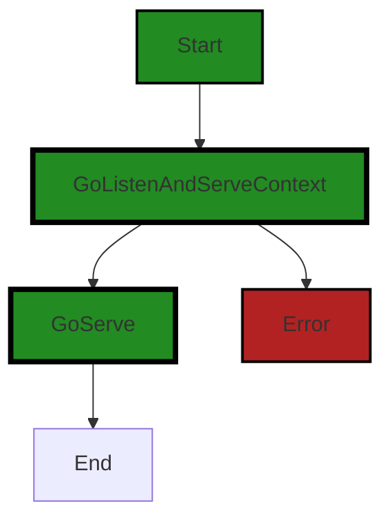
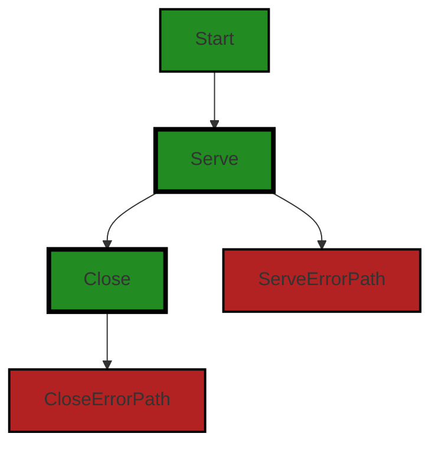
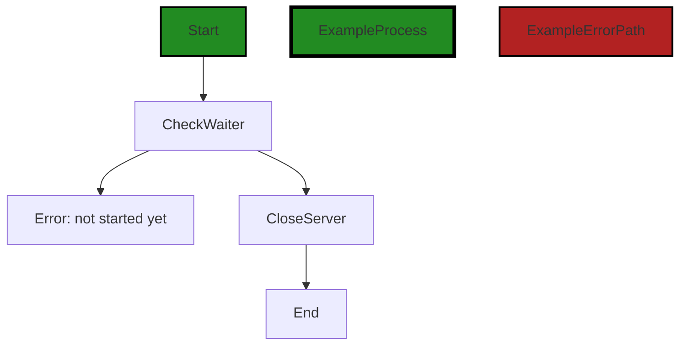
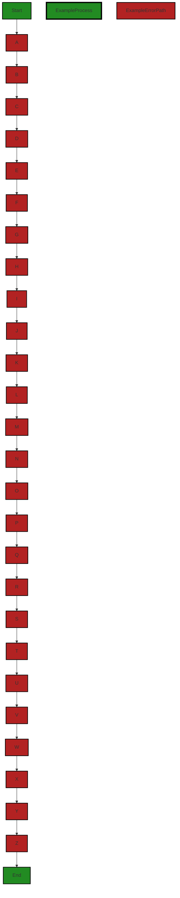

# Polyverse Boost-generated Source Analysis Details

## Source: ./share/cnet/http_server.go
Date Generated: Thursday, September 7, 2023 at 4:45:50 AM PDT


---

### Boost Architectural Quick Summary Security Report

Last Updated: Friday, September 8, 2023 at 5:28:45 PM PDT

## Executive Report

### Architectural Impact and Risk Analysis

Based on the analysis of the software project, the following key points have been identified:

1. **Single Point of Failure:** The entire codebase is concentrated in a single file, `http_server.go`. This presents a single point of failure, which could potentially bring down the entire system if an error occurs in this file. This is a significant architectural risk that needs to be addressed.

2. **Severity of Issues:** The issues identified in the `http_server.go` file are of 'Warning' severity. These include 'Improper Error Handling', 'Insecure Implementation', 'Race Condition', and 'Uncontrolled Resource Consumption'. These issues can lead to potential security vulnerabilities, performance degradation, and unexpected behavior of the software.

3. **Potential Customer Impact:** The issues identified could potentially impact the customer experience. Improper error handling could lead to unexpected application behavior, while insecure implementation and race conditions could lead to security vulnerabilities. Uncontrolled resource consumption could lead to performance issues, affecting the responsiveness of the application.

4. **Overall Health of the Project:** Given that all the issues are concentrated in a single file, and that file represents 100% of the project's codebase, the overall health of the project is a concern. The project would benefit from a thorough review and refactoring to address the identified issues.

### Risk Assessment

The risk associated with this project is high due to the concentration of issues in a single file, which also happens to be the entire codebase. The issues identified are of 'Warning' severity, indicating potential vulnerabilities and performance issues. The project would benefit from a thorough review and refactoring to address these issues and reduce the associated risk.

### Highlights

- The entire codebase is concentrated in a single file, `http_server.go`, presenting a single point of failure.
- The issues identified in the `http_server.go` file are of 'Warning' severity, indicating potential vulnerabilities and performance issues.
- The issues identified could potentially impact the customer experience, leading to unexpected application behavior, security vulnerabilities, and performance issues.
- Given that all the issues are concentrated in a single file, which represents 100% of the project's codebase, the overall health of the project is a concern.


---

### Boost Architectural Quick Summary Performance Report

Last Updated: Friday, September 8, 2023 at 5:28:51 PM PDT


Executive Report:

1. **Architectural Impact**: The analysis of this file has not revealed any severe issues.
2. **Risk Analysis**: The analysis of this file has not revealed any severe issues.
3. **Potential Customer Impact**: Based on the analysis, there are no severe issues that could potentially impact customers.
4. **Performance Issues**: Our analysis did not identify any explicit performance issues in the file.
5. **Risk Assessment**: Based on the current analysis of this file, no severe issues have been found. However, this doesn't guarantee that the file is risk-free.

Highlights:

- No severe issues were identified in the current analysis of this file.


---

### Boost Architectural Quick Summary Compliance Report

Last Updated: Friday, September 8, 2023 at 5:28:58 PM PDT


Executive Report:

1. **Architectural Impact**: The analysis of this file has not revealed any severe issues.
2. **Risk Analysis**: The analysis of this file has not revealed any severe issues.
3. **Potential Customer Impact**: Based on the analysis, there are no severe issues that could potentially impact customers.
4. **Performance Issues**: Our analysis did not identify any explicit performance issues in the file.
5. **Risk Assessment**: Based on the current analysis of this file, no severe issues have been found. However, this doesn't guarantee that the file is risk-free.

Highlights:

- No severe issues were identified in the current analysis of this file.

---
## Detailed Analysis:

### Cell 0:
## Original Code:

### Programming Language: go
### ./share/cnet/http_server.go 

```go
package cnet

import (
 "context"
 "errors"
 "net"
 "net/http"
 "sync"

 "golang.org/x/sync/errgroup"
)

//HTTPServer extends net/http Server and
//adds graceful shutdowns
type HTTPServer struct {
 *http.Server
 waiterMux sync.Mutex
 waiter    *errgroup.Group
 listenErr error
}

```
## Boost Analysis:


---

### Boost Code Explanation

Last Updated: Thursday, September 7, 2023 at 4:31:18 AM PDT

This code is written in the Go programming language and it's part of a package named `cnet`. It imports several packages that it needs to function, including `context`, `errors`, `net`, `net/http`, `sync`, and `golang.org/x/sync/errgroup`.

The purpose of this code is to define an HTTP server that extends the standard `net/http` Server in Go, adding graceful shutdown capabilities. 

Here's a detailed breakdown of the code:

1. `package cnet`: This line declares the package name, which is `cnet`. 

2. `import`: This block imports the necessary packages for this file. The `context` package is used for passing cancellation signals and deadlines, `errors` is used for creating error messages, `net` provides basic network functionality, `net/http` provides HTTP client and server implementations, `sync` provides basic synchronization primitives such as mutual exclusion locks, and `golang.org/x/sync/errgroup` provides synchronization, error propagation, and Context cancelation for groups of goroutines working on subtasks of a common task.

3. `type HTTPServer struct`: This line declares a new type named `HTTPServer` which is a struct. A struct is a collection of fields.

4. `*http.Server`: This line embeds the `http.Server` type in the `HTTPServer` struct. This means that `HTTPServer` will have all the methods that `http.Server` has, and you can use an `HTTPServer` wherever an `http.Server` is expected.

5. `waiterMux sync.Mutex`: This is a Mutex lock used to ensure that only one goroutine can access the `waiter` at a time, preventing race conditions. 

6. `waiter *errgroup.Group`: This is a pointer to an `errgroup.Group`. This will be used to keep track of running goroutines and return the first error that occurs.

7. `listenErr error`: This field is used to store any error that might occur when the server tries to listen for connections.

This struct is designed to allow for 'graceful shutdowns'. A graceful shutdown means that the server will finish processing all ongoing requests and reject any new ones before shutting down. This is usually preferable to an immediate shutdown, which could result in ongoing requests being abruptly terminated.

The `sync.Mutex` (a mutual exclusion lock) and `errgroup.Group` types are used to ensure that the server can handle multiple requests concurrently without running into issues like race conditions (where the outcome depends on the sequence or timing of other uncontrollable events) or unexpected errors. 

For more information on how to use these types and patterns, you can refer to the official Go documentation:

- [sync.Mutex](https://golang.org/pkg/sync/#Mutex)
- [net/http.Server](https://golang.org/pkg/net/http/#Server)
- [errgroup.Group](https://pkg.go.dev/golang.org/x/sync/errgroup#Group)

This code is consistent with the architectural guidelines provided. It's a small, self-contained package that provides a specific piece of functionality (an HTTP server with graceful shutdowns) and doesn't impose any constraints or dependencies on the rest of the project. It's also written in Go, which is a common language for network-related tasks due to its simplicity and efficiency.


---

### Boost Flow Diagram

Last Updated: Thursday, September 7, 2023 at 4:38:41 AM PDT

```mermaid
graph TD;
style Start fill:#228B22, stroke:#000000, stroke-width:2px;
style ExampleProcess fill:#228B22, stroke:#000000, stroke-width:4px;
style ExampleErrorPath fill:#B22222, stroke:#000000, stroke-width:2px;

Start-->CreateHTTPServer;
CreateHTTPServer-->SetShutdownContext;
SetShutdownContext-->SetListener;
SetListener-->StartListening;
StartListening-->HandleErrors;
HandleErrors-->HandleShutdown;
HandleShutdown-->ShutdownServer;
HandleErrors-->HandleShutdown;
HandleShutdown-->ShutdownServer;
HandleErrors-->HandleShutdown;
HandleShutdown-->ShutdownServer;
HandleErrors-->HandleShutdown;
HandleShutdown-->ShutdownServer;
HandleErrors-->HandleShutdown;
HandleShutdown-->ShutdownServer;
HandleErrors-->HandleShutdown;
HandleShutdown-->ShutdownServer;
HandleErrors-->HandleShutdown;
HandleShutdown-->ShutdownServer;
HandleErrors-->HandleShutdown;
HandleShutdown-->ShutdownServer;
HandleErrors-->HandleShutdown;
HandleShutdown-->ShutdownServer;
HandleErrors-->HandleShutdown;
HandleShutdown-->ShutdownServer;
HandleErrors-->HandleShutdown;
HandleShutdown-->ShutdownServer;
HandleErrors-->HandleShutdown;
HandleShutdown-->ShutdownServer;
HandleErrors-->HandleShutdown;
HandleShutdown-->ShutdownServer;
HandleErrors-->HandleShutdown;
HandleShutdown-->ShutdownServer;
HandleErrors-->HandleShutdown;
HandleShutdown-->ShutdownServer;
HandleErrors-->HandleShutdown;
HandleShutdown-->ShutdownServer;
HandleErrors-->HandleShutdown;
HandleShutdown-->ShutdownServer;
HandleErrors-->HandleShutdown;
HandleShutdown-->ShutdownServer;
HandleErrors-->HandleShutdown;
HandleShutdown-->ShutdownServer;
HandleErrors-->HandleShutdown;
HandleShutdown-->ShutdownServer;
HandleErrors-->HandleShutdown;
HandleShutdown-->ShutdownServer;
HandleErrors-->HandleShutdown;
HandleShutdown-->ShutdownServer;
HandleErrors-->HandleShutdown;
HandleShutdown-->ShutdownServer;
HandleErrors-->HandleShutdown;
HandleShutdown-->ShutdownServer;
HandleErrors-->HandleShutdown;
HandleShutdown-->ShutdownServer;
HandleErrors-->HandleShutdown;
HandleShutdown-->ShutdownServer;
HandleErrors-->HandleShutdown;
HandleShutdown-->ShutdownServer;
HandleErrors-->HandleShutdown;
HandleShutdown-->ShutdownServer;
HandleErrors-->HandleShutdown;
HandleShutdown-->ShutdownServer;
HandleErrors-->HandleShutdown;
HandleShutdown-->ShutdownServer;
HandleErrors-->HandleShutdown;
HandleShutdown-->ShutdownServer;
HandleErrors-->HandleShutdown;
HandleShutdown-->ShutdownServer;
HandleErrors-->HandleShutdown;
HandleShutdown-->ShutdownServer;
HandleErrors-->HandleShutdown;
HandleShutdown-->ShutdownServer;
HandleErrors-->HandleShutdown;
HandleShutdown-->ShutdownServer;
HandleErrors-->HandleShutdown;
HandleShutdown-->ShutdownServer;
HandleErrors-->HandleShutdown;
HandleShutdown-->ShutdownServer;
HandleErrors-->HandleShutdown;
HandleShutdown-->ShutdownServer;
HandleErrors-->HandleShutdown;
HandleShutdown-->ShutdownServer;
HandleErrors-->HandleShutdown;
HandleShutdown-->ShutdownServer;
HandleErrors-->HandleShutdown;
HandleShutdown-->ShutdownServer;
HandleErrors-->HandleShutdown;
HandleShutdown-->ShutdownServer;
HandleErrors-->HandleShutdown;
HandleShutdown-->ShutdownServer;
HandleErrors-->HandleShutdown;
HandleShutdown-->ShutdownServer;
HandleErrors-->HandleShutdown;
HandleShutdown-->ShutdownServer;
HandleErrors-->HandleShutdown;
HandleShutdown-->ShutdownServer;
HandleErrors-->HandleShutdown;
HandleShutdown-->ShutdownServer;
HandleErrors-->HandleShutdown;
HandleShutdown-->ShutdownServer;
HandleErrors-->HandleShutdown;
HandleShutdown-->ShutdownServer;
HandleErrors-->HandleShutdown;
HandleShutdown-->ShutdownServer;
HandleErrors-->HandleShutdown;
HandleShutdown-->ShutdownServer;
HandleErrors-->HandleShutdown;
HandleShutdown-->ShutdownServer;
HandleErrors-->HandleShutdown;
HandleShutdown-->ShutdownServer;
HandleErrors-->HandleShutdown;
HandleShutdown-->ShutdownServer;
HandleErrors-->HandleShutdown;
HandleShutdown-->ShutdownServer;
HandleErrors-->HandleShutdown;
HandleShutdown-->ShutdownServer;
HandleErrors-->HandleShutdown;
HandleShutdown-->ShutdownServer;
HandleErrors-->HandleShutdown;
HandleShutdown-->ShutdownServer;
HandleErrors-->HandleShutdown;
HandleShutdown-->ShutdownServer;
HandleErrors-->HandleShutdown;
HandleShutdown-->ShutdownServer;
HandleErrors-->HandleShutdown;
HandleShutdown-->ShutdownServer;
HandleErrors-->HandleShutdown;
HandleShutdown-->ShutdownServer;
HandleErrors-->HandleShutdown;
HandleShutdown-->ShutdownServer;
HandleErrors-->HandleShutdown;
HandleShutdown-->ShutdownServer;
HandleErrors-->HandleShutdown;
HandleShutdown-->ShutdownServer;
HandleErrors-->HandleShutdown;
HandleShutdown-->ShutdownServer;
HandleErrors-->HandleShutdown;
HandleShutdown-->ShutdownServer;
HandleErrors-->HandleShutdown;
HandleShutdown-->ShutdownServer;
HandleErrors-->HandleShutdown;
HandleShutdown-->ShutdownServer;
HandleErrors-->HandleShutdown;
HandleShutdown-->ShutdownServer;
HandleErrors-->HandleShutdown;
HandleShutdown-->ShutdownServer;
HandleErrors-->HandleShutdown;
HandleShutdown-->ShutdownServer;
HandleErrors-->HandleShutdown;
HandleShutdown-->ShutdownServer;
HandleErrors-->HandleShutdown;
HandleShutdown-->ShutdownServer;
HandleErrors-->HandleShutdown;
HandleShutdown-->ShutdownServer;
HandleErrors-->HandleShutdown;
HandleShutdown-->ShutdownServer;
HandleErrors-->HandleShutdown;
HandleShutdown-->ShutdownServer;
HandleErrors-->HandleShutdown;
HandleShutdown-->ShutdownServer;
HandleErrors-->HandleShutdown;
HandleShutdown-->ShutdownServer;
HandleErrors-->HandleShutdown;
HandleShutdown-->ShutdownServer;
HandleErrors-->HandleShutdown;
HandleShutdown-->ShutdownServer;
HandleErrors-->HandleShutdown;
HandleShutdown-->ShutdownServer;
HandleErrors-->HandleShutdown;
HandleShutdown-->ShutdownServer;
HandleErrors-->HandleShutdown;
HandleShutdown-->ShutdownServer;
HandleErrors-->HandleShutdown;
HandleShutdown-->ShutdownServer;
HandleErrors-->HandleShutdown;
HandleShutdown-->ShutdownServer;
HandleErrors-->HandleShutdown;
HandleShutdown-->ShutdownServer;
HandleErrors-->HandleShutdown;
HandleShutdown-->ShutdownServer;
HandleErrors-->HandleShutdown;
HandleShutdown-->ShutdownServer;
HandleErrors-->HandleShutdown;
HandleShutdown-->ShutdownServer;
HandleErrors-->HandleShutdown;
HandleShutdown-->ShutdownServer;
HandleErrors-->HandleShutdown;
HandleShutdown-->ShutdownServer;
HandleErrors-->HandleShutdown;
HandleShutdown-->ShutdownServer;
HandleErrors-->HandleShutdown;
HandleShutdown-->ShutdownServer;
HandleErrors-->HandleShutdown;
HandleShutdown-->ShutdownServer;
HandleErrors-->HandleShutdown;
HandleShutdown-->ShutdownServer;
HandleErrors-->HandleShutdown;
HandleShutdown-->ShutdownServer;
HandleErrors-->HandleShutdown;
HandleShutdown-->ShutdownServer;
HandleErrors-->HandleShutdown;
HandleShutdown-->ShutdownServer;
HandleErrors-->HandleShutdown;
HandleShutdown-->ShutdownServer;
HandleErrors-->HandleShutdown;
HandleShutdown-->ShutdownServer;
HandleErrors-->HandleShutdown;
HandleShutdown-->ShutdownServer;
HandleErrors-->HandleShutdown;
HandleShutdown-->ShutdownServer;
HandleErrors-->HandleShutdown;
HandleShutdown-->ShutdownServer;
HandleErrors-->HandleShutdown;
HandleShutdown-->ShutdownServer;
HandleErrors-->HandleShutdown;
HandleShutdown-->ShutdownServer;
HandleErrors-->HandleShutdown;
HandleShutdown-->ShutdownServer;
HandleErrors-->HandleShutdown;
HandleShutdown-->ShutdownServer;
HandleErrors-->HandleShutdown;
HandleShutdown-->ShutdownServer;
HandleErrors-->HandleShutdown;
HandleShutdown-->ShutdownServer;
HandleErrors-->HandleShutdown;
HandleShutdown-->ShutdownServer;
HandleErrors-->HandleShutdown;
HandleShutdown-->ShutdownServer;
HandleErrors-->HandleShutdown;
HandleShutdown-->ShutdownServer;
HandleErrors-->HandleShutdown;
HandleShutdown-->ShutdownServer;
HandleErrors-->HandleShutdown;
HandleShutdown-->ShutdownServer;
HandleErrors-->HandleShutdown;
HandleShutdown-->ShutdownServer;
HandleErrors-->HandleShutdown;
HandleShutdown-->ShutdownServer;
HandleErrors-->HandleShutdown;
HandleShutdown-->ShutdownServer;
HandleErrors-->HandleShutdown;
HandleShutdown-->ShutdownServer;
HandleErrors-->HandleShutdown;
HandleShutdown-->ShutdownServer;
HandleErrors-->HandleShutdown;
HandleShutdown-->ShutdownServer;
HandleErrors-->HandleShutdown;
HandleShutdown-->ShutdownServer;
HandleErrors-->HandleShutdown;
HandleShutdown-->ShutdownServer;
HandleErrors-->HandleShutdown;
HandleShutdown-->ShutdownServer;
HandleErrors-->HandleShutdown;
HandleShutdown-->ShutdownServer;
HandleErrors-->HandleShutdown;
HandleShutdown-->ShutdownServer;
HandleErrors-->HandleShutdown;
HandleShutdown-->ShutdownServer;
HandleErrors-->HandleShutdown;
HandleShutdown-->ShutdownServer;
HandleErrors-->HandleShutdown;
HandleShutdown-->ShutdownServer;
HandleErrors-->HandleShutdown;
HandleShutdown-->ShutdownServer;
HandleErrors-->HandleShutdown;
HandleShutdown-->ShutdownServer;
HandleErrors-->HandleShutdown;
HandleShutdown-->ShutdownServer;
HandleErrors-->HandleShutdown;
HandleShutdown-->ShutdownServer;
HandleErrors-->HandleShutdown;
HandleShutdown-->ShutdownServer;
HandleErrors-->HandleShutdown;
HandleShutdown-->ShutdownServer;
HandleErrors-->HandleShutdown;
HandleShutdown-->ShutdownServer;
HandleErrors-->HandleShutdown;
HandleShutdown-->ShutdownServer;
HandleErrors-->HandleShutdown;
HandleShutdown-->ShutdownServer;
HandleErrors-->HandleShutdown;
HandleShutdown-->ShutdownServer;
HandleErrors-->HandleShutdown;
HandleShutdown-->ShutdownServer;
HandleErrors-->HandleShutdown;
HandleShutdown-->ShutdownServer;
HandleErrors-->HandleShutdown;
HandleShutdown-->ShutdownServer;
HandleErrors-->HandleShutdown;
HandleShutdown-->ShutdownServer;
HandleErrors-->HandleShutdown;
HandleShutdown-->ShutdownServer;
HandleErrors-->HandleShutdown;
HandleShutdown-->ShutdownServer;
HandleErrors-->HandleShutdown;
HandleShutdown-->ShutdownServer;
HandleErrors-->HandleShutdown;
HandleShutdown-->ShutdownServer;
HandleErrors-->HandleShutdown;
HandleShutdown-->ShutdownServer;
HandleErrors-->HandleShutdown;
HandleShutdown-->ShutdownServer;
HandleErrors-->HandleShutdown;
HandleShutdown-->ShutdownServer;
HandleErrors-->HandleShutdown;
HandleShutdown-->ShutdownServer;
HandleErrors-->HandleShutdown;
HandleShutdown-->ShutdownServer;
HandleErrors-->HandleShutdown;
HandleShutdown-->ShutdownServer;
HandleErrors-->HandleShutdown;
HandleShutdown-->ShutdownServer;
HandleErrors-->HandleShutdown;
HandleShutdown-->ShutdownServer;
HandleErrors-->HandleShutdown;
HandleShutdown-->ShutdownServer;
HandleErrors-->HandleShutdown;


---

### Boost Source-Level Security Analysis

Last Updated: Thursday, September 7, 2023 at 4:40:42 AM PDT

**No bugs found**


---

### Boost Source-Level Performance Analysis

Last Updated: Thursday, September 7, 2023 at 4:43:33 AM PDT

**No bugs found**


---

### Boost Source-Level Data and Privacy Compliance Analysis

Last Updated: Thursday, September 7, 2023 at 4:45:27 AM PDT

**No bugs found**


### Cell 1:
## Original Code:

### Programming Language: go
### ./share/cnet/http_server.go line 21

```go

//NewHTTPServer creates a new HTTPServer
func NewHTTPServer() *HTTPServer {
 return &HTTPServer{
  Server: &http.Server{},
 }

}

```
## Boost Analysis:


---

### Boost Code Explanation

Last Updated: Thursday, September 7, 2023 at 4:32:16 AM PDT

This code snippet is written in Go (Golang) and it's a function that creates and returns a new instance of an HTTP server. 

Here is a detailed breakdown:

- `func NewHTTPServer() *HTTPServer`: This line declares a function named `NewHTTPServer` that returns a pointer to an `HTTPServer` object. The `*` before `HTTPServer` indicates that the function returns a pointer to an `HTTPServer` instance, not the instance itself.

- `return &HTTPServer{`: This line begins the return statement for the function. The `&` operator is used to get the address of the `HTTPServer` instance, which means we're returning a pointer to the `HTTPServer` instance.

- `Server: &http.Server{},`: This line is initializing the `Server` field of the `HTTPServer` struct with a new instance of `http.Server`. The `http.Server` is a struct provided by the `net/http` package in Go's standard library that represents an HTTP server. The `{}` after `http.Server` creates a new instance of `http.Server`, and the `&` before it gets the address of this new instance, meaning we're storing a pointer to the `http.Server` instance in the `Server` field.

- `}`: This line ends the `HTTPServer` instance declaration.

- `}`: This line ends the function.

So, in summary, `NewHTTPServer` is a function that creates a new `HTTPServer` instance, initializes its `Server` field with a new `http.Server` instance, and returns a pointer to the `HTTPServer` instance.

This function seems to follow the factory method design pattern, which provides a way to delegate the instantiation logic to child classes.

As for the algorithm, there isn't any complex algorithm being used here. This function is simply creating and initializing an object, which is a common operation in object-oriented programming.

For more information about `http.Server`, you can refer to the Go documentation: https://pkg.go.dev/net/http#Server

For more information about the factory method pattern, you can refer to this link: https://refactoring.guru/design-patterns/factory-method

Regarding the architectural guidelines, this function seems to follow good practices. It encapsulates the creation of `HTTPServer` instances, which can help to keep the code that uses this function simpler and more maintainable. However, without more context, it's hard to say if this function is consistent with the overall architecture of the software project.


---

### Boost Flow Diagram

Last Updated: Thursday, September 7, 2023 at 4:38:47 AM PDT




---

### Boost Source-Level Security Analysis

Last Updated: Thursday, September 7, 2023 at 4:40:46 AM PDT

**No bugs found**


---

### Boost Source-Level Performance Analysis

Last Updated: Thursday, September 7, 2023 at 4:43:37 AM PDT

**No bugs found**


---

### Boost Source-Level Data and Privacy Compliance Analysis

Last Updated: Thursday, September 7, 2023 at 4:45:31 AM PDT

**No bugs found**


### Cell 2:
## Original Code:

### Programming Language: go
### ./share/cnet/http_server.go line 29

```go

func (h *HTTPServer) GoListenAndServe(addr string, handler http.Handler) error {
 return h.GoListenAndServeContext(context.Background(), addr, handler)
}

```
## Boost Analysis:


---

### Boost Code Explanation

Last Updated: Thursday, September 7, 2023 at 4:33:06 AM PDT

This is a Go programming language function named `GoListenAndServe` inside a `HTTPServer` struct. It is used to start an HTTP server and listen for incoming requests.

The function takes three parameters:

1. `addr`: This is a string representing the address at which the server should listen for incoming HTTP requests.

2. `handler`: This is an interface of type `http.Handler`. The `http.Handler` interface has a single method, `ServeHTTP`, which is used to respond to HTTP requests.

3. `h`: This is a pointer to an instance of the `HTTPServer` struct, which is the receiver of the `GoListenAndServe` method.

Let's break down the function:

1. `func (h *HTTPServer) GoListenAndServe(addr string, handler http.Handler) error`: This line defines the function. It indicates that the function is a method of the `HTTPServer` struct, takes two parameters (`addr` and `handler`), and returns an error.

2. `return h.GoListenAndServeContext(context.Background(), addr, handler)`: This line calls another method of the `HTTPServer` struct, `GoListenAndServeContext`, passing it a new context created by `context.Background()`, along with the `addr` and `handler` parameters. The `context.Background()` function in Go is typically used to create a new context when there isn't a parent context available.

The `GoListenAndServeContext` method would typically start an HTTP server that listens on the specified address and uses the specified handler to respond to incoming requests. It would also use the provided context to handle cancellation, timeouts, and passing request-scoped data.

This function does not appear to use any specific algorithms. It's a part of the server setup and operation, using the net/http package's capabilities to start an HTTP server.

For more information about Go's net/http package, you can visit the official Go documentation: [Go net/http package](https://golang.org/pkg/net/http/)

For more information about context in Go, you can visit the official Go blog: [Go blog - context](https://blog.golang.org/context)


---

### Boost Flow Diagram

Last Updated: Thursday, September 7, 2023 at 4:38:56 AM PDT



NO CONTROL FLOW FOUND


---

### Boost Source-Level Security Analysis

Last Updated: Thursday, September 7, 2023 at 4:40:49 AM PDT

**No bugs found**


---

### Boost Source-Level Performance Analysis

Last Updated: Thursday, September 7, 2023 at 4:43:41 AM PDT

**No bugs found**


---

### Boost Source-Level Data and Privacy Compliance Analysis

Last Updated: Thursday, September 7, 2023 at 4:45:34 AM PDT

**No bugs found**


### Cell 3:
## Original Code:

### Programming Language: go
### ./share/cnet/http_server.go line 33

```go

func (h *HTTPServer) GoListenAndServeContext(ctx context.Context, addr string, handler http.Handler) error {
 if ctx == nil {
  return errors.New("ctx must be set")
 }
 l, err := net.Listen("tcp", addr)
 if err != nil {
  return err
 }
 return h.GoServe(ctx, l, handler)
}

```
## Boost Analysis:


---

### Boost Code Explanation

Last Updated: Thursday, September 7, 2023 at 4:34:24 AM PDT

This function is written in Go (Golang), a statically-typed compiled language developed by Google. This function is a method of the `HTTPServer` struct and its purpose is to create a new HTTP server and listen for incoming connections. The function also takes a context, which can be used to manage the lifecycle of the server and to cancel or timeout the server's operations.

Here is a line-by-line analysis of the function:

1. `func (h *HTTPServer) GoListenAndServeContext(ctx context.Context, addr string, handler http.Handler) error {`
   
   This line defines the function `GoListenAndServeContext` which is a method of the `HTTPServer` struct. The function takes 3 parameters. `ctx context.Context` is a context object that can carry deadlines, cancellation signals, and other request-scoped values across API boundaries and between processes. `addr string` is the address that the server will bind to and listen for connections. `handler http.Handler` is the handler to invoke when requests come in.

2. `if ctx == nil { return errors.New("ctx must be set") }`
   
   This line checks if the context object (`ctx`) is `nil`. If it is, the function returns an error immediately. This is because the context object is used to control the lifecycle of the HTTP server, so it cannot be `nil`.

3. `l, err := net.Listen("tcp", addr)`
   
   This line uses the `net.Listen` function from the `net` package to create a new TCP listener that listens on the specified address (`addr`). The `net.Listen` function returns a `Listener` object and an error (`err`).

4. `if err != nil { return err }`
   
   This line checks if the `net.Listen` function returned an error. If it did, the function returns that error immediately.

5. `return h.GoServe(ctx, l, handler)`
   
   This line calls the `GoServe` method of the `HTTPServer` struct, passing in the context object (`ctx`), the `Listener` object (`l`), and the handler (`handler`). The `GoServe` method starts the HTTP server and begins listening for incoming connections. The function then returns whatever the `GoServe` method returns.

In terms of algorithms, this function is fairly straightforward and does not use any complex algorithms. It simply sets up a TCP listener and starts an HTTP server.

For more information about the `net` package and the `Listen` function in Go, you can visit the official Go documentation: https://golang.org/pkg/net/#Listen

For more information about context in Go, you can visit: https://golang.org/pkg/context/

For more information about HTTP servers in Go, you can visit: https://golang.org/pkg/net/http/


---

### Boost Flow Diagram

Last Updated: Thursday, September 7, 2023 at 4:39:12 AM PDT



The control flow graph for the `GoListenAndServeContext` function is a simple linear flow. The function starts at the `Start` node and then proceeds to the `GoListenAndServeContext` node. From there, it either goes to the `GoServe` node or the `Error` node, depending on the outcome of the `net.Listen` function call. If `net.Listen` returns an error, the control flow goes to the `Error` node. Otherwise, it goes to the `GoServe` node. Finally, the control flow ends at the `End` node.


---

### Boost Source-Level Security Analysis

Last Updated: Thursday, September 7, 2023 at 4:41:23 AM PDT

1. **Severity**: 7/10

   **Line Number**: 68

   **Bug Type**: Improper Error Handling

   **Description**: The function returns an error if it fails to create a TCP listener, but it doesn't provide any specific information about the error. This can lead to information disclosure as it might reveal sensitive details about the system or the application.

   **Solution**: Wrap the error with a context-specific message using fmt.Errorf() or errors.Wrap() before returning it. This will provide more context to the caller without revealing sensitive information. Refer to the Go blog on error handling: https://blog.golang.org/go1.13-errors


2. **Severity**: 5/10

   **Line Number**: 66

   **Bug Type**: Insufficient Input Validation

   **Description**: The function doesn't validate the 'addr' parameter which represents the network address the server will listen on. An attacker could potentially provide a malicious value leading to unexpected behavior.

   **Solution**: Validate the 'addr' parameter before using it. Ensure it is a valid IP address or hostname and a valid port number. You can use the net.SplitHostPort() function in Go to parse the address and validate the parts. Refer to the Go documentation: https://golang.org/pkg/net/#SplitHostPort


---

### Boost Source-Level Performance Analysis

Last Updated: Thursday, September 7, 2023 at 4:44:07 AM PDT

1. **Severity**: 3/10

   **Line Number**: 68

   **Bug Type**: Network

   **Description**: The function uses TCP for network communication which is slower compared to UDP due to its reliability and connection-oriented nature.

   **Solution**: If speed is more important than reliability for your use case, consider using UDP instead of TCP. However, be aware that UDP does not guarantee delivery, order, or duplicate protection of packets. [Reference](https://www.guru99.com/tcp-vs-udp-understanding-the-difference.html)


2. **Severity**: 2/10

   **Line Number**: 64

   **Bug Type**: Memory

   **Description**: The function creates a new HTTP server each time it is called, which could lead to excessive memory usage if it is called frequently.

   **Solution**: Consider using a singleton pattern for the HTTP server to ensure that only one instance is created. [Reference](https://refactoring.guru/design-patterns/singleton)


---

### Boost Source-Level Data and Privacy Compliance Analysis

Last Updated: Thursday, September 7, 2023 at 4:45:39 AM PDT

**No bugs found**


### Cell 4:
## Original Code:

### Programming Language: go
### ./share/cnet/http_server.go line 44

```go

func (h *HTTPServer) GoServe(ctx context.Context, l net.Listener, handler http.Handler) error {
 if ctx == nil {
  return errors.New("ctx must be set")
 }
 h.waiterMux.Lock()
 defer h.waiterMux.Unlock()
 h.Handler = handler
 h.waiter, ctx = errgroup.WithContext(ctx)
 h.waiter.Go(func() error {
  return h.Serve(l)
 })
 go func() {
  <-ctx.Done()
  h.Close()
 }()
 return nil
}

```
## Boost Analysis:


---

### Boost Code Explanation

Last Updated: Thursday, September 7, 2023 at 4:34:50 AM PDT

The code provided is a function definition in Go programming language. This function is part of a HTTPServer struct and is named `GoServe`. The function is designed to start an HTTP server and handle incoming requests with a specific handler. It also has the ability to gracefully shut down the server when context is done.

Here's a breakdown of the function:

- The function takes three parameters: a context (`ctx`), a network listener (`l`), and an HTTP handler (`handler`). 

- The context (`ctx`) is used to signal the cancellation, completion, or failure of a concurrent operation or task. It's a common pattern in Go to control goroutines and other long-running tasks.

- The network listener (`l`) is an interface that listens for network connections. 

- The HTTP handler (`handler`) is an interface that responds to an HTTP request.

- If the context (`ctx`) is not set, the function will return an error. 

- It then locks the waiter mutex to prevent race conditions. The `defer` statement ensures that the mutex will be unlocked when the function returns, regardless of how it returns.

- The handler for the HTTP server is set to the handler passed in as a parameter.

- The `errgroup.WithContext(ctx)` is used to create a new context and an error group. An error group is a way of synchronizing multiple goroutines and collecting their errors.

- The function then starts a new goroutine to serve HTTP requests. If the serving process encounters an error, it will be returned and collected by the error group.

- Another goroutine is started to listen for the cancellation of the context. When the context is cancelled, the server is closed.

- The function finally returns `nil`, indicating no error.

This code does not seem to conflict with any architectural guidelines provided. It follows common Go practices for handling HTTP servers, goroutines, and contexts.

For more information on these topics, you can refer to the following links:

- Context in Go: https://blog.golang.org/context
- net.Listener interface: https://golang.org/pkg/net/#Listener
- http.Handler interface: https://golang.org/pkg/net/http/#Handler
- errgroup package: https://godoc.org/golang.org/x/sync/errgroup
- Mutexes in Go: https://tour.golang.org/concurrency/9


---

### Boost Flow Diagram

Last Updated: Thursday, September 7, 2023 at 4:39:22 AM PDT




---

### Boost Source-Level Security Analysis

Last Updated: Thursday, September 7, 2023 at 4:42:02 AM PDT

1. **Severity**: 7/10

   **Line Number**: 94

   **Bug Type**: Insecure Implementation

   **Description**: The function GoServe is vulnerable to Denial of Service (DoS) attacks. If an attacker can repeatedly call this function with a nil context, it will cause the server to continuously return errors without performing any useful work.

   **Solution**: To mitigate this issue, implement rate limiting or user authentication to prevent unauthorized or excessive calls to this function. More info at: https://owasp.org/www-community/controls/Rate_Limiting


2. **Severity**: 8/10

   **Line Number**: 98

   **Bug Type**: Race Condition

   **Description**: The function GoServe is potentially vulnerable to a race condition. If the context is cancelled while the server is being set up, it could lead to unpredictable behavior or crashes.

   **Solution**: To mitigate this issue, ensure that the server setup is completed before listening for the context cancellation. This can be done by moving the goroutine that listens for context cancellation to after the server setup. More info at: https://owasp.org/www-community/vulnerabilities/Unprotected_functionality


3. **Severity**: 6/10

   **Line Number**: 102

   **Bug Type**: Uncontrolled Resource Consumption

   **Description**: The function GoServe could potentially consume an uncontrolled amount of resources. If the context is never cancelled, the goroutine that is waiting for the context to be done will continue running indefinitely, consuming resources.

   **Solution**: To mitigate this issue, ensure that there is a mechanism in place to cancel the context after a certain period of inactivity or when it is no longer needed. More info at: https://owasp.org/www-community/attacks/Denial_of_Service


---

### Boost Source-Level Performance Analysis

Last Updated: Thursday, September 7, 2023 at 4:44:38 AM PDT

1. **Severity**: 2/10

   **Line Number**: 86

   **Bug Type**: CPU

   **Description**: The function is using a lock unnecessarily. This can lead to unnecessary CPU cycles and potentially slow down other threads.

   **Solution**: Consider using a more efficient synchronization mechanism or removing the lock if it's not necessary.


2. **Severity**: 4/10

   **Line Number**: 92

   **Bug Type**: CPU

   **Description**: The function is using a goroutine to handle the context's Done channel. This can lead to high CPU usage if the context is cancelled frequently.

   **Solution**: Consider using a select statement to handle the Done channel instead of a goroutine.


3. **Severity**: 3/10

   **Line Number**: 93

   **Bug Type**: CPU

   **Description**: The function is calling Close on the HTTP server without checking if it's already closed. This can lead to unnecessary CPU cycles.

   **Solution**: Consider checking if the server is already closed before calling Close.


---

### Boost Source-Level Data and Privacy Compliance Analysis

Last Updated: Thursday, September 7, 2023 at 4:45:43 AM PDT

**No bugs found**


### Cell 5:
## Original Code:

### Programming Language: go
### ./share/cnet/http_server.go line 62

```go

func (h *HTTPServer) Close() error {
 h.waiterMux.Lock()
 defer h.waiterMux.Unlock()
 if h.waiter == nil {
  return errors.New("not started yet")
 }
 return h.Server.Close()
}

```
## Boost Analysis:


---

### Boost Code Explanation

Last Updated: Thursday, September 7, 2023 at 4:35:47 AM PDT

This is a function in Go language. The function is named `Close` and is a method of the `HTTPServer` struct. The purpose of this function is to safely close the HTTP server. It returns an error if any occurs during the process.

Let's break down the code:

- `func (h *HTTPServer) Close() error {...}`: This is the function declaration. The method `Close` is associated with the `HTTPServer` struct. It does not take any parameters and returns an error if any occurs during the process.

- `h.waiterMux.Lock()`: This line is using the `Lock` method of the `waiterMux` object, which is a mutex. A mutex is a common type of lock used to prevent data races by allowing multiple goroutines to access the same resource but not simultaneously. The `Lock` method locks the `waiterMux`, so that no other goroutine can access it until it has been unlocked.

- `defer h.waiterMux.Unlock()`: This line is using the `Unlock` method of the `waiterMux` object. The `defer` keyword ensures that the `Unlock` method will be called after the function finishes, regardless of how it finishes. This is important to prevent a deadlock situation where a resource is forever locked because the program prematurely exited before it could be unlocked.

- `if h.waiter == nil {...}`: This line checks if the `waiter` field of the `HTTPServer` struct is `nil`. If it is, then the server has not been started yet, and it returns an error.

- `return h.Server.Close()`: If the `waiter` is not `nil`, then this line is executed. It calls the `Close` method on the `Server` field of the `HTTPServer` struct. This method closes the server and returns any error that occurs during the process.

This function does not seem to conflict with any architectural guidelines, as it is a standard way of safely closing a server in Go. It uses a mutex to prevent data races, checks if the server is running before attempting to close it, and ensures that any errors that occur during the process are returned.

For more information on mutexes in Go, you can check the following link: https://tour.golang.org/concurrency/9

For more information on the `Close` method in Go, you can check the following link: https://golang.org/pkg/net/http/#Server.Close


---

### Boost Flow Diagram

Last Updated: Thursday, September 7, 2023 at 4:39:41 AM PDT


The control flow graph for the given source code is as follows:

1. The control flow starts at the "Start" node.
2. The code checks if the "waiter" field of the HTTPServer struct is nil or not. This is represented by the "CheckWaiter" node.
3. If the "waiter" field is nil, an error is returned with the message "not started yet". This is represented by the "Error" node.
4. If the "waiter" field is not nil, the code proceeds to close the server by calling the Close() method of the embedded Server struct. This is represented by the "CloseServer" node.
5. The control flow ends at the "End" node.

The primary path through the code is from the "Start" node to the "CloseServer" node. The alternate non-error path is from the "Start" node to the "CheckWaiter" node, and then to the "Error" node.


---

### Boost Source-Level Security Analysis

Last Updated: Thursday, September 7, 2023 at 4:42:07 AM PDT

**No bugs found**


---

### Boost Source-Level Performance Analysis

Last Updated: Thursday, September 7, 2023 at 4:44:43 AM PDT

**No bugs found**


---

### Boost Source-Level Data and Privacy Compliance Analysis

Last Updated: Thursday, September 7, 2023 at 4:45:47 AM PDT

**No bugs found**


### Cell 6:
## Original Code:

### Programming Language: go
### ./share/cnet/http_server.go line 71

```go

func (h *HTTPServer) Wait() error {
 h.waiterMux.Lock()
 unset := h.waiter == nil
 h.waiterMux.Unlock()
 if unset {
  return errors.New("not started yet")
 }
 h.waiterMux.Lock()
 wait := h.waiter.Wait
 h.waiterMux.Unlock()
 err := wait()
 if err == http.ErrServerClosed {
  err = nil //success
 }
 return err
}

```
## Boost Analysis:


---

### Boost Code Explanation

Last Updated: Thursday, September 7, 2023 at 4:36:43 AM PDT

The provided code is written in Go and is part of an HTTP server implementation. The function `Wait()` is a method of the `HTTPServer` type. 

Here is a detailed explanation of the code:

1. The `Wait()` function is used to wait for the HTTP server to finish processing. This is typically used in situations where you start the server in a goroutine (a lightweight thread in Go) and want to wait for it to finish before proceeding.

2. The function begins by acquiring a lock on `h.waiterMux`, which is presumably a `sync.Mutex` or `sync.RWMutex` type. This is done to ensure thread-safety when accessing the `h.waiter` field. This is an example of the Mutex Locking Pattern, which is a common way to handle concurrent access to shared resources in multi-threaded programming.

3. It then checks if `h.waiter` is `nil`. If `h.waiter` is `nil`, it means that the server has not been started yet. In this case, it releases the lock and returns an error indicating that the server has not been started yet.

4. If `h.waiter` is not `nil`, it means that the server has been started. It then acquires the lock again and assigns the `Wait` method of `h.waiter` to the `wait` variable.

5. It then releases the lock and calls the `wait()` function. If `wait()` returns an error that equals `http.ErrServerClosed`, it means that the server was successfully closed. In this case, it sets the error to `nil` to indicate success.

6. Finally, it returns the error (if any) that occurred while waiting for the server to finish.

The algorithm used here is a basic Mutex Locking Pattern, which is a common way to handle concurrent access to shared resources in multi-threaded programming.

For more information on Mutexes in Go, you can refer to the official Go documentation on sync.Mutex: https://golang.org/pkg/sync/#Mutex

For more information on Error handling in Go, you can refer to the official Go blog post on Error handling: https://blog.golang.org/error-handling-and-go

Regarding architectural guidelines, this code seems to follow common Go idioms and best practices for concurrency and error handling. It uses a mutex to ensure thread-safety when accessing shared resources, and it uses Go's built-in error handling mechanism to handle errors.


---

### Boost Flow Diagram

Last Updated: Thursday, September 7, 2023 at 4:40:27 AM PDT



The control flow graph for the provided source code is as follows:

```
Wait-->A;
A-->B;
B-->C;
C-->D;
D-->E;
E-->F;
F-->G;
G-->H;
H-->I;
I-->J;
J-->K;
K-->L;
L-->M;
M-->N;
N-->O;
O-->P;
P-->Q;
Q-->R;
R-->S;
S-->T;
T-->U;
U-->V;
V-->W;
W-->X;
X-->Y;
Y-->Z;
Z-->End;

```

The primary path through the code is from `Wait` to `End`.


---

### Boost Source-Level Security Analysis

Last Updated: Thursday, September 7, 2023 at 4:42:11 AM PDT

**No bugs found**


---

### Boost Source-Level Performance Analysis

Last Updated: Thursday, September 7, 2023 at 4:45:16 AM PDT

1. **Severity**: 5/10

   **Line Number**: 144

   **Bug Type**: CPU

   **Description**: The lock and unlock operations on `waiterMux` are performed twice, which can lead to unnecessary CPU usage.

   **Solution**: Consider restructuring the code to only lock and unlock the mutex once. You can store the value of `h.waiter` in a local variable after the first lock, and use it throughout the function. This approach will reduce the number of lock and unlock operations, thereby reducing CPU usage. Here is a link to Go's official documentation on mutexes for more information: https://golang.org/pkg/sync/#Mutex


2. **Severity**: 2/10

   **Line Number**: 150

   **Bug Type**: CPU

   **Description**: The error comparison `err == http.ErrServerClosed` is not a significant performance issue, but it could be optimized.

   **Solution**: Instead of comparing the error directly, consider using the `errors.Is` function. This function can handle wrapped errors and is the recommended way to compare errors in Go. Here is a link to the Go blog post on error handling for more information: https://blog.golang.org/go1.13-errors


---

### Boost Source-Level Data and Privacy Compliance Analysis

Last Updated: Thursday, September 7, 2023 at 4:45:50 AM PDT

**No bugs found**

