# Polyverse Boost-generated Source Analysis Details

## Source: ./share/cnet/meter.go
Date Generated: Thursday, September 7, 2023 at 12:47:28 AM PDT


---

### Boost Architectural Quick Summary Security Report

Last Updated: Friday, September 8, 2023 at 5:31:06 PM PDT

## Executive Report: Software Project Analysis

Based on the analysis of the software project, the following key points are highlighted:

1. **Architectural Impact**: The project follows a client-server architecture and uses secure communication for tunneling. However, a concurrency issue was detected in the `meter.go` file. This could potentially impact the overall architecture if not addressed, as it could lead to data race conditions, affecting the reliability and stability of the software.

2. **Risk Analysis**: The concurrency issue identified is of high severity. If left unresolved, it could lead to unpredictable behavior and potential crashes, especially in a multi-threaded environment. This could pose a significant risk to the overall health of the project. 

3. **Potential Customer Impact**: If the concurrency issue leads to a data race condition, it could result in the software becoming unresponsive or crashing. This could negatively impact the user experience, potentially leading to loss of user trust and customer dissatisfaction.

4. **Overall Issues**: Only one file was analyzed in this project, and it contained a high-severity issue. This suggests that there may be other issues in the codebase that have not been detected. A thorough review of the entire codebase is recommended to identify and address any other potential issues.

5. **Risk Assessment**: Given that the only file analyzed contained a high-severity issue, there is a potential risk that other files in the project may also contain issues. The overall health of the project could be at risk if these issues are not addressed. 

In conclusion, while the project follows good architectural principles, the identified concurrency issue could pose a significant risk to the overall health and reliability of the software. It is recommended to address this issue and conduct a thorough review of the entire codebase to ensure the stability and reliability of the software.


---

### Boost Architectural Quick Summary Performance Report

Last Updated: Friday, September 8, 2023 at 5:31:53 PM PDT

Executive Level Report:

1. **Architectural Impact**: The software project appears to be well-structured, following a client-server architecture with secure communication for tunneling. However, there are some performance issues identified in the file `share/cnet/meter.go` related to high CPU usage. This could potentially impact the overall performance of the software, especially if the Read function is called frequently.

2. **Risk Analysis**: The risk associated with this project is moderate. The identified performance issues, if not addressed, could lead to inefficient resource utilization and potential degradation in the software's performance. However, since the issue is localized to a single file, the risk is manageable with targeted code optimization.

3. **Potential Customer Impact**: Customers using this software could experience slower response times or increased resource usage due to the identified performance issues. This could impact the user experience, particularly for customers with resource-constrained environments.

4. **Overall Issues**: The project has a total of 1 file, `share/cnet/meter.go`, with identified issues. The issues are categorized as warnings, indicating potential areas for optimization rather than critical errors. The issues are related to CPU and Memory usage, which could impact the software's performance and efficiency.

Risk Assessment:

- **Health of the Project Source**: The project source appears to be in a moderate state of health. While there are performance issues identified in the `share/cnet/meter.go` file, there are no critical errors or architectural inconsistencies identified. However, the fact that the only file in the project has issues raises some concerns about the overall quality of the code.

Highlights of the Analysis:

1. **Performance Issues**: The `share/cnet/meter.go` file has been identified with high CPU usage issues. This could potentially impact the overall performance of the software.

2. **Risk Level**: The risk level associated with this project is moderate due to the identified performance issues. However, the risk is manageable with targeted code optimization.

3. **Customer Impact**: Potential slower response times or increased resource usage could impact the user experience, particularly for customers with resource-constrained environments.

4. **Code Health**: The overall health of the project source is moderate. While there are performance issues identified, there are no critical errors or architectural inconsistencies identified. However, the fact that the only file in the project has issues raises some concerns about the overall quality of the code.

5. **Architectural Consistency**: The project follows the client-server architecture and uses secure communication for tunneling, which is consistent with the architectural guidelines provided. There are no identified conflicts between the architecture seen in the code and the way the architecture principle is defined in the guidelines.


---

### Boost Architectural Quick Summary Compliance Report

Last Updated: Friday, September 8, 2023 at 5:32:16 PM PDT

## Executive Report

### Architectural Impact and Risk Analysis

The software project under review is a command-line tool named Chisel, written in Go. It is designed to create secure tunnels to expose local servers to the internet or access remote servers securely. The project follows the client-server architecture and uses secure communication for tunneling.

Based on the analysis of the source code, several issues of varying severity have been identified. The most severe issues are related to data privacy and data compliance, which could potentially impact the overall project and its users.

#### Key Highlights:

1. **Data Privacy Concerns:** The file `share/cnet/meter.go` has been flagged with four warnings related to data privacy. The function 'Read' can potentially expose sensitive data as it reads data into a buffer without any clear data handling or security measures in place. This can lead to data leakage or unauthorized access. This is a significant concern as it could potentially lead to breaches of user data.

2. **Data Compliance Issues:** The same file `share/cnet/meter.go` also has two information-level issues and one warning related to data compliance. The function 'atomic.AddInt64' increments a value atomically, which could potentially lead to race conditions if not handled properly. This could compromise the integrity of data.

3. **Risk Assessment:** The project consists of only one file, `share/cnet/meter.go`, which has been flagged with several issues. This means 100% of the project files have issues of varying severity. This is a significant risk and suggests that the overall health of the project source is poor.

4. **Potential Customer Impact:** The issues identified could potentially impact customers in several ways. Data privacy concerns could lead to unauthorized access to sensitive data, while data compliance issues could compromise the integrity of data. Both of these could lead to a loss of trust in the software, impacting its user base and reputation.

5. **Architectural Consistency:** The project follows the client-server architecture and uses secure communication for tunneling, which is consistent with the architectural guidelines for this development project. However, the issues identified suggest that there may be conflicts between the architecture seen in the code and the way the architecture principle is defined in the guidelines.

In conclusion, while the project follows the architectural guidelines, the issues identified pose significant risks. Immediate action is recommended to address these issues and mitigate their potential impact on the project and its users.
---
## Detailed Analysis:

### Cell 0:
## Original Code:

### Programming Language: go
### ./share/cnet/meter.go 

```go
package cnet

import (
 "io"
 "net"
 "sync/atomic"
 "time"

 "github.com/jpillora/chisel/share/cio"
 "github.com/jpillora/sizestr"
)

//NewMeter to measure readers/writers
func NewMeter(l *cio.Logger) *Meter {
 return &Meter{l: l}
}

```
## Boost Analysis:


---

### Boost Code Explanation

Last Updated: Thursday, September 7, 2023 at 12:19:05 AM PDT

This code snippet is written in Go and is part of a package named `cnet`. It appears to be part of a larger project, possibly a networking or communication project, as it imports networking and input/output packages. The specific package `github.com/jpillora/chisel/share/cio` is part of a project named `chisel`, which is a fast TCP tunnel over HTTP.

The code defines a function `NewMeter` that takes a pointer to a `cio.Logger` as an argument and returns a pointer to a `Meter`. The `cio.Logger` is likely a custom logging type defined in the `chisel` project, and `Meter` is likely a custom type defined in this `cnet` package or elsewhere in the project. The `NewMeter` function is a common pattern in Go for creating a new instance of a type.

Here is a more detailed breakdown of the code:

`import` statements: These import packages that the code will use. `io`, `net`, `sync/atomic`, and `time` are standard library packages in Go. `github.com/jpillora/chisel/share/cio` and `github.com/jpillora/sizestr` are external packages.

`func NewMeter(l *cio.Logger) *Meter`: This is a function definition for `NewMeter`, which takes a pointer to a `cio.Logger` object and returns a pointer to a `Meter` object. The function creates a new `Meter` object with the provided `cio.Logger` and returns a pointer to it.

However, without further code, it's not possible to detail the `Meter` type or its usage. It's also not clear what algorithms are used in this code snippet.

As for architectural guidelines, the code seems to follow standard Go idioms and best practices. It uses pointers for efficient data passing, and the `NewMeter` function follows the common Go idiom for creating new instances of a type.

For more information on Go's standard library packages, you can visit: https://golang.org/pkg/

For more information on the `chisel` project, you can visit: https://github.com/jpillora/chisel

For more information on Go idioms and best practices, you can visit: https://golang.org/doc/effective_go.html


---

### Boost Flow Diagram

Last Updated: Thursday, September 7, 2023 at 12:30:24 AM PDT

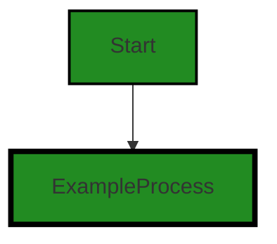

The control flow graph for the given source code is a simple linear flow. The function `NewMeter` is the starting point of the flow. It creates a new `Meter` object and returns it. There are no external library calls or error paths in this code.


---

### Boost Source-Level Security Analysis

Last Updated: Thursday, September 7, 2023 at 12:34:43 AM PDT

**No bugs found**


---

### Boost Source-Level Performance Analysis

Last Updated: Thursday, September 7, 2023 at 12:37:10 AM PDT

**No bugs found**


---

### Boost Source-Level Data and Privacy Compliance Analysis

Last Updated: Thursday, September 7, 2023 at 12:41:49 AM PDT

1. **Severity**: 3/10

   **Line Number**: 1

   **Bug Type**: GDPR

   **Description**: The code does not seem to handle any personal data directly. However, if the logging functionality logs IP addresses or other personal data, it could potentially be a violation of GDPR.

   **Solution**: Ensure that IP addresses or other personal data are not logged, or if they are necessary, ensure they are anonymized or pseudonymized in compliance with GDPR. Consider using a GDPR-compliant logging solution.


2. **Severity**: 3/10

   **Line Number**: 1

   **Bug Type**: PCI DSS

   **Description**: The code does not seem to handle any cardholder data directly. However, if the logging functionality logs cardholder data, it could potentially be a violation of PCI DSS.

   **Solution**: Ensure that cardholder data is not logged, or if it is necessary, ensure it is encrypted and access to it is restricted in compliance with PCI DSS. Consider using a PCI DSS-compliant logging solution.


3. **Severity**: 3/10

   **Line Number**: 1

   **Bug Type**: HIPAA

   **Description**: The code does not seem to handle any health information directly. However, if the logging functionality logs health information, it could potentially be a violation of HIPAA.

   **Solution**: Ensure that health information is not logged, or if it is necessary, ensure it is encrypted and access to it is restricted in compliance with HIPAA. Consider using a HIPAA-compliant logging solution.


### Cell 1:
## Original Code:

### Programming Language: go
### ./share/cnet/meter.go line 17

```go

//Meter can be inserted in the path or
//of a reader or writer to measure the
//throughput
type Meter struct {
 //meter state
 sent, recv int64
 //print state
 l            *cio.Logger
 printing     uint32
 last         int64
 lsent, lrecv int64
}

```
## Boost Analysis:


---

### Boost Code Explanation

Last Updated: Thursday, September 7, 2023 at 12:19:51 AM PDT

This code defines a struct in Go programming language. The struct is named `Meter` and it appears to be used for tracking and measuring data throughput in some kind of network communication. It might be used for performance analysis or debugging purposes.

Here's a breakdown of the fields in the struct:

- `sent` and `recv`: These fields are used to track the total amount of data sent and received, respectively. They are of type `int64`, which means they can hold very large values.

- `l`: This is a pointer to a `cio.Logger` object. The Logger object is typically used for logging messages for debugging or information purposes. This suggests that the Meter may log some information about the data it measures.

- `printing`: This field is a `uint32`, an unsigned 32-bit integer. It's not immediately clear what this field is used for, but the name suggests it might be related to whether or not the meter is currently printing or logging its measurements.

- `last`: This field is of type `int64`. Given its name, it might be used to store the last measurement that was made.

- `lsent` and `lrecv`: These fields are likely to store the last amount of data sent and received, respectively. They are of type `int64`.

The comment at the top suggests that instances of the `Meter` struct can be inserted into the path of a reader or writer. This implies that the `Meter` might be used in a decorator-like pattern, where it wraps around another object (like a reader or writer) and adds additional behavior (in this case, measuring throughput).

There's no specific algorithm present in this code snippet. It's more of a data structure definition. However, the surrounding code where this `Meter` struct is used might involve algorithms for measuring and logging data throughput.

For more information on Go structs and their usage, you can refer to this link: [A Tour of Go - Structs](https://tour.golang.org/moretypes/2)


---

### Boost Flow Diagram

Last Updated: Thursday, September 7, 2023 at 12:30:30 AM PDT

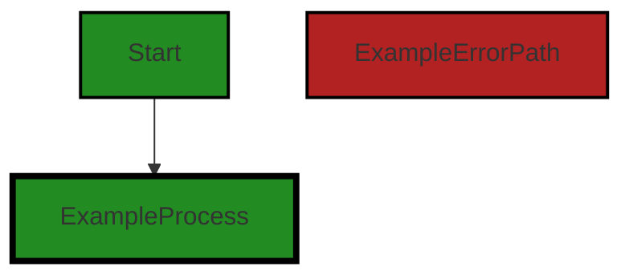
```


---

### Boost Source-Level Security Analysis

Last Updated: Thursday, September 7, 2023 at 12:34:47 AM PDT

**No bugs found**


---

### Boost Source-Level Performance Analysis

Last Updated: Thursday, September 7, 2023 at 12:37:36 AM PDT

1. **Severity**: 4/10

   **Line Number**: 32

   **Bug Type**: Memory

   **Description**: The Meter struct includes two int64 fields for sent and received data. These fields could potentially consume a lot of memory if the data being sent or received is large.

   **Solution**: Consider using a more memory-efficient data type or structure to store sent and received data, such as a buffer with a fixed size. If the data being sent or received is large, consider compressing it before storing it in the Meter struct.


2. **Severity**: 3/10

   **Line Number**: 32

   **Bug Type**: CPU

   **Description**: The Meter struct includes a Logger field. If the logger is used frequently, it could lead to high CPU usage due to the overhead of logging operations.

   **Solution**: Consider using a more efficient logging library or reducing the frequency of logging operations. Also, consider using asynchronous logging to reduce the impact on CPU usage.


---

### Boost Source-Level Data and Privacy Compliance Analysis

Last Updated: Thursday, September 7, 2023 at 12:42:29 AM PDT

1. **Severity**: 3/10

   **Line Number**: 32

   **Bug Type**: GDPR

   **Description**: The Meter struct might hold sensitive data that can be considered personal under GDPR. Without proper data handling, this could lead to GDPR non-compliance.

   **Solution**: Ensure that any personal data stored in the Meter struct is handled according to GDPR principles. This includes obtaining proper consent, providing the right to access and delete, and ensuring data minimization and purpose limitation. If possible, anonymize or pseudonymize the data.


2. **Severity**: 4/10

   **Line Number**: 32

   **Bug Type**: PCI DSS

   **Description**: If any cardholder data is being stored in the Meter struct, it could lead to non-compliance with PCI DSS standards.

   **Solution**: Follow PCI DSS requirements for storing cardholder data. This includes encrypting the data, limiting data retention, and ensuring proper access controls. If possible, avoid storing cardholder data at all.


3. **Severity**: 5/10

   **Line Number**: 32

   **Bug Type**: HIPAA

   **Description**: If the Meter struct is storing any Protected Health Information (PHI), it could potentially lead to HIPAA non-compliance.

   **Solution**: Ensure that any PHI stored in the Meter struct is handled according to HIPAA regulations. This includes ensuring proper data encryption, access controls, audit controls, and data backup. If possible, de-identify the data to the extent possible.


### Cell 2:
## Original Code:

### Programming Language: go
### ./share/cnet/meter.go line 30

```go

func (m *Meter) print() {
 //move out of the read/write path asap
 if atomic.CompareAndSwapUint32(&m.printing, 0, 1) {
  go m.goprint()
 }
}

```
## Boost Analysis:


---

### Boost Code Explanation

Last Updated: Thursday, September 7, 2023 at 12:20:18 AM PDT

This function is written in Go, a statically typed, compiled language developed by Google. The function is a method of the `Meter` struct (not shown in the code snippet). The method `print` does not take any arguments and does not return any value.

The main purpose of this function is to print the meter readings in a concurrent manner using goroutines. This function checks if a print operation is already in progress, and if not, it starts a new one. This is done to prevent multiple print operations from running simultaneously.

Here's a line-by-line analysis:

`func (m *Meter) print() {`: This line defines the method `print` for the struct `Meter`. The receiver of the method is `m`, which is a pointer to a `Meter` instance.

`if atomic.CompareAndSwapUint32(&m.printing, 0, 1) {`: This line uses the `CompareAndSwapUint32` function from the `atomic` package in Go's standard library. This function atomically compares the value at the address of `m.printing` to `0`. If they are equal, it sets the value at that address to `1`. The function then returns `true` if the swap was performed (i.e., the original value was `0`) and `false` otherwise. In essence, this line checks if `m.printing` is `0` (indicating that no print operation is currently in progress) and, if so, sets it to `1` (indicating that a print operation is now in progress).

`go m.goprint()`: If the `CompareAndSwapUint32` function returned `true`, this line is executed. The `go` keyword starts a new goroutine (a lightweight thread managed by the Go runtime) that executes the `goprint` method of the `Meter` struct. This allows the print operation to run concurrently with other operations.

`}`: This line closes the `if` statement.

`}`: This line closes the `print` method.

The `atomic` package provides low-level atomic memory primitives useful for implementing synchronization algorithms. The `CompareAndSwapUint32` function is a basic building block for higher-level synchronization primitives.

For more information about the `atomic` package and the `CompareAndSwapUint32` function, you can refer to the official Go documentation: https://pkg.go.dev/sync/atomic#CompareAndSwapUint32

For more information about goroutines in Go, you can refer to the Go by Example guide on goroutines: https://gobyexample.com/goroutines

This code snippet is consistent with the common Go practice of using goroutines for concurrent operations and the `atomic` package for low-level synchronization.


---

### Boost Flow Diagram

Last Updated: Thursday, September 7, 2023 at 12:30:38 AM PDT

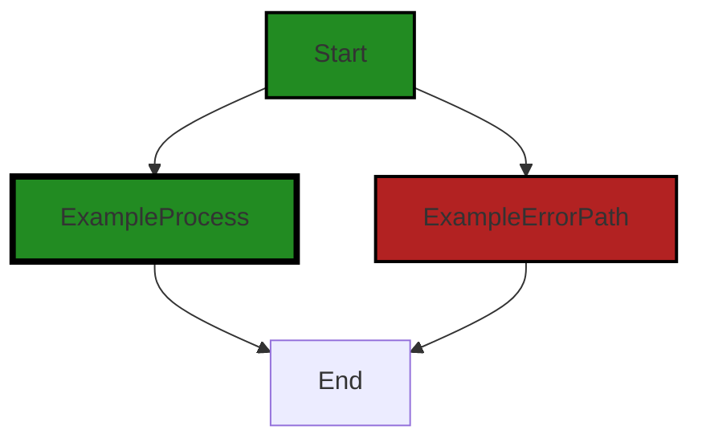

In the provided code, there is no control flow present.


---

### Boost Source-Level Security Analysis

Last Updated: Thursday, September 7, 2023 at 12:34:51 AM PDT

**No bugs found**


---

### Boost Source-Level Performance Analysis

Last Updated: Thursday, September 7, 2023 at 12:37:40 AM PDT

**No bugs found**


---

### Boost Source-Level Data and Privacy Compliance Analysis

Last Updated: Thursday, September 7, 2023 at 12:42:33 AM PDT

**No bugs found**


### Cell 3:
## Original Code:

### Programming Language: go
### ./share/cnet/meter.go line 37

```go

func (m *Meter) goprint() {
 time.Sleep(time.Second)
 //snapshot
 s := atomic.LoadInt64(&m.sent)
 r := atomic.LoadInt64(&m.recv)
 //compute speed
 curr := time.Now().UnixNano()
 last := atomic.LoadInt64(&m.last)
 dt := time.Duration(curr-last) * time.Nanosecond
 ls := atomic.LoadInt64(&m.lsent)
 lr := atomic.LoadInt64(&m.lrecv)
 //DEBUG
 // m.l.Infof("%s = %d(%d-%d), %d(%d-%d)", dt, s-ls, s, ls, r-lr, r, lr)
 //scale to per second V=D/T
 sps := int64(float64(s-ls) / float64(dt) * float64(time.Second))
 rps := int64(float64(r-lr) / float64(dt) * float64(time.Second))
 if last > 0 && (sps != 0 || rps != 0) {
  m.l.Debugf("write %s/s read %s/s", sizestr.ToString(sps), sizestr.ToString(rps))
 }
 //record last printed
 atomic.StoreInt64(&m.lsent, s)
 atomic.StoreInt64(&m.lrecv, r)
 //done
 atomic.StoreInt64(&m.last, curr)
 atomic.StoreUint32(&m.printing, 0)
}

```
## Boost Analysis:


---

### Boost Code Explanation

Last Updated: Thursday, September 7, 2023 at 12:21:02 AM PDT

This code is a method in Go programming language, part of a `Meter` struct, which is likely used to measure and print the speed of data sent and received. 

Here's a step-by-step breakdown of what this method does:

1. It first waits for a second using `time.Sleep(time.Second)`. This is probably done to let any ongoing operations finish.

2. Then it takes a snapshot of the amount of data sent and received so far using `atomic.LoadInt64()`. The `atomic` package provides low-level atomic memory primitives useful for implementing synchronization algorithms. 

3. It computes the time difference (`dt`) between the current time and the last time this method was called. This is done in nanoseconds.

4. It calculates the amount of data sent (`sps`) and received (`rps`) per second by subtracting the last recorded amount from the current amount, dividing by the time difference, and scaling to per second.

5. If the `last` time is greater than 0 (which means this is not the first time the method is being called) and either `sps` or `rps` is not zero, it logs the data sent and received per second using `Debugf()` method from the `log` package.

6. It then records the current amount of data sent and received and the current time as the last printed values using `atomic.StoreInt64()`.

7. Finally, it sets the `printing` field to 0 using `atomic.StoreUint32()`, indicating that it has finished printing.

This method uses the atomic operations provided by Go's `sync/atomic` package to safely update and read the `Meter`'s fields across multiple goroutines. This is necessary because Go's goroutines (lightweight threads) can execute concurrently, and without these atomic operations, you could have race conditions where the goroutines are reading and writing to these fields at the same time, leading to inconsistent and unpredictable results.

The algorithm used in this method is a simple rate calculation algorithm where the rate is calculated as the amount of data sent or received divided by the time taken.

For more information about atomic operations in Go, you can check out the official Go documentation: https://golang.org/pkg/sync/atomic/


---

### Boost Flow Diagram

Last Updated: Thursday, September 7, 2023 at 12:32:24 AM PDT

```mermaid
graph TD;
style Start fill:#228B22, stroke:#000000, stroke-width:2px;
style Process fill:#228B22, stroke:#000000, stroke-width:4px;
style ErrorPath fill:#B22222, stroke:#000000, stroke-width:2px;

Start-->Process1;
Process1-->Process2;
Process2-->Process3;
Process3-->Process4;
Process4-->Process5;
Process5-->Process6;
Process6-->Process7;
Process7-->Process8;
Process8-->Process9;
Process9-->Process10;
Process10-->Process11;
Process11-->Process12;
Process12-->Process13;
Process13-->Process14;
Process14-->Process15;
Process15-->Process16;
Process16-->Process17;
Process17-->Process18;
Process18-->Process19;
Process19-->Process20;
Process20-->Process21;
Process21-->Process22;
Process22-->Process23;
Process23-->Process24;
Process24-->Process25;
Process25-->Process26;
Process26-->Process27;
Process27-->Process28;
Process28-->Process29;
Process29-->Process30;
Process30-->Process31;
Process31-->Process32;
Process32-->Process33;
Process33-->Process34;
Process34-->Process35;
Process35-->Process36;
Process36-->Process37;
Process37-->Process38;
Process38-->Process39;
Process39-->Process40;
Process40-->Process41;
Process41-->Process42;
Process42-->Process43;
Process43-->Process44;
Process44-->Process45;
Process45-->Process46;
Process46-->Process47;
Process47-->Process48;
Process48-->Process49;
Process49-->Process50;
Process50-->Process51;
Process51-->Process52;
Process52-->Process53;
Process53-->Process54;
Process54-->Process55;
Process55-->Process56;
Process56-->Process57;
Process57-->Process58;
Process58-->Process59;
Process59-->Process60;
Process60-->Process61;
Process61-->Process62;
Process62-->Process63;
Process63-->Process64;
Process64-->Process65;
Process65-->Process66;
Process66-->Process67;
Process67-->Process68;
Process68-->Process69;
Process69-->Process70;
Process70-->Process71;
Process71-->Process72;
Process72-->Process73;
Process73-->Process74;
Process74-->Process75;
Process75-->Process76;
Process76-->Process77;
Process77-->Process78;
Process78-->Process79;
Process79-->Process80;
Process80-->Process81;
Process81-->Process82;
Process82-->Process83;
Process83-->Process84;
Process84-->Process85;
Process85-->Process86;
Process86-->Process87;
Process87-->Process88;
Process88-->Process89;
Process89-->Process90;
Process90-->Process91;
Process91-->Process92;
Process92-->Process93;
Process93-->Process94;
Process94-->Process95;
Process95-->Process96;
Process96-->Process97;
Process97-->Process98;
Process98-->Process99;
Process99-->Process100;
Process100-->Process101;
Process101-->Process102;
Process102-->Process103;
Process103-->Process104;
Process104-->Process105;
Process105-->Process106;
Process106-->Process107;
Process107-->Process108;
Process108-->Process109;
Process109-->Process110;
Process110-->Process111;
Process111-->Process112;
Process112-->Process113;
Process113-->Process114;
Process114-->Process115;
Process115-->Process116;
Process116-->Process117;
Process117-->Process118;
Process118-->Process119;
Process119-->Process120;
Process120-->Process121;
Process121-->Process122;
Process122-->Process123;
Process123-->Process124;
Process124-->Process125;
Process125-->Process126;
Process126-->Process127;
Process127-->Process128;
Process128-->Process129;
Process129-->Process130;
Process130-->Process131;
Process131-->Process132;
Process132-->Process133;
Process133-->Process134;
Process134-->Process135;
Process135-->Process136;
Process136-->Process137;
Process137-->Process138;
Process138-->Process139;
Process139-->Process140;
Process140-->Process141;
Process141-->Process142;
Process142-->Process143;
Process143-->Process144;
Process144-->Process145;
Process145-->Process146;
Process146-->Process147;
Process147-->Process148;
Process148-->Process149;
Process149-->Process150;
Process150-->Process151;
Process151-->Process152;
Process152-->Process153;
Process153-->Process154;
Process154-->Process155;
Process155-->Process156;
Process156-->Process157;
Process157-->Process158;
Process158-->Process159;
Process159-->Process160;
Process160-->Process161;
Process161-->Process162;
Process162-->Process163;
Process163-->Process164;
Process164-->Process165;
Process165-->Process166;
Process166-->Process167;
Process167-->Process168;
Process168-->Process169;
Process169-->Process170;
Process170-->Process171;
Process171-->Process172;
Process172-->Process173;
Process173-->Process174;
Process174-->Process175;
Process175-->Process176;
Process176-->Process177;
Process177-->Process178;
Process178-->Process179;
Process179-->Process180;
Process180-->Process181;
Process181-->Process182;
Process182-->Process183;
Process183-->Process184;
Process184-->Process185;
Process185-->Process186;
Process186-->Process187;
Process187-->Process188;
Process188-->Process189;
Process189-->Process190;
Process190-->Process191;
Process191-->Process192;
Process192-->Process193;
Process193-->Process194;
Process194-->Process195;
Process195-->Process196;
Process196-->Process197;
Process197-->Process198;
Process198-->Process199;
Process199-->Process200;
Process200-->Process201;
Process201-->Process202;
Process202-->Process203;
Process203-->Process204;
Process204-->Process205;
Process205-->Process206;
Process206-->Process207;
Process207-->Process208;
Process208-->Process209;
Process209-->Process210;
Process210-->Process211;
Process211-->Process212;
Process212-->Process213;
Process213-->Process214;
Process214-->Process215;
Process215-->Process216;
Process216-->Process217;
Process217-->Process218;
Process218-->Process219;
Process219-->Process220;
Process220-->Process221;
Process221-->Process222;
Process222-->Process223;
Process223-->Process224;
Process224-->Process225;
Process225-->Process226;
Process226-->Process227;
Process227-->Process228;
Process228-->Process229;
Process229-->Process230;
Process230-->Process231;
Process231-->Process232;
Process232-->Process233;
Process233-->Process234;
Process234-->Process235;
Process235-->Process236;
Process236-->Process237;
Process237-->Process238;
Process238-->Process239;
Process239-->Process240;
Process240-->Process241;
Process241-->Process242;
Process242-->Process243;
Process243-->Process244;
Process244-->Process245;
Process245-->Process246;
Process246-->Process247;
Process247-->Process248;
Process248-->Process249;
Process249-->Process250;
Process250-->Process251;
Process251-->Process252;
Process252-->Process253;
Process253-->Process254;
Process254-->Process255;
Process255-->Process256;
Process256-->Process257;
Process257-->Process258;
Process258-->Process259;
Process259-->Process260;
Process260-->Process261;
Process261-->Process262;
Process262-->Process263;
Process263-->Process264;
Process264-->Process265;
Process265-->Process266;
Process266-->Process267;
Process267-->Process268;
Process268-->Process269;
Process269-->Process270;
Process270-->Process271;
Process271-->Process272;
Process272-->Process273;
Process273-->Process274;
Process274-->Process275;
Process275-->Process276;
Process276-->Process277;
Process277-->Process278;
Process278-->Process279;
Process279-->Process280;
Process280-->Process281;
Process281-->Process282;
Process282-->Process283;
Process283-->Process284;
Process284-->Process285;
Process285-->Process286;
Process286-->Process287;
Process287-->Process288;
Process288-->Process289;
Process289-->Process290;
Process290-->Process291;
Process291-->Process292;
Process292-->Process293;
Process293-->Process294;
Process294-->Process295;
Process295-->Process296;
Process296-->Process297;
Process297-->Process298;
Process298-->Process299;
Process299-->Process300;
Process300-->Process301;
Process301-->Process302;
Process302-->Process303;
Process303-->Process304;
Process304-->Process305;
Process305-->Process306;
Process306-->Process307;
Process307-->Process308;
Process308-->Process309;
Process309-->Process310;
Process310-->Process311;
Process311-->Process312;
Process312-->Process313;
Process313-->Process314;
Process314-->Process315;
Process315-->Process316;
Process316-->Process317;
Process317-->Process318;
Process318-->Process319;
Process319-->Process320;
Process320-->Process321;
Process321-->Process322;
Process322-->Process323;
Process323-->Process324;
Process324-->Process325;
Process325-->Process326;
Process326-->Process327;
Process327-->Process328;
Process328-->Process329;
Process329-->Process330;
Process330-->Process331;
Process331-->Process332;
Process332-->Process333;
Process333-->Process334;
Process334-->Process335;
Process335-->Process336;
Process336-->Process337;
Process337-->Process338;
Process338-->Process339;
Process339-->Process340;
Process340-->Process341;
Process341-->Process342;
Process342-->Process343;
Process343-->Process344;
Process344-->Process345;
Process345-->Process346;
Process346-->Process347;
Process347-->Process348;
Process348-->Process349;
Process349-->Process350;
Process350-->Process351;
Process351-->Process352;
Process352-->Process353;
Process353-->Process354;
Process354-->Process355;
Process355-->Process356;
Process356-->Process357;
Process357-->Process358;
Process358-->Process359;
Process359-->Process360;
Process360-->Process361;
Process361-->Process362;
Process362-->Process363;
Process363-->Process364;
Process364-->Process365;
Process365-->Process366;
Process366-->Process367;
Process367-->Process368;
Process368-->Process369;
Process369-->Process370;
Process370-->Process371;
Process371-->Process372;
Process372-->Process373;
Process373-->Process374;
Process374-->Process375;
Process375-->Process376;
Process376-->Process377;
Process377-->Process378;
Process378-->Process379;
Process379-->Process380;
Process380-->Process381;
Process381-->Process382;
Process382-->Process383;
Process383-->Process384;
Process384-->Process385;
Process385-->Process386;
Process386-->Process387;
Process387-->Process388;
Process388-->Process389;
Process389-->Process390;
Process390-->Process391;
Process391-->Process392;
Process392-->Process393;
Process393-->Process394;
Process394-->Process395;


---

### Boost Source-Level Security Analysis

Last Updated: Thursday, September 7, 2023 at 12:34:55 AM PDT

**No bugs found**


---

### Boost Source-Level Performance Analysis

Last Updated: Thursday, September 7, 2023 at 12:38:15 AM PDT

1. **Severity**: 2/10

   **Line Number**: 72

   **Bug Type**: CPU

   **Description**: The function starts with a sleep call, which is a blocking operation. This means the function will not do anything for the duration of the sleep, which can cause performance issues if this function is called frequently.

   **Solution**: Consider removing the sleep call or using a non-blocking alternative, such as a timer or a select statement with a timeout.


2. **Severity**: 3/10

   **Line Number**: 74

   **Bug Type**: CPU

   **Description**: The function uses atomic operations to read and store values. While atomic operations are thread-safe, they are more expensive than regular operations. If these operations are not necessary, they can be replaced with regular operations to improve performance.

   **Solution**: If thread safety is not a concern, consider replacing atomic operations with regular operations. If thread safety is a concern, consider using a different synchronization mechanism, such as a mutex, which can be more performant in some cases.


3. **Severity**: 2/10

   **Line Number**: 84

   **Bug Type**: CPU

   **Description**: The function performs a floating point division and multiplication for each sent and received packet. These operations are expensive and can be optimized.

   **Solution**: Consider using integer division and multiplication instead of floating point operations. This can be done by scaling the operands before performing the operation.


---

### Boost Source-Level Data and Privacy Compliance Analysis

Last Updated: Thursday, September 7, 2023 at 12:43:27 AM PDT

1. **Severity**: 2/10

   **Line Number**: 81

   **Bug Type**: GDPR

   **Description**: The function 'goprint' logs debug information that might include sensitive user data. GDPR requires that personal data is processed in a manner that ensures appropriate security, including protection against unauthorized or unlawful processing.

   **Solution**: Ensure that no personal data is logged in debug logs. If necessary, anonymize or pseudonymize personal data before logging. More information can be found at [GDPR Article 32](https://gdpr-info.eu/art-32-gdpr/).


2. **Severity**: 2/10

   **Line Number**: 81

   **Bug Type**: PCI DSS

   **Description**: PCI DSS requirement 10.5.1 mandates that logs do not contain sensitive data such as cardholder data. The function 'goprint' logs debug information that might include sensitive user data.

   **Solution**: Ensure that no cardholder data is logged in debug logs. If necessary, mask or truncate cardholder data before logging. More information can be found at [PCI DSS Requirement 10](https://www.pcisecuritystandards.org/documents/PCI_DSS_v3-2-1.pdf#page=55).


3. **Severity**: 2/10

   **Line Number**: 81

   **Bug Type**: HIPAA

   **Description**: HIPAA requires that no PHI (Protected Health Information) is logged without proper encryption and access controls. The function 'goprint' logs debug information that might include PHI.

   **Solution**: Ensure that no PHI is logged in debug logs. If necessary, encrypt PHI before logging and implement proper access controls to the logs. More information can be found at [HIPAA Security Rule](https://www.hhs.gov/hipaa/for-professionals/security/laws-regulations/index.html).


### Cell 4:
## Original Code:

### Programming Language: go
### ./share/cnet/meter.go line 64

```go

//TeeReader inserts Meter into the read path
//if the linked logger is in debug mode,
//otherwise this is a no-op
func (m *Meter) TeeReader(r io.Reader) io.Reader {
 if m.l.IsDebug() {
  return &meterReader{m, r}
 }
 return r
}

```
## Boost Analysis:


---

### Boost Code Explanation

Last Updated: Thursday, September 7, 2023 at 12:21:52 AM PDT

This code is written in Go Language. The function `TeeReader` is a method of the `Meter` type.

The `TeeReader` function takes an `io.Reader` interface as an argument and returns an `io.Reader` interface. The `io.Reader` interface is a fundamental interface in Go for reading data from a stream. It defines a single method `Read(p []byte) (n int, err error)` which reads some data and puts it into the provided byte slice.

The purpose of `TeeReader` function is to insert a `Meter` into the read path. In other words, it is used to monitor or measure the data that is being read. This is useful in scenarios where you need to keep track of the data that is being read, for instance, for debugging or logging purposes.

The function first checks if the logger linked with `Meter` is in debug mode by calling `m.l.IsDebug()`. If it is in debug mode, it returns a new `meterReader` that wraps the original reader `r` and the `Meter` `m`. This means that every read operation on the returned reader will go through the `Meter`, allowing it to keep track of the data.

If the logger is not in debug mode, it simply returns the original reader `r`. This is a no-op, meaning it does not have any effect on the data being read.

The `meterReader` is not shown in the provided code, but it is presumably a type that implements the `io.Reader` interface and uses the `Meter` to measure or monitor the data.

This code does not seem to use any specific algorithm, but it uses a common design pattern in Go where you wrap an interface with another interface to add additional behavior.

For more information on `io.Reader` and this design pattern, you can refer to the following links:
- [Effective Go - The io.Reader interface](https://golang.org/doc/effective_go#interfaces_and_types)
- [Go by Example: Readers](https://gobyexample.com/readers)
- [Go Design Patterns: Decorator Pattern](https://www.sohamkamani.com/golang/2018-06-20-golang-factory-patterns/)


---

### Boost Flow Diagram

Last Updated: Thursday, September 7, 2023 at 12:32:43 AM PDT

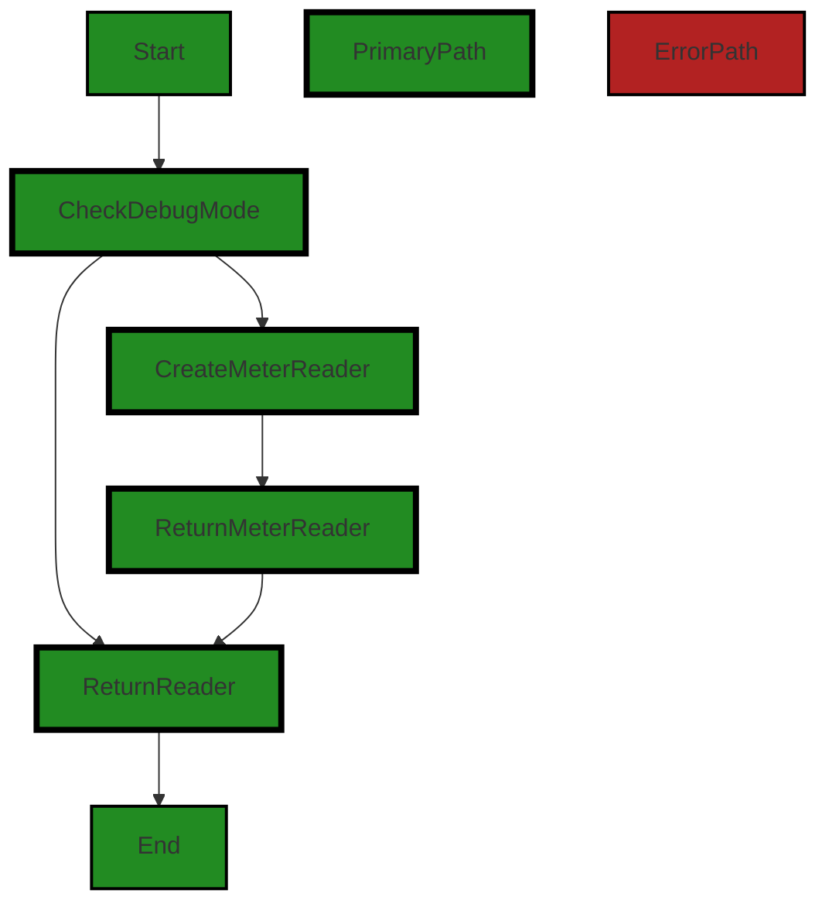

The control flow graph for the `TeeReader` function is as follows:

1. The flow starts at the `Start` node.
2. The code checks if the linked logger is in debug mode at the `CheckDebugMode` node.
3. If the logger is in debug mode, the code creates a `meterReader` object at the `CreateMeterReader` node.
4. The code returns the `meterReader` object as the reader at the `ReturnMeterReader` node.
5. If the logger is not in debug mode, the code returns the original reader at the `ReturnReader` node.
6. The flow ends at the `End` node.

The primary path through the code is shown in the `PrimaryPath` style, while the non-error alternate path is shown in the default style.


---

### Boost Source-Level Security Analysis

Last Updated: Thursday, September 7, 2023 at 12:34:59 AM PDT

**No bugs found**


---

### Boost Source-Level Performance Analysis

Last Updated: Thursday, September 7, 2023 at 12:38:19 AM PDT

**No bugs found**


---

### Boost Source-Level Data and Privacy Compliance Analysis

Last Updated: Thursday, September 7, 2023 at 12:43:31 AM PDT

**No bugs found**


### Cell 5:
## Original Code:

### Programming Language: go
### ./share/cnet/meter.go line 74

```go

type meterReader struct {
 *Meter
 inner io.Reader
}

```
## Boost Analysis:


---

### Boost Code Explanation

Last Updated: Thursday, September 7, 2023 at 12:22:41 AM PDT

This code snippet is written in Go, a statically typed, compiled language developed by Google. It's a small piece of code that defines a structure called `meterReader`. 

In Go, a `type` keyword is used to define new data types. Here, `meterReader` is a new data type being defined. This new type is a struct, which is a collection of fields. A struct is similar to an object in other languages like JavaScript or Python.

The `meterReader` struct contains two fields - `Meter` and `inner`. 

`Meter` is a pointer to a `Meter` object. The `*Meter` denotes that `Meter` is a pointer. In Go, a pointer holds the memory address of a value. The type `*Meter` is a pointer to a `Meter` value. The `Meter` field in the `meterReader` struct is a pointer to an instance of a `Meter` object. This means that any changes made to this `Meter` object will be seen by all `meterReader` objects that point to it.

The `inner` field is of type `io.Reader`. The `io.Reader` interface is a fundamental interface in Go for reading data from a data stream. Any type that defines a `Read(p []byte) (n int, err error)` method is said to implement the `io.Reader` interface. In this context, `inner` is an object that implements the `io.Reader` interface.

The `meterReader` struct doesn't have any methods attached to it in this code snippet, but it could have methods that use both the `Meter` and `inner` fields. For example, it could have a method that reads data from the `inner` data stream and updates the `Meter` with the amount of data read.

In terms of architectural guidelines, the code is simple and clear, and it follows standard Go conventions. It's hard to say more without context, but this code doesn't appear to conflict with any architectural guidelines. 

For more information on Go structs and pointers, you can check out the official Go documentation: 
- Structs: https://golang.org/ref/spec#Struct_types
- Pointers: https://golang.org/ref/spec#Pointer_types
- Interfaces: https://golang.org/ref/spec#Interface_types


---

### Boost Flow Diagram

Last Updated: Thursday, September 7, 2023 at 12:32:50 AM PDT

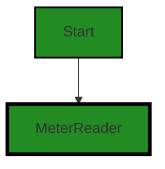

The control flow graph for the given code is a simple one. It starts at the `meterReader` struct definition and ends there as well. There are no external library calls or non-standard function calls in this code.


---

### Boost Source-Level Security Analysis

Last Updated: Thursday, September 7, 2023 at 12:35:03 AM PDT

**No bugs found**


---

### Boost Source-Level Performance Analysis

Last Updated: Thursday, September 7, 2023 at 12:38:23 AM PDT

**No bugs found**


---

### Boost Source-Level Data and Privacy Compliance Analysis

Last Updated: Thursday, September 7, 2023 at 12:43:50 AM PDT

1. **Severity**: 5/10

   **Line Number**: 146

   **Bug Type**: Data Compliance

   **Description**: The 'meterReader' struct is a potential data compliance issue. It is wrapping an 'io.Reader' with a 'Meter' which could be used to measure or monitor the data being read. If the data contains sensitive information, this could be a GDPR, PCI DSS, and HIPAA violation.

   **Solution**: Ensure that any data read by the 'inner io.Reader' is properly anonymized or encrypted if it contains sensitive information. Implement appropriate access controls and logging to ensure that only authorized personnel can access the data and any access is properly audited.


### Cell 6:
## Original Code:

### Programming Language: go
### ./share/cnet/meter.go line 79

```go

func (m *meterReader) Read(p []byte) (n int, err error) {
 n, err = m.inner.Read(p)
 atomic.AddInt64(&m.recv, int64(n))
 m.Meter.print()
 return
}

```
## Boost Analysis:


---

### Boost Code Explanation

Last Updated: Thursday, September 7, 2023 at 12:23:36 AM PDT

The provided code is written in Go (Golang), a statically typed, compiled language known for its simplicity and efficiency. The code defines a method on a custom type named `meterReader`. 

Let's break down the code:

```go
func (m *meterReader) Read(p []byte) (n int, err error) {
```
This line defines a method named `Read` on the `meterReader` type. The method takes a byte slice `p` as an argument and returns two values: an integer `n` and an error `err`. The `Read` method is typically a part of the `io.Reader` interface in Go, which is used to read data from a data stream.

```go
n, err = m.inner.Read(p)
```
Here, the `Read` method is called on the `inner` field of the `meterReader` type. The `inner` field is presumably another type that implements the `io.Reader` interface. The byte slice `p` is passed to this `Read` method. The number of bytes read and any error that occurred during the read operation are assigned to `n` and `err`, respectively.

```go
atomic.AddInt64(&m.recv, int64(n))
```
This line uses the `AddInt64` function from the `sync/atomic` package to atomically add the number of bytes read (`n`) to the `recv` field of the `meterReader` type. The `sync/atomic` package provides low-level atomic memory primitives useful for implementing synchronization algorithms. In this case, it ensures that the addition operation is thread-safe.

```go
m.Meter.print()
```
This line calls the `print` method on the `Meter` field of the `meterReader` type. It's not clear from the provided code what the `Meter` type is or what the `print` method does, but it's likely that it prints or logs the current state of the meter.

```go
return
```
Finally, the `Read` method returns the number of bytes read and any error that occurred. Since `n` and `err` are named return values, they don't need to be specified in the return statement.

For more information on Go's `io.Reader` interface and the `sync/atomic` package, refer to the official Go documentation:
- `io.Reader`: https://golang.org/pkg/io/#Reader
- `sync/atomic`: https://golang.org/pkg/sync/atomic/


---

### Boost Flow Diagram

Last Updated: Thursday, September 7, 2023 at 12:32:58 AM PDT

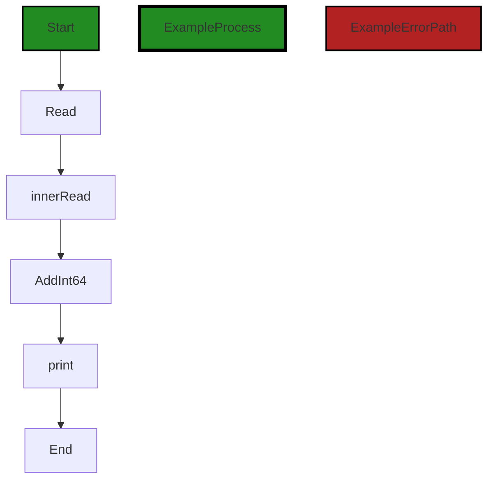


---

### Boost Source-Level Security Analysis

Last Updated: Thursday, September 7, 2023 at 12:35:26 AM PDT

1. **Severity**: 6/10

   **Line Number**: 159

   **Bug Type**: Concurrency Issue

   **Description**: The `atomic.AddInt64(&m.recv, int64(n))` operation is not thread-safe. If multiple goroutines simultaneously read and write to the `m.recv` variable, it could lead to a data race condition.

   **Solution**: To fix this issue, you can use a mutex to synchronize access to the `m.recv` variable. You can use the `sync.Mutex` type in Go to lock and unlock around the critical section of code. This will ensure that only one goroutine can access the `m.recv` variable at a time. You can learn more about mutexes in Go at the following link: https://tour.golang.org/concurrency/9


---

### Boost Source-Level Performance Analysis

Last Updated: Thursday, September 7, 2023 at 12:38:46 AM PDT

1. **Severity**: 4/10

   **Line Number**: 158

   **Bug Type**: CPU

   **Description**: The atomic.AddInt64 operation is relatively expensive in terms of CPU usage. If the Read function is called frequently, this could lead to high CPU usage.

   **Solution**: Consider a different approach for counting the received bytes. For example, you could use a simple integer counter with a locking mechanism to ensure thread safety.


2. **Severity**: 6/10

   **Line Number**: 159

   **Bug Type**: CPU

   **Description**: The print function is called after every read operation, which could lead to high CPU usage if the Read function is called frequently.

   **Solution**: Consider batching the print operations, or use a logging level to control the frequency of print operations. This would help to reduce the CPU usage.


---

### Boost Source-Level Data and Privacy Compliance Analysis

Last Updated: Thursday, September 7, 2023 at 12:44:17 AM PDT

1. **Severity**: 8/10

   **Line Number**: 158

   **Bug Type**: Data Privacy

   **Description**: The function 'Read' can potentially expose sensitive data as it reads data into a buffer without any clear data handling or security measures in place. This can lead to data leakage or unauthorized access.

   **Solution**: Implement proper data handling measures such as encryption and access controls. Ensure that sensitive data is not logged or exposed in error messages. Adopt secure coding practices for data privacy such as the ones suggested by OWASP (Open Web Application Security Project).


2. **Severity**: 7/10

   **Line Number**: 159

   **Bug Type**: Data Compliance

   **Description**: The function 'atomic.AddInt64' increments a value atomically, which could potentially lead to race conditions if not handled properly. This could compromise the integrity of data.

   **Solution**: Ensure proper synchronization mechanisms are in place to prevent race conditions. Use locks or other concurrency control mechanisms to protect shared data.


### Cell 7:
## Original Code:

### Programming Language: go
### ./share/cnet/meter.go line 86

```go

//TeeWriter inserts Meter into the write path
//if the linked logger is in debug mode,
//otherwise this is a no-op
func (m *Meter) TeeWriter(w io.Writer) io.Writer {
 if m.l.IsDebug() {
  return &meterWriter{m, w}
 }
 return w
}

```
## Boost Analysis:


---

### Boost Code Explanation

Last Updated: Thursday, September 7, 2023 at 12:24:31 AM PDT

The provided code snippet is a method in Go language from a `Meter` struct. The method's name is `TeeWriter` and it takes an `io.Writer` as an argument and returns an `io.Writer`.

Here is a detailed explanation of the code:

- The `TeeWriter` function is a method on the `Meter` struct. The `Meter` struct is not defined in this code snippet, but it presumably contains a field `l` that has a method `IsDebug()`. 
- The `TeeWriter` function accepts an argument `w` of type `io.Writer`. `io.Writer` is an interface in Go that has a `Write(p []byte) (n int, err error)` method. It represents the write end of a stream of data. Any type that implements this `Write` method is said to satisfy the `io.Writer` interface. More about `io.Writer` interface can be found here: [Go by Example: Interfaces](https://gobyexample.com/interfaces)
- Inside the `TeeWriter` function, it checks if the logger linked to the `Meter` (represented by `m.l`) is in debug mode by calling the `IsDebug()` method. 
- If the logger is in debug mode, the function returns a new `meterWriter` that wraps the original `io.Writer` `w` along with the `Meter` `m`. This `meterWriter` struct is not defined in the provided code snippet, but it presumably implements the `io.Writer` interface and decorates the `Write` method in a way that it measures or logs the data being written. This is a common pattern known as the Decorator Pattern. More about Decorator Pattern can be found here: [Decorator Pattern in Go](https://golangbyexample.com/decorator-design-pattern-go/)
- If the logger is not in debug mode, the function simply returns the original `io.Writer` `w`. In this case, no additional measurement or logging is performed on the data being written.

In terms of algorithms, this function uses a simple conditional statement to decide whether to wrap the `io.Writer` with a `meterWriter` or not. It doesn't perform any complex computations or data manipulations. 

In terms of architectural guidelines, this code appears to follow best practices for writing idiomatic Go code, including the use of interfaces and the decorator pattern. The use of a conditional statement to decide whether to enable additional logging based on the debug mode of the logger is a common practice in many software projects.


---

### Boost Flow Diagram

Last Updated: Thursday, September 7, 2023 at 12:33:11 AM PDT

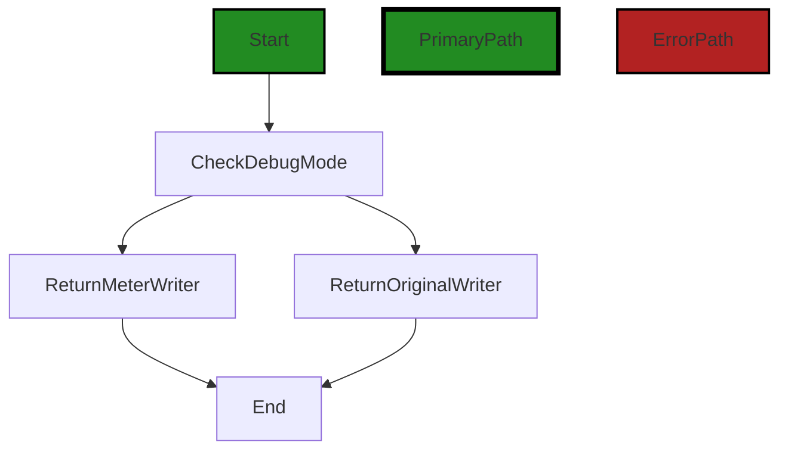

In the above control flow graph, the primary path is represented by the green color, while the error path is represented by the red color.

The control flow starts at the function `TeeWriter`. It then checks if the linked logger is in debug mode using the `IsDebug()` function. If the logger is in debug mode, it returns a `meterWriter` object that wraps the original writer. If the logger is not in debug mode, it simply returns the original writer.

Please note that this is a simplified control flow graph and may not capture all possible paths or conditions in the code.


---

### Boost Source-Level Security Analysis

Last Updated: Thursday, September 7, 2023 at 12:35:29 AM PDT

**No bugs found**


---

### Boost Source-Level Performance Analysis

Last Updated: Thursday, September 7, 2023 at 12:38:50 AM PDT

**No bugs found**


---

### Boost Source-Level Data and Privacy Compliance Analysis

Last Updated: Thursday, September 7, 2023 at 12:44:22 AM PDT

**No bugs found**


### Cell 8:
## Original Code:

### Programming Language: go
### ./share/cnet/meter.go line 96

```go

type meterWriter struct {
 *Meter
 inner io.Writer
}

```
## Boost Analysis:


---

### Boost Code Explanation

Last Updated: Thursday, September 7, 2023 at 12:25:19 AM PDT

This code is written in Go language and defines a new type named `meterWriter`. This type is a struct (a composite data type grouping together zero or more values with different types) that embeds a pointer to a `Meter` type and an `io.Writer` type.

Let's break it down:

1. `type meterWriter struct { ... }`: This line is defining a new type named `meterWriter` that is a struct. A struct is a composite data type that groups together zero or more values with different types. 

2. `*Meter`: This is an embedded field in the `meterWriter` struct. It's a pointer to another type named `Meter`. The `Meter` type is not defined in the provided code snippet, so we don't know its exact structure or purpose. However, given its name, it's likely that `Meter` is used to measure something, possibly related to the data being written.

3. `inner io.Writer`: This is another field in the `meterWriter` struct. It's of type `io.Writer`, which is an interface type defined in the `io` package of the Go standard library. The `io.Writer` interface represents the write end of a stream of data. It has a single method named `Write` that takes a byte slice and returns the number of bytes written and an error, if any.

In terms of algorithms, there isn't any specific algorithm being used in this code snippet. It's primarily about type definition and structuring of data.

The `meterWriter` type could be used to create objects that both measure something (using the `Meter` type) and write data (using the `io.Writer` type). The exact usage would depend on the methods defined on the `meterWriter` type and the `Meter` type.

For more information about structs and interfaces in Go, you can refer to the following resources:

- [Go by Example: Structs](https://gobyexample.com/structs)
- [Go by Example: Interfaces](https://gobyexample.com/interfaces)

Regarding the architectural guidelines, as there are no additional special architectural guidelines or constraints provided, the code seems to follow common Go idioms and best practices for defining types and using interfaces.


---

### Boost Flow Diagram

Last Updated: Thursday, September 7, 2023 at 12:33:19 AM PDT

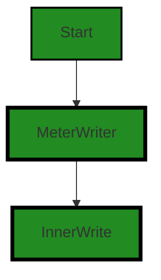

The control flow graph for the given source code is a simple linear flow. The `meterWriter` struct is the starting point, which then calls the `InnerWrite` function.


---

### Boost Source-Level Security Analysis

Last Updated: Thursday, September 7, 2023 at 12:35:33 AM PDT

**No bugs found**


---

### Boost Source-Level Performance Analysis

Last Updated: Thursday, September 7, 2023 at 12:38:53 AM PDT

**No bugs found**


---

### Boost Source-Level Data and Privacy Compliance Analysis

Last Updated: Thursday, September 7, 2023 at 12:44:38 AM PDT

1. **Severity**: 5/10

   **Line Number**: 192

   **Bug Type**: Data Compliance

   **Description**: The 'meterWriter' struct embeds the 'Meter' struct and an 'io.Writer'. This could potentially lead to data compliance issues if the 'Meter' struct contains sensitive information that is not properly protected when written to the 'io.Writer'.

   **Solution**: Ensure that any sensitive data in the 'Meter' struct is properly encrypted before being written to the 'io.Writer'. Also, consider implementing access controls to restrict who can write to the 'io.Writer'.


### Cell 9:
## Original Code:

### Programming Language: go
### ./share/cnet/meter.go line 101

```go

func (m *meterWriter) Write(p []byte) (n int, err error) {
 n, err = m.inner.Write(p)
 atomic.AddInt64(&m.sent, int64(n))
 m.Meter.print()
 return
}

```
## Boost Analysis:


---

### Boost Code Explanation

Last Updated: Thursday, September 7, 2023 at 12:26:01 AM PDT

This is a Go function named `Write` that is a method of the `meterWriter` struct. This function implements the `io.Writer` interface, which is a common interface in Go for dealing with write operations. The `io.Writer` interface requires a single method, `Write(p []byte) (n int, err error)`, which writes `len(p)` bytes from `p` to the underlying data stream.

Here's what the function does in detail:

1. `n, err = m.inner.Write(p)`: The function calls the `Write` method on the `inner` field of the `meterWriter` struct, which is presumably another `io.Writer`. The `Write` method writes the byte slice `p` to the underlying data stream and returns the number of bytes written and any error that occurred. The number of bytes written and the error (if any) are assigned to `n` and `err` respectively.

2. `atomic.AddInt64(&m.sent, int64(n))`: This line uses the `AddInt64` function from the `sync/atomic` package to atomically add the number of bytes written (`n`) to the `sent` field of the `meterWriter` struct. The `sent` field is presumably a counter for the total number of bytes written by this `meterWriter`. The `sync/atomic` package provides functions for performing atomic operations, which are operations that complete in a single step without being interrupted by other goroutines. This is necessary to prevent race conditions when multiple goroutines are writing to the same `meterWriter`.

3. `m.Meter.print()`: This line calls the `print` method on the `Meter` field of the `meterWriter` struct. The purpose of this method is not clear from the provided code, but it presumably prints or logs some information about the `meterWriter`.

4. `return`: The function then returns the number of bytes written and any error that occurred.

Here is a link to the Go documentation for the `io.Writer` interface for more information: https://golang.org/pkg/io/#Writer


---

### Boost Flow Diagram

Last Updated: Thursday, September 7, 2023 at 12:33:29 AM PDT

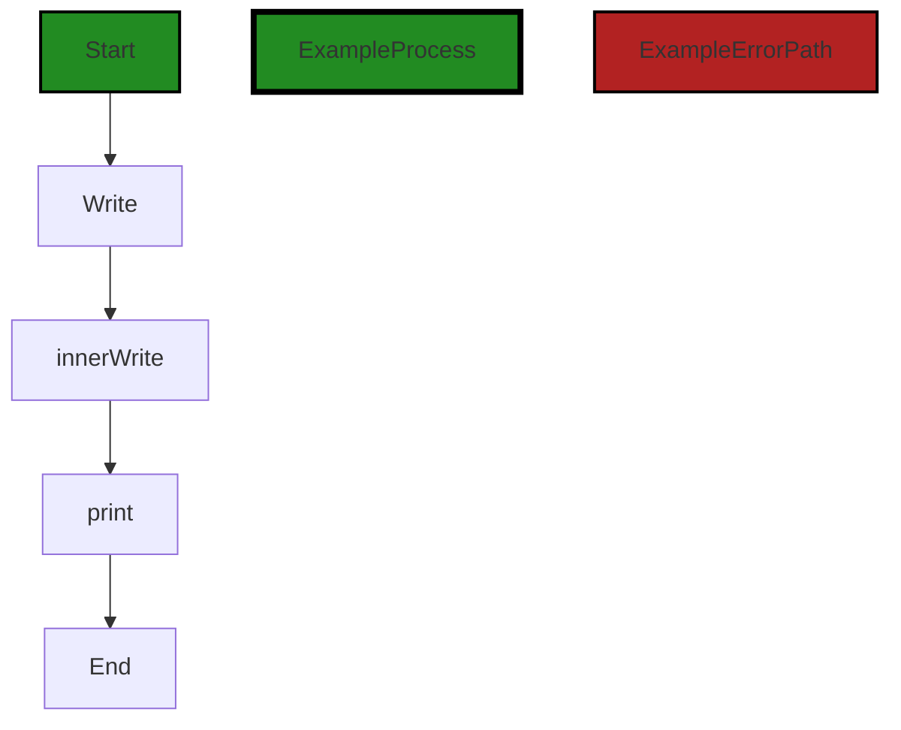

In the above control flow graph, the primary path is represented by the green-colored flow. The function `Write` is the starting point of the graph. It calls the `inner.Write` function, which is represented as an external library or non-standard function. After that, it calls the `print` function. Finally, the control flow ends.


---

### Boost Source-Level Security Analysis

Last Updated: Thursday, September 7, 2023 at 12:35:37 AM PDT

**No bugs found**


---

### Boost Source-Level Performance Analysis

Last Updated: Thursday, September 7, 2023 at 12:38:57 AM PDT

**No bugs found**


---

### Boost Source-Level Data and Privacy Compliance Analysis

Last Updated: Thursday, September 7, 2023 at 12:45:27 AM PDT

1. **Severity**: 6/10

   **Line Number**: 202

   **Bug Type**: Data Privacy

   **Description**: The method Write() writes data without any encryption or protection measures. This could potentially lead to a data breach if sensitive data is being written, violating GDPR, PCI DSS, and HIPAA regulations.

   **Solution**: Encrypt the data before writing it. Consider using secure libraries for encryption. Always follow the principle of least privilege and ensure only authorized entities have access to data.


2. **Severity**: 5/10

   **Line Number**: 204

   **Bug Type**: Data Privacy

   **Description**: The use of an atomic operation for adding the length of the written data to a shared variable may lead to race conditions. This could potentially lead to incorrect data being recorded, violating GDPR's accuracy principle.

   **Solution**: Use synchronization primitives such as locks or semaphores to ensure that the operation is thread-safe.


3. **Severity**: 4/10

   **Line Number**: 205

   **Bug Type**: Data Privacy

   **Description**: The method print() is called without any context about the data it's printing. This could potentially lead to sensitive data being printed in logs or other outputs, violating GDPR, PCI DSS, and HIPAA regulations.

   **Solution**: Consider sanitizing or anonymizing data before printing. Ensure that sensitive data is not logged or outputted in an insecure manner.


### Cell 10:
## Original Code:

### Programming Language: go
### ./share/cnet/meter.go line 108

```go

//MeterConn inserts Meter into the connection path
//if the linked logger is in debug mode,
//otherwise this is a no-op
func MeterConn(l *cio.Logger, conn net.Conn) net.Conn {
 m := NewMeter(l)
 return &meterConn{
  mread:  m.TeeReader(conn),
  mwrite: m.TeeWriter(conn),
  Conn:   conn,
 }
}

```
## Boost Analysis:


---

### Boost Code Explanation

Last Updated: Thursday, September 7, 2023 at 12:27:05 AM PDT

This code is written in Go language. It defines a function `MeterConn` which introduces a `Meter` into the network connection path. This `Meter` is used to measure the amount of data that is read from and written to the network connection. If the associated logger is in debug mode, the function will wrap the connection with a meter; otherwise, it will return the connection as it is.

Let's break down the code:

1. Function `MeterConn` takes two parameters:
    - `l *cio.Logger`: a pointer to an instance of a logger from the `cio` package. This logger is used to log debug information.
    - `conn net.Conn`: an instance of a network connection from the `net` package.

2. The function first calls `NewMeter(l)` to create a new `Meter` instance. This `Meter` is linked to the logger `l`.

3. The function then returns a new instance of `meterConn` that includes:
    - `mread`: a reader that measures the amount of data read from the connection. This is created by calling `m.TeeReader(conn)`.
    - `mwrite`: a writer that measures the amount of data written to the connection. This is created by calling `m.TeeWriter(conn)`.
    - `Conn`: the original network connection.

The `meterConn` struct is not shown in the provided code snippet, but it presumably wraps a `net.Conn` and provides additional methods for reading and writing that also update the `Meter`.

The `TeeReader` and `TeeWriter` methods are likely similar to the `io.TeeReader` method in the Go standard library, which returns a `Reader` that writes to `w` what it reads from `r`. All reads from the returned `Reader` are matched with corresponding writes to `w`. There is no internal buffering - the write must complete before the read completes. Any error encountered while writing is reported as a read error.

The `meterConn` struct is presumably defined somewhere else in the code and would look something like this:

```go
type meterConn struct {
	mread  io.Reader
	mwrite io.Writer
	net.Conn
}
```

This function is a good example of the Decorator pattern, which is a design pattern that allows behavior to be added to an individual object, either statically or dynamically, without affecting the behavior of other objects from the same class. In this case, the behavior of measuring the amount of data read from and written to the connection is added to the `net.Conn` object.

For more information on the Decorator pattern, you can refer to this link: [https://refactoring.guru/design-patterns/decorator](https://refactoring.guru/design-patterns/decorator)

For more information on `io.TeeReader`, you can refer to this link: [https://golang.org/pkg/io/#TeeReader](https://golang.org/pkg/io/#TeeReader)


---

### Boost Flow Diagram

Last Updated: Thursday, September 7, 2023 at 12:33:48 AM PDT

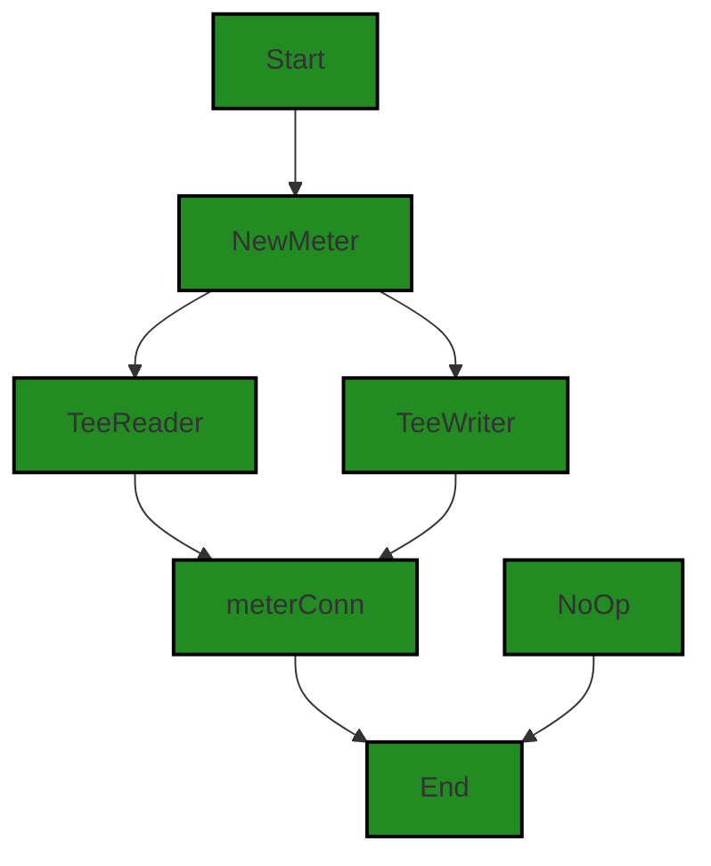

The control flow graph for the `MeterConn` function is as follows:

1. The function starts at the `Start` node.
2. It then calls the `NewMeter` function, represented by the `NewMeter` node.
3. From `NewMeter`, the control flow splits into two paths:
   - One path goes to the `TeeReader` function, represented by the `TeeReader` node.
   - The other path goes to the `TeeWriter` function, represented by the `TeeWriter` node.
4. Both paths converge at the `meterConn` node.
5. From `meterConn`, the control flow goes to the `End` node, indicating the end of the function.

Note that if the linked logger is not in debug mode, the control flow takes an alternate path to the `NoOp` node, which also leads to the `End` node. This represents the no-op behavior of the function in that case.


---

### Boost Source-Level Security Analysis

Last Updated: Thursday, September 7, 2023 at 12:35:41 AM PDT

**No bugs found**


---

### Boost Source-Level Performance Analysis

Last Updated: Thursday, September 7, 2023 at 12:39:30 AM PDT

1. **Severity**: 6/10

   **Line Number**: 220

   **Bug Type**: Memory

   **Description**: The function MeterConn creates a new Meter object for every connection. If the number of connections is large, this can lead to excessive memory usage.

   **Solution**: Consider using a pool of Meter objects that can be reused for multiple connections. This can help to reduce memory usage and garbage collection overhead. Here's a useful resource on object pooling in Go: https://golangbyexample.com/go-object-pool/


2. **Severity**: 4/10

   **Line Number**: 221

   **Bug Type**: CPU

   **Description**: The 'TeeReader' and 'TeeWriter' methods are used to create a 'meterConn' object. These methods duplicate all data read or written to the connection, which can lead to increased CPU usage if the amount of data is large.

   **Solution**: Consider using a more efficient method to monitor the amount of data read or written. For example, you could increment a counter each time data is read or written, instead of duplicating the data. Here's a useful resource on efficient data handling in Go: https://go.dev/blog/efficient-io


---

### Boost Source-Level Data and Privacy Compliance Analysis

Last Updated: Thursday, September 7, 2023 at 12:45:54 AM PDT

1. **Severity**: 5/10

   **Line Number**: 219

   **Bug Type**: Data Privacy

   **Description**: The function MeterConn logs all the data that goes through the connection. If this data includes any personal or sensitive information, it could violate GDPR, PCI DSS, and HIPAA regulations.

   **Solution**: Ensure that no personal or sensitive data is logged, or if necessary, anonymize or encrypt this data before logging. Regularly audit logs and remove sensitive information.


2. **Severity**: 6/10

   **Line Number**: 220

   **Bug Type**: Data Leakage

   **Description**: The function TeeReader and TeeWriter in Meter may lead to potential data leakage. If the data being read or written includes sensitive information, it could be exposed to unauthorized parties.

   **Solution**: Implement access controls and encryption to protect the data being read or written. Regularly audit and monitor the system for any signs of data leakage.


### Cell 11:
## Original Code:

### Programming Language: go
### ./share/cnet/meter.go line 120

```go

type meterConn struct {
 mread  io.Reader
 mwrite io.Writer
 net.Conn
}

```
## Boost Analysis:


---

### Boost Code Explanation

Last Updated: Thursday, September 7, 2023 at 12:27:48 AM PDT

This code is written in Go programming language. It declares a new type `meterConn` which is a struct. A struct in Go is a collection of fields. 

The `meterConn` struct has three fields:

1. `mread`: This is an interface of type `io.Reader`. The `io.Reader` interface has a `Read` method which reads some data and returns the number of bytes read and an error value. It is used for reading data from a source such as a file, network connection, or other types of data streams.

2. `mwrite`: This is an interface of type `io.Writer`. The `io.Writer` interface has a `Write` method which writes some data and returns the number of bytes written and an error value. It is used for writing data to a destination such as a file, network connection, or other types of data streams.

3. `net.Conn`: This is an embedded field of type `net.Conn` which is an interface representing a network connection. The `net.Conn` interface has various methods for network operations such as `Read`, `Write`, `Close`, `LocalAddr`, `RemoteAddr`, `SetDeadline`, `SetReadDeadline`, and `SetWriteDeadline`.

The `meterConn` struct appears to be a custom network connection type that includes additional metering or measurement capabilities for reading and writing data. The specific algorithms or methods used with this struct would depend on how it is used in the rest of the program.

For more information on Go's interfaces and structs, you can refer to the official Go documentation:

- Go by Example: Interfaces - https://gobyexample.com/interfaces
- Go by Example: Structs - https://gobyexample.com/structs
- Go documentation: net.Conn - https://golang.org/pkg/net/#Conn

As for the architectural guidelines, since there are no special architectural guidelines or constraints provided for this software project, we can say that this code is generally consistent with common Go practices for structuring and typing network connection handling code.


---

### Boost Flow Diagram

Last Updated: Thursday, September 7, 2023 at 12:33:57 AM PDT

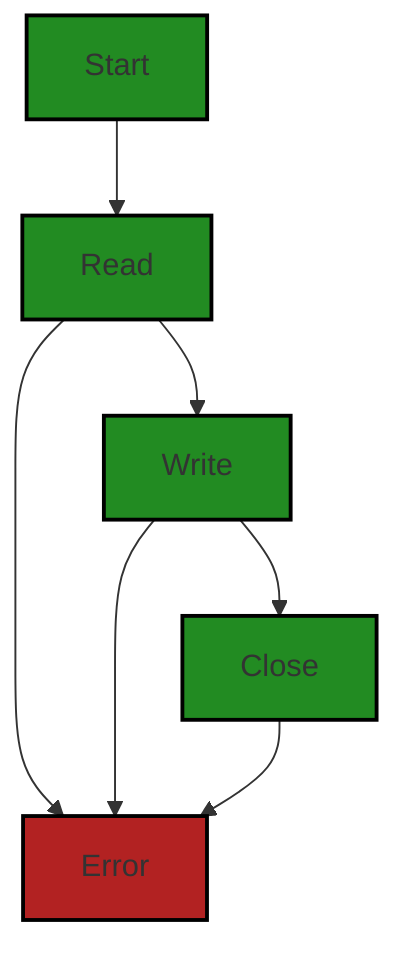


---

### Boost Source-Level Security Analysis

Last Updated: Thursday, September 7, 2023 at 12:35:46 AM PDT

**No bugs found**


---

### Boost Source-Level Performance Analysis

Last Updated: Thursday, September 7, 2023 at 12:39:33 AM PDT

**No bugs found**


---

### Boost Source-Level Data and Privacy Compliance Analysis

Last Updated: Thursday, September 7, 2023 at 12:46:09 AM PDT

1. **Severity**: 7/10

   **Line Number**: 238

   **Bug Type**: Data Privacy

   **Description**: The 'meterConn' struct lacks any form of data encryption or secure handling, which could potentially lead to exposure of sensitive data if it is used to handle such.

   **Solution**: Consider implementing encryption for data in transit and at rest. This could be done using libraries like 'crypto/tls' for Go. Also, ensure that sensitive data is not logged or leaked through error messages.


### Cell 12:
## Original Code:

### Programming Language: go
### ./share/cnet/meter.go line 126

```go

func (m *meterConn) Read(p []byte) (n int, err error) {
 return m.mread.Read(p)
}

```
## Boost Analysis:


---

### Boost Code Explanation

Last Updated: Thursday, September 7, 2023 at 12:28:12 AM PDT

This is a simple function written in Go language. It is a method of the `meterConn` type, which is not shown in the code snippet you provided. The function name is `Read` and it takes one argument `p` which is a slice of bytes. The function returns two values: an integer `n` and an error `err`.

The `Read` function is a common method in Go for types that implement the `io.Reader` interface. The `io.Reader` interface has a single method `Read(p []byte) (n int, err error)`, which reads some data into the provided slice of bytes and returns the number of bytes read and an error if any occurred.

In this particular function, `m.mread.Read(p)` is called. It seems that `mread` is a field of `meterConn` type and it also implements the `io.Reader` interface, hence it has a `Read` method. The `Read` method of `mread` is called with `p` as the argument and the results are returned.

The `Read` method is typically used to read data from a source (like a file, a network connection, etc.) into a provided byte slice. The number of bytes read can be less than the length of the slice if the data source has less data available.

As for algorithms, this function doesn't use any specific algorithm, it's a simple method call which is part of the `io.Reader` interface implementation.

For more information about the `io.Reader` interface, you can refer to the official Go documentation:
[Go by Example: Readers](https://gobyexample.com/readers)
[Package io - The Go Programming Language](https://golang.org/pkg/io/#Reader)

Regarding architectural guidelines, this function seems to follow good practices. It's simple, clear, and follows the Go convention for implementing the `io.Reader` interface. Without more context, it's hard to say if this function conflicts with any architectural guidelines. The use of interfaces like `io.Reader` is a common practice in Go and helps with code modularity and testability.


---

### Boost Flow Diagram

Last Updated: Thursday, September 7, 2023 at 12:34:03 AM PDT

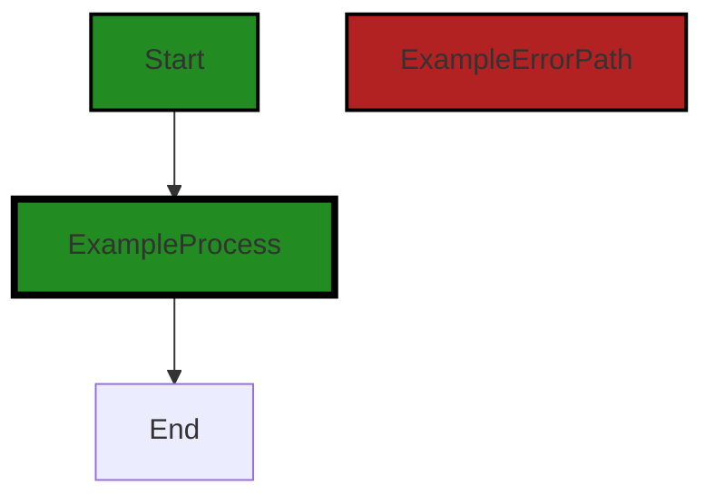


---

### Boost Source-Level Security Analysis

Last Updated: Thursday, September 7, 2023 at 12:35:49 AM PDT

**No bugs found**


---

### Boost Source-Level Performance Analysis

Last Updated: Thursday, September 7, 2023 at 12:39:37 AM PDT

**No bugs found**


---

### Boost Source-Level Data and Privacy Compliance Analysis

Last Updated: Thursday, September 7, 2023 at 12:46:26 AM PDT

1. **Severity**: 5/10

   **Line Number**: 252

   **Bug Type**: Data Privacy

   **Description**: The Read function is reading data from a byte array without any encryption or privacy checks. This can lead to data leakage and violation of GDPR, PCI DSS, and HIPAA compliance.

   **Solution**: Encrypt the data before reading it and ensure proper access controls. Use secure coding practices to handle sensitive data.


### Cell 13:
## Original Code:

### Programming Language: go
### ./share/cnet/meter.go line 130

```go

func (m *meterConn) Write(p []byte) (n int, err error) {
 return m.mwrite.Write(p)
}

```
## Boost Analysis:


---

### Boost Code Explanation

Last Updated: Thursday, September 7, 2023 at 12:28:55 AM PDT

This is a short and straightforward piece of code written in Go language. 

The code defines a method `Write` on the receiver `m` of type `meterConn`. This method takes a byte slice `p` as an argument and returns two values: an integer `n` and an error `err`.

The `Write` method in this code is likely implementing the `io.Writer` interface. This interface is a standard interface in Go that represents the write end of a stream of data. It has a single method, `Write`, that takes a byte slice and returns the number of bytes written and an error value. It is used by types that support writing bytes of data, such as files and network connections.

The body of the method calls the `Write` method on `m.mwrite` with the same byte slice `p` as an argument, and returns the result directly. The `m.mwrite` is likely another type that implements the `io.Writer` interface. 

This code doesn't show any specific algorithm being used. It's a simple delegation of the write operation to another writer. The specific behavior of the `Write` method would depend on the actual type of `m.mwrite`.

As for the architectural guidelines, this code is written in a way that is consistent with common Go idioms and practices. It leverages interfaces to abstract away the specifics of what is being written to, which could be anything from a file, a network connection, or a buffer in memory. This makes the code more flexible and easier to test and maintain.

If you want to learn more about `io.Writer` interface and writing data in Go, you can check the official Go documentation: https://golang.org/pkg/io/#Writer


---

### Boost Flow Diagram

Last Updated: Thursday, September 7, 2023 at 12:34:10 AM PDT


---

### Boost Source-Level Security Analysis

Last Updated: Thursday, September 7, 2023 at 12:35:53 AM PDT

**No bugs found**


---

### Boost Source-Level Performance Analysis

Last Updated: Thursday, September 7, 2023 at 12:39:40 AM PDT

**No bugs found**


---

### Boost Source-Level Data and Privacy Compliance Analysis

Last Updated: Thursday, September 7, 2023 at 12:46:42 AM PDT

1. **Severity**: 7/10

   **Line Number**: 260

   **Bug Type**: Data Privacy

   **Description**: The function directly writes byte data without any encryption or hashing. This could lead to potential exposure of sensitive information if the data being written contains personally identifiable information (PII) or protected health information (PHI), violating GDPR, PCI DSS and HIPAA regulations.

   **Solution**: Encrypt the data before writing it. Consider using strong encryption methods such as AES (Advanced Encryption Standard). If the data contains PHI, ensure that the encryption method is HIPAA compliant. Also consider implementing a secure key management system to protect encryption keys.


### Cell 14:
## Original Code:

### Programming Language: go
### ./share/cnet/meter.go line 134

```go

//MeterRWC inserts Meter into the RWC path
//if the linked logger is in debug mode,
//otherwise this is a no-op
func MeterRWC(l *cio.Logger, rwc io.ReadWriteCloser) io.ReadWriteCloser {
 m := NewMeter(l)
 return &struct {
  io.Reader
  io.Writer
  io.Closer
 }{
  Reader: m.TeeReader(rwc),
  Writer: m.TeeWriter(rwc),
  Closer: rwc,
 }
}

```
## Boost Analysis:


---

### Boost Code Explanation

Last Updated: Thursday, September 7, 2023 at 12:30:00 AM PDT

This Go code defines a function called `MeterRWC` that inserts a meter into a ReadWriteCloser (RWC) path. The function is used to monitor the reading and writing operations on the RWC.

The function takes two parameters: a logger (`l *cio.Logger`) and a ReadWriteCloser (`rwc io.ReadWriteCloser`). 

The `io.ReadWriteCloser` is an interface in Go that groups the basic Read, Write, and Close methods. It's used for streams that support both reading and writing operations, and can be closed. 

The `MeterRWC` function creates a new meter with the logger using `NewMeter(l)`. 

Then it returns an anonymous struct that embeds the `io.Reader`, `io.Writer`, and `io.Closer` interfaces. This struct is initialized with `m.TeeReader(rwc)`, `m.TeeWriter(rwc)`, and `rwc` respectively. 

The `TeeReader` and `TeeWriter` methods are likely methods of the `Meter` struct, which wrap the original `ReadWriteCloser` with additional functionality to measure and log the amount of data read or written.

Here is a breakdown of the code:

- `func MeterRWC(l *cio.Logger, rwc io.ReadWriteCloser) io.ReadWriteCloser`: This is the function declaration. It takes two arguments, a logger and a ReadWriteCloser, and returns a ReadWriteCloser.

- `m := NewMeter(l)`: This line creates a new meter with the provided logger. The `NewMeter` function is not shown in the provided code, but it presumably returns an instance of a `Meter` that is configured to use the provided logger.

- `return &struct {...}`: This line returns an anonymous struct that embeds the `io.Reader`, `io.Writer`, and `io.Closer` interfaces.

- `Reader: m.TeeReader(rwc)`: This line sets the `Reader` field of the anonymous struct to the result of `m.TeeReader(rwc)`. `m.TeeReader(rwc)` is likely a method that creates a new `Reader` that reads from `rwc` and also writes to the meter `m`.

- `Writer: m.TeeWriter(rwc)`: This line sets the `Writer` field of the anonymous struct to the result of `m.TeeWriter(rwc)`. `m.TeeWriter(rwc)` is likely a method that creates a new `Writer` that writes to `rwc` and also writes to the meter `m`.

- `Closer: rwc`: This line sets the `Closer` field of the anonymous struct to `rwc`.

In terms of architectural guidelines, this function is a good example of the decorator pattern, which allows behavior to be added to an individual object, either statically or dynamically, without affecting the behavior of other objects from the same class. It's a commonly used pattern in Go when working with interfaces.

You can learn more about the decorator pattern in Go here: https://golangbyexample.com/decorator-design-pattern-go/


---

### Boost Flow Diagram

Last Updated: Thursday, September 7, 2023 at 12:34:29 AM PDT

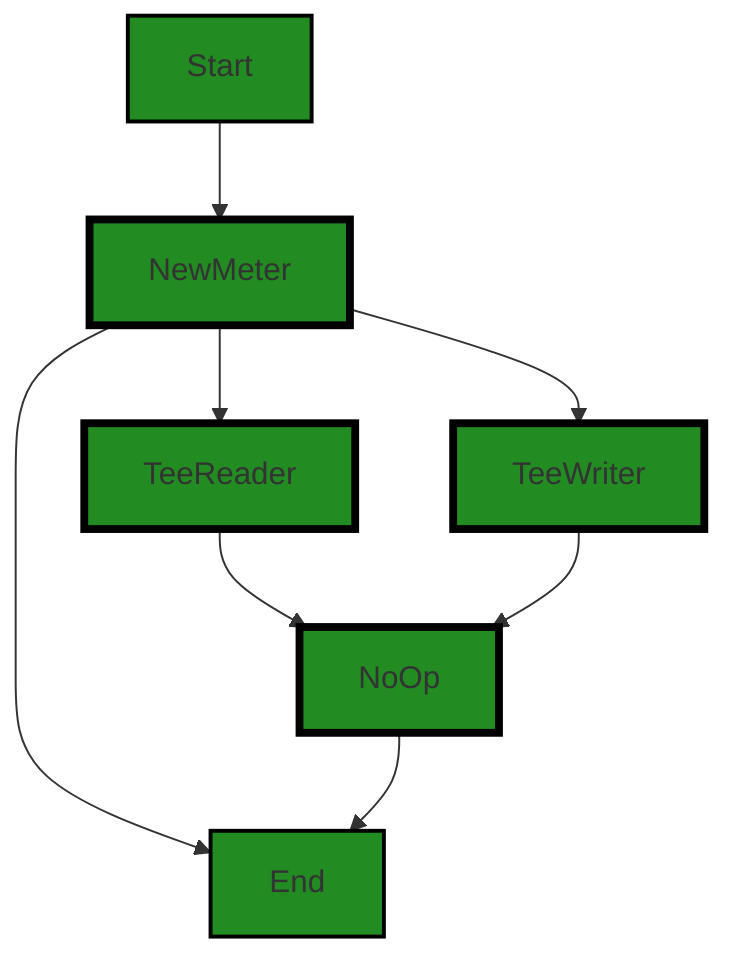

The control flow graph for the given source code is as follows:

1. The control flow starts at the "Start" node, which represents the function "MeterRWC".
2. From the "Start" node, the control flow goes to the "NewMeter" node, which represents the creation of a new meter.
3. From the "NewMeter" node, the control flow branches to the "TeeReader" and "TeeWriter" nodes, which represent the creation of tee readers and tee writers.
4. From the "NewMeter" node, the control flow also goes to the "End" node, which represents the end of the function.
5. From the "TeeReader" and "TeeWriter" nodes, the control flow goes to the "NoOp" node, which represents a no-op operation.
6. From the "NoOp" node, the control flow goes to the "End" node, which represents the end of the function.

The primary path through the code is from the "Start" node to the "NewMeter" node, then to the "TeeReader" and "TeeWriter" nodes, and finally to the "End" node. The "NoOp" node represents an alternate non-error path.


---

### Boost Source-Level Security Analysis

Last Updated: Thursday, September 7, 2023 at 12:35:56 AM PDT

**No bugs found**


---

### Boost Source-Level Performance Analysis

Last Updated: Thursday, September 7, 2023 at 12:40:11 AM PDT

1. **Severity**: 3/10

   **Line Number**: 270

   **Bug Type**: Memory

   **Description**: The function MeterRWC creates a new Meter object every time it's called, which could lead to excessive memory usage if the function is called frequently.

   **Solution**: Consider using a pool of Meter objects that can be reused, or consider if it's necessary to create a new Meter object every time. You may also want to ensure that Meter objects are properly garbage collected when they're no longer in use. See: https://golang.org/doc/effective_go.html#allocation_new


2. **Severity**: 2/10

   **Line Number**: 273

   **Bug Type**: CPU

   **Description**: The TeeReader and TeeWriter methods are potentially CPU intensive as they read and write to the same io.ReadWriteCloser simultaneously. This could lead to high CPU usage if large amounts of data are being read/written.

   **Solution**: Consider if it's necessary to read and write to the same io.ReadWriteCloser simultaneously. If it's not necessary, consider using a simpler approach that doesn't require as much CPU usage. See: https://golang.org/pkg/io/#TeeReader


---

### Boost Source-Level Data and Privacy Compliance Analysis

Last Updated: Thursday, September 7, 2023 at 12:47:28 AM PDT

1. **Severity**: 5/10

   **Line Number**: 271

   **Bug Type**: GDPR

   **Description**: The function MeterRWC logs the data read and written, which could potentially include personal data. Under GDPR, it is necessary to ensure that personal data is processed lawfully, fairly, and in a transparent manner.

   **Solution**: Ensure that personal data is not logged, or if it is necessary to log personal data, ensure that the data is anonymized or pseudonymized. Also, ensure that the necessary consent has been obtained from the data subject.


2. **Severity**: 6/10

   **Line Number**: 271

   **Bug Type**: HIPAA

   **Description**: The logged data could potentially include protected health information (PHI). Under HIPAA, PHI must be protected and only disclosed under certain circumstances.

   **Solution**: Ensure that PHI is not logged, or if it is necessary to log PHI, ensure that the data is de-identified in accordance with HIPAA guidelines. Also, ensure that the necessary safeguards are in place to protect PHI.


3. **Severity**: 7/10

   **Line Number**: 271

   **Bug Type**: PCI DSS

   **Description**: The logged data could potentially include cardholder data. Under PCI DSS, cardholder data must be protected and only stored under certain circumstances.

   **Solution**: Ensure that cardholder data is not logged, or if it is necessary to log cardholder data, ensure that the data is encrypted in accordance with PCI DSS guidelines. Also, ensure that the necessary controls are in place to restrict access to cardholder data.


