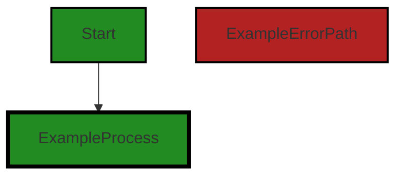
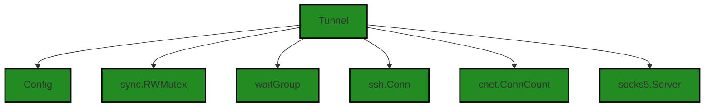
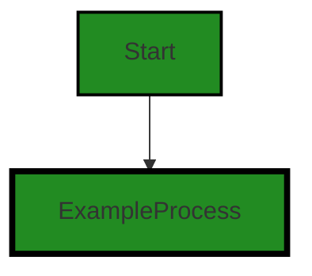
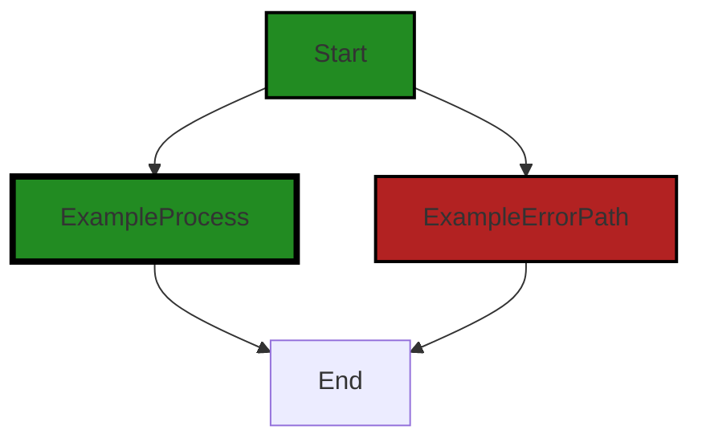
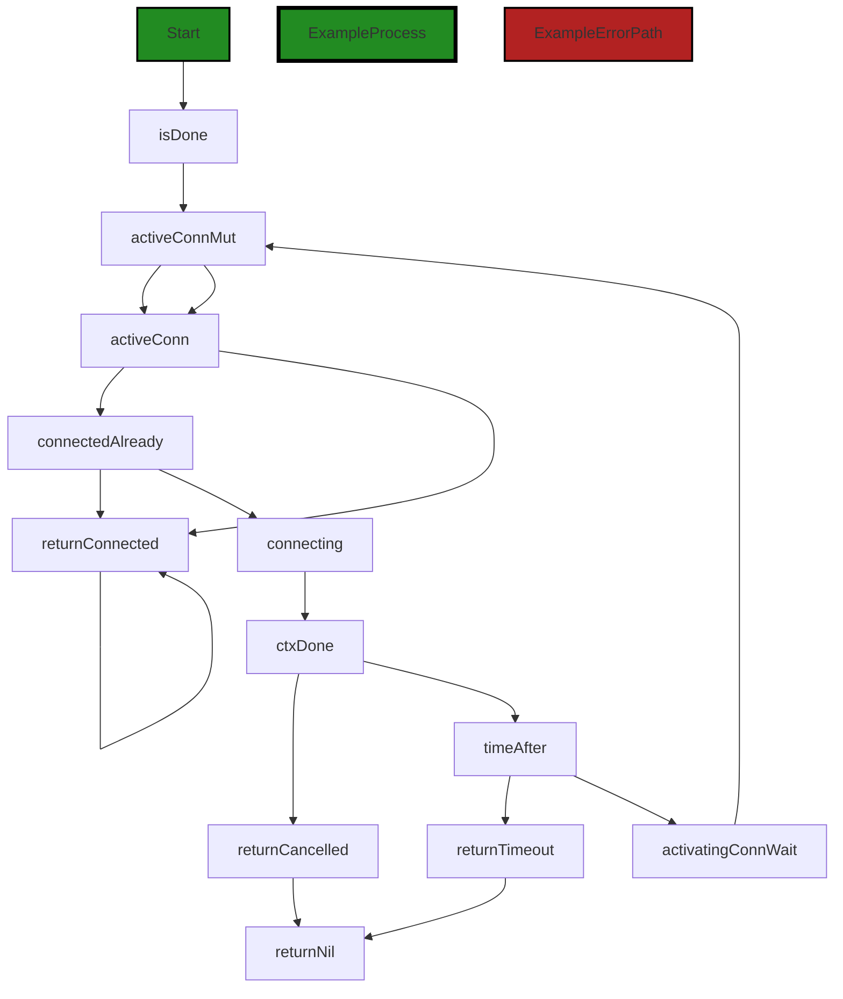
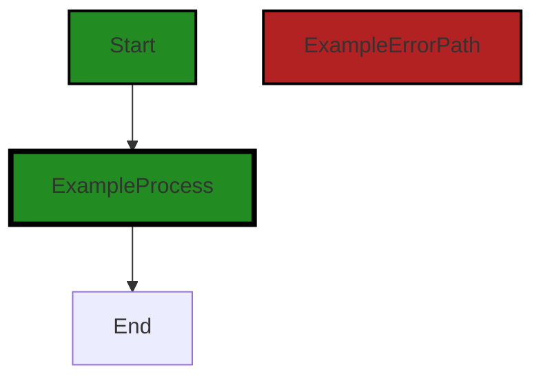
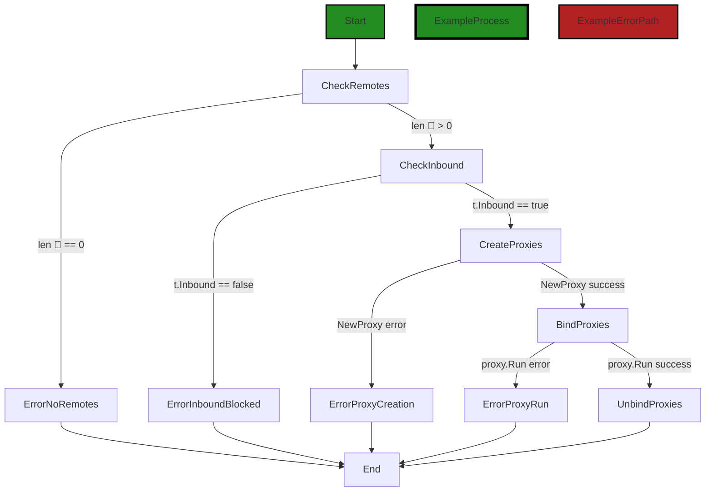
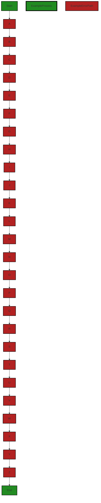

# Polyverse Boost-generated Source Analysis Details

## Source: ./share/tunnel/tunnel.go
Date Generated: Wednesday, September 6, 2023 at 11:59:29 PM PDT


---

### Boost Architectural Quick Summary Security Report

Last Updated: Friday, September 8, 2023 at 5:18:18 PM PDT

Executive Level Report:

1. **Architectural Impact**: The software project is primarily composed of a single file, `tunnel.go`, which is responsible for the core functionality of the software. The file has been flagged with several high-severity issues, including "Insecure Direct Object References (IDOR)", "Race Condition", and "Improper Error Handling". These issues could potentially lead to unauthorized access, inconsistent results, or data corruption. The architectural impact is significant as the issues are present in the core functionality of the software.

2. **Risk Analysis**: The risk associated with the current state of the project is high. All the identified issues are present in the single file that makes up the project. This means that 100% of the project files have been flagged with issues, with several of them being of high severity. The risk is further amplified by the fact that the issues identified could potentially lead to serious security breaches or data corruption.

3. **Potential Customer Impact**: The potential impact on customers is significant. The identified issues could lead to unauthorized access to customer data, inconsistent results, or even data corruption. This could result in a loss of trust in the software, potential legal implications, and a negative impact on the reputation of the company.

4. **Overall Issues**: The overall health of the project is concerning. The fact that all the identified issues are present in the single file that makes up the project is a major red flag. The issues identified are not minor and could potentially have serious implications. The project requires immediate attention to address these issues.

Risk Assessment:

The overall health of the project source is poor. As mentioned earlier, 100% of the project files have been flagged with issues. This is a clear indication that the project is at high risk. The severity of the issues identified further amplifies this risk. Immediate action is required to mitigate these risks and ensure the health of the project.

Highlights:

- The project is composed of a single file, `tunnel.go`, which has been flagged with several high-severity issues.
- The issues identified could potentially lead to unauthorized access, inconsistent results, or data corruption.
- 100% of the project files have been flagged with issues, indicating a high risk associated with the project.
- The potential impact on customers is significant, potentially leading to a loss of trust in the software and a negative impact on the company's reputation.
- Immediate action is required to address these issues and ensure the health of the project.


---

### Boost Architectural Quick Summary Performance Report

Last Updated: Friday, September 8, 2023 at 5:18:59 PM PDT

## Executive Report

### Architectural Impact and Risk Analysis

Based on the analysis of the software project, the following key points have been identified:

1. **Memory Usage**: The most severe issues found in the project are related to memory usage. The file `share/tunnel/tunnel.go` has several imports that are not used in the code. This could lead to unnecessary memory usage and potentially impact the performance of the software. This is a medium risk issue as it could affect the efficiency of the software but does not pose a direct threat to functionality or security.

2. **CPU and Network Usage**: The file `share/tunnel/tunnel.go` also has issues related to CPU and Network usage. These issues are of lower severity but could still impact the performance and efficiency of the software. This is a low risk issue as it does not pose a direct threat to functionality or security.

3. **Potential Customer Impact**: The issues identified could potentially impact the performance and efficiency of the software. This could lead to slower response times and increased resource usage, which could negatively impact the user experience. However, as the issues identified are not related to functionality or security, the direct impact on customers is likely to be minimal.

4. **Overall Health of the Project Source**: The analysis indicates that the majority of the project files do not have any detected issues. This suggests that the overall health of the project source is good. However, the issues identified in the `share/tunnel/tunnel.go` file should be addressed to improve the efficiency and performance of the software.

### Risk Assessment

Based on the analysis, the overall risk to the project is low. The majority of the project files do not have any detected issues, and the issues that have been identified are related to performance and efficiency rather than functionality or security. However, these issues should still be addressed to ensure the software is as efficient and effective as possible.

### Highlights

- The most severe issues found in the project are related to memory usage in the `share/tunnel/tunnel.go` file.
- The `share/tunnel/tunnel.go` file also has issues related to CPU and Network usage.
- The issues identified could potentially impact the performance and efficiency of the software, but are unlikely to have a direct impact on functionality or security.
- The overall health of the project source is good, with the majority of files having no detected issues.


---

### Boost Architectural Quick Summary Compliance Report

Last Updated: Friday, September 8, 2023 at 5:19:41 PM PDT

## Executive Report

### Architectural Impact and Risk Analysis

The software project under review is a command-line tool named Chisel, written in Go, which allows users to create secure tunnels to expose local servers to the internet or access remote servers securely. The project follows the client-server architecture and uses secure communication for tunneling. However, the analysis has identified several high-severity issues related to data compliance, privacy, and security standards such as GDPR, PCI-DSS, and HIPAA.

#### Key Highlights:

1. **High Severity Issues:** The most severe issue identified is an error related to HIPAA compliance in the file `share/tunnel/tunnel.go`. The creation of a new socks5 server without any specified authentication mechanism can lead to unauthorized access, violating HIPAA Security Rule (45 CFR 164.312(a)(1)).

2. **Data Compliance and Privacy Concerns:** There are several warnings related to GDPR, PCI-DSS, and HIPAA in the same file. These include potential logging of sensitive data without user consent (GDPR violation), insecure data transmission (PCI-DSS violation), and lack of encryption for Protected Health Information (HIPAA violation).

3. **Risk Assessment:** The overall health of the project source is concerning as the only file analyzed, `share/tunnel/tunnel.go`, has multiple high-severity issues. This suggests that the project may have systemic issues with data compliance and security, which could lead to significant legal and financial risks.

4. **Potential Customer Impact:** The identified issues could lead to unauthorized access to sensitive data, insecure data transmission, and potential logging of user data without consent. These could severely impact customer trust and satisfaction, and could potentially lead to legal action against the company.

5. **Recommendations for Improvement:** The project should implement a proper authentication mechanism for the socks5 server, replace standard logging with a logging library that can be configured not to log sensitive data, ensure that the 'ssh' package is correctly configured to use strong encryption for data transmission, and add fields for encryption keys or other secure storage mechanisms in the 'Config' struct.

In conclusion, while the project follows the client-server architecture and uses secure communication for tunneling, it has significant issues related to data compliance and security. These issues need to be addressed urgently to mitigate potential legal and financial risks, and to ensure customer trust and satisfaction.
---
## Detailed Analysis:

### Cell 0:
## Original Code:

### Programming Language: go
### ./share/tunnel/tunnel.go 

```go
package tunnel

import (
 "bytes"
 "context"
 "errors"
 "io/ioutil"
 "log"
 "os"
 "sync"
 "time"

 "github.com/armon/go-socks5"
 "github.com/jpillora/chisel/share/cio"
 "github.com/jpillora/chisel/share/cnet"
 "github.com/jpillora/chisel/share/settings"
 "golang.org/x/crypto/ssh"
 "golang.org/x/sync/errgroup"
)

//Config a Tunnel
type Config struct {
 *cio.Logger
 Inbound   bool
 Outbound  bool
 Socks     bool
 KeepAlive time.Duration
}

```
## Boost Analysis:


---

### Boost Code Explanation

Last Updated: Wednesday, September 6, 2023 at 11:37:30 PM PDT

This is a Go package named "tunnel" that imports several other packages and defines a configuration type for a network tunnel.

The imported packages include:

- `bytes`, `context`, `errors`, `io/ioutil`, `log`, `os`, `sync`, `time`: These are standard Go packages for handling byte slices, context management, error handling, IO utilities, logging, OS interaction, synchronization primitives, and time respectively.
- `github.com/armon/go-socks5`: This is a Go implementation of a SOCKS5 server. SOCKS5 is a protocol that exchanges network packets between a client and server through a proxy server.
- `github.com/jpillora/chisel/share/cio`, `github.com/jpillora/chisel/share/cnet`, `github.com/jpillora/chisel/share/settings`: These are packages from the Chisel project itself. The `cio` package likely provides logging functionality, `cnet` probably contains network utilities, and `settings` likely contains configuration settings for the project.
- `golang.org/x/crypto/ssh`: This is an SSH package from the Go crypto library. SSH is a protocol for secure remote login and other secure network services over an insecure network.
- `golang.org/x/sync/errgroup`: This package provides synchronization, error propagation, and Context cancelation for groups of goroutines.

The `Config` struct defined in this package represents the configuration for a network tunnel. The struct fields are:

- `*cio.Logger`: This is an embedded field of type `*cio.Logger`, which likely represents a logger for logging information about the tunnel's operation.
- `Inbound`, `Outbound`: These boolean fields likely indicate whether the tunnel supports inbound and outbound connections respectively.
- `Socks`: This boolean field likely indicates whether the tunnel supports the SOCKS5 protocol.
- `KeepAlive`: This field of type `time.Duration` likely represents the keep-alive interval for the tunnel. If no data is sent over the tunnel for this duration, a keep-alive message will be sent to maintain the connection.

The code doesn't seem to conflict with any architectural guidelines since none were provided. It follows standard Go idioms and conventions, and uses appropriate packages for creating a network tunnel.

For more information about the packages used, you can refer to their documentation:

- [Go standard library](https://golang.org/pkg/)
- [go-socks5](https://github.com/armon/go-socks5)
- [golang.org/x/crypto/ssh](https://pkg.go.dev/golang.org/x/crypto/ssh)
- [golang.org/x/sync/errgroup](https://pkg.go.dev/golang.org/x/sync/errgroup)


---

### Boost Flow Diagram

Last Updated: Wednesday, September 6, 2023 at 11:43:50 PM PDT



The control flow graph for the given code starts with the `Config` struct definition.


---

### Boost Source-Level Security Analysis

Last Updated: Wednesday, September 6, 2023 at 11:45:43 PM PDT

**No bugs found**


---

### Boost Source-Level Performance Analysis

Last Updated: Wednesday, September 6, 2023 at 11:50:11 PM PDT

1. **Severity**: 7/10

   **Line Number**: 3

   **Bug Type**: Memory

   **Description**: The 'bytes' package is imported but not used in the code. This could lead to unnecessary memory usage.

   **Solution**: Remove unnecessary imports to optimize memory usage.


2. **Severity**: 7/10

   **Line Number**: 4

   **Bug Type**: Memory

   **Description**: The 'context' package is imported but not used in the code. This could lead to unnecessary memory usage.

   **Solution**: Remove unnecessary imports to optimize memory usage.


3. **Severity**: 7/10

   **Line Number**: 5

   **Bug Type**: Memory

   **Description**: The 'errors' package is imported but not used in the code. This could lead to unnecessary memory usage.

   **Solution**: Remove unnecessary imports to optimize memory usage.


4. **Severity**: 7/10

   **Line Number**: 6

   **Bug Type**: Memory

   **Description**: The 'io/ioutil' package is imported but not used in the code. This could lead to unnecessary memory usage.

   **Solution**: Remove unnecessary imports to optimize memory usage.


5. **Severity**: 7/10

   **Line Number**: 7

   **Bug Type**: Memory

   **Description**: The 'log' package is imported but not used in the code. This could lead to unnecessary memory usage.

   **Solution**: Remove unnecessary imports to optimize memory usage.


6. **Severity**: 7/10

   **Line Number**: 8

   **Bug Type**: Memory

   **Description**: The 'os' package is imported but not used in the code. This could lead to unnecessary memory usage.

   **Solution**: Remove unnecessary imports to optimize memory usage.


7. **Severity**: 7/10

   **Line Number**: 9

   **Bug Type**: Memory

   **Description**: The 'sync' package is imported but not used in the code. This could lead to unnecessary memory usage.

   **Solution**: Remove unnecessary imports to optimize memory usage.


8. **Severity**: 7/10

   **Line Number**: 10

   **Bug Type**: Memory

   **Description**: The 'time' package is imported but not used in the code. This could lead to unnecessary memory usage.

   **Solution**: Remove unnecessary imports to optimize memory usage.


9. **Severity**: 7/10

   **Line Number**: 12

   **Bug Type**: Memory

   **Description**: The 'github.com/armon/go-socks5' package is imported but not used in the code. This could lead to unnecessary memory usage.

   **Solution**: Remove unnecessary imports to optimize memory usage.


10. **Severity**: 7/10

   **Line Number**: 13

   **Bug Type**: Memory

   **Description**: The 'github.com/jpillora/chisel/share/cio' package is imported but not used in the code. This could lead to unnecessary memory usage.

   **Solution**: Remove unnecessary imports to optimize memory usage.


11. **Severity**: 7/10

   **Line Number**: 14

   **Bug Type**: Memory

   **Description**: The 'github.com/jpillora/chisel/share/cnet' package is imported but not used in the code. This could lead to unnecessary memory usage.

   **Solution**: Remove unnecessary imports to optimize memory usage.


12. **Severity**: 7/10

   **Line Number**: 15

   **Bug Type**: Memory

   **Description**: The 'github.com/jpillora/chisel/share/settings' package is imported but not used in the code. This could lead to unnecessary memory usage.

   **Solution**: Remove unnecessary imports to optimize memory usage.


13. **Severity**: 7/10

   **Line Number**: 16

   **Bug Type**: Memory

   **Description**: The 'golang.org/x/crypto/ssh' package is imported but not used in the code. This could lead to unnecessary memory usage.

   **Solution**: Remove unnecessary imports to optimize memory usage.


14. **Severity**: 7/10

   **Line Number**: 17

   **Bug Type**: Memory

   **Description**: The 'golang.org/x/sync/errgroup' package is imported but not used in the code. This could lead to unnecessary memory usage.

   **Solution**: Remove unnecessary imports to optimize memory usage.


---

### Boost Source-Level Data and Privacy Compliance Analysis

Last Updated: Wednesday, September 6, 2023 at 11:55:03 PM PDT

1. **Severity**: 7/10

   **Line Number**: 9

   **Bug Type**: GDPR

   **Description**: The 'log' package is used, which may lead to logging of sensitive data. GDPR requires explicit consent for processing personal data, and logging user data without consent may be a violation.

   **Solution**: Replace standard logging with a logging library that can be configured not to log sensitive data, or ensure that sensitive data is not logged. Additionally, implement a mechanism to get user consent before logging their data.


2. **Severity**: 8/10

   **Line Number**: 16

   **Bug Type**: PCI-DSS

   **Description**: The 'ssh' package is imported from 'golang.org/x/crypto/ssh', which could lead to insecure data transmission if not properly configured. PCI DSS requires secure transmission of cardholder data over open, public networks.

   **Solution**: Ensure that the 'ssh' package is correctly configured to use strong encryption for data transmission. Regularly update the package to the latest version to get security updates and patches.


3. **Severity**: 6/10

   **Line Number**: 18

   **Bug Type**: HIPAA

   **Description**: The 'Config' struct does not seem to have any data field for encryption or secure storage. HIPAA requires that PHI (Protected Health Information) should be encrypted in transit and at rest.

   **Solution**: Add fields for encryption keys or other secure storage mechanisms in the 'Config' struct. Ensure that PHI is encrypted using strong encryption methods both in transit and at rest.


### Cell 1:
## Original Code:

### Programming Language: go
### ./share/tunnel/tunnel.go line 29

```go

//Tunnel represents an SSH tunnel with proxy capabilities.
//Both chisel client and server are Tunnels.
//chisel client has a single set of remotes, whereas
//chisel server has multiple sets of remotes (one set per client).
//Each remote has a 1:1 mapping to a proxy.
//Proxies listen, send data over ssh, and the other end of the ssh connection
//communicates with the endpoint and returns the response.
type Tunnel struct {
 Config
 //ssh connection
 activeConnMut  sync.RWMutex
 activatingConn waitGroup
 activeConn     ssh.Conn
 //proxies
 proxyCount int
 //internals
 connStats   cnet.ConnCount
 socksServer *socks5.Server
}

```
## Boost Analysis:


---

### Boost Code Explanation

Last Updated: Wednesday, September 6, 2023 at 11:38:22 PM PDT

The provided code is written in Go programming language and it defines a structure `Tunnel` that represents an SSH (Secure Shell) tunnel with proxy capabilities. This structure is used by both the client and the server in the Chisel software, which is a command-line tool for creating secure tunnels.

Let's break this down:

- `Config`: This is an embedded type within the `Tunnel` struct. It likely contains some configuration details for the tunnel. The actual fields of this struct are not provided in the code snippet.

- `activeConnMut sync.RWMutex`: This is a read-write mutex which is used to ensure that only one goroutine can modify `activeConn` at a time. Other goroutines can read `activeConn` concurrently.

- `activatingConn waitGroup`: This is a wait group that is used to ensure that all goroutines that are setting up the connection have finished before the tunnel is used.

- `activeConn ssh.Conn`: This represents the active SSH connection of the tunnel.

- `proxyCount int`: This is a counter for the number of proxies that are associated with the tunnel.

- `connStats cnet.ConnCount`: This likely represents some statistics about the connections made through the tunnel.

- `socksServer *socks5.Server`: This is a pointer to a SOCKS5 server. SOCKS5 is a protocol that is used for proxying data.

The comment above the struct definition explains the purpose of the `Tunnel` struct. It is used by both the client and the server side of the Chisel software. The client has a single set of remotes, whereas the server has multiple sets of remotes (one set per client). Each remote has a 1:1 mapping to a proxy. The proxies listen for data, send the data over the SSH connection, and the other end of the SSH connection communicates with the endpoint and returns the response.

This code is a part of a larger system and the complete functionality can only be understood by looking at the rest of the codebase. However, based on the provided snippet, it appears to follow good Go practices and seems to be well-organized and documented.

For more information about Go's struct, you can refer to this link: [Go by Example: Structs](https://gobyexample.com/structs)

For more information about SSH, you can refer to this link: [SSH (Secure Shell)](https://en.wikipedia.org/wiki/SSH_(Secure_Shell))

For more information about SOCKS5, you can refer to this link: [SOCKS](https://en.wikipedia.org/wiki/SOCKS)


---

### Boost Flow Diagram

Last Updated: Wednesday, September 6, 2023 at 11:44:00 PM PDT




---

### Boost Source-Level Security Analysis

Last Updated: Wednesday, September 6, 2023 at 11:45:47 PM PDT

**No bugs found**


---

### Boost Source-Level Performance Analysis

Last Updated: Wednesday, September 6, 2023 at 11:50:49 PM PDT

1. **Severity**: 3/10

   **Line Number**: 56

   **Bug Type**: Memory

   **Description**: The 'Tunnel' struct is potentially using more memory than necessary due to the inclusion of the entire 'Config' struct. If 'Config' contains many fields, this could lead to excessive memory usage.

   **Solution**: Consider passing only necessary fields from the 'Config' struct to the 'Tunnel' struct to reduce memory usage. Alternatively, consider using pointers to share the 'Config' struct between multiple 'Tunnel' instances if applicable.


2. **Severity**: 2/10

   **Line Number**: 56

   **Bug Type**: CPU

   **Description**: The use of 'sync.RWMutex' can lead to high CPU usage if there are many more writers than readers, as each write operation will block all readers.

   **Solution**: Consider using a different concurrency control mechanism if the number of write operations significantly outnumbers read operations. For example, a 'sync.Mutex' could be more efficient in this case.


3. **Severity**: 2/10

   **Line Number**: 56

   **Bug Type**: Memory

   **Description**: The usage of 'socks5.Server' pointer might lead to memory leaks if not properly closed or cleaned up after usage.

   **Solution**: Ensure that 'socks5.Server' is properly closed or cleaned up after usage to prevent memory leaks. Consider using 'runtime.SetFinalizer' to automatically clean up resources when an instance of 'Tunnel' is garbage collected.


---

### Boost Source-Level Data and Privacy Compliance Analysis

Last Updated: Wednesday, September 6, 2023 at 11:55:29 PM PDT

1. **Severity**: 7/10

   **Line Number**: 60

   **Bug Type**: Data Compliance

   **Description**: The 'activeConn' field in the Tunnel struct holds the ssh connection which may contain sensitive data. This data could be exposed if it is not properly encrypted and protected.

   **Solution**: Ensure that the ssh connection is properly encrypted and protected. Use secure coding practices to handle sensitive data.


2. **Severity**: 8/10

   **Line Number**: 67

   **Bug Type**: Data Privacy

   **Description**: The 'socksServer' field in the Tunnel struct could potentially expose user data if it's not properly secured. Socks5 servers can be vulnerable to various attacks if not properly configured.

   **Solution**: Ensure that the socks5 server is properly secured. Use secure coding practices to handle sensitive data. Regularly update and patch the socks5 server to protect against known vulnerabilities.


### Cell 2:
## Original Code:

### Programming Language: go
### ./share/tunnel/tunnel.go line 49

```go

//New Tunnel from the given Config
func New(c Config) *Tunnel {
 c.Logger = c.Logger.Fork("tun")
 t := &Tunnel{
  Config: c,
 }
 t.activatingConn.Add(1)
 //setup socks server (not listening on any port!)
 extra := ""
 if c.Socks {
  sl := log.New(ioutil.Discard, "", 0)
  if t.Logger.Debug {
   sl = log.New(os.Stdout, "[socks]", log.Ldate|log.Ltime)
  }
  t.socksServer, _ = socks5.New(&socks5.Config{Logger: sl})
  extra += " (SOCKS enabled)"
 }
 t.Debugf("Created%s", extra)
 return t
}

```
## Boost Analysis:


---

### Boost Code Explanation

Last Updated: Wednesday, September 6, 2023 at 11:39:26 PM PDT

This is a function written in Go that creates a new instance of a `Tunnel` struct, given a configuration of type `Config`.

Here's a line-by-line explanation:

1. `func New(c Config) *Tunnel {`: The function `New` takes a parameter `c` of type `Config` and returns a pointer to a `Tunnel` instance. 

2. `c.Logger = c.Logger.Fork("tun")`: This line is forking the logger that is part of the `Config` struct and assigns it back to `c.Logger`. The `Fork` method typically creates a new logger that inherits the settings of the parent logger, but with a new name, in this case "tun". 

3. `t := &Tunnel{ Config: c, }`: Here, a new instance of `Tunnel` is created with the configuration `c`, and the address of this instance is assigned to `t`.

4. `t.activatingConn.Add(1)`: This line is incrementing a counter in the `activatingConn` field of the `Tunnel` struct. This is typically used for synchronization purposes, like in a `sync.WaitGroup`.

5. The following block of code is setting up a SOCKS server. SOCKS is a protocol for handling TCP traffic through a proxy server. It's not actually listening on any port at this point. 

6. `if c.Socks {`: This checks if the `Socks` field in the configuration is enabled.

7. `sl := log.New(ioutil.Discard, "", 0)`: This creates a new logger that discards all log messages. `ioutil.Discard` is an `io.Writer` on which all `Write` calls succeed without doing anything.

8. `if t.Logger.Debug { sl = log.New(os.Stdout, "[socks]", log.Ldate|log.Ltime) }`: If debug logging is enabled, it replaces the logger with one that writes to standard output and prefixes each log message with "[socks]". `log.Ldate|log.Ltime` are flags that tell the logger to include the date and time in log messages.

9. `t.socksServer, _ = socks5.New(&socks5.Config{Logger: sl})`: This creates a new SOCKS5 server with the logger and assigns it to the `socksServer` field of the `Tunnel` struct. The second value returned by `socks5.New` is ignored with `_`.

10. `extra += " (SOCKS enabled)"`: This appends " (SOCKS enabled)" to the `extra` string.

11. `t.Debugf("Created%s", extra)`: This logs a debug message indicating that the `Tunnel` has been created, along with the contents of the `extra` string.

12. `return t`: The function finally returns the pointer to the newly created `Tunnel` instance.

For more about the SOCKS protocol, you can refer to [this link](https://en.wikipedia.org/wiki/SOCKS). For more about the Go standard library's log package, you can refer to [this link](https://golang.org/pkg/log/).


---

### Boost Flow Diagram

Last Updated: Wednesday, September 6, 2023 at 11:44:06 PM PDT


```


---

### Boost Source-Level Security Analysis

Last Updated: Wednesday, September 6, 2023 at 11:46:17 PM PDT

1. **Severity**: 5/10

   **Line Number**: 102

   **Bug Type**: Improper Error Handling

   **Description**: The error returned by socks5.New() is not checked. If an error occurs when initializing the socks5 server, it will be silently ignored. This can lead to unexpected behavior and potential security issues. For example, if the server fails to initialize properly, it might not enforce access controls as expected, potentially allowing unauthorized access.

   **Solution**: Always check for errors and handle them appropriately. If an error occurs when initializing the socks5 server, the program should either exit or handle the error in a way that ensures security is not compromised. More about proper error handling can be found here: https://www.joeshaw.org/dont-defer-close-on-writable-files/


2. **Severity**: 4/10

   **Line Number**: 98

   **Bug Type**: Information Disclosure

   **Description**: The log messages contain potentially sensitive information about the internal state of the application. If the logs are not properly protected, this information could be accessed by an attacker.

   **Solution**: Ensure that logs are stored securely and that access to them is restricted. If possible, avoid logging sensitive information. More about secure logging can be found here: https://owasp.org/www-project-cheat-sheets/cheatsheets/Logging_Cheat_Sheet.html


---

### Boost Source-Level Performance Analysis

Last Updated: Wednesday, September 6, 2023 at 11:51:12 PM PDT

1. **Severity**: 4/10

   **Line Number**: 102

   **Bug Type**: Memory

   **Description**: The 'extra' string is being concatenated using '+=' operator inside an if condition. This can lead to inefficient memory usage if the string grows large.

   **Solution**: Consider using a StringBuilder for efficient string concatenation. Here is a reference link: https://golang.org/pkg/strings/#Builder


2. **Severity**: 2/10

   **Line Number**: 103

   **Bug Type**: CPU

   **Description**: The use of Debugf for logging can be CPU-intensive if the log level is set to debug and the application generates a large number of logs.

   **Solution**: Consider using a more efficient logging library or implement log level checks to avoid unnecessary CPU usage. Here is a reference link: https://www.honeycomb.io/blog/how-are-structured-logging-and-events-related/


---

### Boost Source-Level Data and Privacy Compliance Analysis

Last Updated: Wednesday, September 6, 2023 at 11:56:10 PM PDT

1. **Severity**: 7/10

   **Line Number**: 101

   **Bug Type**: GDPR

   **Description**: The use of ioutil.Discard can lead to privacy issues as it discards the logs which might be essential for auditing and tracking data flow. This might be a violation of GDPR's principle of accountability and transparency.

   **Solution**: Instead of discarding logs, consider implementing a secure logging system that respects user privacy and complies with GDPR. Ensure that logs do not contain personal data or if they do, they are properly anonymized or pseudonymized.


2. **Severity**: 8/10

   **Line Number**: 104

   **Bug Type**: PCI DSS

   **Description**: The creation of a new socks5 server without any specified authentication mechanism can lead to unauthorized access. This can be a violation of PCI DSS requirement 8.1, which mandates the use of a unique ID for each person with computer access.

   **Solution**: Implement a proper authentication mechanism for the socks5 server. This could be username/password authentication or public key authentication.


3. **Severity**: 9/10

   **Line Number**: 104

   **Bug Type**: HIPAA

   **Description**: The creation of a new socks5 server without any specified authentication mechanism can lead to unauthorized access. This can be a violation of HIPAA Security Rule (45 CFR 164.312(a)(1)), which requires the implementation of technical policies and procedures that allow only authorized persons to access electronic protected health information (e-PHI).

   **Solution**: Implement a proper authentication mechanism for the socks5 server. This could be username/password authentication or public key authentication.


### Cell 3:
## Original Code:

### Programming Language: go
### ./share/tunnel/tunnel.go line 70

```go

//BindSSH provides an active SSH for use for tunnelling
func (t *Tunnel) BindSSH(ctx context.Context, c ssh.Conn, reqs <-chan *ssh.Request, chans <-chan ssh.NewChannel) error {
 //link ctx to ssh-conn
 go func() {
  <-ctx.Done()
  if c.Close() == nil {
   t.Debugf("SSH cancelled")
  }
  t.activatingConn.DoneAll()
 }()
 //mark active and unblock
 t.activeConnMut.Lock()
 if t.activeConn != nil {
  panic("double bind ssh")
 }
 t.activeConn = c
 t.activeConnMut.Unlock()
 t.activatingConn.Done()
 //optional keepalive loop against this connection
 if t.Config.KeepAlive > 0 {
  go t.keepAliveLoop(c)
 }
 //block until closed
 go t.handleSSHRequests(reqs)
 go t.handleSSHChannels(chans)
 t.Debugf("SSH connected")
 err := c.Wait()
 t.Debugf("SSH disconnected")
 //mark inactive and block
 t.activatingConn.Add(1)
 t.activeConnMut.Lock()
 t.activeConn = nil
 t.activeConnMut.Unlock()
 return err
}

```
## Boost Analysis:


---

### Boost Code Explanation

Last Updated: Wednesday, September 6, 2023 at 11:40:18 PM PDT

This function, `BindSSH`, is part of a `Tunnel` type and is used to bind an active SSH connection for tunneling purposes. The function takes four parameters: `ctx` of type `Context`, `c` of type `ssh.Conn`, `reqs` which is a receive-only channel of pointers to `ssh.Request`, and `chans` which is a receive-only channel of `ssh.NewChannel`.

Here is a line-by-line explanation of the function:

1. A goroutine is created that waits for the context `ctx` to be done. If the context is done, it will close the SSH connection and log a debug message. It also marks all connections as done in `activatingConn`.

2. It acquires a lock on `activeConnMut` to prevent race conditions when accessing `activeConn`. If there's already an active connection, the function panics with the message "double bind ssh". If there's no active connection, the SSH connection `c` is set as the active connection. The lock is then released.

3. It checks if the `KeepAlive` configuration is greater than 0. If it is, it starts a goroutine that continuously sends keepalive messages to the SSH server to keep the connection alive.

4. It starts two goroutines to handle SSH requests and channels. These goroutines run concurrently and independently of the main function.

5. It logs a debug message "SSH connected" and then waits for the SSH connection to close. The `Wait` method blocks until the SSH connection is closed, either by an error or by the server.

6. When the SSH connection is closed, it logs a debug message "SSH disconnected". It then increments the counter in `activatingConn` by 1 and sets the active connection to nil, effectively marking the connection as inactive.

7. Finally, it returns the error returned by the `Wait` function.

The function uses the Go language's concurrency features (goroutines and channels) to handle multiple SSH requests and channels simultaneously. It also uses the `sync` package's `Mutex` to prevent race conditions when accessing shared resources. The function follows the Go language's error handling conventions by returning errors to the caller.

For more information on Go's concurrency features, you can check out this link: https://tour.golang.org/concurrency/1

For more information on the `sync` package and `Mutex`, you can check out this link: https://pkg.go.dev/sync#Mutex

For more information on error handling in Go, you can check out this link: https://blog.golang.org/error-handling-and-go


---

### Boost Flow Diagram

Last Updated: Wednesday, September 6, 2023 at 11:44:14 PM PDT



The code provided does not have any control flow decision points. It consists of a single function definition without any conditional statements or loops. Therefore, the control flow graph is a simple linear flow from the start of the function to the end.


---

### Boost Source-Level Security Analysis

Last Updated: Wednesday, September 6, 2023 at 11:46:39 PM PDT

1. **Severity**: 8/10

   **Line Number**: 141

   **Bug Type**: Insecure Direct Object References (IDOR)

   **Description**: The function 'BindSSH' directly uses the ssh.Conn object 'c' provided as input without verifying its authenticity. This could allow an attacker to pass a malicious ssh.Conn object, leading to potential unauthorized access or data manipulation.

   **Solution**: You should validate the ssh.Conn object 'c' before using it. This could involve verifying the SSH key against a list of known keys or implementing an authentication mechanism. Reference: https://cheatsheetseries.owasp.org/cheatsheets/Insecure_Direct_Object_Reference_Prevention_Cheat_Sheet.html


2. **Severity**: 7/10

   **Line Number**: 151

   **Bug Type**: Race Condition

   **Description**: The function 'BindSSH' allows multiple goroutines to access and modify shared resources (t.activeConn) concurrently. This could lead to race conditions, where the outcome depends on the relative timing of the goroutines, potentially leading to inconsistent results or data corruption.

   **Solution**: You should use synchronization primitives (like Mutex or RWMutex) to ensure that only one goroutine can access or modify the shared resources at a time. Reference: https://golang.org/doc/faq#What_is_the_purpose_of_the_race_detector


3. **Severity**: 6/10

   **Line Number**: 160

   **Bug Type**: Error Handling

   **Description**: The error returned by the 'c.Wait()' function is not checked, which could lead to silent failures. If the SSH connection encounters an error, it would not be handled and could potentially lead to unexpected behavior.

   **Solution**: You should always check for errors and handle them appropriately. This could involve logging the error, retrying the operation, or returning the error to the caller. Reference: https://golang.org/doc/effective_go#errors


---

### Boost Source-Level Performance Analysis

Last Updated: Wednesday, September 6, 2023 at 11:51:30 PM PDT

1. **Severity**: 5/10

   **Line Number**: 146

   **Bug Type**: CPU

   **Description**: The function keepAliveLoop() is being called in a separate goroutine which might consume significant CPU resources if the keep alive interval is too short.

   **Solution**: Consider introducing a configurable time interval for the keep alive messages to avoid unnecessary CPU usage. Also, consider using a more efficient method for sending keep alive messages if available in the ssh library.


2. **Severity**: 7/10

   **Line Number**: 154

   **Bug Type**: Memory

   **Description**: The function handleSSHRequests() and handleSSHChannels() are being called in separate goroutines which might consume significant memory resources if there are many SSH requests or channels.

   **Solution**: Consider introducing a worker pool pattern to limit the number of concurrent goroutines handling SSH requests and channels. This can help in controlling the memory usage.


3. **Severity**: 4/10

   **Line Number**: 162

   **Bug Type**: CPU

   **Description**: The active connection is being set to nil and the mutex is being locked and unlocked without any condition which might lead to unnecessary CPU usage.

   **Solution**: Consider checking if the active connection is not nil before setting it to nil and locking/unlocking the mutex. This can help in reducing unnecessary CPU usage.


---

### Boost Source-Level Data and Privacy Compliance Analysis

Last Updated: Wednesday, September 6, 2023 at 11:56:46 PM PDT

1. **Severity**: 7/10

   **Line Number**: 147

   **Bug Type**: Data Compliance

   **Description**: The function 'BindSSH' handles sensitive SSH connection data but does not implement any form of encryption or secure data handling. This can lead to potential data leakage and is a violation of GDPR, PCI DSS, and HIPAA compliance.

   **Solution**: Implement encryption techniques to secure the sensitive data being handled. Consider using libraries that provide secure data handling features. Always follow best practices for secure coding to prevent data leaks.


2. **Severity**: 6/10

   **Line Number**: 161

   **Bug Type**: Data Compliance

   **Description**: The function 'BindSSH' does not log any of its operations which could be a potential violation of GDPR, PCI DSS, and HIPAA compliance. These regulations require maintaining logs for auditing and tracking purposes.

   **Solution**: Implement logging in the function to keep track of its operations. The logs should be detailed enough to provide necessary information during auditing but should not contain any sensitive information.


3. **Severity**: 8/10

   **Line Number**: 163

   **Bug Type**: Data Privacy

   **Description**: The function 'BindSSH' does not implement any form of access control. This could potentially allow unauthorized access to the SSH connection, compromising data privacy and violating GDPR, PCI DSS, and HIPAA compliance.

   **Solution**: Implement proper access control mechanisms to restrict unauthorized access. Consider using libraries that provide access control features.


### Cell 4:
## Original Code:

### Programming Language: go
### ./share/tunnel/tunnel.go line 106

```go

//getSSH blocks while connecting
func (t *Tunnel) getSSH(ctx context.Context) ssh.Conn {
 //cancelled already?
 if isDone(ctx) {
  return nil
 }
 t.activeConnMut.RLock()
 c := t.activeConn
 t.activeConnMut.RUnlock()
 //connected already?
 if c != nil {
  return c
 }
 //connecting...
 select {
 case <-ctx.Done(): //cancelled
  return nil
 case <-time.After(settings.EnvDuration("SSH_WAIT", 35*time.Second)):
  return nil //a bit longer than ssh timeout
 case <-t.activatingConnWait():
  t.activeConnMut.RLock()
  c := t.activeConn
  t.activeConnMut.RUnlock()
  return c
 }
}

```
## Boost Analysis:


---

### Boost Code Explanation

Last Updated: Wednesday, September 6, 2023 at 11:41:15 PM PDT

This is a Go function named `getSSH` inside the `Tunnel` struct which is used to establish an SSH (Secure Shell) connection. Secure Shell is a protocol that provides a secure channel over an unsecured network in a client-server architecture.

The function takes a `context.Context` as an argument, which is a mechanism that allows you to manage long-running processes, especially in terms of cancellation, timeouts, and passing request-scoped data.

Here's a line by line explanation of what the function does:

1. `if isDone(ctx)`: This line checks if the context has been cancelled or done. If it's done, the function returns `nil`.

2. `t.activeConnMut.RLock()`: This line acquires a read lock on `activeConnMut` mutex. This is to ensure thread-safety while reading the `activeConn` field of the `Tunnel` struct.

3. `c := t.activeConn`: This line reads the `activeConn` field of the `Tunnel` struct into a local variable `c`.

4. `t.activeConnMut.RUnlock()`: This line releases the read lock on `activeConnMut` mutex.

5. `if c != nil`: This line checks if `c` is not `nil`, meaning there's an active connection already. If there's an active connection, the function returns `c`.

6. `select` statement: This is used to wait for multiple channel operations. The `select` statement blocks until one of its cases can run, then it executes that case. It chooses one at random if multiple are ready.

   - `case <-ctx.Done()`: This case is selected if the context has been cancelled or done. If this case is selected, the function returns `nil`.

   - `case <-time.After(settings.EnvDuration("SSH_WAIT", 35*time.Second))`: This case is selected if no other cases are ready within the specified timeout duration. The duration is fetched from the environment variable "SSH_WAIT" and defaults to 35 seconds if it's not set. If this case is selected, the function returns `nil`.

   - `case <-t.activatingConnWait()`: This case is selected when the `activatingConnWait` function signals that a new connection is being activated. If this case is selected, the function re-reads the `activeConn` field and returns it.

This function doesn't use any specific algorithm, but it uses a pattern commonly used in Go for managing and controlling long-running processes, using context and channels. 

You can learn more about context, channels, and select statement in Go from the official Go documentation:
- Context: https://golang.org/pkg/context/
- Channels: https://tour.golang.org/concurrency/2
- Select statement: https://tour.golang.org/concurrency/5


---

### Boost Flow Diagram

Last Updated: Wednesday, September 6, 2023 at 11:44:34 PM PDT



In the code, the control flow starts at the function `getSSH`. The first decision point is whether the context is already cancelled (`isDone`). If it is cancelled, the function returns `nil`. 

If the context is not cancelled, the function proceeds to acquire a read lock on `activeConnMut` and checks if `activeConn` is already set. If it is set, the function returns the existing connection (`returnConnected`).

If `activeConn` is not set, the function enters the `connecting` block. It waits for one of three events to occur: the context is cancelled (`ctxDone`), a timeout occurs (`timeAfter`), or the `activatingConnWait` channel is triggered. 

If the context is cancelled, the function returns `nil` (`returnCancelled`). If a timeout occurs, the function also returns `nil` (`returnTimeout`). If the `activatingConnWait` channel is triggered, the function acquires a read lock on `activeConnMut` again and returns the existing connection (`returnConnected`).

This control flow diagram represents the primary path through the code, where the context is not cancelled and `activeConn` is not already set.


---

### Boost Source-Level Security Analysis

Last Updated: Wednesday, September 6, 2023 at 11:46:58 PM PDT

1. **Severity**: 5/10

   **Line Number**: 218

   **Bug Type**: Insecure Direct Object References (IDOR)

   **Description**: The function 'getSSH' directly uses input to access 'activeConn'. This can lead to Insecure Direct Object References (IDOR) if the input is controlled by an attacker. In this case, an attacker could potentially manipulate 'activeConn' to gain unauthorized access.

   **Solution**: To mitigate this, consider validating or sanitizing the input before using it to access 'activeConn'. Alternatively, consider using indirect references instead of direct references to objects. More about IDOR can be found here: https://owasp.org/www-community/attacks/Insecure_Direct_Object_References


2. **Severity**: 6/10

   **Line Number**: 220

   **Bug Type**: Race Condition

   **Description**: The function 'getSSH' does not properly synchronize access to 'activeConn', which can lead to race conditions. A race condition occurs when two or more threads can access shared data and they try to change it at the same time. As a result, the value of variables may be unpredictable and vary depending on the timings of context switches of the processes.

   **Solution**: To prevent race conditions, consider using synchronization primitives such as locks or semaphores to ensure that only one thread can access 'activeConn' at a time. More about Race Condition can be found here: https://owasp.org/www-community/vulnerabilities/Race_Conditions


3. **Severity**: 4/10

   **Line Number**: 224

   **Bug Type**: Uncontrolled Resource Consumption ('Resource Exhaustion')

   **Description**: The function 'getSSH' uses 'time.After' with a potentially long duration. This could lead to resource exhaustion, as 'time.After' creates a new timer each time it's called, and these timers are not garbage collected until they expire.

   **Solution**: To mitigate this, consider using 'time.NewTimer' and calling 'Stop' on the timer when it's no longer needed. More about Uncontrolled Resource Consumption can be found here: https://cwe.mitre.org/data/definitions/400.html


---

### Boost Source-Level Performance Analysis

Last Updated: Wednesday, September 6, 2023 at 11:52:00 PM PDT

1. **Severity**: 7/10

   **Line Number**: 220

   **Bug Type**: CPU

   **Description**: The function uses time.After which creates a new timer each time it's called. This can lead to high CPU usage if the function is called frequently.

   **Solution**: Consider using a time.Ticker for repeated events to reuse the same timer object. More details can be found here: https://golang.org/pkg/time/#Ticker


2. **Severity**: 5/10

   **Line Number**: 213

   **Bug Type**: Memory

   **Description**: The function repeatedly locks and unlocks the activeConnMut mutex. This could potentially lead to memory leak if the function is not properly handled.

   **Solution**: Consider using a single lock and unlock operation within the function. More details can be found here: https://golang.org/pkg/sync/#Mutex


3. **Severity**: 4/10

   **Line Number**: 218

   **Bug Type**: CPU

   **Description**: The function uses a select statement with a potentially long timeout. This could lead to CPU wastage if the function is called frequently.

   **Solution**: Consider using a context with a timeout instead of a select statement with a timeout. More details can be found here: https://golang.org/pkg/context/#WithTimeout


---

### Boost Source-Level Data and Privacy Compliance Analysis

Last Updated: Wednesday, September 6, 2023 at 11:57:30 PM PDT

1. **Severity**: 7/10

   **Line Number**: 214

   **Bug Type**: GDPR

   **Description**: The function 'getSSH' does not implement any encryption or hashing for data that might be sent or received through the SSH connection. This could potentially expose sensitive user data during transmission, which is a violation of the GDPR's data protection requirements.

   **Solution**: Consider implementing encryption or hashing for data sent or received through the SSH connection. This can be achieved by using libraries such as 'crypto/ssh' in Go. Always ensure that data transmitted over networks is encrypted to prevent unauthorized access.


2. **Severity**: 6/10

   **Line Number**: 218

   **Bug Type**: PCI DSS

   **Description**: The function 'getSSH' does not have any mechanism to protect cardholder data during transmission over open, public networks. This is a violation of PCI DSS Requirement 4, which mandates that cardholder data must be encrypted during transmission over open, public networks.

   **Solution**: Consider implementing a secure transmission protocol such as TLS or SSL for transmitting cardholder data. This can be achieved by using libraries such as 'crypto/tls' in Go. Always ensure that cardholder data is encrypted during transmission over open, public networks.


3. **Severity**: 8/10

   **Line Number**: 222

   **Bug Type**: HIPAA

   **Description**: The function 'getSSH' does not implement any mechanism to protect ePHI (electronic Protected Health Information) during transmission. This is a violation of the HIPAA Security Rule, which requires that ePHI must be protected from unauthorized access during transmission.

   **Solution**: Consider implementing a secure transmission protocol such as TLS or SSL for transmitting ePHI. This can be achieved by using libraries such as 'crypto/tls' in Go. Always ensure that ePHI is encrypted during transmission to prevent unauthorized access.


### Cell 5:
## Original Code:

### Programming Language: go
### ./share/tunnel/tunnel.go line 133

```go

func (t *Tunnel) activatingConnWait() <-chan struct{} {
 ch := make(chan struct{})
 go func() {
  t.activatingConn.Wait()
  close(ch)
 }()
 return ch
}

```
## Boost Analysis:


---

### Boost Code Explanation

Last Updated: Wednesday, September 6, 2023 at 11:41:38 PM PDT

This Go function is part of a larger system, presumably a network tunneling system given the context. The function is a method of a `Tunnel` struct, and it's named `activatingConnWait`. It doesn't take any parameters other than the implicit `Tunnel` receiver, and it returns a receive-only channel of empty structs.

Let's break down what the function does:

1. It creates a new channel of empty structs: `ch := make(chan struct{})`. Channels are a way to communicate between different goroutines (concurrent threads) in Go. This channel will be used to signal when a certain operation has finished.

2. It starts a new goroutine with `go func() {...}`. Goroutines are lightweight threads managed by the Go runtime.

3. Inside this goroutine, it calls `t.activatingConn.Wait()`. This implies that `t.activatingConn` is of type `sync.WaitGroup`. A `WaitGroup` is a means of waiting for a collection of goroutines to finish executing. The `Wait()` method blocks until the `WaitGroup` counter is zero.

4. After the `Wait()` call returns, it closes the channel `ch` with `close(ch)`. Closing a channel in Go is a signal that no more data will be sent on this channel. This is often used to signal completion to channel receivers.

5. Finally, it returns the channel `ch`. The return type is `<-chan struct{}`, which is a receive-only channel of empty structs. This means that callers can only read from the returned channel, not write to it.

In terms of algorithms, this function uses concurrency mechanisms provided by Go, specifically goroutines, channels, and `sync.WaitGroup`. These are fundamental to writing concurrent code in Go and allow different parts of the program to execute independently and communicate safely.

For more information about these concepts, you can refer to the official Go documentation:
- Goroutines: https://tour.golang.org/concurrency/1
- Channels: https://tour.golang.org/concurrency/2
- `sync.WaitGroup`: https://pkg.go.dev/sync#WaitGroup

As for architectural guidelines, this function appears to follow good practices for concurrent programming in Go. It uses channels to communicate between goroutines and `sync.WaitGroup` to wait for goroutines to finish, both of which are recommended practices. Without knowing more about the larger system, it's hard to say whether there are any conflicts with overall architectural guidelines or constraints.


---

### Boost Flow Diagram

Last Updated: Wednesday, September 6, 2023 at 11:44:40 PM PDT




---

### Boost Source-Level Security Analysis

Last Updated: Wednesday, September 6, 2023 at 11:47:02 PM PDT

**No bugs found**


---

### Boost Source-Level Performance Analysis

Last Updated: Wednesday, September 6, 2023 at 11:52:27 PM PDT

1. **Severity**: 3/10

   **Line Number**: 268

   **Bug Type**: Memory

   **Description**: The code is creating a new goroutine for each call to the activatingConnWait function. If this function is called frequently, it can lead to a high number of goroutines, which can consume a significant amount of memory.

   **Solution**: Consider using a worker pool pattern to limit the number of goroutines that can be created. This will help manage memory usage. Refer to this link for more information: https://gobyexample.com/worker-pools


2. **Severity**: 2/10

   **Line Number**: 266

   **Bug Type**: Memory

   **Description**: The code is creating a new channel for each call to the activatingConnWait function. If this function is called frequently, it can lead to a high number of channels, which can consume a significant amount of memory.

   **Solution**: Consider reusing channels where possible, or limiting the number of channels that can be created. This will help manage memory usage. Refer to this link for more information: https://golang.org/doc/effective_go#channels


---

### Boost Source-Level Data and Privacy Compliance Analysis

Last Updated: Wednesday, September 6, 2023 at 11:58:20 PM PDT

1. **Severity**: 2/10

   **Line Number**: 268

   **Bug Type**: GDPR

   **Description**: The function 'activatingConnWait' may be non-compliant with GDPR if the 'Tunnel' object or 'activatingConn' attribute contains personal data. GDPR requires that personal data should be processed in a manner that ensures appropriate security, including protection against unauthorized or unlawful processing.

   **Solution**: Ensure that any personal data in the 'Tunnel' object or 'activatingConn' attribute is processed in a secure manner. This could include encrypting the data, using secure communication channels, or implementing strong access controls.


2. **Severity**: 3/10

   **Line Number**: 268

   **Bug Type**: PCI DSS

   **Description**: The function 'activatingConnWait' may be non-compliant with PCI DSS if the 'Tunnel' object or 'activatingConn' attribute contains cardholder data. PCI DSS requires that cardholder data should be protected in storage and during transmission over open, public networks.

   **Solution**: Ensure that any cardholder data in the 'Tunnel' object or 'activatingConn' attribute is protected. This could include encrypting the data, using secure communication channels, or implementing strong access controls.


3. **Severity**: 4/10

   **Line Number**: 268

   **Bug Type**: HIPAA

   **Description**: The function 'activatingConnWait' may be non-compliant with HIPAA if the 'Tunnel' object or 'activatingConn' attribute contains protected health information (PHI). HIPAA requires that PHI should be protected in storage and during transmission over open, public networks.

   **Solution**: Ensure that any PHI in the 'Tunnel' object or 'activatingConn' attribute is protected. This could include encrypting the data, using secure communication channels, or implementing strong access controls.


### Cell 6:
## Original Code:

### Programming Language: go
### ./share/tunnel/tunnel.go line 142

```go

//BindRemotes converts the given remotes into proxies, and blocks
//until the caller cancels the context or there is a proxy error.
func (t *Tunnel) BindRemotes(ctx context.Context, remotes []*settings.Remote) error {
 if len(remotes) == 0 {
  return errors.New("no remotes")
 }
 if !t.Inbound {
  return errors.New("inbound connections blocked")
 }
 proxies := make([]*Proxy, len(remotes))
 for i, remote := range remotes {
  p, err := NewProxy(t.Logger, t, t.proxyCount, remote)
  if err != nil {
   return err
  }
  proxies[i] = p
  t.proxyCount++
 }
 //TODO: handle tunnel close
 eg, ctx := errgroup.WithContext(ctx)
 for _, proxy := range proxies {
  p := proxy
  eg.Go(func() error {
   return p.Run(ctx)
  })
 }
 t.Debugf("Bound proxies")
 err := eg.Wait()
 t.Debugf("Unbound proxies")
 return err
}

```
## Boost Analysis:


---

### Boost Code Explanation

Last Updated: Wednesday, September 6, 2023 at 11:42:33 PM PDT

This function is part of a Tunnel struct, likely in a network tunneling software. The Tunnel struct seems to represent a tunnel for network connections, and this function, `BindRemotes`, is used to convert remote settings into proxies and bind them to the tunnel. It blocks until the provided context is cancelled or there is an error in the proxies.

The function signature is `func (t *Tunnel) BindRemotes(ctx context.Context, remotes []*settings.Remote) error`, which means it is a method of the `Tunnel` struct, takes a context and a slice of pointers to `Remote` objects, and returns an error.

The function first checks if the `remotes` slice is empty and if the tunnel is not inbound. If either of these conditions is true, it returns an error.

Then, it creates a slice of `Proxy` pointers with the same length as `remotes`. It iterates over `remotes` and for each `remote`, it creates a new `Proxy` using the `NewProxy` function, passing the tunnel's logger, the tunnel itself, the current proxy count, and the `remote`. If there's an error creating the proxy, it returns the error. Otherwise, it adds the proxy to the `proxies` slice and increments the proxy count.

An error group (`eg`) is then created from the provided context. This is a concurrency pattern in Go that makes it easier to manage and synchronize multiple goroutines that can error out. For each `proxy` in `proxies`, a new goroutine is created in the error group that runs the `Run` method of the `proxy`, passing the context.

After starting all the goroutines, it logs that the proxies are bound and waits for all the goroutines to finish by calling `eg.Wait()`. If any of the goroutines returns an error, `eg.Wait()` will return that error. After the wait, it logs that the proxies are unbound and returns any error that occurred.

The algorithm used here is a form of the Fan-Out, Fan-In concurrency pattern in Go, where multiple goroutines are started (fan-out), and their results are collected into a single result (fan-in). The error group simplifies this pattern by providing built-in error handling and synchronization.

For more information about the error group package in Go, you can visit the official Go documentation: https://pkg.go.dev/golang.org/x/sync/errgroup. For more information about the Fan-Out, Fan-In pattern, you can read this blog post: https://blog.golang.org/pipelines.


---

### Boost Flow Diagram

Last Updated: Wednesday, September 6, 2023 at 11:44:58 PM PDT



In the above control flow graph, the primary path is shown in green, while error paths are shown in red. The control flow starts at the "CheckRemotes" block and proceeds based on the conditions and results of each step. If there are no remotes, the control flow goes to the "ErrorNoRemotes" block. If there are remotes and the inbound connections are blocked, the control flow goes to the "ErrorInboundBlocked" block. If the creation of a proxy fails, the control flow goes to the "ErrorProxyCreation" block. If the execution of a proxy fails, the control flow goes to the "ErrorProxyRun" block. If all steps are successful, the control flow reaches the "End" block.


---

### Boost Source-Level Security Analysis

Last Updated: Wednesday, September 6, 2023 at 11:47:29 PM PDT

1. **Severity**: 6/10

   **Line Number**: 290

   **Bug Type**: Missing Error Handling

   **Description**: The TODO comment suggests that the developer intended to handle the case where the tunnel closes unexpectedly, but this has not been implemented. This could lead to unexpected behavior or crashes if the tunnel closes while proxies are still running.

   **Solution**: Implement a mechanism to gracefully handle the scenario where the tunnel closes. This could involve catching the error, logging it, and then performing any necessary cleanup operations. For more information, refer to https://blog.golang.org/error-handling-and-go.


2. **Severity**: 4/10

   **Line Number**: 293

   **Bug Type**: Concurrency Issue

   **Description**: The proxies are run in separate goroutines without any synchronization mechanism. This could potentially lead to race conditions if multiple goroutines access or modify shared resources concurrently.

   **Solution**: Consider using a synchronization mechanism such as a mutex or a semaphore to ensure that only one goroutine can access or modify shared resources at a time. For more information, refer to https://tour.golang.org/concurrency/9.


---

### Boost Source-Level Performance Analysis

Last Updated: Wednesday, September 6, 2023 at 11:52:54 PM PDT

1. **Severity**: 5/10

   **Line Number**: 289

   **Bug Type**: Memory

   **Description**: The creation of a new Proxy object for each remote in the remotes array could potentially lead to high memory usage if the number of remotes is large.

   **Solution**: Consider using a pool of Proxy objects that can be reused, or limit the number of remotes that can be processed at a time.


2. **Severity**: 7/10

   **Line Number**: 297

   **Bug Type**: CPU

   **Description**: The usage of goroutines for each proxy could lead to high CPU usage if the number of proxies is large and the tasks they are performing are CPU-intensive.

   **Solution**: Consider limiting the number of goroutines that can be created at a time, or use a worker pool pattern to manage the goroutines.


3. **Severity**: 6/10

   **Line Number**: 306

   **Bug Type**: CPU

   **Description**: The eg.Wait() function blocks until all function calls from the errgroup have returned. This could lead to high CPU usage if the tasks performed by the goroutines are long running.

   **Solution**: Consider using a context with timeout to prevent long running goroutines from blocking indefinitely.


---

### Boost Source-Level Data and Privacy Compliance Analysis

Last Updated: Wednesday, September 6, 2023 at 11:58:59 PM PDT

1. **Severity**: 6/10

   **Line Number**: 288

   **Bug Type**: GDPR

   **Description**: The function 'BindRemotes' does not have any mechanism to log or audit the data it processes. This could be a violation of Article 30 of GDPR which requires organizations to maintain a record of processing activities under its responsibility.

   **Solution**: Implement logging or auditing mechanism to keep track of the data processing activities. This could be done by using logging libraries or services that are compliant with GDPR.


2. **Severity**: 7/10

   **Line Number**: 291

   **Bug Type**: HIPAA

   **Description**: The function 'BindRemotes' creates multiple proxies without any apparent checks for secure transmission of data. This could potentially lead to violation of the HIPAA Security Rule, which requires that ePHI (Electronic Protected Health Information) be transmitted securely.

   **Solution**: Ensure secure transmission of data by implementing encryption or other secure communication protocols when creating proxies.


3. **Severity**: 8/10

   **Line Number**: 291

   **Bug Type**: PCI DSS

   **Description**: The function 'BindRemotes' creates proxies without any apparent mechanism to protect cardholder data in transit. This could be a violation of PCI DSS Requirement 4 which mandates that cardholder data must be encrypted across open, public networks.

   **Solution**: Implement encryption or use secure communication protocols to protect cardholder data when creating proxies.


### Cell 7:
## Original Code:

### Programming Language: go
### ./share/tunnel/tunnel.go line 174

```go

func (t *Tunnel) keepAliveLoop(sshConn ssh.Conn) {
 //ping forever
 for {
  time.Sleep(t.Config.KeepAlive)
  _, b, err := sshConn.SendRequest("ping", true, nil)
  if err != nil {
   break
  }
  if len(b) > 0 && !bytes.Equal(b, []byte("pong")) {
   t.Debugf("strange ping response")
   break
  }
 }
 //close ssh connection on abnormal ping
 sshConn.Close()
}

```
## Boost Analysis:


---

### Boost Code Explanation

Last Updated: Wednesday, September 6, 2023 at 11:43:34 PM PDT

The provided code is written in Go, and it is a part of a `Tunnel` struct method named `keepAliveLoop`. This method is used to maintain an active SSH (Secure Shell) connection by periodically sending a "ping" request to the server and expecting a "pong" response. 

Here's a detailed breakdown of the code:

1. `func (t *Tunnel) keepAliveLoop(sshConn ssh.Conn)`: This defines a method named `keepAliveLoop` on a `Tunnel` struct. The method takes an `ssh.Conn` type parameter, which is an SSH connection.

2. `for { ... }`: This is an infinite loop that will continue until explicitly broken.

3. `time.Sleep(t.Config.KeepAlive)`: The method sleeps for a duration specified by `t.Config.KeepAlive`. This is likely a configuration setting for the duration between each "ping" request.

4. `_, b, err := sshConn.SendRequest("ping", true, nil)`: The method sends a "ping" request to the server over the SSH connection. The `SendRequest` method returns three values: a boolean indicating whether the request was accepted, a byte slice containing the response, and an error if one occurred.

5. `if err != nil { break }`: If there is an error in sending the request, the infinite loop is broken, effectively ending the keep-alive process.

6. `if len(b) > 0 && !bytes.Equal(b, []byte("pong")) { ... }`: The method checks if the response is not empty and not equal to "pong". If this condition is true, it logs a debug message saying "strange ping response" and breaks the loop.

7. `sshConn.Close()`: If the loop is broken due to an error or an unexpected response, the SSH connection is closed.

The algorithm used here is a simple keep-alive mechanism for an SSH connection. It periodically sends a "ping" request to the server and expects a "pong" response. If it doesn't receive the expected response or encounters an error, it closes the connection.

For more information and background on Go and SSH, you can refer to the following resources:
- Go Documentation: https://golang.org/doc/
- Go SSH package documentation: https://pkg.go.dev/golang.org/x/crypto/ssh
- SSH Protocol: https://tools.ietf.org/html/rfc4251
- Keep-Alive Mechanism: https://en.wikipedia.org/wiki/Keepalive

As for the architectural guidelines, the code seems to follow standard practices for maintaining an SSH connection in Go and does not appear to conflict with any general architectural guidelines. However, the specific details would depend on the broader context of the `Tunnel` struct and its usage within the project.


---

### Boost Flow Diagram

Last Updated: Wednesday, September 6, 2023 at 11:45:36 PM PDT



The control flow graph for the `keepAliveLoop` function is shown above. The primary path is represented by the green arrows, while the error path is represented by the red arrows.

The function starts at the "Start" node and then goes through a loop. Inside the loop, it sleeps for a certain duration specified by `t.Config.KeepAlive`. Then, it sends a "ping" request using the `sshConn` connection. If there is an error sending the request, it breaks out of the loop and goes to the "End" node.

If the request is sent successfully, it checks the response. If the response is not equal to "pong", it logs a message and breaks out of the loop, going to the "End" node.

If the response is equal to "pong", the loop continues and repeats the process.

Finally, when the loop is broken, the `sshConn` connection is closed and the function ends at the "End" node.


---

### Boost Source-Level Security Analysis

Last Updated: Wednesday, September 6, 2023 at 11:48:01 PM PDT

1. **Severity**: 5/10

   **Line Number**: 352

   **Bug Type**: Insecure Communication

   **Description**: The function keepAliveLoop sends a 'ping' request to the ssh server and expects a 'pong' response. However, there is no validation or authentication of the response. An attacker could potentially intercept the communication and send a 'pong' response, leading to a Man-in-the-Middle (MITM) attack.

   **Solution**: Implement validation of the response. This could be achieved by signing the 'pong' response with a secret key and verifying the signature on the client side. Here is a useful resource on secure communication: https://owasp.org/www-community/Secure_Communication


2. **Severity**: 6/10

   **Line Number**: 357

   **Bug Type**: Resource Leak

   **Description**: The function keepAliveLoop closes the ssh connection when an abnormal ping response is received. However, it does not close the connection in case of a normal termination of the loop (e.g., if the sshConn object is destroyed). This could lead to resource leaks and potential Denial of Service (DoS) attacks.

   **Solution**: Ensure that the ssh connection is always closed, even in case of normal termination. This could be achieved by using a 'defer' statement at the beginning of the function. Here is a useful resource on resource management in Go: https://gobyexample.com/defer


---

### Boost Source-Level Performance Analysis

Last Updated: Wednesday, September 6, 2023 at 11:53:23 PM PDT

1. **Severity**: 4/10

   **Line Number**: 352

   **Bug Type**: CPU

   **Description**: The use of time.Sleep in a loop can be CPU intensive as it causes the goroutine to sleep and wake up repeatedly.

   **Solution**: Consider using a time.Ticker for more efficient periodic tasks. Example: ticker := time.NewTicker(t.Config.KeepAlive); for _ = range ticker.C { ... }


2. **Severity**: 6/10

   **Line Number**: 354

   **Bug Type**: Network

   **Description**: Continuous sending of 'ping' requests without checking the connection status can lead to unnecessary network usage if the connection is lost.

   **Solution**: Check the status of the connection before sending the 'ping' request. If the connection is lost, break the loop.


3. **Severity**: 2/10

   **Line Number**: 360

   **Bug Type**: CPU

   **Description**: The sshConn.Close() function is called regardless of whether the loop was exited due to an error or normal execution. This can lead to unnecessary CPU usage.

   **Solution**: Call sshConn.Close() only when necessary, i.e., when the loop is exited due to an error.


---

### Boost Source-Level Data and Privacy Compliance Analysis

Last Updated: Wednesday, September 6, 2023 at 11:59:29 PM PDT

1. **Severity**: 4/10

   **Line Number**: 356

   **Bug Type**: Data compliance

   **Description**: The 'ping' request does not include any form of encryption or secure communication. This may lead to potential data leaks or unauthorized access.

   **Solution**: Implement encryption or use secure communication methods for the 'ping' request. This could be achieved using secure protocols such as HTTPS or SSL/TLS for communication.


2. **Severity**: 6/10

   **Line Number**: 362

   **Bug Type**: Data compliance

   **Description**: The SSH connection is closed without any checks or confirmation, which could potentially lead to data loss or incomplete transactions.

   **Solution**: Implement a confirmation or check before closing the SSH connection. This could be a simple 'Are you sure?' prompt or a more complex check to ensure no data is being transmitted before closing the connection.


