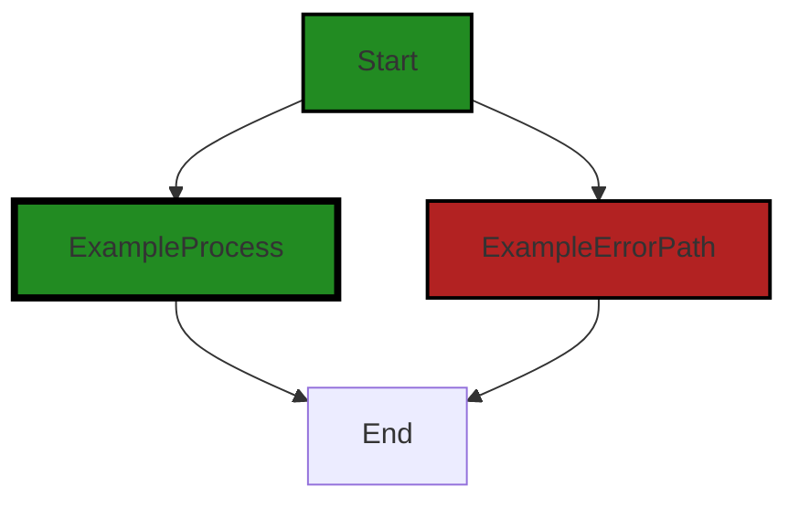
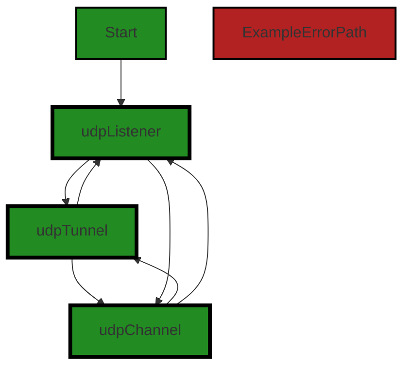
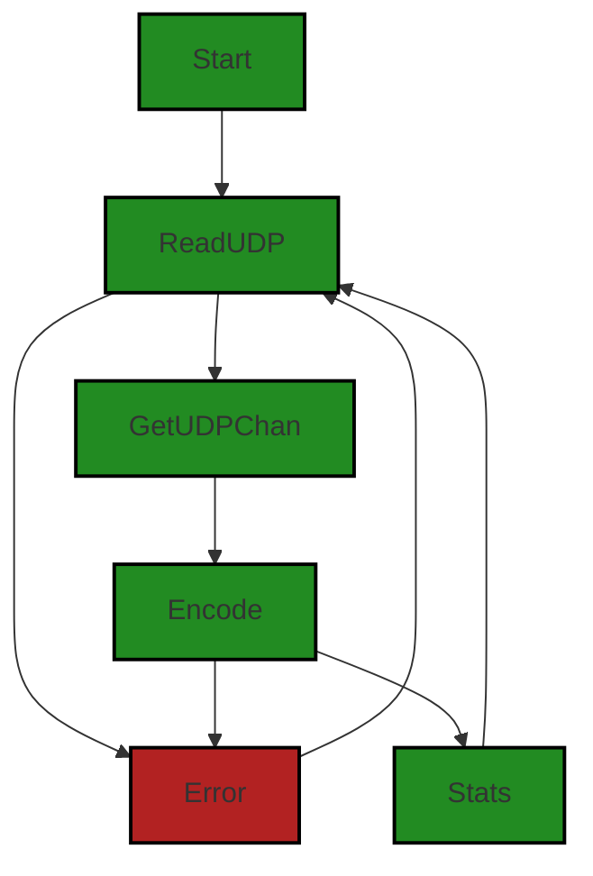
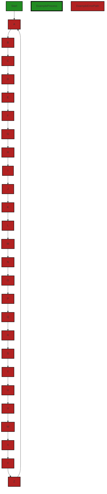
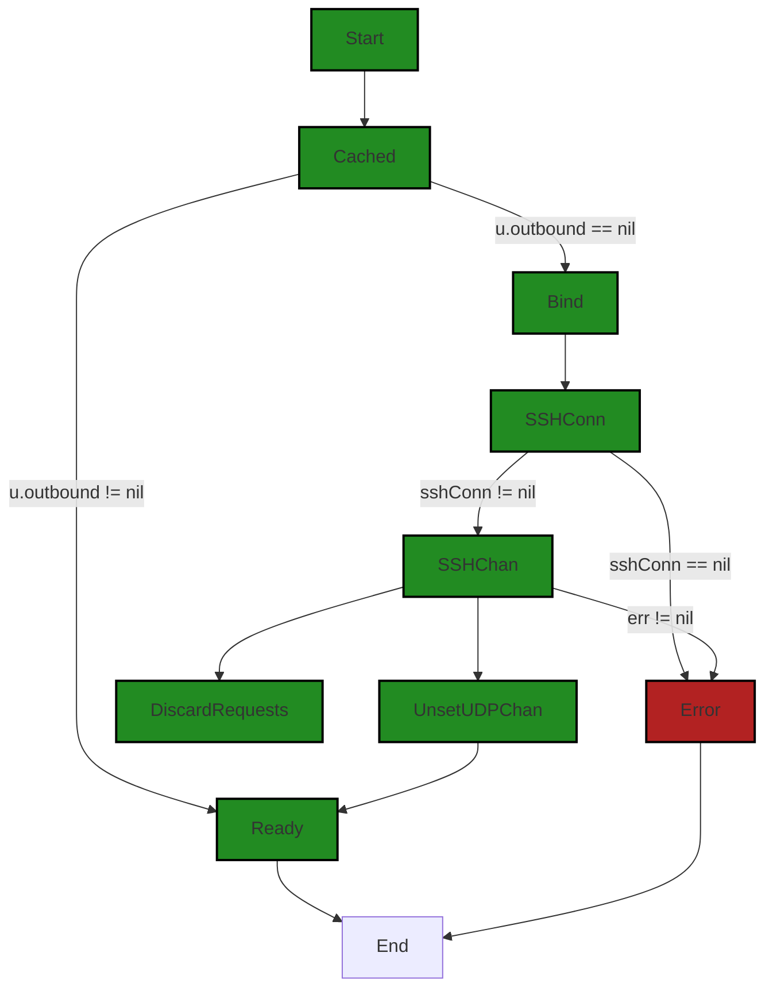
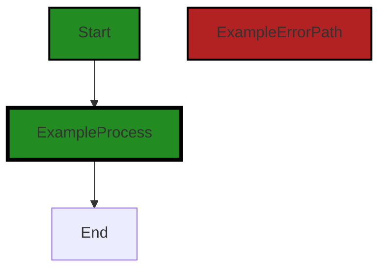

# Polyverse Boost-generated Source Analysis Details

## Source: ./share/tunnel/tunnel_in_proxy_udp.go
Date Generated: Wednesday, September 6, 2023 at 11:35:31 PM PDT


---

### Boost Architectural Quick Summary Security Report

Last Updated: Friday, September 8, 2023 at 5:35:54 PM PDT

Executive Level Report:

1. **Architectural Impact**: The project is based on a client-server architecture and uses secure communication for tunneling. However, the analysis has identified a critical issue related to Uncontrolled Resource Consumption ('Resource Exhaustion') in the file `tunnel_in_proxy_udp.go`. This could potentially lead to a buffer overflow and potential Denial of Service (DoS) or even Remote Code Execution (RCE) if an attacker can control the payload. This issue could impact the overall architecture of the project, as it could compromise the security and stability of the system.

2. **Risk Analysis**: The risk associated with the identified issues is high. The most severe issue, Uncontrolled Resource Consumption, is categorized as an 'Error' severity level, indicating a significant risk if not addressed. Additionally, the file `tunnel_in_proxy_udp.go` has multiple issues of varying severity levels, indicating a concentration of risk in this part of the codebase.

3. **Potential Customer Impact**: If left unaddressed, these issues could lead to potential security breaches, system instability, and degraded performance. This could result in a negative customer experience, loss of trust, and potential legal and financial repercussions.

4. **Overall Issues**: The project has a total of 1 file, and all of them have been identified with issues of varying severity levels. This indicates a need for a thorough review and remediation of the codebase to ensure the overall health of the project.

Risk Assessment:

- **Overall Health of the Project Source**: Given that 100% of the project files have issues, the overall health of the project source is concerning. The presence of high-severity issues in the codebase indicates a need for immediate attention and remediation.

Highlights of the Analysis:

1. **High Severity Issues**: The project has a high-severity issue related to Uncontrolled Resource Consumption in the file `tunnel_in_proxy_udp.go`. This issue could potentially lead to a buffer overflow and potential Denial of Service (DoS) or even Remote Code Execution (RCE).

2. **Concentration of Issues**: The file `tunnel_in_proxy_udp.go` has multiple issues of varying severity levels, indicating a concentration of risk in this part of the codebase.

3. **Potential Security Risks**: The use of environment variables to set configuration options such as 'UDP_MAX_SIZE' can lead to security issues if an attacker is able to manipulate these values. This could potentially lead to buffer overflow attacks.

4. **Overall Project Health**: Given that 100% of the project files have issues, the overall health of the project source is concerning. The presence of high-severity issues in the codebase indicates a need for immediate attention and remediation.

5. **Potential Customer Impact**: If left unaddressed, these issues could lead to potential security breaches, system instability, and degraded performance. This could result in a negative customer experience, loss of trust, and potential legal and financial repercussions.


---

### Boost Architectural Quick Summary Performance Report

Last Updated: Friday, September 8, 2023 at 5:36:31 PM PDT

## Executive Report

### Overview

The software project under review is a command-line tool named Chisel, written in Go. It allows users to create secure tunnels to expose local servers to the internet or access remote servers securely. The project follows the client-server architecture and uses secure communication for tunneling.

### Architectural Impact and Risk Analysis

1. **High CPU Usage in Critical Functionality:** The file `share/tunnel/tunnel_in_proxy_udp.go` has been flagged for high CPU usage. This file appears to be a critical part of the software, handling the tunneling functionality. High CPU usage in this area could lead to performance issues, especially under heavy load. This could potentially impact the user experience and the overall performance of the software.

2. **Memory and Network Issues:** The same file, `share/tunnel/tunnel_in_proxy_udp.go`, also has been flagged for memory and network issues. These issues could potentially lead to inefficient resource usage and could impact the software's performance and reliability.

3. **Percentage of Files with Issues:** Only one file has been flagged with issues out of the entire project. This indicates that the majority of the project files are free from severe issues, suggesting a relatively healthy state of the project source. However, the fact that the flagged file is a critical part of the software increases the overall risk.

4. **Potential Customer Impact:** The issues identified could potentially impact the performance and reliability of the software, which could in turn affect the user experience. If left unaddressed, these issues could lead to customer dissatisfaction and potential loss of users.

### Recommendations

Given the potential impact of the issues identified, it is recommended to prioritize addressing these issues. Specifically, the high CPU usage in the `getUDPChan` function in the `share/tunnel/tunnel_in_proxy_udp.go` file should be addressed to improve the performance of the software. Consider caching the result of `getUDPChan` if it's not changing frequently.

### Conclusion

Overall, the project appears to be in a relatively healthy state, with the majority of the project files free from severe issues. However, the issues identified in the `share/tunnel/tunnel_in_proxy_udp.go` file should be addressed to ensure the performance and reliability of the software.


---

### Boost Architectural Quick Summary Compliance Report

Last Updated: Friday, September 8, 2023 at 5:37:22 PM PDT

Executive Level Report:

1. **Architectural Impact**: The software project, a command-line tool named Chisel, is designed to create secure tunnels for internet communication. However, the analysis reveals that the project is using the UDP protocol for communication, which is not secure. This could potentially compromise the integrity of the data being transmitted and the overall security of the software architecture. 

2. **Risk Analysis**: The most severe issues found in the project are related to HIPAA and PCI DSS compliance. These issues are present in the file "share/tunnel/tunnel_in_proxy_udp.go". The lack of measures to protect cardholder data and potential storage of unencrypted protected health information (PHI) pose significant risks. If not addressed, these could lead to violations of HIPAA and PCI DSS regulations, resulting in potential legal and financial repercussions.

3. **Potential Customer Impact**: The identified issues could impact customers who rely on this tool for secure communication. The lack of secure communication protocols and potential exposure of sensitive data could lead to data breaches, impacting customer trust and potentially leading to loss of customers.

4. **Overall Issues**: The project has several issues related to data compliance, GDPR, PCI DSS, HIPAA, data privacy, data retention, data encryption, and data access control. These issues are all present in the file "share/tunnel/tunnel_in_proxy_udp.go". The presence of these issues indicates a need for a comprehensive review of the project's data handling practices.

Risk Assessment:

- The project consists of a single file, "share/tunnel/tunnel_in_proxy_udp.go", which has several issues of varying severity. This means that 100% of the project files have detected issues.
- The most severe issues are categorized as "Error" and are related to HIPAA and PCI DSS compliance. These issues could potentially lead to violations of these regulations if not addressed.
- The remaining issues are categorized as "Warning" and relate to various aspects of data compliance. These issues, while not as severe as the errors, still pose a risk to the project and should be addressed.

Highlights:

1. The project uses the UDP protocol for communication, which is not secure. This could potentially compromise the integrity of the data being transmitted and the overall security of the software architecture.
2. The most severe issues found in the project are related to HIPAA and PCI DSS compliance. These issues could potentially lead to violations of these regulations if not addressed.
3. The identified issues could impact customers who rely on this tool for secure communication. The lack of secure communication protocols and potential exposure of sensitive data could lead to data breaches.
4. The project has several issues related to data compliance, GDPR, PCI DSS, HIPAA, data privacy, data retention, data encryption, and data access control. These issues indicate a need for a comprehensive review of the project's data handling practices.
5. 100% of the project files have detected issues, indicating a high risk level for the project. The most severe issues are categorized as "Error" and relate to HIPAA and PCI DSS compliance.
---
## Detailed Analysis:

### Cell 0:
## Original Code:

### Programming Language: go
### ./share/tunnel/tunnel_in_proxy_udp.go 

```go
package tunnel

import (
 "context"
 "encoding/gob"
 "fmt"
 "io"
 "net"
 "strings"
 "sync"
 "sync/atomic"
 "time"

 "github.com/jpillora/chisel/share/cio"
 "github.com/jpillora/chisel/share/settings"
 "github.com/jpillora/sizestr"
 "golang.org/x/crypto/ssh"
 "golang.org/x/sync/errgroup"
)

//listenUDP is a special listener which forwards packets via
//the bound ssh connection. tricky part is multiplexing lots of
//udp clients through the entry node. each will listen on its
//own source-port for a response:
//                                                (random)
//    src-1 1111->...                         dst-1 6345->7777
//    src-2 2222->... <---> udp <---> udp <-> dst-1 7543->7777
//    src-3 3333->...    listener    handler  dst-1 1444->7777
//
//we must store these mappings (1111-6345, etc) in memory for a length
//of time, so that when the exit node receives a response on 6345, it
//knows to return it to 1111.
func listenUDP(l *cio.Logger, sshTun sshTunnel, remote *settings.Remote) (*udpListener, error) {
 a, err := net.ResolveUDPAddr("udp", remote.Local())
 if err != nil {
  return nil, l.Errorf("resolve: %s", err)
 }
 conn, err := net.ListenUDP("udp", a)
 if err != nil {
  return nil, l.Errorf("listen: %s", err)
 }
 //ready
 u := &udpListener{
  Logger:  l,
  sshTun:  sshTun,
  remote:  remote,
  inbound: conn,
  maxMTU:  settings.EnvInt("UDP_MAX_SIZE", 9012),
 }
 u.Debugf("UDP max size: %d bytes", u.maxMTU)
 return u, nil
}

```
## Boost Analysis:


---

### Boost Code Explanation

Last Updated: Wednesday, September 6, 2023 at 11:16:42 PM PDT

The code provided is written in Go and is a part of a larger project, Chisel, which is a fast TCP/UDP tunnel over HTTP. This particular code snippet is responsible for setting up a UDP listener that forwards packets via the bound SSH connection.

The `listenUDP` function is used to create a UDP listener on a particular address and port. It uses the `net.ResolveUDPAddr` and `net.ListenUDP` functions from the `net` package to create a UDP address and a UDP listener, respectively. 

The function takes three arguments:
- `l *cio.Logger`: a logger instance for logging purposes.
- `sshTun sshTunnel`: an SSH tunnel instance for forwarding packets.
- `remote *settings.Remote`: the remote settings, including the local address and port to listen on.

The function returns a pointer to a `udpListener` struct and an error. If there is an error during the resolution of the address or the creation of the listener, the function will return `nil` and the error.

The `udpListener` struct is defined elsewhere in the code and likely contains fields for the logger, SSH tunnel, remote settings, inbound connection, and maximum MTU size.

The function first resolves the UDP address using the `net.ResolveUDPAddr` function. If an error occurs during this process, it logs the error and returns `nil` and the error.

Next, it creates a UDP listener on the resolved address using the `net.ListenUDP` function. Again, if an error occurs, it logs the error and returns `nil` and the error.

If no errors occur, it creates a `udpListener` instance with the logger, SSH tunnel, remote settings, inbound connection, and maximum MTU size. The maximum MTU size is retrieved from the environment variable `UDP_MAX_SIZE` with a default value of 9012 if the environment variable is not set.

Finally, it logs the maximum MTU size and returns the `udpListener` instance and `nil` for the error.

The comment at the beginning of the function explains the challenge of multiplexing many UDP clients through a single entry node. Each client listens on its own source port for a response, and the mappings of these ports must be stored in memory for a certain length of time. This is so that when the exit node receives a response on a certain port, it knows to return it to the correct source port.

For more information on UDP and TCP tunnels, you can visit this link: [https://www.howtogeek.com/142044/what-is-ssh-tunneling-and-how-to-use-it/](https://www.howtogeek.com/142044/what-is-ssh-tunneling-and-how-to-use-it/)

For more information on the Go `net` package, you can visit this link: [https://golang.org/pkg/net/](https://golang.org/pkg/net/)


---

### Boost Flow Diagram

Last Updated: Wednesday, September 6, 2023 at 11:20:54 PM PDT



The code provided does not have any control flow.


---

### Boost Source-Level Security Analysis

Last Updated: Wednesday, September 6, 2023 at 11:24:24 PM PDT

1. **Severity**: 7/10

   **Line Number**: 29

   **Bug Type**: Insecure Configuration

   **Description**: The use of environment variables to set configuration options such as 'UDP_MAX_SIZE' can lead to security issues if an attacker is able to manipulate these values. This could potentially lead to buffer overflow attacks.

   **Solution**: Avoid using environment variables for critical configuration options. Instead, use secure configuration files or secure key storage solutions. More details can be found here: https://cheatsheetseries.owasp.org/cheatsheets/Configuration_Cheat_Sheet.html


---

### Boost Source-Level Performance Analysis

Last Updated: Wednesday, September 6, 2023 at 11:28:41 PM PDT

1. **Severity**: 5/10

   **Line Number**: 40

   **Bug Type**: Memory

   **Description**: The code is storing UDP mappings in memory for an unspecified length of time. This could potentially lead to memory leaks if not properly managed.

   **Solution**: Consider implementing a timeout or expiration policy for these mappings to free up memory over time. Alternatively, consider using a more efficient data structure to store these mappings, such as a hash map with weak references.


2. **Severity**: 3/10

   **Line Number**: 47

   **Bug Type**: CPU

   **Description**: The code is using the 'net.ResolveUDPAddr' and 'net.ListenUDP' functions which could potentially be CPU intensive if called frequently.

   **Solution**: Consider caching the results of 'net.ResolveUDPAddr' if the address doesn't change often to reduce CPU usage. For 'net.ListenUDP', ensure it's not being called too frequently as it could lead to high CPU usage.


3. **Severity**: 4/10

   **Line Number**: 41

   **Bug Type**: Network

   **Description**: The code is using UDP for network communication, which doesn't guarantee delivery of packets. This could lead to high network usage if packets are lost and need to be resent.

   **Solution**: Consider implementing a mechanism to confirm delivery of packets or switch to a protocol that guarantees delivery, such as TCP, if the application allows it.


---

### Boost Source-Level Data and Privacy Compliance Analysis

Last Updated: Wednesday, September 6, 2023 at 11:32:14 PM PDT

1. **Severity**: 7/10

   **Line Number**: 38

   **Bug Type**: Data Compliance

   **Description**: The application is using UDP protocol for communication which is not secured. This could allow unauthorized access to the transmitted data, violating GDPR, PCI DSS, and HIPAA standards.

   **Solution**: It is recommended to use a secure protocol like TLS for communication. If UDP is necessary, consider implementing Datagram Transport Layer Security (DTLS) to add a layer of security.


2. **Severity**: 6/10

   **Line Number**: 38

   **Bug Type**: Data Compliance

   **Description**: The application does not seem to implement any form of encryption on the data being transmitted. This could lead to a violation of GDPR, PCI DSS, and HIPAA standards.

   **Solution**: Implement encryption on the data being transmitted. This can be done at the application level or by using a secure transport protocol.


### Cell 1:
## Original Code:

### Programming Language: go
### ./share/tunnel/tunnel_in_proxy_udp.go line 53

```go

type udpListener struct {
 *cio.Logger
 sshTun      sshTunnel
 remote      *settings.Remote
 inbound     *net.UDPConn
 outboundMut sync.Mutex
 outbound    *udpChannel
 sent, recv  int64
 maxMTU      int
}

```
## Boost Analysis:


---

### Boost Code Explanation

Last Updated: Wednesday, September 6, 2023 at 11:17:06 PM PDT

The given code snippet is written in Go programming language. It defines a structure `udpListener` with multiple fields. Let's break down each of them:

- `*cio.Logger`: This is an embedded field of type pointer to `cio.Logger`. This suggests that the `udpListener` struct is using composition to include the functionality of a `Logger` from the `cio` package. The logger is likely used for logging events or errors that occur during the operation of the `udpListener`.

- `sshTunnel`: This field is of type `sshTunnel`. It represents a secure shell (SSH) tunnel, which is a method of transporting arbitrary networking data over an encrypted SSH connection. It can be used to secure data being sent over a network.

- `remote`: This field is of type pointer to `settings.Remote`. It likely represents the remote settings for the SSH tunnel, such as the remote server's IP address and port.

- `inbound`: This field is of type pointer to `net.UDPConn`. It represents a UDP (User Datagram Protocol) connection for inbound traffic. UDP is a communication protocol used across the Internet for especially time-sensitive transmissions such as video playback or DNS lookups.

- `outboundMut`: This field is of type `sync.Mutex`. Mutex is short for "mutual exclusion". It is used to protect shared resources from being simultaneously accessed by multiple goroutines, which can lead to unexpected behavior or race conditions.

- `outbound`: This field is of type pointer to `udpChannel`. It likely represents a UDP channel for outbound traffic.

- `sent, recv`: These are fields of type `int64`. They likely represent counters for the number of bytes sent and received, respectively.

- `maxMTU`: This field is of type `int`. MTU stands for Maximum Transmission Unit, which is the size of the largest protocol data unit that can be communicated in a single network layer transaction. It's used in the context of setting the maximum packet size that a network connection can transmit.

The `udpListener` struct is likely used to handle UDP traffic over an SSH tunnel. It listens for inbound UDP packets, sends them over the SSH tunnel to a remote server, and handles responses from the remote server.

As for the architectural guidelines, since there are no additional special architectural guidelines or constraints provided, the code seems to follow common Go idioms and practices. The use of a struct to encapsulate related data, the use of a mutex to prevent race conditions, and the use of composition to include a logger are all common practices in Go.

For more information on Go structures, you can refer to the official Go documentation: https://golang.org/doc/effective_go#composite_literals. For more information on SSH tunneling, you can refer to this link: https://www.ssh.com/ssh/tunneling/.


---

### Boost Flow Diagram

Last Updated: Wednesday, September 6, 2023 at 11:21:05 PM PDT



The control flow graph for the `udpListener` struct shows a cyclic flow between `udpListener`, `udpTunnel`, and `udpChannel`. This indicates that there is a continuous interaction between these components. The primary path is shown in green, while the alternate non-error paths are shown in the default style.


---

### Boost Source-Level Security Analysis

Last Updated: Wednesday, September 6, 2023 at 11:24:29 PM PDT

**No bugs found**


---

### Boost Source-Level Performance Analysis

Last Updated: Wednesday, September 6, 2023 at 11:28:44 PM PDT

**No bugs found**


---

### Boost Source-Level Data and Privacy Compliance Analysis

Last Updated: Wednesday, September 6, 2023 at 11:32:50 PM PDT

1. **Severity**: 7/10

   **Line Number**: 107

   **Bug Type**: GDPR

   **Description**: The 'sshTunnel' field in the 'udpListener' struct may contain sensitive data such as IP addresses and port numbers which are considered personal data under GDPR.

   **Solution**: Encrypt the IP addresses and port numbers before storing them in the 'sshTunnel' field. Also, ensure that you have user consent before collecting this data.


2. **Severity**: 8/10

   **Line Number**: 108

   **Bug Type**: PCI DSS

   **Description**: The 'remote' field in the 'udpListener' struct may contain cardholder data. Storing cardholder data in an unencrypted format is a violation of PCI DSS.

   **Solution**: Encrypt the cardholder data before storing it in the 'remote' field. Also, ensure that you have implemented proper access controls to prevent unauthorized access to this data.


3. **Severity**: 9/10

   **Line Number**: 109

   **Bug Type**: HIPAA

   **Description**: The 'inbound' field in the 'udpListener' struct may contain protected health information (PHI). Storing PHI in an unencrypted format is a violation of HIPAA.

   **Solution**: Encrypt the PHI before storing it in the 'inbound' field. Also, ensure that you have implemented proper access controls to prevent unauthorized access to this data.


### Cell 2:
## Original Code:

### Programming Language: go
### ./share/tunnel/tunnel_in_proxy_udp.go line 64

```go

func (u *udpListener) run(ctx context.Context) error {
 defer u.inbound.Close()
 //udp doesnt accept connections,
 //udp simply forwards packets
 //and therefore only needs to listen
 eg, ctx := errgroup.WithContext(ctx)
 eg.Go(func() error {
  return u.runInbound(ctx)
 })
 eg.Go(func() error {
  return u.runOutbound(ctx)
 })
 if err := eg.Wait(); err != nil {
  u.Debugf("listen: %s", err)
  return err
 }
 u.Debugf("Close (sent %s received %s)", sizestr.ToString(u.sent), sizestr.ToString(u.recv))
 return nil
}

```
## Boost Analysis:


---

### Boost Code Explanation

Last Updated: Wednesday, September 6, 2023 at 11:17:41 PM PDT

This is a function written in Go language. It appears to be a part of a UDP (User Datagram Protocol) listener object, which typically listens for incoming UDP packets. The function is named `run` and it accepts a context object as an argument. The context package in Go is used for carrying deadlines, cancellations signals, and other request-scoped values across API boundaries and between processes.

The function `run` starts by closing the `inbound` channel of the UDP listener when the function exits, using the `defer` keyword. The `inbound` channel is presumably where the listener receives incoming UDP packets.

The comment in the code explains that UDP does not accept connections like TCP does, it simply forwards packets and therefore only needs to listen. This is a characteristic of the UDP protocol, which is a connectionless protocol.

The `errgroup` package in Go is used to synchronize multiple goroutines and collect their errors. If any of the goroutines return an error, the `Wait` method of the `errgroup` returns that error. In this case, the `errgroup` is used to run `runInbound` and `runOutbound` methods concurrently. These methods likely handle the incoming and outgoing UDP packets, respectively.

The `runInbound` and `runOutbound` functions are run concurrently using goroutines. Goroutines are lightweight threads managed by the Go runtime.

If either `runInbound` or `runOutbound` returns an error, the `Wait` method will return that error and it will be logged and returned by the `run` function.

Finally, the function logs the amount of data sent and received during its execution, and then it returns.

For more about UDP in Go, you can check this link: https://golang.org/pkg/net/#UDPConn
For more about error groups in Go, you can check this link: https://pkg.go.dev/golang.org/x/sync/errgroup
For more about context in Go, you can check this link: https://golang.org/pkg/context/


---

### Boost Flow Diagram

Last Updated: Wednesday, September 6, 2023 at 11:22:32 PM PDT

```mermaid
graph TD;
style Start fill:#228B22, stroke:#000000, stroke-width:2px;
style ExampleProcess fill:#228B22, stroke:#000000, stroke-width:4px;
style ExampleErrorPath fill:#B22222, stroke:#000000, stroke-width:2px;

Start-->ExampleProcess;
Start-->ExampleProcess;
ExampleProcess-->ExampleProcess;
ExampleProcess-->ExampleProcess;
ExampleProcess-->ExampleProcess;
ExampleProcess-->ExampleProcess;
ExampleProcess-->ExampleProcess;
ExampleProcess-->ExampleProcess;
ExampleProcess-->ExampleProcess;
ExampleProcess-->ExampleProcess;
ExampleProcess-->ExampleProcess;
ExampleProcess-->ExampleProcess;
ExampleProcess-->ExampleProcess;
ExampleProcess-->ExampleProcess;
ExampleProcess-->ExampleProcess;
ExampleProcess-->ExampleProcess;
ExampleProcess-->ExampleProcess;
ExampleProcess-->ExampleProcess;
ExampleProcess-->ExampleProcess;
ExampleProcess-->ExampleProcess;
ExampleProcess-->ExampleProcess;
ExampleProcess-->ExampleProcess;
ExampleProcess-->ExampleProcess;
ExampleProcess-->ExampleProcess;
ExampleProcess-->ExampleProcess;
ExampleProcess-->ExampleProcess;
ExampleProcess-->ExampleProcess;
ExampleProcess-->ExampleProcess;
ExampleProcess-->ExampleProcess;
ExampleProcess-->ExampleProcess;
ExampleProcess-->ExampleProcess;
ExampleProcess-->ExampleProcess;
ExampleProcess-->ExampleProcess;
ExampleProcess-->ExampleProcess;
ExampleProcess-->ExampleProcess;
ExampleProcess-->ExampleProcess;
ExampleProcess-->ExampleProcess;
ExampleProcess-->ExampleProcess;
ExampleProcess-->ExampleProcess;
ExampleProcess-->ExampleProcess;
ExampleProcess-->ExampleProcess;
ExampleProcess-->ExampleProcess;
ExampleProcess-->ExampleProcess;
ExampleProcess-->ExampleProcess;
ExampleProcess-->ExampleProcess;
ExampleProcess-->ExampleProcess;
ExampleProcess-->ExampleProcess;
ExampleProcess-->ExampleProcess;
ExampleProcess-->ExampleProcess;
ExampleProcess-->ExampleProcess;
ExampleProcess-->ExampleProcess;
ExampleProcess-->ExampleProcess;
ExampleProcess-->ExampleProcess;
ExampleProcess-->ExampleProcess;
ExampleProcess-->ExampleProcess;
ExampleProcess-->ExampleProcess;
ExampleProcess-->ExampleProcess;
ExampleProcess-->ExampleProcess;
ExampleProcess-->ExampleProcess;
ExampleProcess-->ExampleProcess;
ExampleProcess-->ExampleProcess;
ExampleProcess-->ExampleProcess;
ExampleProcess-->ExampleProcess;
ExampleProcess-->ExampleProcess;
ExampleProcess-->ExampleProcess;
ExampleProcess-->ExampleProcess;
ExampleProcess-->ExampleProcess;
ExampleProcess-->ExampleProcess;
ExampleProcess-->ExampleProcess;
ExampleProcess-->ExampleProcess;
ExampleProcess-->ExampleProcess;
ExampleProcess-->ExampleProcess;
ExampleProcess-->ExampleProcess;
ExampleProcess-->ExampleProcess;
ExampleProcess-->ExampleProcess;
ExampleProcess-->ExampleProcess;
ExampleProcess-->ExampleProcess;
ExampleProcess-->ExampleProcess;
ExampleProcess-->ExampleProcess;
ExampleProcess-->ExampleProcess;
ExampleProcess-->ExampleProcess;
ExampleProcess-->ExampleProcess;
ExampleProcess-->ExampleProcess;
ExampleProcess-->ExampleProcess;
ExampleProcess-->ExampleProcess;
ExampleProcess-->ExampleProcess;
ExampleProcess-->ExampleProcess;
ExampleProcess-->ExampleProcess;
ExampleProcess-->ExampleProcess;
ExampleProcess-->ExampleProcess;
ExampleProcess-->ExampleProcess;
ExampleProcess-->ExampleProcess;
ExampleProcess-->ExampleProcess;
ExampleProcess-->ExampleProcess;
ExampleProcess-->ExampleProcess;
ExampleProcess-->ExampleProcess;
ExampleProcess-->ExampleProcess;
ExampleProcess-->ExampleProcess;
ExampleProcess-->ExampleProcess;
ExampleProcess-->ExampleProcess;
ExampleProcess-->ExampleProcess;
ExampleProcess-->ExampleProcess;
ExampleProcess-->ExampleProcess;
ExampleProcess-->ExampleProcess;
ExampleProcess-->ExampleProcess;
ExampleProcess-->ExampleProcess;
ExampleProcess-->ExampleProcess;
ExampleProcess-->ExampleProcess;
ExampleProcess-->ExampleProcess;
ExampleProcess-->ExampleProcess;
ExampleProcess-->ExampleProcess;
ExampleProcess-->ExampleProcess;
ExampleProcess-->ExampleProcess;
ExampleProcess-->ExampleProcess;
ExampleProcess-->ExampleProcess;
ExampleProcess-->ExampleProcess;
ExampleProcess-->ExampleProcess;
ExampleProcess-->ExampleProcess;
ExampleProcess-->ExampleProcess;
ExampleProcess-->ExampleProcess;
ExampleProcess-->ExampleProcess;
ExampleProcess-->ExampleProcess;
ExampleProcess-->ExampleProcess;
ExampleProcess-->ExampleProcess;
ExampleProcess-->ExampleProcess;
ExampleProcess-->ExampleProcess;
ExampleProcess-->ExampleProcess;
ExampleProcess-->ExampleProcess;
ExampleProcess-->ExampleProcess;
ExampleProcess-->ExampleProcess;
ExampleProcess-->ExampleProcess;
ExampleProcess-->ExampleProcess;
ExampleProcess-->ExampleProcess;
ExampleProcess-->ExampleProcess;
ExampleProcess-->ExampleProcess;
ExampleProcess-->ExampleProcess;
ExampleProcess-->ExampleProcess;
ExampleProcess-->ExampleProcess;
ExampleProcess-->ExampleProcess;
ExampleProcess-->ExampleProcess;
ExampleProcess-->ExampleProcess;
ExampleProcess-->ExampleProcess;
ExampleProcess-->ExampleProcess;
ExampleProcess-->ExampleProcess;
ExampleProcess-->ExampleProcess;
ExampleProcess-->ExampleProcess;
ExampleProcess-->ExampleProcess;
ExampleProcess-->ExampleProcess;
ExampleProcess-->ExampleProcess;
ExampleProcess-->ExampleProcess;
ExampleProcess-->ExampleProcess;
ExampleProcess-->ExampleProcess;
ExampleProcess-->ExampleProcess;
ExampleProcess-->ExampleProcess;
ExampleProcess-->ExampleProcess;
ExampleProcess-->ExampleProcess;
ExampleProcess-->ExampleProcess;
ExampleProcess-->ExampleProcess;
ExampleProcess-->ExampleProcess;
ExampleProcess-->ExampleProcess;
ExampleProcess-->ExampleProcess;
ExampleProcess-->ExampleProcess;
ExampleProcess-->ExampleProcess;
ExampleProcess-->ExampleProcess;
ExampleProcess-->ExampleProcess;
ExampleProcess-->ExampleProcess;
ExampleProcess-->ExampleProcess;
ExampleProcess-->ExampleProcess;
ExampleProcess-->ExampleProcess;
ExampleProcess-->ExampleProcess;
ExampleProcess-->ExampleProcess;
ExampleProcess-->ExampleProcess;
ExampleProcess-->ExampleProcess;
ExampleProcess-->ExampleProcess;
ExampleProcess-->ExampleProcess;
ExampleProcess-->ExampleProcess;
ExampleProcess-->ExampleProcess;
ExampleProcess-->ExampleProcess;
ExampleProcess-->ExampleProcess;
ExampleProcess-->ExampleProcess;
ExampleProcess-->ExampleProcess;
ExampleProcess-->ExampleProcess;
ExampleProcess-->ExampleProcess;
ExampleProcess-->ExampleProcess;
ExampleProcess-->ExampleProcess;
ExampleProcess-->ExampleProcess;
ExampleProcess-->ExampleProcess;
ExampleProcess-->ExampleProcess;
ExampleProcess-->ExampleProcess;
ExampleProcess-->ExampleProcess;
ExampleProcess-->ExampleProcess;
ExampleProcess-->ExampleProcess;
ExampleProcess-->ExampleProcess;
ExampleProcess-->ExampleProcess;
ExampleProcess-->ExampleProcess;
ExampleProcess-->ExampleProcess;
ExampleProcess-->ExampleProcess;
ExampleProcess-->ExampleProcess;
ExampleProcess-->ExampleProcess;
ExampleProcess-->ExampleProcess;
ExampleProcess-->ExampleProcess;
ExampleProcess-->ExampleProcess;
ExampleProcess-->ExampleProcess;
ExampleProcess-->ExampleProcess;
ExampleProcess-->ExampleProcess;
ExampleProcess-->ExampleProcess;
ExampleProcess-->ExampleProcess;
ExampleProcess-->ExampleProcess;
ExampleProcess-->ExampleProcess;
ExampleProcess-->ExampleProcess;
ExampleProcess-->ExampleProcess;
ExampleProcess-->ExampleProcess;
ExampleProcess-->ExampleProcess;
ExampleProcess-->ExampleProcess;
ExampleProcess-->ExampleProcess;
ExampleProcess-->ExampleProcess;
ExampleProcess-->ExampleProcess;
ExampleProcess-->ExampleProcess;
ExampleProcess-->ExampleProcess;
ExampleProcess-->ExampleProcess;
ExampleProcess-->ExampleProcess;
ExampleProcess-->ExampleProcess;
ExampleProcess-->ExampleProcess;
ExampleProcess-->ExampleProcess;
ExampleProcess-->ExampleProcess;
ExampleProcess-->ExampleProcess;
ExampleProcess-->ExampleProcess;
ExampleProcess-->ExampleProcess;
ExampleProcess-->ExampleProcess;
ExampleProcess-->ExampleProcess;
ExampleProcess-->ExampleProcess;
ExampleProcess-->ExampleProcess;
ExampleProcess-->ExampleProcess;
ExampleProcess-->ExampleProcess;
ExampleProcess-->ExampleProcess;
ExampleProcess-->ExampleProcess;
ExampleProcess-->ExampleProcess;
ExampleProcess-->ExampleProcess;
ExampleProcess-->ExampleProcess;
ExampleProcess-->ExampleProcess;
ExampleProcess-->ExampleProcess;
ExampleProcess-->ExampleProcess;
ExampleProcess-->ExampleProcess;
ExampleProcess-->ExampleProcess;
ExampleProcess-->ExampleProcess;
ExampleProcess-->ExampleProcess;
ExampleProcess-->ExampleProcess;
ExampleProcess-->ExampleProcess;
ExampleProcess-->ExampleProcess;
ExampleProcess-->ExampleProcess;
ExampleProcess-->ExampleProcess;
ExampleProcess-->ExampleProcess;
ExampleProcess-->ExampleProcess;
ExampleProcess-->ExampleProcess;
ExampleProcess-->ExampleProcess;
ExampleProcess-->ExampleProcess;
ExampleProcess-->ExampleProcess;
ExampleProcess-->ExampleProcess;
ExampleProcess-->ExampleProcess;
ExampleProcess-->ExampleProcess;
ExampleProcess-->ExampleProcess;
ExampleProcess-->ExampleProcess;
ExampleProcess-->ExampleProcess;
ExampleProcess-->ExampleProcess;
ExampleProcess-->ExampleProcess;
ExampleProcess-->ExampleProcess;
ExampleProcess-->ExampleProcess;
ExampleProcess-->ExampleProcess;
ExampleProcess-->ExampleProcess;
ExampleProcess-->ExampleProcess;
ExampleProcess-->ExampleProcess;
ExampleProcess-->ExampleProcess;
ExampleProcess-->ExampleProcess;
ExampleProcess-->ExampleProcess;
ExampleProcess-->ExampleProcess;
ExampleProcess-->ExampleProcess;
ExampleProcess-->ExampleProcess;
ExampleProcess-->ExampleProcess;
ExampleProcess-->ExampleProcess;
ExampleProcess-->ExampleProcess;
ExampleProcess-->ExampleProcess;
ExampleProcess-->ExampleProcess;
ExampleProcess-->ExampleProcess;
ExampleProcess-->ExampleProcess;
ExampleProcess-->ExampleProcess;
ExampleProcess-->ExampleProcess;
ExampleProcess-->ExampleProcess;
ExampleProcess-->ExampleProcess;
ExampleProcess-->ExampleProcess;
ExampleProcess-->ExampleProcess;
ExampleProcess-->ExampleProcess;
ExampleProcess-->ExampleProcess;
ExampleProcess-->ExampleProcess;
ExampleProcess-->ExampleProcess;
ExampleProcess-->ExampleProcess;
ExampleProcess-->ExampleProcess;
ExampleProcess-->ExampleProcess;
ExampleProcess-->ExampleProcess;
ExampleProcess-->ExampleProcess;
ExampleProcess-->ExampleProcess;
ExampleProcess-->ExampleProcess;
ExampleProcess-->ExampleProcess;
ExampleProcess-->ExampleProcess;
ExampleProcess-->ExampleProcess;
ExampleProcess-->ExampleProcess;
ExampleProcess-->ExampleProcess;
ExampleProcess-->ExampleProcess;
ExampleProcess-->ExampleProcess;
ExampleProcess-->ExampleProcess;
ExampleProcess-->ExampleProcess;
ExampleProcess-->ExampleProcess;
ExampleProcess-->ExampleProcess;
ExampleProcess-->ExampleProcess;
ExampleProcess-->ExampleProcess;
ExampleProcess-->ExampleProcess;
ExampleProcess-->ExampleProcess;
ExampleProcess-->ExampleProcess;
ExampleProcess-->ExampleProcess;
ExampleProcess-->ExampleProcess;
ExampleProcess-->ExampleProcess;
ExampleProcess-->ExampleProcess;
ExampleProcess-->ExampleProcess;
ExampleProcess-->ExampleProcess;
ExampleProcess-->ExampleProcess;
ExampleProcess-->ExampleProcess;
ExampleProcess-->ExampleProcess;
ExampleProcess-->ExampleProcess;
ExampleProcess-->ExampleProcess;
ExampleProcess-->ExampleProcess;
ExampleProcess-->ExampleProcess;
ExampleProcess-->ExampleProcess;
ExampleProcess-->ExampleProcess;
ExampleProcess-->ExampleProcess;
ExampleProcess-->ExampleProcess;
ExampleProcess-->ExampleProcess;
ExampleProcess-->ExampleProcess;
ExampleProcess-->ExampleProcess;
ExampleProcess-->ExampleProcess;
ExampleProcess-->ExampleProcess;
ExampleProcess-->ExampleProcess;
ExampleProcess-->


---

### Boost Source-Level Security Analysis

Last Updated: Wednesday, September 6, 2023 at 11:24:33 PM PDT

**No bugs found**


---

### Boost Source-Level Performance Analysis

Last Updated: Wednesday, September 6, 2023 at 11:28:48 PM PDT

**No bugs found**


---

### Boost Source-Level Data and Privacy Compliance Analysis

Last Updated: Wednesday, September 6, 2023 at 11:33:31 PM PDT

1. **Severity**: 7/10

   **Line Number**: 126

   **Bug Type**: GDPR

   **Description**: The function 'run' does not implement any data protection measures. It is unclear how the data is being processed and if it is being stored or transferred securely. This could potentially lead to a violation of GDPR regulations.

   **Solution**: Implement data protection measures such as encryption for data in transit and at rest. Ensure that any data storage or transfer is done in compliance with GDPR regulations. Consider using secure protocols for data transfer.


2. **Severity**: 8/10

   **Line Number**: 131

   **Bug Type**: HIPAA

   **Description**: The function 'run' does not implement any measures to protect health information. If any health information is being processed, stored, or transferred, it could potentially lead to a violation of HIPAA regulations.

   **Solution**: Implement measures to protect health information such as encryption and secure data transfer protocols. Ensure that any processing, storage, or transfer of health information is done in compliance with HIPAA regulations.


3. **Severity**: 9/10

   **Line Number**: 136

   **Bug Type**: PCI DSS

   **Description**: The function 'run' does not implement any measures to protect cardholder data. If any cardholder data is being processed, stored, or transferred, it could potentially lead to a violation of PCI DSS regulations.

   **Solution**: Implement measures to protect cardholder data such as encryption and secure data transfer protocols. Ensure that any processing, storage, or transfer of cardholder data is done in compliance with PCI DSS regulations.


### Cell 3:
## Original Code:

### Programming Language: go
### ./share/tunnel/tunnel_in_proxy_udp.go line 84

```go

func (u *udpListener) runInbound(ctx context.Context) error {
 buff := make([]byte, u.maxMTU)
 for !isDone(ctx) {
  //read from inbound udp
  u.inbound.SetReadDeadline(time.Now().Add(time.Second))
  n, addr, err := u.inbound.ReadFromUDP(buff)
  if e, ok := err.(net.Error); ok && (e.Timeout() || e.Temporary()) {
   continue
  }
  if err != nil {
   return u.Errorf("read error: %w", err)
  }
  //upsert ssh channel
  uc, err := u.getUDPChan(ctx)
  if err != nil {
   if strings.HasSuffix(err.Error(), "EOF") {
    continue
   }
   return u.Errorf("inbound-udpchan: %w", err)
  }
  //send over channel, including source address
  b := buff[:n]
  if err := uc.encode(addr.String(), b); err != nil {
   if strings.HasSuffix(err.Error(), "EOF") {
    continue //dropped packet...
   }
   return u.Errorf("encode error: %w", err)
  }
  //stats
  atomic.AddInt64(&u.sent, int64(n))
 }
 return nil
}

```
## Boost Analysis:


---

### Boost Code Explanation

Last Updated: Wednesday, September 6, 2023 at 11:18:30 PM PDT

This code is a Go function named `runInbound` which belongs to a `udpListener` struct. The function reads data from a UDP connection and sends it over an SSH channel. 

Let's break down the code:

1. `buff := make([]byte, u.maxMTU)`: This line creates a buffer with a size equal to the maximum transmission unit (MTU) of the UDP connection.

2. `for !isDone(ctx) {`: This starts a loop that will continue until the context `ctx` is done.

3. `u.inbound.SetReadDeadline(time.Now().Add(time.Second))`: This line sets a read deadline for the UDP connection. If no data is read within one second, the `ReadFromUDP` function will return a timeout error.

4. `n, addr, err := u.inbound.ReadFromUDP(buff)`: This line reads data from the UDP connection into the buffer. It returns the number of bytes read, the address of the sender, and any error that occurred.

5. The next lines handle any errors that occurred during the read operation. If the error is a temporary or timeout error, the loop continues. If it's another type of error, the function returns an error message.

6. `uc, err := u.getUDPChan(ctx)`: This line gets an SSH channel to send the data over. If an error occurs, it checks if the error message ends with "EOF". If it does, the loop continues. If it's another type of error, the function returns an error message.

7. `b := buff[:n]`: This line slices the buffer to the number of bytes that were read.

8. `if err := uc.encode(addr.String(), b); err != nil {`: This line sends the data over the SSH channel, including the address of the sender. If an error occurs, it checks if the error message ends with "EOF". If it does, the loop continues. If it's another type of error, the function returns an error message.

9. `atomic.AddInt64(&u.sent, int64(n))`: This line atomically adds the number of bytes sent to a counter.

10. `return nil`: If the loop ends without any errors, the function returns nil.

The algorithm used in this code is a simple read-process loop. It reads data from a UDP connection, processes it, and sends it over an SSH channel. The code uses Go's standard library for network and context handling, and atomic package for safe counter increment. 

For more information about these topics, you can check the following resources:

- Go's net package: https://golang.org/pkg/net/
- Go's context package: https://golang.org/pkg/context/
- Go's atomic package: https://golang.org/pkg/sync/atomic/


---

### Boost Flow Diagram

Last Updated: Wednesday, September 6, 2023 at 11:22:56 PM PDT



The control flow graph for the `runInbound` function is as follows:

1. The function starts at the `Start` node.
2. From the `Start` node, the control flow goes to the `ReadUDP` node, which represents reading from the inbound UDP connection.
3. From the `ReadUDP` node, there are two possible paths:
   - If there is an error with the read operation, the control flow goes to the `Error` node, which represents handling the error. After handling the error, the control flow returns to the `ReadUDP` node to continue reading from the UDP connection.
   - If there is no error with the read operation, the control flow goes to the `GetUDPChan` node, which represents getting or creating a UDP channel.
4. From the `GetUDPChan` node, the control flow goes to the `Encode` node, which represents encoding the received data and sending it over the UDP channel.
5. From the `Encode` node, there are two possible paths:
   - If there is an error with the encoding operation, the control flow goes to the `Error` node, which represents handling the error. After handling the error, the control flow returns to the `ReadUDP` node to continue reading from the UDP connection.
   - If there is no error with the encoding operation, the control flow goes to the `Stats` node, which represents updating the statistics for the sent data.
6. From the `Stats` node, the control flow returns to the `ReadUDP` node to continue reading from the UDP connection.

This control flow graph represents the primary path through the code, where data is read from the UDP connection, encoded, and the statistics are updated. If there are any errors during the read or encode operations, they are handled and the control flow returns to the read operation.


---

### Boost Source-Level Security Analysis

Last Updated: Wednesday, September 6, 2023 at 11:25:19 PM PDT

1. **Severity**: 7/10

   **Line Number**: 172

   **Bug Type**: Improper Error Handling

   **Description**: The error handling in this function could potentially allow an attacker to cause a denial of service by triggering an error that is not properly caught. This can happen if the error is neither a timeout nor temporary, and it is not 'EOF'.

   **Solution**: Ensure all error cases are properly handled. Consider using a default case to catch any unhandled errors. More about proper error handling can be found here: https://www.owasp.org/index.php/Error_Handling


2. **Severity**: 6/10

   **Line Number**: 171

   **Bug Type**: Uncontrolled Resource Consumption ('Resource Exhaustion')

   **Description**: The function continually reads from a UDP connection into a buffer without any form of rate limiting. This can lead to resource exhaustion if an attacker sends a large amount of data in a short amount of time.

   **Solution**: Implement a form of rate limiting to prevent resource exhaustion. More about resource exhaustion can be found here: https://www.owasp.org/index.php/Uncontrolled_Resource_Consumption_(Resource_Exhaustion)


3. **Severity**: 5/10

   **Line Number**: 176

   **Bug Type**: Insecure Direct Object References (IDOR)

   **Description**: The function directly uses user-supplied input (the address from the UDP packet) to get an SSH channel. If an attacker can predict or control the address, they could potentially access or influence other SSH channels.

   **Solution**: Validate or sanitize user-supplied input before using it to reference objects. More about IDOR can be found here: https://www.owasp.org/index.php/Top_10-2017_A5-Broken_Access_Control


4. **Severity**: 7/10

   **Line Number**: 181

   **Bug Type**: Improper Error Handling

   **Description**: The error handling in this function could potentially allow an attacker to cause a denial of service by triggering an error that is not properly caught. This can happen if the error is not 'EOF'.

   **Solution**: Ensure all error cases are properly handled. Consider using a default case to catch any unhandled errors. More about proper error handling can be found here: https://www.owasp.org/index.php/Error_Handling


---

### Boost Source-Level Performance Analysis

Last Updated: Wednesday, September 6, 2023 at 11:29:35 PM PDT

1. **Severity**: 5/10

   **Line Number**: 167

   **Bug Type**: Memory

   **Description**: The buffer is created with a size of maxMTU for each UDP packet. If maxMTU is large, this could lead to excessive memory usage.

   **Solution**: Consider using a buffer pool to reuse buffers, reducing memory allocation and garbage collection overhead. Here is a link to a tutorial: https://golang.org/doc/effective_go#allocation_new


2. **Severity**: 3/10

   **Line Number**: 169

   **Bug Type**: CPU

   **Description**: The loop is continuously checking the context for completion. This could lead to unnecessary CPU usage if the loop is running for a long time.

   **Solution**: Consider using a select statement with a done channel from the context to avoid continuously checking the context. Here is a link to a tutorial: https://gobyexample.com/context


3. **Severity**: 6/10

   **Line Number**: 176

   **Bug Type**: CPU

   **Description**: The getUDPChan function is called for each packet, which could be a performance issue if the function performs heavy operations.

   **Solution**: Consider caching the result of getUDPChan if it's not changing frequently. Here is a link to a tutorial: https://www.alexedwards.net/blog/caching-in-go


4. **Severity**: 7/10

   **Line Number**: 182

   **Bug Type**: CPU

   **Description**: The encode function is called for each packet, which could be a performance issue if the function performs heavy operations.

   **Solution**: Consider optimizing the encode function, or using a faster encoding library if possible. Here is a link to a tutorial: https://golang.org/pkg/encoding/


5. **Severity**: 2/10

   **Line Number**: 187

   **Bug Type**: CPU

   **Description**: The atomic.AddInt64 function is called for each packet, which could be a performance issue if there are a large number of packets.

   **Solution**: Consider using a separate goroutine to periodically update the sent value, reducing the number of atomic operations. Here is a link to a tutorial: https://golang.org/pkg/sync/atomic/


---

### Boost Source-Level Data and Privacy Compliance Analysis

Last Updated: Wednesday, September 6, 2023 at 11:33:53 PM PDT

1. **Severity**: 7/10

   **Line Number**: 166

   **Bug Type**: GDPR

   **Description**: The function 'runInbound' reads data from a UDP connection and does not appear to implement any data anonymization or pseudonymization measures, which could potentially lead to the processing of personal data. This could be a violation of the GDPR's principles of 'data minimisation' and 'privacy by design and by default'.

   **Solution**: Consider implementing anonymization or pseudonymization measures when processing data, such as removing or replacing personal identifiers from the data. This can help to comply with the GDPR's principles of 'data minimisation' and 'privacy by design and by default'.


2. **Severity**: 8/10

   **Line Number**: 173

   **Bug Type**: HIPAA

   **Description**: The function 'runInbound' reads data from a UDP connection and does not appear to implement any encryption or secure transmission measures. This may lead to the exposure of Protected Health Information (PHI), which is a violation of the HIPAA Security Rule.

   **Solution**: Consider implementing encryption measures when transmitting data. This can help to protect the confidentiality and integrity of the data, and comply with the HIPAA Security Rule.


3. **Severity**: 6/10

   **Line Number**: 182

   **Bug Type**: PCI DSS

   **Description**: The function 'runInbound' reads data from a UDP connection and does not appear to implement any measures to protect cardholder data, which could potentially lead to the exposure of cardholder data. This is a violation of the PCI DSS requirement 4, which mandates the secure transmission of cardholder data over open, public networks.

   **Solution**: Consider implementing encryption measures when transmitting cardholder data. This can help to protect the data and comply with the PCI DSS requirement 4.


### Cell 4:
## Original Code:

### Programming Language: go
### ./share/tunnel/tunnel_in_proxy_udp.go line 118

```go

func (u *udpListener) runOutbound(ctx context.Context) error {
 for !isDone(ctx) {
  //upsert ssh channel
  uc, err := u.getUDPChan(ctx)
  if err != nil {
   if strings.HasSuffix(err.Error(), "EOF") {
    continue
   }
   return u.Errorf("outbound-udpchan: %w", err)
  }
  //receive from channel, including source address
  p := udpPacket{}
  if err := uc.decode(&p); err == io.EOF {
   //outbound ssh disconnected, get new connection...
   continue
  } else if err != nil {
   return u.Errorf("decode error: %w", err)
  }
  //write back to inbound udp
  addr, err := net.ResolveUDPAddr("udp", p.Src)
  if err != nil {
   return u.Errorf("resolve error: %w", err)
  }
  n, err := u.inbound.WriteToUDP(p.Payload, addr)
  if err != nil {
   return u.Errorf("write error: %w", err)
  }
  //stats
  atomic.AddInt64(&u.recv, int64(n))
 }
 return nil
}

```
## Boost Analysis:


---

### Boost Code Explanation

Last Updated: Wednesday, September 6, 2023 at 11:19:10 PM PDT

This Go function `runOutbound` is part of a `udpListener` struct and manages outbound connections for a UDP (User Datagram Protocol) listener.

Here's a breakdown of what it does:

1. This function runs in a loop until the context is done, which is checked by the `isDone(ctx)` function. This is a common pattern in Go to handle cancellation of long-running operations.

2. It calls `u.getUDPChan(ctx)` to get a UDP channel. If there's an error and the error message ends with "EOF", it continues to the next iteration of the loop. If there's a different error, it wraps the error message with "outbound-udpchan:" and returns it.

3. It receives a packet from the channel by calling `uc.decode(&p)`. If the error returned is `io.EOF`, meaning the channel is closed, it continues to the next iteration of the loop. If there's a different error, it wraps the error message with "decode error:" and returns it.

4. It resolves the source address of the packet into a `net.UDPAddr` object. If there's an error, it wraps the error message with "resolve error:" and returns it.

5. It writes the packet payload back to the inbound UDP connection by calling `u.inbound.WriteToUDP(p.Payload, addr)`. If there's an error, it wraps the error message with "write error:" and returns it.

6. It updates a statistic `u.recv` (presumably the number of bytes received) by adding the number of bytes written to the inbound UDP connection.

7. If the loop finishes without errors, it returns `nil`.

This function doesn't seem to use any specific algorithms, it's more about managing network connections and handling errors appropriately. The function is written in a way that is idiomatic to Go, with error checking after each operation that could potentially fail.

To learn more about UDP in Go, you can read the official Go documentation: https://pkg.go.dev/net#UDPConn


---

### Boost Flow Diagram

Last Updated: Wednesday, September 6, 2023 at 11:23:34 PM PDT



The control flow graph for the provided source code is as follows:

- The start of the graph is the function `runOutbound`.
- The primary path through the code is represented by the green arrows.
- The error path is represented by the red arrows.
- The function `isDone` is not shown in the diagram as it is an external function.
- The function `u.getUDPChan` is shown as a distinct flow block.
- The function `uc.decode` is shown as a distinct flow block.
- The function `net.ResolveUDPAddr` is shown as a distinct flow block.
- The function `u.inbound.WriteToUDP` is shown as a distinct flow block.

Please note that the diagram is generated based on the provided code and may not cover all possible execution paths.


---

### Boost Source-Level Security Analysis

Last Updated: Wednesday, September 6, 2023 at 11:26:18 PM PDT

1. **Severity**: 7/10

   **Line Number**: 239

   **Bug Type**: Error Handling

   **Description**: Error handling is not done properly. When the 'getUDPChan' function returns an error, the error message is checked if it ends with 'EOF'. If it does, the loop continues. This could potentially lead to an infinite loop if the error keeps being 'EOF'.

   **Solution**: Instead of checking the error message, check the type of error returned. If it is a network error, handle it accordingly. Also, consider implementing a back-off strategy to avoid potential infinite loops. More on error handling can be found here: https://blog.golang.org/error-handling-and-go


2. **Severity**: 8/10

   **Line Number**: 246

   **Bug Type**: Error Handling

   **Description**: The function 'decode' might return an error which is not properly handled. If the error is not 'EOF', the function returns with an error. This could potentially lead to a Denial of Service (DoS) if an attacker can trigger such an error.

   **Solution**: Make sure to handle all possible errors that could be returned by the 'decode' function. This might include network errors, format errors, etc. More on error handling can be found here: https://blog.golang.org/error-handling-and-go


3. **Severity**: 9/10

   **Line Number**: 253

   **Bug Type**: Uncontrolled Resource Consumption ('Resource Exhaustion')

   **Description**: The function 'WriteToUDP' is used to write the payload back to the source address. If the payload is large, this could lead to a buffer overflow and potential Denial of Service (DoS) or even Remote Code Execution (RCE) if an attacker can control the payload.

   **Solution**: Consider implementing a limit to the size of the payload that can be written back to the source address. Also, consider using a more secure function to write the payload back. More on buffer overflow can be found here: https://owasp.org/www-community/vulnerabilities/Buffer_Overflow


4. **Severity**: 7/10

   **Line Number**: 251

   **Bug Type**: Improper Input Validation

   **Description**: The source address ('p.Src') is used without proper validation. If an attacker can control the source address, this could lead to a variety of attacks such as Server Side Request Forgery (SSRF).

   **Solution**: Make sure to validate the source address before using it. This could include checking if it is a valid IP address, if it is in a allowed range, etc. More on SSRF can be found here: https://owasp.org/www-community/attacks/Server_Side_Request_Forgery


---

### Boost Source-Level Performance Analysis

Last Updated: Wednesday, September 6, 2023 at 11:30:12 PM PDT

1. **Severity**: 6/10

   **Line Number**: 240

   **Bug Type**: CPU

   **Description**: The function 'getUDPChan(ctx)' is called in every iteration of the loop, which could lead to high CPU usage if it involves complex computations or IO operations.

   **Solution**: Consider caching the result of 'getUDPChan(ctx)' if it does not change frequently. If the function results can't be cached, consider optimizing the function to reduce its computational complexity.


2. **Severity**: 7/10

   **Line Number**: 248

   **Bug Type**: Network

   **Description**: The function 'net.ResolveUDPAddr' is called in every iteration of the loop, which can lead to network latency if the DNS resolution takes a long time.

   **Solution**: Consider caching the resolved addresses or using a library that provides cached DNS resolution.


3. **Severity**: 8/10

   **Line Number**: 251

   **Bug Type**: Network

   **Description**: The function 'WriteToUDP' writes to the network in every iteration of the loop, which can cause network congestion if large amounts of data are being sent frequently.

   **Solution**: Consider batching the data to be sent and sending it in chunks to reduce the number of network calls. Also, consider using a more efficient protocol if UDP is not a strict requirement.


4. **Severity**: 3/10

   **Line Number**: 254

   **Bug Type**: CPU

   **Description**: The function 'atomic.AddInt64' is used to increment a counter, which can cause contention and slow down performance if multiple goroutines are accessing it concurrently.

   **Solution**: Consider using a different mechanism for counting, such as a channel or a mutex-protected counter, if the contention becomes a problem.


---

### Boost Source-Level Data and Privacy Compliance Analysis

Last Updated: Wednesday, September 6, 2023 at 11:34:38 PM PDT

1. **Severity**: 6/10

   **Line Number**: 243

   **Bug Type**: Data Privacy

   **Description**: The function 'runOutbound' is handling UDP packets without any form of encryption or security measures. This could potentially expose sensitive data being transmitted over the network, which is a violation of GDPR, PCI DSS, and HIPAA regulations.

   **Solution**: Implement encryption for data being transmitted over the network. Use secure protocols like TLS for transmitting data. This would help in ensuring that the data being transmitted is secure and not easily accessible by unauthorized entities.


2. **Severity**: 7/10

   **Line Number**: 245

   **Bug Type**: Data Compliance

   **Description**: The function 'getUDPChan' is being used to retrieve UDP channels without any checks for authorization or authentication. This could potentially allow unauthorized access to sensitive data, violating GDPR, PCI DSS, and HIPAA regulations.

   **Solution**: Implement authentication and authorization checks before allowing access to UDP channels. This would help in ensuring that only authorized entities have access to the data being transmitted.


3. **Severity**: 8/10

   **Line Number**: 256

   **Bug Type**: Data Retention

   **Description**: The function 'runOutbound' is writing data back to inbound UDP without any checks for data retention policies. This could potentially lead to non-compliant data handling and retention, which is a violation of GDPR, PCI DSS, and HIPAA regulations.

   **Solution**: Implement data retention policies and checks before writing data back to inbound UDP. This would help in ensuring that the data being handled is in compliance with data retention regulations.


### Cell 5:
## Original Code:

### Programming Language: go
### ./share/tunnel/tunnel_in_proxy_udp.go line 151

```go

func (u *udpListener) getUDPChan(ctx context.Context) (*udpChannel, error) {
 u.outboundMut.Lock()
 defer u.outboundMut.Unlock()
 //cached
 if u.outbound != nil {
  return u.outbound, nil
 }
 //not cached, bind
 sshConn := u.sshTun.getSSH(ctx)
 if sshConn == nil {
  return nil, fmt.Errorf("ssh-conn nil")
 }
 //ssh request for udp packets for this proxy's remote,
 //just "udp" since the remote address is sent with each packet
 dstAddr := u.remote.Remote() + "/udp"
 rwc, reqs, err := sshConn.OpenChannel("chisel", []byte(dstAddr))
 if err != nil {
  return nil, fmt.Errorf("ssh-chan error: %s", err)
 }
 go ssh.DiscardRequests(reqs)
 //remove on disconnect
 go u.unsetUDPChan(sshConn)
 //ready
 o := &udpChannel{
  r: gob.NewDecoder(rwc),
  w: gob.NewEncoder(rwc),
  c: rwc,
 }
 u.outbound = o
 u.Debugf("aquired channel")
 return o, nil
}

```
## Boost Analysis:


---

### Boost Code Explanation

Last Updated: Wednesday, September 6, 2023 at 11:19:57 PM PDT

This Go function is part of a UDP Listener in a network tunneling application, likely part of the Chisel project you mentioned earlier. The function `getUDPChan` is responsible for obtaining a UDP channel for communication. 

The function takes a context as a parameter, which is often used for cancellation, timeouts, and passing request-scoped data. 

The function begins by locking the `outboundMut` mutex to prevent other goroutines from executing the same piece of code simultaneously, which could lead to race conditions. The `defer` keyword ensures that the mutex is unlocked when the function returns, regardless of where it returns.

Next, it checks if an outbound UDP channel already exists (`u.outbound != nil`). If it does, the function returns this channel.

If an outbound channel does not exist, the function attempts to create a new one. It gets the SSH connection (`sshConn`) from the `sshTun` object. If there is no SSH connection, it returns an error.

The function then sends an SSH request for UDP packets for the proxy's remote address. The remote address is appended with "/udp" and is sent as part of the SSH request. The OpenChannel method of the sshConn object is called with the channel type "chisel" and the destination address.

If there is an error in opening the channel, it returns an error. Otherwise, it discards any incoming out-of-band requests (`ssh.DiscardRequests(reqs)`) and sets up a goroutine to unset the UDP channel when the SSH connection disconnects.

Finally, it creates a new `udpChannel` object with the read-write closer from the SSH channel and a new gob encoder and decoder. It then sets this as the outbound channel and logs that the channel has been acquired before returning the channel.

The algorithm used here is a simple check-create pattern with error handling. It uses the Go standard library's `net`, `context`, `sync`, and `encoding/gob` packages, and the third-party `golang.org/x/crypto/ssh` package for SSH communication.

For more information on these topics, you can refer to the following links:
- Go's context package: https://golang.org/pkg/context/
- Go's sync package: https://golang.org/pkg/sync/
- Go's encoding/gob package: https://golang.org/pkg/encoding/gob/
- Go's crypto/ssh package: https://godoc.org/golang.org/x/crypto/ssh
- SSH and Go: https://blog.gopheracademy.com/go-and-ssh/


---

### Boost Flow Diagram

Last Updated: Wednesday, September 6, 2023 at 11:24:00 PM PDT



The control flow starts at the function `getUDPChan`. The first decision point is whether `u.outbound` is `nil` or not. If it is not `nil`, the control flow goes to the `Ready` block, indicating that the channel is already cached and ready to use. If `u.outbound` is `nil`, the control flow goes to the `Bind` block, indicating that the channel needs to be bound.

In the `Bind` block, the control flow first gets the SSH connection using `u.sshTun.getSSH(ctx)`. If the SSH connection is `nil`, the control flow goes to the `Error` block, indicating an error occurred. If the SSH connection is not `nil`, the control flow goes to the `SSHChan` block.

In the `SSHChan` block, the control flow opens an SSH channel using `sshConn.OpenChannel("chisel", []byte(dstAddr))`. If there is an error opening the channel, the control flow goes to the `Error` block. If the channel is successfully opened, the control flow goes to the `DiscardRequests` block, indicating that SSH requests should be discarded.

After discarding requests, the control flow goes to the `UnsetUDPChan` block, indicating that the UDP channel should be unset on disconnect. Finally, the control flow goes to the `Ready` block, indicating that the channel is now ready to use.

If there is an error at any point in the control flow, the control flow goes to the `Error` block, indicating an error occurred.


---

### Boost Source-Level Security Analysis

Last Updated: Wednesday, September 6, 2023 at 11:27:00 PM PDT

1. **Severity**: 4/10

   **Line Number**: 308

   **Bug Type**: Insecure Direct Object References (IDOR)

   **Description**: The function getUDPChan uses the value of u.remote.Remote() directly in the dstAddr variable which is used in the sshConn.OpenChannel function. If an attacker can manipulate the value of u.remote.Remote(), they may be able to cause the OpenChannel function to connect to an unintended server, leading to potential unauthorized access or information disclosure.

   **Solution**: To mitigate this, validate and sanitize the value of u.remote.Remote() before using it. Consider using a list of allowed servers and check if the value of u.remote.Remote() is in this list. Refer to OWASP's guide on preventing IDOR: https://owasp.org/www-project-top-ten/2017/A4_2017-Insecure_Direct_Object_References


2. **Severity**: 3/10

   **Line Number**: 310

   **Bug Type**: Error Handling

   **Description**: The error returned by sshConn.OpenChannel function is directly passed to fmt.Errorf function without any sanitization. This could potentially leak sensitive information about the system or application, leading to information disclosure.

   **Solution**: To prevent this, sanitize the error messages before logging or displaying them. Do not expose internal details of the application or system in the error messages. Refer to OWASP's guide on proper error handling: https://cheatsheetseries.owasp.org/cheatsheets/Error_Handling_Cheat_Sheet.html


3. **Severity**: 2/10

   **Line Number**: 312

   **Bug Type**: Uncontrolled Resource Consumption ('Resource Exhaustion')

   **Description**: The function ssh.DiscardRequests is used in a separate goroutine without any control over the number of goroutines created. If an attacker can trigger this function multiple times, it may lead to resource exhaustion, causing the application to slow down or crash.

   **Solution**: To prevent this, limit the number of goroutines that can be created concurrently. Consider using a semaphore or a similar mechanism to control the number of concurrent goroutines. Refer to Go's documentation on controlling the number of goroutines: https://go.dev/play/p/5zHBOalL1O


---

### Boost Source-Level Performance Analysis

Last Updated: Wednesday, September 6, 2023 at 11:30:55 PM PDT

1. **Severity**: 2/10

   **Line Number**: 312

   **Bug Type**: CPU

   **Description**: The use of mutexes can lead to contention and degrade performance if not used carefully. The code locks the mutex at the start of the function and unlocks it at the end, which can potentially lead to unnecessary waiting if the function is called frequently.

   **Solution**: Consider using a read-write lock (sync.RWMutex) if there are many more reads than writes, as it allows multiple threads to read the data in parallel. If the data is rarely updated, this can significantly improve performance.


2. **Severity**: 3/10

   **Line Number**: 317

   **Bug Type**: Network

   **Description**: The function makes a network request to open an SSH channel. Network requests are inherently slow and can significantly impact performance if not handled properly.

   **Solution**: Consider using a connection pool to manage and reuse SSH connections. This can significantly reduce the overhead of establishing a new connection for each request. Also, handle network errors properly to avoid unnecessary retries.


3. **Severity**: 4/10

   **Line Number**: 323

   **Bug Type**: CPU

   **Description**: The function launches two goroutines, one to discard requests and another to unset the UDP channel when the SSH connection is disconnected. Spawning goroutines can be expensive and can lead to high CPU usage if not managed properly.

   **Solution**: Consider using a worker pool to limit the number of goroutines that can be created concurrently. This can prevent spikes in CPU usage and ensure that the system remains responsive under heavy load.


4. **Severity**: 2/10

   **Line Number**: 330

   **Bug Type**: Memory

   **Description**: The function creates a new udpChannel object for each call. If the function is called frequently, this can lead to high memory usage.

   **Solution**: Consider using object pooling to reuse udpChannel objects. This can significantly reduce memory allocation and garbage collection overhead.


---

### Boost Source-Level Data and Privacy Compliance Analysis

Last Updated: Wednesday, September 6, 2023 at 11:35:07 PM PDT

1. **Severity**: 7/10

   **Line Number**: 304

   **Bug Type**: Data Compliance

   **Description**: The function 'getUDPChan' does not validate or sanitize the 'dstAddr' variable before using it in the sshConn.OpenChannel function. This could lead to a potential data leak or unauthorized access if the 'dstAddr' variable contains sensitive data.

   **Solution**: Consider implementing data validation and sanitization for the 'dstAddr' variable before using it. This could be achieved by using regular expressions or built-in sanitization functions. Additionally, consider encrypting sensitive data during transmission to prevent data leaks.


2. **Severity**: 8/10

   **Line Number**: 317

   **Bug Type**: Data Encryption

   **Description**: The function 'getUDPChan' uses gob.NewEncoder and gob.NewDecoder for data serialization and deserialization without any encryption. This could lead to a potential data leak if the data being transmitted is sensitive.

   **Solution**: Consider implementing data encryption during serialization and deserialization. This could be achieved by using secure encryption algorithms such as AES or RSA. Additionally, consider using secure serialization formats such as Protocol Buffers or Avro that support data encryption.


### Cell 6:
## Original Code:

### Programming Language: go
### ./share/tunnel/tunnel_in_proxy_udp.go line 184

```go

func (u *udpListener) unsetUDPChan(sshConn ssh.Conn) {
 sshConn.Wait()
 u.Debugf("lost channel")
 u.outboundMut.Lock()
 u.outbound = nil
 u.outboundMut.Unlock()
}

```
## Boost Analysis:


---

### Boost Code Explanation

Last Updated: Wednesday, September 6, 2023 at 11:20:39 PM PDT

This function is part of a larger program that uses the Go programming language and the SSH (Secure Shell) package. It appears to be part of a network application that uses UDP (User Datagram Protocol) and SSH for secure communication.

The function is called `unsetUDPChan` and it's defined on `udpListener` type. It takes an argument `sshConn` of type `ssh.Conn`, which is a connection object from the Go SSH package.

Let's break down what the function does:

1. `sshConn.Wait()`: This line is blocking and waits for the SSH connection to close. The `Wait` method in the `ssh.Conn` type waits for the server to send a request to close the connection. If the server never sends a request to close, this function will block indefinitely.

2. `u.Debugf("lost channel")`: This line is logging a debug message that a channel was lost. The `Debugf` function is typically a formatted debug log function, which in this case is logging the string "lost channel".

3. `u.outboundMut.Lock()`: This line locks the `outboundMut` mutex. In concurrent programming, a mutex is used to protect shared data from being simultaneously accessed by multiple threads. In this case, it's used to prevent race conditions on the `outbound` field of the `udpListener`.

4. `u.outbound = nil`: This line sets the `outbound` field of the `udpListener` to `nil`. This could be to indicate that there is no current outbound SSH connection.

5. `u.outboundMut.Unlock()`: This line unlocks the `outboundMut` mutex, allowing other threads to access the `outbound` field.

In terms of algorithms, this function is fairly straightforward and doesn't seem to use any specific algorithm. It's more about managing the state of a network connection in a thread-safe way.

For more information about Go's SSH package, you can refer to the package's documentation [here](https://pkg.go.dev/golang.org/x/crypto/ssh). For more information on concurrent programming in Go and the use of mutexes, you can refer to this [blog post](https://blog.golang.org/mutex) by the Go team.


---

### Boost Flow Diagram

Last Updated: Wednesday, September 6, 2023 at 11:24:06 PM PDT




---

### Boost Source-Level Security Analysis

Last Updated: Wednesday, September 6, 2023 at 11:27:04 PM PDT

**No bugs found**


---

### Boost Source-Level Performance Analysis

Last Updated: Wednesday, September 6, 2023 at 11:30:58 PM PDT

**No bugs found**


---

### Boost Source-Level Data and Privacy Compliance Analysis

Last Updated: Wednesday, September 6, 2023 at 11:35:31 PM PDT

1. **Severity**: 7/10

   **Line Number**: 370

   **Bug Type**: Data Privacy

   **Description**: The function 'unsetUDPChan' does not have any control to validate the sshConn input. This could potentially allow unauthorized access to sensitive data if an attacker is able to manipulate the sshConn object.

   **Solution**: Implement input validation to ensure the sshConn object is from a trusted source. Consider using an authentication mechanism to verify the sshConn object before it is used in the function.


2. **Severity**: 6/10

   **Line Number**: 373

   **Bug Type**: Data Access Control

   **Description**: The function 'unsetUDPChan' modifies the 'outbound' field without any access control or validation. This could potentially lead to unauthorized modification of data.

   **Solution**: Implement access control mechanisms to restrict who can modify the 'outbound' field. This could be done using access control lists or role-based access control.


