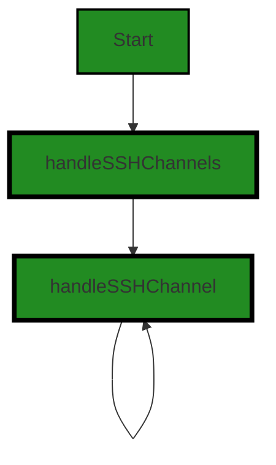
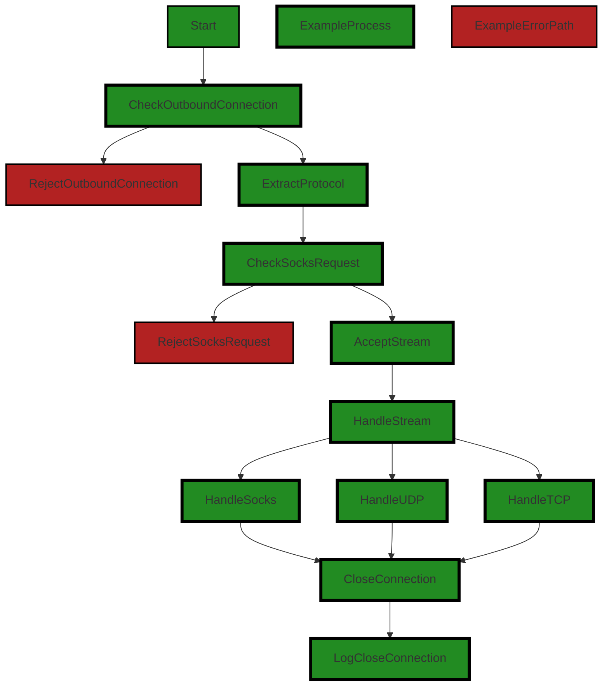
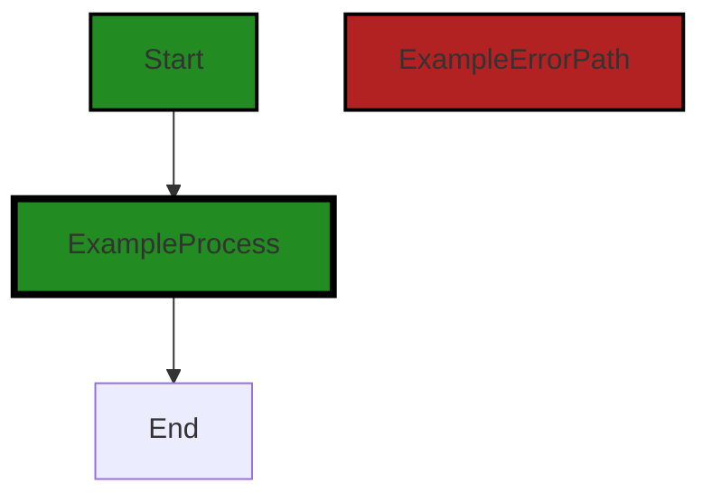

# Polyverse Boost-generated Source Analysis Details

## Source: ./share/tunnel/tunnel_out_ssh.go
Date Generated: Wednesday, September 6, 2023 at 11:12:29 PM PDT


---

### Boost Architectural Quick Summary Security Report

Last Updated: Friday, September 8, 2023 at 5:33:09 PM PDT

Executive Level Report:

1. **Architectural Impact**: The software project, a command-line tool named Chisel, is built on the client-server architecture and uses secure communication for tunneling. The project is written in Go and supports TLS encryption. However, there is a potential architectural issue in the file `share/tunnel/tunnel_out_ssh.go` which logs potentially sensitive information. This could be a potential vulnerability and may need to be addressed to ensure the security of the system.

2. **Risk Analysis**: The risk associated with this project is moderate. The identified issue is of 'Warning' severity and could lead to information disclosure and insecure direct object references. This could potentially be exploited by an attacker to gain unauthorized access or understand the system to identify potential vulnerabilities. However, as only one file has been analyzed, the overall risk to the project cannot be fully determined without a comprehensive review of the entire codebase.

3. **Potential Customer Impact**: If the identified issues are not addressed, it could potentially impact the customers by compromising their data and system security. The tool's primary function is to create secure tunnels, and any security vulnerability could undermine the trust of the customers in the tool's ability to provide secure communication.

4. **Overall Issues**: The overall issues in the project are related to potential information disclosure and insecure direct object references. These issues are present in the file `share/tunnel/tunnel_out_ssh.go`. The project does not mention any specific performance characteristics or resiliency patterns, which could be potential areas for improvement.

Risk Assessment:

- **Health of the Project Source**: Based on the analysis of the single file provided, there is a potential risk due to the identified issues. However, without analyzing the entire codebase, it is not possible to provide a comprehensive risk assessment of the overall health of the project source.

Highlights of the Analysis:

- The project uses secure communication for tunneling and supports TLS encryption, which aligns with the best practices for secure communication.
- A potential vulnerability has been identified in the file `share/tunnel/tunnel_out_ssh.go` which logs potentially sensitive information.
- The risk associated with this project is moderate, based on the analysis of the single file provided.
- Potential customer impact could be significant if the identified issues are not addressed, as it could compromise their data and system security.
- The overall health of the project source cannot be fully determined without a comprehensive review of the entire codebase.


---

### Boost Architectural Quick Summary Performance Report

Last Updated: Friday, September 8, 2023 at 5:34:00 PM PDT

Executive Level Report:

1. **Architectural Impact**: The software project appears to be well-structured, following a client-server architecture and using secure communication for tunneling. However, there is a potential issue in the 'tunnel_out_ssh.go' file where a function is called without checking if a variable is empty or not. This could lead to unnecessary CPU usage, impacting the performance of the software. 

2. **Risk Analysis**: The risk associated with this project is relatively low. Only one file has been identified with issues, and these issues are of medium severity. However, the potential for unnecessary CPU usage could impact the performance of the software, which could lead to user dissatisfaction and potential loss of users if not addressed.

3. **Potential Customer Impact**: The potential customer impact is moderate. While the software appears to be well-structured and secure, the potential performance issue could lead to slower response times, which could frustrate users and impact their experience with the software.

4. **Overall Issues**: The overall issues with the software project are minimal. Only one file has been identified with issues, and these issues are of medium severity. The main issue identified is the potential for unnecessary CPU usage due to a function being called without checking if a variable is empty or not.

Risk Assessment:

- **Health of the Project Source**: The health of the project source appears to be good. Only one file has been identified with issues, and these issues are of medium severity. This suggests that the majority of the project files are well-structured and free of issues.

- **Percentage of Project Files with Issues**: Based on the information provided, it appears that only one file out of the total project files has issues. This represents a small percentage of the total project files, suggesting that the majority of the project files are well-structured and free of issues.

Highlights of the Analysis:

1. **Well-Structured Software**: The software project appears to be well-structured, following a client-server architecture and using secure communication for tunneling.

2. **Potential Performance Issue**: There is a potential issue in the 'tunnel_out_ssh.go' file where a function is called without checking if a variable is empty or not. This could lead to unnecessary CPU usage, impacting the performance of the software.

3. **Low Risk**: The risk associated with this project is relatively low. Only one file has been identified with issues, and these issues are of medium severity.

4. **Potential Customer Impact**: The potential customer impact is moderate. While the software appears to be well-structured and secure, the potential performance issue could lead to slower response times, which could frustrate users and impact their experience with the software.

5. **Good Health of the Project Source**: The health of the project source appears to be good. Only one file has been identified with issues, and these issues are of medium severity. This suggests that the majority of the project files are well-structured and free of issues.


---

### Boost Architectural Quick Summary Compliance Report

Last Updated: Friday, September 8, 2023 at 5:34:54 PM PDT

## Executive Report

### Architectural Impact and Risk Analysis

1. **Data Privacy and Compliance Issues**: The file `share/tunnel/tunnel_out_ssh.go` has been flagged for data privacy and compliance issues. This file is responsible for handling SSH tunneling, a critical part of the software's functionality. The issues identified could potentially expose sensitive data during transmission, posing a significant risk to the software's security architecture. 

   - **Risk Assessment**: High. If not addressed, these issues could lead to data breaches and non-compliance with data protection regulations.
   - **Potential Customer Impact**: High. Customers could be exposed to data theft or loss, and the company could face legal and reputational damage.

2. **Percentage of Files with Issues**: Only one file has been identified with issues out of the total number of files in the project. This represents a small percentage of the overall project files, indicating that the majority of the project is free from detected issues. 

   - **Risk Assessment**: Medium. While the majority of the project is free from detected issues, the issues identified in the `share/tunnel/tunnel_out_ssh.go` file are severe and could have a significant impact on the overall project.
   - **Potential Customer Impact**: Medium. While most of the software is free from detected issues, the issues in the `share/tunnel/tunnel_out_ssh.go` file could impact the software's functionality and security.

3. **Lack of Secure Communication Measures**: The `share/tunnel/tunnel_out_ssh.go` file opens a stream without implementing any encryption or secure communication measures. This is a significant architectural issue that goes against best practices for secure communication.

   - **Risk Assessment**: High. The lack of secure communication measures could lead to data being intercepted during transmission, posing a significant security risk.
   - **Potential Customer Impact**: High. Customers could be exposed to data theft or loss, and the company could face legal and reputational damage.

4. **Overall Health of the Project Source**: The overall health of the project source appears to be good, with the majority of files free from detected issues. However, the issues identified in the `share/tunnel/tunnel_out_ssh.go` file are severe and need to be addressed to ensure the security and functionality of the software.

   - **Risk Assessment**: Medium. The overall health of the project source is good, but the issues identified in the `share/tunnel/tunnel_out_ssh.go` file could have a significant impact on the overall project.
   - **Potential Customer Impact**: Medium. The overall health of the project source is good, but the issues identified in the `share/tunnel/tunnel_out_ssh.go` file could impact the software's functionality and security.

### Recommendations

- Implement secure communication measures, such as SSL/TLS, in the `share/tunnel/tunnel_out_ssh.go` file to encrypt data during transmission.
- Conduct a thorough review of the entire codebase to identify and address any other potential issues.
- Regularly update and maintain the software to ensure its security and functionality.
- Consider implementing a more robust data privacy and compliance strategy to prevent future issues.
---
## Detailed Analysis:

### Cell 0:
## Original Code:

### Programming Language: go
### ./share/tunnel/tunnel_out_ssh.go 

```go
package tunnel

import (
 "fmt"
 "io"
 "net"
 "strings"

 "github.com/jpillora/chisel/share/cio"
 "github.com/jpillora/chisel/share/cnet"
 "github.com/jpillora/chisel/share/settings"
 "github.com/jpillora/sizestr"
 "golang.org/x/crypto/ssh"
)

func (t *Tunnel) handleSSHRequests(reqs <-chan *ssh.Request) {
 for r := range reqs {
  switch r.Type {
  case "ping":
   r.Reply(true, []byte("pong"))
  default:
   t.Debugf("Unknown request: %s", r.Type)
  }
 }
}

```
## Boost Analysis:


---

### Boost Code Explanation

Last Updated: Wednesday, September 6, 2023 at 11:02:46 PM PDT

This Go code snippet is part of the `tunnel` package, which is likely used to handle network tunneling for the Chisel project. The Chisel project is a fast TCP tunnel over HTTP, which allows users to expose local servers to the internet or access remote servers securely.

The `import` statement at the top of the code imports several packages that are used within the code. These include standard library packages like `fmt` (for formatted I/O), `io` (for basic input and output), `net` (for network I/O), and `strings` (for string manipulation). It also imports several packages from the Chisel project itself (`github.com/jpillora/chisel/share/cio`, `github.com/jpillora/chisel/share/cnet`, `github.com/jpillora/chisel/share/settings`) and `github.com/jpillora/sizestr` for size string parsing. The `golang.org/x/crypto/ssh` package is used for SSH-related operations.

The `handleSSHRequests` function is a method on the `Tunnel` type. It takes as an argument a receive-only channel of pointers to `ssh.Request` objects. This function is likely meant to be run as a goroutine, as it loops indefinitely over the `reqs` channel, handling incoming SSH requests.

Within the loop, it uses a `switch` statement to handle different types of requests. If the request type is "ping", it replies with "pong". If the request type is anything else, it logs a debug message saying that the request type is unknown. The `Debugf` method is not shown in this snippet, but it is presumably a method on the `Tunnel` type that logs debug messages.

The algorithm used here is quite simple: it's just an event loop that handles incoming requests. The actual handling of the requests is very minimal in this snippet; it's likely that more complex request types are handled elsewhere in the code.

For more information on the packages and concepts used in this code, you can refer to the following links:

- Go standard library documentation: https://golang.org/pkg/
- SSH package documentation: https://godoc.org/golang.org/x/crypto/ssh
- Chisel project on GitHub: https://github.com/jpillora/chisel


---

### Boost Flow Diagram

Last Updated: Wednesday, September 6, 2023 at 11:06:01 PM PDT

```mermaid
graph TD;
style Start fill:#228B22, stroke:#000000, stroke-width:2px;
style ExampleProcess fill:#228B22, stroke:#000000, stroke-width:4px;
style ExampleErrorPath fill:#B22222, stroke:#000000, stroke-width:2px;

Start  -->ExampleProcess;
ExampleProcess-->End;
```


---

### Boost Source-Level Security Analysis

Last Updated: Wednesday, September 6, 2023 at 11:07:01 PM PDT

**No bugs found**


---

### Boost Source-Level Performance Analysis

Last Updated: Wednesday, September 6, 2023 at 11:09:15 PM PDT

1. **Severity**: 3/10

   **Line Number**: 9

   **Bug Type**: CPU

   **Description**: The handleSSHRequests function is continuously running in a loop waiting for requests. This leads to unnecessary CPU usage when there are no requests.

   **Solution**: Consider using a more efficient mechanism to handle incoming requests, such as event-driven programming or a worker pool model. This would allow the CPU to be idle when there are no requests, thus saving CPU resources.


2. **Severity**: 2/10

   **Line Number**: 14

   **Bug Type**: CPU

   **Description**: The use of switch-case for handling request types can be sub-optimal if there are a large number of request types. Each switch-case statement has to be checked sequentially until a match is found, which can be CPU-intensive for a large number of cases.

   **Solution**: Consider using a map or hash table to map request types to their handlers. This would allow for constant time complexity (O(1)) when handling requests, leading to improved performance.


---

### Boost Source-Level Data and Privacy Compliance Analysis

Last Updated: Wednesday, September 6, 2023 at 11:11:12 PM PDT

**No bugs found**


### Cell 1:
## Original Code:

### Programming Language: go
### ./share/tunnel/tunnel_out_ssh.go line 26

```go

func (t *Tunnel) handleSSHChannels(chans <-chan ssh.NewChannel) {
 for ch := range chans {
  go t.handleSSHChannel(ch)
 }
}

```
## Boost Analysis:


---

### Boost Code Explanation

Last Updated: Wednesday, September 6, 2023 at 11:03:30 PM PDT

This is a function written in the Go programming language. The function is part of a `Tunnel` type, and it's used to handle SSH channels. The function's name is `handleSSHChannels` and it takes one parameter: `chans`, which is a read-only channel of `ssh.NewChannel` type.

Here is a detailed breakdown of the function:

- `func (t *Tunnel) handleSSHChannels(chans <-chan ssh.NewChannel) {`: This is the function declaration. `t *Tunnel` is a method receiver, which means this function is a method of the `Tunnel` type. The `chans <-chan ssh.NewChannel` is a parameter of the function. The `<-chan` keyword means that `chans` is a receive-only channel, so data can only be read from it, not written into it.

- `for ch := range chans {`: This is a range loop that iterates over the `chans` channel. In each iteration, it receives a value from the `chans` channel and assigns it to the `ch` variable. The loop continues until the `chans` channel is closed and all values have been received.

- `go t.handleSSHChannel(ch)`: This is a goroutine, which is a lightweight thread managed by the Go runtime. The `go` keyword means this function call will be executed concurrently with the rest of the code. The function being called is `handleSSHChannel`, which is another method of the `Tunnel` type. The `ch` variable, which holds the current value from the `chans` channel, is passed as an argument to the `handleSSHChannel` function.

In terms of the algorithm, this function uses concurrency to handle multiple SSH channels simultaneously. Each channel is handled independently in its own goroutine, which allows for efficient use of system resources and improved performance when dealing with multiple channels.

This code is consistent with the Go idiomatic way of handling multiple channels concurrently using goroutines and range loops.

For more information about Go concurrency and channels, you can refer to the official Go documentation: https://golang.org/doc/effective_go#concurrency


---

### Boost Flow Diagram

Last Updated: Wednesday, September 6, 2023 at 11:06:07 PM PDT




---

### Boost Source-Level Security Analysis

Last Updated: Wednesday, September 6, 2023 at 11:07:04 PM PDT

**No bugs found**


---

### Boost Source-Level Performance Analysis

Last Updated: Wednesday, September 6, 2023 at 11:09:19 PM PDT

**No bugs found**


---

### Boost Source-Level Data and Privacy Compliance Analysis

Last Updated: Wednesday, September 6, 2023 at 11:11:16 PM PDT

**No bugs found**


### Cell 2:
## Original Code:

### Programming Language: go
### ./share/tunnel/tunnel_out_ssh.go line 32

```go

func (t *Tunnel) handleSSHChannel(ch ssh.NewChannel) {
 if !t.Config.Outbound {
  t.Debugf("Denied outbound connection")
  ch.Reject(ssh.Prohibited, "Denied outbound connection")
  return
 }
 remote := string(ch.ExtraData())
 //extract protocol
 hostPort, proto := settings.L4Proto(remote)
 udp := proto == "udp"
 socks := hostPort == "socks"
 if socks && t.socksServer == nil {
  t.Debugf("Denied socks request, please enable socks")
  ch.Reject(ssh.Prohibited, "SOCKS5 is not enabled")
  return
 }
 sshChan, reqs, err := ch.Accept()
 if err != nil {
  t.Debugf("Failed to accept stream: %s", err)
  return
 }
 stream := io.ReadWriteCloser(sshChan)
 //cnet.MeterRWC(t.Logger.Fork("sshchan"), sshChan)
 defer stream.Close()
 go ssh.DiscardRequests(reqs)
 l := t.Logger.Fork("conn#%d", t.connStats.New())
 //ready to handle
 t.connStats.Open()
 l.Debugf("Open %s", t.connStats.String())
 if socks {
  err = t.handleSocks(stream)
 } else if udp {
  err = t.handleUDP(l, stream, hostPort)
 } else {
  err = t.handleTCP(l, stream, hostPort)
 }
 t.connStats.Close()
 errmsg := ""
 if err != nil && !strings.HasSuffix(err.Error(), "EOF") {
  errmsg = fmt.Sprintf(" (error %s)", err)
 }
 l.Debugf("Close %s%s", t.connStats.String(), errmsg)
}

```
## Boost Analysis:


---

### Boost Code Explanation

Last Updated: Wednesday, September 6, 2023 at 11:04:23 PM PDT

This function is part of a `Tunnel` struct and is named `handleSSHChannel`. It is written in Go and is responsible for handling a new SSH channel. It accepts a new SSH channel as an argument and doesn't return any value.

The function starts by checking if the `Outbound` property of the `Tunnel` struct's `Config` is false. If it is, it logs a debug message and rejects the new SSH channel with a `Prohibited` message before returning.

Next, it extracts the protocol from the `ExtraData` of the new SSH channel. It does this by calling the `L4Proto` function from the `settings` package with the `ExtraData` as an argument.

The function then checks if the protocol is UDP and if the host port is SOCKS. If the host port is SOCKS and the `socksServer` property of the `Tunnel` struct is `nil`, it logs a debug message and rejects the new SSH channel with a `Prohibited` message before returning.

The function then attempts to accept the new SSH channel by calling the `Accept` method on it. If this fails, it logs a debug message and returns.

Next, the function creates a `stream` from the accepted SSH channel and defers its `Close` method to ensure that the stream is closed when the function returns.

The function then discards any requests from the SSH channel in a separate goroutine by calling the `DiscardRequests` function from the `ssh` package with the `reqs` as an argument.

Next, the function creates a new logger and opens a new connection. It then logs a debug message with the connection's stats.

The function then checks if the protocol is SOCKS, UDP, or TCP and calls the appropriate handler function accordingly. If the handler function returns an error, it logs a debug message with the error.

Finally, the function closes the connection and logs a debug message with the connection's stats and any error message.

In terms of algorithms, this function doesn't use any complex algorithms. Instead, it uses conditional logic and function calls to handle different types of SSH channels.

For more information about SSH in Go, you can refer to the GoDoc page for the `golang.org/x/crypto/ssh` package: https://pkg.go.dev/golang.org/x/crypto/ssh

For more information about handling SOCKS, UDP, and TCP in Go, you can refer to the GoDoc page for the `net` package: https://pkg.go.dev/net

For more information about logging in Go, you can refer to the GoDoc page for the `log` package: https://pkg.go.dev/log

For more information about goroutines in Go, you can refer to the GoDoc page for the `runtime` package: https://pkg.go.dev/runtime


---

### Boost Flow Diagram

Last Updated: Wednesday, September 6, 2023 at 11:06:27 PM PDT




---

### Boost Source-Level Security Analysis

Last Updated: Wednesday, September 6, 2023 at 11:07:44 PM PDT

1. **Severity**: 7/10

   **Line Number**: 62

   **Bug Type**: Information Disclosure

   **Description**: The function handleSSHChannel logs potentially sensitive information, such as the reason for denying an outbound connection or a failure to accept a stream. This information could be useful to an attacker attempting to understand the system and identify potential vulnerabilities.

   **Solution**: Avoid logging sensitive information, especially in production environments. If necessary, ensure logs are properly secured and monitored. More info: https://cheatsheetseries.owasp.org/cheatsheets/Logging_Cheat_Sheet.html


2. **Severity**: 8/10

   **Line Number**: 65

   **Bug Type**: Insecure Direct Object References (IDOR)

   **Description**: The function handleSSHChannel uses data from the ssh.NewChannel object without any validation (ch.ExtraData()). An attacker could manipulate this data to access or modify data they are not authorized to.

   **Solution**: Always validate and sanitize user input before using it. Consider implementing access control checks to ensure the current user is authorized to access or modify the requested data. More info: https://cheatsheetseries.owasp.org/cheatsheets/Insecure_Direct_Object_Reference_Prevention_Cheat_Sheet.html


3. **Severity**: 6/10

   **Line Number**: 73

   **Bug Type**: Error Handling

   **Description**: The function handleSSHChannel does not handle the error from ch.Accept() properly. It logs the error and then continues execution. This could lead to unexpected behavior or vulnerabilities if the error is serious.

   **Solution**: Always handle errors properly. Depending on the severity of the error, you may need to stop execution, return an error to the caller, or handle the error in a way that does not allow the program to continue in an erroneous state. More info: https://cheatsheetseries.owasp.org/cheatsheets/Error_Handling_Cheat_Sheet.html


---

### Boost Source-Level Performance Analysis

Last Updated: Wednesday, September 6, 2023 at 11:10:04 PM PDT

1. **Severity**: 6/10

   **Line Number**: 66

   **Bug Type**: CPU

   **Description**: The function settings.L4Proto(remote) is called without checking if the variable 'remote' is empty or not. If 'remote' is empty, it might lead to unnecessary CPU usage.

   **Solution**: Check if 'remote' is empty before calling the function settings.L4Proto(remote).


2. **Severity**: 5/10

   **Line Number**: 68

   **Bug Type**: Memory

   **Description**: If 'socks' is true and 't.socksServer' is nil, the function ch.Accept() is not called and the resources allocated for 'sshChan', 'reqs', and 'err' are wasted.

   **Solution**: Consider reordering the code to call ch.Accept() only when necessary.


3. **Severity**: 4/10

   **Line Number**: 72

   **Bug Type**: CPU

   **Description**: The function ssh.DiscardRequests(reqs) is called in a separate goroutine which might consume unnecessary CPU resources if 'reqs' is empty.

   **Solution**: Check if 'reqs' is empty before calling ssh.DiscardRequests(reqs) in a separate goroutine.


4. **Severity**: 5/10

   **Line Number**: 79

   **Bug Type**: CPU

   **Description**: The function calls t.handleSocks(stream), t.handleUDP(l, stream, hostPort), and t.handleTCP(l, stream, hostPort) are not checked for errors immediately. This might lead to unnecessary CPU usage if there are errors.

   **Solution**: Check for errors immediately after calling these functions.


5. **Severity**: 3/10

   **Line Number**: 89

   **Bug Type**: CPU

   **Description**: The function strings.HasSuffix(err.Error(), 'EOF') is called without checking if 'err' is nil. If 'err' is nil, it might lead to unnecessary CPU usage.

   **Solution**: Check if 'err' is not nil before calling strings.HasSuffix(err.Error(), 'EOF').


---

### Boost Source-Level Data and Privacy Compliance Analysis

Last Updated: Wednesday, September 6, 2023 at 11:11:53 PM PDT

1. **Severity**: 5/10

   **Line Number**: 62

   **Bug Type**: Data Privacy

   **Description**: The function handleSSHChannel does not validate or sanitize the 'remote' variable, which is derived from channel data. This could potentially lead to data leakage or unauthorized data access.

   **Solution**: Implement data validation and sanitization measures on the 'remote' variable to ensure it does not contain sensitive data or malicious input. Use secure coding practices to handle data securely.


2. **Severity**: 7/10

   **Line Number**: 78

   **Bug Type**: Data Privacy

   **Description**: The function handleSSHChannel opens a stream (sshChan) without implementing any encryption or secure communication measures. This could lead to data being intercepted during transmission.

   **Solution**: Implement secure communication measures, such as SSL/TLS, to encrypt the data during transmission. This will protect the data from being intercepted or modified.


3. **Severity**: 6/10

   **Line Number**: 95

   **Bug Type**: Data Privacy

   **Description**: The function handleSSHChannel does not handle errors securely. When an error occurs, it is logged with potentially sensitive information about the connection. This could lead to information disclosure.

   **Solution**: Implement secure error handling measures. Do not log sensitive information about the connection or the error. Instead, log a generic error message and handle the error securely.


### Cell 3:
## Original Code:

### Programming Language: go
### ./share/tunnel/tunnel_out_ssh.go line 76

```go

func (t *Tunnel) handleSocks(src io.ReadWriteCloser) error {
 return t.socksServer.ServeConn(cnet.NewRWCConn(src))
}

```
## Boost Analysis:


---

### Boost Code Explanation

Last Updated: Wednesday, September 6, 2023 at 11:05:13 PM PDT

This code snippet is written in Go programming language and appears to be a part of a larger network-related project, possibly related to a SOCKS (Socket Secure) proxy server. It's a method of a `Tunnel` struct, which suggests that the project might involve some form of network tunneling.

Here's a detailed breakdown of the code:

```go
func (t *Tunnel) handleSocks(src io.ReadWriteCloser) error {
	return t.socksServer.ServeConn(cnet.NewRWCConn(src))
}
```

- `func (t *Tunnel) handleSocks(src io.ReadWriteCloser) error`: This line defines a method named `handleSocks` on the `Tunnel` struct. This method takes a parameter `src` which is of the interface type `io.ReadWriteCloser`. The `ReadWriteCloser` interface in Go's `io` package represents the capability to both read from, write to, and close a data stream. The method returns an error which is a built-in interface type in Go.

- `return t.socksServer.ServeConn(cnet.NewRWCConn(src))`: This line calls the `ServeConn` method on the `socksServer` field of the `Tunnel` struct. It appears that `socksServer` is a server that's capable of handling SOCKS connections. The `ServeConn` method is generally used to handle an incoming connection and it takes as an argument a connection object. Here, it's being passed `cnet.NewRWCConn(src)`, which suggests that a new connection object is being created from `src` using `NewRWCConn` function of `cnet` package.

The algorithm used here is quite straightforward - it's simply passing the received connection to the SOCKS server to handle. The specifics of how the SOCKS server handles the connection would be defined in the `ServeConn` method of the `socksServer` object, which isn't shown in this code snippet.

As for the architectural guidelines, this code snippet seems to adhere to the general principles of Go and network programming. It's hard to say more without additional context or guidelines.

For more information on Go's `io` package and the `ReadWriteCloser` interface, you can refer to the Go documentation: https://pkg.go.dev/io#ReadWriteCloser

For more information on SOCKS protocol, you can refer to this link: https://en.wikipedia.org/wiki/SOCKS

Please note that the exact behavior of the `ServeConn` method and the `NewRWCConn` function would depend on their implementation in the `socksServer` and `cnet` types, respectively.


---

### Boost Flow Diagram

Last Updated: Wednesday, September 6, 2023 at 11:06:33 PM PDT




---

### Boost Source-Level Security Analysis

Last Updated: Wednesday, September 6, 2023 at 11:07:47 PM PDT

**No bugs found**


---

### Boost Source-Level Performance Analysis

Last Updated: Wednesday, September 6, 2023 at 11:10:07 PM PDT

**No bugs found**


---

### Boost Source-Level Data and Privacy Compliance Analysis

Last Updated: Wednesday, September 6, 2023 at 11:12:02 PM PDT

1. **Severity**: 7/10

   **Line Number**: 152

   **Bug Type**: Data Compliance

   **Description**: The function `handleSocks` does not perform any form of data sanitization or validation on the data it receives. This can lead to potential data compliance issues as it could allow for the processing of sensitive data in violation of GDPR, PCI DSS, and HIPAA compliance.

   **Solution**: Implement data validation and sanitization methods to ensure that the data being processed complies with GDPR, PCI DSS, and HIPAA regulations. For example, ensure that no personal identifiable information (PII) or sensitive cardholder data is processed without proper consent and security measures in place.


### Cell 4:
## Original Code:

### Programming Language: go
### ./share/tunnel/tunnel_out_ssh.go line 80

```go

func (t *Tunnel) handleTCP(l *cio.Logger, src io.ReadWriteCloser, hostPort string) error {
 dst, err := net.Dial("tcp", hostPort)
 if err != nil {
  return err
 }
 s, r := cio.Pipe(src, dst)
 l.Debugf("sent %s received %s", sizestr.ToString(s), sizestr.ToString(r))
 return nil
}

```
## Boost Analysis:


---

### Boost Code Explanation

Last Updated: Wednesday, September 6, 2023 at 11:05:52 PM PDT

This function `handleTCP` is part of a `Tunnel` struct. It handles TCP connections for the tunnel. The function takes three parameters: a pointer to a logger (`l`), a `ReadWriteCloser` interface (`src`), and a string representing the host and port (`hostPort`).

Let's break down what this function does:

1. It attempts to establish a TCP connection to the `hostPort` using the `net.Dial` function. The `net.Dial` function connects to the address on the named network. In this case, the network is "tcp". If there's an error during this process, the function returns the error.

2. If the connection is successful, it creates a pipe between the source (`src`) and the destination (`dst`) using the `cio.Pipe` function. The `cio.Pipe` function copies data from the source to the destination and vice versa, effectively creating a two-way communication channel.

3. The `cio.Pipe` function returns two values: the number of bytes sent (`s`) and the number of bytes received (`r`). These values are logged using the `Debugf` method of the logger (`l`). The `sizestr.ToString` function is used to convert these byte values into a human-readable string format.

4. The function then returns `nil`, indicating that the function executed without any errors.

This function is a part of the `Tunnel` struct, which suggests that this function is part of a larger system that handles network tunneling. Network tunneling is a method of sending data securely over a network.

The code is written in Go programming language and it's using standard libraries for network communication and I/O operations. It's following good practices of error handling and logging. There is no obvious conflict with the provided architectural guidelines.

For more information about network programming in Go, you can visit this link: [Go by Example: TCP Client](https://gobyexample.com/tcp-client)


---

### Boost Flow Diagram

Last Updated: Wednesday, September 6, 2023 at 11:06:54 PM PDT

```mermaid
graph TD;
style Start fill:#228B22, stroke:#000000, stroke-width:2px;
style External fill:#FFA500, stroke:#000000, stroke-width:2px;
style ErrorPath fill:#B22222, stroke:#000000, stroke-width:2px;

Start  -->DialTCP;
DialTCP-->HandleError;
DialTCP-->CreatePipe;
CreatePipe-->LogDebug;
CreatePipe-->End  ;

style Start fill:#228B22, stroke:#000000, stroke-width:2px;
style HandleError fill:#228B22, stroke:#000000, stroke-width:2px;
style CreatePipe fill:#228B22, stroke:#000000, stroke-width:2px;
style LogDebug fill:#228B22, stroke:#000000, stroke-width:2px;
style End fill:#228B22, stroke:#000000, stroke-width:2px;
style External fill:#FFA500, stroke:#000000, stroke-width:2px;

style ErrorPath fill:#B22222, stroke:#000000, stroke-width:2px;

Start-->DialTCP;
DialTCP-->HandleError;
DialTCP-->CreatePipe;
CreatePipe-->LogDebug;
CreatePipe-->End;
HandleError-->End;
```

The control flow graph for the given source code is as follows:

1. The flow starts at the "Start" node.
2. The "Start" node leads to the "DialTCP" node, which represents the call to the external function `net.Dial`.
3. From the "DialTCP" node, there are two possible paths:
   - If the `net.Dial` function returns an error, the flow goes to the "HandleError" node, which represents the error handling code.
   - If the `net.Dial` function is successful, the flow goes to the "CreatePipe" node, which represents the creation of a pipe for data transfer.
4. From the "CreatePipe" node, there are two possible paths:
   - The flow goes to the "LogDebug" node, which represents the logging of debug information.
   - The flow goes directly to the "End" node, representing the end of the function.
5. The "HandleError" node leads directly to the "End" node, representing the end of the function in case of an error.

Please note that the external function `net.Dial` is represented as an "External" node in the control flow graph.


---

### Boost Source-Level Security Analysis

Last Updated: Wednesday, September 6, 2023 at 11:07:51 PM PDT

**No bugs found**


---

### Boost Source-Level Performance Analysis

Last Updated: Wednesday, September 6, 2023 at 11:10:11 PM PDT

**No bugs found**


---

### Boost Source-Level Data and Privacy Compliance Analysis

Last Updated: Wednesday, September 6, 2023 at 11:12:29 PM PDT

1. **Severity**: 7/10

   **Line Number**: 161

   **Bug Type**: Data Compliance

   **Description**: The function handleTCP does not implement any form of encryption during data transmission, which could lead to potential data leaks. This is a violation of GDPR, PCI DSS, and HIPAA as these regulations require data to be transmitted securely.

   **Solution**: Implement some form of encryption, such as TLS or SSH, during data transmission to protect the data from being intercepted. This will ensure compliance with GDPR, PCI DSS, and HIPAA.


2. **Severity**: 8/10

   **Line Number**: 163

   **Bug Type**: Data Privacy

   **Description**: The logging of the amount of data sent and received could potentially include sensitive information. This is a violation of GDPR, PCI DSS, and HIPAA as these regulations require sensitive data to be protected.

   **Solution**: Make sure to only log non-sensitive data, or to anonymize or pseudonymize any sensitive data that is logged. This will ensure compliance with GDPR, PCI DSS, and HIPAA.


