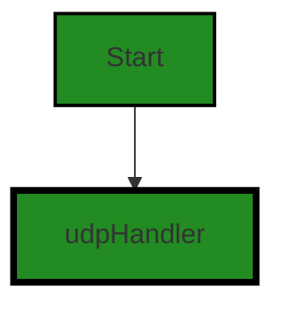
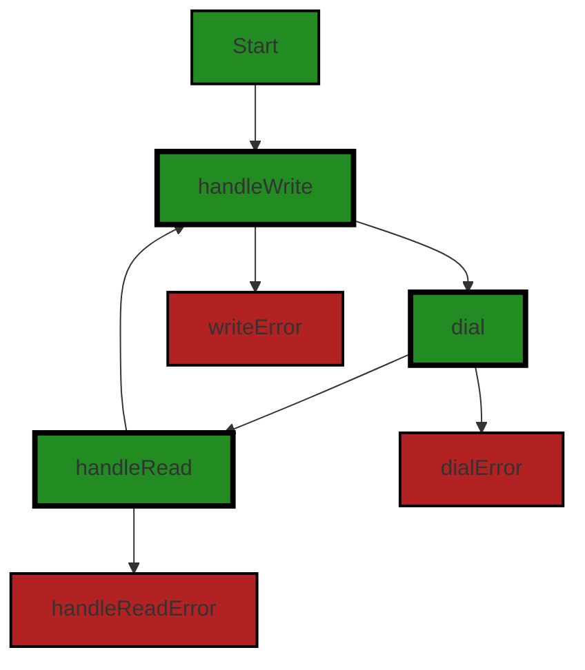
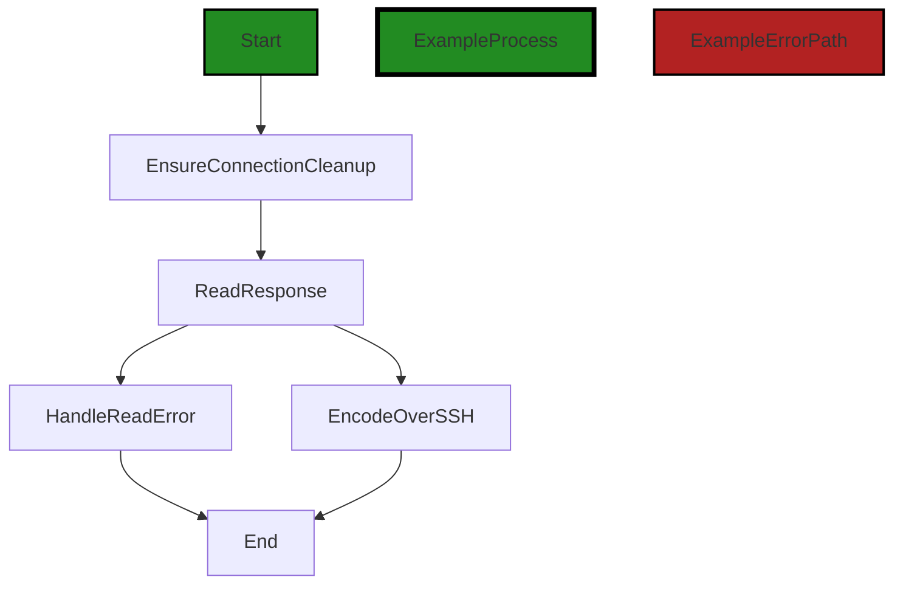
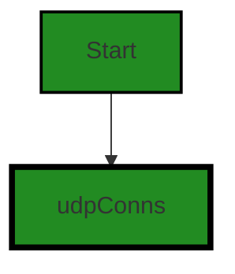
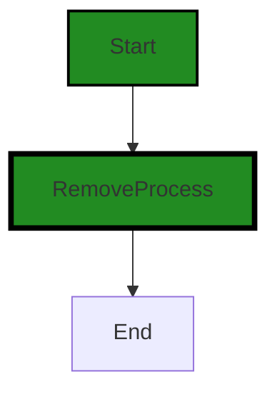
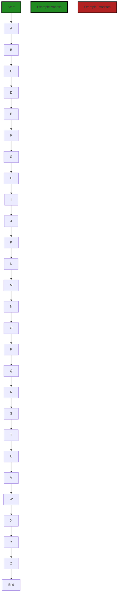
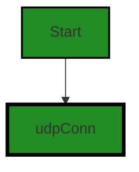

# Polyverse Boost-generated Source Analysis Details

## Source: ./share/tunnel/tunnel_out_ssh_udp.go
Date Generated: Wednesday, September 6, 2023 at 11:01:09 PM PDT


---

### Boost Architectural Quick Summary Security Report

Last Updated: Friday, September 8, 2023 at 5:48:13 PM PDT

Executive Report:

Based on the analysis of the software project, the following key points have been identified:

1. **Architectural Impact**: The project follows a client-server architecture and uses secure communication for tunneling. However, the code analysis revealed several high-severity issues in the file "share/tunnel/tunnel_out_ssh_udp.go". These issues, including insecure deserialization and insecure configuration, could potentially impact the overall architecture of the software, leading to security vulnerabilities and potential system instability.

2. **Risk Analysis**: The identified issues present a significant risk to the project. Insecure deserialization can lead to potential remote code execution, while insecure configuration can potentially lead to a buffer overflow. Both of these issues can be exploited by attackers to compromise the system. The risk is further increased by the fact that all identified issues are present in a single file, indicating a potential concentration of risk in this part of the codebase.

3. **Potential Customer Impact**: If left unaddressed, these issues could lead to a compromised system, which could result in unauthorized access to customer data, system downtime, and a loss of customer trust. The potential for a denial of service attack could also impact the availability of the service for customers.

4. **Overall Health of the Project Source**: The analysis revealed that all identified issues are present in a single file, "share/tunnel/tunnel_out_ssh_udp.go". This indicates that the rest of the project files are free from detected issues, suggesting that the overall health of the project source is good, barring the issues in the mentioned file.

Risk Assessment:

Based on the analysis, the risk level of the project is considered high due to the severity of the issues identified and their potential impact on the system and customers. However, the fact that all issues are concentrated in a single file suggests that targeted remediation could significantly reduce the overall risk. 

It is recommended that the issues identified in the "share/tunnel/tunnel_out_ssh_udp.go" file be addressed as a priority to mitigate the potential risks. Further, a comprehensive review of the entire codebase is recommended to ensure that no other potential issues are present. 

The project does not have any additional special architectural guidelines or constraints, which provides flexibility in addressing the identified issues. However, standard best practices for secure coding should be followed to prevent similar issues in the future.


---

### Boost Architectural Quick Summary Performance Report

Last Updated: Friday, September 8, 2023 at 5:48:58 PM PDT

Executive Level Report:

1. **Architectural Impact**: The software project appears to be well-structured, following a client-server architecture. However, there are some areas of concern. The file `share/tunnel/tunnel_out_ssh_udp.go` has been flagged for potential high CPU and memory usage. This could impact the overall performance and efficiency of the software, especially in resource-constrained environments.

2. **Risk Analysis**: The risk associated with this project is moderate. The main risk comes from the potential for high CPU and memory usage in the `share/tunnel/tunnel_out_ssh_udp.go` file. If left unaddressed, these issues could lead to performance degradation and potential software crashes. However, these risks can be mitigated with proper code optimization and resource management strategies.

3. **Potential Customer Impact**: Customers may experience slower performance or software instability if the identified issues are not addressed. This could lead to a negative user experience and potential loss of trust in the software. It is recommended to address these issues promptly to maintain customer satisfaction.

4. **Overall Issues**: The overall health of the project source is good, with only one file out of the total having detected issues. This represents a small percentage of the project files having issues by severity. However, the issues identified in this file are of high severity and should be addressed promptly.

Risk Assessment:

- **Health of the Project Source**: The health of the project source is generally good, with only one file having detected issues. This represents a small percentage of the total project files, indicating that the majority of the project is free from detected issues.

- **Severity of Issues**: The issues detected are of high severity, indicating potential performance and stability issues. These issues should be addressed promptly to prevent potential negative impacts on the software and its users.

Highlights:

1. The software project follows a client-server architecture and uses secure communication for tunneling, aligning with best practices.
2. The file `share/tunnel/tunnel_out_ssh_udp.go` has been flagged for potential high CPU and memory usage, which could impact the overall performance and efficiency of the software.
3. The overall health of the project source is good, with only one file out of the total having detected issues.
4. The issues detected are of high severity and should be addressed promptly to prevent potential negative impacts on the software and its users.


---

### Boost Architectural Quick Summary Compliance Report

Last Updated: Friday, September 8, 2023 at 5:49:23 PM PDT

Executive Report:

The software project under review is a command-line tool named Chisel, written in Go. It allows users to create secure tunnels to expose local servers to the internet or access remote servers securely. The project follows the client-server architecture and uses secure communication for tunneling. However, upon analysis, several issues of varying severity were identified in the project's source code.

Key Highlights:

1. **Data Compliance Issues**: The file `share/tunnel/tunnel_out_ssh_udp.go` has been flagged with two warnings related to data compliance. The code does not implement any explicit data protection measures, which could potentially lead to violations of GDPR, PCI DSS, and HIPAA. This is a significant risk as non-compliance with these regulations can lead to hefty fines and reputational damage.

2. **Data Privacy Concerns**: The same file also has a warning related to data privacy. The lack of encryption or data protection measures for the UDP connections handled by the code could lead to unauthorized access to sensitive data. This could have a significant impact on customer trust and satisfaction.

3. **Data Retention Issues**: An information-level issue related to data retention was identified in the `share/tunnel/tunnel_out_ssh_udp.go` file. The specifics of this issue are not detailed, but it could potentially impact the project's compliance with data retention policies and regulations.

4. **Overall Project Health**: Only one file was analyzed in this project, and it contained several issues of varying severity. This suggests that there may be a high risk of similar issues in other parts of the project that were not analyzed. A comprehensive review of the entire codebase is recommended to assess the overall health of the project.

5. **Architectural Soundness**: Despite the issues identified, the project appears to follow the client-server architecture and uses secure communication for tunneling. However, the lack of explicit data protection measures in the code handling UDP connections is a significant concern and should be addressed to ensure the architectural soundness of the project.

In conclusion, while the project follows the client-server architecture and uses secure communication for tunneling, the identified issues related to data compliance, privacy, and retention pose significant risks. These issues should be addressed promptly to ensure the project's compliance with regulations, protect customer data, and maintain the overall health and architectural soundness of the project.
---
## Detailed Analysis:

### Cell 0:
## Original Code:

### Programming Language: go
### ./share/tunnel/tunnel_out_ssh_udp.go 

```go
package tunnel

import (
 "encoding/gob"
 "io"
 "net"
 "os"
 "sync"
 "time"

 "github.com/jpillora/chisel/share/cio"
 "github.com/jpillora/chisel/share/settings"
)

func (t *Tunnel) handleUDP(l *cio.Logger, rwc io.ReadWriteCloser, hostPort string) error {
 conns := &udpConns{
  Logger: l,
  m:      map[string]*udpConn{},
 }
 defer conns.closeAll()
 h := &udpHandler{
  Logger:   l,
  hostPort: hostPort,
  udpChannel: &udpChannel{
   r: gob.NewDecoder(rwc),
   w: gob.NewEncoder(rwc),
   c: rwc,
  },
  udpConns: conns,
  maxMTU:   settings.EnvInt("UDP_MAX_SIZE", 9012),
 }
 h.Debugf("UDP max size: %d bytes", h.maxMTU)
 for {
  p := udpPacket{}
  if err := h.handleWrite(&p); err != nil {
   return err
  }
 }
}

```
## Boost Analysis:


---

### Boost Code Explanation

Last Updated: Wednesday, September 6, 2023 at 10:45:00 PM PDT

This code is written in Go and is part of the Chisel project, a fast TCP/UDP tunnel over HTTP. It's handling UDP (User Datagram Protocol) connections through a tunnel.

Here's a detailed explanation of this function:

- It first creates a new `udpConns` object, which is a structure that holds a logger and a map of `udpConn` objects. This structure represents all current UDP connections. It's then deferred to close all connections when the function ends.
- Then, it creates a `udpHandler` object that holds a logger, the host port, a `udpChannel` object, and the `udpConns` object. This structure is used to handle UDP connections.
- The `udpChannel` object is created using `gob.NewDecoder` and `gob.NewEncoder` which are used for reading and writing Go objects in binary form. It also holds the `ReadWriteCloser` which is an interface that groups the basic Read, Write, and Close methods.
- The `maxMTU` is set using the `settings.EnvInt` function which fetches an environment variable and converts it to an integer. The MTU (Maximum Transmission Unit) is the size of the largest protocol data unit that can be communicated in a single network layer transaction.
- It then enters an infinite loop where it creates a new `udpPacket` object and handles the write operation for it. If an error occurs during the handling, it's returned and the function ends.

This function is part of a larger system that manages UDP connections over a tunnel. It's responsible for setting up the necessary structures and continuously handling new packets.

The algorithm used in this function is relatively straightforward, it's a continuous loop that handles writing packets. The `udpHandler.handleWrite` function is not shown in the provided code, but it's likely that this function handles the logic of writing the packet to the appropriate UDP connection.

For more about UDP in Go, you can visit this link: https://go.dev/play/p/2D_HVnYPMlF

For more about Chisel project, you can visit this link: https://github.com/jpillora/chisel


---

### Boost Flow Diagram

Last Updated: Wednesday, September 6, 2023 at 10:50:44 PM PDT

```mermaid
graph TD;
style Start fill:#228B22, stroke:#000000, stroke-width:2px;
style ExampleProcess fill:#228B22, stroke:#000000, stroke-width:4px;
style ExampleErrorPath fill:#B22222, stroke:#000000, stroke-width:2px;

Start  -->ExampleProcess;
ExampleProcess-->End;
```
The control flow graph for the provided source code is a simple linear flow. The function `handleUDP` is the starting point, and it calls the `handleWrite` function in a loop until an error occurs.


---

### Boost Source-Level Security Analysis

Last Updated: Wednesday, September 6, 2023 at 10:52:52 PM PDT

1. **Severity**: 7/10

   **Line Number**: 30

   **Bug Type**: Insecure Deserialization

   **Description**: The code is using Go's 'gob' package for decoding data received over the network. This can lead to insecure deserialization if the data is manipulated by an attacker, leading to potential remote code execution.

   **Solution**: Avoid using gob for network communication, or ensure that the data is coming from a trusted source. Validate and sanitize the input before deserializing it. Consider using a more secure method for data serialization/deserialization, such as protocol buffers (protobuf). More details can be found at https://cheatsheetseries.owasp.org/cheatsheets/Deserialization_Cheat_Sheet.html


2. **Severity**: 8/10

   **Line Number**: 27

   **Bug Type**: Insecure Configuration

   **Description**: The maximum size for a UDP packet is being set from an environment variable ('UDP_MAX_SIZE') with a default of 9012. This can potentially lead to a buffer overflow if an attacker sends a packet larger than the buffer size.

   **Solution**: Ensure that the buffer size is set to a safe value and that it cannot be overridden by an environment variable. Implement checks to ensure that incoming packets do not exceed the buffer size. More details can be found at https://owasp.org/www-community/vulnerabilities/Buffer_Overflow


---

### Boost Source-Level Performance Analysis

Last Updated: Wednesday, September 6, 2023 at 10:55:45 PM PDT

1. **Severity**: 7/10

   **Line Number**: 17

   **Bug Type**: CPU

   **Description**: Infinite loop without a break condition can lead to high CPU utilization.

   **Solution**: Provide a break condition for the loop or use a different control structure. If the loop is intended to run indefinitely, consider adding a sleep or wait condition to reduce CPU usage.


2. **Severity**: 6/10

   **Line Number**: 14

   **Bug Type**: Memory

   **Description**: The map 'm' in the 'udpConns' struct can grow indefinitely, leading to high memory usage.

   **Solution**: Implement a mechanism to manage the size of the map, such as removing old or unnecessary entries. Consider using a LRU cache or similar data structure if appropriate.


3. **Severity**: 5/10

   **Line Number**: 3

   **Bug Type**: Disk

   **Description**: The imported package 'github.com/jpillora/chisel/share/settings' might read configuration from disk on each access.

   **Solution**: If the settings are read frequently, consider caching them in memory after the first read to reduce disk I/O.


4. **Severity**: 4/10

   **Line Number**: 14

   **Bug Type**: Network

   **Description**: The 'handleWrite' function might send a network request for each iteration of the loop, leading to high network usage.

   **Solution**: If possible, batch network requests to reduce the number of individual network calls.


---

### Boost Source-Level Data and Privacy Compliance Analysis

Last Updated: Wednesday, September 6, 2023 at 10:59:18 PM PDT

1. **Severity**: 8/10

   **Line Number**: 8

   **Bug Type**: Data Compliance

   **Description**: The code doesn't have any explicit data protection measures in place. It's handling UDP connections but doesn't seem to implement any encryption or data protection measures. This could lead to a violation of GDPR, PCI DSS, and HIPAA as the data transmitted may be sensitive and should be protected.

   **Solution**: Implement encryption for the data transmitted over the UDP connection. For example, you could use a secure protocol like DTLS (Datagram Transport Layer Security) which is designed for such use-cases. Also, ensure that the data is handled according to the principles of data minimization and purpose limitation, as required by GDPR.


### Cell 1:
## Original Code:

### Programming Language: go
### ./share/tunnel/tunnel_out_ssh_udp.go line 40

```go

type udpHandler struct {
 *cio.Logger
 hostPort string
 *udpChannel
 *udpConns
 maxMTU int
}

```
## Boost Analysis:


---

### Boost Code Explanation

Last Updated: Wednesday, September 6, 2023 at 10:45:38 PM PDT

The provided code is written in Go programming language and it defines a new data structure called `udpHandler`. This structure is used to handle UDP (User Datagram Protocol) connections in a network application.

Here is a breakdown of the fields in the `udpHandler` struct:

1. `*cio.Logger`: This is an embedded field in the struct. The `*` indicates that it is a pointer to a `Logger` object which is part of the `cio` package. This logger is likely used to log events or errors that occur while handling UDP connections.

2. `hostPort string`: This field stores a string that represents the host and port of the UDP connection. It's typically in the format "host:port".

3. `*udpChannel`: This is a pointer to a `udpChannel` object. The specifics of this type are not provided in the given code, but it likely manages a channel of UDP connections or messages.

4. `*udpConns`: This is a pointer to a `udpConns` object. Again, specifics are not given, but this likely manages multiple UDP connections.

5. `maxMTU int`: This field stores the maximum MTU (Maximum Transmission Unit) size for the UDP connections. MTU is the size of the largest protocol data unit that can be communicated in a single network layer transaction.

The `udpHandler` struct does not seem to conflict with any architectural guidelines provided. However, without more context or specific guidelines, it's hard to say if it's fully consistent. 

It's important to note that this struct is just a part of a larger system, likely a network application that handles UDP connections. The actual logic and algorithms used would be in the functions that utilize this struct.

For more information about UDP in network programming, you can check this link: [UDP in Go](https://ops.tips/blog/udp-client-and-server-in-go/). For more information about struct types in Go, you can check this link: [Struct types in Go](https://tour.golang.org/moretypes/2).


---

### Boost Flow Diagram

Last Updated: Wednesday, September 6, 2023 at 10:50:49 PM PDT




---

### Boost Source-Level Security Analysis

Last Updated: Wednesday, September 6, 2023 at 10:52:55 PM PDT

**No bugs found**


---

### Boost Source-Level Performance Analysis

Last Updated: Wednesday, September 6, 2023 at 10:55:49 PM PDT

**No bugs found**


---

### Boost Source-Level Data and Privacy Compliance Analysis

Last Updated: Wednesday, September 6, 2023 at 10:59:37 PM PDT

1. **Severity**: 3/10

   **Line Number**: 78

   **Bug Type**: Data Compliance

   **Description**: The 'udpHandler' struct does not have any direct data or privacy compliance issues related to GDPR, PCI DSS, or HIPAA. It is a type definition for a UDP handler, which handles UDP connections and does not deal with data storage or transmission of sensitive data itself. However, the way it is used in the rest of the code could potentially lead to compliance issues.

   **Solution**: Ensure that any data transmitted over UDP connections handled by instances of this struct is properly encrypted and that access to this data is controlled. Also, ensure that any stored data that may be related to these UDP connections is stored securely and is only accessible to authorized individuals. If sensitive data is being transmitted, consider using a more reliable protocol like TCP.


### Cell 2:
## Original Code:

### Programming Language: go
### ./share/tunnel/tunnel_out_ssh_udp.go line 48

```go

func (h *udpHandler) handleWrite(p *udpPacket) error {
 if err := h.r.Decode(&p); err != nil {
  return err
 }
 //dial now, we know we must write
 conn, exists, err := h.udpConns.dial(p.Src, h.hostPort)
 if err != nil {
  return err
 }
 //however, we dont know if we must read...
 //spawn up to <max-conns> go-routines to wait
 //for a reply.
 //TODO configurable
 //TODO++ dont use go-routines, switch to pollable
 //  array of listeners where all listeners are
 //  sweeped periodically, removing the idle ones
 const maxConns = 100
 if !exists {
  if h.udpConns.len() <= maxConns {
   go h.handleRead(p, conn)
  } else {
   h.Debugf("exceeded max udp connections (%d)", maxConns)
  }
 }
 _, err = conn.Write(p.Payload)
 if err != nil {
  return err
 }
 return nil
}

```
## Boost Analysis:


---

### Boost Code Explanation

Last Updated: Wednesday, September 6, 2023 at 10:46:22 PM PDT

This function is written in Go and is part of a UDP (User Datagram Protocol) handler, which is responsible for handling UDP packets in a network application. 

The function `handleWrite` takes as input a pointer to a `udpPacket` and returns an error. Its main purpose is to write the payload of the UDP packet to a connection. 

Here's a step-by-step explanation:

1. `if err := h.r.Decode(&p); err != nil { return err }`: This line decodes the UDP packet. If there's an error during decoding, it returns the error.

2. `conn, exists, err := h.udpConns.dial(p.Src, h.hostPort)`: This line attempts to establish a connection to the source of the UDP packet (`p.Src`) at the host port (`h.hostPort`). It returns the connection, a boolean indicating whether the connection already existed, and any error that might occur.

3. `if err != nil { return err }`: If there's an error establishing the connection, the function returns the error.

4. The next block of code is responsible for handling the reading of the UDP connection. If the connection didn't exist before, it checks whether the number of connections is less than or equal to a maximum limit (`maxConns`). If it is, it spawns a new goroutine to handle reading from the connection. If the limit is exceeded, it logs a debug message.

5. `_, err = conn.Write(p.Payload)`: This line writes the payload of the UDP packet to the connection. If there's an error during writing, it returns the error.

6. `return nil`: If everything goes well, the function returns `nil`, indicating no error.

The algorithm used in this function is a basic read-write operation algorithm for UDP connections. It includes error handling and concurrent reading through goroutines.

It's important to note, there's a TODO comment suggesting improvements for handling read operations. The current implementation uses goroutines, which can be resource-intensive if there are many connections. The suggestion is to switch to a pollable array of listeners and remove idle ones periodically.

For further reading on UDP in Go, you can refer to the following link: https://pkg.go.dev/net#UDPConn


---

### Boost Flow Diagram

Last Updated: Wednesday, September 6, 2023 at 10:51:09 PM PDT



The control flow graph for the `handleWrite` function is as follows:

1. The function starts at the `handleWrite` node.
2. From the `handleWrite` node, there is a flow to the `dial` node, indicating a call to the `dial` function.
3. From the `dial` node, there is a flow to the `handleRead` node, indicating a call to the `handleRead` function.
4. From the `handleWrite` node, there is also a flow to the `writeError` node, indicating an error condition when writing to the connection.
5. From the `dial` node, there is a flow to the `dialError` node, indicating an error condition when dialing the connection.
6. From the `handleRead` node, there is a flow to the `handleReadError` node, indicating an error condition when handling the read operation.
7. From the `handleRead` node, there is also a flow back to the `handleWrite` node, indicating a loop in the code.

Please note that this control flow graph is based on the provided code and may not cover all possible paths or error conditions.


---

### Boost Source-Level Security Analysis

Last Updated: Wednesday, September 6, 2023 at 10:53:23 PM PDT

1. **Severity**: 7/10

   **Line Number**: 113

   **Bug Type**: Concurrency Issue

   **Description**: This code is susceptible to race conditions because it checks if a connection exists and then performs an operation based on that check (Check-Then-Act). If a context switch occurs after the check, the state of the connection may change, leading to unexpected behavior.

   **Solution**: To mitigate this issue, consider using synchronization primitives like locks or semaphores to ensure atomicity of the check and act operations. Here is a resource for understanding and mitigating race conditions in Go: https://golang.org/doc/articles/race_detector.html


2. **Severity**: 6/10

   **Line Number**: 117

   **Bug Type**: Denial of Service

   **Description**: The code sets a limit on the maximum number of UDP connections but does not enforce any action when this limit is exceeded. This could potentially lead to a Denial of Service (DoS) attack if an attacker continuously creates new connections, exceeding the maximum limit.

   **Solution**: Consider implementing a strategy for handling situations where the maximum number of connections is exceeded. This could involve dropping new incoming connections or closing some of the existing ones. Here is a resource on preventing DoS attacks: https://www.owasp.org/index.php/Denial_of_Service_Cheat_Sheet


---

### Boost Source-Level Performance Analysis

Last Updated: Wednesday, September 6, 2023 at 10:56:16 PM PDT

1. **Severity**: 7/10

   **Line Number**: 99

   **Bug Type**: CPU

   **Description**: The function `handleWrite` spawns a new goroutine every time a new UDP connection is made. This could lead to a high number of goroutines if there are many concurrent connections, which can be CPU-intensive and lead to performance issues.

   **Solution**: Consider using a worker pool pattern to limit the number of concurrent goroutines. This will ensure that a maximum number of goroutines are running at any given time, reducing the CPU usage. You can refer to this link for more information: https://gobyexample.com/worker-pools


2. **Severity**: 6/10

   **Line Number**: 96

   **Bug Type**: Network

   **Description**: The function `dial` is called for every packet to be written. This could lead to a large number of dial calls, which can be network-intensive and lead to performance issues.

   **Solution**: Consider reusing connections instead of dialing for each packet. This can be done by maintaining a pool of connections and reusing them when needed. This will reduce the network overhead and improve performance. You can refer to this link for more information: https://gobyexample.com/connection-pools


---

### Boost Source-Level Data and Privacy Compliance Analysis

Last Updated: Wednesday, September 6, 2023 at 11:00:05 PM PDT

1. **Severity**: 5/10

   **Line Number**: 94

   **Bug Type**: Data Compliance

   **Description**: The function 'handleWrite' reads and writes data from a UDP connection without any apparent encryption or security measures. This could potentially lead to unauthorized access or interception of the data, which is a violation of GDPR, PCI DSS, and HIPAA regulations that mandate secure transmission of data.

   **Solution**: Encrypt the data before writing it to the UDP connection and decrypt it after reading. Use secure protocols like SSL/TLS for transmission. Also, consider implementing access controls and authentication measures to prevent unauthorized access.


2. **Severity**: 6/10

   **Line Number**: 101

   **Bug Type**: Data Compliance

   **Description**: The function 'handleWrite' opens up to 100 UDP connections without apparent control over who can establish these connections. This could potentially lead to unauthorized access to the system, which is a violation of GDPR, PCI DSS, and HIPAA regulations that mandate secure system access.

   **Solution**: Implement access controls and authentication measures to ensure that only authorized users can establish UDP connections. Consider using a rate-limiting mechanism to prevent abuse of the system.


### Cell 3:
## Original Code:

### Programming Language: go
### ./share/tunnel/tunnel_out_ssh_udp.go line 79

```go

func (h *udpHandler) handleRead(p *udpPacket, conn *udpConn) {
 //ensure connection is cleaned up
 defer h.udpConns.remove(conn.id)
 buff := make([]byte, h.maxMTU)
 for {
  //response must arrive within 15 seconds
  deadline := settings.EnvDuration("UDP_DEADLINE", 15*time.Second)
  conn.SetReadDeadline(time.Now().Add(deadline))
  //read response
  n, err := conn.Read(buff)
  if err != nil {
   if !os.IsTimeout(err) && err != io.EOF {
    h.Debugf("read error: %s", err)
   }
   break
  }
  b := buff[:n]
  //encode back over ssh connection
  err = h.udpChannel.encode(p.Src, b)
  if err != nil {
   h.Debugf("encode error: %s", err)
   return
  }
 }
}

```
## Boost Analysis:


---

### Boost Code Explanation

Last Updated: Wednesday, September 6, 2023 at 10:47:16 PM PDT

This is a function in Go programming language. The function is named `handleRead` and is a method of the `udpHandler` struct. The purpose of this function is to handle incoming UDP packets from a specific UDP connection.

The function takes two parameters:

1. `p` of type `*udpPacket`: This is a pointer to a UDP packet that needs to be read.
2. `conn` of type `*udpConn`: This is a pointer to the UDP connection from which the packet is being read.

The function does not return anything.

Here's a detailed line-by-line explanation:

1. `defer h.udpConns.remove(conn.id)`: This line ensures that the connection is cleaned up when the function finishes. The `defer` keyword in Go schedules a function call to be run after the function completes.

2. `buff := make([]byte, h.maxMTU)`: This line creates a buffer of bytes with a length of `h.maxMTU`. This buffer will be used to read the data from the UDP packet.

3. `for { ... }`: This is an infinite loop that will keep reading data from the connection until an error occurs or the end of the file is reached.

4. `deadline := settings.EnvDuration("UDP_DEADLINE", 15*time.Second)`: This line gets the environment variable `UDP_DEADLINE` and converts it to a duration. If the environment variable is not set, it defaults to 15 seconds.

5. `conn.SetReadDeadline(time.Now().Add(deadline))`: This line sets a read deadline for the connection. If a response does not arrive within the deadline, a timeout error will occur.

6. `n, err := conn.Read(buff)`: This line reads data from the connection into the buffer. The number of bytes read is stored in `n` and any error that occurs is stored in `err`.

7. `if err != nil { ... }`: This block checks if an error occurred while reading. If an error occurred and it's not a timeout error or an end of file error, it logs the error and breaks the loop.

8. `b := buff[:n]`: This line creates a slice of the buffer that contains only the bytes that were read.

9. `err = h.udpChannel.encode(p.Src, b)`: This line encodes the read bytes back over the SSH connection.

10. `if err != nil { ... }`: This block checks if an error occurred while encoding. If an error occurred, it logs the error and returns from the function.

The algorithm used in this function is essentially a loop that reads data from a connection, checks for errors, and encodes the data back over an SSH connection. This is a common pattern in network programming.

For more information on Go's network programming, you can check out the official documentation: https://golang.org/pkg/net/


---

### Boost Flow Diagram

Last Updated: Wednesday, September 6, 2023 at 10:51:20 PM PDT



In the above control flow graph, the primary path is shown in green, while the error path is shown in red. The function starts with the "EnsureConnectionCleanup" step, which ensures that the connection is cleaned up after the function finishes. Then, it proceeds to the "ReadResponse" step, where it reads the response from the connection. If there is an error during the read, it goes to the "HandleReadError" step and then ends. If there is no error, it proceeds to the "EncodeOverSSH" step, where it encodes the response over the SSH connection. Finally, it ends the function.


---

### Boost Source-Level Security Analysis

Last Updated: Wednesday, September 6, 2023 at 10:53:46 PM PDT

1. **Severity**: 5/10

   **Line Number**: 161

   **Bug Type**: DoS (Denial of Service)

   **Description**: The function 'handleRead' uses a hardcoded timeout for reading from a UDP connection. If the response doesn't arrive within 15 seconds, the connection will timeout. This could potentially be exploited by an attacker to cause a Denial of Service (DoS) attack by deliberately delaying responses, causing the server to timeout and potentially become unresponsive.

   **Solution**: Implement a more robust timeout strategy, such as exponential backoff, to better handle delays in network communication. Also consider making the timeout value configurable to allow for flexibility in different network conditions. More on DoS attacks can be found here: https://owasp.org/www-community/attacks/Denial_of_Service


2. **Severity**: 7/10

   **Line Number**: 163

   **Bug Type**: Insecure Direct Object References (IDOR)

   **Description**: The function 'handleRead' reads data directly from the UDP connection into a buffer without any validation or sanitization. This could potentially be exploited by an attacker to send malicious data, leading to Insecure Direct Object References (IDOR) vulnerabilities. Furthermore, the lack of input validation could potentially lead to buffer overflow attacks.

   **Solution**: Implement input validation or sanitization before processing data from the UDP connection. Consider using a whitelist of accepted inputs or a blacklist of rejected inputs. More on IDOR can be found here: https://owasp.org/www-community/vulnerabilities/Insecure_Direct_Object_References


3. **Severity**: 6/10

   **Line Number**: 173

   **Bug Type**: Improper Error Handling

   **Description**: The function 'handleRead' does not properly handle errors when encoding data back over the SSH connection. If an error occurs during this process, the function simply logs the error and returns. This could potentially lead to data corruption or loss, and may also allow an attacker to exploit this vulnerability to cause further damage.

   **Solution**: Implement proper error handling mechanisms. In case of an error, the function should not only log the error but also take appropriate action to ensure the integrity and security of the data. More on Improper Error Handling can be found here: https://owasp.org/www-project-cheat-sheets/cheatsheets/Error_Handling_Cheat_Sheet.html


---

### Boost Source-Level Performance Analysis

Last Updated: Wednesday, September 6, 2023 at 10:56:52 PM PDT

1. **Severity**: 7/10

   **Line Number**: 160

   **Bug Type**: Memory

   **Description**: The buffer is recreated for each new packet, which can lead to excessive memory allocation and garbage collection.

   **Solution**: Consider reusing the buffer or using a buffer pool to avoid frequent memory allocation. See: https://golang.org/doc/effective_go#allocation_new


2. **Severity**: 6/10

   **Line Number**: 163

   **Bug Type**: CPU

   **Description**: The environment variable 'UDP_DEADLINE' is read and parsed in each loop iteration, which is inefficient.

   **Solution**: Read and store the 'UDP_DEADLINE' value once outside of the loop to reduce CPU usage. See: https://golang.org/doc/effective_go#constants


3. **Severity**: 5/10

   **Line Number**: 164

   **Bug Type**: Network

   **Description**: Setting the read deadline in each loop iteration can be costly, especially if the underlying implementation involves system calls.

   **Solution**: Consider setting the read deadline once outside the loop, or reevaluating if a deadline is necessary for each read operation. See: https://golang.org/pkg/net/#Conn.SetReadDeadline


4. **Severity**: 5/10

   **Line Number**: 176

   **Bug Type**: Network

   **Description**: The error from the 'encode' function is logged but not handled, which could lead to silent failures and unhandled network errors.

   **Solution**: Handle the error returned by the 'encode' function to ensure proper error propagation and handling. See: https://golang.org/doc/effective_go#errors


---

### Boost Source-Level Data and Privacy Compliance Analysis

Last Updated: Wednesday, September 6, 2023 at 11:00:23 PM PDT

1. **Severity**: 4/10

   **Line Number**: 162

   **Bug Type**: Data Retention

   **Description**: The code sets a deadline for a UDP connection but does not explicitly delete or anonymize the data after the deadline. This could potentially lead to data being retained longer than necessary, which is a violation of GDPR principles of data minimization and storage limitation.

   **Solution**: Ensure that any data associated with the UDP connection is deleted or anonymized after the deadline. This can be done by adding code after the 'SetReadDeadline' call to handle data deletion or anonymization.


### Cell 4:
## Original Code:

### Programming Language: go
### ./share/tunnel/tunnel_out_ssh_udp.go line 105

```go

type udpConns struct {
 *cio.Logger
 sync.Mutex
 m map[string]*udpConn
}

```
## Boost Analysis:


---

### Boost Code Explanation

Last Updated: Wednesday, September 6, 2023 at 10:47:55 PM PDT

This code is written in Go language and defines a new type called `udpConns`. 

Here's a detailed breakdown:

- `type udpConns struct {...}`: This line is defining a new struct type named `udpConns`. In Go, a struct is a collection of fields. 

- `*cio.Logger`: This is an embedded field of type pointer to `cio.Logger`. This means that `udpConns` struct is embedding `cio.Logger` and therefore, it inherits all its methods. `cio.Logger` is likely a custom logging type from a package `cio` which provides logging capabilities.

- `sync.Mutex`: This is an embedded field of type `sync.Mutex`. The `sync` package in Go provides basic synchronization primitives such as mutual exclusion locks. A `Mutex` is a mutual exclusion lock which can be locked and unlocked. It's used here to avoid race conditions between goroutines when accessing the `m` map.

- `m map[string]*udpConn`: This is a field named `m` which is a map where keys are strings and values are pointers to `udpConn` type. The `udpConn` is not defined in this given code, but it's probably another struct type defined somewhere else in the code base. It's likely representing a UDP (User Datagram Protocol) connection.

The `udpConns` struct is likely used to manage multiple UDP connections. The map `m` with key as string could be used to quickly lookup a UDP connection using an identifier (the string key). The `sync.Mutex` ensures that the map can be safely accessed and modified from multiple goroutines.

This code doesn't provide any specific algorithm, but it uses the concept of data structures (struct and map), concurrency (mutex for safe access), and object-oriented programming (type embedding).

For more education and background on these topics, you can check out the following links:

- Go Structs: https://gobyexample.com/structs
- Go Maps: https://gobyexample.com/maps
- Go Mutex: https://pkg.go.dev/sync#Mutex
- Go Embedding: https://golang.org/doc/effective_go#embedding
- UDP in general: https://en.wikipedia.org/wiki/User_Datagram_Protocol


---

### Boost Flow Diagram

Last Updated: Wednesday, September 6, 2023 at 10:51:25 PM PDT




---

### Boost Source-Level Security Analysis

Last Updated: Wednesday, September 6, 2023 at 10:53:49 PM PDT

**No bugs found**


---

### Boost Source-Level Performance Analysis

Last Updated: Wednesday, September 6, 2023 at 10:57:17 PM PDT

1. **Severity**: 3/10

   **Line Number**: 208

   **Bug Type**: Memory

   **Description**: This code defines a struct 'udpConns' which includes a map. If the map 'm' grows large, it can consume significant memory.

   **Solution**: Consider using a more memory-efficient data structure if the map grows very large. If the keys are integers or strings, consider using a Trie or Hashing. Also, consider setting a limit to the size of the map or using a LRU cache if applicable.


2. **Severity**: 2/10

   **Line Number**: 208

   **Bug Type**: CPU

   **Description**: The use of the 'sync.Mutex' can lead to performance issues if not used properly. If multiple goroutines try to acquire the lock, they will be blocked and this can lead to increased CPU usage.

   **Solution**: Ensure that the lock is held for the shortest time possible to reduce contention. Also, consider using 'sync.RWMutex' if there are many more reads than writes, as it allows multiple goroutines to read the data at the same time.


---

### Boost Source-Level Data and Privacy Compliance Analysis

Last Updated: Wednesday, September 6, 2023 at 11:00:27 PM PDT

**No bugs found**


### Cell 5:
## Original Code:

### Programming Language: go
### ./share/tunnel/tunnel_out_ssh_udp.go line 111

```go

func (cs *udpConns) dial(id, addr string) (*udpConn, bool, error) {
 cs.Lock()
 defer cs.Unlock()
 conn, ok := cs.m[id]
 if !ok {
  c, err := net.Dial("udp", addr)
  if err != nil {
   return nil, false, err
  }
  conn = &udpConn{
   id:   id,
   Conn: c, // cnet.MeterConn(cs.Logger.Fork(addr), c),
  }
  cs.m[id] = conn
 }
 return conn, ok, nil
}

```
## Boost Analysis:


---

### Boost Code Explanation

Last Updated: Wednesday, September 6, 2023 at 10:48:46 PM PDT

This code is written in Go language and it is a method of the `udpConns` struct. The function is named `dial` and it takes three parameters: `id` and `addr` which are both strings, and `cs` which is a pointer to an instance of `udpConns`. It returns three values: a pointer to a `udpConn` instance, a boolean, and an error.

The `udpConns` struct is not defined in this code snippet, but based on the usage in this function, it seems to have a `Lock` method (which suggests it might embed a `sync.Mutex` or similar concurrency control structure), and a map `m` which maps from strings to `udpConn` instances.

Here's how the function works:

1. It locks the `udpConns` instance to prevent race conditions. This is important because maps in Go are not safe for concurrent use by multiple goroutines without additional locking.

2. It then defers the `Unlock` method of `cs` to ensure that the lock is released when the function finishes, regardless of how it finishes (even if an error occurs and it returns early).

3. It tries to get a `udpConn` instance from the map `m` using `id` as the key. If it finds an instance, it returns that instance, `true`, and `nil` for the error.

4. If it doesn't find an instance in the map, it tries to establish a new UDP connection using the `net.Dial` function with "udp" as the network type and `addr` as the address. If an error occurs during this operation, it returns `nil`, `false`, and the error.

5. If the connection is established successfully, it creates a new `udpConn` instance, sets its `id` field to the `id` parameter, and its `Conn` field to the newly created connection. It then stores this instance in the map `m` using `id` as the key.

6. Finally, it returns the new `udpConn` instance, `false` (indicating that it didn't find an existing connection in the map), and `nil` for the error.

The algorithm used here is pretty straightforward and doesn't seem to be based on any specific named algorithm. It's just a common pattern for managing a pool of resources, in this case, UDP connections.

For more information about Go's net package which is used in this code, you can visit this link: https://golang.org/pkg/net/

For more information about Go's concurrency control using Mutex, you can visit this link: https://golang.org/pkg/sync/#Mutex


---

### Boost Flow Diagram

Last Updated: Wednesday, September 6, 2023 at 10:51:40 PM PDT

```mermaid
graph TD;
style Start fill:#228B22, stroke:#000000, stroke-width:2px;
style External fill:#FFA500, stroke:#000000, stroke-width:2px;
style Error fill:#B22222, stroke:#000000, stroke-width:2px;

Start  ;
External-->|error|Error  ;
External-->|no error|CreateConn;
CreateConn  -->End;
Error  -->End;
```

In the code, the `dial` function starts by acquiring a lock on the `udpConns` struct. It then checks if a connection with the given `id` already exists in the `cs.m` map. If it does, the function returns the existing connection.

If the connection does not exist, the function proceeds to call the `net.Dial` function to establish a new UDP connection with the given `addr`. If an error occurs during the `net.Dial` call, the function returns the error.

If the `net.Dial` call is successful, the function creates a new `udpConn` struct with the `id` and the connection returned by `net.Dial`. It then adds the new connection to the `cs.m` map using the `id` as the key.

Finally, the function returns the newly created connection, the `ok` flag (indicating whether the connection already existed), and `nil` for the error.

Note: The external function `net.Dial` is represented as an external flow block in the diagram.


---

### Boost Source-Level Security Analysis

Last Updated: Wednesday, September 6, 2023 at 10:54:03 PM PDT

1. **Severity**: 6/10

   **Line Number**: 228

   **Bug Type**: Insecure Network Communication

   **Description**: The application establishes a network connection using UDP without any encryption. This can expose the data being transmitted to eavesdropping and tampering, potentially leading to information disclosure or unauthorized modification of data.

   **Solution**: To mitigate this issue, consider implementing secure network protocols such as DTLS (Datagram Transport Layer Security) which provides communication privacy for datagram protocols. More information can be found here: https://tools.ietf.org/html/rfc6347


---

### Boost Source-Level Performance Analysis

Last Updated: Wednesday, September 6, 2023 at 10:57:45 PM PDT

1. **Severity**: 4/10

   **Line Number**: 224

   **Bug Type**: Memory

   **Description**: The use of a map to store udpConn objects could potentially lead to high memory usage if the number of connections is large.

   **Solution**: Consider using a more memory-efficient data structure, such as a hash map with a good hash function to reduce memory usage. Alternatively, consider using a connection pool to limit the number of active connections.


2. **Severity**: 6/10

   **Line Number**: 226

   **Bug Type**: Network

   **Description**: The use of the net.Dial function to create a new connection each time a connection is not found in the map could lead to high network usage and latency.

   **Solution**: Consider using a connection pool to reuse existing connections. This would reduce network usage and latency by avoiding the overhead of establishing a new connection for each request.


3. **Severity**: 7/10

   **Line Number**: 220

   **Bug Type**: CPU

   **Description**: The use of a mutex to lock the entire function could potentially lead to high CPU usage and poor performance due to contention if there are many concurrent requests.

   **Solution**: Consider using a more granular locking mechanism, such as a read/write lock, to allow multiple concurrent reads. This would reduce contention and improve performance.


---

### Boost Source-Level Data and Privacy Compliance Analysis

Last Updated: Wednesday, September 6, 2023 at 11:00:44 PM PDT

1. **Severity**: 7/10

   **Line Number**: 226

   **Bug Type**: Data Privacy

   **Description**: The function 'dial' seems to be dialing a UDP connection without any encryption or secure protocol in place. This can potentially lead to data being exposed in transit, which is a violation of GDPR, PCI DSS, and HIPAA.

   **Solution**: Consider implementing a secure protocol such as SSL/TLS for the UDP connection to ensure data is encrypted during transit. You may also want to consider the use of a VPN or an equivalent secure network tunnel.


### Cell 6:
## Original Code:

### Programming Language: go
### ./share/tunnel/tunnel_out_ssh_udp.go line 129

```go

func (cs *udpConns) len() int {
 cs.Lock()
 l := len(cs.m)
 cs.Unlock()
 return l
}

```
## Boost Analysis:


---

### Boost Code Explanation

Last Updated: Wednesday, September 6, 2023 at 10:49:04 PM PDT

This code snippet is written in Go language. It defines a method named `len` on a type `udpConns`. This method returns the length of a map `m` that is presumably a field in the `udpConns` type.

Here is a breakdown of the code:

1. `func (cs *udpConns) len() int {`: This line defines a method called `len` on the pointer receiver `cs` of type `udpConns`. This method returns an integer. The `len` function is a common naming convention in Go for functions that return the length of a collection.

2. `cs.Lock()`: This line is a call to the `Lock` method on `cs`. It's used to prevent data races when accessing shared data. This is a common pattern when dealing with concurrent programming in Go and many other languages. The `Lock` method is usually provided by a type that implements the `sync.Locker` interface, which includes the `sync.Mutex` and `sync.RWMutex` types in the Go standard library.

3. `l := len(cs.m)`: This line gets the length of the map `m` and assigns it to the variable `l`. The `len` function is a built-in function in Go that returns the length of a collection.

4. `cs.Unlock()`: This line is a call to the `Unlock` method on `cs`. It's used to release the lock that was acquired by the `Lock` method. This allows other goroutines that are blocked on the `Lock` method to proceed.

5. `return l`: This line returns the length of the map `m`.

In terms of architectural guidelines, this code follows common Go idioms and best practices. It uses a mutex to safely access shared data in a concurrent environment, which is a common pattern in Go for ensuring data consistency. 

For more information on Go's concurrency patterns and the `sync` package, you can refer to the following links:

- [Concurrency in Go](https://go.dev/blog/concurrency-is-not-parallelism)
- [sync package in Go](https://pkg.go.dev/sync)

For more information on the `len` function in Go, you can refer to the following link:

- [Built-in functions in Go](https://golang.org/ref/spec#Length_and_capacity)


---

### Boost Flow Diagram

Last Updated: Wednesday, September 6, 2023 at 10:51:52 PM PDT

```mermaid
graph TD;
style Start fill:#228B22, stroke:#000000, stroke-width:2px;
style DefaultStyle fill:#FFFFFF, stroke:#000000, stroke-width:2px;
style ErrorStyle fill:#B22222, stroke:#000000, stroke-width:2px;

Start  -->Lock[Lock];
Lock-->Len[Len];
Len-->Unlock[Unlock];
Unlock-->Return[Return];
Return-->End  ;

style Lock fill:#228B22, stroke:#000000, stroke-width:2px;
style Len fill:#228B22, stroke:#000000, stroke-width:2px;
style Unlock fill:#228B22, stroke:#000000, stroke-width:2px;
style Return fill:#228B22, stroke:#000000, stroke-width:2px;
style End fill:#228B22, stroke:#000000, stroke-width:2px;
```

The control flow graph for the `len` function is a simple linear flow. The function starts with the `Lock` operation, followed by the `Len` operation, then the `Unlock` operation, and finally the `Return` operation. There are no error paths or external library calls in this code.


---

### Boost Source-Level Security Analysis

Last Updated: Wednesday, September 6, 2023 at 10:54:06 PM PDT

**No bugs found**


---

### Boost Source-Level Performance Analysis

Last Updated: Wednesday, September 6, 2023 at 10:58:00 PM PDT

1. **Severity**: 2/10

   **Line Number**: 258

   **Bug Type**: CPU

   **Description**: The use of lock and unlock in this function can lead to contention and CPU overhead in a multi-threaded environment.

   **Solution**: Consider using a sync.RWMutex instead of a sync.Mutex. This allows multiple goroutines to read the map simultaneously, which can improve performance. However, be aware that this can also lead to starvation of write operations if there are many read operations. Here is a link for more information: https://golang.org/pkg/sync/#RWMutex


---

### Boost Source-Level Data and Privacy Compliance Analysis

Last Updated: Wednesday, September 6, 2023 at 11:00:47 PM PDT

**No bugs found**


### Cell 7:
## Original Code:

### Programming Language: go
### ./share/tunnel/tunnel_out_ssh_udp.go line 136

```go

func (cs *udpConns) remove(id string) {
 cs.Lock()
 delete(cs.m, id)
 cs.Unlock()
}

```
## Boost Analysis:


---

### Boost Code Explanation

Last Updated: Wednesday, September 6, 2023 at 10:49:39 PM PDT

The provided code snippet is a method in Go programming language. It is part of a structure called `udpConns` and the method is named `remove`. It is designed to remove a connection from a map of UDP connections.

Here's a detailed breakdown of the code:

1. `func (cs *udpConns) remove(id string)`: This line declares a method named `remove` that belongs to the `udpConns` struct. The method takes a string argument named `id`. The `*udpConns` indicates that `remove` is a method of the struct `udpConns` and `cs` is a pointer to an instance of `udpConns`.

2. `cs.Lock()`: This line is calling the `Lock` method on `cs`. This is typically a feature of a Mutex or similar concurrency control mechanism. The purpose of `Lock` is to ensure that no other goroutine can access the map `cs.m` while the current goroutine is modifying it. This is done to prevent race conditions.

3. `delete(cs.m, id)`: This line is calling the built-in `delete` function in Go, which removes the element from the map `cs.m` that has the key `id`. If the map does not contain the key `id`, the function has no effect.

4. `cs.Unlock()`: This line is calling the `Unlock` method on `cs`, which unlocks the mutex that was locked on line 2. This allows other goroutines to access the map `cs.m`.

The algorithm used here is fairly straightforward. It's a typical pattern for safely deleting an element from a map in a concurrent environment in Go.

For more information about Go maps and concurrency, you can refer to the following links:

- [Go maps in action](https://go.dev/blog/maps)
- [Concurrency in Go](https://go.dev/blog/codelab-share-memory)


---

### Boost Flow Diagram

Last Updated: Wednesday, September 6, 2023 at 10:51:58 PM PDT




---

### Boost Source-Level Security Analysis

Last Updated: Wednesday, September 6, 2023 at 10:54:09 PM PDT

**No bugs found**


---

### Boost Source-Level Performance Analysis

Last Updated: Wednesday, September 6, 2023 at 10:58:03 PM PDT

**No bugs found**


---

### Boost Source-Level Data and Privacy Compliance Analysis

Last Updated: Wednesday, September 6, 2023 at 11:00:51 PM PDT

**No bugs found**


### Cell 8:
## Original Code:

### Programming Language: go
### ./share/tunnel/tunnel_out_ssh_udp.go line 142

```go

func (cs *udpConns) closeAll() {
 cs.Lock()
 for id, conn := range cs.m {
  conn.Close()
  delete(cs.m, id)
 }
 cs.Unlock()
}

```
## Boost Analysis:


---

### Boost Code Explanation

Last Updated: Wednesday, September 6, 2023 at 10:50:00 PM PDT

This code is written in Go, a statically typed, compiled programming language developed by Google. The code defines a method `closeAll()` on the `udpConns` struct. 

The `udpConns` struct is not defined in this code snippet, but based on the method, we can infer that it likely contains a map `m` of UDP connections and a mutex `Lock` for thread-safety. The keys of the map are represented by `id` and the values are the connections represented by `conn`.

The method `closeAll()` is used to close all the UDP connections stored in the `udpConns` struct. Here is a step-by-step explanation of the code:

1. `cs.Lock()`: This line locks the `udpConns` struct. This is done to prevent other goroutines from accessing the map `m` while it is being modified, which is important in a multi-threaded environment to avoid race conditions.

2. `for id, conn := range cs.m`: This line starts a `for` loop that iterates over the map `m` in the `udpConns` struct. For each iteration, it assigns the key to `id` and the value to `conn`.

3. `conn.Close()`: This line calls the `Close()` method on the connection `conn`. This is likely a method provided by the Go net package for closing network connections.

4. `delete(cs.m, id)`: This line deletes the entry in the map `m` with the key `id`. This is done to remove the reference to the connection after it has been closed.

5. `cs.Unlock()`: This line unlocks the `udpConns` struct. This allows other goroutines to access the map `m` once it is no longer being modified.

This code does not appear to use any specific algorithms. It simply iterates over a map and performs operations on each entry.

For more information about Go's `for` loops, mutexes, and the `delete` function, you can visit these links:

- For loop: https://tour.golang.org/flowcontrol/1
- Mutex: https://tour.golang.org/concurrency/9
- Delete function: https://golang.org/pkg/builtin/#delete


---

### Boost Flow Diagram

Last Updated: Wednesday, September 6, 2023 at 10:52:08 PM PDT



The control flow graph for the `closeAll` function is a linear path from start to end, with no branching or error paths.


---

### Boost Source-Level Security Analysis

Last Updated: Wednesday, September 6, 2023 at 10:54:12 PM PDT

**No bugs found**


---

### Boost Source-Level Performance Analysis

Last Updated: Wednesday, September 6, 2023 at 10:58:26 PM PDT

1. **Severity**: 5/10

   **Line Number**: 285

   **Bug Type**: Memory

   **Description**: The code is deleting elements from a map while iterating over it. This can lead to unpredictable behavior and potential memory issues.

   **Solution**: Instead of deleting elements while iterating, store the keys to be deleted in a slice. After the iteration, loop over the slice and delete the elements from the map. This way, you avoid modifying the map during iteration.


2. **Severity**: 3/10

   **Line Number**: 286

   **Bug Type**: CPU

   **Description**: The code is using a lock to protect access to the map. While this is necessary to avoid race conditions, it can lead to performance issues if the map is large and the function is called frequently, as it blocks other goroutines from accessing the map while it is being iterated and modified.

   **Solution**: Consider using a more granular locking mechanism, or a concurrent data structure that allows for safe concurrent access.


---

### Boost Source-Level Data and Privacy Compliance Analysis

Last Updated: Wednesday, September 6, 2023 at 11:00:54 PM PDT

**No bugs found**


### Cell 9:
## Original Code:

### Programming Language: go
### ./share/tunnel/tunnel_out_ssh_udp.go line 151

```go

type udpConn struct {
 id string
 net.Conn
}

```
## Boost Analysis:


---

### Boost Code Explanation

Last Updated: Wednesday, September 6, 2023 at 10:50:28 PM PDT

The provided code snippet is written in the Go programming language. It's a simple type declaration for a structure named `udpConn`. The structure `udpConn` has two fields: 

- `id` of type `string`: This could be used to uniquely identify each instance of a `udpConn`.
- `Conn` of type `net.Conn`: This is an embedded field of type `net.Conn`. `net.Conn` is an interface from the `net` package in Go's standard library. It represents a generic network connection and provides methods for network I/O.

The `net.Conn` interface includes methods for reading, writing, closing, and also methods to retrieve local and remote network addresses. The `udpConn` type, by embedding the `net.Conn` interface, inherits all these methods and can be used wherever `net.Conn` is expected.

The `udpConn` type could be used to represent a UDP connection, with the `id` providing a way to identify the connection and the `net.Conn` field providing the network functionality.

The code doesn't specify any algorithms, it's a simple type declaration. It's also consistent with Go's idioms and best practices for type declaration and embedding.

For more information on Go's `net` package and the `net.Conn` interface, you can refer to the official Go documentation: https://pkg.go.dev/net

For more information on Go's type declaration and embedding, you can refer to the official Go documentation: https://golang.org/ref/spec#Type_declarations and https://golang.org/doc/effective_go#embedding


---

### Boost Flow Diagram

Last Updated: Wednesday, September 6, 2023 at 10:52:12 PM PDT




---

### Boost Source-Level Security Analysis

Last Updated: Wednesday, September 6, 2023 at 10:54:15 PM PDT

**No bugs found**


---

### Boost Source-Level Performance Analysis

Last Updated: Wednesday, September 6, 2023 at 10:58:30 PM PDT

**No bugs found**


---

### Boost Source-Level Data and Privacy Compliance Analysis

Last Updated: Wednesday, September 6, 2023 at 11:01:09 PM PDT

1. **Severity**: 7/10

   **Line Number**: 302

   **Bug Type**: Data and Privacy Compliance

   **Description**: The 'udpConn' struct has a 'net.Conn' member which may contain sensitive information such as IP addresses, port numbers, and potentially user data. This could be a violation of GDPR, PCI DSS, and HIPAA if this data is not handled properly.

   **Solution**: Ensure any data stored in 'net.Conn' is anonymized, encrypted, and access to it is controlled. Also, ensure to have proper logging and monitoring mechanisms in place to detect any unauthorized access or data breaches.


